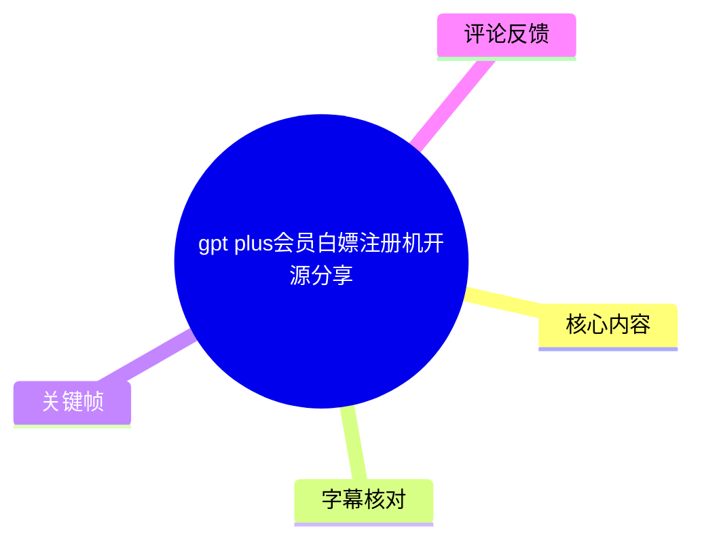
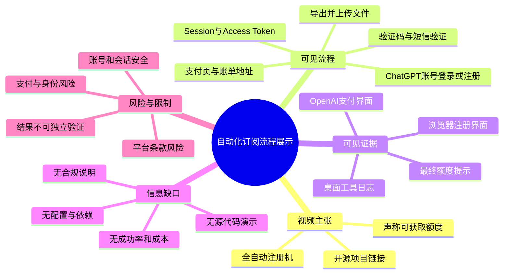
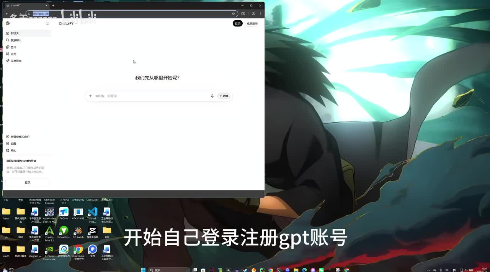
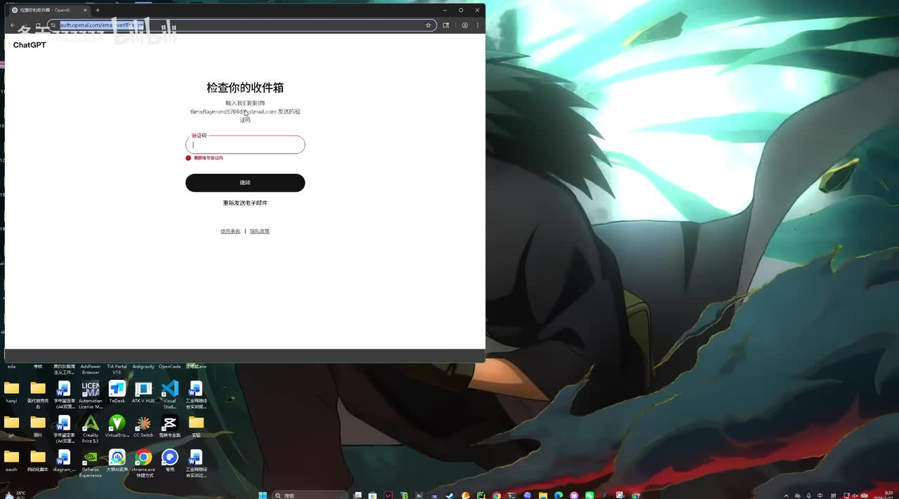
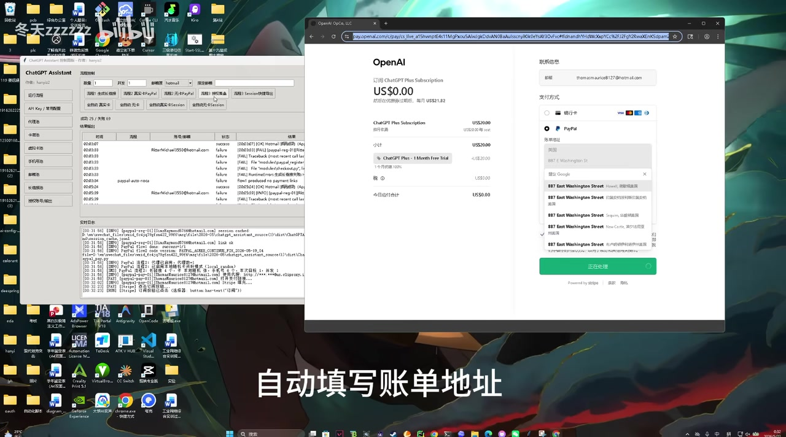
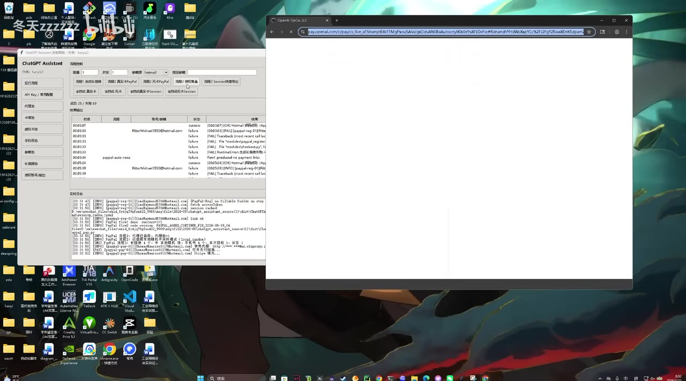

# gpt plus会员白嫖注册机开源分享

> 来源：[Bilibili 视频](https://www.bilibili.com/video/BV17sLY6FE3Z) 
> UP 主：冬天zzzzzz｜发布时间：2026-05-22｜视频时长：04:33｜素材抓取时间：2026-07-16  
> 视频简介声称开源地址为 `https://github.com/hanyi0000/chatgpt-plus-automation-toolkit`，并称后续会出详细教程。

## 小结

视频展示的是一个名为“ChatGPT Assistant”的桌面工具运行过程。UP 主将其描述为“全自动 G-plus 注册机”，画面及 ASR 均显示，该工具试图串联 ChatGPT 账号登录／注册、获取会话信息、进入支付页、填写账单地址、处理人机验证、接收短信验证码、导出文件，以及在另一个页面上传文件并查看“额度获取成功”等环节。

从视频可确认的技术线索包括：工具界面存在运行日志和批量任务列表；浏览器页面包含 OpenAI／ChatGPT 注册及支付界面；流程中出现 `Session`、`Access Token`、人机验证、手机号验证码、PayPal（画面中显示）等词或页面。视频没有展示源代码、依赖安装、配置文件、接口文档、成功率统计、费用、账号来源合法性或可复现实验条件。

视频标题与口播中的“白嫖”“无卡”“自动填写随机账单地址”“打码平台”等表述，指向绕过正常订阅、验证或支付流程的高风险用途。这类行为可能违反服务条款、支付规则及适用法律，也可能涉及账号滥用、身份信息滥用或诈骗风险。因此，本文只记录视频展示的事实、风险与证据边界，**不将其整理为可执行的注册、支付绕过、验证码规避、短信验证自动化或凭据导出教程**。

适合阅读者包括：需要审查自动化工具风险的开发者、平台运营与安全人员，以及希望识别“免费 Plus”“自动注册机”类宣传风险的普通用户。若目的是合规使用 OpenAI 产品，应使用官方注册、订阅与 API 渠道，并避免运行来源不明、会索取会话或令牌的第三方程序。

时效性方面：视频发布于 2026-05-22，素材抓取于 2026-07-16；网页 UI、风控策略、支付方式与服务政策均可能已经变化。视频只证明录制时画面曾如此显示，不能证明工具当前仍可用、功能真实有效或行为合规。

## 思维导图

## 目录

- [背景、来源与风险边界](#背景来源与风险边界)
- [视频时间轴与可见流程](#视频时间轴与可见流程)
  - [工具启动与账号入口](#工具启动与账号入口-0000)
  - [注册页与会话信息说法](#注册页与会话信息说法-0009)
  - [支付页与账单地址](#支付页与账单地址-0111)
  - [验证码、短信与二次验证说法](#验证码短信与二次验证说法-0157)
  - [导出、上传与额度结果](#导出上传与额度结果-0344)
- [可复核的技术信息与缺失参数](#可复核的技术信息与缺失参数)
- [合规替代与安全经验](#合规替代与安全经验)
- [结论与限制](#结论与限制)
- [字幕比对](#字幕比对)
- [评论分析](#评论分析)
- [处理记录](#处理记录)

## 背景、来源与风险边界 [00:00](https://www.bilibili.com/video/BV17sLY6FE3Z?t=0)

视频标题为“gpt plus会员白嫖注册机开源分享”，简介给出一个 GitHub 项目地址，并请求观众点 Star。视频没有提供独立新闻报道、官方公告、版本号、提交记录或第三方测评；因此，“开源”“全自动”“额度获取成功”等均应理解为 UP 主的展示或主张，而不是已被独立验证的产品事实。

ASR 第 1 段（00:00:00,000—00:00:06,460）识别为“给大家分享全自动G-plus注册机点击无卡Session全自動”。其中“G-plus”“无卡 Session”等词存在明显识别与语义歧义，但结合标题和后续画面，可稳妥确认视频在宣介一套与 GPT Plus／订阅相关的自动化流程。不能仅凭该片段确认其具体实现、适用地区或支付机制。

需要特别区分：

- **视频展示事实**：存在一个桌面端工具窗口、浏览器窗口和若干流程性提示；画面包含 ChatGPT/OpenAI 页面及 PayPal 标识。
- **UP 主口播主张**：工具可自动登录／注册、获取会话或访问令牌、处理验证、完成付款并获得额度。
- **无法由素材验证的事项**：是否使用真实或授权账号、是否确实完成合法支付、导出的文件真实格式与权限、所得“额度”具体对应何种服务权益。

## 视频时间轴与可见流程

### 工具启动与账号入口 [00:00](https://www.bilibili.com/video/BV17sLY6FE3Z?t=0)

00:00—00:06 的口播称在分享“全自动”工具。画面序列中可见 Windows 桌面，左侧为名为 **ChatGPT Assistant** 的桌面应用窗口，右侧为浏览器窗口。工具界面有任务表格与实时日志区域，表格中可见成功／失败状态；但文字分辨率不足，不能据此准确抄录字段含义、具体接口或运行参数。

> 图：画面显示浏览器中的 ChatGPT 页面，并叠加“开始自己登录注册gpt账号”的字幕。它证明视频至少展示了账号入口页面，但不证明账号注册已成功，也未显示可复现的操作配置。

### 注册页与会话信息说法 [00:09](https://www.bilibili.com/video/BV17sLY6FE3Z?t=9)

ASR 第 2 段时间为 00:09:150—00:14:250，内容为“开始自己登录注册GPT账号拿到长链接和Access Token”。“Access Token”是明确可识别的技术术语；“长链接”可能指某种回调链接、会话 URL 或其他链接，但视频素材没有提供其完整文本、来源、有效期或用途，不能作进一步断言。

随后画面显示“检查你的收件箱”的账户验证页，表明流程包含邮箱验证步骤。页面中可见一个邮箱地址的局部信息，但不应将画面中潜在个人信息或凭据用于传播、登录或尝试访问。

> 图：浏览器显示 ChatGPT 的“检查你的收件箱”页面及验证码输入区域。该帧的价值在于确认视频流程涉及邮箱验证码，而不是仅停留在工具界面描述；但它不提供合法邮箱来源或验证授权证明。

### 支付页与账单地址 [01:11](https://www.bilibili.com/video/BV17sLY6FE3Z?t=71)

ASR 在 00:45:540—00:48:940 说“现在已经拿到R和长饼接进入PP支付”，该句识别质量较差，无法可靠恢复“R”和“长饼接”的原词。结合后续画面中的 PayPal 标识，较稳妥的记录是：视频声称在获得某些账号／会话相关信息后进入支付环节；其中“PP”**很可能**是对 PayPal 的简称，但 ASR 单独不足以证实。

00:01:11:020—00:01:17:870 的 ASR 内容较清晰：“自动填写账单地址因为是无卡所以所有地均都是随机生成的。”画面同时显示 OpenAI 的订阅结账页面，订阅项为 ChatGPT Plus Subscription，付款选项中可见银行卡与 PayPal；地址下拉建议中有美国地址。该内容涉及随机账单信息和“无卡”叙述，具有明显的支付、身份与平台合规风险，本文不提供填写逻辑、地址生成方法或自动化实现细节。

> 图：画面展示 OpenAI 结账页、付款方式区域和账单地址输入区域，并叠加“自动填写账单地址”字幕。它是辨识视频风险点的重要证据：视频确实触及订阅付款和地址填写，而非单纯介绍代码项目。

### 验证码、短信与二次验证说法 [01:57](https://www.bilibili.com/video/BV17sLY6FE3Z?t=117)

ASR 第 5 段（01:57:460—02:01:360）称出现人机验证码后会使用“达码平台进行消除”；第 6 段（02:58:800—03:02:340）称“达马完成进入下一步抓取手机号验证码”。“达码／达马”可能是 ASR 对某个打码服务或“打码”动作的误识别，现有素材无法确认平台名称、服务商、是否收费或实现方式。

第 7 段（03:08:540—03:20:140）称存在“概率出现二次验证”，并以是否进入“PP 页面”作为阶段性判断。这里可得出的经验性信息仅是：视频制作者自己承认流程具有不确定性，可能触发额外验证。该不确定性意味着流程依赖平台风控状态，不能被当作稳定方法，更不能被理解为可规避验证的保证。

> 图：桌面工具的任务列表、日志区与右侧浏览器窗口同时出现。该帧有助于理解视频采用“本地程序驱动浏览器并记录状态”的展示方式；不过日志文本不完整且部分模糊，不能从中推导配置、账号数据或自动化规则。

### 导出、上传与额度结果 [03:44](https://www.bilibili.com/video/BV17sLY6FE3Z?t=224)

ASR 第 8 段（03:44:880—03:48:980）称“付款成功直接通过Session产出CPA和Subar API文件”；第 9 段（04:06:170—04:09:850）称“现在进入CPA把刚刚导出的文件上传”；第 10 段（04:25:050—04:26:370）称“额度获取成功”。

其中：

- `Session` 是可识别术语，但视频未展示其格式、采集范围、存储方式或授权状态。
- `CPA`、`Subar API` 为 ASR 原文，缺少站内字幕和清晰代码／界面佐证，**不应擅自扩写为某个确定产品、协议或文件格式**。
- “付款成功”“额度获取成功”是 UP 主的口播与画面结果声明；素材未附订单号、官方账单、账户状态详情、额度数值、有效期或可独立验证的后台记录。

因此，这一段可以作为“视频声称完成了后续导出与额度查询”的记录，不能作为订阅状态、付款真实性或 API 权限已获得的证明。

## 可复核的技术信息与缺失参数 [00:09](https://www.bilibili.com/video/BV17sLY6FE3Z?t=9)

### 视频可复核的信息

| 类别 | 可从素材确认的内容 | 证据位置 |
| --- | --- | --- |
| 工具形态 | 有名为“ChatGPT Assistant”的 Windows 桌面程序窗口；包含任务列表和日志区。 | 关键帧 `frame-003.jpg` |
| Web 交互 | 浏览器中出现 ChatGPT 登录／注册、邮箱验证和 OpenAI 订阅结账页面。 | 关键帧 `frame-001.jpg`、`frame-002.jpg`、`frame-004.jpg` |
| 流程术语 | 口播提到 `Session`、`Access Token`、人机验证码、手机号验证码、二次验证。 | ASR 00:09、01:57、02:58、03:08 |
| 付款渠道线索 | 结账页可见银行卡和 PayPal 选项。 | 关键帧 `frame-004.jpg` |
| 结果性主张 | 口播称付款后导出文件、上传文件并“额度获取成功”。 | ASR 03:44—04:26 |

### 视频没有提供的关键参数

以下信息决定工具是否真实、可用、合规和安全，但均未在现有素材中得到充分展示：

| 缺失项 | 为什么重要 |
| --- | --- |
| 源码版本、提交哈希、开源许可证 | 无法判断简介链接与演示程序是否对应，也无法判断使用授权。 |
| 安装步骤、运行环境、依赖清单 | 无法复现实验，更无法评估依赖是否含恶意组件。 |
| 网络、代理、浏览器及账户配置 | 这些常与自动化识别规避和账号滥用相关，视频未透明披露。 |
| 邮箱、手机号及支付资料来源与授权证明 | 关系到身份、支付和账号合法性。 |
| 成功率、失败率、重试上限、实际成本 | 视频只展示局部结果，不能代表稳定性。 |
| 导出文件格式和数据保护方式 | 若涉及会话、令牌或 API 文件，泄露可能导致账户被接管或产生费用。 |
| 服务条款、隐私政策与地域限制 | 未见合规说明，不能据此判断可合法使用。 |

## 合规替代与安全经验 [01:57](https://www.bilibili.com/video/BV17sLY6FE3Z?t=117)

视频对安全审查的启示，不是如何完成自动化，而是如何识别高风险工具与降低损失：

1. **不要使用“白嫖”“无卡”“随机账单地址”“自动过验证”作为正常服务获取方式。** 这类宣传直接触及平台风控、支付验证与身份真实性，风险高于一般脚本自动化。
2. **不要向未知工具提供 Session、Access Token、Cookie、邮箱验证码、短信验证码或支付信息。** 这些数据可能被用于接管账户、消耗余额或进行进一步滥用。
3. **对开源链接进行独立审计。** 即使项目确实公开，也应核对仓库所有者、提交历史、许可证、发布物哈希、依赖来源与网络请求；“开源”本身不等于安全或合规。
4. **采用官方路径。** 需要 ChatGPT 订阅或 API 服务时，应通过官方账户、合法付款方式和官方文档操作；组织使用时应启用最小权限、密钥轮换、账单告警和审计日志。
5. **若已运行类似程序，应优先止损。** 包括撤销活跃会话、重置密码、启用多因素认证、轮换 API 密钥、检查账单与登录记录，并在设备上进行恶意软件排查。若存在异常扣费，应联系相应平台或支付机构的官方支持渠道。

## 结论与限制 [04:25](https://www.bilibili.com/video/BV17sLY6FE3Z?t=265)

视频完整呈现的是一段高风险自动化流程的演示，而不是可验证、可审计的技术教程。其主要叙事链条为：账号入口 → 邮箱验证 → 会话／令牌说法 → 订阅结账页面 → 验证码与短信验证说法 → 文件导出／上传 → “额度获取成功”。其中能够被画面佐证的是界面和工具形态；成功、付款、额度及相关文件权限则主要依赖 UP 主口播，缺乏独立证据。

需要保留的限制包括：

- 视频时长 273 秒，ASR 有效语音仅约 49.95 秒，语音覆盖率约 **18.35%**；大量关键操作处于无语音说明状态。
- 没有可用站内字幕，且 ASR 在专有名词上出现“G-plus”“长饼接”“达马”“Subar”等误识别或不确定转写。
- 关键帧仅能显示局部界面，无法验证后台请求、支付结果、账户状态、文件内容及工具代码行为。
- 该类流程可能很快因网页改版、账户风控、支付规则、地区政策或平台条款变化而失效；更重要的是，其宣传用语本身提示了显著合规和安全问题。

## 字幕比对

| 字幕来源 | 完整性 | 专有名词 | 时间轴 | 主要问题 |
| --- | --- | --- | --- | --- |
| Bilibili 站内字幕 | 未提供可用字幕，无法比较正文内容。 | 无法评估。 | 无可用时间轴。 | 缺失。 |
| 本次 ASR 字幕 | 共 10 段，约 49.95 秒有效语音；相对 272.254 秒音频，覆盖率约 18.35%。 | `Access Token`、`Session` 识别较可信；“G-plus”“R和长饼接”“达码／达马”“CPA”“Subar API”存在歧义。 | 有真实 SRT 时间戳，可直接定位。 | 长静音／无旁白间隔多；最大间隔为 57.44 秒（02:01—02:58），无法仅依靠 ASR 解释全流程。 |

最终采用策略为：**以本次 ASR 的 SRT 时间戳作为章节定位依据，以关键帧画面校验页面类型，不对无法辨认的专有名词作臆测性修正。**

本次 ASR 诊断未标记 `noAudioStream=true`：素材存在音轨，语言识别为中文，置信度为 0.9985；因此不存在“源视频没有音轨”的情形。关键校正与保留如下：

- 将画面中可见的 **ChatGPT／OpenAI／PayPal** 作为页面品牌识别，但不由此推断交易完成。
- 保留 `Session`、`Access Token` 的英文写法，因为 ASR 和语境一致；不记录其内容或使用方式。
- `PP` 仅在“结合 PayPal 画面”的限定下解释为可能指 PayPal。
- 对“长饼接”“达马”“Subar API”等保持 ASR 原样或标注不确定，不擅自替换为具体服务或技术名词。

## 评论分析

以下仅覆盖可获取的热评前三条，评论内容均不构成对视频功能、项目安全性或合规性的验证。

1. **官方plus支持开票**（5 赞）：“没问题哒[打call]”  
   - 观点：对视频作简短支持性回应。  
   - 补充信息：没有提供可验证的技术、支付或安全信息。  
   - 可信度判断：无法据此确认工具可用或行为合规。

2. **卅年卅班**（4 赞）：分享 `https://github.com/qdleader/Awesome-AI-Pedia`  
   - 观点：提供一个外部 AI 资源链接。  
   - 补充信息：该链接与视频简介中的项目地址不同，评论未说明二者关系。  
   - 可信度判断：属于未核验的外链补充，不能视为对本视频项目的背书或替代方案。

3. **音乐人黄小荣**（2 赞）：“大家注意，那些低于5级的号，都是诈骗，都是骗子，大家不要相信，网络安全成员在线提醒你谨慎诈骗”  
   - 观点：提醒观众防范诈骗。  
   - 补充信息：表达了对低等级账号的泛化判断，但没有证据证明该判断适用于任何特定账号。  
   - 可信度判断：其风险提醒方向值得重视，但“低于 5 级均为诈骗”的绝对化结论并不充分；应以项目代码、官方渠道、账户安全行为和支付记录等证据进行判断。

## 处理记录

- **Worker ID**：`worker-mrj0wbly-5dc4e50c`
- **模型**：`gpt-5.6-terra`
- **调用工具与素材**：视频元数据解析、`merged.mp4`、音频文件 `audio/audio.wav`、关键帧目录 `frames/`、ASR 输出 `asr/transcript.srt` 与 `asr/asr-result.json`、评论文件 `comments/comments.json`。
- **ASR 工具信息**：ASR 模型为 `medium`，使用 CUDA 与 `float16`；识别语言为中文，语言概率 0.99853515625；含真实时间戳。
- **字幕选择**：站内字幕未提供可用版本；已检查本次 ASR，且源视频存在音轨。正文以 ASR SRT 的真实分段时间建立时间轴，并以画面进行有限交叉核验。
- **关键帧选择依据**：选用 `frames/frame-001.jpg`（ChatGPT 起始页）、`frames/frame-002.jpg`（邮箱验证页）、`frames/frame-003.jpg`（桌面工具日志与浏览器并列）、`frames/frame-004.jpg`（OpenAI 结账与地址输入页）。选择原则是覆盖视频的账号入口、验证、自动化工具形态及付款风险节点，而非放大潜在凭据或个人信息。
- **缓存清理**：提供的素材与执行记录中未包含缓存清理日志；无法确认是否执行过缓存清理，故不作已清理的声明。
- **未解决问题**：无法确认 GitHub 链接与演示程序是否同一版本；无法验证代码安全性、支付真实性、账号与身份资料授权、导出文件含义、所谓额度的类型与有效期，以及工具当前可用性。
