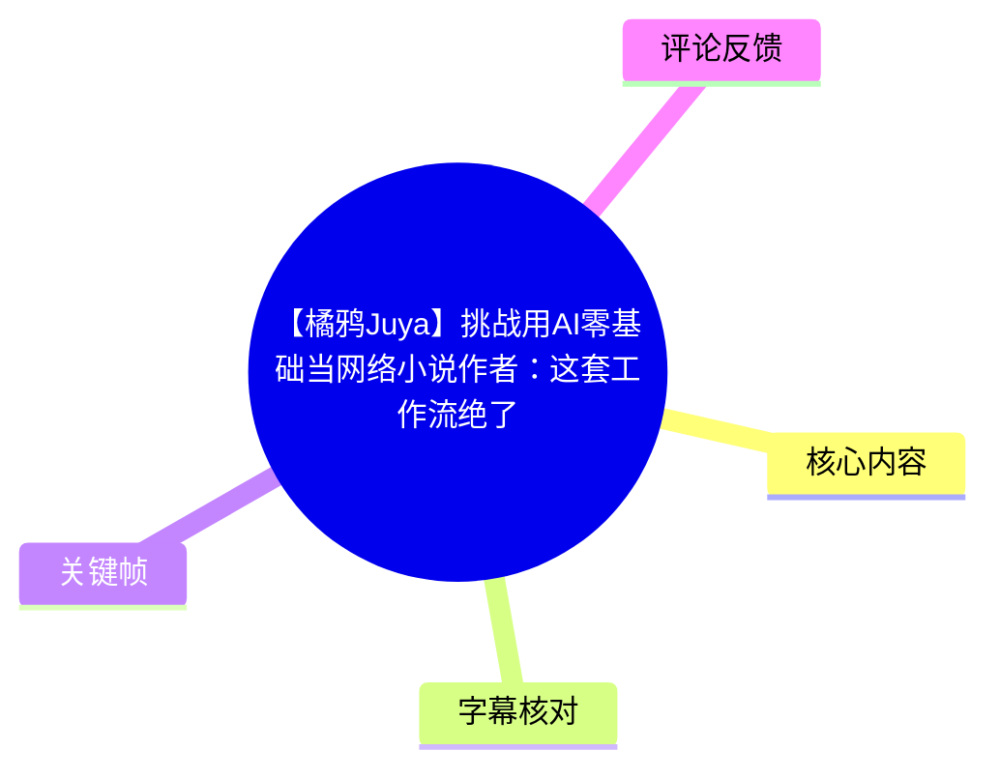
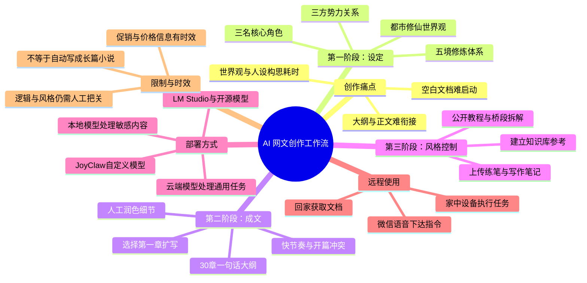
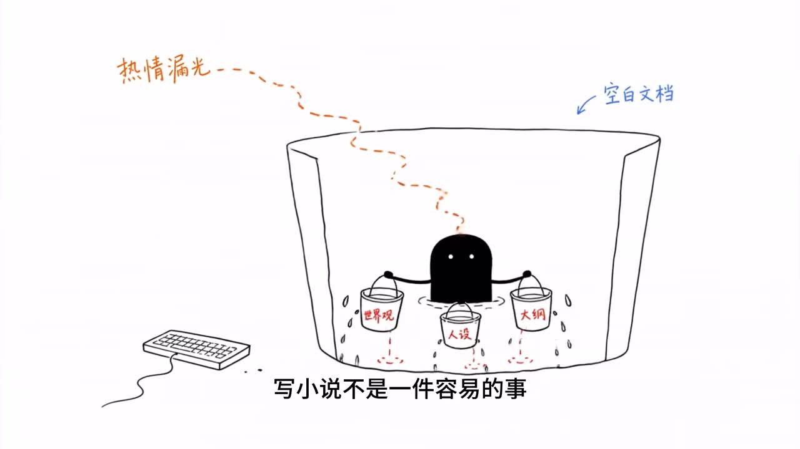
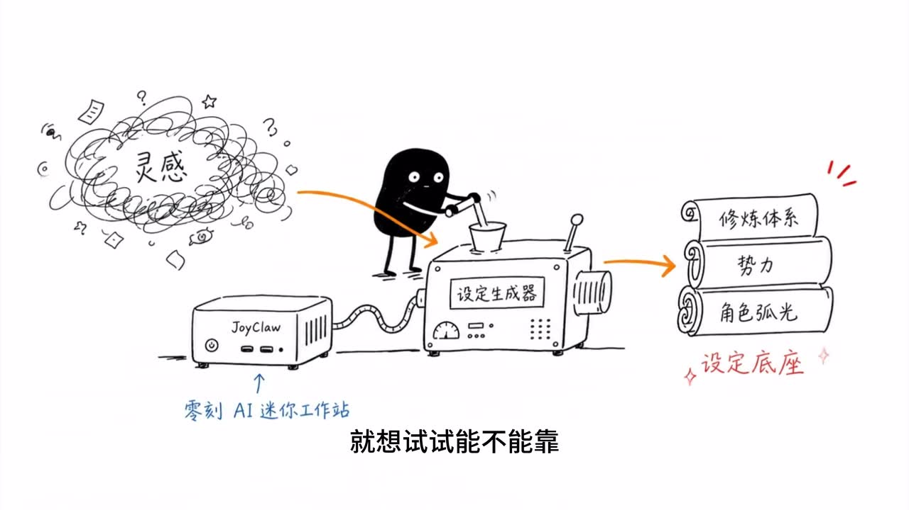
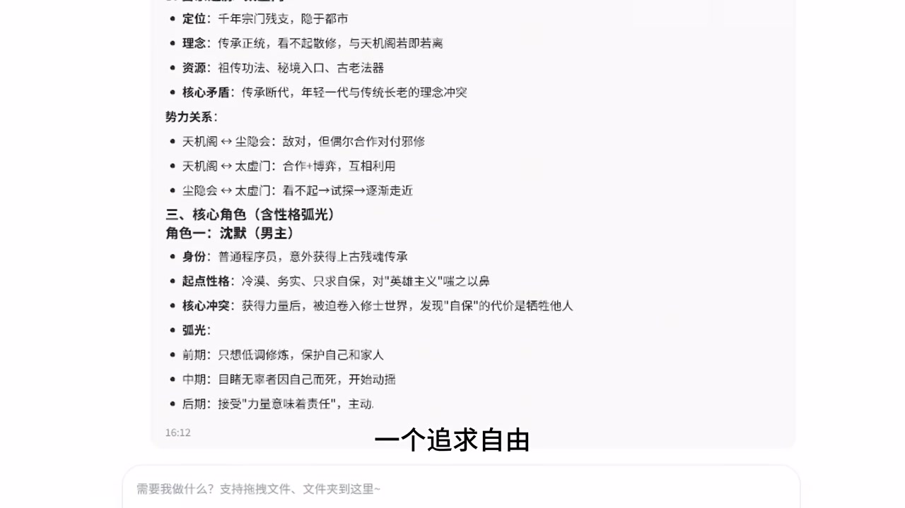

# 【橘鸦Juya】挑战用AI零基础当网络小说作者：这套工作流绝了

> 来源：[Bilibili 视频](https://www.bilibili.com/video/BV1VKVh62E9i)<br>
> UP 主：橘鸦Juya｜发布时间：2026-05-29｜视频时长：03:15

## 小结

视频以“零基础写网络小说”为场景，演示将 AI 作为创作辅助工具的一套顺序化工作流：先生成世界观与人物设定，再生成章节大纲与正文初稿，随后借助个人资料知识库贴近既有写作风格，并按信息敏感程度在云端与本地模型之间分流任务。

UP 主将写作卡点概括为世界观、人设、大纲等前期构思工作带来的消耗。其给出的解决办法不是让 AI 直接替代作者完成作品，而是先让 AI 产出“设定底座”和“剧情骨架”，从而避免面对空白文档无从下手；文中明确表示，文字风格和细节仍需要人工润色。

演示中的提示需求包括：为都市修仙题材设计完整修炼体系、势力划分和三位核心人物；随后生成一个包含 30 章、每章一句话概括的剧情大纲，再把第一章扩写为开篇有冲突、节奏较快的正文。视频称最终设定包含五个修炼境界、三方势力及三名价值取向不同的核心人物。

风格控制是该工作流的第二层。UP 主建议把自己此前的短篇练笔、写作笔记等上传到知识库，使系统参考既有文字风格与叙事习惯；也可加入公开写作教程、经典桥段拆解等材料。但这一步被明确描述为非必需，适合对调性有较强要求的人。

视频还提出本地与云端的任务划分：普通任务可调用云端模型，核心设定与敏感废稿则可走本地模型。UP 主称其使用 JoyClaw，并安装 LM Studio 和开源模型；同时以微信接入为例，展示通勤时发送语音、家中设备执行任务、回家后获得文档的远程工作方式。

需要注意的是，这是一支带有京东 618 促销信息的设备推广视频。视频关于“半小时跑通工作流”、设备能力、补贴、折扣、抽奖、直播活动及 token 价格等均属于视频发布时的宣传口径，存在明显时效性，不能直接视为长期有效的价格、性能或服务承诺。评论区也指出，长篇连载的一致性、伏笔、逻辑维护和 RAG 建设远比短演示复杂。

## 思维导图





## 目录

- [背景：把“写网文卡住”拆为可委托任务](#背景把写网文卡住拆为可委托任务)
- [设定阶段：世界观、势力与角色](#设定阶段世界观势力与角色)
- [大纲与正文：先建立骨架，再人工润色](#大纲与正文先建立骨架再人工润色)
- [知识库：让输出接近个人调性](#知识库让输出接近个人调性)
- [本地、云端与微信远程工作流](#本地云端与微信远程工作流)
- [设备参数、促销信息与时效性](#设备参数促销信息与时效性)
- [可复用的实践步骤与边界](#可复用的实践步骤与边界)
- [字幕比对](#字幕比对)
- [评论分析](#评论分析)
- [处理记录](#处理记录)

## [背景：把“写网文卡住”拆为可委托任务](https://www.bilibili.com/video/BV1VKVh62E9i?t=33)

ASR 在 [00:33.540](https://www.bilibili.com/video/BV1VKVh62E9i?t=33) 起进入口播。UP 主表示，自己曾想写网络小说赚稿费，但每次打开编辑器就会卡住；其所列举的困难包括世界观、人设和大纲，认为这些前期工作会消耗创作热情。

视频的基本思路是把“写小说”拆分成多个可以向 AI 描述的子任务：先处理设定，再处理剧情结构，最后处理初稿与风格。这并非展示一键生成完整长篇小说，而是展示一个从创作启动、设定组织到文档产出的辅助流程。



> 图：画面以“空白文档”与逐渐消失的“热情满光”比喻写作启动困难，并标出世界观、人设、大纲等容器。这张关键帧直接解释了视频为何将 AI 用于前期构思，而非只强调正文生成。

视频称桌面设备为“零刻 AI 迷你工作站”，并使用京东旗下的个人 AI 助手。ASR 将产品名识别为“Joy Call”，但后续画面及语义更接近 **JoyClaw**；下文以画面可见拼写“JoyClaw”为准，并保留 ASR 可能存在专有名词误识别这一限制。



> 图：画面标出“零刻 AI 迷你工作站”和“JoyClaw”，将杂乱灵感输入“设定生成器”，输出修炼体系、势力和角色弧光。它直观呈现了视频的核心分工：AI 先整理设定，作者再据此展开创作。

## [设定阶段：世界观、势力与角色](https://www.bilibili.com/video/BV1VKVh62E9i?t=33)

在 [00:33.540—00:55.820](https://www.bilibili.com/video/BV1VKVh62E9i?t=33)，UP 主首先处理自己最容易卡住的“世界观和人物”环节。其输入需求可整理为：

1. 题材是**都市修仙**；
2. 需要一套完整的修炼体系；
3. 需要划分势力；
4. 需要设置三名核心角色；
5. 角色应具有性格弧光。

视频口播称，生成结果包含以下结构：

| 设定组成 | 视频中的描述 |
| --- | --- |
| 修炼体系 | 分为五境；每个境界有不同定义与突破条件。 |
| 势力关系 | 有三大势力，彼此存在利益纠葛。 |
| 核心角色 | 三人分别倾向于追求利己、正义与自由。 |
| 创作评价 | UP 主主观认为，完整度超过自己苦想三天的结果。 |

关键帧中可见生成内容的一部分：三方势力之间存在敌对、合作、博弈或关系变化；角色示例中还出现了身份、起点性格、核心冲突及前中后期弧光等字段。该画面说明 AI 输出并非只有人物名字或一句简介，而是试图按长篇设定所需字段组织资料。



> 图：画面显示势力关系、角色身份、性格、核心冲突及阶段性弧光等条目。其价值在于补足口播中“五境、三势力、三角色”的抽象描述，说明设定输出被组织成可继续调用的文本资料。

这里的关键经验是：提示词应明确交代题材、需要交付的模块及角色要求，而不是仅输入“帮我写一个小说设定”。不过视频没有展示完整提示词、完整生成结果、模型版本、生成耗时或多轮修改过程，因此无法据此判断该结果的稳定性与可复现质量。

## [大纲与正文：先建立骨架，再人工润色](https://www.bilibili.com/video/BV1VKVh62E9i?t=58)

在 [00:58.640—01:22.980](https://www.bilibili.com/video/BV1VKVh62E9i?t=58)，视频进入第二环节：大纲和正文。

具体操作顺序如下：

1. 基于刚才生成的世界观与人物设定；
2. 要求 AI 生成 **30 章剧情大纲**；
3. 规定每章以**一句话**概括；
4. 从中挑选第一章；
5. 要求直接扩写正文；
6. 对正文提出“节奏要快、开头就要有冲突”的要求；
7. 人工通读结果，并继续润色风格与细节。

视频的判断相对克制：UP 主认为第一章的节奏比自己写得紧凑，但并未声称可以直接发布；其明确指出，文字风格和细节仍然需要自己润色。AI 在这一段的定位是快速形成“骨架”，而不是替代编辑、作者或长期连载中的一致性维护工作。

可复用的提示结构可概括为：

```text
输入：
- 已确认的世界观、力量体系、势力关系、人物动机
- 输出格式：30章，每章一句话
- 当前章节：第1章
- 正文要求：节奏快，开头即出现冲突

人工复核：
- 冲突是否服务人物动机
- 章节信息是否与既有设定一致
- 叙述口吻是否符合目标读者
- 细节、节奏和语言是否需要重写
```

视频没有提供第一章全文，也没有展示 30 章大纲的全部内容，因此无法评价其具体文笔、伏笔质量、逻辑闭环或是否适合实际平台连载。

## [知识库：让输出接近个人调性](https://www.bilibili.com/video/BV1VKVh62E9i?t=82)

在 [01:22.980—01:47.020](https://www.bilibili.com/video/BV1VKVh62E9i?t=82)，UP 主提出避免 AI “凭空编写”的补充方法：向知识库提供自己的既有材料。

可加入的材料包括：

- 过去写过的短篇练笔；
- 自己整理的写作笔记；
- 网上公开的写作教程；
- 对经典桥段的拆解资料。

其预期作用是让 AI 学习或参考作者已有的文字风格和叙事习惯，使输出更接近目标调性。视频特别说明：上传个人材料并非必要步骤；如果使用者对风格没有强执念，可以先只使用设定—大纲—初稿的基础流程。

这一段可理解为“先检索后生成”的创作准备思路，但视频没有说明知识库的具体实现方式，例如文档格式、分段策略、索引方式、检索范围、上下文长度、引用机制或版权过滤机制。因此，“学习风格”应理解为视频中的使用体验描述，而不应延伸为系统具备长期训练或稳定模仿能力的已验证结论。

## [本地、云端与微信远程工作流](https://www.bilibili.com/video/BV1VKVh62E9i?t=107)

在 [01:47.020—02:35.220](https://www.bilibili.com/video/BV1VKVh62E9i?t=107)，视频区分了云端模型和本地模型的使用场景。

### 视频所述部署与分工

| 项目 | 视频中的说法 | 适用意图 |
| --- | --- | --- |
| 云端模型 | 前文演示基本调用云端模型。 | 处理通用写作任务。 |
| 本地大模型 | 该迷你工作站本身也能运行。 | 处理希望留在本机的信息。 |
| JoyClaw | 支持自定义模型。 | 作为接入模型与工作流的界面或工具。 |
| LM Studio | UP 主称已安装。 | 用于安装、调用开源模型的本地环境。 |
| 核心设定、敏感废稿 | 视频建议走本地。 | 降低把敏感内容发送到云端的需求。 |
| 通用任务 | 视频建议走云端。 | 使用云端模型完成一般工作。 |

这里的“敏感内容走本地”是工作流建议，而不是对安全性的绝对保证。实际隐私边界还取决于模型下载来源、软件遥测、联网插件、文件权限、微信接入方式、局域网暴露情况及使用者自身配置；视频未展示这些安全设置。

### 通勤灵感的远程处理

视频给出的远程场景是：

1. 人在通勤途中产生灵感；
2. 在手机微信中发送语音；
3. 指令传到家中的设备；
4. 家中“零刻”设备开始执行任务；
5. 回到家后，详尽文档已输出到桌面。

这一流程的价值在于把碎片化灵感转为待处理任务，减少“发给自己微信—回家复制粘贴”的中断步骤。但视频没有展示微信接入的配置步骤、身份验证、消息权限、语音转写质量、失败重试、设备离线处理或文档具体保存位置，因而不能据此直接复现完整远程链路。

## [设备参数、促销信息与时效性](https://www.bilibili.com/video/BV1VKVh62E9i?t=155)

在 [02:35.220—03:14.780](https://www.bilibili.com/video/BV1VKVh62E9i?t=155)，视频总结该设备可用于跑本地模型、搭知识库、接入微信远程控制，以及其他需要 AI 算力的场景。

视频明确提到的设备参数为：

| 参数 | 视频表述 |
| --- | --- |
| 处理器 | AMD 锐龙 AI Max+ 395 |
| 内存 | 128GB 高频内存 |
| 形态 | 安静、小巧的迷你工作站 |
| 定位 | 放在桌角的“私人 AI 服务器” |

UP 主还称，从开箱到跑通整个工作流可在半小时内完成。该说法没有附带安装步骤、网络条件、模型大小、下载时间、系统配置或失败案例，适合作为其演示体验，不应理解为所有用户都能达到的通用时长。

### 促销与活动信息

视频结尾包含以下商业推广信息：

- 618 期间在京东搜索“电脑 618”；
- 宣传“国补叠以旧换新低至 5 折”；
- 宣传会场可抽“万元 AI 电脑”；
- 提及 6 月 10 日“笔吧评测室”将进入京东电脑直播间；
- ASR 末段还识别到“千万两级 tokens 仅需一元”等内容，但该处识别文本存在明显错字和断词，无法据现有素材准确还原活动名称、token 数量或具体价格规则。

上述内容均是发布时的营销信息，可能受到地区、资格、库存、活动规则、补贴政策和时间窗口影响。应以活动页面的实时条款为准，不能将“低至 5 折”等宣传语视为任何具体设备必然可获得的成交价。

## [可复用的实践步骤与边界](https://www.bilibili.com/video/BV1VKVh62E9i?t=33)

基于视频演示，可将这套创作辅助流程整理为以下实践清单：

### 1. 先定义“设定交付物”

不要笼统要求 AI 写小说，而是一次写清：

- 题材与背景；
- 力量体系及等级数量；
- 势力数量和关系；
- 核心角色数量；
- 每名角色需要具备的字段，例如动机、性格、冲突和成长方向。

视频的都市修仙案例，使用了“五境修炼体系、三大势力、三名核心人物”的明确范围。

### 2. 将设定转换为可检查的大纲

在已有设定基础上，要求生成 30 章、每章一句话的大纲。这样做的价值是先检查主线推进、人物出场和冲突位置，而不是在正文写完后才发现方向偏离。

### 3. 以章节为单位扩写并提出硬约束

视频针对第一章提出“节奏快、开头有冲突”。这种约束应该随章节目标变化而调整，例如首章强调钩子，中段强调信息揭示，转折章强调人物选择。视频未展示更多章节，因此这属于根据其方法作出的可迁移整理，而非原视频已验证的完整章节模板。

### 4. 用个人材料辅助风格一致性

将练笔、笔记和公开参考资料放入知识库，作为输出前的参考上下文。对于自有文本，应先确认是否愿意将其交由所选服务处理；对于网上资料，应注意版权、授权范围与平台规则。

### 5. 按信息敏感度分流模型

- 通用构思、普通提纲等内容可考虑云端模型；
- 不希望离开本机的核心设定、敏感废稿，可考虑本地模型；
- 在接入远程消息工具前，先确认设备、账号与文件路径的安全设置。

### 主要限制

1. **AI 初稿不等于可发布正文。** 视频自己也承认文风和细节仍需人工润色。
2. **长篇逻辑未被演示验证。** 30 章提纲和首章初稿不能证明十万字以上连载仍能保持设定一致。
3. **知识库细节缺失。** 视频没有给出 RAG、文档索引、召回精度等实施细节。
4. **本地部署门槛未展开。** 虽提到 LM Studio 和开源模型，但没有给出模型名称、量化版本、显存/内存占用、安装命令或性能数据。
5. **远程微信链路未展示配置。** 不能仅凭口播推断其稳定性、安全性与适用范围。
6. **推广信息有时效。** 促销价格、补贴和直播活动应以实时页面规则为准。

## 字幕比对

| 字幕来源 | 完整性 | 专有名词 | 时间轴 | 主要问题 |
| --- | --- | --- | --- | --- |
| Bilibili 站内字幕 | 很低，仅覆盖 00:00.820—00:48.000 的音乐标记 | 未提供可用专有名词 | 有真实 SRT 时间段，但无口播内容 | 全部为“♪ 音乐 ♪”，未覆盖主体讲解。 |
| 本次 ASR 字幕 | 较高，诊断为 156.44 秒语音、覆盖率 80.23%，口播覆盖 00:33.540—03:14.780 | 存在误识别和断词 | 有真实 SRT 时间段，可用于章节时间轴 | 首段被异常切分为极短片段；“Joy Call / Joy-Core”“零克”“30张”“光响”等词存在识别偏差。 |

最终以**本次 ASR 时间轴**作为正文各章节定位依据，因为它覆盖了视频主体口播；站内字幕只提供前段音乐标记，无法用于内容整理。本次 ASR 已检查，诊断中未标记 `noAudioStream=true`，且明确检测到约 156.44 秒语音，因此不存在“源视频没有音轨”的情况。

结合关键帧画面与上下文进行的重点校正如下：

| ASR 原文或疑似误识别 | 正文处理 | 依据与说明 |
| --- | --- | --- |
| “Joy Call” | JoyClaw | 关键帧设备与界面可见“JoyClaw”字样。 |
| “Joy-Core” | 保留为“Joy-Core” | ASR 在本地模型、自定义模型和微信接入段连续识别为该名称；但未提供清晰界面文字，无法进一步确认其产品拼写。 |
| “零克” | 零刻 | 视频画面和常见品牌写法均指向“零刻”；正文标注为视频所称零刻工作站。 |
| “30张” | 30章 | 上下文为网络小说剧情大纲，语义应为章节数量。 |
| “光响” | 角色弧光 | 画面文字和写作语境支持“角色弧光”。 |
| “冴作教程” | 写作教程 | 明显语音识别错字。 |
| 末段 token 促销句 | 不还原具体数值与规则 | ASR 断词、错字严重，现有素材不足以准确核验。 |

## 评论分析

仅分析当前可获取的热评前三条；评论属于观众观点或回忆，不作为已经验证的事实。

1. **Intel-AMD-NVIDIA（102 赞）**  
   评论称“浓眉大眼的不报早报在这写网文了”，以玩笑方式表达对 UP 主内容方向的印象。它没有提供可核验的技术信息，也未直接评价工作流效果，主要反映观众对创作者既有内容标签的认知。

2. **龙台noc（41 赞）**  
   评论认为事情“没这么简单”，指出自动化创作到后期可能不如手写，并提出若要维护长篇小说，仍需处理去 AI 化、约束条件、信息差、伏笔、风格和逻辑正确性；尤其提到十万字之后可能需要搭建 RAG。该评论是对视频短流程演示的重要补充：它强调长篇工程化管理的复杂度。不过，这些判断没有附带具体实现案例或测试数据，应视为合理的经验性提醒，而非对视频方案已完成的技术证伪。

3. **青林鬼吟（38 赞）**  
   评论称 UP 主从 Gemini 3 尚未推出时就表示要写文。这是关于创作者过往表达的回忆性信息，当前素材未提供历史视频或原始发言，无法核验。它能说明观众认为“写作”并非临时选题，但不能据此推导创作者的实际写作经历或本视频工作流的有效性。

## 处理记录

- Worker ID：worker-mrj0www4-e8d79408
- 模型：gpt-5.6-terra
- 调用工具与素材：使用任务提供的视频元数据、站内 SRT、ASR 结果与 ASR SRT、关键帧清单及可获取热评前三条进行整理；ASR 模型为 `medium`，语言识别为中文，运行设备为 CUDA、`float16`。
- 字幕选择：站内字幕仅有前 48 秒的音乐标记，未覆盖正文；已检查本次 ASR，采用其真实 SRT 时间段作为主体时间轴，并结合关键帧和上下文校正明显专有名词与断词。
- 关键帧选择依据：选用 `frames/frame-001.jpg` 说明写作启动困境，`frames/frame-002.jpg` 说明 AI 设定生成工作流，`frames/frame-004.jpg` 展示势力关系与角色弧光等结构化设定结果；均与对应正文主题直接相关。
- 评论范围：仅处理可获取的热评前三条，未扩展至其他评论。
- 缓存清理：素材中未提供缓存清理执行记录，无法确认是否已清理。
- 未解决问题：未提供完整提示词、完整大纲与正文、JoyClaw/Joy-Core 的具体版本和配置、LM Studio 所装模型名称、知识库实现细节、微信接入配置及活动促销规则原文；相关内容均未作补充推断。
