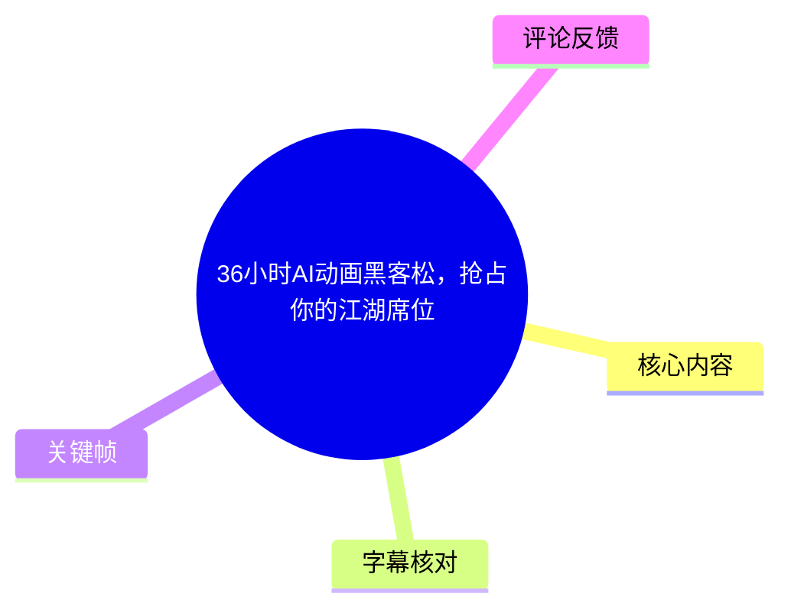
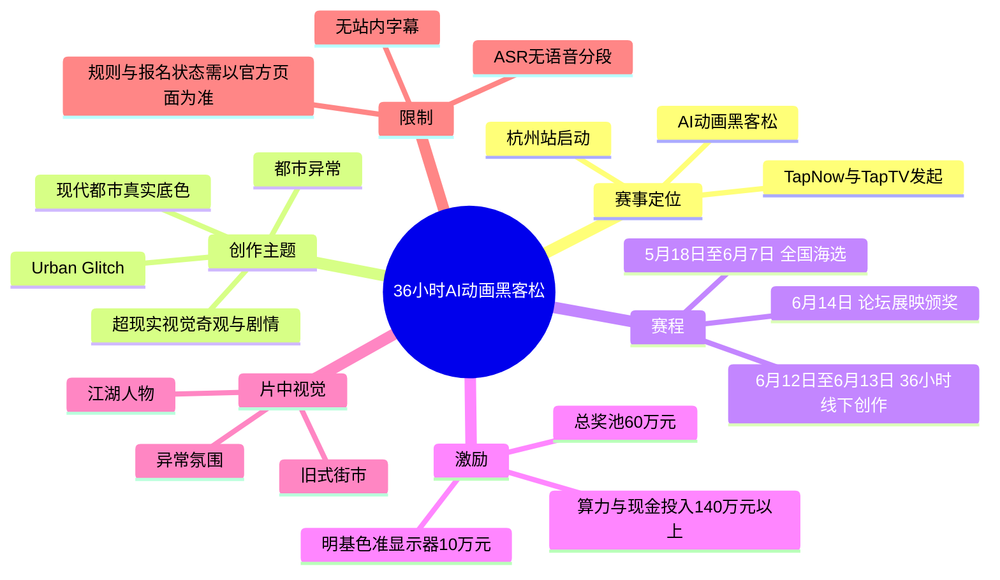
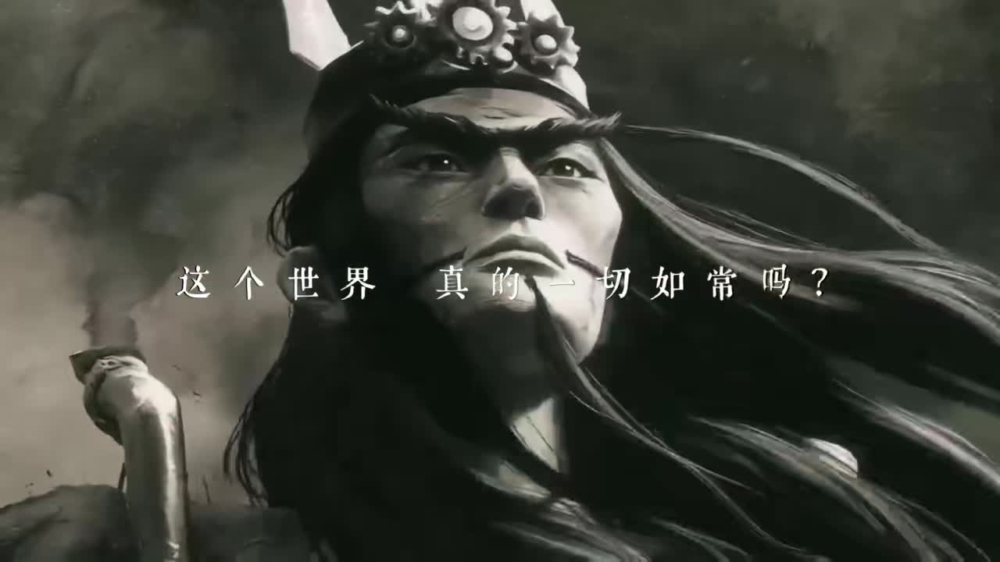
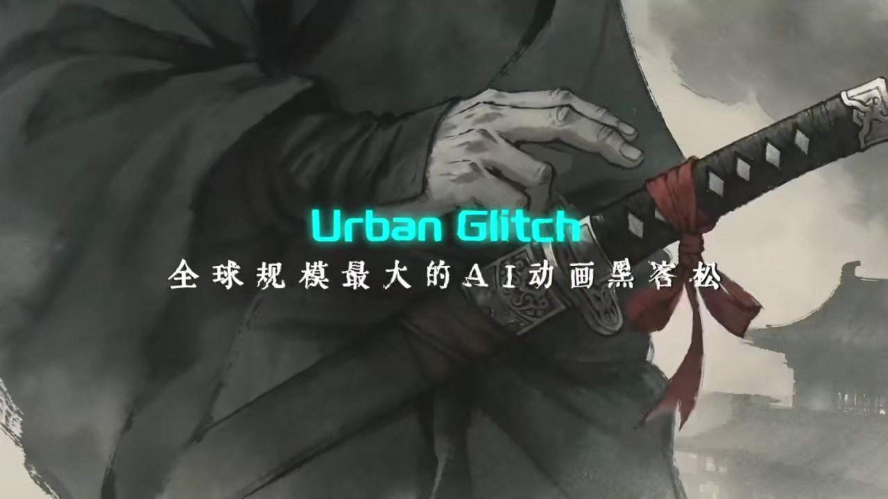
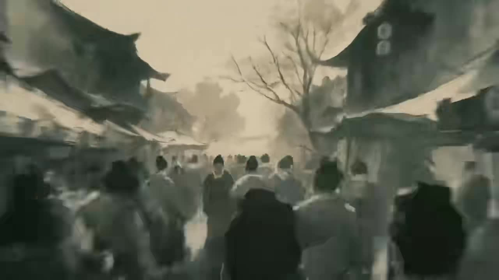

# 36小时AI动画黑客松，抢占你的江湖席位

> 来源：[Bilibili 视频](https://www.bilibili.com/video/BV1KL796CE9b) 
> UP 主：TapNow｜发布时间：2026-06-03｜视频时长：00:50｜分辨率：1280×720

## 小结

这是一支为 TapNow / TapTV AI 动画赛事制作的 50 秒宣传片，核心信息是：杭州站赛事启动，创作者可围绕 **「Urban Glitch 都市异常」**主题参加全国海选、36 小时线下极限创作赛、论坛展映与颁奖环节。

赛事在简介中被描述为面向全球 100 支队伍的 AI 动画黑客松，并给出总奖池 **60 万元**、明基色准显示器 **10 万元**、创作算力与现金投入 **140 万元以上**、人均或每队平均奖励 **1.4 万元**等激励信息。上述奖励口径均来自视频简介，参与者应以报名页面的正式规则为准。

片中以古风江湖人物、旧式街市与烟雾氛围构建“都市异常”的视觉反差；画面文字明确呈现“这个世界真的一切如常吗？”、“现代都市 × 超现实异常”与“Urban Glitch”。它展示的是创作命题与风格方向，不是 AI 动画生产工具的操作教学，也未给出模型、提示词、镜头控制、工作流或技术参数。

适合关注 AI 动画竞赛、AIGC 短片创作、限时团队协作及 TapNow 赛事机会的创作者阅读。由于赛事日期为 **5 月 18 日至 6 月 14 日**的阶段性安排，且视频发布于 2026 年 6 月，报名、名额、奖励、地点和规则具有明显时效性，不能据此直接判断当前仍可报名。

本视频未提供可用的 Bilibili 站内字幕；本次 ASR 也没有输出任何语音分段。诊断只表明未识别到可转写的人声，**并未标记 `noAudioStream=true`**，因此不能断言视频没有音轨。本文的文字信息以视频简介及关键帧中可见的画面文字为依据，并将无法从素材确认的细节明确保留为未知。

## 思维导图

## 目录

- [赛事主题与宣传片叙事](#赛事主题与宣传片叙事)
- [赛程、规模与奖励信息](#赛程规模与奖励信息)
- [参赛与创作准备](#参赛与创作准备)
- [画面关键帧与视觉表达](#画面关键帧与视觉表达)
- [限制、时效性与待核验事项](#限制时效性与待核验事项)
- [字幕比对](#字幕比对)
- [评论分析](#评论分析)
- [处理记录](#处理记录)

## [赛事主题与宣传片叙事](https://www.bilibili.com/video/BV1KL796CE9b?t=0)

> 当前没有可用的站内 SRT 或 ASR 分段，无法为片内各画面建立经字幕验证的精确起止时间；本节链接定位到视频起点。

视频标题以“36 小时 AI 动画黑客松，抢占你的江湖席位”概括其传播目标：通过江湖意象召集 AI 动画创作者参与限时竞赛。视频简介将其表述为“群雄江湖集结，杭州站正式拉开帷幕”，并称赛事涉及全球 100 支队伍。

片中可读文字与简介共同指向创作主题：

- 英文主题：**Urban Glitch**
- 中文主题：**都市异常**
- 创作方向之一：扎根现代都市的真实底色。
- 创作方向之二：引爆具有视觉奇观和精彩剧情的表达。

这里的“都市异常”不是对某种具体技术效果的标准定义，而是赛事所给出的创作命题。根据简介文字，可以将其理解为：以可识别的现代都市生活为现实基底，再引入超现实、错位、异变或强风格化的叙事与视觉元素。片中以古代江湖形象、街市群像、雾气和冷灰色调做示范性氛围表达，但并未规定参赛作品必须使用古风题材。

> 图：画面以戴有齿轮装饰头冠的人物配合“这个世界真的一切如常吗？”的提问，先建立“日常表象可能被打破”的叙事悬念。这是理解“都市异常”主题情绪基调的重要关键帧。

## [赛程、规模与奖励信息](https://www.bilibili.com/video/BV1KL796CE9b?t=0)

> 无可用字幕时间码；链接定位至视频起点。以下日期和数额来自视频简介，而非 ASR 转写。

### 赛程

| 阶段 | 日期 | 简介中的说明 |
| --- | --- | --- |
| 全国海选初筛 | 5 月 18 日—6 月 7 日 | 初筛 100 支队伍 |
| 线下极限创作赛 | 6 月 12 日—6 月 13 日 | 36 小时线下创作 |
| 论坛、展映与颁奖 | 6 月 14 日 | 论坛、作品展映与颁奖典礼 |

“36 小时”明确对应 6 月 12 日至 13 日的线下极限创作赛，而不是整个赛事从海选到颁奖的总周期。简介没有提供每个阶段的精确开始和结束时刻，也没有说明 36 小时内是否包含签到、路演、提交、评审或休息安排。

### 规模与奖励

| 项目 | 视频简介给出的信息 | 解读限制 |
| --- | --- | ---|
| 队伍规模 | 全球 100 支队伍 | 简介同时提到全国海选初筛“100 支队伍”；两种表述是否为同一入围规模，素材未作进一步解释。 |
| 总奖池 | ¥600,000 | 未列明奖项等级、获奖人数与现金/实物构成。 |
| 明基色准显示器 | ¥100,000 | 未说明具体型号、数量、分配规则及是否计入总奖池。 |
| 创作算力与现金投入 | ¥1,400,000+ | “投入”不等同于参赛者可直接获得的奖金，具体兑现方式未知。 |
| 平均奖励 | 人均/队平均 ¥14,000 | 原文采用“人均/队平均奖励”表述，统计口径不清，不能据此推导每位成员或每支队伍的保底收益。 |

> 图：关键帧直接显示“Urban Glitch”及“全球规模最大的 AI 动画黑客松”字样，是视频对赛事主题和定位的核心视觉表述。对于“全球最大”的宣传性措辞，素材未提供可独立验证的统计标准，应视为主办方主张。

## [参赛与创作准备](https://www.bilibili.com/video/BV1KL796CE9b?t=0)

> 无字幕分段，无法将以下简介中的报名信息精确对应到视频秒点。

### 官方入口与可确认动作

视频简介提供的报名与详情入口为：

- TapTV「竞技场」：<https://app.tapnow.ai/event/27>
- 简介原意为：可通过该页面报名并了解更多赛事详情。

在仅依据当前素材的前提下，能够确认的动作只有“访问该活动页了解与报名”。素材**没有**提供以下关键参赛规则，不能自行补全：

- 个人参赛还是必须组队；
- 队伍人数、成员身份与地域限制；
- 报名截止的准确时刻；
- 作品时长、格式、分辨率、提交平台与命名规范；
- 是否限定使用 TapNow、Midjourney 或其他指定模型；
- 是否可使用已有素材、第三方资产或开源模型；
- 评审维度、版权归属、商用许可与争议处理方式；
- 差旅、住宿、设备与线下场地支持；
- 奖项对应条件及发放规则。

### 面向 36 小时限时创作的可迁移经验

以下是由“36 小时线下极限创作”这一已知赛制所引出的准备建议，属于整理者的通用建议，**不是视频披露的官方规则或流程**：

1. **先把主题拆成可执行的叙事句。**  
   以“现代都市真实底色 + 异常事件”为双约束，例如明确异常发生地点、人物欲望、冲突升级和结尾状态，避免只做风格拼贴。

2. **压缩资产与镜头规模。**  
   限时竞赛更适合优先保证角色一致性、场景连续性和可交付性；在没有规则限制信息时，不应假定可以无限时生成或后期返工。

3. **提前明确团队分工。**  
   可按策划/分镜、视觉生成、视频生成与剪辑、声音与交付进行分工；实际分工应服从官方对队伍人数和工具使用的规定。

4. **把交付风险前置核验。**  
   报名前或开赛前应核对提交格式、截止时间、网络条件、算力额度、素材授权和备份方案。上述事项均未在本素材中给出，必须以活动页或主办方后续公告为准。

## [画面关键帧与视觉表达](https://www.bilibili.com/video/BV1KL796CE9b?t=0)

> 关键帧没有附带可用的逐帧时间戳，以下按画面内容归纳，不将其伪标注为精确秒点。

### 1. 用“不如常”的提问建立悬念

开场关键帧使用低饱和、强阴影的人物近景，并叠加“这个世界真的一切如常吗？”文字。其价值在于：它没有先解释比赛规则，而是先以疑问驱动观众进入“异常”主题，为后续主题标题和赛事信息建立情感入口。

> 图：角色服装和头部机械装饰融合古风与机械感，提供了“现实秩序被异质元素侵入”的视觉线索。

### 2. 用人群与街市制造世界观尺度

> 图：画面展示一条拥挤的旧式街市与大量行人。它的价值在于把“异常”从单个人物的设定扩展到公共空间，让创作者可参考“日常人流场景发生异变”的叙事思路。

该画面整体仍偏历史或武侠语境，并非现代城市实拍场景。因此，它只能说明宣传片选择了江湖化的视觉包装，不能证明赛事作品必须在古代场景中创作。

### 3. 以人物动作与烟雾强化“超现实异常”

> 图：画面中央人物俯身动作，前景与背景均有烟雾，且可见“现代都市 × 超现实异常”文字。这一帧最直接地把简介中的主题方向转为可感知的视觉语言：现实环境、人物行为和异常氛围被并置。

对于创作而言，该画面可提供的是“现实感与异常感同时成立”的方向，而不是可复制的技术方案。素材没有交代这一效果是否由图像模型、视频模型、传统动画、合成、调色或多种工具共同完成。

### 4. 以主题字卡完成赛事召集

> 图：画面将青色高亮的“Urban Glitch”置于人物佩刀和月色意象之上，兼具主题识别与江湖召集感。它有助于理解标题中“江湖席位”并非规则术语，而是宣传文案中的风格化表达。

## [限制、时效性与待核验事项](https://www.bilibili.com/video/BV1KL796CE9b?t=0)

### 信息边界

本视频是赛事宣传短片，信息密度集中在主题、时间、奖励和报名入口，不是教程、规则手册或评审说明。因此不能从素材中推出：

- AI 动画制作的具体软件与模型组合；
- 任何提示词、采样参数、画幅参数、帧率、生成时长或算力配额；
- 作品质量标准与具体评分占比；
- “全球规模最大”这一定位的统计范围与比较依据；
- 所有奖励的获奖概率、保证金额或实际可得额度。

### 时效性

1. 视频元数据显示发布时间为 **2026-06-03**。  
2. 简介中的海选截止日期为 **6 月 7 日**，线下赛为 **6 月 12 日—13 日**，论坛、展映与颁奖为 **6 月 14 日**。  
3. 这些节点均属于具体一期活动日程；阅读时若已超过相应日期，不能将视频视为当前开放报名的证明。  
4. 链接能否访问、活动是否延期、规则是否更新、奖品是否变更，均需要以 TapTV 活动页或主办方最新公告核验。

### 名称与表述核验

- **TapNow / TapTV**：视频发布者为 TapNow，简介引导至 TapTV「竞技场」活动页；两者在赛事组织中的具体角色关系，素材未解释。
- **明基色准显示器**：是简介中列出的福利项，但没有型号、数量与奖项对应关系。
- **Midjourney**：出现在视频标签中；标签可以反映关联话题，但不构成“该赛事要求或必然使用 Midjourney”的证据。
- **视频制作署名**：简介标注“视频制作：TapTV 签约导演 @海风质检员”。

## 字幕比对

| 字幕来源 | 完整性 | 专有名词 | 时间轴 | 主要问题 |
| --- | --- | --- | --- | --- |
| Bilibili 站内字幕 | 未提供可用字幕 | 无法核验 | 无可用分段 | 无站内 SRT 或可用文本，不能用于转录、校时或专名校正。 |
| 本次 ASR 字幕 | 空 | 无法识别 | ASR 文件具备时间戳能力，但实际 `segments` 为空 | 识别语言被自动判定为英语，概率 0.541015625；语句数、语音秒数与语音覆盖率均为 0。诊断提示未识别到语音分段。 |

### 最终字幕选择与校正方法

未采用任何字幕作为正文转录来源，原因是站内字幕缺失，且本次 ASR 输出为空。ASR 诊断中仅出现“未识别到语音分段”的警告，**没有 `noAudioStream=true` 标记**；因此应如实表述为“没有可供转写的 ASR 语音内容”，而不能将其描述成已确认的无音轨视频，也不能将其简单归因为工具失败。

本文采用以下证据优先级：

1. 视频元数据与 UP 主简介中的赛事文字；
2. 关键帧中可直接辨认的文字，包括“这个世界真的一切如常吗？”、“现代都市 × 超现实异常”与“Urban Glitch”；
3. 画面可见的角色、街市、烟雾、刀剑和风格元素。

经关键帧和简介核对后保留的关键名称包括：**Urban Glitch、都市异常、TapNow、TapTV、明基色准显示器、杭州站、36 小时**。其中“全球规模最大的 AI 动画黑客松”为关键帧中的宣传定位，不作为已独立证实的客观排名。

## 评论分析

仅分析当前可获取的热评前三条；评论反映的是观众感受或提问，不替代赛事事实。

| 排名 | 评论与点赞 | 观点概括 | 补充价值、争议与可信度 |
| --- | --- | --- | --- |
| 1 | 功夫夫功，74 赞：“做常人不做之事……” | 以带有哲思和鼓励性质的文字回应视频所营造的突破常规、独立思考氛围。 | 未提供赛事规则、报名或作品制作方面的可验证补充信息；属于情绪表达。 |
| 2 | cvv长春，50 赞：“开头的是洪秀全吗？” | 观众对开场人物原型提出猜测。 | 素材仅能确认开场出现古风/历史感人物及机械装饰，未提供角色姓名或原型说明，不能据此确认该人物是洪秀全。 |
| 3 | 柠4，49 赞：“牛，就这个宣传片就是抛玉引玉了属于是” | 认可宣传片的视觉质量，并认为它能吸引更优秀的创作者或作品。 | 这是对营销片创意和制作效果的主观评价；与视频“以作品吸引创作者参赛”的传播目标相吻合，但不构成赛事质量或奖金兑现的证据。 |

## 处理记录

- **Worker ID**：worker-mrj0wbly-5dc4e50c
- **模型**：gpt-5.6-terra
- **调用工具与素材**：使用任务提供的视频元数据、视频简介、ASR 覆盖诊断与空 ASR 结果、热评前三条、关键帧列表及可见关键帧画面；未获得可用站内字幕文件。
- **字幕选择**：站内字幕不可用；本次 ASR 的 `segments` 为空，未用于转录。正文以简介和关键帧可见文字为依据，并避免编造旁白内容与分段时间。
- **时间轴依据**：由于没有站内 SRT 起止时间，也没有 ASR 语音分段，不能建立可靠的细粒度秒点；所有章节时间轴链接均定位到 `t=0`，并在相应章节明确说明原因。
- **关键帧选择依据**：选用 `frame-001.jpg`、`frame-002.jpg`、`frame-003.jpg`、`frame-004.jpg`，分别对应开场设问、街市人群、现代都市与超现实异常的主题文字、以及“Urban Glitch”赛事定位字卡；这些画面最能支撑正文中关于主题和宣传视觉的描述。
- **缓存清理**：任务未提供可执行的缓存清理日志或结果；本文不虚构已清理状态。
- **未解决问题**：无法从当前素材确认片中旁白、音乐内容、精确画面时间点、赛事完整规则、队伍人数、提交规范、评审标准、奖项分配及活动页在当前时点的有效性。
