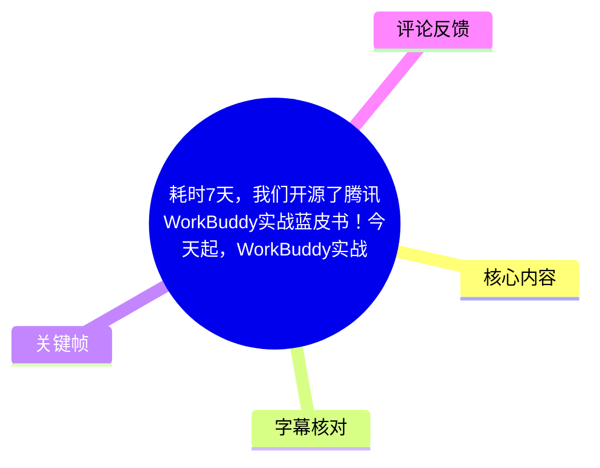
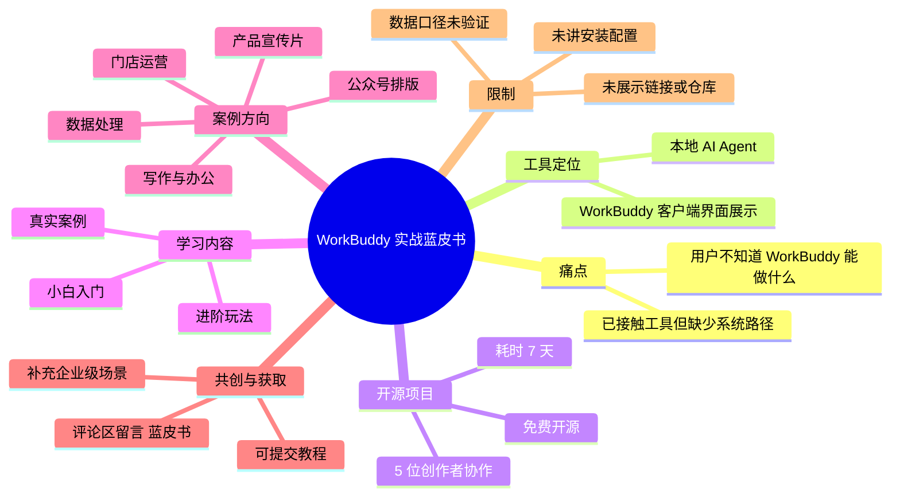
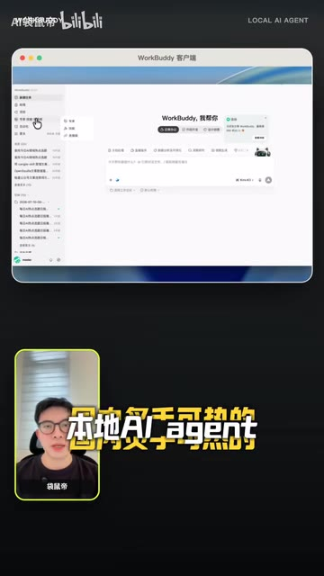
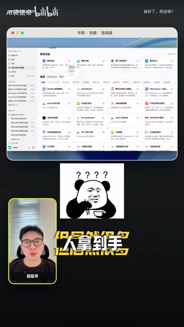

# 耗时 7 天，我们开源了腾讯 WorkBuddy 实战蓝皮书！今天起，WorkBuddy 实战教程完全免费～

> 来源：[Bilibili 视频](https://www.bilibili.com/video/BV14m3J6wEEt)  
> UP 主：AI袋鼠帝｜合集：AIcode｜视频时长：01:12  
> 视频元数据抓取时间：2026-08-04｜发布时间戳对应约 2026-07-29  
> 说明：视频为竖屏口播与界面展示；站内字幕未获取成功，以下时间轴以本次 ASR 的真实分段时间为准，并结合关键帧校正专有名词。

## 小结

视频宣布由 UP 主 AI袋鼠帝与 4 位 AI 博主共同整理、耗时 7 天完成的 **WorkBuddy 实战蓝皮书**已免费开源。其定位不是单一功能演示，而是面向从零学习 AI Agent 的系统化教程与案例集合。

视频要解决的核心问题是：不少用户已经接触或拿到 WorkBuddy，却仍不知道它可以用于什么场景、如何将其转化为工作效率。UP 主将 WorkBuddy 表述为“本地 AI Agent”，并强调学习路径覆盖入门、进阶玩法及真实业务案例。

视频列出的案例方向包括：写作、办公、数据处理、产品宣传片、公众号排版与门店运营；同时，团队仍在补充企业级场景和案例。这里的“覆盖”是视频对蓝皮书内容范围的介绍，并不等同于视频本身已经逐项演示了这些工作流。

获取方式方面，视频仅明确提示：找不到蓝皮书的观众可以在评论区留言“蓝皮书”。视频没有展示具体网址、仓库地址、安装包、下载流程、授权协议或 WorkBuddy 的环境配置，因此不能据此推断具体访问入口或部署方法。

视频中的访问量、学习人数与商业价值均为创作者口播或画面中的宣传性陈述：包括 WorkBuddy 在“3 月份”访问量超过 885 万、蓝皮书开源半个月已有 10 万多人学习，以及同类内容“可能卖几十元”。这些数字缺少视频内可核验的数据来源，应作为当时的传播信息而非独立验证后的统计结论。

## 思维导图

## 目录

- [背景：从“能用”到“会用” WorkBuddy](#背景从能用到会用-workbuddy-0000)
- [开源蓝皮书：协作规模、内容范围与案例](#开源蓝皮书协作规模内容范围与案例-0024)
- [共创机制、免费定位与获取提示](#共创机制免费定位与获取提示-0048)
- [可执行的学习与使用路径](#可执行的学习与使用路径-0024)
- [关键帧解读](#关键帧解读)
- [结论、限制与时效性](#结论限制与时效性)
- [字幕比对](#字幕比对)
- [评论分析](#评论分析)
- [处理记录](#处理记录)

## 背景：从“能用”到“会用” WorkBuddy [00:00](https://www.bilibili.com/video/BV14m3J6wEEt?t=0)

视频开场面向尚未使用 WorkBuddy、或尚未充分使用该工具的人群。UP 主的主要判断是：如果能“用透” WorkBuddy，用户在“26 年下半年”会轻松很多。这是创作者对生产效率的主观看法，不构成可量化的效果承诺。

UP 主称，自己此前写 WorkBuddy 的第一篇文章获得较高传播，画面中可见与该文章/内容相关的 **“14.1 万+”**数字；但 ASR 将口播识别为“爆了 10 万家”，显然存在识别误差，不能准确还原其统计口径。可以确认的是：创作者借此说明该主题已有较高关注度。

随后，视频把用户反馈聚焦为一个问题：“它到底能干嘛？”这正是蓝皮书拟解决的认知与实操缺口。ASR 将产品名多次错误识别为“workbody”，但关键帧的客户端标题与视频标题均明确为 **WorkBuddy**，正文统一采用 WorkBuddy。

> 图：画面以“现在还有人没用上 WorkBuddy？”和“26 年下半年会轻松很多”为主文案，直观呈现视频的受众定位与效率主张；它能辅助校正 ASR 中误识别的产品名。

视频称 WorkBuddy 是当前国内受关注的“本地 AI Agent”。这一定位在后续画面中也得到界面标题“LOCAL AI AGENT”的辅助印证。这里的“本地”仅说明视频如此描述其产品形态；视频未进一步解释模型运行位置、数据是否完全本地存储、是否需要联网，或底层技术架构。

关于热度，视频声称 WorkBuddy 在“3 月份”的访问量已超过 **885 万**。由于未给出年份、统计平台、指标定义（独立访客、网页访问还是客户端访问等）及原始数据链接，不能将该数字延伸解读为市场份额或用户规模。

> 图：画面展示“14.1 万+”的传播数字，并突出“评论区问得最多：它到底能干嘛？”；其价值在于证明视频叙事重点是用户实际用途，而不是单纯介绍产品概念。

## 开源蓝皮书：协作规模、内容范围与案例 [00:24](https://www.bilibili.com/video/BV14m3J6wEEt?t=24)

从 00:24 起，UP 主说明项目的组织方式：其与 **4 位知名 AI 博主**共同参与，即共 **5 人**，耗时 **7 天**，将 WorkBuddy 实战蓝皮书免费开源。视频标题中的“腾讯 WorkBuddy”说明了内容关联对象，但口播与画面没有说明腾讯官方是否参与、是否背书该蓝皮书，也没有展示官方合作证明。

蓝皮书被描述为可供任何人“随时随地免费访问”的系统学习资料，主题是 AI Agent 的应用。视频明确提到的内容层级包括：

1. **小白入门教程**：面向刚接触 AI Agent 或 WorkBuddy 的用户；
2. **进阶玩法**：面向已有基础、希望拓展使用方式的用户；
3. **大量真实案例**：强调从抽象功能转向具体工作任务。

视频列举的应用场景如下：

| 场景 | 视频中给出的信息 | 视频未提供的信息 |
| --- | --- | --- |
| 写作 | 被列为蓝皮书案例方向 | 提示词、输入材料、输出标准与审核步骤 |
| 办公 | 被列为效率提升场景 | 所涉软件、自动化流程及权限要求 |
| 数据处理 | 被列为案例方向 | 数据格式、隐私边界、计算方法和结果验证方式 |
| 产品宣传片 | 被列为案例方向 | 素材准备、生成工具链、版权与成片质量标准 |
| 公众号排版 | 被列为案例方向 | 平台适配规则、排版模板与发布流程 |
| 门店运营 | 被列为案例方向 | 运营指标、适用业态及真实效果数据 |

因此，这段内容提供的是蓝皮书的**覆盖范围清单**，并非上述场景的完整操作教程。希望复现这些工作流的用户，仍需通过蓝皮书原文或其他公开资料获得具体步骤。

> 图：画面中出现标题为“WorkBuddy 客户端”的软件窗口，并标注“本地 AI Agent”。它是确认产品名称和视频工具定位的重要视觉依据，但界面细节不足以据此还原具体功能配置。

> 图：画面展示类似“专家、技能、连接器”的 WorkBuddy 界面，并以“怎么用？”提出问题。该帧的价值在于说明视频试图把用户从“看见功能列表”引导到“理解任务用途”，但没有展示点击、配置或执行结果。

## 共创机制、免费定位与获取提示 [00:48](https://www.bilibili.com/video/BV14m3J6wEEt?t=48)

视频表示，团队正在继续补充“企业级”的场景和案例。这意味着蓝皮书不是宣称已经完全定稿的封闭资料，而是仍在扩展的内容集合。企业用户或希望获得行业方案的读者，应注意视频没有给出企业版案例清单、上线时间、参与门槛或质量审核机制。

UP 主同时提出共创方式：用户自己写的教程也可以提交进入该项目，并将“成为社区的贡献者”。不过，视频没有说明投稿地址、审核标准、署名规则、内容版权归属、是否接受商业案例或如何处理敏感数据。准备投稿前，不能默认上述规则已经确定。

视频称开源半个月已有“10 万多人学习过”。这一数字在 ASR 中识别为“10 万多人学乡过”，但结合语义可校正为“学习过”。同样地，视频未展示后台截图、统计口径或来源，故仅记录为创作者陈述。

免费定位是本视频的核心传播信息：UP 主称此类内容若被他人拿去售卖，“至少可能卖几十块钱”，但他们选择免费开源。这里的“几十元”是对潜在售价的推测，不是已发生交易或市场定价事实；“免费开源”也不能自动推导为使用者可无限制商用、再分发或修改，具体权利仍取决于项目实际发布时的许可证。

在结尾，视频给出唯一明确的查找提示：若找不到蓝皮书，可在评论区留言“蓝皮书”。这是一种互动式导流方式，而不是稳定的公开访问步骤；评论回复可能会随时间被折叠、删除或停止维护。

## 可执行的学习与使用路径 [00:24](https://www.bilibili.com/video/BV14m3J6wEEt?t=24)

视频没有展示安装、注册、模型连接、权限授权、任务搭建或结果验收的完整操作。基于其已经明确的内容层级，可将学习过程整理为以下**不超出视频信息的执行框架**：

1. **先取得蓝皮书入口**  
   依据视频提示，在评论区留言“蓝皮书”以寻找资料入口。由于视频未展示链接，获取后应自行核验链接来源、发布主体及文件安全性。

2. **从小白入门内容建立基础认知**  
   不宜直接从复杂案例开始。视频将“小白入门教程”列为蓝皮书内容，适合先理解 WorkBuddy/AI Agent 的基础用途和界面结构。

3. **按个人任务选择案例方向**  
   从写作、办公、数据处理、产品宣传片、公众号排版、门店运营中选择与当前工作最接近的一类。视频的核心经验是围绕真实效率场景学习，而非只浏览工具能力列表。

4. **在基础案例稳定后再进入进阶玩法**  
   视频明确区分入门与进阶内容。对于复杂任务，应先明确输入材料、预期输出和人工验收标准；这些具体标准并非视频提供，而是实际落地时必须补齐的环节。

5. **有可复用经验时参与共创**  
   视频允许提交自写教程，但投稿前应确认项目的实际提交渠道、内容规范、许可协议及是否包含敏感业务信息。

### 视频未提供、实际使用前应补齐的参数与条件

| 项目 | 视频是否提供 | 结论 |
| --- | --- | --- |
| WorkBuddy 版本号 | 未提供 | 无法据视频确定 |
| 操作系统与硬件要求 | 未提供 | 无法判断本地运行门槛 |
| 模型供应商、API 配置 | 未提供 | 无法复现模型连接方式 |
| 插件、技能或连接器配置 | 仅有界面展示 | 未展示具体名称、参数与授权流程 |
| 数据安全与隐私策略 | 未提供 | 不应假设“本地 AI Agent”即等于无数据风险 |
| 蓝皮书链接/代码仓库 | 未展示 | 需以评论区或后续官方渠道为准 |
| 开源许可证 | 未提供 | 不可推断商用、修改、再分发权限 |
| 企业案例详情 | 称仍在补充 | 当前视频不足以用于企业方案评估 |

## 关键帧解读

| 关键帧 | 正文用途 | 画面可确认的信息 | 选择价值 |
| --- | --- | --- | --- |
| [frame-001](frames/frame-001.jpg) | 背景与问题 | WorkBuddy 名称、“26 年下半年会轻松很多”的口播文案 | 校正 ASR 对产品名的错误识别，呈现视频主张 |
| [frame-002](frames/frame-002.jpg) | 用户痛点 | “14.1 万+”画面数字、“它到底能干嘛？” | 保留传播数字与用户疑问之间的关系，同时避免把数字口径误判为文章阅读量 |
| [frame-003](frames/frame-003.jpg) | 工具定位 | “WorkBuddy 客户端”“LOCAL AI AGENT” | 为“本地 AI Agent”这一视频说法提供画面佐证 |
| [frame-004](frames/frame-004.jpg) | 使用挑战 | 类似技能/连接器的功能列表及“怎么用？” | 说明视频强调的并非功能是否存在，而是用户如何将其用到具体任务中 |

> 未将未实际提供画面内容的 `frame-005.jpg` 至 `frame-012.jpg` 纳入分析，避免对不可见关键帧编造描述或时间位置。

## 结论、限制与时效性

视频的主要价值在于提供一个清晰的资源线索：围绕 WorkBuddy 的免费实战蓝皮书，试图把 AI Agent 的学习组织为“入门—进阶—案例—共创”的路径，并特别强调办公与业务效率场景。

对普通用户而言，最可迁移的经验是：不要只停留在“工具有哪些技能”的层面，而应从自己已有的任务出发，选择写作、办公、数据处理等具体场景进行学习和验证。对内容创作者而言，视频还提出了将教程提交至社区、参与案例共创的可能。

但本视频本质上是项目发布与推广短片，**不是 WorkBuddy 的技术教程**。它没有提供安装命令、配置参数、模型选择、提示词、连接器设置、可复现案例、性能测试或安全策略。任何部署、采购、企业接入或数据处理决策，都不能只依据本视频完成。

时效性方面，视频涉及“26 年下半年”“3 月份访问量”“开源半个月学习人数”等相对时间说法。蓝皮书入口、内容数量、企业案例进度、评论区回复和统计数据均可能在发布后变化。应以项目当前公开页面、官方说明和实际许可证为准。

## 字幕比对

| 字幕来源 | 完整性 | 专有名词 | 时间轴 | 主要问题 |
| --- | --- | --- | --- | --- |
| Bilibili 站内字幕 | 未提供可用字幕 | 无法核验 | 无法使用 | 字幕抓取过程报错：`Invalid URL`，素材中没有可用站内 SRT |
| 本次 ASR 字幕 | 较完整：4 段，语音覆盖约 68.58 秒，覆盖率 96.05% | 多处误识别 | 可用：含真实 SRT 起止时间 | 将 WorkBuddy 识别为“workbody”；人名、数字与部分词组存在明显错字或同音误识别 |

本次 ASR 使用 `large-v3-turbo`，识别语言为中文，语言置信度为 `0.998046875`；音频时长约 71.40 秒，最后一段语音结束于 01:10.960。诊断中**没有** `noAudioStream=true` 标记，说明源视频存在音轨，本次 ASR 结果可供使用，而非工具失败。

最终采用策略为：**以本次 ASR 的 SRT 时间轴作为章节定位依据，以视频标题、元数据及关键帧校正专有名词和明显语义错误**。重点校正如下：

| ASR 原识别 | 校正结果 | 校正依据 |
| --- | --- | --- |
| workbody | WorkBuddy | 视频标题、标签、关键帧中的“WorkBuddy 客户端” |
| 戴主帝 / 戴鼠弟 | AI袋鼠帝 | 视频元数据中的 UP 主名称；口播人名不再按 ASR 字面转写 |
| 本地 AI agent | 本地 AI Agent | ASR 语义与关键帧“LOCAL AI AGENT”一致 |
| 10 万多人学乡过 | 10 万多人学习过 | 前后语义可连贯还原；仍按创作者陈述处理 |
| 场地和案例 | 场景和案例 | 与“企业级”及上下文搭配更合理，但未扩展出具体行业 |

未对“885 万”“14.1 万+”“10 万多人”等统计数字做外部核验；仅保留其在视频中的出现形式，并标记为创作者口播或画面信息。

## 评论分析

仅获取到 2 条热评，少于要求上限“前三条”；未获取到的第 3 条不作补写。

1. **米粉蒸肉它不香吗**（3 赞）：“不会使用ai写的吧”  
   - 观点：对蓝皮书的内容生产方式提出疑问，暗含对 AI 生成内容质量、原创性或实用性的担忧。  
   - 补充信息：没有提供蓝皮书实际内容、链接或可验证证据。  
   - 可信度与边界：这是一条质疑性意见，不能据此断定蓝皮书由 AI 撰写，也不能反证其质量。

2. **斯哲波波**（1 赞）：“蓝皮书[doge]”  
   - 观点：直接响应视频结尾的互动口令，表现出对获取蓝皮书的兴趣。  
   - 补充信息：没有提供入口、使用体验或教程评价。  
   - 可信度与边界：可印证视频确实引导观众在评论区留言“蓝皮书”，但无法证明 UP 主是否已回复或资料是否仍可获得。

## 处理记录

- Worker ID：`worker-mrj0wjed-b0c290ad`
- 生成模型：`gpt-5.6-terra`
- ASR 模型：`large-v3-turbo`（CUDA，`int8_float16`，自动语言识别为中文）
- 使用的素材与工具产物：
  - 视频元数据与页面统计；
  - 音频产物：`audio/audio.wav`；
  - ASR 结果：`asr/asr-result.json`、`asr/transcript.srt`、`asr/asr-transcript.txt`；
  - 关键帧目录：`frames/`；
  - 评论产物：`comments/comments.json`。
- 字幕选择：
  - 站内字幕：未提供可用结果，字幕工具记录为 `Invalid URL`；
  - 本次 ASR：已检查并采用其真实 SRT 起止时间；
  - 校正方式：使用标题、标签、UP 主元数据及关键帧对 WorkBuddy 等专有名词进行人工语义校正。
- 关键帧选择依据：选用实际给出的 `frame-001.jpg` 至 `frame-004.jpg`，分别支撑开场主张、用户痛点、客户端与本地 AI Agent 定位、技能/连接器界面；未描述未提供可见内容的后续帧。
- 评论处理范围：仅分析可获取热评前 3 条；实际仅获得 2 条。
- 缓存清理：提供的素材未包含缓存清理执行记录，无法确认是否已清理；不将其表述为已完成。
- 未解决问题：
  - 蓝皮书的实际访问链接、仓库地址与许可证未在素材中出现；
  - WorkBuddy 的版本、安装配置、模型连接与隐私机制未展示；
  - 视频中的访问量、学习人数与传播数字缺乏可核验来源；
  - 企业级场景和案例仍处于视频所称的持续补充状态。
