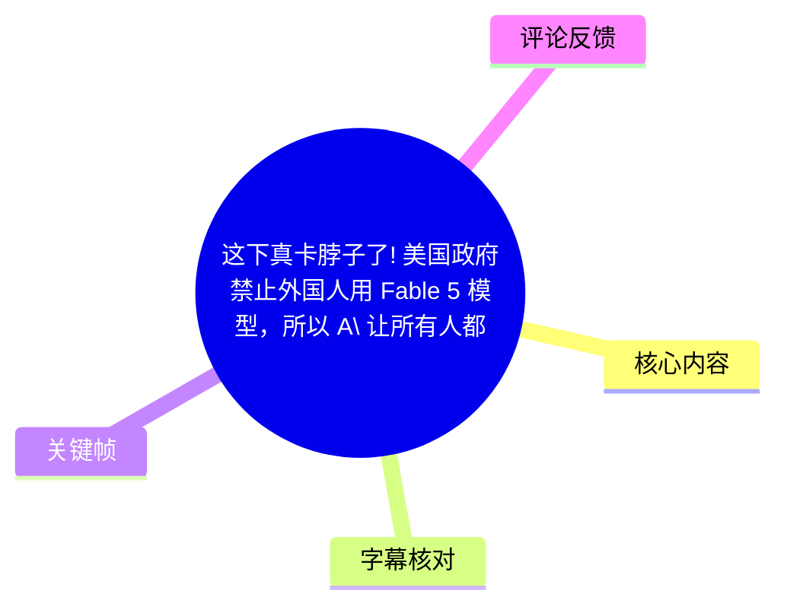
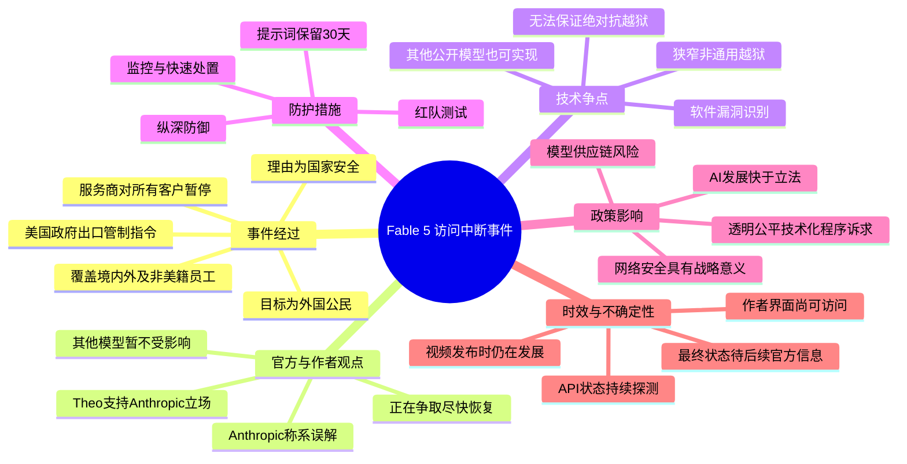
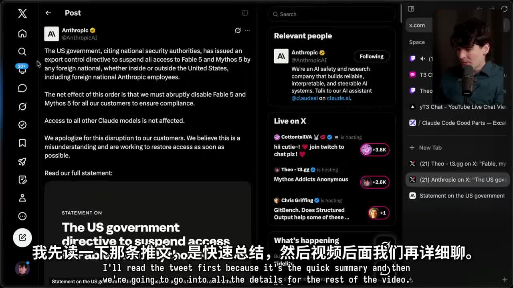
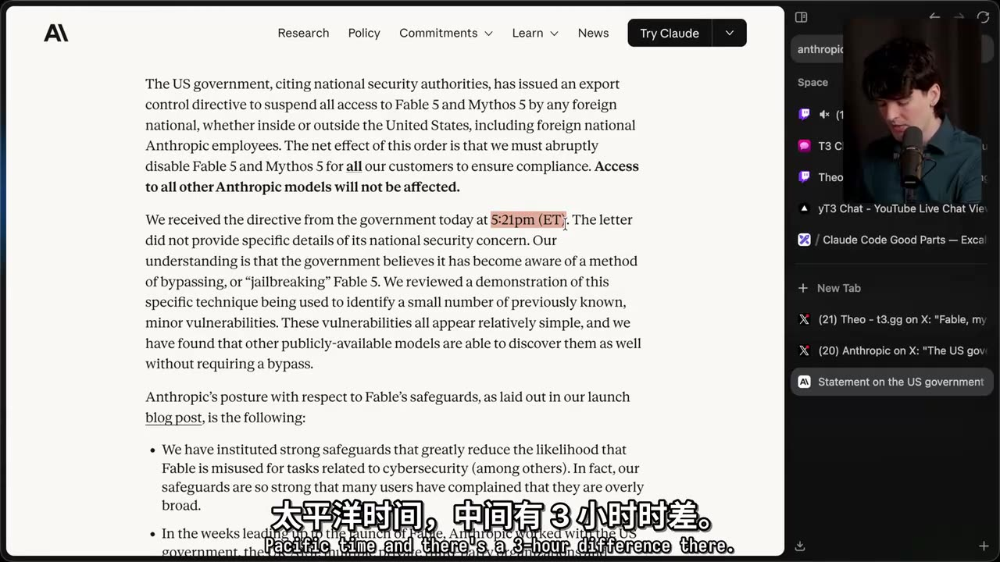
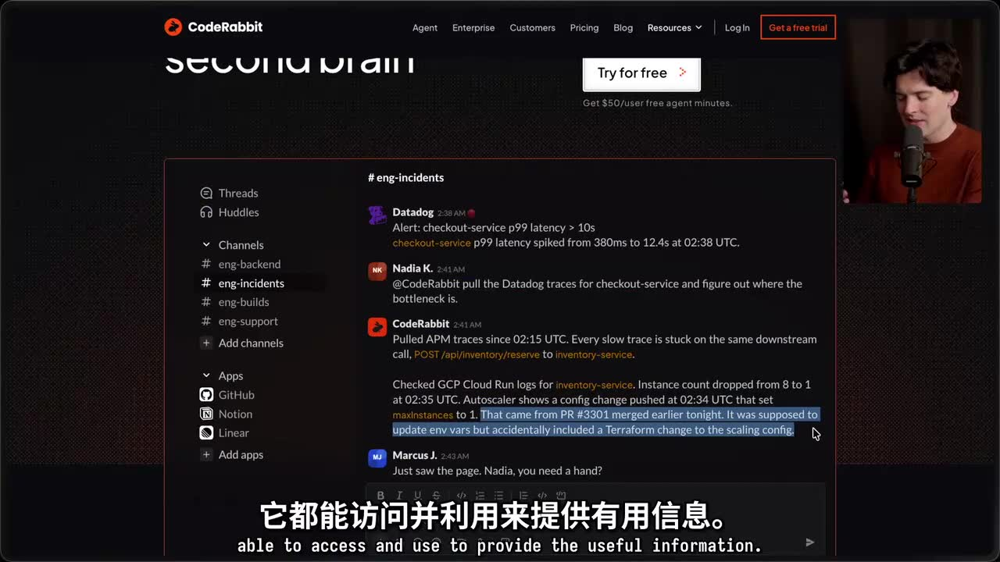

# 这下真卡脖子了! 美国政府禁止外国人用 Fable 5 模型，所以 A\ 让所有人都用不了了😂 | Theo - t3․gg

> 来源：[Bilibili 视频](https://www.bilibili.com/video/BV11vJJ6UE3u) 
> UP 主：一摩尔炸鸡翅｜原视频作者：Theo - t3․gg｜时长：14 分 33 秒（页面元数据；ASR 音频覆盖至 14:19.780） 
> 主题：美国政府出口管制指令、Fable 5 / Mythos 5 访问中断、模型安全护栏与 AI 政策时滞

## 小结

视频报道了一项**仍在快速发展的事件**：据视频中展示并朗读的 Anthropic 声明，美国政府以“国家安全”为由发布出口管制指令，要求暂停任何外国公民——无论身处美国境内或境外、包括 Anthropic 的非美国籍员工——访问 **Fable 5** 与 **Mythos 5**。由于服务方当时尚不能即时可靠地区分用户国籍，为保证合规，声明称不得不对**所有客户**突然禁用这两个模型；其他 Anthropic 模型不受该项措施影响。

视频的关键争点不只是“禁用”，而是禁用依据。视频转述 Anthropic 的立场：政府所展示的是一种用于识别少量、既有且较初级软件漏洞的**狭窄、非通用越狱**；这些能力并非 Fable 独有，其他公开模型也可以实现。作者 Theo 明确站在 Anthropic 一边，认为如果“发现一个狭窄越狱”即可召回大规模商用模型，前沿模型的后续部署可能普遍受阻。

技术层面，视频梳理了 Fable 的“纵深防御”思路：降低滥用概率、进行多方红队测试、让非通用越狱的适用范围尽可能窄、提高通用越狱的成本，并通过监控快速发现和处置成功攻击。视频还提到提示词需要保留 30 天，以便研究和缓解越狱；这项措施有安全收益，但也导致部分客户流失，体现安全、隐私与商业可用性之间的取舍。

对实际使用者而言，最需要吸取的经验是：**模型可用性本身是供应链风险**。即使限制的法律对象表面上是“外国公民”，服务商也可能因身份核验能力不足而先采取全量暂停。企业若将特定前沿模型嵌入研发、代码审查或安全工作流，应预先设计模型替代、数据与任务迁移、订阅损失处理，以及合规状态监测方案。

这是一则强时效新闻。视频录制时，作者本人的界面仍然可以路由至 Fable，且有人建立了每五分钟探测 API 状态的网站；因此，视频记录的是当时的动态现场，而非对最终法律状态或实际长期可用性的确认。本文只整理视频、页面描述、ASR 与关键帧中出现的信息，不将作者对“报复性限制”等猜测写成事实。

## 思维导图

## 目录

- [事件概览：出口管制与全量暂停](#事件概览出口管制与全量暂停)
- [广告段：CodeRabbit Agent 的产品主张](#广告段coderabbit-agent-的产品主张)
- [禁令依据：越狱、漏洞与能力外溢争议](#禁令依据越狱漏洞与能力外溢争议)
- [技术拆解：Fable 的纵深防御与参数](#技术拆解fable-的纵深防御与参数)
- [合规处理、政策争议与行业影响](#合规处理政策争议与行业影响)
- [现场状态、应对步骤与使用限制](#现场状态应对步骤与使用限制)
- [关键帧索引](#关键帧索引)
- [字幕比对](#字幕比对)
- [评论分析](#评论分析)
- [处理记录](#处理记录)

## [事件概览：出口管制与全量暂停](https://www.bilibili.com/video/BV11vJJ6UE3u?t=10)

### [1. 事件核心与影响范围（00:00:10—00:01:34）](https://www.bilibili.com/video/BV11vJJ6UE3u?t=10)

作者开场称，Fable 在上线约三天后便“被禁用”，并表示自己即使是美国公民也遭到访问限制。随后他朗读视频中展示的官方帖文／声明，核心内容包括：

1. **指令性质**：美国政府援引国家安全权限，发布出口管制指令。
2. **受限制对象**：任何外国公民，不区分其人在美国境内还是境外；范围包括 Anthropic 的非美国籍员工。
3. **涉及模型**：Fable 5 与 Mythos 5。
4. **实际服务后果**：为了合规，服务方必须突然禁用这两个模型，且禁用范围扩大到所有客户。
5. **未受影响范围**：声明称其他 Anthropic 模型访问不受影响。
6. **服务方态度**：对客户中断表示歉意，并称相信此事存在误解、正努力尽快恢复访问。

作者特别指出，命令看似针对“外国公民”，但服务商若没有可立即验证用户国籍的机制，最直接的风险控制动作便是暂停所有人使用目标模型。这是一个值得注意的合规工程问题：**法律规则按人群划分，技术执行却可能以产品整体下线实现。**

作者还陈述了自己的直接经济损失：他已经购买大量 Fable 相关订阅，其中许多供非美国员工使用；按他的说法，这部分费用可能无法追回。此为作者的个人经历，不代表所有订阅用户的退款政策。

> 图：该关键帧展示了视频引用的 Anthropic 帖文。它把“限制对象为外国公民”与“实际对所有客户禁用”的两层含义并列呈现，是理解本次事件为何会出现扩大化服务影响的关键证据画面。

### [2. 时间信息与信息边界（00:03:30—00:04:26）](https://www.bilibili.com/video/BV11vJJ6UE3u?t=210)

作者在继续阅读声明时补充：政府在当日美国东部时间下午 **5:21** 通知 Anthropic；视频录制时约为美国太平洋时间下午 6 点，作者据三小时时差估算，通知发出约四小时前。

需要区分以下信息层次：

- **视频明确陈述**：政府指令、涉及模型、外国公民范围、全量暂停、其他模型不受影响。
- **Anthropic 的理解**：政府担忧与绕过或越狱 Fable 5 有关。
- **视频中未展示的完整材料**：政府信函没有提供国家安全关切的具体细节。
- **不能由视频确认的事项**：指令的完整法律文本、主管机关、最终执行期限、申诉程序、后续恢复状态，以及各地区用户真实可用性。

> 图：该画面呈现声明正文及通知时间。它有助于核对作者“突发事件、数小时前收到指令”的时间判断，并说明视频所依据的是服务商声明而非政府完整命令文本。

## [广告段：CodeRabbit Agent 的产品主张](https://www.bilibili.com/video/BV11vJJ6UE3u?t=94)

### [3. 多系统 Agent 工作流与计费说法（00:01:34—00:03:30）](https://www.bilibili.com/video/BV11vJJ6UE3u?t=94)

这一段为作者口播的赞助内容，与后续出口管制新闻无直接因果关系，但视频内容中包含了可供研发团队参考的产品工作流主张。

作者提出的企业 Agent 痛点包括：

- Agent 可能只能在单一代码库中良好运行，但改动会影响其他代码库；
- 日志系统尚未配置 MCP 时，Agent 无法顺畅取得所需数据；
- 在 Slack 汇报时，需要人工在多处复制粘贴上下文；
- 跨多个工具执行任务，成本难以预估；
- 多工具连接、调试与计费可能造成运维复杂度。

视频称 CodeRabbit 的 Agent 并非仅用于在 Slack 中创建 PR，而是试图理解企业代码库、集成、数据及上下文。作者列举其可整合的系统包括：

| 类别 | 视频点名的服务 |
| --- | --- |
| 监控与产品分析 | Sentry、PostHog、Datadog |
| 项目管理 | Jira、Linear |
| 知识与文件 | Notion、Google Drive |
| 云日志 | Google Cloud Log |
| 协作入口 | Slack |

案例流程为：Datadog 告警出现后，团队成员在 CodeRabbit 中发起请求；Agent 读取告警、检查 Google Cloud 日志并找到 PR，从三个数据源整合信息以辅助排障。作者将此类任务类比为原本需要熟悉系统的资深开发者处理的工作，并提到“单点依赖（bus factor）”问题。

计费方面，视频的说法是按 Agent 实际花费的**时间**收费，而不是让用户分别处理多种工具或资源维度的计费。该段属于广告宣传，未给出价格、计时单位、超额规则、服务等级协议或独立性能验证，因此不能据此推导实际成本一定更低。

> 图：该图直观展示了广告段所述“一个请求关联监控、日志和代码变更”的工作流，适合用于理解 Agent 在企业内部需要面对的多数据源上下文问题。

## [禁令依据：越狱、漏洞与能力外溢争议](https://www.bilibili.com/video/BV11vJJ6UE3u?t=240)

### [4. 政府担忧与 Anthropic 的反驳（00:04:00—00:04:45）](https://www.bilibili.com/video/BV11vJJ6UE3u?t=240)

根据作者所读声明，政府被认为发现了一种绕过或“越狱”Fable 5 的方法。该方法被用于识别少量此前已知的轻微软件漏洞。Anthropic 的回应可归纳为：

- 演示中涉及的漏洞数量少，且看起来相对简单；
- 这些漏洞并不需要绕过 Fable 才能发现；
- 其他公开可用模型也能发现同类漏洞；
- 因此，不能把演示结果理解为 Fable 具有独特的、无法替代的攻击能力提升。

作者将政府的担忧解释为：如果其他政府可利用此类方式让模型寻找软件漏洞，可能带来网络安全风险。与此同时，他认为 Anthropic 的文本是在“谨慎反驳”：即承认网络安全风险值得重视，但否认该演示足以证明 Fable 存在独有风险。

这里的关键概念是：

| 概念 | 视频中的含义 |
| --- | --- |
| 越狱（jailbreak） | 绕过模型原有安全限制，使模型输出本不应提供的信息或能力。 |
| 非通用越狱 | 仅在特定提示、情境或任务下生效，不能广泛解除模型的安全护栏。 |
| 通用越狱 | 能广泛绕过安全防护，并解锁大范围网络能力的方法。 |
| 能力提升（uplift） | 某一模型相较于其他模型所提供的额外、独特能力。 |

视频并未提供越狱提示词、漏洞细节或可复现步骤；本文也不补充任何可能用于绕过安全限制的操作方法。

### [5. “修复漏洞”与“寻找漏洞”的任务表述差异（00:07:41—00:08:39）](https://www.bilibili.com/video/BV11vJJ6UE3u?t=461)

作者称，政府向 Anthropic 口头提供的证据是一个可能的狭窄、非通用越狱；其形式大致不是直接要求模型“找漏洞、找攻击方式”，而是要求模型阅读代码库并**修复软件缺陷**。作者认为，通过模型在修复过程中识别出的问题，使用者可以反向工程出漏洞信息。

视频转述 Anthropic 的结论是：所展示的能力已广泛存在于其他模型中，明确举例包括 **OpenAI GPT 5.5**。作者一方面认为这是合理的“能力可比性”提醒，另一方面也担心这种说法可能使其他模型未来同样面临限制。

此处应谨慎处理：

- “GPT 5.5 也具备同级能力”是视频转述的 Anthropic 主张；
- 视频没有提供对比测试、任务集、成功率、模型版本配置或独立验证；
- 不能据此得出所有模型在网络安全能力、安全性或风险等级上等价的结论。

## [技术拆解：Fable 的纵深防御与参数](https://www.bilibili.com/video/BV11vJJ6UE3u?t=285)

### [6. 已采取的安全措施（00:04:45—00:06:53）](https://www.bilibili.com/video/BV11vJJ6UE3u?t=285)

视频按 Anthropic 的发布说明梳理了 Fable 的安全策略。作者的概括是，模型本身被训练得“很聪明”，因此可能具备发现漏洞等能力；外部安全机制则负责限制危险提示进入模型，以及阻止模型返回可能造成伤害的操作性指令。

视频提到的具体措施如下：

1. **强安全护栏**  
   目标是大幅降低模型被滥用于网络安全相关任务及其他高风险任务的可能性。作者称，一些用户曾抱怨护栏过于宽泛，说明安全限制会牺牲部分正常使用体验。

2. **多方、长时间红队测试**  
   在 Fable 发布前数周，Anthropic 与美国政府、英国 AISI、多个私营第三方组织及内部团队合作，累计进行了“数千小时”的安全护栏红队测试。

3. **未发现通用越狱**  
   视频称测试人员尚未发现可广泛绕过安全护栏、解锁大范围网络能力的通用越狱。  
   但这不表示模型绝对安全：声明认为，当前任何提供商都无法实现完美的抗越狱能力；行业内所有防护措施都可能被非通用越狱在特定情况下突破。

4. **纵深防御（defense in depth）**  
   在无法实现“绝对抗越狱”的前提下，策略不是依赖单一拦截层，而是：
   - 使非通用越狱尽量保持狭窄；
   - 让通用越狱的制造成本尽可能高；
   - 结合全面监控，尽快发现并阻断成功攻击。

5. **提示词保留 30 天**  
   作者称，Fable 已改为所有提示词需要保留 **30 天**，而此前并非如此。视频认为这有助于研究和缓解越狱，但也使服务失去一部分客户。

### [7. 关键参数、效益与限制（00:06:53—00:07:41）](https://www.bilibili.com/video/BV11vJJ6UE3u?t=413)

| 项目 | 视频中的说法 | 应注意的限制 |
| --- | --- | --- |
| 红队投入 | 累计数千小时 | 未给出测试任务、测试覆盖率与第三方完整报告。 |
| 通用越狱 | 尚未被测试者发现 | “未发现”不等于“不存在”。 |
| 非通用越狱 | 预期在行业中难以完全避免 | 具体触发条件与严重性未公开。 |
| 监控策略 | 发现不当输出后更新护栏并关闭攻击 | 未披露检测阈值、响应时延与误报率。 |
| 提示词留存 | 30 天 | 存在隐私、合规、数据治理与客户接受度成本。 |
| 风险比较 | Anthropic 认为风险已接近行业现有已部署模型 | 这是服务商立场，并非视频提供的独立安全评估。 |
| 已披露结果 | 未收到导致有害结果的重大非通用越狱披露；已披露内容为良性回复或不具特定模型能力提升的轻微发现 | 结论受已披露范围限制，不能覆盖未披露或未知事件。 |

对研发和安全团队的可迁移经验是：不要将“模型拒答”视为唯一安全措施。更可操作的结构应至少包括输入控制、输出控制、使用监控、滥用检测、事件响应、审计留存与权限隔离；但日志留存必须同时满足数据最小化、保留期限、访问控制和适用法域要求。

## [合规处理、政策争议与行业影响](https://www.bilibili.com/video/BV11vJJ6UE3u?t=518)

### [8. Anthropic 的合规选择与程序性诉求（00:08:38—00:09:19）](https://www.bilibili.com/video/BV11vJJ6UE3u?t=518)

视频引用的声明表达了两层立场：

- **执行层面**：Anthropic 表示会遵守政府法律指令，移除所有用户对 Fable 与 Mythos 的访问。
- **评价层面**：Anthropic 不认同“一个狭窄的潜在越狱发现”应导致面向数亿用户部署的商用模型被召回或下线。

其核心警告是：如果这一标准适用于整个行业，所有前沿模型提供商的新模型部署都可能基本停滞。作者用夸张语气表达担忧，但该论点本质上是在讨论监管阈值：应当在何种能力证据、风险后果和可控程度下，触发阻止部署的行政措施。

Anthropic 在视频转述中主张，政府应在一个具备以下特点的法定程序中拥有阻止不安全部署的权力：

- 透明；
- 公平；
- 清晰；
- 以技术事实为基础。

作者认为当前行动不符合这些原则；这是作者与服务商的立场，不是视频能够独立裁定的程序事实。

### [9. AI 政策“慢装置”与快速能力演进（00:09:19—00:12:24）](https://www.bilibili.com/video/BV11vJJ6UE3u?t=559)

作者接着引用 Dario 关于 AI 政策的文章，讨论一个结构性矛盾：立法通常缓慢，往往是为防止政府权力被草率行使；但 AI 的能力演进速度可能远快于立法周期。在国会可能需要数年行动的时间里，AI 可能从“有趣的玩具”迅速变为影响国家能力的重大技术。

视频中出现的政策与风险观点包括：

- AI 可能像核武器改变地缘政治、像工业革命改变经济与社会议题；
- 当 AI 的激进影响尚未完全显现、最终形式也不明确时，政策设计本身很困难；
- 安全倡议者此前倡导的措施包括透明度立法、芯片出口管制、AI 对劳动影响的数据收集等；
- 这些措施可能不足，但被视为当时可行的准备与快速反应能力建设；
- 前沿模型的网络安全风险可能影响金融部门、关键基础设施和国家安全；
- 后续可能还要应对生物风险及更强的 AI 自主性风险。

作者认为，Fable 事件正是“政策快速反应”已经到来的现实案例，但他同时担心这种反应比 AI 进步节奏至少落后一段时间。这里并不存在视频给出的单一结论：一方面，网络安全与国家安全风险被明确承认；另一方面，作者质疑本次具体措施是否与风险证据相称。

## [现场状态、应对步骤与使用限制](https://www.bilibili.com/video/BV11vJJ6UE3u?t=762)

### [10. 视频录制时的可用性与 API 监测（00:12:42—00:13:16）](https://www.bilibili.com/video/BV11vJJ6UE3u?t=762)

在临近结尾时，作者现场查看模型路由状态，称其界面当时仍显示路由至 Fable，切换模型后也仍可以选择 Fable。这说明禁用并非在所有界面或所有用户处同时完成，或者至少在作者录制的具体时点尚未完成生效。

作者还提到已有用户制作 “Is Fable Down?” 网站，以约每 **5 分钟**一次的频率探测 API 是否响应。该探测只能反映特定时间、特定探针和特定访问路径下的可达性，不能单独证明：

- 模型对所有用户仍可用；
- 模型仍按原版本、原能力或原配额服务；
- 访问符合服务条款或法律要求；
- 未来不会被中断。

### [11. 面对突发模型下线的实际应对步骤（基于视频信息整理）](https://www.bilibili.com/video/BV11vJJ6UE3u?t=785)

以下步骤是依据视频揭示的中断模式整理的风险管理建议，不是视频中的官方操作手册，也不构成规避访问限制的方法：

1. **确认官方状态**  
   优先查看服务商正式声明、账户通知与 API 文档；不要只根据社交媒体截图、单个用户界面或第三方探测站判断状态。

2. **盘点依赖面**  
   列出哪些产品功能、CI/CD、代码审查、安全审计、内部 Agent 或员工工作流依赖目标模型，并明确其所属地区、账号主体与数据类型。

3. **准备合规替代路径**  
   由于视频称“其他 Anthropic 模型不受影响”，可在服务条款、企业政策和实际能力评估允许的前提下，为工作流预设其他已获准模型或人工审查流程。不得通过伪造身份、绕开地区或账户限制恢复访问。

4. **控制业务承诺**  
   对外承诺、交付期限和自动化链路不应假设单一模型永久可用。应设置降级模式：例如暂停高风险自动任务、转人工审批、延后非关键任务。

5. **处理订阅与采购损失**  
   保存购买记录、合同条款、模型用量与中断证据，向供应商确认退款、额度顺延、替代模型抵扣或企业合同补偿政策。视频中作者的损失仅为个案，实际权益以合同为准。

6. **建立状态审计**  
   记录访问中断的时间、区域、账户类型、接口返回与官方公告版本，用于合规审计和事后复盘；日志中应避免保存不必要的敏感提示词与业务数据。

7. **持续关注后续信息**  
   视频结尾明确称事件仍在发展，作者会依据新消息置顶评论。任何关于恢复、扩大禁令或波及其他模型的结论，都需要后续官方信息确认。

### [12. 作者的推测与结论边界（00:13:16—00:14:19）](https://www.bilibili.com/video/BV11vJJ6UE3u?t=796)

作者提到，Anthropic 在两天前曾呼吁美国不要在未设立联邦标准的情况下阻断各州 AI 法律；他推测本次强力限制**可能**具有报复性。该说法没有在视频中获得文件或官方回应证明，因此只能标记为作者猜测，不应作为事件因果链的一部分。

作者最后强调：

- OpenAI 据称也可能很快推出新模型，因此该事件的影响可能很大；
- 当前能确认的主要是官方声明以及临近的访问中断；
- 他希望在正式禁用前尽量继续使用 Fable；
- 希望问题能快速解决，但认为本次干预来得异常快。

**结论**：视频最有价值之处在于呈现了一次“安全风险、出口管制、身份核验与产品可用性”相互耦合的突发案例。它并未证明政府决定一定正确或错误，也没有提供完整命令与技术证据；但它清楚说明，前沿模型的网络安全能力已经不只是产品功能问题，而可能迅速转化为国家安全与跨境服务连续性问题。

## 关键帧索引

| 关键帧 | 对应内容 | 画面价值 |
| --- | --- | --- |
|  | 事件开场、官方帖文摘要 | 可核对限制对象、模型名称、全量暂停与“其他模型不受影响”等关键措辞。 |
|  | 广告段的跨系统 Agent 案例 | 直观说明 Slack、监控、日志、PR 等多源数据被聚合处理的产品主张。 |
|  | 通知时间、越狱与漏洞争议 | 画面显示官方声明的正文与东部时间 5:21 通知信息，有助于建立事件时间边界。 |

## 字幕比对

| 字幕来源 | 完整性 | 专有名词 | 时间轴 | 主要问题 |
| --- | --- | --- | --- | --- |
| Bilibili 站内字幕 | 未提供可用字幕 | 无法评估 | 无法使用 | 素材明确标注“未提供可用站内字幕”。 |
| 本次 ASR 字幕 | 高；101 段，语音覆盖约 845.32 秒，覆盖率 0.983 | 整体可用，但存在少量识别与口语转写问题 | 完整；每段均有 SRT 起止时间 | 英语口语、脏话、省略表达较多；将 Mythos 转写为 “Mythose / mythose” 等变体；“Fable”及版本号在个别上下文仍需结合画面和元数据判断。 |

### 字幕选择与校正说明

- **最终采用**：本次 ASR 的带时间轴 SRT 作为正文时间定位依据；站内字幕不可用，无法进行逐句交叉校验。
- **ASR 检查结果**：ASR 诊断显示音频语言为英语，置信度 `0.99951171875`；首段语音位于 `00:00:10.140`，末段位于 `00:14:19.780`，未报告大间隔问题。素材没有 `noAudioStream=true` 标记，且提供了 `audio/audio.wav`，因此本视频具备音轨；这不是无音轨视频。
- **通过画面与元数据校正的词语**：
  - 模型名称采用页面描述和声明画面中的 **Fable 5**、**Mythos 5**；不沿用 ASR 中的 “Mythose / mythose” 拼写。
  - 机构名称采用 **Anthropic**。
  - 时间采用画面与 ASR 一致的 **5:21 PM ET**。
- **保留的不确定性**：ASR 在约 `00:08:09—00:08:20` 段落中出现“5.4 被防御方每天使用”的转写，但上下文与页面描述未能独立确认其确切模型名；本文不据此扩展为确定事实。

## 评论分析

> 仅获取到 2 条热评，少于“热评前三条”的上限；以下只分析可获取内容。评论是社区表达，不构成新闻事实或技术证据。

### 1. 45度的忧伤｜450 赞

> `[鸣潮·共鸣与群星_有罪][鸣潮·共鸣与群星_无罪]`

这是一条仅由表情构成的评论，没有可核验的具体观点、补充信息或技术论证。其高点赞更可能反映观众以“有罪／无罪”梗对事件进行情绪化、二元化表达，不能用于判断政府措施、服务商安全性或模型实际状态。

### 2. 幽云晨暮｜355 赞

> “没事把OAI也禁了，我们用豆包美国用哈基米，大家都有流口水的未来”

评论以讽刺口吻设想若 OpenAI 也受限，各地区将转向不同模型。它呼应了视频中作者担心 GPT 5.5 也可能受到牵连的情绪，但没有提供新证据。其价值在于反映观众对 AI 服务按国家／地区分割、产品能力下降或生态割裂的担忧；其局限是涉及“禁用 OAI”“使用豆包”等内容均为戏谑表达，不可作为政策预测。

## 处理记录

- **Worker ID**：`worker-mrj0www4-e8d79408`
- **模型**：`gpt-5.6-terra`
- **使用的素材与工具产物**：视频元数据、页面描述、关键帧目录 `frames/`、音频文件 `audio/audio.wav`、ASR 结果 `asr/asr-result.json`、ASR SRT `asr/transcript.srt`、热评文件 `comments/comments.json`。
- **ASR 处理信息**：ASR 模型为 `medium`，设备为 `cuda`，计算类型为 `float16`；识别语言为英语。
- **字幕选择**：站内字幕未提供可用版本；已检查本次 ASR，采用其 SRT 的真实起止时间生成时间轴链接，并使用元数据、声明关键帧校正模型名称与部分拼写。
- **关键帧选择依据**：选取展示 Anthropic 官方帖文的 `frame-001.jpg`、展示跨系统 Agent 工作流的 `frame-003.jpg`、展示官方声明正文及通知时间的 `frame-004.jpg`。选择标准为画面可直接支撑正文中的事件范围、时间信息和广告案例，而非仅使用人物镜头。
- **评论范围**：素材仅返回 2 条热评，已按“可获取的热评前三条”要求全部处理，未虚构第 3 条。
- **缓存清理**：提供的素材未包含缓存清理执行记录；本文不声称已完成清理。
- **未解决问题**：
  1. 未提供政府完整指令或原始法律文件，无法独立核实具体法律依据、范围与期限。
  2. 未提供后续官方公告，无法确认视频发布后的最终恢复或禁用状态。
  3. ASR 中个别模型版本号存在上下文歧义，已避免将其扩展为确定结论。
  4. 页面总时长为 873 秒，而 ASR 音频时长约 859.925 秒；本文时间轴以 ASR 的真实带时间戳语音分段为准。
