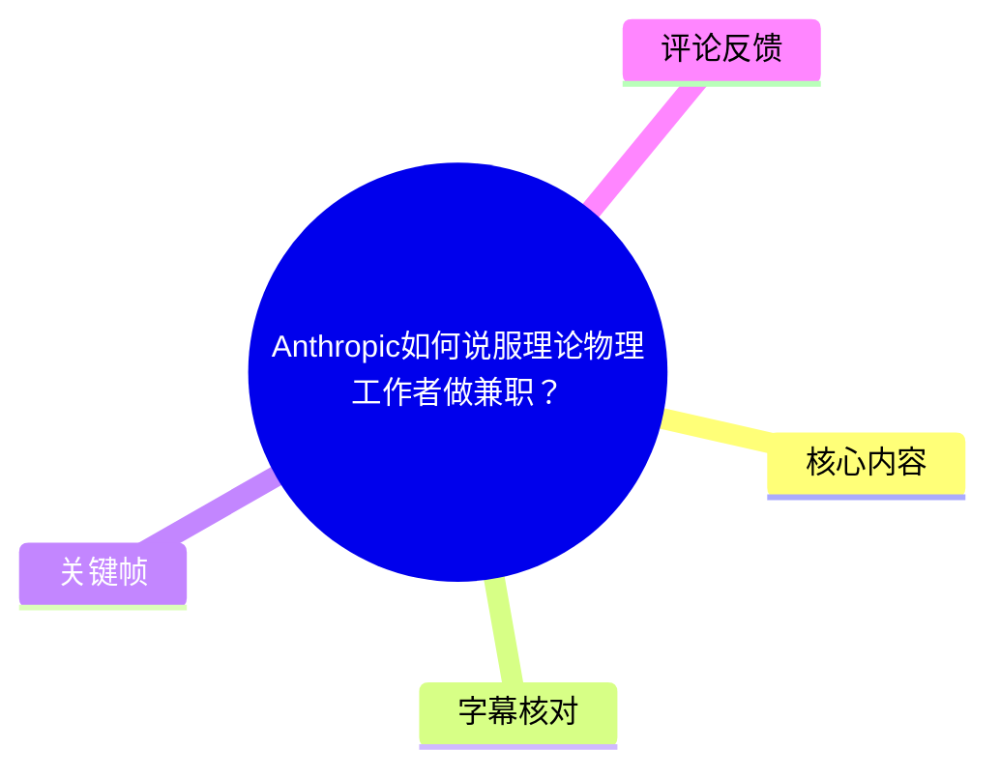
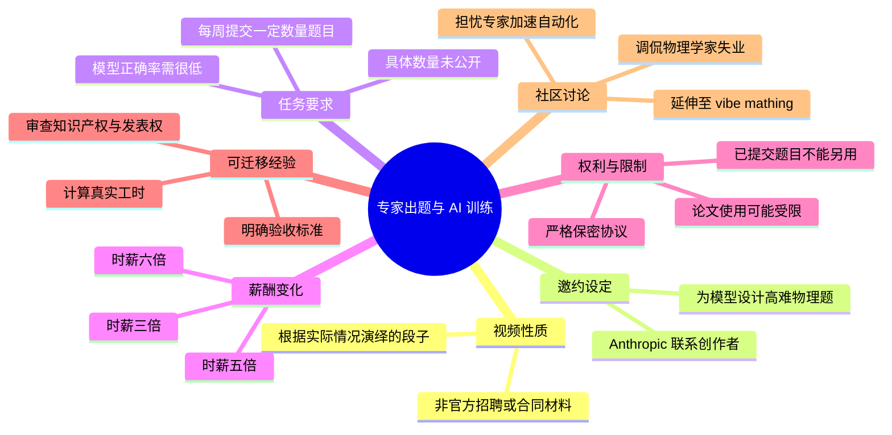
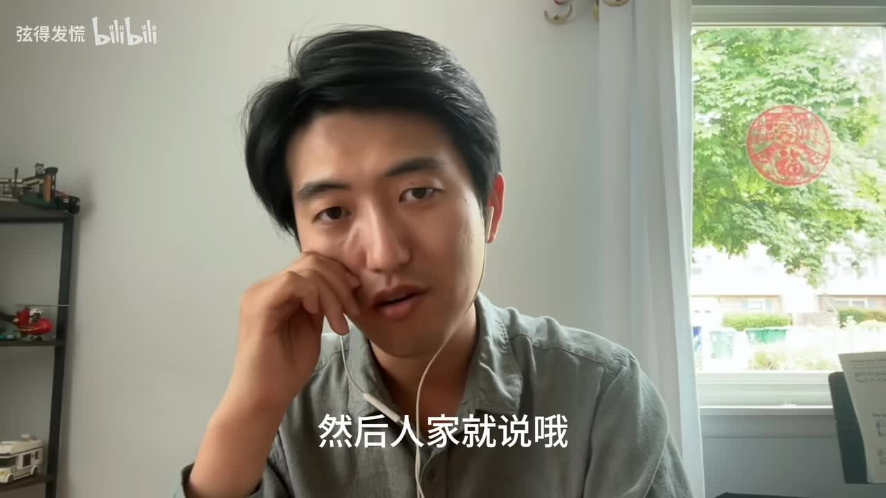
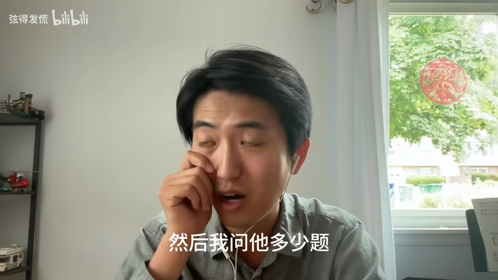
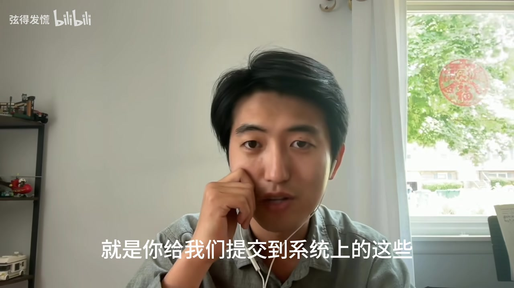

## 小结

视频以“根据实际情况演绎的段子”为明确前提，通过单人模拟对话，讽刺性地讲述一名理论物理工作者如何被“Anthropic”邀约为模型设计高难物理题，并在薪酬不断提高后改变对工作量、知识产权和保密协议的态度。它不是 Anthropic 的官方招聘公告、薪资说明或 NDA 文本。

视频中的核心设定是：专家需要按周提交一定数量的物理题，且题目要让 AI 的正确率“非常非常低”。具体题目数量被叙述者称为受保密协议约束，未予公开；视频也没有说明模型版本、正确率阈值、题目领域、评分机制或数据用途。

片中出现三档相对时薪：**3 倍、5 倍、6 倍**。叙事结构以“加薪即改口”为笑点：主角先因忙碌拒绝，因三倍时薪接受；再因高强度难题生产而抗议，因五倍时薪接受；最后因提交内容可能不得另作研究或论文使用而反对，却又因六倍时薪重新认可保密协议。

对实际可能参与专家出题、数据标注、红队测试或学术兼职的人而言，视频最有价值的启发是：不能只看名义时薪，还要核对交付频率、验收规则、返工成本、题目与答案权属、后续研究空间、论文发表限制以及保密与排他范围。

视频时长为 151 秒。元数据抓取时显示 61,873 次播放、1,943 点赞、722 收藏、414 投币、1,159 分享、382 回复；这些互动数据属于抓取时快照，后续会变化。视频发布日期元数据为 Unix 时间戳 `1782418051`，素材未提供可直接核验的自然语言发布日期。

## 思维导图

## 目录

- [背景、性质与信息边界](#背景性质与信息边界)
- [邀约与三倍时薪](#邀约与三倍时薪)
- [任务要求：持续出题与低正确率](#任务要求持续出题与低正确率)
- [五倍时薪与困难样本生产](#五倍时薪与困难样本生产)
- [严格保密协议与研究权利](#严格保密协议与研究权利)
- [六倍时薪与段子反转](#六倍时薪与段子反转)
- [实际邀约的评估步骤](#实际邀约的评估步骤)
- [限制与时效性](#限制与时效性)
- [字幕比对](#字幕比对)
- [评论分析](#评论分析)
- [处理记录](#处理记录)

## 背景、性质与信息边界 [00:00](https://www.bilibili.com/video/BV1jM7q65EgH?t=0)

标题提出“Anthropic 如何说服理论物理工作者做兼职”，但视频简介明确写明：**“视频为根据实际情况演绎的段子。”** 因此，视频可被视为围绕 AI 训练、专家劳动和研究成果权属的一则讽刺性表达，而不能直接当作 Anthropic 的真实合作流程、工资标准、合同条款或模型数据策略。

叙述者开头称这件事发生在“大概两个多月以前”。这是相对于视频录制或发布时点的相对说法，素材没有提供该事件的可独立验证日期，也没有给出聊天记录、邮件、合同或任务平台页面。

视频采用对镜头讲述的形式，画面中未展示物理题目、模型评测结果、付款信息或 NDA 原文。下文区分三类内容：

- **视频直接陈述**：叙述者在段子中说出的合作条件和反应。
- **可从素材确认的信息**：标题、简介、时长、互动快照、字幕与关键帧。
- **通用风险提示**：基于视频主题整理的实际合同审查框架，不表示视频中的任何机构已经采用该做法。

## 邀约与三倍时薪 [00:08](https://www.bilibili.com/video/BV1jM7q65EgH?t=8)

视频中，叙述者称“Anthropic”联系自己，询问能否“给他们的模型出一点题训练一下”，并将任务理解为提供较难的物理题。

叙事的第一轮条件变化如下：

1. 叙述者先说自己较忙、没有空。
2. 对方提出“时薪是三倍”。
3. 叙述者随即改口，称这也是“为物理事业做贡献”，并表示可以合作。

这里的“三倍”仅是视频口述的相对倍率。素材没有说明：

- 原始时薪或货币单位；
- 计费对象是出题、写答案、验证答案还是沟通时间；
- 是否有最低工时、最低交付量或付款保障；
- 是否按周、按月或按题结算；
- 是否涉及税务、跨境付款或研究机构审批。

因此，不能据此推算任何实际薪资水平，也不能将其归为 Anthropic 的正式报价。

> 图：画面字幕为“然后人家就说哦”，对应叙事中合作方即将提出新条件的节点。该帧的价值在于确认视频是单人情境讲述；它不构成对真实邀约、报酬或合同存在的证明。

## 任务要求：持续出题与低正确率 [00:28](https://www.bilibili.com/video/BV1jM7q65EgH?t=28)

在接受三倍时薪的设定后，叙述者补充对方提出了两项任务要求：

- **交付频率**：每周要提交一定数量的题目。
- **难度目标**：AI 的正确率必须“非常非常低”。

叙述者追问需要提交多少题。按其口述，对方给出了一个数目，但他随后称这受保密协议限制，不能公开具体数量。因此，素材中不存在可记录的周题量，也无法计算平均单题工时、交付强度或实际时薪。

> 图：画面字幕为“然后我问他多少题”，直接对应视频从薪酬讨论转向交付量讨论的转折。它帮助界定信息边界：视频确认“有数量要求”，但没有公开数量本身。

“模型正确率必须非常低”是视频最接近技术条件的说法。按上下文，应理解为：提交的题目希望处于模型当前能力边界附近，使模型难以稳定答对；它并不是要求题目本身错误。

但要将这一表述变成可执行的技术规范，至少还需补充以下信息，而视频均未提供：

| 缺失条件 | 对任务执行的重要性 |
| --- | --- |
| 目标模型及版本 | 模型更新后，原先“难”的题目可能不再困难。 |
| 测试提示词与上下文 | 提示方式会影响模型输出与正确率。 |
| 是否允许工具调用 | 搜索、代码、计算器或外部工具会改变任务难度。 |
| 正确性判据 | 需要标准答案、推导过程或专家评分标准。 |
| 正确率阈值 | “非常低”不是可复现的数值指标。 |
| 重试与采样次数 | 单次失败不等于模型整体不会做。 |
| 题目所属领域 | 理论物理的不同方向难度、验证成本差异很大。 |
| 训练与评测用途 | 同一题目用于训练和评测可能造成数据污染。 |

## 五倍时薪与困难样本生产 [00:54](https://www.bilibili.com/video/BV1jM7q65EgH?t=54)

叙述者接着质疑：在模型已经很强的情况下，持续提交模型不会做的题目，工作强度会非常高。他用“生产队的驴都不带这么用的”进行夸张表达，强调难题生产并不是轻松、可机械重复完成的工作。

在这一抗议后，对方将时薪提高到 **5 倍**。叙述者再次改变立场，并提出自己的看法：只要愿意努力思考，总是能够想出难倒 AI 的题；他还称 AI“现在毕竟还没到人类伟大这个水平”。

这一判断属于视频角色的观点，不能视为模型能力测试结论。视频没有展示任何题目样本、模型回答、评测数据、错误类型或同行审核记录。

从通用的数据构建角度看，“构造难题”与“构造高质量训练／评测题”并不等同。若实际承担类似任务，通常还需完成以下步骤：

1. **明确目标能力**  
   先界定要检验的是公式推导、理论建模、数值求解、文献理解、研究设计还是证明能力，而非只追求“难”。

2. **编写可验证答案**  
   高难题应有可复核的答案、完整推导、关键步骤或评分细则；否则无法可靠判断模型正确与否。

3. **排除题意不清造成的失败**  
   模型答错可能来自歧义、隐含前提缺失或符号定义不完整，而不一定说明题目测试到了目标能力。

4. **检查题目来源与数据泄漏**  
   题目若已出现在公开论文、教材、竞赛题库或训练语料中，其“新颖性”和评测价值都会受影响。

5. **安排同行审核**  
   专业题可能本身存在错误、缺少条件或答案不唯一；仅凭单人提交不一定足够。

6. **分离训练集与评测集**  
   若题目用于训练，通常不应再被无隔离地作为能力评测依据。

这些是从视频主题延伸出的通用流程，不是视频声称已经执行的步骤。

## 严格保密协议与研究权利 [01:20](https://www.bilibili.com/video/BV1jM7q65EgH?t=80)

视频后半段提出更关键的限制：对方要求签署较严格的保密协议。根据叙述者转述，提交到系统中的题目不能再拿去做其他用途，甚至用于发论文也可能受到一定程度的限制。

> 图：画面字幕为“就是你给我们提交到系统上的这些”。该帧的价值在于把限制对象锚定为“已提交至系统的内容”，避免将视频中的说法扩大成对叙述者所有知识、全部研究方向或全部未来成果的限制。

叙述者对此的初始反应是：若自己将有研究价值的想法转化成题目并提交，之后又不能再拿这些内容继续研究或发表，那么按小时支付的报酬不足以覆盖机会成本。他以“抢劫”这一夸张措辞表达不满。

视频没有展示 NDA 原文，因此下列内容只能作为签约前的实际核对清单：

| 风险维度 | 视频中的线索 | 应确认的问题 |
| --- | --- | --- |
| 保密范围 | “比较严格的保密协议” | 哪些材料属于保密信息？保密期多长？ |
| 提交内容权属 | 题目不能用于别处 | 题干、答案、变体、提示词、思路各自归谁？ |
| 学术发表 | 发 paper 可能受限 | 是否需要预审？审查期限多久？是否保留发表权？ |
| 排他性边界 | “不能再拿来用别的” | 限制原题、近似题还是相关研究方向？ |
| 独立开发成果 | 视频未说明 | 如何证明签约前已有成果或独立研发成果？ |
| 报酬覆盖范围 | 按小时付费 | 是否补偿返工、审稿、会议、培训和机会成本？ |
| 机构合规 | 视频未说明 | 是否需要雇主、学校或资助方进行利益冲突审批？ |

尤其需要注意，视频里的“发 paper 可能受限制”是段子叙事中的一项风险描述，不足以证明任何实际协议都会禁止论文发表。具体权利义务必须以合同文本、适用法域和书面确认内容为准。

## 六倍时薪与段子反转 [01:40](https://www.bilibili.com/video/BV1jM7q65EgH?t=100)

面对对保密和排他性条款的质疑，视频中的对方将时薪提高到 **6 倍**。叙述者第三次改变态度，称把题目转化为训练语料、帮助 AI 更好地做物理研究，与自己写文章一样，都是“为物理做贡献”；他最终说两个贡献之间没有高低之分，因此保密协议“还是很合理”。

这是全片的讽刺性反转：叙述者对同一任务条件的价值判断，会随着薪酬倍率变化而变化。视频借此并置了两种张力：

- 领域专家担心自己的知识、题目和研究思路被用于加速自动化；
- 专家也可能因更高报酬、对技术进步的认同或其他资源回报而愿意参与。

全片薪酬与态度的变化可概括如下：

| 阶段 | 新出现的条件 | 视频中叙述者的反应 | 不应推导出的结论 |
| --- | --- | --- | --- |
| 初始邀约 | 为模型设计物理题 | 以忙碌为由拒绝 | 不代表专家普遍拒绝此类工作。 |
| 首次加价 | 时薪 3 倍 | 接受合作 | 不代表真实报价均为三倍时薪。 |
| 工作量争议后 | 时薪 5 倍 | 认为可想出难倒 AI 的题 | 不代表加价即可稳定获得高质量难题。 |
| NDA 争议后 | 时薪 6 倍 | 接受保密协议的解释 | 不代表六倍时薪足以补偿所有权利让渡。 |

## 实际邀约的评估步骤 [02:08](https://www.bilibili.com/video/BV1jM7q65EgH?t=128)

若实际收到专家出题、模型评测、红队测试或训练数据构建的兼职邀请，可参考以下顺序进行评估。该流程是基于视频所暴露的风险点整理，不是视频中出现的正式标准操作。

1. **确认数据用途与流向**  
   询问题目用于预训练、后训练、偏好对齐、内部评测、公开基准还是安全测试；确认是否会转交关联方、客户或第三方。

2. **把“难度”转化为可验收标准**  
   明确模型版本、提示词、工具权限、采样次数、正确判定方法、通过阈值和复测机制。不要仅接受“模型正确率很低”这样的模糊要求。

3. **计算真实有效时薪**  
   将构思题目、撰写题面、推导答案、验证、同行讨论、返工、沟通、系统录入和保密培训都纳入总工时，再与报酬比较。

4. **区分既有知识与新交付物**  
   在合同中尽可能区分签约前已有成果、个人通用技能、独立研发内容、提交的具体题目、答案及衍生变体。

5. **审查排他性条款**  
   特别确认是否禁止在论文、课程、科研项目、其他顾问工作或后续创业项目中使用相同或相似内容。

6. **保留发表与研究空间**  
   若工作内容与现有研究高度相关，应争取书面保留发表权、预先披露权或合理的审查时限；必要时咨询导师、学校科研管理部门或专业法律人士。

7. **确认验收与返工机制**  
   约定题目被拒绝的原因、返工次数、是否支付准备时间，以及“模型答对”是否自动意味着题目不合格。

8. **在合规前提下留存记录**  
   保存合同版本、时间记录、允许保留的交付清单和验收沟通；但不得因留档而违反保密义务。

## 限制与时效性 [02:20](https://www.bilibili.com/video/BV1jM7q65EgH?t=140)

本视频的主要限制在于其演绎性质。简介已明确说明内容是段子，因此以下事项均无法由现有素材独立核验：

- 是否确有 Anthropic 与创作者之间的具体联系；
- 3 倍、5 倍、6 倍时薪是否对应任何真实报价；
- 每周题目数量、题目类别和交付周期；
- “模型正确率很低”的实际阈值与评测配置；
- 保密协议中关于题目、研究思路和论文发表的具体条款；
- 叙述者是否已签署协议或实际完成过相关工作。

此外，AI 模型能力与企业合作政策变化很快。即便视频反映了某类真实需求，某一时间点的模型表现、数据采购策略、保密安排和报酬标准也不能直接外推到之后的合作项目。

视频中的互动数据抓取于 `2026-07-13T11:53:02.750Z` 附近，仅代表当时的页面快照。对实际合作的判断应以当次书面邀约、合同、付款条款及机构合规要求为准。

## 字幕比对 [00:00](https://www.bilibili.com/video/BV1jM7q65EgH?t=0)

| 字幕来源 | 完整性 | 专有名词 | 时间轴 | 主要问题 |
| --- | --- | --- | --- | --- |
| Bilibili 站内字幕 | 不可用 | 无法核对 | 无 | 未提供可用站内字幕；素材记录显示字幕工具报错：`Missing JSON resource URL`。 |
| 本次 ASR 字幕 | 覆盖主要讲述内容及结尾 | 有明显误识别 | 未提供逐句时间戳 | “Anthropic”被识别为“thrpick”；“AI”至少一处被识别为“NIA”；部分口语断句和词语存在不稳定识别。 |

本次 **ASR 已执行**。由于站内字幕不可用，正文以本次 ASR 为主要文本依据，并只进行了可由标题、简介、上下文和关键帧支持的有限校正：

- 将 ASR 的“thrpick”校正为 **Anthropic**：依据视频标题、简介标签和主题上下文。
- 将“这个 NIA 的这个正确率”整理为“AI 的正确率”：依据上下文，视频讨论对象为 AI 模型。
- 将“三倍、五倍、六倍”统一写为 **3 倍、5 倍、6 倍**：其语境均为时薪倍率。
- 章节时间轴为根据 ASR 的叙事顺序和视频总时长做的近似定位；由于 ASR 无逐句时间戳，不能视作精确字幕时间码。

## 评论分析 [00:00](https://www.bilibili.com/video/BV1jM7q65EgH?t=0)

以下仅分析素材中可获取的热评前三条。评论反映社区观点，不构成关于模型能力、产品政策或职业替代的已验证事实。

1. **Leoonnnnn｜20 赞**  
   评论称创作者是“物理界的内奸”，并预测 Claude 若在物理领域能力提升，未来可能限制物理问题回答、再让企业高价解锁。该评论补充了对能力集中与商业访问门槛的担忧，但属于预测。视频没有讨论 Claude 的访问限制、商业定价或企业解锁策略，因此不能据此确认其判断。

2. **誓死保卫3000点｜676 赞**  
   评论以“物理奸”“物理学家失业了，你担全责”调侃，直接呼应视频主题：专家参与模型训练，可能帮助自动化部分专业能力。这是三条中点赞最高的评论，说明这种担忧或玩笑获得较多共鸣；但“失业”并无视频内数据支撑，不能等同于职业替代率预测。

3. **我是远古巨坑｜261 赞**  
   评论称“国内某些数学博士已经在 vibe mathing 了”，并推测未来或出现“vibe physicsing”。它将讨论从物理题训练延伸到 AI 辅助数学、物理研究的趋势。“vibe mathing”与“vibe physicsing”均为网络化表达，视频未定义这些术语，评论也未提供可核验案例，因此只能作为社区话题延伸。

## 处理记录 [00:00](https://www.bilibili.com/video/BV1jM7q65EgH?t=0)

- **Worker ID**：`worker-mrj0www4-e8d79408`
- **模型**：`gpt-5.6-terra`
- **任务对象**：Bilibili `BV1jM7q65EgH`，标题《Anthropic如何说服理论物理工作者做兼职？》，UP 主“弦得发慌”，时长 151 秒，合集 `AIcode`。
- **使用的素材与工具结果**：基于任务提供的元数据、视频素材清单、ASR 文本、关键帧目录、热评数据进行整理。素材管线列出输出包括 `merged.mp4`、`audio/audio.wav`、`frames/`、`comments/comments.json`、`asr/` 和 `info.json`。
- **字幕选择**：站内字幕未提供可用资源，且字幕工具返回 `Missing JSON resource URL`；本次 ASR 已执行，故采用 ASR 为主体，并对“Anthropic”“AI”等上下文可确认的明显误识别做有限校正。
- **关键帧选择依据**：  
  - `frames/frame-001.jpg`：用于“对方提出条件”的叙事转场；  
  - `frames/frame-002.jpg`：画面文字对应“然后我问他多少题”，用于说明题目数量被问及但未公开；  
  - `frames/frame-004.jpg`：画面文字对应“你给我们提交到系统上的这些”，用于定位限制适用的提交内容。  
  这些关键帧均为单人讲述画面，只辅助理解视频叙事，不用于证明合作、薪酬或协议真实存在。
- **未选关键帧**：`frames/frame-003.jpg`、`frames/frame-005.jpg` 未见比已选帧更明确、可用于正文事实定位的附加文字信息，故未重复使用。
- **时间轴依据**：ASR 文本没有逐句时间戳；正文链接秒数依据视频总时长、ASR 语句顺序和叙事转折做近似分段。
- **缓存清理**：素材中未提供缓存清理日志，无法确认是否执行过缓存清理；本次整理未将其表述为已完成。
- **未解决问题**：无法独立核验视频演绎中涉及的联系、报酬倍率、题目数量、模型评测标准、NDA 条款及其与 Anthropic 实际政策之间的对应关系。

## 评论分析

本次流程未获取到可用热评，因此不推断观众态度或额外结论。
