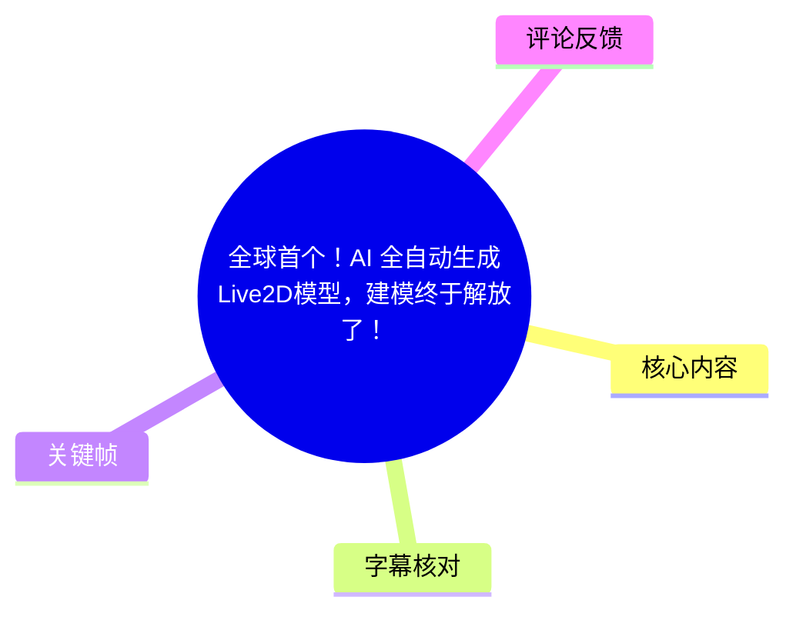
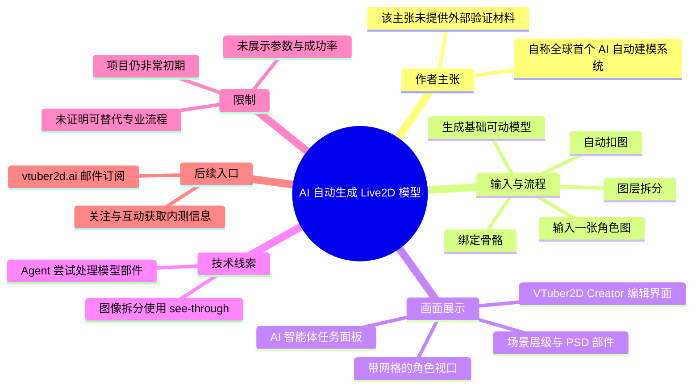
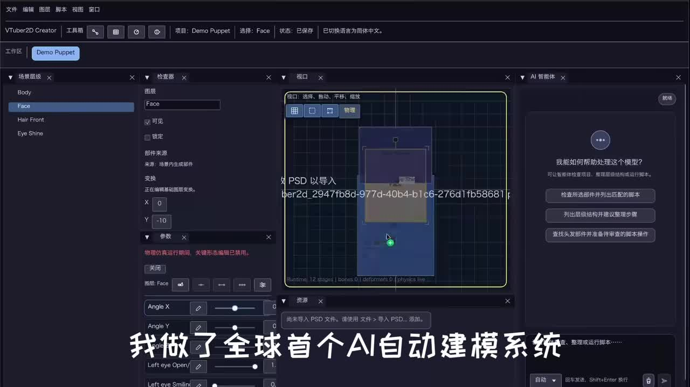
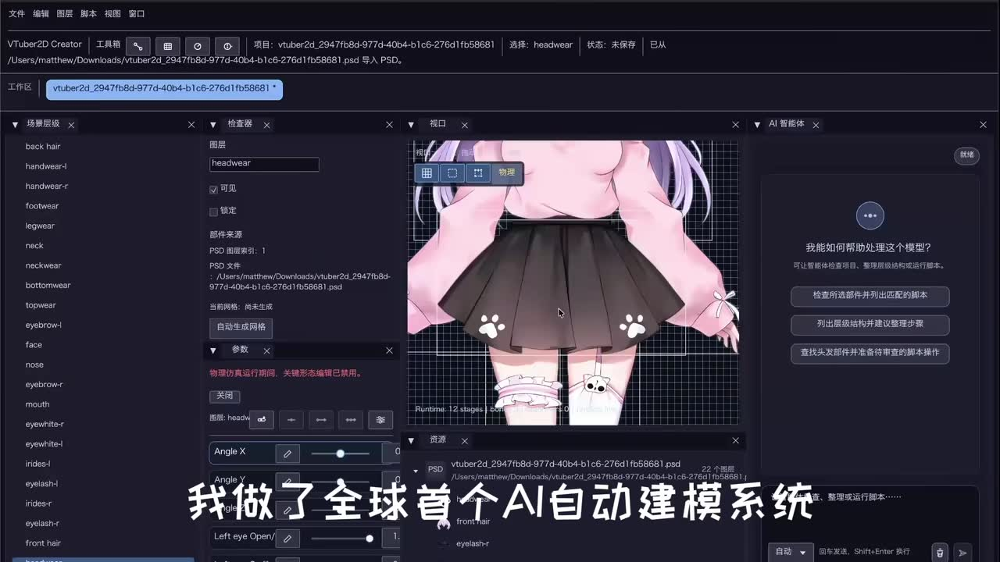
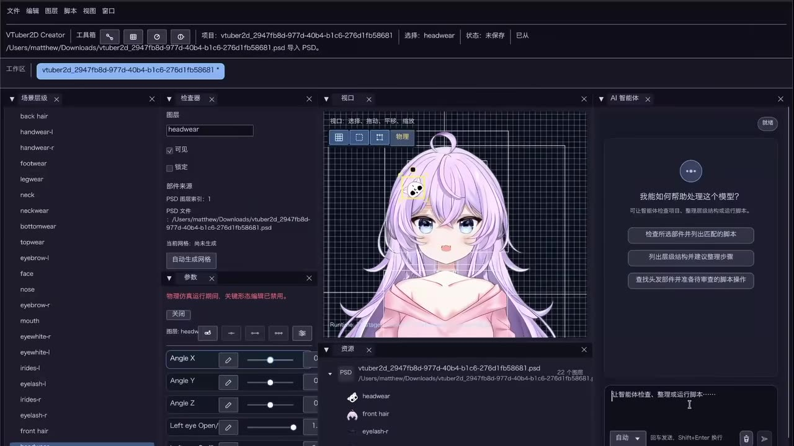
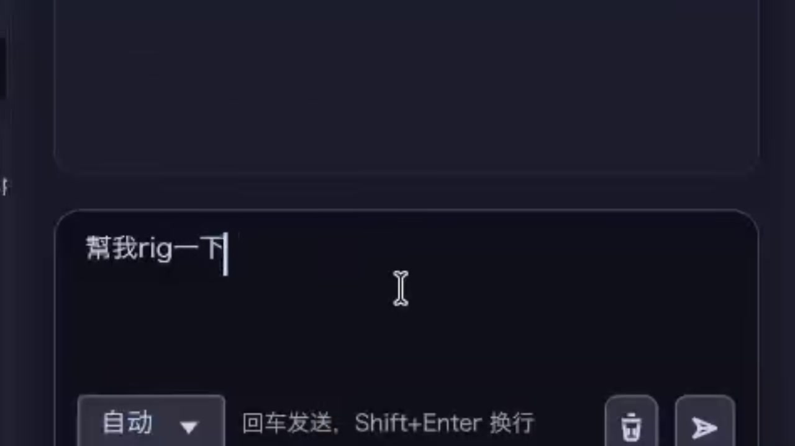

## 小结

视频展示了 UP 主“狙七在干嘛”正在开发的一个早期 AI Agent 工具：目标是从一张角色图像出发，自动完成抠图、图层拆分、绑定骨骼（Rig）等流程，并生成一个最基础的可动 Live2D 模型。视频开头的口播将其称为“全球首个 AI 自动建模系统”，但这是一项作者自述性质的宣传表述，素材中没有提供可用于横向验证“全球首个”的产品对比、公开论文或测试数据。

从画面可见，该工具运行在名为 **VTuber2D Creator** 的界面中：左侧是场景层级与部件列表，中间是带网格的角色编辑视口，右侧为“AI 智能体”面板。面板提供诸如检查部件、列出层级结构、查找头发部件等任务入口，说明其交互形态并非单纯的图像生成，而是尝试让 Agent 在二维模型编辑环境中理解部件结构并执行建模任务。

视频及简介披露的自动化链路是：**输入图片 → 自动扣图/拆分图层 → 生成或整理 PSD 图层 → 绑骨骼/生成基础网格 → 输出基础可动模型**。简介还给出图像拆分环节所使用的开源项目链接：[`shitagaki-lab/see-through`](https://github.com/shitagaki-lab/see-through)。不过，视频没有展示完整运行耗时、导出文件格式、参数配置、成功率、可编辑性、复杂动作效果或与 Cubism 等主流工作流的兼容性，因此不能据此判断其生产可用程度。

适合关注 AI 辅助创作、VTuber、Live2D 建模自动化以及角色图层拆分的人阅读。对希望立即用它替代专业建模流程的读者，最重要的结论是：作者明确表示项目“目前还非常初期”，定位是生成“最基础的可动模型”，不应将演示等同于成熟商用工作流。

时效性方面，视频发布于 2026 年 5 月，展示的是开发中的工具状态。作者邀请感兴趣者前往 `https://vtuber2d.ai` 留下邮箱以获取后续更新；内测资格的具体发放规则、产品上线时间和功能范围均未在素材中说明。

## 思维导图

## 目录

- [项目定位与已知信息](#项目定位与已知信息-000000)
- [界面演示：AI Agent 参与 Live2D 编辑](#界面演示ai-agent-参与-live2d-编辑-000000)
- [自动化流程与可复用步骤](#自动化流程与可复用步骤-000000)
- [内测与功能反馈入口](#内测与功能反馈入口-000016)
- [参数、限制与时效性](#参数限制与时效性-000000)
- [字幕比对](#字幕比对)
- [评论分析](#评论分析)
- [处理记录](#处理记录)

## 项目定位与已知信息 [00:00:00](https://www.bilibili.com/video/BV1j19oB4E8C?t=0)

视频开场口播为：“我做了全球首个 AI 自动建模系统。”站内字幕的对应区间为 `00:00:00,100 → 00:00:03,300`，本次 ASR 的对应区间为 `00:00:00,000 → 00:00:03,220`。两份字幕文本一致，仅起止时间存在约 0.1 秒量级的差异。

需要区分以下三层信息：

1. **视频口播事实**：作者宣称做出了“全球首个 AI 自动建模系统”。
2. **作者简介中的功能描述**：工具会尝试自动扣图、分层、绑骨骼，生成基础可动模型；整个过程“全靠 AI 自己跑，没有人工干预”。
3. **未被素材证明的内容**：该工具是否确为全球首个、其自动化过程的成功率、生成质量是否稳定、是否可用于商业交付，均没有足够材料验证。

简介还明确指出，视频中的内容是“真实演示”，没有剪掉失败案例；但由于本片时长仅 23 秒，且未提供逐次运行记录或失败样例的具体判据，这只能作为作者对演示方式的说明，不能外推为系统的客观通过率。

## 界面演示：AI Agent 参与 Live2D 编辑 [00:00:00](https://www.bilibili.com/video/BV1j19oB4E8C?t=0)

关键帧画面显示软件顶部标识为 **VTuber2D Creator**。编辑器的主体区域可归纳为：

- **左侧：场景层级/部件列表**  
  可见 `Body`、`Face`、`Hair Front`、`Eye Shine` 等层级或部件名称；另一组画面中还出现 `back hair`、`handwear-l`、`handwear-r`、`footwear`、`neck`、`topwear`、`eyebrow-l`、`mouth`、`eyewhite-l`、`eyelash-l` 等名称。这表明角色被拆分为可单独处理的身体、服饰、面部和头发部件。

- **中间：模型预览与编辑视口**  
  角色位于带方格的编辑区域中，周围叠加了选区/边界框。界面下方可见运行状态信息，例如 `12 stages | bones 0 | deformers 0 | physics live`；其中“bones 0 / deformers 0”出现于某一画面状态，不能据此断言最终模型没有骨骼或变形器，只能说明截图时的运行状态显示如此。

- **右侧：AI 智能体面板**  
  面板标题为“AI 智能体”，并显示“我能如何帮助处理这个模型？”等提示。可见的预设任务包括：
  - 检查所有部件并列出匹配的脚本；
  - 列出层级结构并建议整理步骤；
  - 查找头发部件并准备待审查的脚本操作。  

  这说明 Agent 被设计为围绕模型部件、层级和脚本操作提供辅助，而不只是生成一张静态角色图。

> 图：该帧同时呈现了场景层级、参数面板、中央编辑网格和右侧“AI 智能体”区域，是判断工具工作形态的重要依据。它表明演示对象处于二维角色模型编辑软件内，而非仅展示一张生成后的图片。

> 图：该帧展示了粉发角色的身体、服饰与左右手部配件，并在左侧列出多个拆分部件。它的价值在于直观说明自动建模所需面对的是多部件角色结构，而不是一个不可分割的单层立绘。

> 图：该帧聚焦角色头部，左侧列出面部、眉毛、嘴巴、眼白、虹膜、睫毛和头发等名称。面部与头发通常是 Live2D 中分层和形变关系较复杂的区域，因此该画面有助于理解 Agent 面向部件结构进行处理的目标。

> 图：该帧显示用户在 AI 面板输入框中键入“帮我 rig 一下”。它直接证明演示中存在自然语言驱动的 Agent 交互；但素材未展示该请求执行后的完整日志、成功判定或最终导出结果。

### 画面中可见的模型信息

画面中可以读取到以下局部信息：

| 可见项目 | 画面含义 | 可确认范围 |
| --- | --- | --- |
| PSD 导入提示 | 界面出现“导入 PSD”等文字与 PSD 资源路径 | 可确认软件以 PSD 图层资源为处理对象之一 |
| 图层数量 | 一处资源信息显示“22 个图层” | 可确认该演示项目至少呈现出 22 层的资源信息；不能据此概括所有输入图片的层数 |
| 自动生成网格按钮 | 界面可见“自动生成网格” | 可确认存在该功能入口；未展示其算法、参数与输出质量 |
| 物理仿真提示 | 参数区出现“物理仿真运行期间，关键形态编辑已禁用” | 可确认软件具有物理仿真相关状态；未展示物理效果是否由 AI 自动配置 |
| AI 任务面板 | 预设部件检查、层级整理、头发查找等任务 | 可确认 Agent 提供这些交互方向；未展示每项任务的执行结果 |

## 自动化流程与可复用步骤 [00:00:00](https://www.bilibili.com/video/BV1j19oB4E8C?t=0)

以下流程来自视频简介与关键帧画面，应理解为作者当前工具的目标流程，而非已经在视频中逐步验证的标准操作手册。

### 1. 准备输入角色图

作者描述的输入是“一张图”。从结果画面可以看出，工具期望将角色拆为头发、面部、身体、服饰和四肢配件等独立部件。

**适用前提：**

- 输入图中人物主体应相对清晰；
- 需要能够识别出面部、头发、身体和服装等视觉区域；
- 复杂遮挡、透明材质、前后景深关系、极细小饰品等情况是否能正确拆分，视频未展示。

### 2. 自动扣图与图层拆分

作者在简介中说明，系统会尝试“自动扣图、分层”。其提供的技术线索是图像拆分使用开源项目：

- 项目：[`shitagaki-lab/see-through`](https://github.com/shitagaki-lab/see-through)

视频没有展示该项目的具体调用方式、模型版本、提示词、图像分辨率或后处理规则。因此，不能补写为特定命令、API 参数或固定输出格式。

从画面侧可观察到，处理后的模型包含头部、前后发、眼睛、眉毛、嘴巴、服装及左右配件等层级。这说明拆分目标不仅是抠出人物轮廓，还包括按可动需求形成更细的部件组织。

### 3. 导入 PSD 并整理部件结构

关键帧中可见 PSD 导入和图层列表。按画面与简介可整理为如下操作逻辑：

1. 将拆分后的角色资源以 PSD 图层形式导入编辑器；
2. 让系统识别或检查已有部件；
3. 通过 AI 智能体检查部件、查看层级结构，必要时获得整理建议；
4. 对重点区域，例如头发，进行定位或准备后续操作。

这里的“整理”是重要环节：自动拆分产生的图层如果命名混乱、前后遮挡关系不正确、部件边界不完整，就会影响后续网格和绑定质量。视频证明界面存在层级与 Agent 任务入口，但没有展示 Agent 是否会自动重命名、合并、拆分或人工确认。

### 4. 生成网格与绑定骨骼

作者将“绑骨骼”列为自动化步骤；画面还显示“自动生成网格”按钮，并有用户向 Agent 输入“帮我 rig 一下”的交互。

可据此确认的能力目标是：

- 为拆分后的二维部件生成网格；
- 让 Agent 尝试执行 Rig 相关操作；
- 输出基础可动模型。

但以下关键信息在素材中缺失：

- 网格密度、自动切分规则与是否支持手工编辑；
- 骨骼层级、参数数量、变形器数量；
- 面部参数是否覆盖眨眼、张嘴、转头、表情切换；
- 物理参数是否自动生成；
- Rig 失败时的提示、回退与人工修正机制；
- 导出到何种运行时或文件格式。

因此，“一键完成专业 Live2D 建模”不是本视频能够支持的结论。更严谨的表述是：该工具正在尝试将从图像分层到基础 Rig 的多个环节交由 AI Agent 串联处理。

## 内测与功能反馈入口 [00:00:16](https://www.bilibili.com/video/BV1j19oB4E8C?t=16)

视频后段口播为：“一键三连加关注，获得内测资格。希望有什么功能的话，留言告诉我。”

站内字幕将其拆分为以下三段：

| 时间 | 字幕内容 |
| --- | --- |
| `00:00:16,420 → 00:00:17,900` | 一键三连加关注 |
| `00:00:17,900 → 00:00:19,780` | 获得内测资格 |
| `00:00:20,310 → 00:00:21,710` | 希望有什么功能的话 |
| `00:00:21,710 → 00:00:22,940` | 留言告诉我 |

本次 ASR 将上述内容合并为一段，时间为 `00:00:16,690 → 00:00:22,650`。

作者提供了两种参与方式：

1. **站内互动与评论反馈**：通过“三连加关注”及留言表达对内测和功能的兴趣。
2. **邮件订阅**：在 `https://vtuber2d.ai` 留下邮箱，以接收后续项目进度通知。

需要注意，“三连加关注即可获得内测资格”是视频口播中的号召，但素材没有说明资格数量、筛选条件、通知渠道、是否自动获得，或与邮件订阅之间的关系。建议将其理解为作者的征集方式，而不是已公开的确定性资格规则。

## 参数、限制与时效性 [00:00:00](https://www.bilibili.com/video/BV1j19oB4E8C?t=0)

### 已披露参数与条件

| 项目 | 素材中的信息 |
| --- | --- |
| 视频时长 | 23 秒 |
| 输入形式 | 一张角色图像 |
| 处理目标 | 自动扣图、分层、绑骨骼、生成基础可动模型 |
| 图像拆分技术线索 | `shitagaki-lab/see-through` |
| 编辑环境画面标识 | VTuber2D Creator |
| 演示资源信息 | 画面中可见 PSD、部件层级；一处显示 22 个图层 |
| Agent 交互 | 可见预设任务与“帮我 rig 一下”的文本输入 |
| 公开入口 | `https://vtuber2d.ai` |

### 未披露或无法从视频确认的参数

视频没有提供下列决定实际可用性的内容：

- 模型部署方式、系统要求、GPU/CPU 要求；
- 图像支持的尺寸、格式、最大分辨率和角色风格限制；
- 自动拆层的准确率、修补能力、失败率；
- 每个角色从输入到生成所需的耗时；
- 生成模型的参数数量、网格数量、骨骼数量；
- 导出的工程格式、是否兼容 Live2D Cubism、VTube Studio 或其他运行时；
- 商业使用权、版权归属、训练数据来源与隐私政策；
- 内测申请、价格、开放范围和正式上线日期。

### 使用边界

1. **“全球首个”不可直接采信为行业事实**  
   这是作者口播主张；视频未提供竞品检索范围或定义标准。不同产品可能将“自动建模”定义为自动分层、自动网格、自动绑定或端到端导出，比较前提并不明确。

2. **“全自动”不等于“无需人工验收”**  
   简介称过程没有人工干预，但实际二维角色制作对遮挡补全、部件命名、层级关系、网格边缘、表情和物理效果通常有较高要求。视频未展示对异常案例的修复能力，不能假设输出可直接交付。

3. **当前定位是“基础可动模型”**  
   作者没有承诺高精度表情、复杂头部转动、全身动作、服装物理或高质量商业级成品。对复杂角色，应预期仍可能需要人工检查和后续编辑。

4. **项目处于快速变化阶段**  
   视频发布时项目仍“非常初期”。功能界面、底层模型、拆分方案、内测规则和订阅入口都可能在后续版本调整，应以项目官方后续公告为准。

## 字幕比对

| 字幕来源 | 完整性 | 专有名词 | 时间轴 | 主要问题 |
| --- | --- | --- | --- | --- |
| Bilibili 站内字幕 | 覆盖开头声明与结尾号召，共 5 个分段；未覆盖中段画面信息 | 未涉及工具名、网站名或技术项目名 | 分段细，尤其完整拆分了 16.420—22.940 秒的结尾口播 | 只有口播字幕，无法解释中段界面和工作流 |
| 本次 ASR 字幕 | 覆盖两段可听语音，共 2 段 | 未识别出 VTuber2D Creator、Rig、see-through 等仅见于画面或简介的信息 | 首段为 0.000—3.220 秒；结尾合并为 16.690—22.650 秒 | 将结尾多句合并，遗漏站内字幕中 20.310—20.690 秒附近的细粒度停顿；中段无语音内容 |

### 字幕选择结论

本次 ASR 已实际检查：识别语言为中文，语言置信度为 `0.9541`，音频时长为 `22.98775` 秒，包含 2 个语音分段，语音覆盖时长约 `9.18` 秒、覆盖率约 `39.93%`。诊断中**未标记** `noAudioStream=true`，因此源视频存在音轨；中段约 13.47 秒的大空档是无可识别口播或以画面展示为主，而不是音轨缺失。

正文采用以下合并策略：

- 开头“我做了全球首个 AI 自动建模系统”：站内字幕与 ASR 文本一致，使用站内字幕的细分时间 `00:00:00,100 → 00:00:03,300` 作为优先参考。
- 结尾互动号召：采用站内字幕的四段切分，以保留“获得内测资格”和“留言告诉我”的语义结构；ASR 用于交叉验证整句文本。
- “VTuber2D Creator”“AI 智能体”“自动生成网格”“帮我 rig 一下”“PSD”“22 个图层”等内容：不属于可听口播，而是由关键帧可见文字补充。
- “自动扣图、分层、绑骨骼”“输入一张图”“使用 see-through”：来自视频简介，已与口播和画面信息明确区分。

## 评论分析

本次可获取的热评数据设置上限为 3 条，但实际仅返回 2 条，因此只分析这 2 条，不补造第三条评论。

### 1. 对职业替代速度的担忧

- **评论者**：举止怪异的威廉先生  
- **获赞**：397  
- **核心观点**：评论者认为，以 AI 的进步速度，中等水平以下的普通建模工作可能在三年内受到冲击；同时表达了对这种淘汰方式的担忧。
- **补充价值**：该评论反映出受众将视频中的自动化建模能力，与创作行业岗位变化直接关联。
- **可信度与边界**：这是对未来的个人预测，不是视频提供的测试结论。视频本身没有证明工具已经达到替代“中等水平以下普通建模”的能力，更没有提供三年内职业变化的证据。

### 2. 对基础 Live2D 模型定价的质疑

- **评论者**：甲基赤藓醇磷酸  
- **获赞**：247  
- **核心观点**：评论者认为部分基础“皮套”（通常指 VTuber 形象或模型）的价格偏高，尤其不理解一些基础模型为何定价较贵。
- **补充价值**：该观点揭示了潜在需求侧期待：若自动分层和基础绑定成本下降，用户可能希望基础模型制作价格降低、获取门槛下降。
- **可信度与边界**：评论没有给出具体报价、制作标准、修订次数、版权授权、绘制成本或模型精度指标。Live2D 定价通常还包含原画、拆分、绑定、表情、物理、沟通返工及商用授权等成本，不能仅凭该评论判定行业定价是否“过高”。

## 处理记录

- **Worker ID**：`worker-mrj0www4-e8d79408`
- **模型**：`gpt-5.6-terra`
- **调用工具与素材**：视频元数据、站内 SRT 字幕 `p01-ai-zh.srt`、本次 ASR 结果 `asr/asr-result.json` 与 `asr/transcript.srt`、关键帧目录 `frames/`、热评数据 `comments/comments.json`、视频简介。
- **ASR 检查结果**：ASR 模型为 `medium`，语言识别为中文，推理设备为 CUDA、计算类型为 float16；结果有时间戳，未出现 `noAudioStream=true` 标记，确认源视频有音轨。
- **字幕选择**：开头采用站内字幕与 ASR 的一致文本；结尾优先采用站内字幕的细分时间轴，并用 ASR 合并段交叉验证；中段界面信息由关键帧和视频简介补充。
- **关键帧选择依据**：选用 `frames/frame-001.jpg` 至 `frames/frame-004.jpg`，分别用于证明编辑器整体布局、角色拆分层级、面部/头发部件结构，以及自然语言请求 Rig 的 AI 面板交互。未将关键帧未明确展示的算法、参数或执行结果写为事实。
- **评论处理**：按“热评前三条”要求读取数据；源数据仅返回 2 条可获取热评，已如实分析 2 条，未推断缺失的第 3 条。
- **缓存清理**：素材清单未提供缓存清理执行日志；本记录不声称已执行或完成缓存删除。
- **未解决问题**：关键帧素材未提供逐帧精确时间戳；因此除有 SRT/ASR 支持的 0 秒与 16 秒口播位置外，未根据文字或画面顺序虚构中段精确时间。工具的实际成功率、生成耗时、导出格式、兼容性、价格和内测规则亦未在现有素材中披露。
