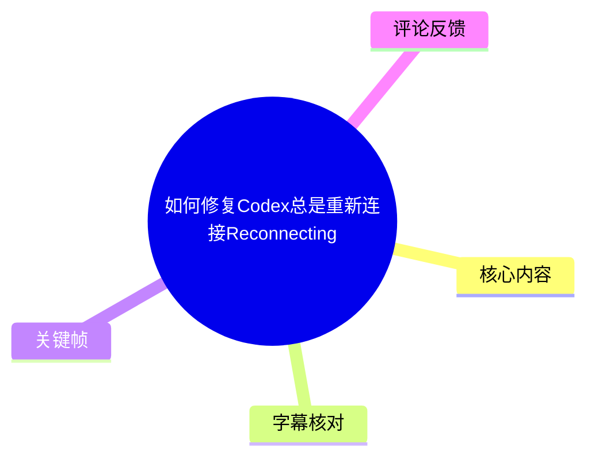
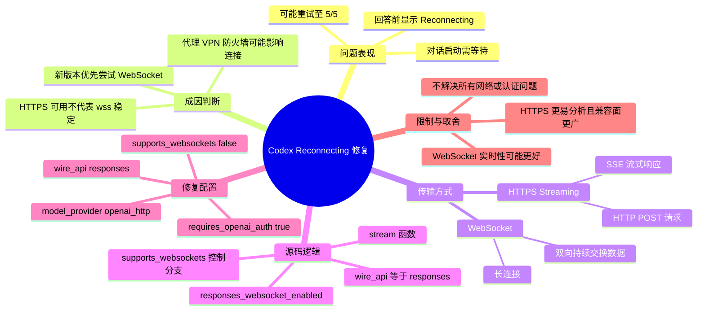
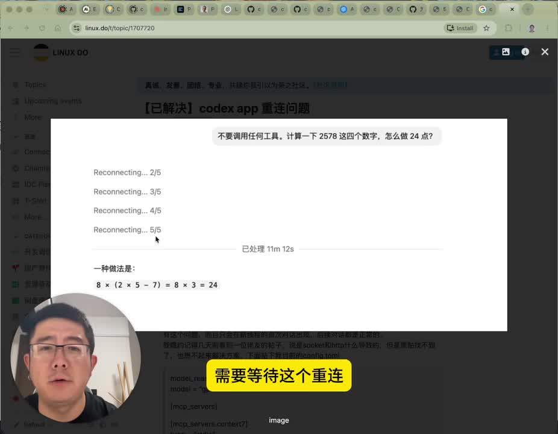
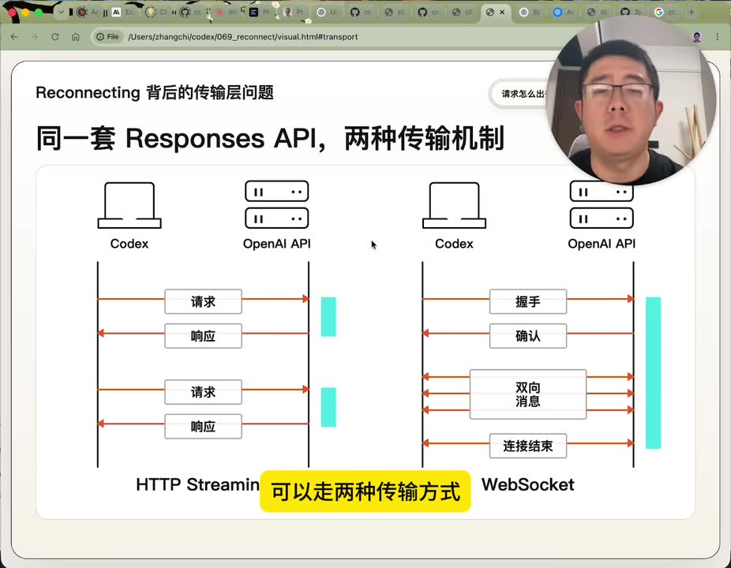
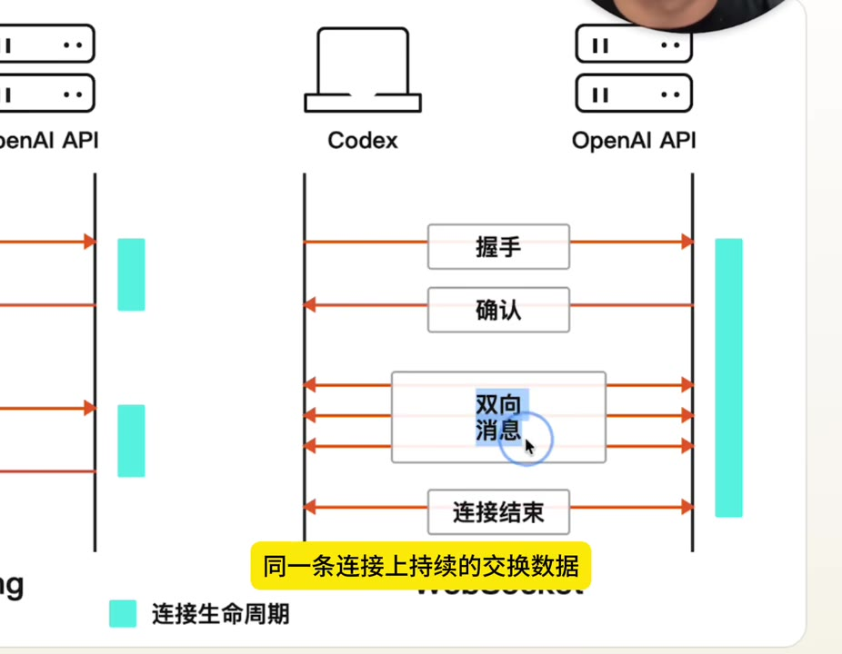
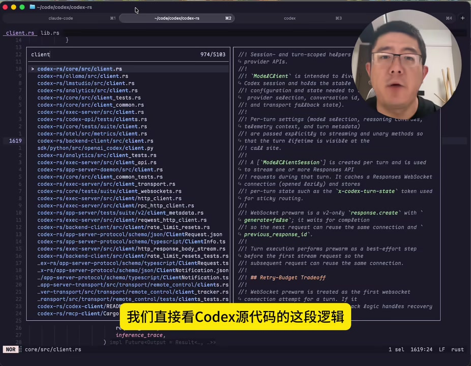

# 如何修复Codex总是重新连接Reconnecting

> 来源：[Bilibili 视频](https://www.bilibili.com/video/BV1ASjx6XEcu)<br>
> UP 主：张司机在路上｜发布时间：2026-06-21｜视频时长：04:41｜合集：AIcode

## 小结

视频讨论 Codex 在每次回答前频繁显示 `Reconnecting...`、甚至重试到 `5/5` 后才恢复的问题。UP 主的判断是：这不必然意味着模型慢、服务器繁忙或普通网络不可用；在其所述的 Codex 新版本行为中，问题常与优先尝试 WebSocket 连接有关。普通 HTTPS 可访问，并不等于 `wss://` WebSocket 在代理、VPN 或防火墙链路中同样稳定。

核心解决方案是：在用户级 Codex 配置中新增一个使用 Responses API 的 HTTP Provider，并将 `supports_websockets` 显式设置为 `false`。这样不改变 `wire_api = "responses"`，但会使 Codex 的 WebSocket 可用性判断返回 `false`，从而改走普通 HTTPS Streaming 路径。

视频通过 `codex-rs` 的 `client.rs` 代码逻辑解释该配置为何有效：`stream` 函数先检查 Provider 的 `wire_api` 是否为 `responses`，再调用 WebSocket 启用判断；当 Provider 声明不支持 WebSocket，或当前会话已禁用 WebSocket 时，会回退至 Responses API 的 HTTPS 传输路径。

此方法适合遇到 WebSocket 重连、希望排查传输层行为、或需要优先使用 HTTPS 兼容性的 Codex 使用者。它并不是“修复所有网络问题”的通用方案：若 HTTPS 本身、认证、代理环境或配置文件格式存在问题，仍可能继续失败；Codex 版本更新后，配置字段、Provider 名称与连接逻辑也可能变化。

## 思维导图





## 目录

- [问题现象与传输层背景](#问题现象与传输层背景)
- [Responses API 的两种传输机制](#responses-api-的两种传输机制)
- [源码中的连接选择逻辑](#源码中的连接选择逻辑)
- [配置修改：强制走 HTTPS Streaming](#配置修改强制走-https-streaming)
- [使用动机、适用范围与限制](#使用动机适用范围与限制)
- [字幕比对](#字幕比对)
- [评论分析](#评论分析)
- [处理记录](#处理记录)

## 问题现象与传输层背景 [00:00:25](https://www.bilibili.com/video/BV1ASjx6XEcu?t=25)

视频描述的现象是：Codex 在开始回答前先显示 `Reconnecting`，可能依次出现 `1/5`、`2/5`，直至 `5/5`；即使最终能恢复并输出回答，每次新开对话仍须等待重连过程。

UP 主将问题定位在**传输方式选择**而不是单纯的“网络不好”：

1. Codex 会把对话上下文通过 Responses API 发送至 OpenAI 后端。
2. 同一套 API 在视频所述实现中可通过 HTTPS Streaming 或 WebSocket 传输。
3. OpenAI 在视频提及的“4 月底”引入了 Responses API 的 WebSocket 能力；该说法属于视频发布时的技术背景，具体上线日期及当前产品行为应以官方文档为准。
4. 当客户端、代理、VPN 或防火墙对 WebSocket 支持不稳定时，连接尝试可能失败；此时即使普通 HTTPS 请求可以通，也未必能保证 `wss://` 连接稳定。



> 图：画面展示 `Reconnecting... 2/5` 至 `5/5` 的连续重连提示，以及最终恢复回答的结果。这一帧直观定义了视频要解决的症状：问题不一定导致永久不可用，但会显著增加每轮对话开始前的等待。

## Responses API 的两种传输机制 [00:00:25](https://www.bilibili.com/video/BV1ASjx6XEcu?t=25)

视频将传输机制区分为以下两类。

### HTTPS Streaming：请求—流式响应

在 [00:00:25](https://www.bilibili.com/video/BV1ASjx6XEcu?t=25) 至 [00:00:49](https://www.bilibili.com/video/BV1ASjx6XEcu?t=49) 的讲解中：

- 客户端以 HTTP `POST` 发起请求；
- 服务器通过 SSE（Server-Sent Events）逐步把响应推送回来；
- 视频称 Claude Code 使用的是类似的传输方式；
- 这种模式在视频中被称为更容易观察和分析每次请求内容变化的方式。

### WebSocket：单条长连接上的双向通信

在 [00:00:49](https://www.bilibili.com/video/BV1ASjx6XEcu?t=49) 至 [00:01:12](https://www.bilibili.com/video/BV1ASjx6XEcu?t=72)：

- WebSocket 会先建立连接并完成握手；
- 连接建立后，客户端与服务器能够在同一条连接中持续交换数据；
- 视频认为这尤其适合 Agent 的多轮、流式、交互频繁场景；
- 相应的代价是：连接依赖链路中各环节对 WebSocket 的稳定支持。



> 图：关键帧以时序图对比两种机制。左侧是每次请求和响应相对独立的 HTTP Streaming；右侧是先握手、确认，再在同一连接中双向传输消息的 WebSocket。该图是理解“API 相同、底层传输可不同”的关键。



> 图：画面放大了 WebSocket 一侧：握手、确认、双向消息和连接结束均发生在连接生命周期内。它说明为何 WebSocket 对中间代理、网络策略及连接保活更敏感。

## 源码中的连接选择逻辑 [00:01:12](https://www.bilibili.com/video/BV1ASjx6XEcu?t=72)

视频在 `codex-rs` 仓库的 `client.rs` 中定位到 `stream` 函数，并将其解释为决定每次请求采用何种传输方式的入口。根据视频 [00:01:32](https://www.bilibili.com/video/BV1ASjx6XEcu?t=92) 至 [00:03:25](https://www.bilibili.com/video/BV1ASjx6XEcu?t=205) 的讲解，逻辑可整理如下。



> 图：关键帧展示在 `codex-rs/core/src/client.rs` 中检索和阅读连接逻辑的过程。它为下方的判断链提供了视频内的源码定位依据，而非仅停留在配置结论。

### 判断链

```text
stream()
  ├─ 检查当前 Provider 的 wire_api
  │   └─ 若 wire_api = responses
  │       └─ 调用 responses_websocket_enabled()
  │           ├─ supports_websockets = false
  │           │   └─ 返回 false
  │           ├─ 当前 session 已禁用 WebSocket
  │           │   └─ 返回 false
  │           └─ 否则
  │               └─ 可以尝试 WebSocket
  └─ WebSocket 不可用时
      └─ 进入 Stream Responses API 的 HTTPS 传输路径
```

### 视频强调的两个条件

在 [00:02:13](https://www.bilibili.com/video/BV1ASjx6XEcu?t=133) 至 [00:02:37](https://www.bilibili.com/video/BV1ASjx6XEcu?t=157)，UP 主指出 `responses_websocket_enabled()` 主要涉及两个否决条件：

| 条件 | 视频中的结果 |
| --- | --- |
| Provider 信息中的 `supports_websockets = false` | 函数直接返回 `false`。 |
| 当前 Session 已将 WebSocket 标记为禁用 | 函数返回 `false`。 |

视频还提到：当连接重试到 5 次失败后，Codex 会在当前 Session 中把 `disable_websocket` 标记设为 `true`，后续判断将回退至 HTTPS。此处是 UP 主基于其阅读源码所作的行为解释；不同 Codex 版本的重试次数和具体状态字段仍应以本机版本源码或日志为准。

因此，视频方案的关键不是修改模型，也不是改用另一套 API，而是通过 Provider 配置在**第一次传输选择前**声明“不支持 WebSocket”，避免先经历多次失败重连再被动回退。

## 配置修改：强制走 HTTPS Streaming [00:03:01](https://www.bilibili.com/video/BV1ASjx6XEcu?t=181)

视频给出的实际操作是：编辑用户级 Codex 配置文件，在其 TOML 配置中加入以下 Provider 定义。

```toml
model_provider = "openai_http"

[model_providers.openai_http]
name = "OpenAI HTTP"
wire_api = "responses"
requires_openai_auth = true
supports_websockets = false
```

### 字段含义与作用

| 配置项 | 视频中的解释 | 对连接选择的作用 |
| --- | --- | --- |
| `model_provider = "openai_http"` | 选用名为 `openai_http` 的模型 Provider。 | 将当前模型 Provider 指向下面定义的配置块。 |
| `[model_providers.openai_http]` | 定义该 Provider 的详细信息。 | 这些字段会成为源码读取的 Provider Info。 |
| `name = "OpenAI HTTP"` | Provider 的显示名称。 | 主要是标识用途。 |
| `wire_api = "responses"` | 仍使用 Responses API。 | 满足 `stream` 函数关于 Responses API 的第一层判断。 |
| `requires_openai_auth = true` | 仍需要 OpenAI 身份认证。 | 不等于改用匿名或无认证接口。 |
| `supports_websockets = false` | 明确声明该 Provider 不支持 WebSocket。 | 关键开关：使 WebSocket 启用判断返回 `false`，进而走 HTTPS Streaming。 |

### 操作步骤

1. **定位 Codex 的用户级配置文件**  
   视频称其为 Codex config 的 TOML 文件，但未在字幕中给出准确的文件绝对路径。应依据本机 Codex 的版本和官方文档确认实际配置位置。

2. **备份现有配置**  
   在更改前保留原文件副本，避免丢失已有的模型 Provider、代理或认证设置。

3. **添加或更新 Provider 配置**  
   将上述 TOML 块写入配置中。若已有同名 `openai_http` Provider，应避免重复定义同一 TOML 表。

4. **确认关键项没有拼写或类型错误**  
   最重要的是：
   ```toml
   supports_websockets = false
   ```
   这里应为布尔值 `false`，不是字符串 `"false"`。

5. **重启 Codex 并测试新会话**  
   新开一个对话，观察是否不再先显示多次 `Reconnecting`。若仍有问题，需要继续区分 HTTPS、认证、代理和 DNS 等层面的故障。

### 配置生效后的预期路径

```text
wire_api = "responses"
supports_websockets = false"
            ↓
responses_websocket_enabled() 返回 false
            ↓
不尝试 WebSocket
            ↓
使用 Responses API 的 HTTPS Streaming 路径
```

注意：上图中的逻辑表达应理解为流程说明；实际 TOML 配置请以前文代码块为准，其中 `supports_websockets = false` 后不应额外添加引号。

## 使用动机、适用范围与限制 [00:03:45](https://www.bilibili.com/video/BV1ASjx6XEcu?t=225)

### 为什么 UP 主偏好 HTTPS

在 [00:03:45](https://www.bilibili.com/video/BV1ASjx6XEcu?t=225) 至 [00:04:31](https://www.bilibili.com/video/BV1ASjx6XEcu?t=249)，UP 主给出两个个人使用层面的理由：

1. **便于观察完整上下文变化**  
   视频认为 WebSocket 方式下服务端会维护 Session 历史，因此后续轮次可能只发送新增上下文，而不是完整对话历史；HTTPS 请求方式更便于观察每次对话请求中的上下文变化。  
   这是视频对实现行为的解释，具体是否发送完整上下文仍取决于 Codex 版本、服务端协议与工具行为。

2. **生态兼容性更广**  
   视频称国内大模型厂商适配 Codex 时通常只提供 HTTPS API，且不少仅适配到 Chat Completions API，未适配 Responses API，更不用说 WebSocket。由此，HTTPS 被评价为更普遍、更容易分析的传输标准。

### 性能取舍

视频最后的观点是：

- WebSocket 的实时性理论上更好；
- 但 UP 主个人使用体验中，两者的体感差别不大；
- 若网络环境对 WebSocket 不稳定，优先 HTTPS 可减少反复重连带来的等待。

这属于使用体验判断，并非针对所有网络、地区、代理配置或工作负载的性能基准。

### 适用与不适用边界

| 场景 | 该方案的适配性 |
| --- | --- |
| Codex 在回答前反复重连，普通 HTTPS 请求通常正常 | 较适合尝试。 |
| 代理、VPN 或企业网络可能拦截/干扰 WebSocket | 较适合尝试。 |
| 需要抓取、分析或比较每轮 HTTP 请求上下文 | 较适合。 |
| HTTPS 也无法访问 OpenAI 服务 | 该配置未必有帮助，应排查网络、代理、DNS、认证等问题。 |
| 当前 Codex 版本不再支持这些 Provider 字段 | 需按新版官方文档或源码调整，不能照搬。 |
| 需要 WebSocket 的特定低延迟或长连接能力 | 禁用 WebSocket 可能不符合需求。 |

### 时效性说明

视频发布时间为 2026-06-21，内容涉及 Codex 的版本行为、`codex-rs` 源码分支和 Provider 配置字段。这些都可能随 Codex 更新而改变。尤其在执行配置前，应验证：

- 当前安装版本是否仍使用 `client.rs` 中相同的判断逻辑；
- `model_provider`、`model_providers`、`wire_api` 和 `supports_websockets` 是否仍是有效字段；
- 本机实际使用的 Provider 是否就是 `openai_http`；
- 本机代理是否要求单独的环境变量或客户端级代理配置。

## 字幕比对

站内未提供可用字幕，因此无法与同一时间轴上的官方/站内文本逐句核对；本次仍检查了 ASR 结果。

| 字幕来源 | 完整性 | 专有名词 | 时间轴 | 主要问题 |
| --- | --- | --- | --- | --- |
| Bilibili 站内字幕 | 未提供可用字幕。 | 无法评估。 | 无法评估。 | 没有可用于核对和采用的站内字幕。 |
| 本次 ASR 字幕 | 覆盖约 250.04 秒语音，占 280.52 秒视频的约 89.13%；首段语音位于 00:00:25.240。 | 多处存在音近或识别错误。 | 提供 13 个带起止时间的 SRT 分段，可用于章节时间轴。 | 存在词语连写、缺字和术语误识别，例如 `HTPS`、`CodeXT`、`OpenNI`、`ChadCompletion`。 |

### 最终字幕选择与校正

最终以**本次 ASR 的真实 SRT 时间戳**作为时间轴依据，并结合视频标题、元数据描述、关键帧中的文字和技术上下文校正术语。未发现 `noAudioStream=true` 标记；ASR 诊断显示存在音频流且识别语言为中文（置信度 `0.9990`），因此不属于“源视频无音轨”的情形。

主要校正如下：

| ASR 原文或误识别 | 正文采用写法 | 校正依据 |
| --- | --- | --- |
| `Codext`、`CodeXT` | Codex | 视频标题、元数据和画面均指向 Codex。 |
| `HTPS`、`HTB Streaming` | HTTPS、HTTPS Streaming | 技术语义及视频描述的 HTTP POST + SSE 流式响应。 |
| `Response API` | Responses API | 视频元数据配置为 `wire_api = "responses"`。 |
| `OpenNI` | OpenAI | 视频主题与配置中的认证字段为 `requires_openai_auth`。 |
| `supportwebsocket` | `supports_websockets` | 元数据提供了完整配置字段。 |
| `ChadCompletion API` | Chat Completions API | 常见 API 名称及视频语义。 |
| `tummel` | TOML | 视频明确讨论配置文件格式。 |

ASR 在 [00:01:12.380—00:01:29.420](https://www.bilibili.com/video/BV1ASjx6XEcu?t=72) 后与下一段 [00:01:32.250](https://www.bilibili.com/video/BV1ASjx6XEcu?t=92) 之间存在约 2.83 秒空档，在 [00:02:11.510—00:02:13.560](https://www.bilibili.com/video/BV1ASjx6XEcu?t=131) 之间存在约 2.05 秒空档；这些位置正文未据此补写未被素材确认的内容。

## 评论分析

以下仅处理可获取热评前三条。评论反映的是个体经验或提问，不能替代对当前 Codex 版本、配置路径及代理环境的验证。

### 1. 代理环境变量方案（41 赞）

评论者“鹿跃林”提供：

```bash
echo "ALL_PROXY=http://127.0.0.1:7890" >> ~/.codex/.env
```

并称“实测可行”。

- **补充价值**：该评论指出，重连可能与 Codex 进程是否继承代理环境变量有关；为 `.env` 设置 `ALL_PROXY` 是另一种排查路径。
- **与视频方案的关系**：视频方案是禁用 WebSocket、回退 HTTPS；该评论则倾向于让连接正确经过代理。两者处理的层次不同，可以分别验证。
- **限制**：端口 `7890`、代理协议、`.env` 文件位置以及 Codex 是否读取该变量均因机器而异。评论没有说明操作系统、Codex 版本、代理软件和是否同时配置 HTTP/HTTPS 代理，不能直接视作通用配置。

### 2. 让 Codex 自行修复（16 赞）

评论者“mangler”称，让 Codex 自己修复后，“花了一分钟然后就如德芙般丝滑了”。

- **补充价值**：说明可让 Codex 协助检查自身配置或生成排查步骤。
- **可信度与限制**：评论没有提供具体提示词、执行命令、配置改动或验证日志，因此无法判断实际修复的是 WebSocket、代理、环境变量还是其他问题。
- **实践建议**：若让 Codex 协助修改配置，应先备份文件、要求其明确展示改动，并在写入前人工确认，不应将“自动修复”视为可复现的技术方案。

### 3. 新版本仍出现 5/5 重连的反馈（3 赞）

评论者“教父Pacino”反馈：此前视频配置曾有效，但新版 Codex 又出现“正在重新连接 5/5”；其展示的个人目录 `.codex` 环境变量中包含视频的 Provider 配置，同时还设置了：

```bash
export https_proxy=http://127.0.0.1:7897
http_proxy=http://127.0.0.1:7897
all_proxy=socks5://127.0.0.1:7897
```

- **补充价值**：这是对“配置并非永久有效”的直接案例，也说明同一环境同时存在 Provider 配置和多种代理变量。
- **潜在问题**：评论中的 TOML 表头使用全角方括号 `【】`，这可能只是评论排版造成的展示差异，不能据此断言其本地文件也写错；但真实 TOML 必须使用半角 `[]`。
- **值得排查的点**：新版 Codex 是否仍读取该配置；环境变量文件是否被加载；`https_proxy` / `http_proxy` 与 `all_proxy` 是否存在优先级或协议兼容问题；是否仍有 WebSocket 尝试；以及 HTTPS 路径本身是否连通。
- **结论**：该评论是未验证的个案反馈，但支持本文的时效性提醒：升级后应重新核实版本行为与实际生效配置。

## 处理记录

- Worker ID：`worker-mrj0wbly-5dc4e50c`
- 模型：`gpt-5.6-terra`
- 调用工具与素材：基于任务提供的 Bilibili 元数据、视频描述、ASR 诊断、ASR SRT、关键帧清单与可获取热评前三条进行整理；未提供独立站内字幕文件。
- 使用的应用工具：素材获取流程已输出 `merged.mp4`、`audio/audio.wav`、`frames/`、`asr/transcript.srt`、`asr/asr-result.json` 与 `comments/comments.json`；本整理未额外执行外部网络检索或本地命令。
- 字幕选择：站内字幕不可用；检查并采用本次 ASR 的 13 段 SRT 起止时间作为时间轴。根据关键帧、视频元数据描述及技术上下文校正明显的 ASR 专有名词误识别，但未以校正结果虚构未出现的内容。
- 关键帧选择依据：`frame-001.jpg` 用于界定 `Reconnecting 5/5` 症状；`frame-002.jpg` 与 `frame-003.jpg` 用于解释 HTTPS Streaming 和 WebSocket 的机制差异；`frame-004.jpg` 用于支撑视频对 `codex-rs/core/src/client.rs` 源码逻辑的讲解。
- 缓存清理：任务素材中未提供缓存清理执行记录；无法确认是否已清理，故不作“已清理”声明。
- 未解决问题：未提供当前 Codex 版本号、实际配置文件路径、完整源码提交版本、网络抓包或配置修改后的实测日志；因此无法验证该方案在任意新版本和任意代理环境中的实际效果。
