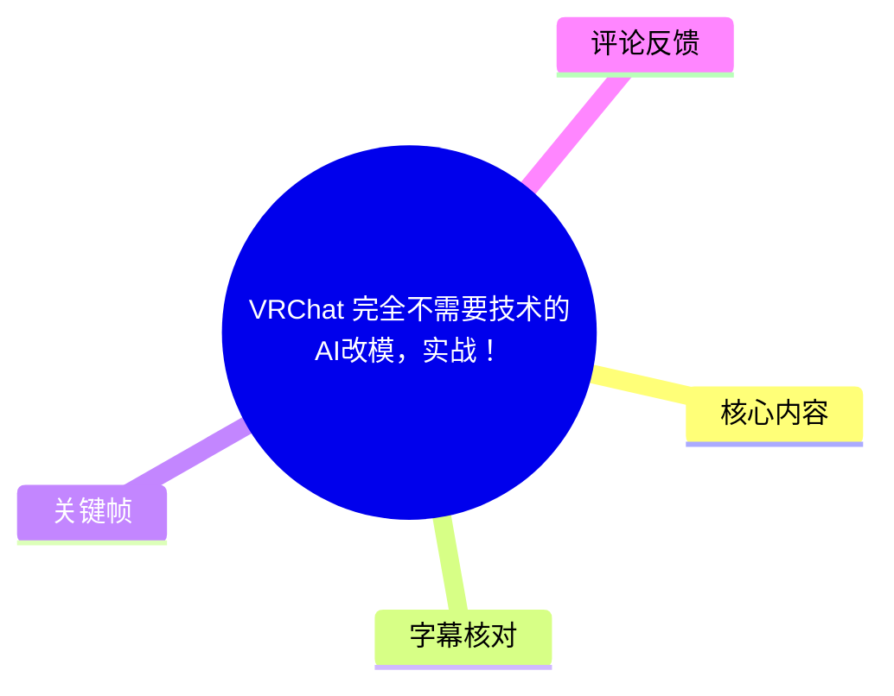
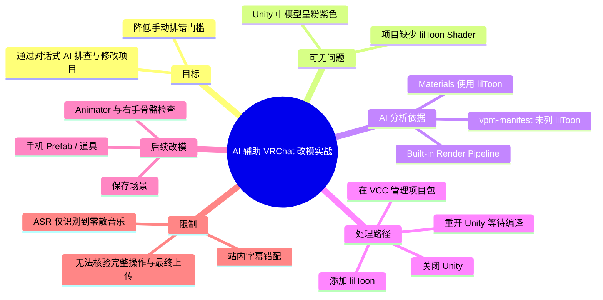
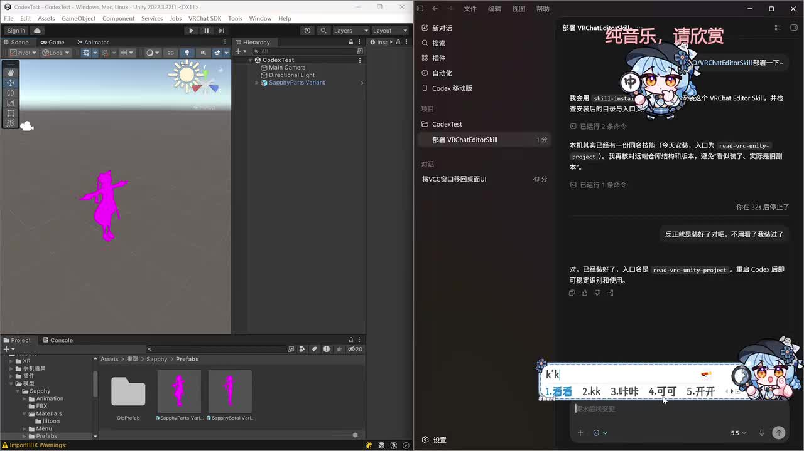
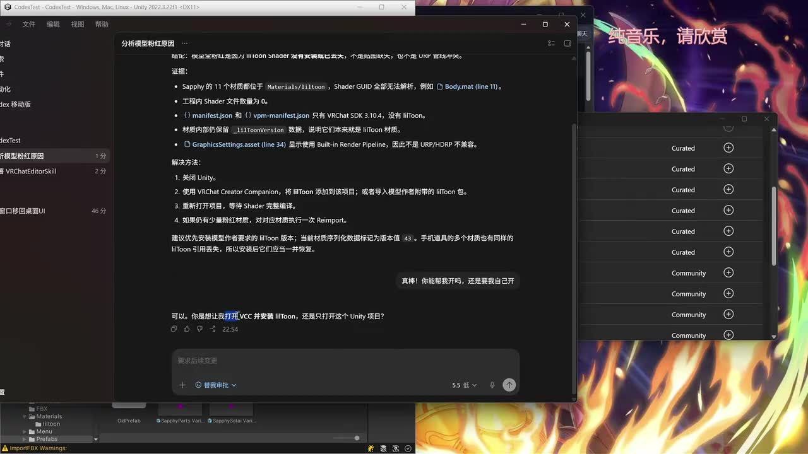
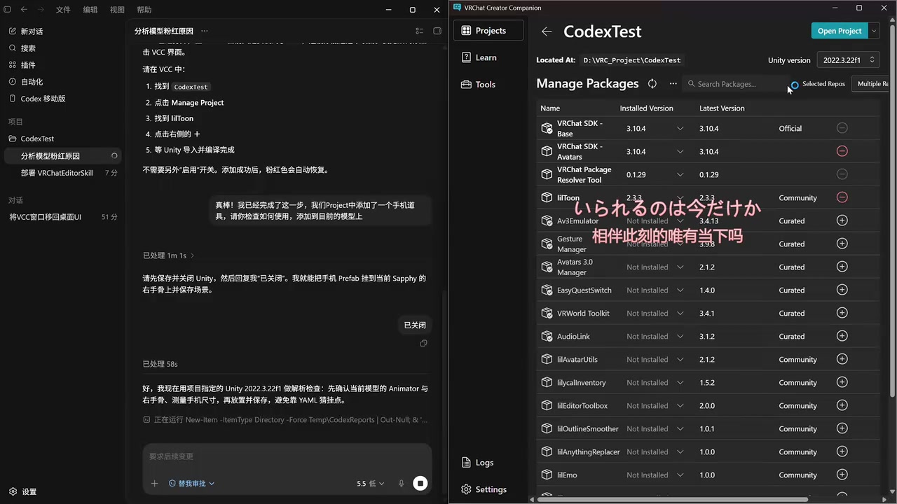
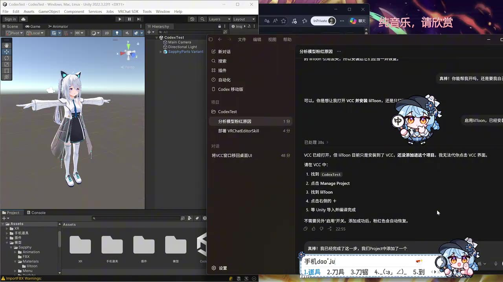

# [VRChat]完全不需要技术的AI改模，实战！

> 来源：[Bilibili 视频](https://www.bilibili.com/video/BV1NbjQ6AEhs)  
> UP 主：小咲咲小波｜合集：AIcode｜时长：33:04  
> 视频简介说明：作者在外、使用“没有 Codex 的设备”录制，并刻意模拟“不太了解改模的用户”；该表现不代表作者真实水平。

## 小结

本视频展示的是一次以 **Codex 对话式辅助 + Unity + VRChat Creator Companion（VCC）** 完成 VRChat 模型修改/修复的实战过程。画面核心不是手写代码或手动逐项排查，而是将问题交给 AI 分析，再按 AI 给出的可执行步骤在 Unity、VCC 中操作。

从关键帧可确认的主要问题是：模型在 Unity 中以醒目的粉紫色显示，AI 将其归因于项目缺失 **lilToon** Shader；同时，项目的 `vpm-manifest.json` 中只有 VRChat SDK 3.10.4、未包含 lilToon，且 `GraphicsSettings.asset` 显示为 Built-in Render Pipeline。AI 建议通过 VCC 为项目添加 lilToon，再重新打开 Unity、等待 Shader 编译。

画面后续显示，操作者已在 VCC 的 **Manage Packages** 页面中看到并安装了 lilToon 2.3.3；模型随后恢复为正常显示。对话还涉及给模型/Prefab 添加手机道具，以及检查 Animator、右手骨骼与手机道具挂载位置等内容。

需要特别注意：本次提供的站内字幕与视频标题、画面完全不符，内容实际上是另一支关于“世田谷灭门案”的视频，不能作为本视频依据；本次 ASR 只在 06:53—10:16 识别到零散日语歌曲片段，语音覆盖率仅 2.19%，同样无法还原教程讲解。因此，本文对操作流程的记录严格限于关键帧中可见的界面、文字与对话内容；未从画面明确读出的命令、代码、导出设置和最终上传结果均不作补写。

适合读者：希望用 AI 降低 VRChat 模型修改门槛、但仍需要在 Unity/VCC 中完成必要确认与点击操作的用户。其经验并不等于“完全无需技术”：至少仍要能辨认 Unity 项目、VCC 包管理、Shader 依赖、Prefab 和骨骼挂载等基本对象。

## 思维导图

## 目录

- [素材可信度与时间轴边界](#素材可信度与时间轴边界)
- [可见实战：模型粉紫色与 lilToon 依赖分析](#可见实战模型粉紫色与-liltoon-依赖分析)
- [可见实战：通过 VCC 添加 lilToon](#可见实战通过-vcc-添加-liltoon)
- [可见实战：模型恢复与道具改动线索](#可见实战模型恢复与道具改动线索)
- [可迁移的操作步骤与检查清单](#可迁移的操作步骤与检查清单)
- [限制、风险与时效性](#限制风险与时效性)
- [字幕比对](#字幕比对)
- [评论分析](#评论分析)
- [处理记录](#处理记录)

## 素材可信度与时间轴边界 [06:53](https://www.bilibili.com/video/BV1NbjQ6AEhs?t=413)

视频元数据标题为“完全不需要技术的AI改模，实战！”，标签包含 `VRChat`、`Codex`、`Skill`、`实战` 等；关键帧也确实展示 Unity、VCC 与 AI 对话界面。因此，视频主题可由元数据与画面相互印证。

但字幕材料存在严重错配：

1. **站内字幕**从 00:00 开始称“我是大佬K”，并连续讲述日本世田谷灭门案，既与本视频标题不符，也与关键帧中的 Unity/VCC 操作无关。
2. **本次 ASR**识别语言为日语，只有 9 段、总覆盖约 43.35 秒，集中于 06:53—10:16；内容为零散日语歌词或音乐误识别，未提供可用于改模流程整理的口语讲解。
3. ASR 诊断未标记 `noAudioStream=true`，说明源文件并非没有音轨；但识别覆盖率只有 **2.19%**，并提示可能存在音乐、静音、错误音轨或识别不完整等情况。

因此，本文不能给出“第几分第几秒完成哪一步”的完整实操时间表。正文中的教程内容以画面可核验信息为准；本章时间链接指向 ASR 首段真实时间，而不是将其误称为改模步骤发生时间。

## 可见实战：模型粉紫色与 lilToon 依赖分析 [07:17](https://www.bilibili.com/video/BV1NbjQ6AEhs?t=437)

关键帧中，Unity 项目名显示为 `CodexTest`，项目窗口可见名为 `Sapphy` 的模型资源与 Prefab。早期画面中，场景视图内模型呈现大面积粉紫色，这通常意味着 Unity 材质 Shader 丢失、编译失败或当前项目缺少对应 Shader；这里的具体归因来自画面中的 AI 分析文本。

AI 对话给出的可见分析要点包括：

- `Sapphy` 的多个材质引用了 `Materials/liltoon`，并举例提到 `Body.mat`。
- 工程内 Shader 文件数量为 `0`。
- `vpm-manifest.json` 只有 VRChat SDK 3.10.4，没有 lilToon。
- 材质内部保留 `_lilToonVersion` 数据，说明材质原本就是 lilToon 材质。
- `GraphicsSettings.asset` 显示项目使用 Built-in Render Pipeline，因此不是 URP/HDRP 不兼容导致的直接结论。

据此，AI 的结论是：粉紫色的原因是 **项目缺失 lilToon，而非模型本身必然损坏**。这是一条值得复用的排错思路：当模型导入后呈粉色时，应优先检查其材质实际依赖的 Shader、项目是否安装依赖包、以及项目使用的渲染管线，而不是先盲目替换材质。

> 图：画面左侧 Unity 场景中的模型呈粉紫色，右侧 AI 对话正在处理 VRChat Editor Skill 的部署与项目读取。这张图提供了“问题现象 + AI 辅助上下文”的直接证据，说明实战从可见的 Shader/材质异常开始。

> 图：AI 对话窗口列出 lilToon 材质引用、`vpm-manifest.json`、`_lilToonVersion` 与 Built-in Render Pipeline 等判断依据，并给出关闭 Unity、通过 VCC 添加 lilToon、重新打开项目等待编译的处理方案。其价值在于展示 AI 并非只给出结论，而是尝试列出排查证据链。

### 画面中可见的修复方案

AI 在画面中给出的操作顺序为：

1. **关闭 Unity。**
2. 使用 **VRChat Creator Companion**，将 lilToon 添加到当前项目；或者导入模型作者附带的 lilToon 包。
3. 重新打开 Unity，等待 Shader 完整编译。
4. 如果仍然是粉红材质，则对对应材质执行一次 **Reimport**。

其中第 2 步的两种路径并非等价的“任意安装”：

- 经 VCC 添加 lilToon，更符合 VRChat 项目的包管理方式；
- 导入作者随模型附带的包，可能适用于模型明确要求特定版本或附带自定义依赖的情况；
- 若项目已安装多个不兼容版本、模型使用特定 Shader 变体，单纯“安装最新包”不一定能解决全部问题。

画面还出现“建议优先安装模型作者要求的 lilToon 版本；当前材质序列化数据标记为版本值 43，手机道具的多个材质也有同样的 lilToon 引用丢失”的提示。这里可确认：**模型与手机道具都可能依赖 lilToon**；但视频素材不足以确认“43”对应的准确 lilToon 发布版本，不能据此擅自换算版本号。

## 可见实战：通过 VCC 添加 lilToon [08:55](https://www.bilibili.com/video/BV1NbjQ6AEhs?t=535)

后续关键帧表明操作者已将问题从“AI 分析”推进到“VCC 包管理界面”。在 VCC 的 `CodexTest` 项目页面中，可以看到：

- Unity 版本显示为 **2022.3.22f1**；
- 已安装 **VRChat SDK - Base 3.10.4**；
- 已安装 **VRChat SDK - Avatars 3.10.4**；
- 已安装 **VRChat Package Resolver 0.1.29**；
- 已安装 **lilToon 2.3.3**；
- VCC 仍列出其他可选包，如 Av3Emulator、Gesture Manager、AudioLink 等，但这些包在画面中并未显示为本次修复所必需。

这说明可见实操至少完成了“将 lilToon 加入项目”的关键动作。对于 VRChat 项目而言，应避免把“包列表里有很多工具”理解为都要安装：本案例中，画面直接支持的是 lilToon 安装，其他包仅是 VCC 可选项。

> 图：右侧 VCC 的 `Manage Packages` 页面中，`lilToon 2.3.3` 显示为已安装；左侧 AI 对话提示在 VCC 中进入项目、选择 Manage Project、找到 lilToon 并点击添加。该图是“建议已落实到包管理状态”的关键证据。

### 操作时的关键确认点

结合画面中的步骤，实际操作至少应确认以下事项：

| 检查项 | 本视频画面可见信息 | 实操含义 |
| --- | --- | --- |
| 当前项目 | `CodexTest` | 不要在错误的 VCC 项目中添加包。 |
| Unity 版本 | 2022.3.22f1 | 应使用项目既有版本，避免随意升级 Unity 引发 SDK、Shader 或插件兼容问题。 |
| VRChat SDK | Base/Avatars 均为 3.10.4 | 说明项目是 VRChat Avatar 项目；不应凭空推断其可直接上传。 |
| Shader 包 | lilToon 2.3.3 已安装 | 安装后仍需回到 Unity 检查编译和材质恢复情况。 |
| Unity 状态 | AI 提示先关闭 Unity | 关闭后再改包可降低包锁定、编译冲突或项目状态不同步风险。 |

## 可见实战：模型恢复与道具改动线索 [10:15](https://www.bilibili.com/video/BV1NbjQ6AEhs?t=615)

第三张关键帧中，Unity 场景视图已显示一名正常渲染的白发角色，表明在当前画面状态下，先前的粉紫色显示问题已经消失。仅从画面可作出的稳妥判断是：**安装/启用 lilToon 后，当前模型的显示恢复正常**。但没有可用旁白与完整连续画面，不能进一步断言所有材质、所有表情、所有平台兼容性或最终上传状态都已验证。

AI 对话窗口还显示了与手机道具相关的内容：

- 对话称“项目中添加了一个手机道具，请你检查如何使用，并添加到目前的模型上”。
- AI 要求先保存并关闭 Unity，以便将手机 Prefab 挂到当前 `Sapphy` 的右手骨骼上并保存场景。
- 随后显示正在使用项目指定的 Unity 2022.3.22f1 检查模型的 Animator 与右手骨骼，并提到 `YAMI`。

这些文字能够说明视频后续试图处理“手机 Prefab/道具挂载到模型右手”的任务；但画面未给出完整层级路径、具体骨骼 Transform 名称、Constraint 设置、Animator Controller 配置或手机道具最终位置。故不能把“已成功挂载且在 VRChat 内可用”作为事实。

> 图：左侧 Unity 中的角色已恢复正常材质显示；右侧 AI 对话说明 lilToon 已安装到 VCC、需要在 VCC 项目中完成添加，并出现手机道具与模型右手骨骼检查的后续任务。这张图将 Shader 修复与下一阶段道具改模连接起来。

## 可迁移的操作步骤与检查清单 [06:53](https://www.bilibili.com/video/BV1NbjQ6AEhs?t=413)

以下整理的是依据画面可见文字形成的**可迁移工作流**。其中“安装 lilToon”和“检查右手骨骼”有画面支持；涉及具体文件名、按钮位置、挂载规则的部分均保留为检查项，而非宣称视频已完整演示。

### 1. 先让 AI 读取问题现象与项目上下文

向 AI 提供的信息应尽量包含：

- Unity 中的异常现象截图，例如模型粉紫色；
- 当前项目的 Unity 版本；
- `vpm-manifest.json` 或 VCC 包列表；
- 报错日志、材质 Inspector、Shader 名称；
- 相关 Prefab、模型、道具的层级或资源路径。

本视频画面中的 AI 分析之所以能指向 lilToon，是因为它同时看到了材质引用、项目依赖与 Shader 文件状态。只有“模型变粉了”这一句描述，通常不足以精确判断问题。

### 2. 识别模型所依赖的 Shader

可按以下顺序检查：

1. 在 Unity 中选中异常材质；
2. 查看材质 Inspector 中 Shader 字段；
3. 检查模型原始说明是否指定 lilToon、Poiyomi 或其他 Shader；
4. 对照 VCC 的包列表与项目依赖文件，确认对应 Shader 是否存在；
5. 确认项目的渲染管线与 Shader 支持范围。

本视频明确可见的是 lilToon 依赖；不应将这一结论泛化为所有粉色模型都必须安装 lilToon。

### 3. 关闭 Unity 后，在 VCC 中管理依赖

画面中的建议流程为：

1. 保存当前工作；
2. 关闭 Unity；
3. 在 VCC 中进入目标项目；
4. 打开 **Manage Project / Manage Packages**；
5. 搜索并添加 lilToon；
6. 确认包状态显示为已安装；
7. 重新打开 Unity，等待包导入与 Shader 编译完成。

若项目原本附带 Shader 包或明确指定版本，优先按作者文档处理。不同版本之间可能存在材质序列化、GUI、功能开关或依赖冲突差异。

### 4. 回到 Unity 验证修复是否真实生效

不要仅以“VCC 显示已安装”作为完成标准。至少检查：

- 场景内模型是否不再粉紫色；
- 材质 Inspector 是否能正确显示目标 Shader；
- Console 是否没有持续的 Shader、Package 或编译错误；
- 模型不同部位、服装与道具材质是否都恢复；
- 若个别材质仍异常，按画面建议尝试对目标材质 **Reimport**；
- 不要在未备份的情况下批量替换全部材质。

### 5. 处理手机 Prefab 等道具时，先核实骨骼与动画关系

画面显示 AI 要检查 Animator、右手骨骼和手机道具。实际执行时，可按以下原则核验：

1. 确认手机是否为独立 Prefab；
2. 在角色 Avatar 的骨骼层级中定位右手骨骼；
3. 将道具作为右手骨骼的子物体或按模型需求使用约束组件；
4. 调整局部位置、旋转和缩放，避免穿模、倒置或远离手掌；
5. 检查 Animator、菜单、参数或状态机是否会在播放动作时覆盖道具位置；
6. 保存场景或 Prefab 后，再进行 Play Mode 与 VRChat SDK 验证。

以上是通用检查清单，不代表视频已展示所有具体参数。特别是道具是否需要开关菜单、Contact、PhysBone、Constraint 或动画驱动，必须以模型和道具的实际设计为准。

## 限制、风险与时效性 [10:15](https://www.bilibili.com/video/BV1NbjQ6AEhs?t=615)

### “完全不需要技术”的边界

标题强调“完全不需要技术”，但画面实际仍包含技术性判断：

- 识别粉紫色显示与 Shader 缺失的关系；
- 分辨 Unity 项目、VCC 项目与包管理页面；
- 选择正确的 lilToon 版本；
- 理解 Animator、Prefab、右手骨骼等对象；
- 在改动前保存、关闭 Unity，并在改动后验证编译结果。

AI 能够降低检索资料、阅读项目结构和生成操作说明的门槛，却不能替代用户对项目是否选对、依赖是否兼容、结果是否正确的最终确认。

### 版本与兼容性风险

画面可确认的版本快照为：

| 项目 | 画面可见版本/状态 |
| --- | --- |
| Unity | 2022.3.22f1 |
| VRChat SDK - Base | 3.10.4 |
| VRChat SDK - Avatars | 3.10.4 |
| lilToon | 2.3.3 |
| 渲染管线 | Built-in Render Pipeline（来自 AI 分析文本） |

这些版本仅代表录制时项目环境。VRChat SDK、VCC 仓库、Unity LTS、lilToon 以及模型作者推荐依赖都可能在视频发布后变化。实际复现时应优先尊重模型作者的版本要求，并先复制项目或使用版本控制备份。

### 本素材无法确认的事项

由于站内字幕错配、ASR 几乎没有可用教程语音，以下事项无法从现有素材证实：

- VRChat Editor Skill 的安装来源、权限、准确入口和完整能力边界；
- AI 是否实际执行了文件修改，以及修改了哪些文件；
- 手机道具是否成功挂载、是否具备交互或开关动画；
- Avatar 是否通过 VRChat SDK Builder 校验；
- 是否最终上传到 VRChat，以及 PC/Quest 平台兼容性；
- 完整项目备份、Git 提交、依赖锁定或回滚步骤。

## 字幕比对 [06:53](https://www.bilibili.com/video/BV1NbjQ6AEhs?t=413)

| 字幕来源 | 完整性 | 专有名词 | 时间轴 | 主要问题 |
| --- | --- | --- | --- | --- |
| Bilibili 站内字幕 `p01-ai-zh.srt` | 对另一支视频而言较完整；对本视频完全不可用 | 出现“世田谷案”“宫泽”等，与 VRChat 改模无关 | 00:00:00—00:30:46 连续 | 内容、人物和主题均与标题及关键帧冲突，属于明显错配字幕 |
| 本次 ASR 字幕 | 极低，仅 9 段、约 43.35 秒语音覆盖 | 日语零散歌词，未识别出 Unity、VCC、lilToon 等教程术语 | 06:53.360—10:16.720，带真实时间戳 | 语言识别为日语，覆盖率 2.19%，存在大量空段，无法转写教程讲解 |

### 最终字幕选择

**不采用站内字幕作为本视频内容依据，也不采用 ASR 文本作为教程正文依据。**

- 站内字幕与视频实际画面完全不一致，使用会造成严重事实错误。
- 本次 ASR 已按要求检查；其诊断中没有 `noAudioStream=true`，因此不能说视频无音轨。实际情况是存在音频，但 ASR 只识别到少量日语音乐/歌词片段，无法用于还原讲解。
- 正文内容改以视频元数据、关键帧中的 Unity/VCC 界面、以及画面中可阅读的 AI 对话为依据。
- 已通过画面确认并用于本文的关键术语包括：`CodexTest`、`Sapphy`、`lilToon`、`vpm-manifest.json`、`GraphicsSettings.asset`、Built-in Render Pipeline、VRChat Creator Companion、`Manage Packages`、VRChat SDK 3.10.4、Unity 2022.3.22f1、lilToon 2.3.3。

## 评论分析 [06:53](https://www.bilibili.com/video/BV1NbjQ6AEhs?t=413)

以下仅处理可获取的热评前三条。三条均为简短的正向反馈，没有提供可独立验证的技术细节。

1. **xrh0905**（2 赞）：“期待下一个作品！”  
   - 观点：期待作者继续发布后续内容。  
   - 补充信息：无。  
   - 可信度与价值：反映评论者对内容形式的正向接受，不能证明教程步骤已被复现成功。

2. **约定_tomcattu**（1 赞）：“好有实力”  
   - 观点：认可作者的能力或作品完成度。  
   - 补充信息：无。  
   - 可信度与价值：属于主观评价，未说明具体认可的是 AI 工作流、模型效果还是剪辑展示。

3. **_风祭みやび**（1 赞）：“这么强！”  
   - 观点：对展示效果表示惊叹。  
   - 补充信息：无。  
   - 可信度与价值：为情绪性反馈，不构成对 lilToon 安装、手机挂载或 VRChat 上传成功的技术证据。

## 处理记录 [06:53](https://www.bilibili.com/video/BV1NbjQ6AEhs?t=413)

- Worker ID：`worker-mrj0wbly-5dc4e50c`
- 整理模型：`gpt-5.6-terra`
- ASR 模型：`medium`，CUDA / float16，自动语言识别结果为日语，置信度 `0.7177734375`
- 使用的素材与工具结果：
  - 视频元数据与页面信息；
  - 站内字幕 `p01-ai-zh.srt`；
  - 本次 ASR 结果、ASR SRT 与覆盖诊断；
  - 可获取热评前三条；
  - 提供的关键帧素材与画面文字理解。
- 字幕选择：
  - 站内字幕：拒绝采用，原因是其内容为世田谷灭门案，与本视频标题和关键帧完全错配；
  - 本次 ASR：已检查，但仅识别到 06:53—10:16 的零散日语音乐文本，不能用于教程转录；
  - 正文依据：以元数据和关键帧可见界面/AI 对话为主。
- 关键帧选择依据：
  - `frames/frame-001.jpg`：展示 Unity 中粉紫色模型异常与 AI 辅助环境；
  - `frames/frame-002.jpg`：展示 AI 对 lilToon 缺失原因的证据链和修复建议；
  - `frames/frame-003.jpg`：展示模型恢复正常显示，并出现手机道具、Animator、右手骨骼相关任务；
  - `frames/frame-004.jpg`：展示 VCC 包管理中 lilToon 2.3.3 已安装，是修复步骤的直接可见证据。
- 缓存清理：提供的素材中未包含缓存清理执行日志；本次仅基于已提供产物整理，**无法确认是否已执行缓存清理**。
- 未解决问题：
  - 缺少与实际画面一致的完整字幕；
  - 缺少可用的完整 ASR 转录；
  - 缺少关键帧对应的原始采样时间；
  - 无法核验手机道具的最终挂载、动画驱动、SDK 校验及 VRChat 上传结果。

## 评论分析

- 热评 1：期待下一个作品！
- 热评 2：好有实力
- 热评 3：这么强！

以上内容是观众反馈摘录，只用于补充理解视频反响，不作为正文事实依据。
