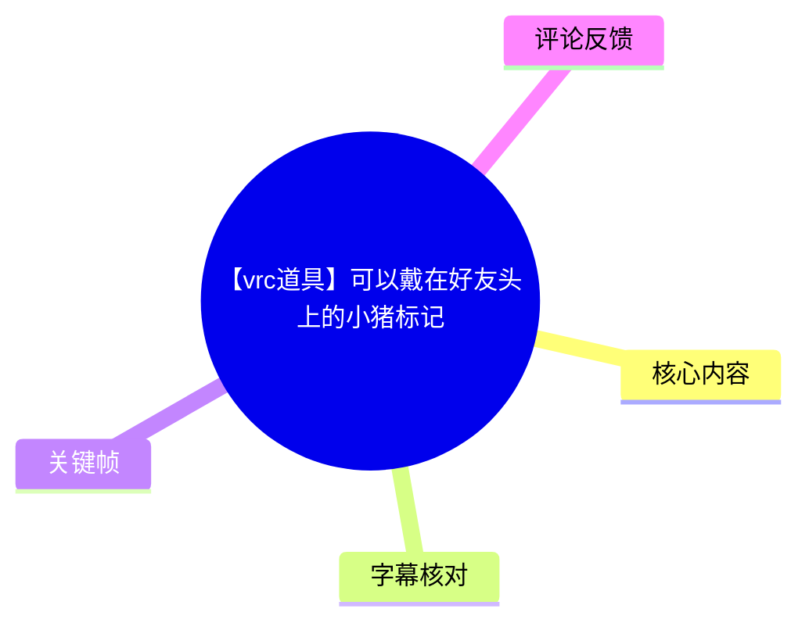
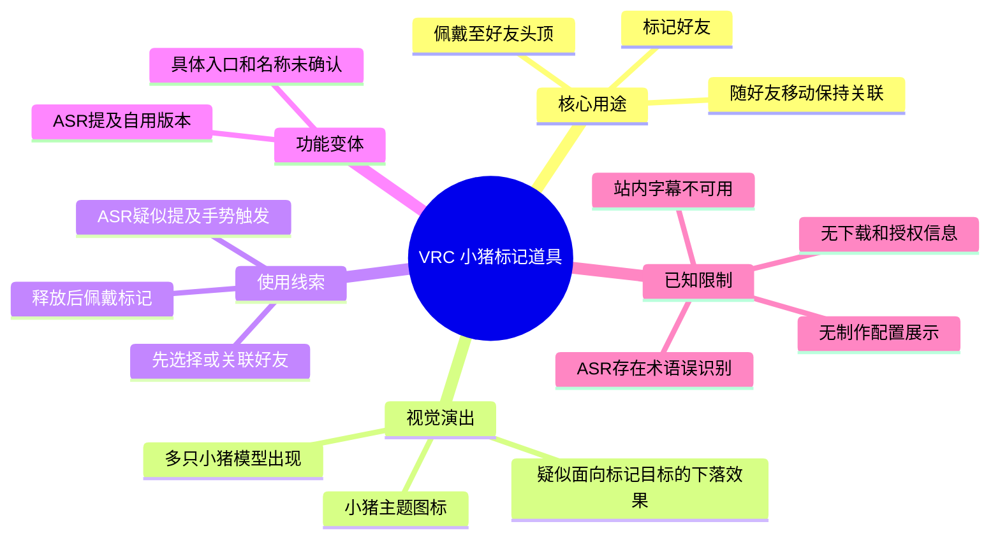
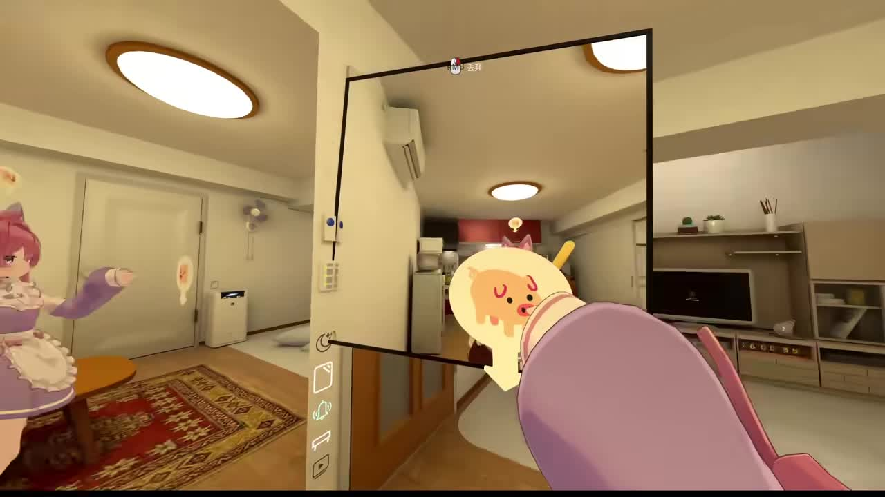
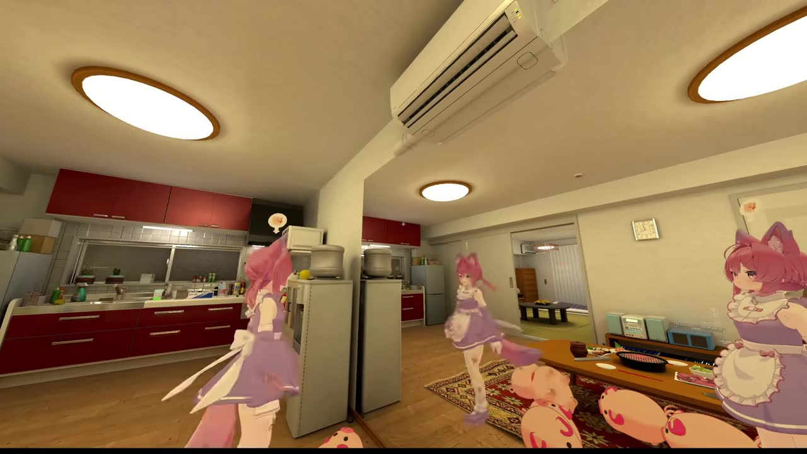

## 小结

本视频为 81 秒的 VRChat（VRC）道具展示，主题是一个可用于好友的“小猪标记”。标题明确其核心卖点为“可以戴在好友头上”，ASR 也提到标记会跟随好友移动，并在释放后佩戴到好友头顶。画面展示地点为室内 VRChat 世界，出现多名二次元风格 Avatar、小猪图案标记与多只小猪模型。

可较可靠确认的功能包括：将小猪主题标记关联到好友、使其保持在好友头顶附近，以及展示与该标记相关的小猪出现效果。视频中可见小猪模型出现在人物与地面附近；ASR 还提到类似“天降”“砸向带标记的人”的描述，但其中多个词存在明显误识别，因此只能谨慎表述为：作者演示了面向被标记对象的小猪下落或聚集式视觉演出，不能据此确认碰撞、伤害、追踪算法或物理判定。

视频并非制作教程，没有展示 Unity 工程、VRC SDK、Avatar Descriptor、Animator、Expression Menu、参数命名、网络同步逻辑、Quest 兼容性或下载方式。它的主要参考价值在于交互设计思路：**先锁定或关联目标，再在目标头顶给出明确标识，并围绕目标触发统一主题的趣味特效**。

字幕方面，站内字幕未提供可用文本，且抓取过程报错；本次 ASR 已执行，但专有名词、触发方式和部分操作词识别质量有限。本文以视频标题、关键帧和可辨 ASR 语义交叉确认事实，对无法验证的词语不作补写。

元数据抓取时间为 2026-07-13；当时视频数据为播放 15,858、点赞 1,081、收藏 731、分享 736、评论 76。这些数值仅对应抓取时点。视频发布日按元数据时间戳折算为 2026-06-25，后续 VRC 平台规则、SDK、道具可用性及作者发布状态均可能变化。

## 思维导图

## 目录

- [视频背景与可确认范围](#视频背景与可确认范围)
- [好友头顶标记与跟随效果](#好友头顶标记与跟随效果)
- [小猪视觉演出与目标关联](#小猪视觉演出与目标关联)
- [使用步骤、参数与制作启发](#使用步骤参数与制作启发)
- [自用版本与未确认术语](#自用版本与未确认术语)
- [结论、限制与时效性](#结论限制与时效性)
- [字幕比对](#字幕比对)
- [评论分析](#评论分析)
- [处理记录](#处理记录)

## 视频背景与可确认范围 [00:00](https://www.bilibili.com/video/BV1ps7h6TE48?t=0)

视频标题为“【vrc道具】可以戴在好友头上的小猪标记”，UP 主为“香菇拿铁乌冬面”，所属收藏夹为 `AIcode`。标签包括“虚拟偶像”“小猪”“VR”“vrchat改模”“VRC”。

从标题、画面和 ASR 可交叉确认，该视频展示的是一件以小猪为主题的 VRC 互动道具，而不是单纯的静态 Avatar 装饰。作者开头的 ASR 文本可辨认为“去做了一个可以跟随好友的……标记”；虽然其中“……标记”的识别出现失真，但标题已明确其为“小猪标记”。

视频展示的核心交互目标可概括为：

1. 选定或关联一名好友；
2. 将小猪标记放置到该好友头顶附近；
3. 使标记在好友移动后仍维持关联；
4. 围绕被标记对象触发小猪主题的视觉效果。

需要区分的是：以上是**使用层面的功能描述**，并不等同于具体技术实现。现有素材没有展示该道具是否采用骨骼挂点、Constraint、Contact、PhysBone、Animator 参数、Udon、同步组件或其他 VRC 功能，因此不能将“跟随好友”进一步解释为特定实现方案。

## 好友头顶标记与跟随效果 [00:08](https://www.bilibili.com/video/BV1ps7h6TE48?t=8)

标题直接说明小猪标记可“戴在好友头上”。ASR 中还可辨认出“好友移动也会……绑定在头顶”“释放之后，就可以戴在好友头上了”等表达。尽管“一级绑定”等文本不可靠，但“移动”“绑定”“头顶”“戴在好友头上”与标题的功能描述一致。

> 图：该帧显示室内场景中的第一人称视角、手部附近的小猪图案道具，以及正前方的镜面/显示区域。它的价值在于呈现道具的主题视觉与近距离操作情境；但单帧不能独立证明目标选择方式、绑定组件或网络同步逻辑。

对于多人社交场景，这种头顶标记具有较明确的可读性价值：

- 在多名 Avatar 同场时，为某位好友提供醒目的识别标识；
- 让旁观者能够看出特效或互动所针对的对象；
- 通过带有玩笑意味的小猪主题，增强好友间互动的娱乐性；
- 作为后续演出效果的视觉锚点，降低“特效究竟作用于谁”的理解成本。

视频没有展示以下边界条件，使用者不应自行假定：

| 未展示问题 | 现有素材结论 |
| --- | --- |
| 能否同时标记多名好友 | 未知 |
| 能否取消或更换目标 | 未知 |
| 好友离开房间或更换 Avatar 后的状态 | 未知 |
| 标记是否对房间内所有人可见 | 未知 |
| 是否需要目标本人同意或触碰 | 未知 |
| 标记位置是否固定为头顶骨骼 | 仅能确认画面与标题强调头顶区域，具体挂点未知 |

## 小猪视觉演出与目标关联 [00:27](https://www.bilibili.com/video/BV1ps7h6TE48?t=27)

ASR 中有一段疑似描述特效的文本：“而且可以让……掉小猪，追着……标记的人砸”“可以开启……砸带标志”。其中“天香”“小珠”“背带”“柱”等词无法与标题或画面可靠对应，属于不能按字面采信的转写结果。

不过，关键帧能够确认场景中出现了多只小猪模型。因此，更稳妥的结论是：作者展示了除头顶图标之外的、由多只小猪构成的视觉演出；结合 ASR 中反复出现的“标记的人”与“砸”等语义，这些小猪效果**很可能**被设计为围绕带标记的目标出现或下落。

> 图：该帧可见多名 Avatar，以及位于人物周边和画面下方的多只小猪模型。它证明视频包含小猪实体/模型的群体视觉效果，而不仅有头顶图标；但无法仅凭此图确认小猪的生成数量、下落轨迹、命中规则或性能消耗。

为避免将 ASR 错误扩展为事实，可将相关信息分层处理：

| 证据等级 | 内容 | 依据 |
| --- | --- | --- |
| 可直接确认 | 道具主题为小猪；视频中出现多只小猪模型 | 标题、关键帧 |
| 较高可信 | 小猪标记可用于好友头顶，并随目标移动保持关联 | 标题、ASR 可辨语义 |
| 谨慎推定 | 小猪模型演出与被标记好友有关 | ASR 中“带标记的人”相关表述 |
| 无法确认 | 小猪是否自动追踪目标、造成碰撞、伤害、击退或音效 | 视频未展示可验证结果 |
| 无法确认 | 特效数量、持续时间、冷却时间、同步范围 | 未提供参数或配置画面 |

因此，视频中的“砸”应理解为可能的视觉表现或作者的趣味性描述，而不是已被证实的游戏机制。

## 使用步骤、参数与制作启发 [00:46](https://www.bilibili.com/video/BV1ps7h6TE48?t=46)

视频没有提供能够逐项复现的教程步骤。以下流程仅依据标题、关键帧与 ASR 的叙述顺序整理，属于**演示中可归纳的使用流程**；实际道具应以作者后续说明或道具菜单为准。

### 演示可归纳的操作顺序

1. **进入包含好友的 VRC 场景**  
   视频画面为多人室内场景，至少可见多名 Avatar。该道具的好友标记功能需要存在可被关联的对象。

2. **选择、接近或关联好友目标**  
   作者称标记可以跟随好友，但未展示目标是通过菜单、射线、触碰、手持道具还是预设名单选择。只能确认在施放前需要建立目标关系。

3. **将小猪标记释放至目标头顶附近**  
   ASR 包含“释放之后，就可以戴在好友头上了”。“释放”可能意味着手势松开、按钮触发或道具放置动作，但没有足够证据确定具体操作。

4. **确认标记随目标移动**  
   作者明确提及好友移动后，标记仍绑定在头顶。此处可作为道具交互完成的视觉判断标准。

5. **触发小猪主题演出效果**  
   后续画面出现多只小猪模型。ASR 指向它们会对带有标记的人产生“砸”或下落式演出，但范围、触发条件和持续时间未展示。

6. **按需使用自用版本**  
   视频后段 ASR 提到“还有一个可以给自己用的版本”。可确认作者声称存在面向自身的变体，但无法确认它是独立道具、独立 Prefab，还是同一菜单中的切换选项。

### ASR 提及但不能当作操作指令的内容

ASR 中出现“腰握拳才可以释放”“右边是 SYSTE 加 S2”“TOTO1 V.I.S”等文本。这些片段没有站内字幕、清晰画面或上下文进行校正，可能是手势描述、菜单名称、英文缩写，也可能是纯粹误识别。

因此，以下信息均不能作为确定参数记录：

- 触发手势是否为“握拳”；
- 是否存在名为 `SYSTE`、`S2`、`TOTO1 V.I.S` 的菜单、系统或版本；
- 是否需要在身体某个位置执行特定操作；
- 特效是否必须在右侧菜单中启用。

### 已知与未知参数

| 项目 | 可获得信息 | 状态 |
| --- | --- | --- |
| 视频时长 | 81 秒 | 已知 |
| 视频分辨率 | 1920 × 1080 | 已知 |
| 道具主题 | 小猪 | 已知 |
| 标记对象 | 好友 | 已知 |
| 主要位置 | 好友头顶附近 | 已知 |
| 标记跟随 | 作者称好友移动后仍会关联 | 已知 |
| 特效内容 | 多只小猪模型出现 | 已知 |
| 特效目标关系 | 疑似与被标记者关联 | 谨慎推定 |
| 标记数量上限 | 未展示 | 未知 |
| 同时生成小猪数量 | 仅能看到多只，无法精确计数 | 未知 |
| 冷却、持续时间与触发范围 | 未展示 | 未知 |
| Unity、VRC SDK 版本 | 未展示 | 未知 |
| PC 与 Quest 兼容性 | 未展示 | 未知 |
| 下载渠道、价格与授权 | 未提供 | 未知 |

### 对 VRC 道具设计的可迁移启发

即使缺少工程细节，视频仍展示出几个可复用的交互设计原则：

- **视觉主题保持一致**：头顶标记与后续出现的小猪模型采用同一主题，使用者与旁观者易于理解效果归属。
- **先建立目标，再施放效果**：在多人场景中，先给目标头顶添加可见标志，再制造围绕该目标的演出，能提升交互可读性。
- **区分好友使用与自用场景**：作者提到存在自用版本。若制作类似道具，可将对他人施放与自身展示做成明确分支，降低误操作。
- **需要额外测试视觉密度与性能**：关键帧中同时出现多只小猪。素材并未提供性能数据，因此制作或使用时仍需自行测试模型数量、动画、粒子、同步行为以及不同设备上的实际帧率。

## 自用版本与未确认术语 [01:03](https://www.bilibili.com/video/BV1ps7h6TE48?t=63)

ASR 后段中可辨认出“还有一个可以给自己用的版本”。这说明作者至少在口头上提及了一个面向自身使用的版本。

目前只能记录以下事实：

- 作者称存在“给自己用”的版本；
- 它可能与对好友施放标记的功能形成对应；
- 视频没有明确展示该版本的菜单、使用画面、名称、差异或下载入口。

不能确认的内容包括：

- 自用版本是否会把小猪标记放在自己头顶；
- 是否会让小猪特效围绕自己出现；
- 是否与好友版共享同一套参数；
- 是否需要单独导入或安装；
- 是否适用于所有 Avatar 或仅适用于作者自身 Avatar。

第三张关键帧为纯黑画面，没有可用于解释道具功能的有效视觉内容，因此不作为正文插图使用。

## 结论、限制与时效性 [01:14](https://www.bilibili.com/video/BV1ps7h6TE48?t=74)

这段短视频展示了一件用于 VRChat 社交互动的小猪主题道具。其最明确的功能是：把小猪标记佩戴到好友头顶，并让标记随好友移动保持关联；此外，视频还展示了多只小猪模型构成的视觉演出。

对于使用者而言，该视频适合用来理解一种社交道具的交互结构，而不能直接作为安装或制作指南。最值得迁移的思路是：

> **目标选择/关联 → 头顶视觉标记 → 以同主题特效强化目标指向。**

使用、复刻或评估此类道具时，应注意以下限制：

- 未提供道具下载、购买、授权、二次分发或商用说明；
- 未展示 Unity、VRC SDK、Avatar Dynamics、Animator、Expression Parameters、Expression Menu 或同步配置；
- 未确认目标选择方式、目标上限、取消方式和他人可见范围；
- 未确认小猪特效的实际追踪、碰撞、伤害、音效、持续时间和冷却；
- 未确认 PC/Quest 支持情况及性能表现；
- ASR 对部分操作词与英文/缩写的转写不可靠，不能据此执行操作；
- 视频发布于 2026-06-25，抓取于 2026-07-13；VRC 客户端、SDK、平台限制与作者发布状态均可能在之后改变。

## 字幕比对 [00:00](https://www.bilibili.com/video/BV1ps7h6TE48?t=0)

| 字幕来源 | 完整性 | 专有名词 | 时间轴 | 主要问题 |
| --- | --- | --- | --- | --- |
| Bilibili 站内字幕 | 无可用文本 | 无法评估 | 无 | 站内字幕抓取失败，工具报错为 `Missing JSON resource URL`；任务素材未提供可用站内字幕。 |
| 本次 ASR 字幕 | 覆盖开头、功能描述、疑似操作说明和结尾 | 较弱，存在多处失真 | 未提供逐句时间戳，仅能按语义顺序定位 | “小触标记”“天香掉小珠”“腰握拳”“SYSTE 加 S2”“TOTO1 V.I.S”等文本无法可靠校正。 |

本次任务**已执行 ASR**。由于无可用站内字幕，最终采用“ASR + 视频标题 + 关键帧”的交叉校正策略。

主要处理如下：

- ASR 的“小触标记”不按字面采用。标题明确写为“小猪标记”，关键帧也出现小猪图案和小猪模型，故正文统一使用“**小猪标记**”。
- “天香掉小珠”等内容无法与画面对应，未采纳为功能名称；正文仅保留为“**小猪下落、出现或聚集式视觉演出**”。
- 对“砸”的描述，只保留其可能是作者对视觉效果的表达，不推断存在碰撞判定、伤害或击退。
- “腰握拳”“SYSTE 加 S2”“TOTO1 V.I.S”等术语无法由现有素材验证，均不写入正式操作步骤。
- 正文中的章节时间轴链接用于跳转至相关演示段落，不是逐字字幕时间码；因为 ASR 素材未提供逐句时间戳。

## 评论分析 [00:00](https://www.bilibili.com/video/BV1ps7h6TE48?t=0)

以下仅分析本次可获取的热评前三条。评论属于观众表达，不能替代视频证据或作为道具功能事实。

1. **野生栗子饼2333｜81 赞｜“猪猪。。。”**  
   该评论以“小猪”直接回应视频主题，反映其对小猪视觉元素的注意或喜爱。没有提供下载来源、使用反馈、性能信息或制作细节。

2. **柒夏笛笙｜3 赞｜“@苧橗茶 @雪凝月眠 @--mirrors-- @叶微光 @凉风樱舞”**  
   评论仅包含对多位用户的提及，可能是在邀请好友观看或转发该道具展示。没有可验证的技术补充，也未提出争议或使用问题。

3. **羊聰｜2 赞｜“@呱呱wink”**  
   评论同样为用户提及，不含具体观点、道具评价或使用信息。最多可体现视频具有好友间分享的社交传播属性，不能据此判断道具品质、兼容性或可获得性。

可获取的前三条热评均没有新增技术信息、下载渠道、争议点或实测反馈，因此评论区未对正文中的功能判断提供额外证据。

## 处理记录 [00:00](https://www.bilibili.com/video/BV1ps7h6TE48?t=0)

- Worker ID：`worker-mrj0wbly-5dc4e50c`
- 模型：`gpt-5.6-terra`
- 调用工具与素材：视频元数据读取、视频/音频提取、站内字幕获取、ASR 转写、关键帧提取、热评获取。
- 可用输出：`merged.mp4`、`audio/audio.wav`、`frames/`、`info.json`、`comments/comments.json`、`asr/`。
- 站内字幕结果：未提供可用站内字幕；抓取过程报错：`Missing JSON resource URL`。
- 字幕选择：本次 ASR 已执行；因站内字幕不可用，采用 ASR、视频标题与关键帧画面交叉校正。无法确认的专有名词、菜单项与手势不作为确定事实写入。
- 关键帧选择依据：
  - `frames/frame-001.jpg`：含小猪图案道具、手部与室内镜面画面，适合说明小猪主题和近距离操作展示情境。
  - `frames/frame-002.jpg`：可见多名 Avatar 与多只小猪模型，适合说明除头顶标记外还存在小猪群体视觉演出。
  - `frames/frame-003.jpg`：黑屏，无可解释道具功能的信息，未用于正文。
- 缓存清理：素材未提供缓存清理命令、日志或执行结果；无法确认缓存是否已清理。
- 未解决问题：目标选择方式、触发手势、菜单名称、ASR 中的英文/缩写、同步机制、特效参数、性能影响、PC/Quest 兼容性、道具获取渠道及授权方式均无法从现有素材确认。

## 评论分析

本次流程未获取到可用热评，因此不推断观众态度或额外结论。
