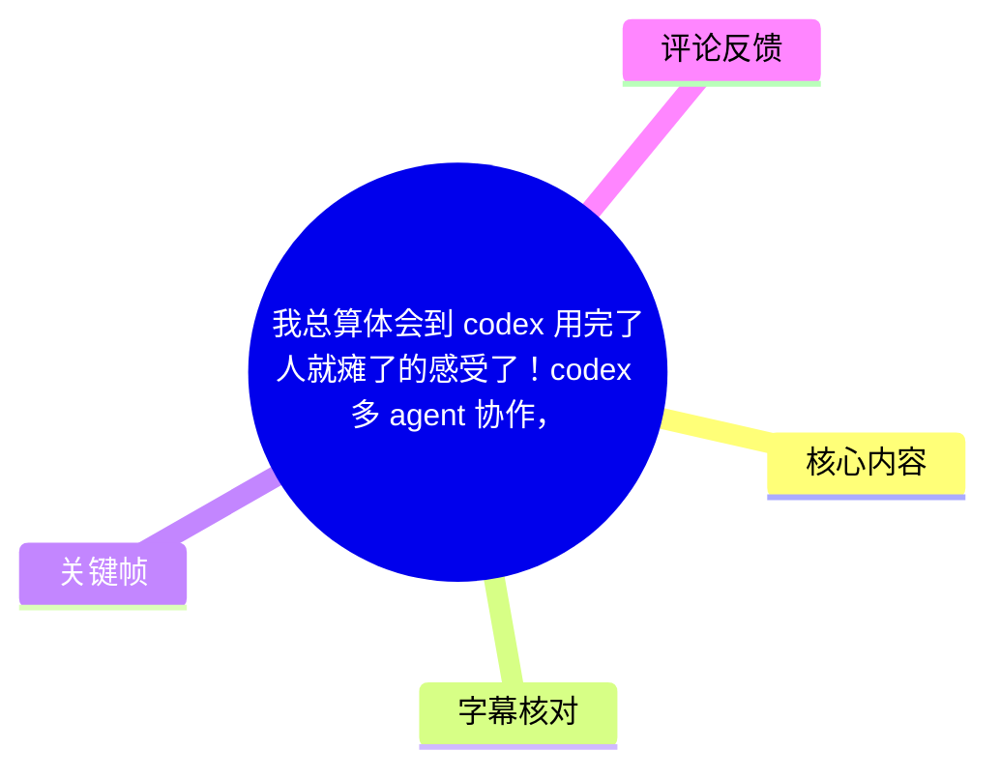
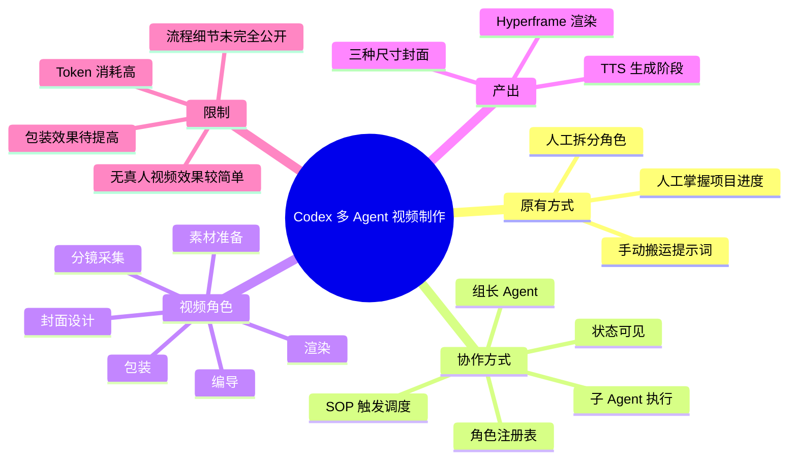
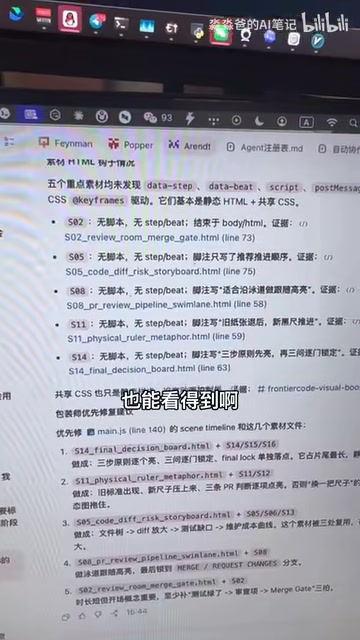

# 我总算体会到 codex 用完了人就瘫了的感受了！codex 多 agent 协作，太爽了，为哈 ai 越来越强大了，人却越来越忙了呢？

> 来源：[Bilibili 视频](https://www.bilibili.com/video/BV1a3Js66Ee2)  
> UP 主：淼淼爸的AI笔记｜时长：2 分 55 秒｜分区/合集：AIcode  
> 数据抓取时播放 9,834、收藏 524、点赞 267、评论 39；这些互动数据仅代表抓取时状态，后续会变化。

## 小结

视频展示了作者把 AI 视频制作拆成多个角色后，从“人工搬运提示词、逐环节调度”过渡到“由组长 Agent 按 SOP 自动调度子 Agent”的实践。其核心不是单一模型生成视频，而是把编导、素材准备、分镜、包装、渲染、封面等工作拆分为可注册、可触发、可查看状态的协作单元。

早期工作流中，作者本人需要把上游输出手动转交给下游角色。这样做的优点是人始终知道项目进行到哪一步；缺点是人为搬运和调度持续占用注意力。多 Agent 协作后，用户向“组长”描述流程并注册角色，组长根据 SOP 的当前阶段把任务分发给相应子 Agent。

视频中可见一个 Agent 注册表/说明文档，以及包含多个角色的项目目录。作者称当前流程已从编导推进至 TTS 生成，并且可查看各 Agent 是“已结束”还是“正在工作”；素材准备相关任务也可并行进行。

作者的结论是自动化后“轻松了很多”，但并非零成本：Token 消耗较高；包装效果仍有待提升；展示的 Studio 中是较简单、无真人出镜的视频效果，还需要继续加入内容或效果。因此，这是一段个人工作流演示，不构成对成片质量、成本、稳定性或通用可复制性的保证。

适合已经有明确视频生产 SOP、希望降低跨 Agent 手工转交成本的创作者参考。若尚未定义角色边界、输入输出格式、触发条件和验收标准，直接堆叠 Agent 未必会减少管理负担，反而可能把工作转移到流程维护、提示词与技能迭代上。

## 思维导图





## 目录

- [背景：从“手动搬运”到自动协作](#背景从手动搬运到自动协作)
- [角色拆分与人工调度阶段](#角色拆分与人工调度阶段)
- [多 Agent 协作：注册、调度与状态](#多-agent-协作注册调度与状态)
- [按 SOP 制作视频的流程与产出](#按-sop-制作视频的流程与产出)
- [实现要点、参数与适用限制](#实现要点参数与适用限制)
- [关键帧索引](#关键帧索引)
- [字幕比对](#字幕比对)
- [评论分析](#评论分析)
- [时效性说明](#时效性说明)
- [处理记录](#处理记录)

## 背景：从“手动搬运”到自动协作 [00:00](https://www.bilibili.com/video/BV1a3Js66Ee2?t=0)

作者以自己的 AI 视频生产流程为例，讨论一个看似矛盾的体验：AI 工具更强之后，使用者为什么仍然很忙，甚至“用完人就瘫了”。

视频给出的直接原因是：在多角色工作流尚未自动调度时，创作者虽然把内容生产拆给不同角色处理，但仍要承担跨角色的信息搬运、任务下发与流程追踪。这种工作不是最终成片本身，却是完成成片不可缺少的“协作管理层”。

作者说明，自己的视频有两类形态：

1. 有真人口播的视频；
2. 没有真人口播、以纯素材构成的视频。

无论哪一种，作者都将生产过程拆为多个职能角色，例如编导、包装师、封面设计、分镜采集和素材准备等。视频并未给出所有角色的完整标准化定义、输入输出字段或工具调用细节，因此不能据此推断其完整实现。

## 角色拆分与人工调度阶段 [00:12](https://www.bilibili.com/video/BV1a3Js66Ee2?t=12)

作者回顾最初的做法：先由自己人工搬运信息。以选题为例，组长提出或接收“要做什么选题”后，编导确定选题并输出文案；之后，作者审核，再把下一步所需的提示词人工转交给下一位角色，例如负责拆分镜的 Agent。

这套方式的关键链路可整理为：

1. 明确选题；
2. 编导确定选题并输出文案；
3. 人工审核当前输出；
4. 人工向下游角色搬运提示词；
5. 下游角色继续处理，例如拆分镜；
6. 重复上述交接，直至视频生产完成。

这里的“人工参与”既是成本，也是控制点。作者明确认可它的一个优势：自己能清楚知道整个项目、以及某条视频，已经走到哪个环节。也就是说，人工调度天然提供了可见性；自动化若想替代它，就必须补上任务状态与流程追踪能力。


> 图：画面展示名为“视频组组长”的项目/目录结构，包含“编导”“视频包装师”“信息获取”“封面设计”“分镜拆解师”“配音师”“转场师”“素材准备”等条目。它直观说明作者并非让一个 Agent 包办全部工作，而是按制作职能拆分角色；这也是后续自动协作的前提。


> 图：画面仍是角色目录，字幕显示“是我手动去搬运给他”。该关键帧直接对应作者所说的旧流程痛点：即使各角色已存在，角色之间的信息交接仍由人完成。

## 多 Agent 协作：注册、调度与状态 [00:49](https://www.bilibili.com/video/BV1a3Js66Ee2?t=49)

作者介绍当前使用的多 Agent 协作方式：用户只需向“组长”说明流程，组长会将各角色注册到表中，并在流程推进时进行调度和任务分配。作者强调，整个过程不再需要自己逐个进行人工参与，而由组长负责派发任务。

根据视频口述与画面，可归纳出该协作结构：

| 组成 | 视频中的职责描述 | 可确认信息 |
| --- | --- | --- |
| 用户/创作者 | 说明要执行的流程、在必要时查看结果 | 作者称只需向组长说明流程 |
| 组长 Agent | 注册角色、按流程调度、分配任务 | 是整个协作的中心 |
| 子 Agent | 承接特定工种任务 | 例如编导、素材准备、分镜、包装、封面等 |
| SOP | 规定流程走到什么位置、触发何种工作 | 是任务触发依据 |
| 状态视图 | 显示 Agent 是否结束或正在工作 | 作者称可查看工作状态 |

作者口述中提到“这里的话它分配了五个……”但 ASR 对其后的词语识别不可靠，无法确认准确数量与名称；因此不能将“5 个 Agent”视为已被可靠证实的固定参数。画面中能看到的表格实际上列出了多个 Agent 条目，说明实际角色数至少不应仅依据这段模糊转写判断。


> 图：画面显示一份名为“Agent注册表”的文档，表头可辨识到“Agent 名称”“对应岗位”“触发时机”等字段，列表中可见 `source_research_agent`、`arch_agent`、`script_writer_agent`、`storyboard_mapping_agent`、`narration_agent`、`packaging_agent`、`renderer_agent`、`cover_agent` 等命名片段。该图的价值在于呈现了“角色注册 + 触发条件”的具体组织形式，而非仅停留在口头描述。

### SOP 驱动的触发逻辑 [01:18](https://www.bilibili.com/video/BV1a3Js66Ee2?t=78)

作者将触发规则概括为：SOP 走到哪个位置，就触发组长给相应 Agent 分配工作。换言之，流程位置是调度条件，而不是创作者每次手工指定下一个执行者。

基于视频内容，可将这一逻辑抽象为以下顺序：

```text
SOP 进入某一阶段
  → 组长识别该阶段对应的角色
  → 组长向对应子 Agent 分配任务
  → 子 Agent 执行并更新工作状态
  → SOP 进入下一阶段
  → 继续触发下一位/下一组 Agent
```

其中，“并行”在视频里至少体现为：当流程已到 TTS 生成时，素材准备师也正在准备素材。视频没有说明并行任务之间如何处理依赖、失败重试、冲突、上下文共享、超时和人工兜底，因此这些工程机制仍属未披露部分。

## 按 SOP 制作视频的流程与产出 [01:39](https://www.bilibili.com/video/BV1a3Js66Ee2?t=99)

作者称，当前展示的是“上期的一个草稿”。这意味着画面中的结果应理解为流程中间产物或草稿案例，而不是最终已验收成片。

视频可确认的后段流程与产出包括：

1. **编导到 TTS 的推进**：作者称工作流已经从编导推进到 TTS 生成阶段。
2. **素材准备**：素材准备相关 Agent 同时在准备素材。
3. **包装**：作者认为当前包装效果“还有待提高”。
4. **渲染**：作者称整个视频由“Hyperframe”进行选择/渲染；“选择”一词来自 ASR，语义不完全清晰，因此仅保留原转写所表达的“由 Hyperframe 参与渲染”。
5. **Studio 预览**：作者展示一个 Studio，并称其大致是没有真人出镜、效果较简单的视频，仍需继续添加内容。
6. **封面设计**：最后由封面设计师为其设计三种不同尺寸的封面。



> 图：画面展示文档/编辑器中的视频制作内容，字幕为“也能看得到啊”。它有助于理解作者所强调的可观测性：自动调度并不意味着完全不可见，创作者仍希望在界面中看到任务、场景或流程状态。由于画面文字存在拍摄摩尔纹和清晰度限制，不宜据此逐行还原配置内容。

### 可复用的实施步骤 [01:03](https://www.bilibili.com/video/BV1a3Js66Ee2?t=63)

以下步骤是对作者已展示方法的结构化整理，不等同于视频提供的可直接运行教程：

1. **先画出视频生产 SOP**  
   明确选题、文案、分镜、素材、配音/TTS、包装、渲染、封面等环节的先后关系与依赖关系。

2. **按岗位划分 Agent 边界**  
   将每个可独立承担的工种定义为一个角色。视频中的角色示例包括编导、素材准备、分镜、配音/旁白、包装、渲染和封面设计。

3. **建立角色注册表**  
   对每个 Agent 至少记录其名称、对应岗位和触发时机。关键帧中的注册表表明，角色命名可采用类似 `*_agent` 的形式，但视频未给出强制命名规范。

4. **为组长提供完整流程说明**  
   作者称用户只需向组长说明流程。实际落地时，流程描述需要足够明确，否则组长无法稳定判断何时调用哪个角色；这是由视频流程逻辑可直接推得的实施前提。

5. **让组长按 SOP 调度，而非人工转发**  
   当 SOP 到达特定阶段，由组长将任务分配给相应子 Agent，代替人工复制、粘贴和转交提示词。

6. **保留状态监控与审核节点**  
   作者特别看重“知道走到哪一环节”的能力。即使采用自动调度，也应保留“进行中/已结束”等可见状态，并根据实际质量设置人工审核点。视频未说明审核节点是否已经完全自动化。

7. **检查草稿成片与后续资产**  
   在 Studio 中查看草稿效果；完成后由封面设计角色输出三种不同尺寸的封面。视频未列出三种尺寸的具体像素值。

## 实现要点、参数与适用限制 [02:18](https://www.bilibili.com/video/BV1a3Js66Ee2?t=138)

### 视频中明确提到的要点

| 项目 | 视频信息 | 结论 |
| --- | --- | --- |
| 协作模式 | Codex 多 Agent 协作 | 由组长调度多个子角色 |
| 触发参数 | SOP 所处位置 | 流程走到对应节点时触发任务 |
| 状态参数 | 已结束 / 正在工作 | 作者称界面可查看 |
| 当前进度示例 | 已到 TTS 生成 | 是该次展示流程的状态，不是固定顺序的充分证明 |
| 封面产出 | 三种不同尺寸 | 未披露具体尺寸、平台或格式 |
| 渲染 | 作者口述为 Hyperframe 参与渲染 | 未展示版本、接口、价格或配置 |
| 成本 | Token 消耗较高 | 没有披露模型、Token 数、单条成本或预算 |
| 成片质量 | 包装效果待提高 | 作者的主观复盘，未给出量化指标 |

### 不能从视频中得出的内容

视频没有提供以下关键实现信息，实践时不能自行补全为既定事实：

- Codex、Hyperframe 或其他组件的具体版本；
- 组长与子 Agent 使用的模型、上下文窗口、温度、并发数；
- 每个角色的系统提示词、输入输出 JSON/Markdown 格式；
- TTS 所用服务、音色、语言、费用和授权范围；
- 渲染耗时、失败率、重试机制和任务队列实现；
- 三种封面尺寸的具体数值；
- 自动流程的 Token 用量、总成本及与人工流程的效率对比；
- 是否存在人工审核、内容安全审核与版权素材审核；
- 对真人口播视频和纯素材视频分别采用了哪些不同 SOP。

### 经验与风险

作者的实践可迁移之处在于：先将流程拆到“角色—触发时机—交付物”层面，再考虑自动化。仅仅增加更多 Agent，并不等于更少工作；如果角色职责重叠、上下游交付格式不一致，维护成本会转化为更频繁的提示词修改、技能沉淀和运维工作。

此外，作者自己已指出两项现实代价：

- **Token 消耗高**：多角色、多轮交接意味着更高的上下文与调用消耗。视频未提供成本数字，无法判断其经济性。
- **包装质量仍需迭代**：自动生成流程可推进生产，但视觉包装与内容质量不一定随自动化同步提升。

## 关键帧索引 [00:12](https://www.bilibili.com/video/BV1a3Js66Ee2?t=12)

| 关键帧 | 正文用途 | 选择依据 |
| --- | --- | --- |
| `frames/frame-001.jpg` | 角色拆分 | 清楚呈现视频组角色目录，证明工作流包含多个工种。 |
| `frames/frame-002.jpg` | 人工搬运阶段 | 字幕与手指指向界面共同对应“手动去搬运”的叙述。 |
| `frames/frame-003.jpg` | Agent 注册与触发机制 | 呈现 Agent 注册表及“名称、岗位、触发时机”等组织字段。 |
| `frames/frame-004.jpg` | 状态可见性与制作界面 | 对应作者关于“也能看得到”的状态可观测性描述。 |
| `frames/frame-005.jpg` | 未在正文引用 | 未提供该帧画面内容的可辨识信息，避免基于文件名或未见画面编造。 |
| `frames/frame-006.jpg` | 未在正文引用 | 同上；正文仅选用能与 ASR 和可见画面相互印证的关键帧。 |

## 字幕比对 [00:00](https://www.bilibili.com/video/BV1a3Js66Ee2?t=0)

本次任务**已执行 ASR**。素材中未提供可用 Bilibili 站内字幕，故正文以 ASR 为主要语音文字来源，并用关键帧中的可见界面、上下文和作者重复表述进行有限校对。

| 字幕来源 | 完整性 | 专有名词 | 时间轴 | 主要问题 |
| --- | --- | --- | --- | --- |
| Bilibili 站内字幕 | 无可用字幕 | 无法评估 | 无法评估 | 素材明确标注“未提供可用站内字幕”。 |
| 本次 ASR 字幕 | 覆盖全片主要口述，但无逐句时间戳 | 部分可辨识，如 Codex、TTS、Hyperframe；部分角色词识别不稳 | 未提供分段时间码，正文时间点依据视频顺序估计 | 存在同音误识、口语断句、繁简混杂及个别语义不清问题。 |

重点校正与保留原则：

- **“Codex”**：在标题、标签、ASR 和界面侧栏“Codex 移动版”中均有支持，采用 `Codex`。
- **“Agent 注册表”**：关键帧 `frame-003.jpg` 可见该文档标题，采用“Agent 注册表”。
- **“Hyperframe”**：来自 ASR 口述；关键帧未能独立验证其拼写、产品身份和具体功能，因此正文标为作者口述，不扩展解释。
- **“五个哲学”**：显属 ASR 识别不可靠，无法据此确定原词及数量；正文不采用该词，也不将“五个”作为确定参数。
- **“每个兑换的就是一个单独的一个角色”**：语义不通，结合上下文只保留“将工作拆分为独立角色”的可确认含义，不猜测原始措辞。
- **角色名称**：关键帧可见若干英文 `*_agent` 命名，但受拍摄清晰度限制，正文仅以可辨识片段作示例，不把它们当作完整、可复制的配置清单。

## 评论分析 [02:50](https://www.bilibili.com/video/BV1a3Js66Ee2?t=170)

仅处理本次可获取热评前三条。素材实际返回 2 条热评，因此以下分析限于这 2 条；第 3 条无法获取，不作推测。

1. **废材的奥卡姆剃刀｜18 赞**  
   评论者称自己以“非专业外行”身份学习使用 AI 后，从最初惊喜逐步转为不断调整 skill、进行维护，并感觉身份从用户转向“运维”。这与视频“AI 越强、人却更忙”的主题形成补充：自动化可能减少执行动作，却增加配置、维护和质量校准工作。  
   该评论属于个人经验，不足以证明所有 AI 工作流都会产生同样的运维负担，但与视频中“手动调度转为流程维护”的问题高度相关。

2. **饭碗里的西红柿｜12 赞**  
   评论建议沉淀 skill、形成自己的技能；认为前期建设完成后可较大程度“解放双手”，后续主要费脑力的部分是迭代技能。这个观点补充了视频未展开的长期策略：不只构建一次性 Agent 流程，还要沉淀可复用能力。  
   需要注意，“基本上就解放双手”是评论者判断，视频本身没有给出节省时间、成功率或维护成本的量化数据，不能视为已验证结论。

3. **第 3 条热评**  
   本次热评素材仅返回 2 条，未获取到第 3 条内容，故不进行分析。

## 时效性说明 [02:45](https://www.bilibili.com/video/BV1a3Js66Ee2?t=165)

- 视频元数据的发布时间为 Unix 时间戳 `1781371873`；按 UTC 换算为 2026-06-13 17:31:13。素材抓取时间为 2026-07-13，二者存在约一个月差异。
- 视频涉及的 Codex、多 Agent 工作流、TTS、渲染及 Studio 界面均可能随产品更新而变化。本文仅记录该视频展示时的个人实践，不将其视作当前版本官方功能说明。
- 播放、点赞、收藏、评论等互动数据为抓取时快照，热评排序与内容可能已改变。
- 视频未披露模型版本、调用接口、成本和配置文件，任何复现都需要以实际工具文档、账户权限、价格及平台条款为准。

## 评论分析

本次流程未获取到可用热评，因此不推断观众态度或额外结论。

## 处理记录

- Worker ID：`worker-mrj0wbly-5dc4e50c`
- 模型：`gpt-5.6-terra`
- 调用工具与素材：使用任务提供的元数据、视频素材清单、已生成 ASR 字幕、关键帧列表与热评 JSON；未提供具体命令行、软件版本或外部工具调用日志。
- 字幕选择：站内字幕不可用；本次 ASR 已执行并作为主字幕来源。对 `Codex`、`Agent 注册表` 等内容通过标题、界面关键帧和上下文交叉校对；对无法可靠识别的 ASR 片段明确保留不确定性。
- 关键帧选择依据：选用 `frame-001` 至 `frame-004`，原因是其分别支持角色拆分、人工搬运、注册/触发结构及状态可见性四项正文核心事实；`frame-005`、`frame-006` 未在已给出的可视素材中展示，不强行引用。
- 评论处理：请求限制为热评前三条；实际仅获得 2 条，已逐条分析，未编造第 3 条。
- 缓存清理：素材未提供缓存目录、清理命令或清理结果，无法确认是否执行缓存清理。
- 未解决问题：ASR 没有逐句时间戳，章节时间轴按视频叙述顺序估计；“Hyperframe”的具体拼写、产品性质与配置未被可用画面充分验证；Agent 的完整数量、调用关系、Token 消耗数字和封面尺寸均未披露。
