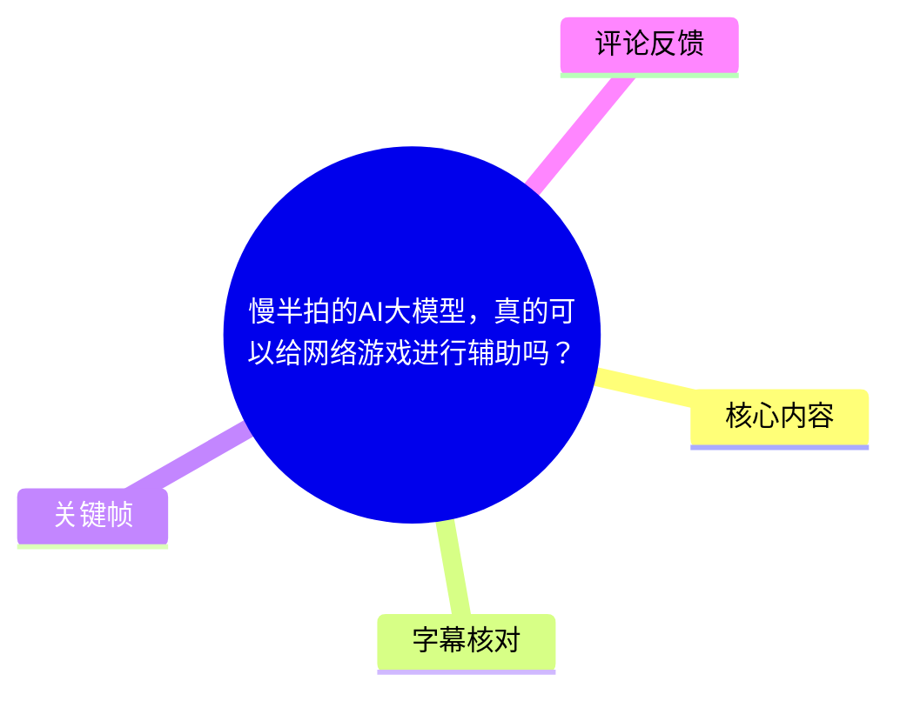
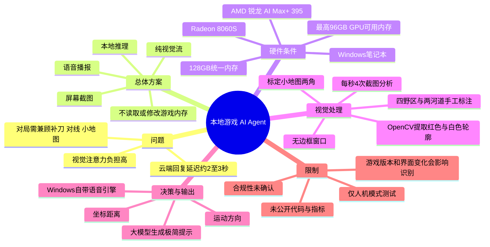
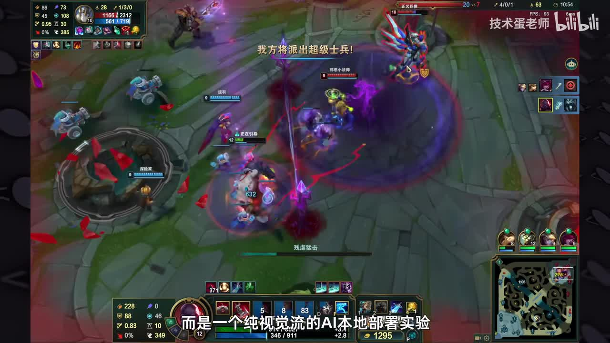
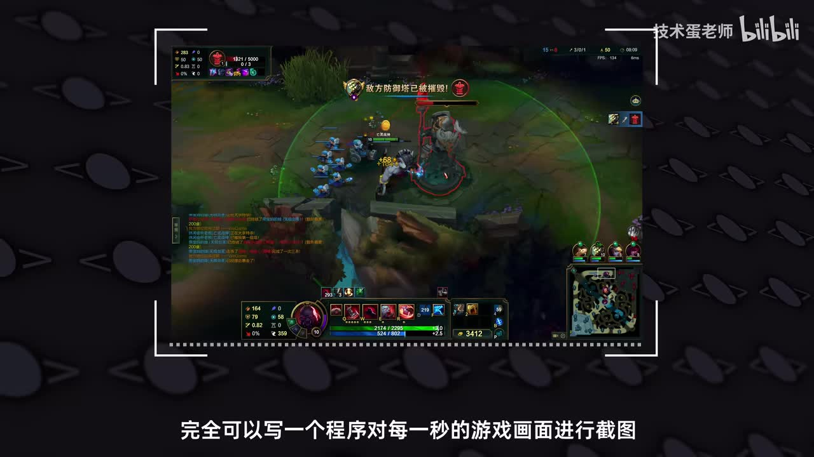
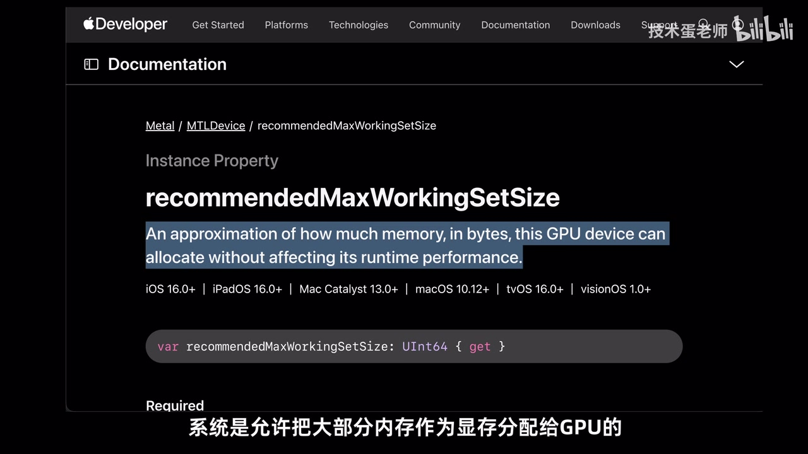

# 慢半拍的AI大模型，真的可以给网络游戏进行辅助吗？

> 来源：[Bilibili 视频](https://www.bilibili.com/video/BV1JNVZ6cEXy)  
> UP 主：技术蛋老师｜时长：10 分 07 秒｜合集：AIcode  
> 本文中的硬件规格、模型选择、延迟和测试结果均为视频作者在其测试环境中的陈述，不等同于通用性能保证。

## 小结

视频展示了一个用于《英雄联盟》的人机模式本地 AI Agent 实验：程序**不读取或修改游戏内存**，而是从屏幕画面中截取小地图，经由 OpenCV 和本地视觉/语言模型处理，再以语音播报潜在 Gank 风险。其目标不是代替玩家操作，而是把持续盯小地图的视觉负担，部分转化为听觉提醒。

作者首先尝试云端大模型，但实测云端回复存在约 **2～3 秒延迟**；对于需要即时反应的对局，这段延迟足以使提醒失去价值。因此方案转为本地运行，并把“游戏 + 本地模型”放在同一台 Windows 笔记本上并行执行。

硬件层面，视频将可行性归因于玄派玄机 16 所搭载的 **AMD 锐龙 AI Max+ 395** 与 **128GB 统一内存池**。作者称其 GPU Radeon 8060S 最多可调用 96GB 内存，并强调 256-bit 位宽、256GB/s 传输速度及 32MB Infinity Cache 有助于游戏与 AI 任务同时运行。这里的核心经验是：对本地多模态 Agent 而言，容量之外，CPU/GPU 间的数据共享和带宽同样会影响实际体验。

算法上，作者从“每秒整屏截图、由千问 VL 分析”优化为“只截取右下角小地图”，再由 OpenCV 提取敌方英雄的红色轮廓、己方视野的白色轮廓；程序还以手工四点标注方式保存四片野区和两处河道区域。主程序据敌我坐标距离与运动方向作出规则判断，最后交由大模型改写为短促、可听懂的战术提示。

视频最重要的取舍是**宁可小模型，也不要大模型的高延迟**：作者最终选用“千问 2.5 3B”（ASR 对型号的转写存在不确定性，详见字幕比对），并放弃拟真 AI 语音，改用 Windows 自带语音引擎，以减少至少 1 秒以上的语音合成延迟。作者没有给出完整代码、准确端到端延迟、误报率或帧率数据，因此该方案应视为方法展示而非可直接复现的成品。

适合希望在 Windows 游戏环境中尝试本地视觉 Agent、低延迟推理和“规则系统 + 大模型语言输出”组合的人阅读。需要特别注意的是，作者明确表示不确定游戏官方将来是否会把这种 Agent 视作作弊，故测试均在人机模式进行；是否合规必须以《英雄联盟》运营方当时规则与反作弊政策为准。

## 思维导图





## 目录

- [问题：为什么需要听觉化的 Gank 提示？](#问题为什么需要听觉化的-gank-提示)
- [云端方案为何不适用于即时对局？](#云端方案为何不适用于即时对局)
- [本地运行的硬件条件与统一内存](#本地运行的硬件条件与统一内存)
- [从整屏理解到小地图视觉管线](#从整屏理解到小地图视觉管线)
- [区域标注、规则判断与语言化提示](#区域标注规则判断与语言化提示)
- [低延迟模型和播报方案](#低延迟模型和播报方案)
- [限制、合规风险与时效性](#限制合规风险与时效性)
- [关键帧索引](#关键帧索引)
- [字幕比对](#字幕比对)
- [评论分析](#评论分析)
- [处理记录](#处理记录)

## [问题：为什么需要听觉化的 Gank 提示？](https://www.bilibili.com/video/BV1JNVZ6cEXy?t=12)

作者在游戏画面中演示：耳机里会持续出现防 Gank 的提示音。其定义是一个“**纯视觉流**”的本地部署实验，而非读取、修改游戏内存的外挂；AI Agent 在同一台笔记本上与《英雄联盟》同时运行。

在作者的描述中，MOBA 对局的视觉负荷主要来自以下并发任务：

1. 盯住炮车兵等小兵血量，避免漏刀；
2. 与对方英雄保持距离，避免被消耗；
3. 持续关注右下角小地图，防止漏掉敌方动向；
4. 同时处理战斗、补兵和走位。

作者提到游戏已有一些辅助功能，但认为这些信息仍主要靠玩家眼睛完成整合。因此，他提出的交互转换是：让程序看画面，把推理结果用语音交给耳朵，从而降低持续扫视小地图的压力。视频没有声称该方法会提高胜率，也没有提供与未使用 Agent 的对照数据。



> 图：该帧直接呈现游戏实战界面、小地图位置及“纯视觉流”的方案定位，有助于界定本项目的输入来自屏幕画面，而非游戏内存数据。

## [云端方案为何不适用于即时对局？](https://www.bilibili.com/video/BV1JNVZ6cEXy?t=60)

作者原先设想的是：定期截取游戏画面，发送至云端大模型推理，再播放结果。但在一次实际对局中，敌方英雄已突然出现并完成击杀，耳机中的提醒才到达。

作者给出的关键量化结论是：**云端大模型产生约 2～3 秒延迟**。对一般问答或非即时任务，这一延迟未必是问题；但对 Gank 预警而言，提醒必须在敌人接近、路径尚可规避的时间窗口内送达。若响应抵达时玩家已死亡或回到泉水，提示即失去战术价值。

因此，视频将问题从“能否识别游戏画面”转为“能否在足够低的端到端延迟下识别并播报”。这里的端到端链路至少包括：

```text
屏幕采集
  → 图像裁剪/视觉预处理
  → 规则判断或模型推理
  → 生成简短提示
  → 语音合成
  → 耳机播放
```

视频只明确报告了云端延迟约 2～3 秒，以及拟真语音至少增加 1 秒以上延迟；其余环节的具体耗时并未公布。



> 图：该帧以截图取样框表达了最初的“游戏画面 → 图像分析 → 提示”思路，是理解后续为什么要缩小输入区域、降低推理成本的关键。

## [本地运行的硬件条件与统一内存](https://www.bilibili.com/video/BV1JNVZ6cEXy?t=100)

作者认为，本地部署的难点不只是“能否启动模型”，还包括模型与游戏并行后是否会因显存、带宽或散热限制而卡顿。

### 视频中的平台对比

| 平台/配置方向 | 作者的描述 | 对本项目的影响 |
| --- | --- | --- |
| Windows + 独立 NVIDIA 消费级显卡 | 单卡显存通常受限于 24GB～32GB；上下文增长会继续占用显存 | 大模型与游戏同开时，可能出现显存不足 |
| Apple M 系列 MacBook | 可利用统一内存，将较多系统内存分给 GPU | 内存架构有利于本地模型，但作者需要 Windows 游戏与 Windows 专用软件 |
| 玄派玄机 16 + AMD 锐龙 AI Max+ 395 | Windows 环境、128GB 统一内存池 | 满足作者“Windows + 类统一内存”的需求 |

作者举例称，运行一个 **35B 参数模型**时，GPU 至少需要约 **25GB 显存空间**；不过模型量化方式、上下文长度、推理框架、KV Cache、并发量等都会改变实际占用，视频没有说明该 35B 模型的精度或量化格式，因此该数字只应理解为作者的经验性说明。

### 作者列举的硬件参数

| 项目 | 视频中的陈述 |
| --- | --- |
| 处理器 | AMD 锐龙 AI Max+ 395 |
| GPU | Radeon 8060S |
| 总内存 | 128GB 综合/统一内存池 |
| GPU 可用内存 | 可手动或动态分配，最高可调用 96GB |
| 内存位宽 | 256-bit |
| 数据传输速度 | 256GB/s |
| 对比对象 | 作者称两万元以内传统电脑常为 128-bit、100～150GB/s |
| 缓存 | Radeon 8060S 配备 32MB Infinity Cache |
| 笔记本其他配置 | 2.5K 电竞超感屏、双涡轮散热、预装两块 1TB NVMe SSD |

作者的逻辑是：传统离散显卡通常由 CPU 使用系统内存、GPU 使用独立显存；统一内存则允许 CPU/GPU 共享同一内存池，减少数据在两套内存间搬运的压力。128GB 总内存及最高 96GB 的 GPU 可调用内存，为本地模型和游戏共存预留空间；256-bit 位宽及 256GB/s 带宽则面向 CPU/GPU 数据传输需求。

但“根本不存在爆显存的概念”是视频作者在其 128GB 测试配置下的表述，不应泛化为所有统一内存设备都不会内存不足：系统本身、游戏、模型权重、上下文缓存、其他软件和内存分配策略仍会共同占用资源。


> 图：该帧以笔记本动画强调普通设备同时运行本地模型与游戏的资源压力，为后文统一内存和带宽讨论提供问题背景。



> 图：该帧展示视频用于解释统一内存概念的 Apple 文档页面。它的价值在于说明作者借 Mac 的内存架构作为参照，而非表示本项目运行在 macOS 上。

## [从整屏理解到小地图视觉管线](https://www.bilibili.com/video/BV1JNVZ6cEXy?t=318)

作者一开始计划每秒对整张游戏画面截一次图，使用千问 VL 模型进行图像分析，再在敌方可能 Gank 时语音提醒。后续发现，整屏中许多元素与 Gank 预警无关，而关键信息集中在右下角小地图，于是将输入收缩至小地图区域。

这个优化反映出一个可迁移经验：**先按任务目标减少输入，再让模型处理剩余的高价值信息**。对于“判断敌方靠近”这一任务，角色技能特效、装备栏、聊天框等信息通常不是主要输入；只处理小地图可降低像素量和识别干扰，但也将系统能力限定为主要依靠地图信息的预警。

### 小地图位置标定步骤

作者展示的程序标定流程如下：

1. 将游戏设为**无边框窗口模式**；
2. 运行自写程序；
3. 在 **5 秒内**切回游戏界面；
4. 将鼠标移动至小地图左上角，程序记录该坐标；
5. 程序确认记录后，将鼠标移至小地图右下角；
6. 程序记录第二个坐标；
7. 两点确定小地图矩形区域，供后续裁剪使用。

可抽象为：

```text
minimap_rect = {
  left:   x1,
  top:    y1,
  right:  x2,
  bottom: y2
}
```

视频没有提供坐标格式、屏幕缩放比例适配、分辨率适配代码，也没有展示窗口尺寸变化后的重标定策略。基于流程可合理判断：小地图位置一旦因分辨率、HUD 缩放、窗口尺寸或游戏 UI 改版而变化，就需要重新校准或调整程序。

### OpenCV 预处理：把密集地图转为少量目标

作者指出，小地图内同时包含地形、双方英雄、小兵和野怪，直接整体识别容易误判。因此采用颜色与轮廓规则缩小待处理信息：

- 敌方英雄在小地图上以**红色小圆**表示：用 OpenCV 提取红色轮廓；
- 玩家视野范围以**白色方框**表示：用 OpenCV 提取白色轮廓；
- 将“密集的小地图像素信息”缩减为与预警判断更有关的目标轮廓和位置。

视频未给出 HSV 阈值、形态学操作、轮廓面积阈值或目标追踪算法；因此不能据此补写为可运行的 OpenCV 参数。实际实现还可能受显示器色彩、色盲模式、游戏皮肤/UI、压缩失真和特效遮挡影响。

## [区域标注、规则判断与语言化提示](https://www.bilibili.com/video/BV1JNVZ6cEXy?t=438)

仅识别敌方英雄位置仍不足以判断 Gank 风险，因为系统还需知道野区和河道等区域。作者尝试过多种方法，最后选择手工标注，理由是“自行标注最方便”。

### 区域标注与 JSON 保存

流程是：在程序识别到小地图后，弹出该地图，用户用四个点圈定一个区域。作者通过这种方式确认：

- 四大片野区；
- 两处河道区域。

这些区域被保存为 JSON，交由主程序读取。视频没有展示 JSON 的具体字段、坐标顺序或区域多边形判定逻辑；可确定的是，区域数据被持久化保存，避免每次运行都重新标注。

### 主程序的职责分层

作者描述的处理链路可以整理为：

```text
小地图截图
  → OpenCV 提取红色敌方轮廓、白色视野轮廓
  → 获得敌我英雄坐标等结构化信息
  → 匹配野区/河道标注区域
  → 比较敌我距离与运动方向
  → 生成规则判断和提示词
  → 本地大模型将结果改写为精简战术语言
  → 语音播报
```

其中，**代码/规则系统负责确定性数据处理**，例如位置、距离、方向与区域关系；**大模型负责把死板结果变成人能快速理解的短句**。这是一种“结构化感知与判断在前、大模型自然语言输出在后”的设计，而不是把整张游戏画面和全部决策都交给语言模型。

作者没有披露“距离过近”“朝向满足何种条件”“敌方消失多久才预警”等具体阈值，也没有报告漏报、误报及不同英雄/地图状态下的准确性。故无法评价该 Agent 的真实预警可靠性。

## [低延迟模型和播报方案](https://www.bilibili.com/video/BV1JNVZ6cEXy?t=486)

作者起初认为既然 GPU 最多可调用 96GB 内存，就应该尽量使用参数更大的千问模型；但测试后的结论是：对于需要毫秒级响应的电竞游戏，**大参数模型带来的延迟难以避免**，因此“大模型能装下”不等于“适合实时交互”。

### 模型与语音的取舍

| 环节 | 初始倾向 | 最终选择 | 取舍理由 |
| --- | --- | --- | --- |
| 语言模型 | 尽可能使用更大参数的千问模型 | 视频称选用“千问 2.5 3B” | 更快获得 Gank 情报提示 |
| 语音输出 | 拟真的 AI 生成语音 | Windows 系统自带语音引擎 | 拟真语音至少产生 1 秒以上延迟 |
| 输出形式 | 详细分析 | 极简战术提示 | 减少生成和理解时间 |

作者将最终模型描述为可进行“毫秒级别输出”，但没有提供模型部署框架、量化等级、token/s、首 token 延迟、提示词长度或完整链路时延。更严谨的理解应是：作者在自己的设备和任务中选择了更小的模型，以追求**相对更低的延迟**；“毫秒级”不能据视频材料换算为已验证的全链路延迟指标。

视频的设计经验可总结为：

1. 让传统视觉与规则程序完成可确定、可快速执行的任务；
2. 缩短输入内容，避免让语言模型理解冗余画面；
3. 令模型只生成短句，而非长篇推理；
4. 将语音合成也视为实时系统的一部分，而不是最后可忽略的附加环节；
5. 以实际游戏响应窗口倒推模型规模，而非按显存上限选最大模型。

## [限制、合规风险与时效性](https://www.bilibili.com/video/BV1JNVZ6cEXy?t=535)

### 作者明确说明的限制

1. **合规性未确定**：作者不确定游戏官方未来是否会将此类游戏 Agent 认定为作弊。
2. **测试范围受限**：所有测试均在人机模式下进行。
3. **仅为一个场景**：作者称自己只发挥了该平台能力的一小部分，并只解锁了一个使用场景。
4. **本地方案并非无成本**：尽管作者设备资源充足，实时系统仍需控制模型参数量和语音延迟。
5. **未公开完整实现细节**：视频未提供源码、模型版本确认信息、依赖版本、提示词、准确率、硬件功耗、温度、帧率或端到端性能测试数据。

### 需要特别避免的误解

- “纯视觉流、不改内存”不自动等于符合所有游戏规则。不同运营方对屏幕读取、自动化提示、第三方叠加层和外部辅助均可能有不同规定。
- AI Agent 只输出语音，不代表系统一定不会误判；地图图标重叠、版本改动、色彩显示差异都可能影响识别。
- 视频呈现的是特定硬件和特定游戏场景的实验，不足以证明任意笔记本、任意本地模型或任意网络游戏都可无卡顿地运行。
- 作者表示本地部署效果已改变其对“工作、游戏、AI 必须分两台电脑”的看法；这属于作者的产品体验判断，不是独立评测结论。

### 时效性

视频发布时间为 **2026-06-01**。以下内容具有明显时效性，应在实践前重新核对：

- 《英雄联盟》客户端界面、小地图图标和反作弊/第三方工具规则；
- AMD 驱动、固件、内存分配策略及锐龙 AI Max+ 395 生态支持；
- 千问系列模型的名称、版本、量化和部署工具；
- Windows 语音引擎可用声音与延迟表现；
- 玄派玄机 16 的在售配置、价格及实际内存规格。

## 关键帧索引

| 关键帧 | 正文位置 | 画面价值 |
| --- | --- | --- |
| `frames/frame-001.jpg` | 问题与方案定位 | 展示《英雄联盟》实战、小地图及“纯视觉流”实验定义，证明视频语境是视觉采集辅助。 |
| `frames/frame-002.jpg` | 云端方案与初始构想 | 以画面截图框说明“截图—模型分析”链路，是理解后续裁剪小地图优化的基础。 |
| `frames/frame-003.jpg` | 本地运行的硬件条件 | 直观表达本地模型和游戏并行造成的设备压力。 |
| `frames/frame-004.jpg` | 统一内存解释 | 展示作者用来说明“系统内存可为 GPU 分配”的参考资料画面，辅助理解统一内存论证。 |

> 其余关键帧文件虽在素材清单中列出，但当前提供的可见关键帧内容不足以可靠识别其对应画面与时间位置；为避免编造，正文仅采用以上可核验画面。

## 字幕比对

| 字幕来源 | 完整性 | 专有名词 | 时间轴 | 主要问题 |
| --- | --- | --- | --- | --- |
| Bilibili 站内字幕 `p01-ai-zh.srt` | 与视频主题严重不匹配，内容主要是歌曲、短剧和段子，且仅覆盖约 7 分 20 秒 | 不适用于本视频主题 | 有真实 SRT 时间段，但与实际视频内容不对应 | 完全缺失本视频 AI、硬件、OpenCV、模型等内容，不能作为正文依据 |
| 本次 ASR 字幕 | 覆盖 12.30～606.94 秒，诊断语音覆盖率 0.97，共 25 段 | 可辨认主要术语，但存在大量同音/错字 | 带逐段时间戳，覆盖完整讲解段落 | 如“显程/暴显”“游细”“英雇”“日龙”等误识别；部分型号名称与单位需按上下文校正 |

### 最终字幕选择与校正原则

本次任务**采用 ASR 时间轴作为正文时间轴依据**，理由是 ASR 内容与视频标题、关键帧和讲解主题一致，且从 00:12.300 持续覆盖至 10:06.940。站内字幕虽然具有 SRT 时间轴，却是与本视频无关的内容，不能用于事实整理或定位章节。

本次 ASR 已被检查。诊断结果中**未标记 `noAudioStream=true`**：音频源存在，ASR 识别语言为中文（置信度 0.99658203125），音频时长为 606.976 秒，未报告大间隔或其他警告。因此不存在“无音轨而改用站内字幕”的情形。

依据 ASR 上下文、视频元数据标签及关键帧，对正文进行了以下保守校正：

| ASR 原文/问题 | 正文采用 | 校正依据 |
| --- | --- | --- |
| “防止Gank” | 防 Gank / Gank 预警 | 《英雄联盟》语境和全段语义一致 |
| “游戏内存的外挂” | 不读取或修改游戏内存的外挂 | ASR 语义清楚，作为作者对方案的界定 |
| “千问VL” | 千问 VL | 常见视觉语言模型称谓，ASR 语义明确 |
| “AMD锐龙AI Max加395” | AMD 锐龙 AI Max+ 395 | 视频标签含“AMD锐龙AI MAX”，上下文反复一致 |
| “Radeion 8060S” | Radeon 8060S | 英文产品名的 ASR 拼写误差 |
| “暴显/爆显” | 爆显存 | 前后均在讨论显存占用 |
| “256GB每分秒” | 256GB/s | 上下文讨论数据传输速度，单位显然为每秒 |
| “32MInfinity Cache” | 32MB Infinity Cache | 常见容量表达及语义校正 |
| “千文2.53B” | 视频称“千问 2.5 3B” | ASR 断句存在歧义；未进一步断言其精确官方模型标识 |

最后一项模型名称无法仅凭现有素材完全确认其精确写法、版本与量化方式，故正文保留“视频称”的限定，不将其扩展为未经视频明确说明的官方模型版本。

## 评论分析

以下仅分析可获取热评前三条，评论是个人观点或经历，不作为事实结论。

1. **火狐狸先生（1796 赞）**  
   评论认为，这类功能的原理近似“室友站在背后指点”，因此“应该不会被判为外挂”。该观点抓住了视频所强调的“纯视觉、语音提示、不改内存”特点，也反映了观众对合规边界的直觉判断。  
   但这不是运营方规则解释或正式裁定，且作者本人也明确不确定是否会被视作作弊；因此不能据此认定该方案合规。

2. **Oo金玉（530 赞）**  
   评论调侃“队友狂点信号的时候，也不见你撤退半步”，质疑玩家真正缺少的未必是提醒，而是对提醒的执行。这补充了系统设计之外的人因问题：即使预警足够及时、准确，玩家是否理解、信任并采取行动，仍决定实际收益。  
   该评论是玩笑式表达，未提供技术证据，但指出了 Agent 评估应包含“行为改变效果”，而非只看识别能力。

3. **一个人打工大年三十（415 赞）**  
   评论分享曾想用机器学习预测 PUBG 安全区，但写到一半发现没有训练数据。它补充了一个与视频方法密切相关的工程现实：很多游戏 ML 项目的障碍不是模型本身，而是数据采集、标注、授权和训练集构建。  
   视频的方案恰好绕开了大规模训练数据需求：通过 OpenCV 颜色/轮廓规则、手工区域标注和大模型语言化输出完成任务。不过，这并不代表该方法适合所有游戏或所有预测问题。

## 处理记录

- **Worker ID**：worker-mrj0www4-e8d79408
- **模型**：gpt-5.6-terra
- **调用工具与素材**：任务提供的视频元数据、站内字幕 `p01-ai-zh.srt`、本次 ASR 结果 `asr/asr-result.json`、ASR SRT `asr/transcript.srt`、热评数据 `comments/comments.json`、关键帧目录 `frames/`。
- **字幕选择**：检查了站内字幕与本次 ASR。站内字幕内容与视频主题不符，未用于正文；采用本次 ASR 的 25 个带时间戳片段作为章节时间依据，并对明显 ASR 错字做上下文校正。
- **音轨诊断**：ASR 结果未标记 `noAudioStream=true`；音频时长 606.976 秒、语音覆盖率 0.97，故以 ASR 为主，而非以“无音轨”方式处理。
- **关键帧选择依据**：选择能够直接支撑“纯视觉流定位、截图输入、并行资源压力、统一内存解释”四个正文论点的 `frame-001` 至 `frame-004`。未对未展示内容的帧作推测性描述。
- **评论范围**：仅处理素材中可获取的热评前三条，未扩展至其他评论。
- **缓存清理**：未提供可执行的缓存/文件系统操作记录；本文未声称已执行缓存删除。
- **未解决问题**：未取得完整源码、模型精确版本与量化参数、端到端延迟测试、识别准确率/误报率、实际对局合规结论，以及其余关键帧的可验证画面信息。
