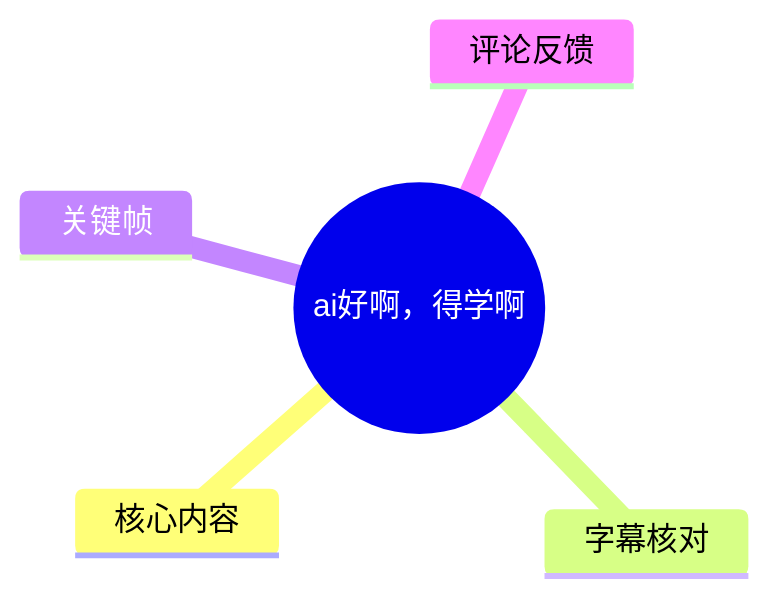
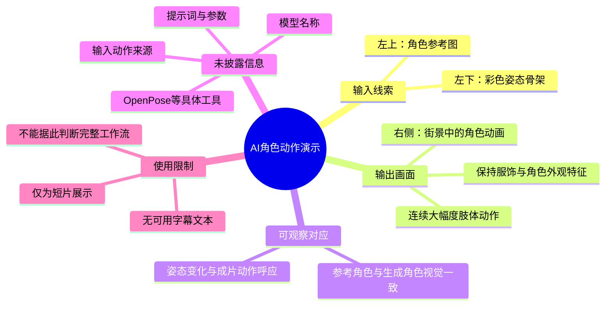
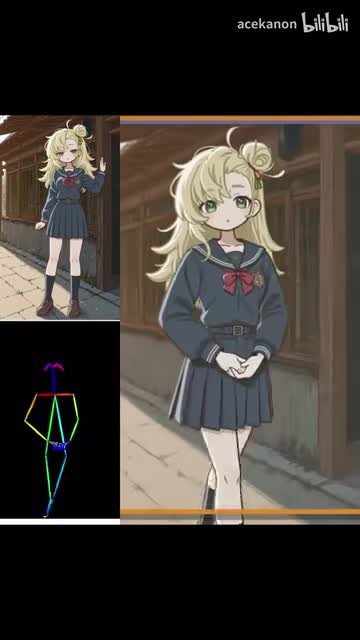
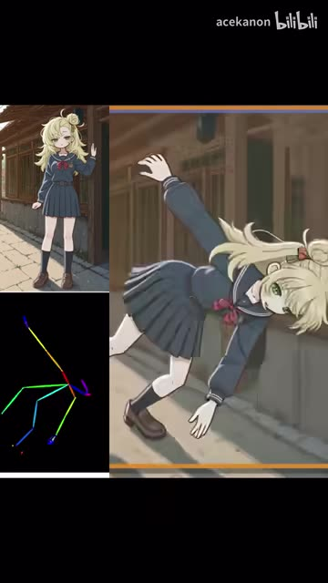
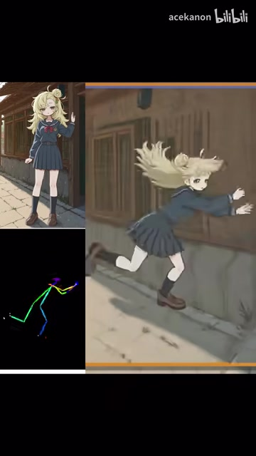
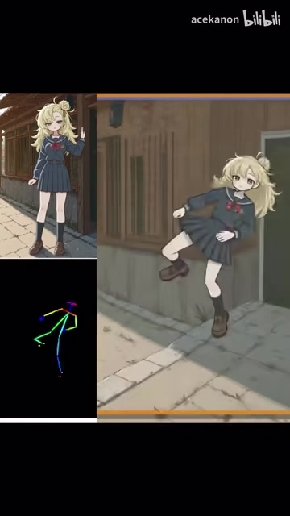

# ai好啊，得学啊

> 来源：[Bilibili 视频](https://www.bilibili.com/video/BV13Z1tB7EDs) 
> UP 主：acekanon｜发布时间：2025-11-06｜视频时长：9 秒｜画面规格：1080×1920（竖屏）

## 小结

该视频是一段约 9 秒的 AI 动画效果展示。画面将三类信息并列：左上是一个金发制服少女的静态角色参考图，左下是彩色人体骨架/姿态轨迹，右侧是同一角色在街景中完成连续大幅度肢体动作的动画结果。

从画面可直接确认，视频意在展示“参考角色 + 姿态信息 + 生成结果”之间的对应关系：右侧角色基本保留了金发、深蓝色制服、红色领结、白袜与棕色鞋等视觉特征，同时其动作姿态与左下骨架的变化方向相呼应。该呈现形式可被谨慎理解为角色动画、姿态驱动或动作迁移类 AI 工作流的效果演示。

不过，视频没有给出模型名称、提示词、输入视频来源、姿态提取器、采样参数、分辨率、时长上限、后处理方式或硬件配置。因此，不能仅凭该片段断定其具体使用了 OpenPose、某个视频生成模型，或某种特定的“模型转绘”方案。

该素材适合关注 AI 视频生成、角色一致性、姿态控制与动作迁移效果的人快速浏览；若要复现，仍需补充完整工作流、原始输入、参数和多段测试结果。视频发布于 2025 年 11 月，AI 视频工具的能力、价格、可用性与模型版本均可能已发生变化。

## 思维导图

## 目录

- [画面内容与展示结构](#画面内容与展示结构)
- [可观察的技术线索](#可观察的技术线索)
- [可复用经验与实践检查清单](#可复用经验与实践检查清单)
- [参数、限制与时效性](#参数限制与时效性)
- [字幕比对](#字幕比对)
- [评论分析](#评论分析)
- [处理记录](#处理记录)

## [画面内容与展示结构](https://www.bilibili.com/video/BV13Z1tB7EDs?t=0)

视频采用竖屏三栏式展示，黑色背景将输入线索与最终效果分隔开来：

1. **左上：角色参考图**  
   一名金发少女站在街景中，穿深蓝色水手风制服、红色领结、白色长袜与棕色短靴。这一区域承担角色外观参考的作用。

2. **左下：人体姿态骨架**  
   黑底上显示彩色骨架线条与关节点。骨架随时间改变姿态，能够看出头部、躯干、四肢及腿部的相对位置变化。仅从视觉上可以判断其属于姿态表示；素材并未标注算法名称。

3. **右侧：角色动画结果**  
   右侧以更大画幅展示角色在街道背景中的连续动作。人物从相对站立的状态转为侧倾、前倾与腾跃式的大动作姿态；头发、裙摆与肢体姿势随动作发生变化。

> 图：该帧同时展示了静态角色参考、彩色骨架和右侧生成角色，是理解视频输入—控制—输出关系最有价值的一帧。它说明视频并非只展示成片，而是刻意保留了参考图与姿态线索。

> 图：该帧中右侧人物发生明显的侧向倾斜，左下骨架也呈对应的伸展姿态，有助于观察姿态控制信号与动画动作之间的视觉关联。

> 图：该帧展示角色在连续运动中出现头发、裙摆和四肢的动态变化，可用于判断生成结果是否仅复制静态贴图；但单帧无法验证时序稳定性、物理合理性或整段视频的一致性。

> 图：该帧呈现更大幅度的单腿抬起与身体偏转动作，反映该演示覆盖了超过普通站立或轻微摆动的姿态变化范围。

## [可观察的技术线索](https://www.bilibili.com/video/BV13Z1tB7EDs?t=0)

### 角色一致性：可确认的是视觉特征延续

右侧生成角色与左上参考图之间存在较清晰的外观延续：

- 金色长发与顶部发髻/发束特征仍被保留；
- 深蓝色制服、红色领结、白袜、棕色鞋等关键服装元素延续；
- 人物整体仍处于日式街景风格的环境中；
- 在大幅动作下，衣物、发型与身体朝向发生了相应变化。

这说明成片至少追求了“让同一角色在运动中保持可辨识”的目标。需要注意，视频时长极短，且未展示遮挡、转身、快速镜头切换、多人互动、复杂手部细节等更容易暴露角色漂移的问题，因此不能据此评价长视频一致性。

### 姿态控制：可确认的是并列关联，不足以确认具体实现

左下角的彩色骨架与右侧人物动作在视觉上具有同步关联。例如，人物由站立转向倾斜、伸展和腾跃式姿态时，骨架的躯干与四肢也出现相应变化。由此可合理描述为：**视频展示了姿态信息参与角色动作控制的效果。**

但以下说法均缺乏素材直接证据，不能作为事实写入：

- 骨架一定由 OpenPose 生成；
- 该动画一定使用了 ControlNet、AnimateDiff、Wan、Sora 或其他特定模型；
- 输入动作来自真人视频、3D 动画、动作捕捉或手工关键帧；
- 输出属于逐帧转绘、图生视频、视频到视频或骨骼驱动渲染中的某一种确定实现。

热评中出现“像模型转绘”“不像 openpose”的讨论，属于观众判断，不构成工作流证据，详见后文评论分析。

### 动态效果：展示的是短时连续运动，而非完整质量测试

从连续关键帧可见，角色完成了连贯的大幅肢体变化，画面中头发与裙摆随姿态变化呈现动态感。对 AI 视频演示而言，这类动作通常可用于检验：

- 大幅度姿态变化下的身体结构维持；
- 角色服饰与面部特征的持续可辨识性；
- 肢体、头发、服装在运动过程中的视觉连贯性；
- 背景是否能在人物移动时保持相对稳定。

不过，本片没有提供失败样例、原始动作对照、逐帧放大、生成耗时或多次抽样结果，故不能判断其成功率、随机性、可控程度与可量产性。

## [可复用经验与实践检查清单](https://www.bilibili.com/video/BV13Z1tB7EDs?t=0)

视频本身不是教程，未给出可执行的软件操作步骤。基于其展示结构，可以提炼出一套**用于评估或设计“参考角色 + 动作控制 + 视频输出”演示**的检查方法；以下内容是对画面结构的归纳，不是视频披露的原始操作流程。

### 1. 明确拆分三类素材

若要让观众理解 AI 动画的控制关系，演示中可同时给出：

1. **角色参考素材**：用于确认人物脸部、发型、服装和整体画风；
2. **动作/姿态条件**：例如人体骨架、动作视频、关键点序列或其他可视化控制信号；
3. **最终视频结果**：用于展示角色是否在动作过程中保持身份与风格。

本视频的左右布局正是这一思路：左侧解释输入条件，右侧集中展示结果。

### 2. 用高难度姿态而非静态姿态验证效果

仅展示站立、眨眼或轻微摆动，很难体现动作控制能力。本片包含侧倾、肢体伸展、奔跃式姿势等较大运动变化。实际评估时可重点观察：

- 肩、肘、髋、膝关节是否出现不自然折叠；
- 双腿、手臂和躯干的相对位置是否随姿态控制而变化；
- 头发、衣摆是否能随运动保持合理的视觉连续性；
- 服饰配件是否消失、漂移或形状突变；
- 面部是否随视角变化而失去角色辨识度。

### 3. 不要把“效果展示”直接当成“可复现方案”

若希望将类似效果转化为可重复工作流，至少应额外记录：

| 应记录项目 | 本视频是否提供 | 为什么重要 |
| --- | --- | --- |
| 使用模型与版本 | 未提供 | 决定能力边界、兼容性与结果差异 |
| 姿态提取或控制工具 | 未提供 | 决定骨架格式、关节点定义与控制精度 |
| 原始动作来源 | 未提供 | 决定动作自然度、版权与输入要求 |
| 角色参考图数量与规格 | 未提供 | 影响身份一致性与多视角稳定性 |
| 文本提示词 | 未提供 | 影响场景、镜头、风格及负面约束 |
| 随机种子与采样设置 | 未提供 | 影响复现性与结果波动 |
| 输出帧率、分辨率与时长 | 仅可确认视频为 1080×1920、时长约 9 秒 | 影响画面质量、成本与运动连贯性 |
| 后处理流程 | 未提供 | 影响插帧、修复、剪辑与最终观感 |

### 4. 建议补充对照材料

若将来制作同类技术展示，建议增加以下对照，避免观众只能凭观感猜测：

- 原始动作视频或动作序列；
- 骨架提取前后的对照；
- 参考图与输出关键帧的放大比较；
- 未修复的原始生成片段；
- 多次生成的成功与失败样本；
- 所用模型、版本、关键参数及生成耗时；
- 涉及第三方角色或素材时的授权说明。

## [参数、限制与时效性](https://www.bilibili.com/video/BV13Z1tB7EDs?t=0)

### 已知参数与元数据

| 项目 | 可确认信息 |
| --- | --- |
| 视频时长 | 9 秒；ASR 读取音频时长为约 8.15 秒 |
| 画面尺寸 | 1080×1920 |
| 画面方向 | 竖屏 |
| UP 主 | acekanon |
| 标题与简介 | 均为“ai好啊，得学啊” |
| 发布日期 | 2025-11-06 |
| 收藏数（抓取时） | 1,333 |
| 点赞数（抓取时） | 1,486 |
| 播放数（抓取时） | 88,532 |
| 抓取时间 | 2026-07-15 |

以上互动数据是抓取时的快照，不代表当前实时数值。

### 未公开的关键技术参数

视频没有公开以下决定复现效果的关键信息：

- 模型名称、版本、许可证与部署方式；
- 姿态骨架的具体算法、关节点格式和置信度阈值；
- 输入动作的帧率、分辨率、时长与来源；
- 角色图的生成方式、训练方式或参考图数量；
- 提示词、负面提示词、图像权重与控制权重；
- 去噪强度、采样器、步数、随机种子；
- 显存占用、推理耗时、设备型号与成本；
- 插帧、超分、补帧、局部修复等后处理流程。

因此，本片可作为视觉效果案例，但不能作为一份可直接复刻的技术教程。

### 时效性与版权边界

- 视频发布于 2025 年 11 月；AI 视频模型迭代速度快，后续版本可能在一致性、动作幅度、生成成本和可用接口方面明显变化。
- 素材中的角色形象具有既有动画风格特征；视频未说明其角色来源、素材授权或商用许可。使用相似工作流时，应自行确认角色、动作源视频、模型与输出内容的版权及平台规则。
- 该视频没有口述或文字说明其用途，无法据此推断其是否支持商业制作、批量生成或公开发行。

## [字幕比对](https://www.bilibili.com/video/BV13Z1tB7EDs?t=0)

| 字幕来源 | 完整性 | 专有名词 | 时间轴 | 主要问题 |
| --- | --- | --- | --- | --- |
| Bilibili 站内字幕 | 无可用字幕 | 无法核验 | 无可用分段 | 字幕抓取过程异常，素材中未提供可用站内字幕文本 |
| 本次 ASR 字幕 | 空 | 无法识别 | ASR 结果无语音分段 | 使用 `medium` 模型自动识别，语言检测为英语、置信度约 0.541；未识别出任何语音片段 |

本次 ASR 已完成检查：音频文件存在，音频读取时长约为 8.15 秒，但识别结果的 `segments` 为空，诊断显示语音时长为 0 秒、语音覆盖率为 0。诊断提示为“未识别到语音片段，应核验是否存在可听语音或使用正确音轨”。

素材并**未**标记 `noAudioStream=true`，因此不能将其表述为“源视频没有音轨”。更准确的结论是：本次可访问音频未产出可用语音转写，可能是无口语、语音过弱、以音乐/音效为主，或语音识别未能识别；现有材料不足以进一步确认原因。

最终未采用任何字幕文本，正文依据以下可验证信息编写：

- 视频元数据中的标题、简介、时长与画面规格；
- 关键帧中可见的参考角色、彩色姿态骨架和动画结果；
- 评论中明确标注为观众主观观点的内容。

由于没有有效字幕，文中不将“OpenPose”“模型转绘”等词写为视频作者明确说法，而仅在评论语境中保留。

## [评论分析](https://www.bilibili.com/video/BV13Z1tB7EDs?t=0)

仅处理本次可获取的热评前三条；评论是用户观点，不等同于视频事实或技术证据。

1. **acekanon（103 赞）：“[吃瓜]”**  
   - 该评论来自 UP 主本人，但仅为表情回应，没有补充模型、制作流程、素材来源或技术参数。  
   - 其信息量有限，不能用于确认视频的具体工具链。

2. **洋子啊洋子（93 赞）：“这不是那个空翻教练吗…”**  
   - 评论者认为动作素材或人物动作让其联想到“空翻教练”。  
   - 这可能是在指出动作参考的既视感，但未提供具体人物、原视频或可核验链接。  
   - 视频关键帧确有大幅度倾斜、腾跃式姿态，但不能据此确认动作来源、原始表演者身份或“空翻教练”的具体指代。

3. **咸魚塔（90 赞）：“不像openpose啊，感觉像模型转绘啊，几个月没碰，现在一致性这么强了吗”**  
   - 评论提出两项主观看法：左下控制信号看起来“不像 OpenPose”，以及右侧效果“感觉像模型转绘”。同时，评论者对角色一致性提升表示惊讶。  
   - 这条评论反映了观众对技术路线和一致性能力的关注，也说明仅凭画面无法让观众确定工作流。  
   - 由于视频未展示模型、节点图、日志或参数，无法验证其关于 OpenPose 或模型转绘的判断。可确认的只有：画面中确实存在彩色骨架式姿态可视化，并呈现了较强的短时角色外观延续。

## [处理记录](https://www.bilibili.com/video/BV13Z1tB7EDs?t=0)

- **Worker ID**：worker-mrj0www4-e8d79408
- **模型**：gpt-5.6-terra
- **素材与工具输出**：使用已提供的视频元数据、`merged.mp4`、`audio/audio.wav`、ASR 诊断与结果、关键帧目录、评论 JSON；站内字幕工具运行记录出现退出异常（`code 3221226505`）。
- **字幕选择**：站内字幕无可用文本；本次 ASR 使用 `medium` 模型，结果为空且无时间分段。正文不采用虚构字幕，改以关键帧、多模态画面和元数据为依据。
- **ASR 核验结论**：已检查 ASR 结果；音频文件存在，但未识别到语音片段。未发现 `noAudioStream=true` 标记，故不将问题归因为无音轨。
- **关键帧选择依据**：选用 `frame-001.jpg` 至 `frame-004.jpg`，因为它们依次清晰呈现三栏布局、参考角色、姿态骨架以及右侧角色在不同大幅度姿态下的动画结果，适合支撑“参考—姿态—输出”的分析。
- **时间轴依据**：缺少可用站内 SRT 和 ASR 语音分段；正文时间轴仅使用视频起点 `0` 秒这一可确认位置，未根据文字顺序臆测其他段落时间。
- **缓存清理**：未提供缓存清理执行结果或日志；不虚构已清理状态。
- **未解决问题**：无法确认具体模型、姿态算法、动作源、提示词、生成参数、后处理步骤、音频内容及角色/动作素材授权情况。

## 评论分析

- 热评 1：[吃瓜]
- 热评 2：这不是那个空翻教练吗…
- 热评 3：不像openpose啊，感觉像模型转绘啊，几个月没碰，现在一致性这么强了吗

以上内容是观众反馈摘录，只用于补充理解视频反响，不作为正文事实依据。
