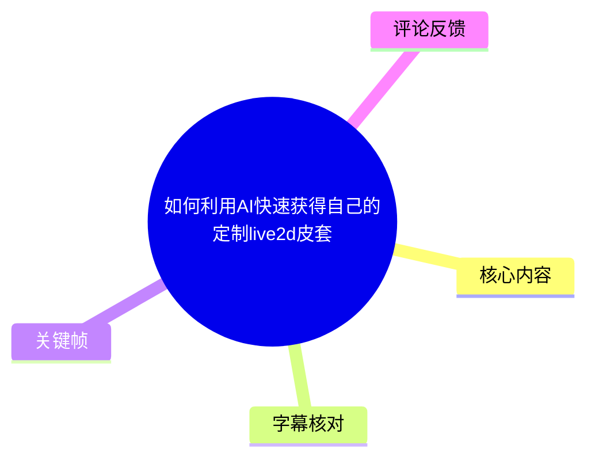
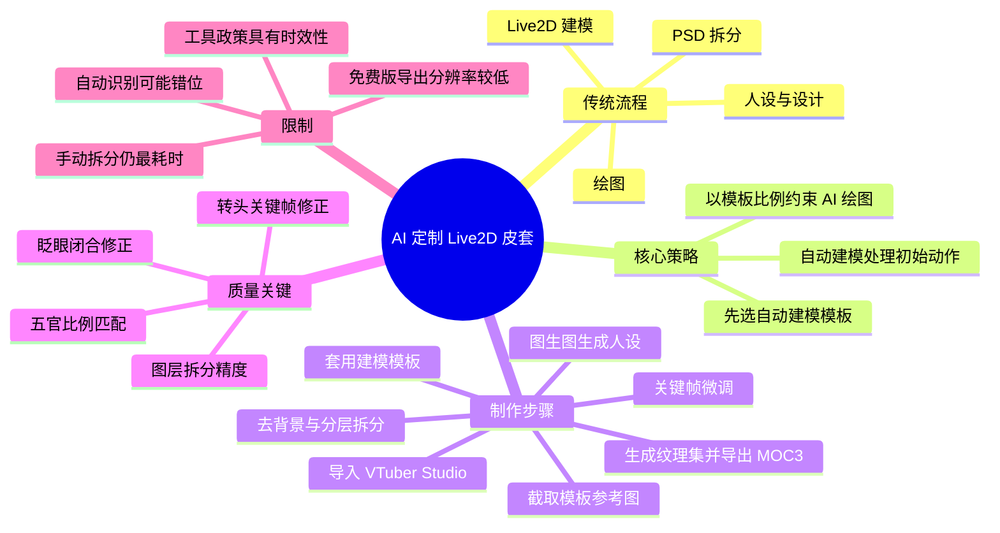
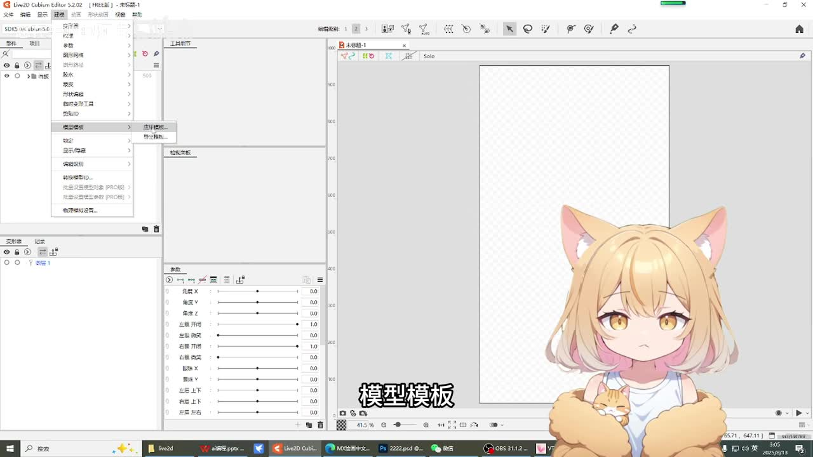
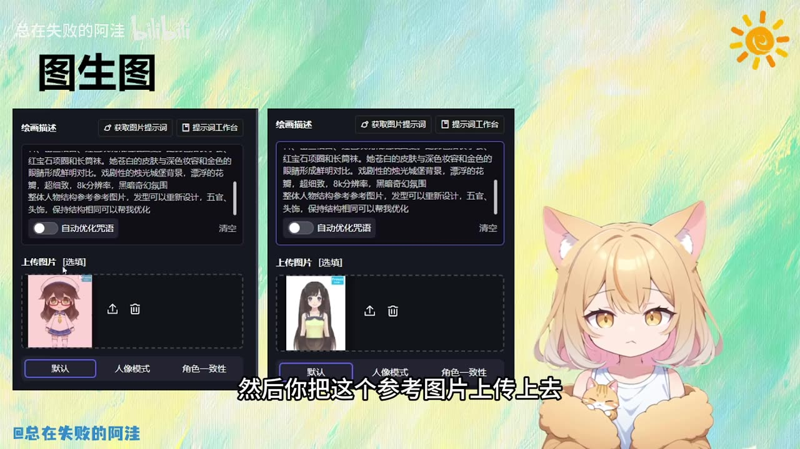
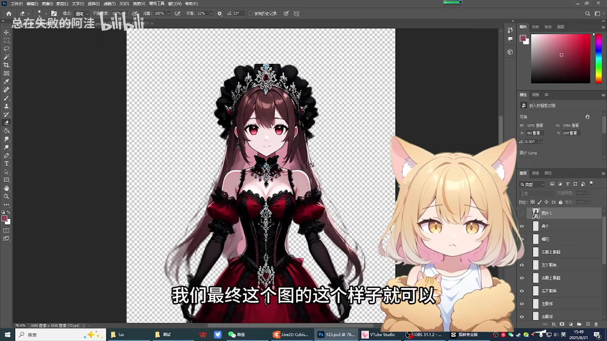

# 如何利用AI快速获得自己的定制live2d皮套

> 来源：[Bilibili 视频](https://www.bilibili.com/video/BV1LwYRzjEWH) 
> UP 主：总在失败的阿洼｜发布时间：2025-08-21｜视频时长：13 分 44 秒｜合集：AIcode

## 小结

本视频展示了一条以 AI 降低 Live2D 皮套制作门槛的实操路线：不从零学习完整的手工建模，而是先在 Live2D Cubism 中选择自动建模模板，再让 AI 绘图结果主动贴合该模板的面部比例与结构，最后通过拆分 PSD、自动建模和少量关键帧微调获得可在 VTuber Studio 中使用的模型。

核心思路是“反向适配自动建模模板”。传统流程包括人设设计、绘图、拆分、Live2D 建模；视频将人设辅助与绘图交给 AI，并利用自动建模处理大量初始参数。真正仍需投入手工时间的环节是**图层拆分**，且拆分的精细程度直接决定转头、眨眼等动作的自然度。

实操中，作者使用 Live2D Cubism Free 版查看并套用模型模板；Free 版可以完成流程，但作者称导出分辨率较低。视频提到 Pro 版有 **42 天试用期**，建议先完成图像与拆分，再在试用期内完成高分辨率导出。该价格、版本功能和试用政策属于工具时效信息，实际应以使用时的软件官方页面为准。

自动建模不是“无需修正”的成品方案。示例中出现了转头时眼睛或脸部错位、眨眼闭合错误、歪轴仍需调整等问题。作者将 Cubism 的修正逻辑类比为 Flash 动画：找到参数对应的关键帧，在异常姿势处移动、缩放或闭合部件，由软件在相邻关键帧间插值。

本方法适合希望快速获得“基本可用”定制 VTuber 形象、接受简化动作效果的初学者。若目标是高质量商用或大幅度动作模型，仍应进行更细的拆分、变形器与参数调整，并学习更系统的 Live2D 建模知识。

## 思维导图

## 目录

- [背景：将 AI 绘图与自动建模串成流程](#背景将-ai-绘图与自动建模串成流程)
- [选择自动建模模板并建立参考图](#选择自动建模模板并建立参考图)
- [用参考结构约束 AI 图生图](#用参考结构约束-ai-图生图)
- [拆分 PSD：流程中最耗时间的人工环节](#拆分-psd流程中最耗时间的人工环节)
- [套用模板并预览自动建模结果](#套用模板并预览自动建模结果)
- [关键帧微调：处理转头错位与眨眼错误](#关键帧微调处理转头错位与眨眼错误)
- [生成纹理集、导出 MOC3 与导入 VTS](#生成纹理集导出-moc3-与导入-vts)
- [完整操作清单与质量控制](#完整操作清单与质量控制)
- [结论、限制与时效性](#结论限制与时效性)
- [字幕比对](#字幕比对)
- [评论分析](#评论分析)
- [处理记录](#处理记录)

## 背景：将 AI 绘图与自动建模串成流程 [00:00:01](https://www.bilibili.com/video/BV1LwYRzjEWH?t=1)

作者先概括传统 Live2D 皮套的制作链路：先完成设计与人设，再画图；画完以后把图像拆分为可独立运动的部件，最后导入 Live2D 进行建模，使角色可以活动。

视频对各环节的 AI 分工如下：

| 环节 | 视频中的处理方式 | 是否仍需要人工介入 |
| --- | --- | --- |
| 人设与提示词 | 可让 AI 根据已有思路辅助完善提示词 | 需要提供方向与筛选 |
| 角色绘图 | 使用 AI 绘图生成角色图 | 需要控制生成结果 |
| 图层拆分 | 将眼睛、眉毛、嘴巴等分为独立图层 | 是，视频认为这是主要人工步骤 |
| Live2D 建模 | 使用 Cubism 的自动建模模板 | 仍要检查和微调 |
| 最终动作质量 | 通过关键帧修正 | 是，精细程度取决于投入 |

> 图：画面以“设计、人设 → 画图 → 拆分 → live2d 建模”的纵向流程展示 AI 与人工的分工：设计/人设和绘图可由 AI 辅助，拆分仍为手动，建模可采用自动建模。这张图准确呈现了视频方法的边界，而不是将流程误解为全自动。

作者的关键判断是：如果先让 AI 生成的人物图尽量匹配自动建模模板的结构，那么人设与绘图阶段就已经在为后续自动建模做适配，手工工作会集中到拆分与最终修正上。

## 选择自动建模模板并建立参考图 [00:01:13](https://www.bilibili.com/video/BV1LwYRzjEWH?t=73)

作者在 Live2D Cubism 中使用 Free 免费版演示。操作逻辑是先导出一个空白 PSD，再在“建模 / 模型模板 / 应用模板”相关位置查看可用的自动建模模板。

模板不是单纯的角色外观参考，而是包含面部与身体结构比例的建模基准。作者特别强调应选择自己喜欢的模型比例，然后以其中的脸部大小、眼睛尺寸与五官位置为约束，要求 AI 在相似结构下生成新的角色形象。

> 图：关键帧展示了 Live2D Cubism 的界面及菜单中的模型模板相关入口，右侧为示例角色。它说明视频并非从空白工程手工布点，而是以软件已有模板作为自动建模的起点。

### 参考图的作用

作者从模板中截取图像，并形成两张参考图后交给 AI 绘图工具。视频的目标不是复制模板角色，而是保留与模板相近的：

- 脸部整体尺寸；
- 双眼相对位置与大小；
- 五官结构与比例；
- 适合模板参数覆盖的正面人物构图。

如果生成图与模板整体结构足够匹配，自动建模可对骨骼、眉毛、眼睛等部件建立初始动作关系。这里的“可直接做好”应理解为视频中的经验性表述；后续示例明确显示，自动结果仍可能存在错位和眨眼问题。

## 用参考结构约束 AI 图生图 [00:02:28](https://www.bilibili.com/video/BV1LwYRzjEWH?t=148)

将模板参考图准备好后，作者把参考图上传到 AI 绘图工具，同时输入此前准备的人设提示词。视频中的要求可以整理为：

1. 上传自动建模模板的参考图；
2. 输入自己想要的人设、服装与风格描述；
3. 要求 AI 使人物整体结构参考模板；
4. 在保持相近五官比例和脸部结构的前提下，重新设计发型、五官和服饰；
5. 从生成结果中选择适合作为后续拆分与建模基础的图。

> 图：画面显示“图生图”界面，包含绘画描述输入区域和上传图片区域；字幕同步说明“把这个参考图片上传上去”。它说明参考图是生成约束的一部分，而非仅作为审美灵感图。

视频未指定所使用 AI 绘图平台、具体模型、提示词全文、采样参数、分辨率或版权许可条款，因此不能据此复现完全相同的生成效果。使用其他服务时，应自行核对该服务对参考图、人像风格、商用输出及训练数据的许可规定。

## 拆分 PSD：流程中最耗时间的人工环节 [00:03:00](https://www.bilibili.com/video/BV1LwYRzjEWH?t=180)

AI 绘图完成后，作者先通过自动抠图工具去除背景，然后进入其认为“最花时间”的拆分阶段。其目标并不是制作高复杂度全身模型，而是把关键面部部件分层，并保证所有图层重新叠放时能拼回原始人物图。

> 图：关键帧展示 Photoshop 画布中的人物成图及右侧图层列表；可见眼部相关图层被分开。这张图直接说明拆分产物应以含多个透明图层的 PSD 形式存在，是进入 Cubism 前的关键资产。

### 视频列举的拆分部件

作者明确提到需要分别处理或检查的部件包括：

- 眉毛；
- 眼球；
- 眼角；
- 眼眶/上眼框；
- 嘴巴；
- 鼻子。

操作示例中，作者先圈选眼睛，再通过复制、擦除边缘等方式获得单独眼部图层；随后分别处理上眼框、眼球、眼角等。重点是让每个部件沿边缘被干净提取，并能在叠回原位时恢复原图。

### 拆分的最低目标与取舍

视频采用“快速可用”的策略，作者明确表示示例拆分得较粗略，且不对衣服做大量额外拆分。其最低验收标准是：

- 背景已去除；
- 脸部运动相关组件已分层；
- 分层后能按原位置拼回角色；
- 图层大小与模板比例大致吻合。

这是一种效率优先的取舍：它能缩短制作时间，但会降低大幅转头、复杂表情、发丝摆动和服装动态的可控性。若希望获得更自然的效果，应扩大拆分范围，并为运动后露出的区域准备补绘内容；视频未演示这些高级处理。

## 套用模板并预览自动建模结果 [00:04:30](https://www.bilibili.com/video/BV1LwYRzjEWH?t=270)

作者将拆分后的 PSD 导入 Live2D Cubism，再次进入“建模应用模板”流程，确认相关选项并进行对应。关键是让导入的人物尺寸、脸部和五官比例尽可能与先前选择的模板重合。

视频中，作者通过画面对齐检查五官位置；即便存在“稍小一点”的差异，只要总体比例能对应，便认为可以继续预览。随后直接预览，软件会基于模板对分层部件进行自动处理，角色已经能够出现左右转动等初步效果。

### 自动结果中立刻出现的典型问题

作者同时说明，简化拆分和模板识别不完全匹配通常会造成问题。例如：

- 左右移动时脸部或眼睛移出应有位置；
- 部件重叠关系不自然；
- 自动识别不如原模板精细；
- 动作虽已可预览，但尚不适合直接视为完成品。

这意味着模板匹配的本质是获得一套初始参数、变形和关键帧结构，而非绕过质量检查。

## 关键帧微调：处理转头错位与眨眼错误 [00:06:45](https://www.bilibili.com/video/BV1LwYRzjEWH?t=405)

作者将 Cubism 的调整方式类比为 Flash 动画：不同参数位置具有关键帧；选择变形器或相应部件后，参数轨道变绿意味着该处存在关键帧。用户只需要修改某个关键帧上的部件状态，软件会在关键帧之间自动过渡。

### 修正转头时眼睛移出脸部

在左右转头的某个最大角度，作者发现眼睛移出脸部，处理步骤是：

1. 找到造成异常的参数与方向；
2. 定位该方向对应的最大幅度关键帧；
3. 选中出错的眼睛或相关变形器；
4. 在该关键帧上调整其位置；
5. 返回预览检查转头过程；
6. 继续微调其他相邻关键帧，降低过渡中的突兀感。

作者演示后认为该帧已“好很多”，但仍承认存在奇怪之处。这与视频定位一致：示例只展示修正方向，没有追求精修成品。

### 修正眨眼

在眨眼演示中，作者发现左、右眼的开闭状态有错误。例如，某参数位置本应为闭合状态，但部件没有正确闭合。修正思路是：

1. 选中对应的左眼或右眼开闭参数；
2. 移动到错误发生的关键帧；
3. 拖动控制点或相关部件，使眼睛在该帧闭合；
4. 播放或预览动作，检查开闭过渡。

作者再次强调其原理类似 Flash 动画的逐关键帧修正。该比喻有助于理解操作，但不代表 Live2D Cubism 与 Flash 的底层实现完全相同。

### 关于“基本可用”的标准

作者认为在最终实际使用中，人物摆动幅度往往没有编辑器中的测试幅度那么大，因此经过基础修正后即可达到“几乎能用”的程度。但这仅适用于较小的动作范围；如果需要明显侧脸、复杂眨眼或高精度面捕，仍需更细拆分和更完整的参数调整。

## 生成纹理集、导出 MOC3 与导入 VTS [00:10:25](https://www.bilibili.com/video/BV1LwYRzjEWH?t=625)

调整完成后，作者提醒需要处理“纹理集”。根据视频表述，软件会将各个部件整理到纹理集中；纹理集建立后才能继续导出模型。

### 导出步骤

1. 确认模型的关键帧与部件调整已完成；
2. 在 Cubism 中建立/自动排布纹理集；
3. 进行导出；
4. 导出格式选择 **MOC3**；
5. 保存导出的模型文件及相关资源。

作者在约 11 分 18 秒说明：纹理集建好之后才能导出；约 11 分 26 秒明确演示导出为 MOC3 文件。

### 导入 VTuber Studio

作者随后打开 VTuber Studio（视频中简称 VTS），在更改 VTS 模型的位置导入自己的模型。按视频说明，软件会提示自定义模型文件应放入的文件夹；创建新文件夹并将导出的文件放入其中，返回模型选择界面即可看到新模型并切换使用。

导入后的观察结果是：

- 左右移动动画已经产生；
- 一侧眨眼仍存在错误；
- 歪轴等问题仍待修正；
- 流程已经跑通，但成品质量仍取决于前面的拆分与后续微调。

## 完整操作清单与质量控制 [00:12:58](https://www.bilibili.com/video/BV1LwYRzjEWH?t=778)

### 最小可用流程

1. 在 Live2D Cubism 中浏览并选择自动建模模板。
2. 截取模板角色或结构图，作为生成参考。
3. 准备人设描述与提示词。
4. 在 AI 绘图工具中上传参考图，以模板的人物结构、脸部和五官比例约束生成。
5. 筛选正面、结构清晰、适合拆分的生成图。
6. 用抠图工具去掉背景。
7. 在图像编辑软件中把眉毛、眼眶、眼球、眼角、嘴巴、鼻子等拆为独立透明图层。
8. 检查各图层叠放后是否能还原原图。
9. 将 PSD 导入 Cubism，并套用最初选定的模型模板。
10. 对齐人物与模板的整体比例，预览自动建模效果。
11. 针对转头错位、眼部越界、眨眼闭合错误等问题，逐参数定位关键帧并修正。
12. 创建纹理集。
13. 导出 MOC3 及模型所需资源。
14. 将完整导出文件放入 VTuber Studio 指定的模型目录。
15. 在 VTuber Studio 中切换模型，测试左右转动、眨眼与歪轴等动作。

### 质量优先级

| 优先级 | 检查项 | 原因 |
| --- | --- | --- |
| 高 | 生成图与模板的五官比例是否接近 | 直接影响模板自动识别和部件对齐 |
| 高 | 图层能否无缝拼回原图 | 否则运动时易出现空洞、错位或边缘破损 |
| 高 | 眼睛、眼眶、眼角是否独立 | 眼部是眨眼与转头最容易暴露问题的区域 |
| 中 | 最大转头角度是否异常 | 小角度可用不代表极值姿势可用 |
| 中 | 左右眼开闭是否正确 | 自动结果可能一侧错误，需分别验证 |
| 中 | 纹理集是否已建立 | 视频明确表示这是导出的前提 |
| 低至中 | 衣服、头发等是否精细拆分 | 取决于是否追求复杂动态与高完成度 |

## 结论、限制与时效性 [00:13:12](https://www.bilibili.com/video/BV1LwYRzjEWH?t=792)

视频最终总结的可迁移方法是：**先从自动建模模板获得结构参考，再让 AI 绘图适配该结构，最后通过拆分和关键帧修正得到定制模型。** 它把最难从零起步的绘图任务转交给 AI，但没有消除拆分与精修成本。

### 视频明确指出的限制

- 拆分是最花时间的步骤，且不能完全省略。
- 拆分越粗略，自动建模后的脸部、眼睛和转头越容易出问题。
- Free 版虽然能完成制作，但作者称最终导出分辨率偏低。
- 示例模型仍有眨眼错误和歪轴问题，作者没有将其修到完全自然。
- 若追求高质量，应投入更多时间细分部件，并学习更精细的 Cubism 调整方法。

### 时效性说明

本视频发布于 2025-08-21。视频中的 Live2D Cubism 版本、模板位置、Free/Pro 功能差异、Pro 版“42 天试用期”、导出限制及 VTuber Studio 的模型导入目录规则，均可能随着软件版本、地区、授权政策或平台更新而变化。本文仅记录视频中的说法，不将其视为当前官方承诺；实际操作前应核对软件内提示与官方文档。

### 未在视频中解决的问题

- 未给出具体 AI 绘图平台、模型名称和完整提示词。
- 未展示 AI 生成图的版权、商用许可或角色 IP 合规处理。
- 未演示复杂头发、衣物、物理摆动、口型同步或高精度面捕。
- 未展示完整的 Cubism 参数命名、变形器层级与工程文件配置。
- 未说明 MOC3 导出时所有配套文件的完整清单；实际导入 VTS 时应保留导出目录中的关联资源，而不是只复制单一文件。

## 字幕比对

| 字幕来源 | 完整性 | 专有名词 | 时间轴 | 主要问题 |
| --- | --- | --- | --- | --- |
| Bilibili 站内字幕 | 未提供可用字幕 | 无法核验 | 无法使用 | 素材记录显示字幕工具请求返回 `Invalid URL`，未获得可用站内字幕文件 |
| 本次 ASR 字幕 | 覆盖 623.97 秒语音，约占视频 75.73%；首句 00:00:01.170，末句 00:13:38.400 | 可识别 Live2D、Free、Pro、VTuber Studio、MOC3 等，但部分词有误识别 | 提供逐段 SRT 时间戳，可直接用于章节定位 | 口语断句较多；“关键帧”多处被识别为“关锵帧”；“拆分”“结构”“精致”等存在错字或同音替换；少量操作过程无语音 |

最终正文采用**本次 ASR SRT**作为时间轴的唯一来源，并结合关键帧画面和上下文修正文字表述。源视频存在音轨：ASR 诊断给出音频时长 823.936875 秒、语言为中文、置信度 0.99755859375，且**未标记 `noAudioStream=true`**；因此不能将站内字幕获取失败视为“无音轨”或工具故障的替代结论。

主要校正包括：

- ASR 的“关锵帧”统一按语境写为“关键帧”；
- “自動建模 / 自动件模”等统一为“自动建模”；
- “参卡图”按上下文写为“参考图”；
- “MOC3”依据 ASR 的明确读音及视频导出语境保留为模型导出格式；
- “VTuber Studio”依据 ASR 中的软件名称和画面上下文保留；
- 对无语音但存在操作画面的间隔，不虚构具体菜单参数，仅记录视频实际说明的步骤。

## 评论分析

仅处理素材中可获取的热评前三条；评论为用户观点，不作为已验证事实。

1. **秋雨叚72｜218 赞**  
   评论内容：“生成完之后：”  
   该评论是未完成的调侃式表达，没有补充具体技术信息，也未提出可验证结论。结合视频成品仍有眨眼和歪轴问题的展示，可理解为对“生成之后仍需处理”的玩笑性期待，但不能据此推导作者未展示的后续结果。

2. **是小太阳吗｜136 赞**  
   评论内容：“其实拆分建模都全套ai搞定了，软件叫啥忘了”  
   评论声称存在可由 AI 完成拆分与建模的软件，但没有提供软件名称、版本、功能范围、操作证据或链接。因此它可作为“用户期待进一步自动化”的补充线索，不能替代本视频流程，也不能证明相关软件当前可用或适用于该案例。

3. **扣肉1tothree｜87 赞**  
   评论内容：“还得自己拆啊 等了一年AI都没能自己拆[doge_金箍]”  
   该评论准确呼应了视频最重要的成本点：作者的方案仍要求人工拆分。评论中的“等了一年”是个人感受和夸张性表达，不构成 AI 图层拆分能力发展情况的客观时间线；但它反映了观众对自动拆分能力的强烈需求。

## 处理记录

- Worker ID：worker-mrj0wjed-b0c290ad
- 模型：gpt-5.6-terra
- 调用工具与素材：视频元数据、ASR 时间轴字幕（`asr/transcript.srt`）、ASR 分段诊断（`asr/asr-result.json`）、关键帧目录（`frames/`）、热评数据（`comments/comments.json`）。
- 字幕选择：未取得可用 Bilibili 站内字幕；已检查本次 ASR，确认源视频有音轨且 ASR 含真实时间戳。正文时间轴均依据 ASR SRT 的起止时间换算为秒数，不按文字顺序猜测。
- 关键帧选择依据：选用 `frame-001` 展示传统流程与 AI/人工分工，`frame-002` 展示 Cubism 模型模板入口，`frame-003` 展示图生图参考图上传，`frame-004` 展示 Photoshop 分层拆分结果；均与相应正文步骤直接对应。
- 站内字幕获取情况：素材警告记录为 `subtitles: Tool process exited with code 1` 与 `Invalid URL`，因此没有站内字幕可供比对。
- 缓存清理：未提供缓存清理执行结果或日志，不能声称已完成清理。
- 未解决问题：未能从素材确认具体 AI 绘图软件、完整提示词、Cubism 精确版本与官方当前授权条款；相关内容未作补写或推断。
