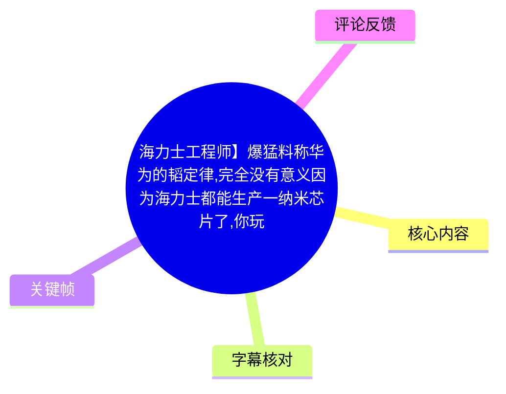
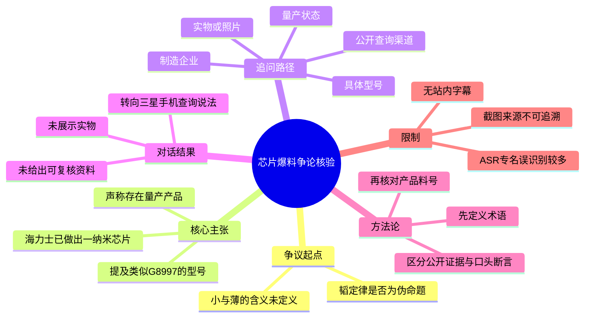
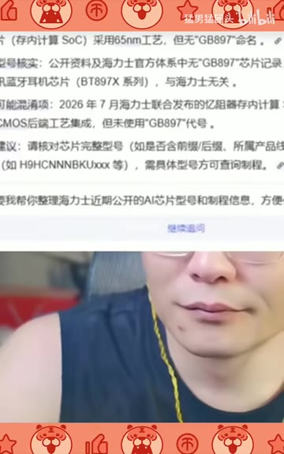

# 海力士工程师】爆猛料称华为的韬定律,完全没有意义因为海力士都能生产一纳米芯片了,你玩不过台积电所以开始玩文字游戏了,所以自研是套壳定律也是,

> 来源：[Bilibili 视频](https://www.bilibili.com/video/BV1i3KY6iEYU)  
> UP 主：猛男猛回头｜视频时长：4 分 55 秒｜竖屏画面（1080×1726）  
> 注：标题含有“海力士工程师”“一纳米芯片”等说法，但视频本体是一次直播式争论片段，并未提供可独立核验的人员身份、芯片实物或官方资料。

## 小结

视频记录了一场围绕“韬定律”（该名称以标题文字为准；ASR 中多次识别为“淘定律”“超定律”等）的争论。发言者先要求对方解释“做不到那么小、那么薄”的判断依据，随后把争议收束为一个可核验的问题：**是否存在由海力士生产、已量产、所谓“一纳米”的具体芯片型号**。

对方在对话中提出了“海力士已经做出一纳米芯片”以及类似“G8997”的型号说法；但当被追问量产型号、企业归属和信息来源时，没有在视频内给出可公开复核的产品资料、料号照片、封装丝印、数据手册或官方公告。视频主角因此持续要求“开摄像头看一眼”“拍照片后台发给我”。

本片最有价值的并非它证明了某一方的芯片论断，而是展示了技术争议中一个基础的取证流程：将模糊结论拆成可定义的指标，再要求给出具体型号、制造方、量产状态与可验证证据。尤其在半导体语境中，“一纳米”本身必须说明其所指是制程节点、特征尺寸、存储单元结构、封装尺度还是营销命名；视频并未完成这一层定义。

视频中还出现“只有三星手机能查到”的说法。主角以反问指出，若一种芯片型号只能通过购买特定手机才能验证，而无法由公开数据库、制造商资料或实物信息交叉确认，那么该说法的可验证性极低。该判断针对的是证据路径，而不是对任一品牌或企业技术能力的事实裁定。

画面后段曾出现一张搜索/问答式文字截图，内容方向是对“GB897”与海力士芯片关联的质疑或澄清；但截图清晰度有限，且视频没有展示原始网页链接、作者、发布时间或完整上下文，不能将其视为正式技术资料。全片没有提供华为、台积电、海力士或三星的官方技术文件，也没有构成独立新闻报道。

适合将本视频作为“如何审查技术爆料”的反例与讨论样本，而不适合据此认定海力士已经量产“一纳米芯片”、某个型号真实存在，或据此推导华为、台积电及“韬定律”的技术结论。

## 思维导图

## 目录

- [背景、争议对象与时效性](#背景争议对象与时效性)
- [从“韬定律”转向可验证的芯片命题](#从韬定律转向可验证的芯片命题)
- [“一纳米”与“G8997”说法的追问](#一纳米与g8997说法的追问)
- [查询渠道与“三星手机”说法](#查询渠道与三星手机说法)
- [要求展示实物：对话后半段的证据僵局](#要求展示实物对话后半段的证据僵局)
- [可迁移的技术核验步骤](#可迁移的技术核验步骤)
- [结论、限制与时效性](#结论限制与时效性)
- [字幕比对](#字幕比对)
- [评论分析](#评论分析)
- [处理记录](#处理记录)

## [背景、争议对象与时效性](https://www.bilibili.com/video/BV1i3KY6iEYU?t=0)

视频开头直接进入语音争论。ASR 在 0 秒处识别到“这个超定律是什么”，但结合视频标题中的“韬定律”，更稳妥的记录方式是：双方围绕一个被称作“韬定律”的概念展开争议，ASR 无法稳定识别该专名。

在 3.37—27.48 秒的片段中，一方认为该概念是“伪命题”或“伪……概念”，另一方要求其“展开说说”，并追问“你做不到的，别那么小那么薄”的结论来自何处。这里出现了两个未被定义的关键词：

1. **“小”**：可能被理解为制程节点、晶体管特征尺寸、芯片面积、封装尺寸等，但视频未说明。
2. **“薄”**：可能指晶圆厚度、芯片裸片厚度、堆叠封装高度或终端设备厚度，但同样未说明。
3. **“做不到”**：没有明确主体是某家设计公司、晶圆代工厂、存储原厂、封装厂，还是某个国家/地区的产业链。

因此，视频的前提并不充分。后续争论虽转向“一纳米芯片”，但并未补足“一纳米”究竟对应何种技术指标。

> 图：画面字幕呈现“怎么得出这个结论”。它对应本片的核心冲突：不是先接受宏观结论，而是要求提出结论的一方说明证据与推导路径。

### 信息时效说明

- 视频元数据抓取时间为 2026-08-04，但视频中的对话、搜索截图和评论都只代表其出现时的内容。
- 半导体产品路线、量产状态、产品命名和公开资料会随时间更新；即使视频中的某个产品或检索结果在录制时成立，也不自动代表当前状态。
- 本整理只记录素材中出现的说法，不将其延伸为关于海力士、三星、华为、台积电或英伟达的现实技术结论。

## [从“韬定律”转向可验证的芯片命题](https://www.bilibili.com/video/BV1i3KY6iEYU?t=27)

### [“一纳米谁做出来了”](https://www.bilibili.com/video/BV1i3KY6iEYU?t=27)

在 27.48—50.02 秒，对话从“房子可以建得小、薄”的类比转入芯片。主角连续追问：

- “这个小是什么小，薄是什么薄，你说明白。”
- “一纳米你做不出来。”
- “一纳米谁做出来了？”

另一方的回答在 ASR 中先后被识别为“英伟达”“海力士都做出来了”“海力士也做出来一纳米了”。由于多人抢话、音质与专名识别限制，无法仅凭 ASR 还原每一句的准确归属；不过“海力士做出一纳米芯片”是对话中反复出现的关键主张。

这里应区分三个层次：

| 层次 | 视频中是否给出 | 说明 |
| --- | --- | --- |
| 有人作出“一纳米芯片”主张 | 是 | 可由该段音频记录确认。 |
| “一纳米”具体技术含义 | 否 | 未说明是逻辑节点、物理尺寸、存储技术还是其他表述。 |
| 海力士存在已量产的对应产品 | 未证实 | 视频内未展示官方资料、公开料号或实物。 |

### [从抽象论断转为“给出量产型号”](https://www.bilibili.com/video/BV1i3KY6iEYU?t=52)

52.46—70.88 秒，主角提出更具体的验证要求：“来，你给我找一个量产的型号我看看。”其后又重复要求对方指出“具体型号是哪个”。

这是本片中较为有效的讨论转向：不直接对“一纳米是否可能”作情绪化判断，而是要求主张者给出可核查对象。对于芯片产品，至少应包含：

- 厂商全称；
- 产品正式料号；
- 产品类别，例如 DRAM、NAND、HBM、逻辑芯片、SoC、传感器或封装组件；
- “一纳米”对应的正式技术描述；
- 样品、试产或量产状态；
- 官方新闻稿、数据手册、产品页、财报、认证资料或可复核实物。

视频中并没有建立上述完整信息链。

> 图：字幕可见“海力士啊”。该帧帮助确认对话确实将目标厂商锁定为海力士，而不是一般意义上的“芯片行业”。

## [“一纳米”与“G8997”说法的追问](https://www.bilibili.com/video/BV1i3KY6iEYU?t=56)

### [型号发音不清，无法据 ASR 确认正式料号](https://www.bilibili.com/video/BV1i3KY6iEYU?t=73)

在 73.30—100.53 秒，对话围绕一个被 ASR 识别为“G8997”“G8 997”的字符串进行：

- 主角询问“叫什么”“哪家企业的，英伟达的吗”；
- 对方回答“海力士”；
- 主角复述并确认“海力是什么型号，G89997，G8 997是吗”；
- 随后问“这怎么解释”；
- 对方称“G8997是你造的，你这个渠道不对”。

需要特别注意：**“G8997”不是经视频证实的正式产品型号。**

原因包括：

1. ASR 对数字、字母和专有名词存在明显误识别，如“海力氏”“英伪达”“量亨”等。
2. 视频没有展示可清晰辨认的料号拼写。
3. 视频没有展示产品页面、芯片封装丝印、数据库检索链接或厂商材料。
4. 对方对于该字符串的来源、产品类别和制造商归属没有在画面内给出可复现的说明。

因此，本文将其标为“类似 `G8997` 的口述型号”，不将其写成真实料号，更不能据此确认它属于海力士或任何其他企业。

### [画面中的检索/澄清截图](https://www.bilibili.com/video/BV1i3KY6iEYU?t=91)

视频画面出现一张文字截图，视觉上包含“GB897”“海力士”等关键词，并呈现若干条类似检索结果或问答结论的段落。由于图像分辨率、文字遮挡和来源缺失，能够稳妥确认的仅是：

- 画面试图针对“GB897/类似型号”与海力士芯片的关联作出澄清或反驳；
- 该截图不是视频中完整展示的原始网页；
- 没有足够信息核对截图的发布主体、生成方式、引用资料及上下文。

> 图：这张图的价值在于展示视频后段确实引入了文字检索材料；但文字较模糊且无法追溯来源，故只能作为“视频使用过此类材料”的画面证据，不能作为芯片型号归属的权威依据。

## [查询渠道与“三星手机”说法](https://www.bilibili.com/video/BV1i3KY6iEYU?t=101)

在 101.93—126.74 秒，对方以“你这个渠道不对”“你这个水平查不出来了”回应主角的追问，并声称“三星的手机可以查出来”。主角随即将其概括为：若要查到这条信息，是否“必须先买一部三星手机”。对方回答“对”。

131.40—156.12 秒，主角把这一说法戏谑化，称“大家想不想查到海力士的这个型号的芯片，想的话跟我一样买一个三星手机”，并追问是否存在“某一部手机才能查出来的信息，别的手机查不到”。

这段的有效信息不是三星手机具有什么独有查询功能——视频没有演示具体 App、菜单、系统版本、数据库、操作步骤或查询结果——而是揭示了一个证据可复现性问题：

| 检验问题 | 视频中的情况 | 应有的验证方式 |
| --- | --- | --- |
| 查询工具是什么 | 未说明 | 给出工具名称、版本、入口和查询条件。 |
| 查询结果是否可复现 | 未演示 | 录屏展示完整操作与返回结果。 |
| 数据来源是什么 | 未说明 | 明确来自厂商、系统识别库、第三方数据库或用户上传数据。 |
| 是否只能由某品牌手机获得 | 仅为口头声称 | 应在不同设备、不同公开数据库中交叉测试。 |
| 结果能否证明芯片量产与制程 | 不能 | 需额外核对厂商产品与生产资料。 |

即便某台终端设备能识别某个硬件标识，也通常不能单独证明某芯片的制造工艺节点、量产状态或厂商关系。设备端识别结果、软件数据库条目与官方制造资料的证明力并不相同。

> 图：画面字幕为“我看看来”。它体现主角在全片中的一致立场：要求看到具体信息或证据，而非仅接受口头断言。

## [要求展示实物：对话后半段的证据僵局](https://www.bilibili.com/video/BV1i3KY6iEYU?t=162)

### [“有量产的”与“开摄像头看一眼”](https://www.bilibili.com/video/BV1i3KY6iEYU?t=162)

162.10—191.85 秒，对方再次称“我这就有量产的，你要不要我给你寄一个”。主角没有接受“以后寄送”的安排，而是提出即时展示要求：

1. “你现在开摄像头，我们看一眼。”
2. “我只求见过，我不求拥有。”
3. 要求对方“打开我看一遍”。

这一段形成了清晰的证据冲突：一方声称拥有量产实物，另一方要求通过即时摄像头验证其存在。视频没有显示对方成功展示芯片、包装、丝印、料号或任何可识别的产品信息。

191.85—205.34 秒存在约 13.49 秒的 ASR 语音空段。素材诊断中未标记无音轨，说明这里更可能是没有可识别语音、停顿或未被识别的声音，而不能据此补写对话内容。

### [从实时展示退回到“拍照后台发”](https://www.bilibili.com/video/BV1i3KY6iEYU?t=205)

205.34—219.72 秒，主角降低要求，提出替代方案：“要不你这样，你给我拍个照片，后台发给我好不好。”对方口头答应，但随即谈话转到“下面扣个字”“回关”“禁言”等直播互动内容。

这意味着视频内最终仍未提供照片。需要注意的是，即使收到照片，也还需要进一步核验：

- 是否为原始照片而非转发图；
- 是否包含芯片、包装、标签和可辨识料号；
- 是否可由包装/丝印确认制造商；
- 是否能够排除工程样品、其他厂商产品或无关物品；
- 是否有公开资料能够将料号关联到工艺与量产状态。

### [话题转向大豆，实物仍未出示](https://www.bilibili.com/video/BV1i3KY6iEYU?t=221)

221.18—289.37 秒，话题一度转向“为什么那个大豆子造不出来”“聊聊大豆”，但主角多次将话题拉回“一纳米芯片”和“先给我发照片”。他反复催促对方“现在去拿”“等着你呢”，并表示禁言已解除、要求对方取回后发信息。

截至视频结束，能够确认的结果是：

- 对方曾声称有量产产品；
- 主角提出了实时视频、照片等验证要求；
- 片段内没有展示实物或照片；
- 因而“一纳米量产芯片存在且由海力士制造”的主张，在本视频素材范围内未获证实。

## [可迁移的技术核验步骤](https://www.bilibili.com/video/BV1i3KY6iEYU?t=52)

本视频没有提供芯片制造教程或实际操作命令，但它的追问过程可整理为一套适用于技术爆料、硬件传闻和产品参数争议的核验步骤。

### 步骤 1：把宣传性结论改写为可检验命题

不要直接讨论“领先”“做不出来”“已经一纳米”等结论，应先改写为可验证陈述。例如：

> 某厂商是否发布过某正式料号的某类芯片；该产品是否已公开量产；其官方资料中是否使用某种工艺、节点或尺寸表述。

这样可避免把“节点”“材料厚度”“封装高度”和“芯片面积”混为一谈。

### 步骤 2：固定产品身份信息

最低限度应收集：

- 厂商名称；
- 完整料号，注意大小写、连字符和后缀；
- 产品类别；
- 发布时间或产品代际；
- 图片中的包装标签或芯片顶标；
- 可访问的原始链接或文档编号。

视频中的“G8997”只是一段含混口述，未达到这一步的要求。

### 步骤 3：区分证据等级

| 证据类型 | 可证明的内容 | 主要局限 |
| --- | --- | --- |
| 当事人口头陈述 | 对方曾提出某项主张 | 不能单独证明主张真实。 |
| 聊天截图或搜索截图 | 某页面曾显示某些文字 | 易断章取义，需核对原页面与来源。 |
| 实物照片 | 可能确认物品外观、标签、丝印 | 需验证原图、时间、来源及是否与主张有关。 |
| 设备识别结果 | 某软件数据库的识别结论 | 受数据库质量和映射规则影响。 |
| 厂商产品页、数据手册、公告 | 厂商对产品规格的正式声明 | 仍要区分发布、送样与量产。 |
| 独立拆解、测试、供应链文件 | 可提供交叉支持 | 要检查方法、样本与可复现性。 |

### 步骤 4：验证“量产”而非只验证“存在”

“有芯片”“有样品”“有产品命名”和“已量产”不是同一回事。若主张涉及量产，至少应寻找：

- 量产公告或财报表述；
- 客户采用或终端搭载信息；
- 稳定可追溯的供货渠道；
- 批次、封装、规格书或认证记录；
- 多来源交叉印证。

视频中的“有量产的”停留在口头层面。

### 步骤 5：检查查询路径能否被第三方复现

若有人称“某平台/某手机才能查到”，应要求其完整演示：

1. 使用的设备型号、系统版本和应用版本；
2. 检索关键词或输入参数；
3. 页面来源与链接；
4. 操作前后完整录屏；
5. 其他设备或网页端是否可获得同一结果；
6. 结果所依据的原始数据源。

若无法复现，该结果只能被视为待验证线索。

## [结论、限制与时效性](https://www.bilibili.com/video/BV1i3KY6iEYU?t=282)

### 可确认的结论

1. 视频展示了一场关于“韬定律”、芯片尺寸和海力士“一纳米芯片”说法的争论。
2. 对话中确实出现了“海力士做出一纳米芯片”“有量产产品”以及类似“G8997”的口述型号。
3. 主角持续要求具体型号、公开查询路径、实时镜头或照片，以验证该主张。
4. 视频结束前未展示可独立核验的芯片实物、正式料号、官方资料或完整查询过程。

### 不能从视频得出的结论

- 不能据此确认海力士已量产“一纳米芯片”。
- 不能确认“G8997”或 ASR 相近字符串是海力士的真实产品料号。
- 不能确认所谓“只有三星手机能查到”的信息、功能或数据库机制存在。
- 不能将本片视为华为、台积电、英伟达、三星或海力士技术能力的权威比较。
- 不能据标题中的“工程师”字样确认对话者身份、职务或专业资质。

### 素材限制

- 没有可用的 Bilibili 站内字幕。
- 本次 ASR 虽有完整时间戳，但专有名词、数字、多人抢话和口语化表达误识别明显。
- 画面中的文字截图清晰度有限，且未给出可访问来源。
- 视频仅为剪辑后的对话片段，缺少前后语境。
- 评论是观众意见，不构成技术或身份事实的证明。

## [字幕比对](https://www.bilibili.com/video/BV1i3KY6iEYU?t=0)

| 字幕来源 | 完整性 | 专有名词 | 时间轴 | 主要问题 |
| --- | --- | --- | --- | --- |
| Bilibili 站内字幕 | 不可用 | 无法评估 | 无 | 素材明确标注“未提供可用站内字幕”；字幕工具日志提示 `Invalid URL`。 |
| 本次 ASR 字幕 | 较高，语音覆盖约 225.16 秒、占全片约 76.35% | 较低 | 可用 | “韬定律”被识别为“超定律/淘定率”等；海力士被识别为“海力氏”；英伟达被识别为“英伪达”；类似型号被识别为“G8997/G8 997”；存在 191.85—205.34 秒语音空段。 |

### 最终字幕选择

采用**本次 ASR 的时间轴**作为章节定位依据，因为没有可用站内字幕，且 ASR 结果提供了逐段起止时间。所有章节时间链接均由 ASR SRT 的真实时间段换算为秒数，而非按文字顺序估算。

但对正文中的专有名词进行了保守处理：

- “韬定律”：以视频标题中的写法记录；ASR 无法稳定确认其读音与具体字形。
- “海力士”：结合标题、标签及画面语境校正；ASR 常识别为“海力氏”。
- “G8997”：保留为“类似 `G8997` 的口述型号”，不认定为正式料号。
- 画面截图：仅描述其为与“GB897/海力士”相关的检索或问答式文字，不将模糊画面中的具体句子作为可靠引文。

ASR 诊断未标记 `noAudioStream=true`，且识别到中文语音、语言置信度为 0.9970703125，因此源视频存在可识别音轨；不存在“无音轨而改用画面理解”的情形。

## [评论分析](https://www.bilibili.com/video/BV1i3KY6iEYU?t=0)

以下仅处理素材中可获取的热评前三条，按点赞数与提供顺序记录。评论均为用户观点，未经过独立核验。

| 热评 | 观点概括 | 可提供的补充 | 可信度与争议 |
| --- | --- | --- | --- |
| `掏六个币改的`，28 赞 | 认为对话者“一开口就是老公知”，批评其没有专业术语，并嘲讽“建房子”类比。 | 指向视频中确实出现“建房子”式类比，以及技术表达是否严谨的问题。 | 带有明显情绪化标签；没有说明何种专业术语、定义或资料能够反驳视频主张，不能作为技术判断依据。 |
| `取个啥名啊rr`，101 赞 | 称在中国外资晶圆厂自称“工程师”的人只是设备操作人员，技术含量低。 | 反映观众对“工程师”身份与职能边界的质疑。 | 属于对职业群体的泛化评价，且无证据证明视频对话者在何处任职、担任何种岗位；不能用于否定其身份或技术能力。 |
| `bili_d8g7r8x1h4`，10 赞 | 以重复口号和表情表达讽刺或情绪立场。 | 没有提供与芯片型号、工艺或证据链相关的信息。 | 基本不含可核验论据，只能反映评论区的情绪化表达。 |

总体看，热评更多围绕发言方式、身份标签和立场表达，而不是对“一纳米”“型号”“量产”三项关键命题提供可复查资料。它们不能补足视频中的证据缺口。

## [处理记录](https://www.bilibili.com/video/BV1i3KY6iEYU?t=0)

- **Worker ID**：`worker-mrj0wbly-5dc4e50c`
- **模型**：`gpt-5.6-terra`
- **ASR 模型**：`large-v3-turbo`，语言识别为中文，语言置信度 `0.9970703125`，运行设备为 CUDA，计算类型为 `int8_float16`。
- **使用的素材工具结果**：已提供合并视频、WAV 音频、12 张关键帧、ASR SRT、ASR 分段 JSON、元数据和热评 JSON。站内字幕获取工具报错：`Invalid URL`。
- **字幕选择**：站内字幕不可用；经检查，本次 ASR 有音轨识别结果与有效时间戳，故以 ASR SRT 作为时间轴依据。对专名与型号不确定处采用标题、画面语境和保守转写，不强行校正为未经证实的正式名称。
- **关键帧依据**：选用 `frame-001.jpg` 呈现“结论依据”追问，`frame-002.jpg` 辅助确认对话对象为海力士，`frame-003.jpg` 呈现持续要求查看证据的姿态，`frame-004.jpg` 呈现视频插入的检索/澄清式截图。未将模糊截图文字扩展为事实。
- **评论范围**：仅分析可获取热评前三条，未扩展处理其他评论或推测评论区整体倾向。
- **缓存清理**：素材中未提供缓存清理日志或清理结果；本整理未获得可验证的清理执行记录，故不宣称已完成清理。
- **未解决问题**：无法确认“韬定律”的准确名称与定义；无法确认类似“G8997”的实际拼写、产品归属和工艺；无法验证截图的原始来源；无法确认对话者身份及其“工程师”资质。

## 评论分析

- 热评 1：一开口就是老公知了，没有专业词汇，开口就是建房子难绷
- 热评 2：只要记住在中国的外资fab里，叫自己工程师的一律都是都是纯牛马，干的都是OP看机台的活，一点技术含量也没有[吃瓜]
- 热评 3：中国人能飞✈️✈️✈️✈️✈️✈️✈️ 中国人能飞🚀🚀🚀🚀🚀🚀🚀 中国人能飞🚁🚁🚁🚁🚁🚁🚁 黄皮肤才对🧏🧏🧏🧏🧏🧏🧏 讲中文才飞[明日方舟终末地_喝茶][明日方舟终末地_喝茶][明日方舟终末地_喝茶][明日方舟终末地_喝茶][明日方舟终末地_喝茶] 中国就是美[明日方舟_敬礼][明日方舟_敬礼][明日方舟_敬礼][明日方舟_敬礼][明日方舟_敬礼]

以上内容是观众反馈摘录，只用于补充理解视频反响，不作为正文事实依据。
