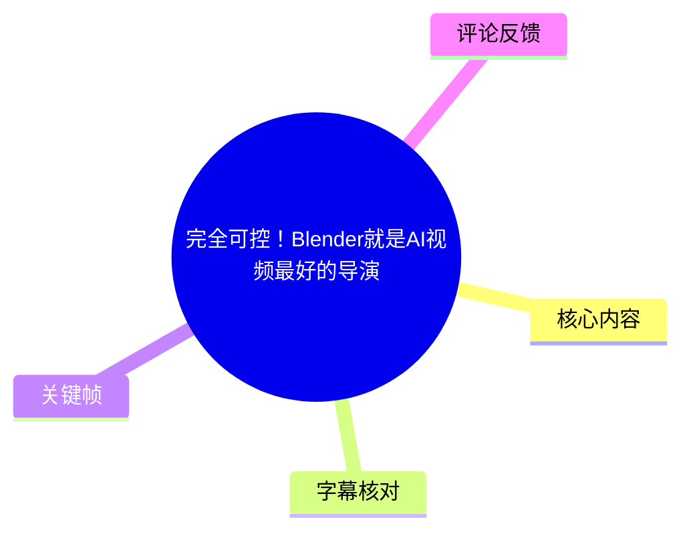
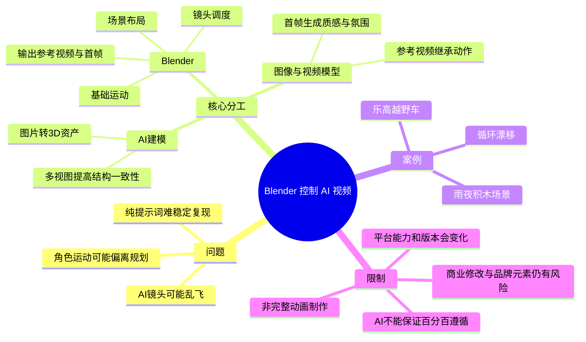
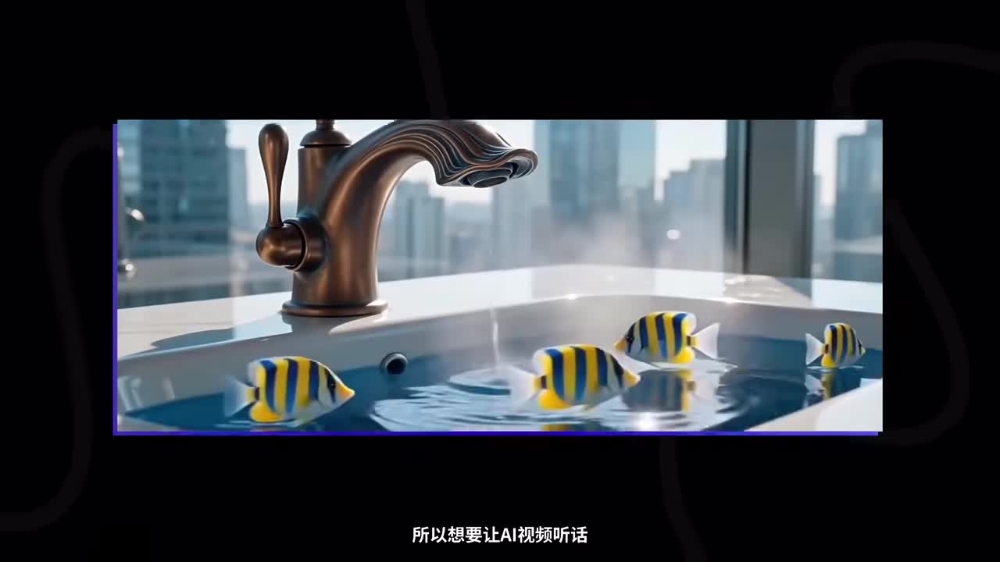
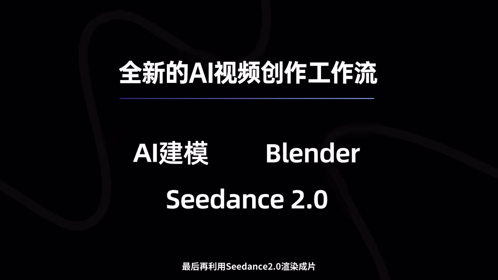
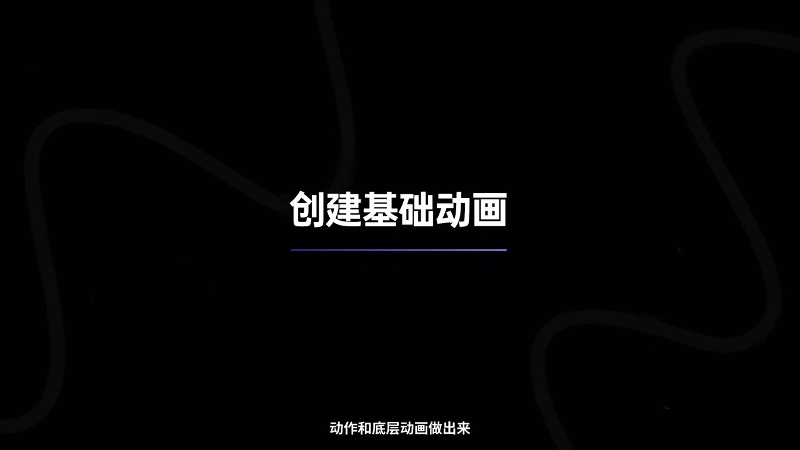

# 完全可控！Blender就是AI视频最好的导演

> 来源：[Bilibili 视频](https://www.bilibili.com/video/BV1sTKn6DEfd) 
> UP 主：太阳鸽鸽棒｜发布时间：2026-07-18｜视频时长：05:46｜分辨率：3840×2160  
> 视频简介：通过「AI 建模 + Blender + image2 + Seedance 2.0」实现 AI 视频的运动控制。

## 小结

视频提出了一条以 **Blender 充当前期“控制层”** 的 AI 视频工作流：先准备故事、角色与场景素材，再通过 AI 建模将关键对象转为 3D 资产；在 Blender 中只制作场景摆放、镜头调度和基础运动；随后把 Blender 输出的运动参考视频与首帧图交给生图、生视频模型，生成具有指定氛围与质感的最终成片。

作者要解决的核心问题不是“如何让 AI 视频更好看”，而是如何减少镜头乱飞、人物不按规划移动等失控现象。其思路是把对**构图、机位、运动路径、物体位置**的控制前置到 Blender，而把材质、灯光、细节动作与画面质感交给后续模型补全。

实践案例是一辆乐高风格越野车：使用多视图素材生成 3D 模型，导入 Blender 后制作循环漂移动画；导出低成本的预览视频与单独的第一帧图；再以车的多视图、Blender 首帧和提示词生成“雨夜积木场景”的高质感静帧；最后让生成图参考 Blender 视频的动作，获得成片。

这是一条“**控制与表现拆分**”的流程，而非完整替代三维动画制作：Blender 负责运动设计与镜头约束，AI 模型负责视觉重绘。作者明确建议基础动画不必完成所有动作及底层动画，达到可供视频模型参考的程度即可停止。

视频中的平台、模型版本、界面按钮和能力具有较强时效性。尤其是 ASR 中出现的 N4D／Neural4D、Image 2、Seedance 2.0，以及“后期会上 2.5 新版本”等说法，均为作者录制时的陈述，不能视为当前仍可用、价格不变或效果一致的保证。评论区也提出了商用修改 Logo、材质灯光投入与制作速度之间的现实限制。

## 思维导图

## 目录

- [背景：为什么要用 Blender 控制 AI 视频](#背景为什么要用-blender-控制-ai-视频)
- [完整工作流：从脚本到成片](#完整工作流从脚本到成片)
- [实操：AI 建模与 Blender 基础动画](#实操ai-建模与-blender-基础动画)
- [导出参考视频与关键首帧](#导出参考视频与关键首帧)
- [生成最终画面与视频](#生成最终画面与视频)
- [经验、限制与时效性](#经验限制与时效性)
- [字幕比对](#字幕比对)
- [评论分析](#评论分析)
- [处理记录](#处理记录)

## 背景：为什么要用 Blender 控制 AI 视频 [00:25](https://www.bilibili.com/video/BV1sTKn6DEfd?t=25)

作者以 AI 视频的“听话程度”为切入点：当创作者要求低机位推进时，模型可能给出不受控的飞行镜头；当要求角色沿既定路线移动时，生成结果也可能频繁偏离计划。这里的“失控”主要指镜头语言与空间运动不稳定，而不是单纯的画面美术质量不足。

作者的解决方案是将 Blender 作为前期控制工具。视频给出的理由包括：

1. **开源、免费**：作者将其作为 Blender 的使用门槛优势提出。
2. **动画可控性高**：镜头、物体、角色的位移和场景关系可在三维空间内明确布置。
3. **适合充当前置约束**：先让 Blender 确定“怎么动、从哪里拍、物体在哪里”，再让生成模型完成视觉化。
4. **与 AI 建模平台互补**：传统建模与关键帧动画耗时，因此用 AI 建模降低资产生产成本。

> 图：画面以水槽、鱼与水龙头构成示例，并配有“所以想要让 AI 视频听话”的字幕。这张关键帧用于说明视频开场的问题意识：作者关注的是对生成画面与运动结果的控制，而非只讨论静态画质。

## 完整工作流：从脚本到成片 [00:26](https://www.bilibili.com/video/BV1sTKn6DEfd?t=26)

作者将流程概括为：

> **AI 建模 → Blender 简易镜头动画 → Seedance 2.0 渲染成片**

> 图：画面直接列出“AI 建模、Blender、Seedance 2.0”，是视频方法链路最清晰的总览。它说明 Blender 位于资产生产和最终视频生成之间，承担运动控制与预演职责。

### 1. 前期：脚本、人物与场景设定 [00:51](https://www.bilibili.com/video/BV1sTKn6DEfd?t=51)

在做一段 AI 视频之前，作者建议先准备：

- 故事脚本；
- 人物设定；
- 场景设定；
- 对应的图像素材。

视频称可使用类似 Neural4D（ASR 多处识别为“N4D”或“NCD”）的一站式创意平台创建图像素材，并使用“Image 2”或“香蕉模型”维持人物、场景的一致性。由于站内无字幕、ASR 对产品名存在明显误识别，本文保留作者可辨识的工具名称，不将具体模型能力扩展为已验证事实。

### 2. 中期：Blender 制作白模与镜头调度 [01:15](https://www.bilibili.com/video/BV1sTKn6DEfd?t=75)

准备好素材后，进入作者认为“最重要”的环节：在 Blender 内制作整体场景和镜头调度。

这里的“白模”指不追求最终材质、灯光、细节的基础三维场景。其目标是先将想表达的镜头用空间关系描述出来，例如：

- 镜头放在哪里；
- 摄像机如何推进、环绕或跟随；
- 人物、车辆等主体如何位移；
- 场景发生哪些简单变化。

作者认为，这种先在 Blender 中表达镜头的方式能提高后续成片成功率。

> 图：Blender 标识配合“利用 Blender 去做出整体的场景以及镜头调度了”的字幕，直接对应本流程中的控制环节。它强调 Blender 不是最终质感渲染器，而是镜头与空间关系的设计器。

### 3. 基础动画只做“够用的参考” [01:39](https://www.bilibili.com/video/BV1sTKn6DEfd?t=99)

作者特别强调：当前阶段**不需要完成所有动作和底层动画**。传统建模与关键帧动画较耗时，工作流的目的正是避免在参考阶段投入完整动画制作成本。

需优先完成的内容是：

- 基本镜头调度；
- 主体或人物位移；
- 场景的简易变化；
- 可被后续视频模型理解的运动节奏。

之后再通过视频模型提示词丰富动作表现。换言之，Blender 输出在本流程中是“运动参考视频”，不是最终 CG 成片。

> 图：标题“创建基础动画”明确了该阶段的边界。它帮助区分“可控预演”与“完整高质量三维动画”两种不同目标，避免误以为必须在 Blender 中做完全部动作。

## 实操：AI 建模与 Blender 基础动画 [02:03](https://www.bilibili.com/video/BV1sTKn6DEfd?t=123)

### 步骤 1：将已有图像转换为 3D 资产 [02:03](https://www.bilibili.com/video/BV1sTKn6DEfd?t=123)

作者已提前在平台生成案例素材，接着使用平台的 AI 建模功能将图像转为 3D 资产。视频中的操作描述为：

1. 进入平台首页的模型页面；
2. 上传图像；
3. 点击生成；
4. 检查生成结果；
5. 下载模型文件。

作者评价生成效果“不错”、费用“不高”，但没有给出具体价格、计费单位、生成时长、面数、纹理分辨率或可用格式范围；这些均不能从本视频确认。

### 步骤 2：优先使用多视图生成 [02:27](https://www.bilibili.com/video/BV1sTKn6DEfd?t=147)

作者建议使用**多视图模式**生成模型，因为多视图结果会更符合原始设定的结构。案例素材被描述为标准“三视图”，因此可逐一上传对应视角。

视频案例的对象是乐高风格越野车。作者认为生成的模型较好还原了车辆设计。这里的结论属于作者对该案例效果的展示，不代表任意素材都能获得同等结构准确度。

### 步骤 3：下载并导入 Blender [02:51](https://www.bilibili.com/video/BV1sTKn6DEfd?t=171)

ASR 将格式多次识别为“JRB／JRb”。结合三维资产导入的上下文，它**可能**是指 `.glb` 格式，但原始音频转写无法可靠确认，且提供的关键帧不含该界面，因此不能把此处格式校正为确定事实。

可确认的操作逻辑是：

1. 在右侧模型卡片上选择下载；
2. 在 Blender 顶部菜单进入“文件”；
3. 使用“导入”导入下载的三维模型；
4. 模型进入 Blender 场景；
5. 在 Blender 中继续做创意编辑。

> 注意：如果实际使用 Blender，导入格式必须与平台导出的真实文件扩展名一致；请以下载文件名与 Blender 当前版本的导入器列表为准。

### 步骤 4：创建可循环的车辆运动 [03:15](https://www.bilibili.com/video/BV1sTKn6DEfd?t=195)

案例中，作者为车辆制作了一个“无限漂移”的循环动画场景。作者并未展示完整的关键帧数值、帧率、时间轴长度、曲线编辑方式、物理参数或循环节点设置，因此这些参数无法复原。

可以迁移的操作原则是：

- 用 Blender 制作后续模型必须遵循的主体运动；
- 将镜头运动同步纳入预演；
- 只做能表达运动意图的简化版本；
- 当参考效果已足够时停止，而非无限完善动画。

## 导出参考视频与关键首帧 [03:39](https://www.bilibili.com/video/BV1sTKn6DEfd?t=219)

作者认为此阶段不必处理场景材质、光照等最终渲染工作，因为这些可交由后续 AI 完成。要导出的关键素材有两个：

1. **Blender 渲染或预览得到的参考视频**：提供镜头运动、物体位移和构图变化。
2. **第一帧单独保存的静态图片**：提供后续生成最终氛围、质感与构图的基础。

视频描述的 Blender 操作包括：

1. 设置导出视频路径与格式；
2. 在输出设置中选择视频类型；
3. ASR 将格式说成“MPG4”，依上下文很可能是在指 MPEG-4 一类视频封装，但无法从素材确认具体选项文字；
4. 在摄像机视图的“视图”菜单中选择“渲染播放预览”；
5. 将预览画面渲染为视频；
6. 视频完成后回到第一帧；
7. 单独保存第一帧图像。

### 为什么第一帧不能省略 [04:03](https://www.bilibili.com/video/BV1sTKn6DEfd?t=243)

作者明确称第一帧“非常重要”，是后续构建整体场景氛围与质感的关键。其工作机制可以按视频逻辑理解为：

- **视频**约束“怎么动”；
- **第一帧**约束“从什么构图与视觉状态开始”；
- **多视图资产图**继续约束核心对象的造型；
- **提示词**补充场景语义、天气、材质与美术方向。

这并不意味着模型一定能严格保持所有细节；视频展示的是一种通过多重参考提高控制力的方法。

## 生成最终画面与视频 [04:03](https://www.bilibili.com/video/BV1sTKn6DEfd?t=243)

### 步骤 5：先生成高质感的目标首帧 [04:03](https://www.bilibili.com/video/BV1sTKn6DEfd?t=243)

完成 Blender 工作后，作者返回 N4D 首页，将以下素材上传到生图界面：

- Blender 输出的第一帧图片；
- 汽车的三视图。

目标是让生图模型参考车辆造型与场景构图，生成最终会被用于视频的画面。

案例提示意图为：让乐高越野车在雨夜行驶在由积木构成的场景中。作者展示的结果被评价为较好参考了汽车造型和场景构图，并生成更具质感的画面。视频未提供可复制的完整提示词文本、负面提示词、种子值、采样参数或生成尺寸，因此无法据此复现同一张图。

### 步骤 6：图像参考视频运动，生成成片 [04:52](https://www.bilibili.com/video/BV1sTKn6DEfd?t=292)

最后在“即梦平台”或 N4D 视频工作台中：

1. 上传生成好的图片；
2. 上传 Blender 导出的参考视频；
3. 设置“图像 1 参考视频 1 的运动”；
4. 选择作者口述为“全能参考模式”的选项；
5. 生成最终视频。

作者对“全能参考模式”的解释是：让参考图使用参考视频的动作。按照视频方法，图像负责最终视觉风格和对象外观，参考视频负责运动轨迹与镜头节奏。

作者将结果描述为“百分百可控”的高质量场景动画；这一表述应理解为视频作者的推广性总结，而非可由素材独立验证的技术承诺。生成式视频仍可能出现主体变形、细节漂移、Logo 或文字不稳定、运动理解偏差等风险，视频本身也没有提供多轮成功率或失败案例。

### 资产复用价值 [05:17](https://www.bilibili.com/video/BV1sTKn6DEfd?t=317)

作者指出，保留 Blender 资产后，下次可以替换素材并制作相同场景，较为方便。可迁移的经验包括：

- 保留 `.blend` 场景、相机动画和主体运动轨迹；
- 将“镜头控制资产”与“最终美术素材”分离；
- 针对同一镜头结构更换角色、车辆或主题时，可复用 Blender 内的调度；
- 每次换主体时仍应重新检查比例、碰撞关系、遮挡与参考图一致性。

## 经验、限制与时效性 [05:17](https://www.bilibili.com/video/BV1sTKn6DEfd?t=317)

### 可迁移经验

| 环节 | 应控制的内容 | 可交给后续模型补全的内容 |
| --- | --- | --- |
| 图像与多视图素材 | 主体外形、角色/车辆一致性、基本设定 | 最终场景细节不一定要在前期完成 |
| AI 建模 | 资产可用性、基础几何结构 | 复杂拓扑、精确机械结构是否合格需自行验证 |
| Blender | 构图、镜头、物体位置、主体运动、场景节奏 | 高精度材质、复杂灯光、完整细节动画 |
| 生图 | 氛围、天气、材质、目标首帧视觉效果 | 不能替代对关键对象结构的持续检查 |
| 生视频 | 依据参考视频继承运动 | 不能假定每次均严格执行参考或保持品牌细节 |

### 视频未提供或未验证的内容

- 未提供 AI 建模平台的具体成本、套餐、生成次数或版权条款。
- 未提供模型面数、贴图质量、骨骼、绑定、UV、拓扑与 Blender 兼容性的测试结果。
- 未提供 Blender 版本、帧率、分辨率、编码参数、动画总帧数及渲染耗时。
- 未提供 Seedance 2.0 的可用地区、价格、队列时间、最大时长或参考素材限制。
- 未提供“全能参考模式”的准确界面名称与全部参数。
- 未展示复杂人物互动、长镜头连续性、文字、Logo、产品商标等高难度商用场景。

### 时效性说明

视频元数据的发布时间为 2026-07-18。作者在约 [01:39](https://www.bilibili.com/video/BV1sTKn6DEfd?t=99) 处提到平台支持使用 Seedance 2.0，并称后续会有 2.5 新版本；这属于录制时信息。AI 模型名称、版本号、入口位置、参考模式、价格与输出质量都可能在发布后变动，实际操作前应以相应平台当前页面、服务协议和导出格式为准。

## 字幕比对

| 字幕来源 | 完整性 | 专有名词 | 时间轴 | 主要问题 |
| --- | --- | --- | --- | --- |
| Bilibili 站内字幕 | 未提供可用字幕，无法比较文本内容 | 无法核验 | 无可用时间轴 | 素材明确标注“未提供可用站内字幕” |
| 本次 ASR 字幕 | 覆盖 25.08–345.90 秒；诊断语音覆盖率为 92.74% | 存在多处误识别或不稳定转写 | 有 15 段真实 SRT 时间戳，可用于章节定位 | 多个长段落缺少断句；平台名、模型名、格式名误识别较多 |

### 最终字幕选择与校正原则

本次未提供可用站内字幕，因此正文采用带真实时间戳的本次 ASR SRT 作为时间轴依据。ASR 诊断显示：

- 识别语言：中文；
- 模型：`medium`；
- 设备：CUDA；
- 计算精度：float16；
- 音频时长：345.92 秒；
- 首段语音：25.08 秒；
- 末段语音：345.90 秒；
- `noAudioStream=true` 未出现，说明素材并未标记为“源视频没有音轨”。

对 ASR 的校正遵循“上下文可支持才校正、无法确认则保留不确定性”的原则：

| ASR 文本 | 正文处理 | 依据与说明 |
| --- | --- | --- |
| “Cdance 2.0”“SD2.0” | 统一记为 Seedance 2.0，并标明来自视频流程总览 | 关键帧 `frame-002.jpg` 画面清晰显示“Seedance 2.0” |
| “Neuro 4D”“N4D”“NCD” | 记作 Neural4D／N4D，并提示 ASR 不稳定 | 视频标签含“Neural4D”“N4D”；无法从现有素材确认平台官方当前名称 |
| “白魔” | 按语境写作“白模” | 与 Blender 场景预演、材质灯光暂不处理的上下文一致 |
| “标准30图” | 写作“三视图”，并保留其为语境校正 | 后文明确提到上传“汽车的三视图” |
| “JRB／JRb” | 不确认为具体格式；提示可能是 `.glb` | ASR 不可靠，提供关键帧未展示导出界面；不以推测替代事实 |
| “MPG4” | 不确认为具体菜单名；描述为视频格式/封装选项 | ASR 不能可靠区分 MPEG-4 等具体术语 |

## 评论分析

以下仅分析可获取的热评前三条，评论内容是用户观点，不构成已验证事实。

1. **@4566691（6 赞）**  
   观点是对 AI 工具进入工作流后的负担表达不满：创作者仍需投入大量时间写提示词、修复 AI 错误，而管理者可能据此要求提高产出。该评论补充了视频未展开的组织管理问题——“工具提效”不等于“个人实际工作量下降”。其“提效 200%”属于调侃式自述，无法从评论验证。

2. **@王普拉斯（26 赞）**  
   评论认为，当动画已经做到一定程度后，再补材质和灯光未必困难；同时指出商单中若客户要求修改车标、Logo 等品牌元素，AI 视频的不稳定性会带来返工风险。该观点直接挑战视频“把材质灯光交给 AI”的简化假设，也指出不同业务场景有不同最优解：短剧可能更适合快速抽卡式生成，而精确改稿的商用项目仍可能不适配。此为经验判断，但与视频未展示 Logo 精修和多轮修改的限制相呼应。

3. **@空岛大空空（3 赞）**  
   评论以玩笑方式指出：当一位创作者搭完一个镜头时，另一位可能已完成 5 分钟视频。它反映了这条流程的代价——前期三维镜头搭建提高可控性，但也可能牺牲即时生成速度。该说法没有给出项目复杂度、人员规模或质量标准，不能用于量化比较，只能作为“控制力与速度存在权衡”的提醒。

## 处理记录

- Worker ID：`worker-mrj0wjed-b0c290ad`
- 模型：`gpt-5.6-terra`
- ASR 模型与运行信息：`medium`／中文识别／CUDA／float16；ASR 带时间戳。
- 使用的素材工具：视频元数据、ASR SRT 与 ASR 分段诊断、关键帧、热评前三条。
- 字幕选择：站内字幕未提供可用版本；已检查本次 ASR，采用其 SRT 的真实起止时间生成时间轴。未见 `noAudioStream=true` 标记。
- 关键帧选择依据：
  - `frames/frame-001.jpg`：用于开场“AI 视频需要听话”的问题背景；
  - `frames/frame-002.jpg`：直接展示“AI 建模—Blender—Seedance 2.0”全流程；
  - `frames/frame-003.jpg`：对应 Blender 的场景与镜头调度职责；
  - `frames/frame-004.jpg`：对应“创建基础动画”及“只做够用参考”的方法边界。
- 缓存清理：素材中未提供缓存清理执行记录；本文不虚构清理结果。
- 未解决问题：
  - 无站内字幕，无法以官方字幕复核全部专有名词；
  - ASR 对 N4D、文件格式、输出选项存在歧义；
  - 关键帧未包含平台完整操作界面、提示词全文和 Blender 参数面板；
  - 视频未给出可复现的项目文件、具体模型参数与商用授权信息。
