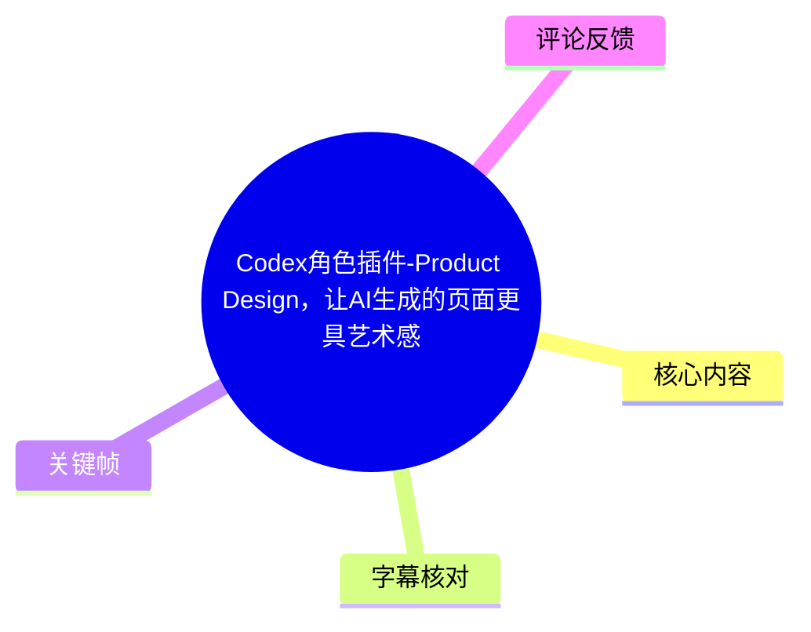
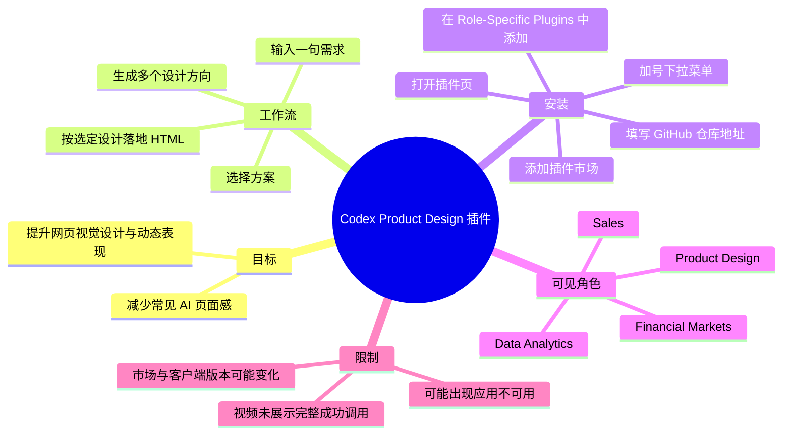
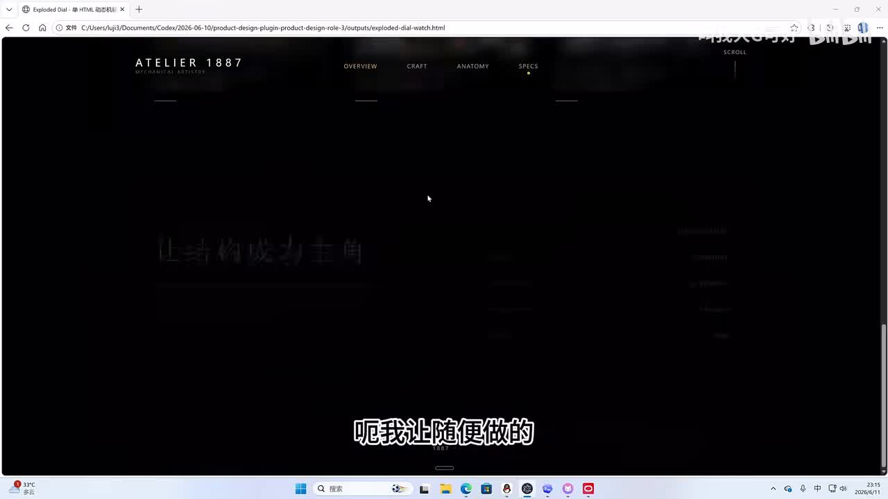
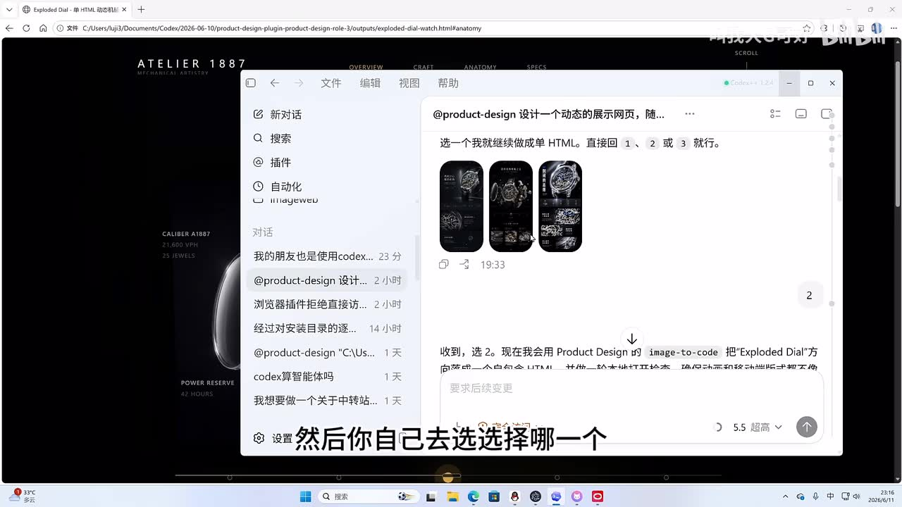
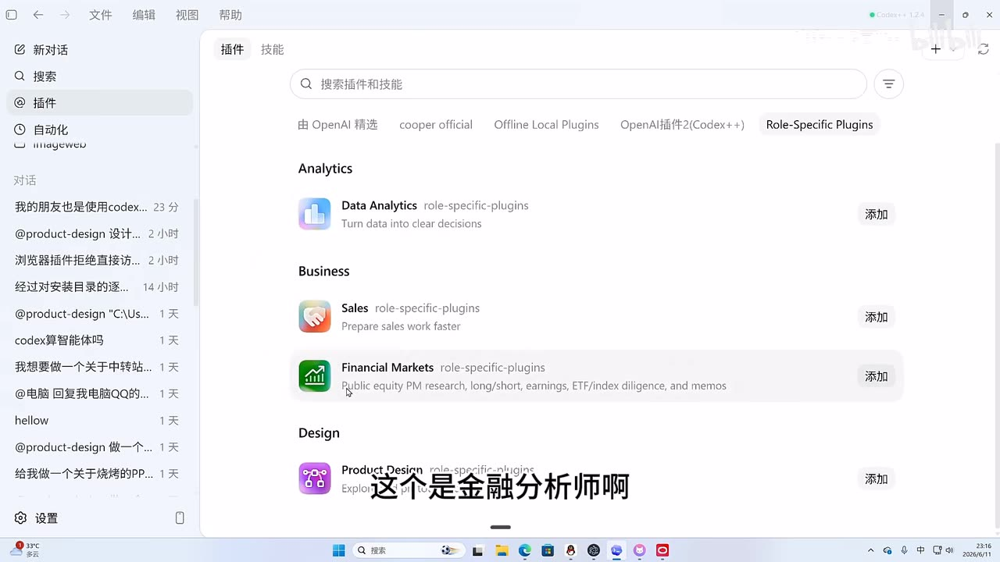
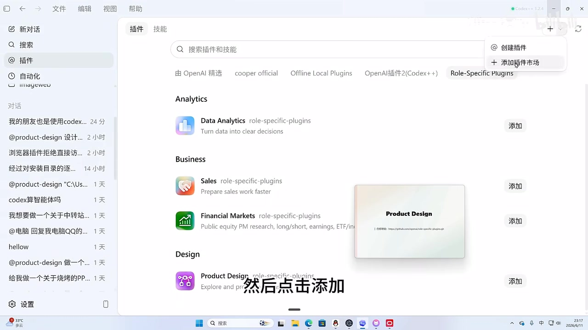
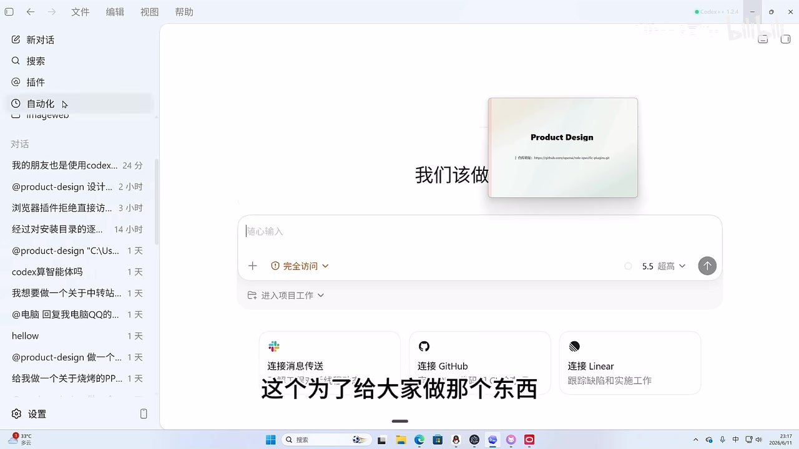

# Codex角色插件-Product Design，让AI生成的页面更具艺术感

> 来源：[Bilibili 视频](https://www.bilibili.com/video/BV1msEC6SEts)<br>
> UP 主：叫我大G可好｜发布时间：2026-06-11｜视频时长：02:28｜分辨率：1920×1080

## 小结

视频介绍了 Codex 中的角色插件（Role-Specific Plugins）之一：**Product Design**。UP 主的核心观点是：在让 AI 生成网页时，使用该设计角色插件，可使结果更偏向有明确视觉语言和动态表达的设计稿，减少常见的“大方框、磨玻璃”式 AI 页面观感。

演示中，Product Design 会先根据一句自然语言需求产出多个设计方案供用户选择；用户选定某个方案后，再让 AI 按该设计方向继续落地为 HTML。这个流程的重点不是直接保证一次生成最终页面，而是先通过候选设计图建立视觉方向，再继续实现。

视频主要解决一个实际安装问题：许多用户可能在 Codex 的插件列表中找不到该角色插件。UP 主给出的做法是，手动添加插件市场仓库：

```text
https://github.com/openai/role-specific-plugins.git
```

操作入口为插件页右上角的加号下拉菜单，选择“添加插件市场”，填入仓库地址后添加市场；随后在出现的 `Role-Specific Plugins` 市场中找到 `Product Design` 并点击“添加”。

该视频是简短界面演示，未展示完整安装成功后的实际调用、权限提示处理、版本兼容性或失败排查。评论中已有用户反馈“仓库安装成功，但插件安装时提示应用不可用”，说明“添加市场成功”并不等同于“插件一定可安装和可运行”。插件市场、Codex 客户端版本和可用性均可能随时间变化，应以实际界面和报错信息为准。

## 思维导图





## 目录

- [背景：用设计角色降低“AI 味”](#背景用设计角色降低ai味)
- [演示：先出设计方案，再落地 HTML](#演示先出设计方案再落地-html)
- [插件市场与可见角色](#插件市场与可见角色)
- [安装步骤：手动添加 Role-Specific Plugins 市场](#安装步骤手动添加-role-specific-plugins-市场)
- [调用方式与演示边界](#调用方式与演示边界)
- [关键参数、限制与时效性](#关键参数限制与时效性)
- [字幕比对](#字幕比对)
- [评论分析](#评论分析)
- [处理记录](#处理记录)

## 背景：用设计角色降低“AI 味” [00:00](https://www.bilibili.com/video/BV1msEC6SEts?t=0)

UP 主将 Product Design 定位为 Codex 的“设计师插件”或设计角色插件。其提出的问题是：直接让 AI 写网页时，结果容易形成较为模板化的视觉风格，例如大面积规则方框和磨玻璃效果；该插件的作用是帮助设计“脱离 AI 的味道”。

这里的“脱离 AI 味”是视频中的主观设计判断，并非可量化的性能指标。视频展示的依据主要是一个生成网页样例：深色机械腕表主题页面具有大幅留白、细小导航、产品参数文字与较强的视觉层次，并包含可移动的交互/动态元素。视频没有给出设计评分、代码体积、生成耗时或与未使用插件时的对照实验。



> 图：该帧显示浏览器中的深色产品展示页，页面包含 “ATELIER 1887” 标识、顶部导航及腕表视觉元素。它是视频用来说明“更具设计感”的主要样例，但只能证明演示效果，不能单独证明插件对所有提示词都能稳定获得同类质量。

## 演示：先出设计方案，再落地 HTML [00:20](https://www.bilibili.com/video/BV1msEC6SEts?t=20)

视频展示的使用逻辑可概括为“两阶段”：

1. 用户向 Product Design 输入一句关于网页设计的自然语言需求。
2. 插件先生成多个设计图/设计方向。
3. 用户从候选方案中选择一个。
4. AI 再依据选中的设计图，将方案继续实现为 HTML 页面。

从画面可见，Codex 对话中使用了 `@product-design`。回复提示用户“选一个我就继续做成单 HTML”，并给出编号为 `1`、`2`、`3` 的三张候选设计图。随后对话显示已选择“2”，并出现继续用 Product Design 及 `image-to-code` 将所选方向落地的上下文。



> 图：该帧直接展示 `@product-design` 的候选方案选择环节，三个手机比例的设计缩略图以及“直接回 1、2 或 3”的提示，说明视频强调的是“先选设计方向、后实现”的工作流，而非让模型无中间确认地直接写页面。

### 这一流程的经验价值

- **把视觉决策前置**：先比较候选方向，可避免在一份已生成的完整页面代码上反复修改整体风格。
- **明确人机分工**：AI 负责生成候选视觉方案与后续实现；用户负责确认更符合目标的方案。
- **适合早期探索**：当需求仅有一句描述、但尚未确定视觉方向时，这种多方案选择比直接要求输出最终代码更有帮助。

### 视频未说明的部分

视频没有说明候选图是否可编辑、是否能指定固定品牌规范、每次固定生成几种方案、图片生成与 HTML 转换是否依赖额外能力，也没有展示从选中方案到最终 HTML 的完整代码和运行结果。因此，上述工作流应理解为演示中的操作思路，而不是已被视频完整验证的通用交付流程。

## 插件市场与可见角色 [00:40](https://www.bilibili.com/video/BV1msEC6SEts?t=40)

UP 主指出，Codex 近期增加了不少角色插件，并在界面中展示了名为 `Role-Specific Plugins` 的插件市场标签。画面中能看到以下分类及角色：

| 分类 | 画面中可见的角色 | 画面中可见说明 |
| --- | --- | --- |
| Analytics | `Data Analytics` | “Turn data into clear decisions” |
| Business | `Sales` | “Prepare sales work faster” |
| Business | `Financial Markets` | 涉及公开股票、研究、财报、ETF/指数尽调与备忘录等英文说明 |
| Design | `Product Design` | 设计类角色，视频主题插件 |

这些角色名称和说明来自视频画面；视频没有解释每个插件内部的提示词、工具权限、计费方式、适用模型或功能边界。UP 主提到用户可能找不到角色插件，随后将重点转向如何手动添加插件市场。



> 图：该帧显示 Codex 的插件页面，顶部已选中 `Role-Specific Plugins` 市场；列表中可见 Data Analytics、Sales、Financial Markets 与 Product Design，且每项右侧都有“添加”按钮。它有助于定位插件所在市场及确认 Product Design 并非普通对话中的固定命令。

## 安装步骤：手动添加 Role-Specific Plugins 市场 [01:05](https://www.bilibili.com/video/BV1msEC6SEts?t=65)

视频给出的安装方式是手动添加 GitHub 仓库作为插件市场。按演示顺序整理如下。

### 1. 准备仓库地址

视频描述与画面指向的仓库地址为：

```text
https://github.com/openai/role-specific-plugins.git
```

这是视频提供的插件市场来源地址。视频未展示仓库内容、分支、提交版本或校验方式，不能从素材中推断其具体文件结构。

### 2. 打开 Codex 的“插件”页面

在 Codex 左侧导航进入“插件”。视频中插件页面顶部除了“插件”外还可见“技能”标签；搜索框提示为“搜索插件和技能”。

### 3. 点击右上角加号的下拉菜单

注意不是只点击加号本体。UP 主演示的是点击加号旁的下拉区域，打开菜单后选择：

```text
添加插件市场
```



> 图：该帧清楚展示 `+` 按钮打开后的两个菜单项：“创建插件”与“添加插件市场”。它补足了文字说明中最关键的界面定位信息，避免误入“创建插件”流程。

### 4. 输入仓库地址并添加市场

在“添加插件市场”的输入界面填入前述 GitHub 地址，再点击“添加市场”。

视频说明，完成后插件页中会出现相应市场；UP 主的界面中已有多个自行添加的市场标签，`Role-Specific Plugins` 是其中之一。

### 5. 在市场内添加 Product Design

进入 `Role-Specific Plugins` 市场后，在 Design 分类定位 `Product Design`，点击其右侧的“添加”按钮完成安装。



> 图：该帧同时呈现 Role-Specific Plugins 标签、Product Design 条目和右侧“添加”按钮，并以画中画强调仓库地址。它连接了“添加市场”和“安装具体插件”两个容易混淆的步骤。

### 操作检查点

| 检查点 | 预期现象 | 视频能否验证 |
| --- | --- | --- |
| 成功添加市场 | 插件页出现新的市场标签/内容 | 可从 UP 主界面间接看到 |
| 找到目标插件 | 在 Design 分类看到 `Product Design` | 可验证 |
| 成功安装插件 | Product Design 的状态变更或可用 | 视频未完整展示 |
| 对话中可调用 | 加号或可用插件列表中出现插件 | UP 主口述说明，未展示完整成功状态 |
| 生成并落地网页 | 选择方案后继续实现 HTML | 展示了部分对话与网页示例，未展示全流程代码 |

## 调用方式与演示边界 [01:55](https://www.bilibili.com/video/BV1msEC6SEts?t=115)

UP 主说明，正常对话时可以点击对话区域的加号，从“可用的插件”中点击使用相应插件。其口述还提到，自己的插件刚刚为录制演示而卸载，因此当前画面没有完整展示已安装插件在加号菜单中的实际选项。

结合前段画面，视频至少展示了两种与插件有关的触发方式：

- 在对话中以 `@product-design` 指定 Product Design；
- 在普通对话界面点击加号，从可用插件中选择使用。

但视频没有明确说明这两种方式是否完全等价、是否都必须先安装插件、是否需要重启 Codex 或刷新插件页，也没有给出插件的参数面板、系统提示词或调用限制。因此，实际使用时应优先以本机 Codex 客户端显示的可用入口为准。

## 关键参数、限制与时效性 [02:15](https://www.bilibili.com/video/BV1msEC6SEts?t=135)

### 视频中可确认的关键参数

| 项目 | 内容 |
| --- | --- |
| 视频时长 | 148 秒 |
| 目标工具 | Codex |
| 插件/角色名称 | `Product Design` |
| 插件市场名称 | `Role-Specific Plugins` |
| 市场仓库地址 | `https://github.com/openai/role-specific-plugins.git` |
| 演示调用标记 | `@product-design` |
| 方案选择形式 | 画面中为 1、2、3 三个候选项 |
| 后续实现形式 | 按 UP 主说法，基于选中的设计图落地；画面提到单 HTML 和 `image-to-code` |

### 使用限制与风险

1. **市场可添加不代表插件可安装。**  
   热评中已有“仓库安装成功，但插件提示应用不可用”的反馈；这只是用户反馈，未在视频中复现和验证，但足以提示兼容性风险。

2. **演示不构成质量保证。**  
   视频展示的是一个成功网页样例，未提供不同提示词、不同项目类型、不同模型或未使用插件时的对照，因此不能推导出所有页面都会“更具艺术感”。

3. **“设计图”到“HTML”的实现细节未展示。**  
   页面响应式、可访问性、真实数据接入、组件化、浏览器兼容性和生产部署均不在视频覆盖范围内。

4. **客户端版本及市场状态可能变化。**  
   画面右上角可见 Codex 版本标识，但 ASR 无法可靠识别完整版本号；菜单名称、市场可访问性、插件条目和安装权限可能在视频发布后调整。

5. **仓库来源需要自行审查。**  
   视频给出的是 GitHub 仓库地址，但未展示安全审查、插件源码审计或权限说明。将外部市场接入本地工具前，应自行确认仓库来源、内容和组织策略。

## 字幕比对 [02:20](https://www.bilibili.com/video/BV1msEC6SEts?t=140)

本次任务已执行 ASR；未提供可用的 Bilibili 站内字幕，因此正文以 ASR 为基础，并根据关键帧中的界面文字、视频标题和元数据进行有限校正。

| 字幕来源 | 完整性 | 专有名词 | 时间轴 | 主要问题 |
| --- | --- | --- | --- | --- |
| Bilibili 站内字幕 | 未提供可用字幕 | 无法评估 | 无法评估 | 无可比较的站内字幕内容 |
| 本次 ASR 字幕 | 覆盖全片主要口述内容，但无逐句时间戳 | 存在识别误差 | 素材仅提供整段文本，章节时间为结合视频时长与关键帧估计 | “Codex”多次识别为“CodeS”或“Codec”；“角色插件”有误识别；“仓库地址”等语句存在重复、断句和同音错误 |

### 最终字幕选择与校正

- **最终采用**：本次 ASR 字幕，辅以关键帧、标题、视频描述和 UI 文字校正。
- **已校正的核心词**：
  - `CodeS`、`Codec` → **Codex**
  - “角色插建” → **角色插件**
  - “设计图做好” → 结合画面整理为“先生成多个设计方案/设计图供选择”
  - “摄影图去落地” → 结合上下文整理为“根据选中的设计图继续落地”
- **保留不确定性**：ASR 中关于 Codex 具体版本、插件调用后的细节及部分菜单口述不够清晰，正文未据此补写未在画面或元数据中得到支持的配置内容。

## 评论分析 [02:23](https://www.bilibili.com/video/BV1msEC6SEts?t=143)

素材仅获取到 2 条热评，少于“热评前三条”的上限；以下仅分析可获取内容，不将评论视为已验证事实。

1. **一只干饭的筒**（点赞 0）  
   > “不行，仓库安装成功了，但是这个插件不让安装提示应用不可用”

   这条评论提供了最重要的失败案例：添加仓库市场成功后，具体插件仍可能无法安装，报错为“应用不可用”。它与视频“添加市场后即可添加安装”的简化流程形成补充，但没有附带客户端版本、操作系统、完整报错、网络环境或截图，无法判断是版本限制、地区/账户权限、市场更新还是临时服务问题。

2. **联通的三百块**（点赞 0）  
   > “谢谢up主的地址了[脱单doge]”

   该评论确认仓库地址是观众关注的实用信息，说明视频确实解决了部分用户“不知道市场地址”的问题。但评论没有说明是否已成功添加市场或安装插件，不能视为安装成功证明。

3. **第三条热评**  
   未获取到。素材中的热评列表仅含以上 2 条，故不补充或推测第三条内容。

## 评论分析

本次流程未获取到可用热评，因此不推断观众态度或额外结论。

## 处理记录

- **Worker ID**：worker-mrj0wjed-b0c290ad
- **模型**：gpt-5.6-terra
- **调用工具与素材**：基于任务提供的视频元数据、视频素材清单、ASR 字幕、5 张关键帧、热评 JSON 与视频描述进行整理；本次未提供可用站内字幕。
- **使用的应用工具**：素材采集产物包括 `merged.mp4`、`audio/audio.wav`、`frames/`、`comments/comments.json`、`subtitles/` 与 `asr/`；正文仅引用已提供的帧路径和文本素材。
- **字幕选择**：站内字幕不可用；本次 ASR 已执行并作为主字幕来源。对 Codex、Product Design、Role-Specific Plugins、仓库地址等专有内容，以关键帧 UI、标题和描述交叉校正。
- **关键帧选择依据**：
  - `frame-001.jpg`：展示最终网页样例，支撑视频对视觉效果的说明；
  - `frame-002.jpg`：展示三方案选择流程，支撑“先设计、后落地”的工作流；
  - `frame-003.jpg`：展示角色插件市场及可见角色；
  - `frame-004.jpg`：展示“添加插件市场”准确入口；
  - `frame-005.jpg`：展示 Product Design 条目与“添加”按钮，连接市场添加和插件安装。
- **缓存清理**：未提供缓存清理执行日志；为避免编造，不声明已执行或未执行具体清理命令。
- **未解决问题**：未获得插件安装失败的完整报错与环境信息；未验证仓库当前可访问性、插件当前兼容的 Codex 版本、安装后的真实可用状态，以及从设计图到 HTML 的完整生成结果。
