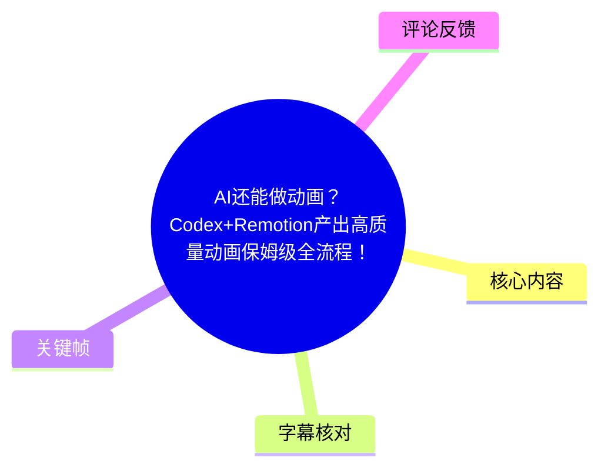
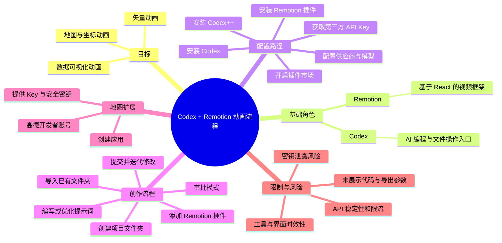
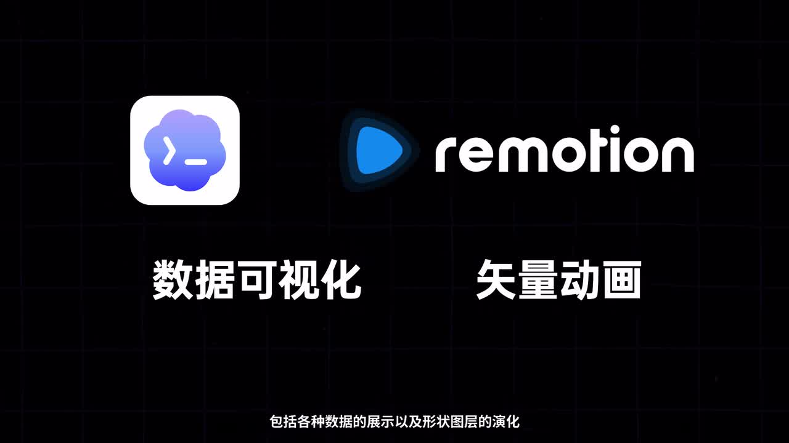
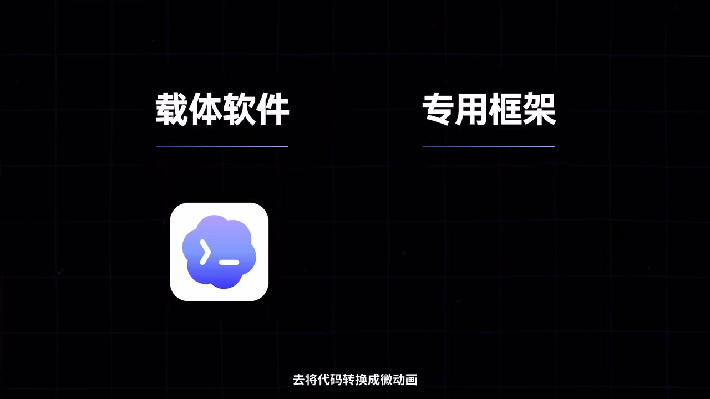
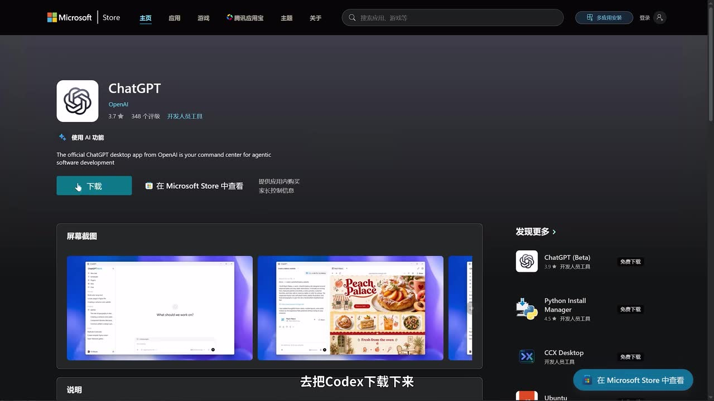
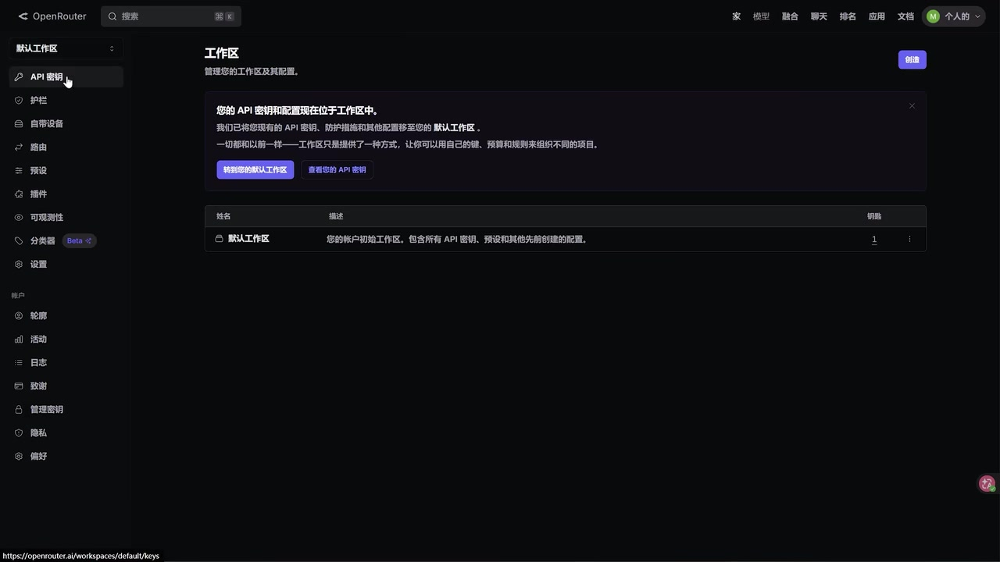

# AI还能做动画？Codex+Remotion产出高质量动画保姆级全流程！

> 来源：[Bilibili 视频](https://www.bilibili.com/video/BV16ZNW6JEup)  
> UP 主：太阳鸽鸽棒｜视频时长：7 分 31 秒（451 秒）｜合集：AIcode  
> 视频简介：从零开始使用 Codex 与 Remotion 制作数据可视化和矢量动画。  
> 数据抓取时间：2026-07-22；页面元数据中的发布时间戳为 `1783765800`，未提供明确时区。

## 小结

视频给出了一条以 **Codex 作为 AI 编程交互入口、Remotion 作为代码视频生成框架** 的动画制作路径。UP 主的核心观点是：对于数据展示、柱状图排名、形状图层演化、地图等偏矢量化的动画，可以让 AI 根据自然语言需求生成并修改 Remotion 项目，从而减少手动搭建图层、设置关键帧和处理坐标的工作量。

流程分为四层：安装并登录 Codex；在没有官方订阅的情况下，通过第三方 API 服务与 Codex++ 配置供应商；开启插件市场并安装 Remotion；在本地项目文件夹中，以文字需求驱动 AI 生成动画。视频示例是“美股 12 年最高市值公司排名动画”，但没有展示完整提示词、项目代码、渲染命令或最终导出参数。

地图动画是视频强调的扩展场景。UP 主称 Remotion 可协助处理地图数据与坐标相关工作，但前提是用户要额外提供地图接口的 API Key；视频以高德开放平台为例，称需将 Key 与安全密钥提供给 AI。此处存在明显的密钥安全与权限边界：不应在不受控对话、代码仓库或公开项目中暴露密钥。

本视频的重点不在 Remotion 的 React 编程原理，也没有覆盖数据来源校验、版权、商用许可、API 计费、渲染环境、失败排查等工程细节。因此它更适合作为“AI 驱动 Remotion 动画”的入门操作导航，而不能替代生产环境实施方案。

工具界面、插件市场策略、第三方 API 兼容性、Codex++ 的功能和高德接口政策均可能随版本变化。尤其视频中涉及“第三方 API 中转”“修改请求地址”“跳过登录”的做法，应在使用前自行核对相关软件、服务商与平台的最新条款、安全性及账号规则。

## 思维导图

## 目录

- [定位、原理与适用场景](#定位原理与适用场景-0026)
- [安装 Codex 与 API 登录路径](#安装-codex-与-api-登录路径-0114)
- [配置 Codex++、供应商和插件市场](#配置-codex供应商和插件市场-0250)
- [安装 Remotion 并创建项目](#安装-remotion-并创建项目-0426)
- [用提示词生成并迭代动画](#用提示词生成并迭代动画-0514)
- [地图动画：高德接口与密钥要求](#地图动画高德接口与密钥要求-0626)
- [完整操作清单与经验](#完整操作清单与经验-0114)
- [限制、风险与时效性](#限制风险与时效性-0714)
- [字幕比对](#字幕比对)
- [评论分析](#评论分析)
- [处理记录](#处理记录)

## 定位、原理与适用场景 [00:26](https://www.bilibili.com/video/BV16ZNW6JEup?t=26)

视频开场展示的是数据可视化动画与矢量动画效果，并提出“这些效果可以由纯 AI 生成”的创作方向。这里“纯 AI 生成”是视频作者对工作流自动化程度的表述；从后续演示看，用户仍需准备项目目录、配置模型/API、提交需求，并可能持续提出修改要求。

UP 主将方案拆成两个角色：

| 组成 | 视频中的定位 | 视频明确说明的能力 |
| --- | --- | --- |
| Codex | 与 AI 沟通、处理编程任务并操控本机文件的软件入口 | 根据文字要求执行创作相关工作 |
| Remotion | 将代码转化为动画的视频专用框架 | 允许使用 React 编写视频；由 AI 在底层调用以完成动画 |
| Codex++ | 配置第三方 API 请求地址、管理 Codex 启动与增强功能的工具 | 添加供应商、模型、开启插件市场、重启 Codex |

UP 主强调，普通使用者不必理解 Remotion 的底层原理，而是以“告诉 AI 想要什么效果”的方式，让 AI 调用 Remotion 完成生成和渲染。视频将其特别适用于以下类型：

- 数据展示，例如数据变化、排名和柱状图动画；
- 矢量化视觉效果；
- 形状和图层的演化动画；
- 需要坐标与地图数据的地图动画。

> 图：画面直接给出 Codex、Remotion、“数据可视化”“矢量动画”等关键词，是理解视频工具分工和目标产物的总览依据。

> 图：该帧以“载体软件 / 专用框架”的二分结构解释工作流：前者承担人与 AI 的交互，后者承担代码到动画的实现，帮助避免将 Codex 与 Remotion 视为同一类工具。

### 视频中的效率主张 [00:50](https://www.bilibili.com/video/BV16ZNW6JEup?t=50)

UP 主认为，借助 AI 控制 Remotion，可免去传统动画制作中大量“设置图层与关键帧”的操作。这是针对特定动画类型的经验判断，并不意味着所有动画都无需人工校正：

- 视频未展示复杂角色动画、逐帧手绘、音画同步或特效合成的效果；
- 未说明 AI 对数据错误、视觉重叠、字体缺失、溢出、时间轴节奏等问题的自动处理能力；
- 最终仍需要用户审阅输出，必要时通过补充需求继续修改。

## 安装 Codex 与 API 登录路径 [01:14](https://www.bilibili.com/video/BV16ZNW6JEup?t=74)

### 1. 下载和安装 Codex [01:14](https://www.bilibili.com/video/BV16ZNW6JEup?t=74)

视频建议先前往 Codex 官网下载并安装。UP 主称安装时“不用选择路径”，会自动安装；这是其演示环境下的说明，不应推导为所有操作系统和所有版本都没有安装选项。

安装完成后的登录分支是：

1. **有订阅会员**：可使用界面上方的会员登录入口。
2. **没有订阅会员**：视频转而介绍 API 登录路径，并以第三方 API 中转服务为例。

> 图：该帧显示的是 Microsoft Store 中的 ChatGPT 页面及“下载”按钮，能证明视频在此处确实展示了软件下载操作。与此同时，ASR 口述为“去把 Codex 下载下来”；画面与口述中的产品名称并不完全一致，不能仅凭该帧确认下载页对应的具体产品版本。

### 2. 创建第三方 API Key [01:37](https://www.bilibili.com/video/BV16ZNW6JEup?t=97)

视频称若采用 API 登录，可选择第三方中转 API 服务，并以 **OpenRouter** 为演示对象。ASR 多次误识别为“OpenRoot”或“OpenRout”，但关键帧页面左上角清晰显示为 **OpenRouter**，故本文按画面校正。

操作路径按视频陈述整理如下：

1. 登录 OpenRouter；
2. 点击右上角头像下的“工作区”；
3. 在左侧找到“API 密钥”；
4. 选择创建新密钥；
5. 填写密钥名称与限额；
6. 创建后保存 API Key。

视频特别提示：**API Key 仅显示一次**，因此应立即保存。更稳妥的实践是将密钥保存在密码管理器、系统环境变量或受权限保护的密钥管理服务中，而不是写入截图、聊天记录、公开仓库或前端代码。

> 图：画面左侧菜单中可见“API 密钥”，为视频所述“进入工作区后创建 API Key”的界面依据；它同时帮助将 ASR 中的“OpenRoot”校正为画面明确显示的 OpenRouter。

### 3. 为什么还需要 Codex++ [02:02](https://www.bilibili.com/video/BV16ZNW6JEup?t=122)

UP 主称，Codex 内置 API 登录默认只支持其官方 API Key，第三方服务的 Key 不能直接用于登录。因此，视频引入 Codex++，其目的是修改 API 请求地址，从而接入第三方供应商。

视频所述效果包括：

- 配置供应商与模型；
- 将供应商配置注入 Codex；
- 跳过登录页面并进入主界面；
- 强制开启插件相关选项。

这部分是整套方案中风险最高、时效性最强的一环。视频没有提供 Codex++ 的仓库地址、版本号、校验和、开源审计情况或服务条款依据，也没有展示第三方 API 的数据处理方式。使用前应自行确认：

- 工具来源是否可信、是否与当前系统及 Codex 版本兼容；
- API 请求是否会经过未知中间方；
- 供应商是否支持所选模型、计费方式和地区；
- 账户使用是否符合 Codex、模型服务商和中转服务商的条款；
- 是否存在将本地文件内容、源代码或密钥传送至第三方的风险。

## 配置 Codex++、供应商和插件市场 [02:50](https://www.bilibili.com/video/BV16ZNW6JEup?t=170)

### 1. 下载并安装 Codex++ [02:26](https://www.bilibili.com/video/BV16ZNW6JEup?t=146)

视频称 Codex++ 可在 GitHub 下载，免费使用。操作方式为在项目页面右侧找到 **Releases** 标签，进入对应版本下载页，然后按操作系统下载。例如 UP 主在 Windows 环境中选择 Windows 64 位 EXE 文件。

安装时，视频称用户可自行选择安装路径，软件会自动识别 Codex 的位置。由于未展示具体版本、系统要求和识别失败时的处理方法，以下事项在视频中未被验证：

- macOS、Linux 是否有等效版本；
- 是否支持 ARM 架构；
- Codex 未被识别时如何手动指定路径；
- 是否需要管理员权限；
- 是否需要重启系统或额外依赖。

### 2. 添加供应商并填写模型 [02:50](https://www.bilibili.com/video/BV16ZNW6JEup?t=170)

在 Codex++ 管理工具内，视频给出的配置步骤为：

1. 打开桌面上的 Codex++ 管理工具；
2. 进入设置；
3. 在左侧打开“供应商配置”；
4. 点击“添加供应商”；
5. 在顶部预设模板中选择 OpenRouter 模板；
6. 由模板自动填充服务地址；
7. 粘贴此前创建的 API Key；
8. 在模型列表中手动填写希望接入的模型名称；
9. 保存供应商配置；
10. 点击供应商右侧的“使用”按钮以启用。

UP 主不建议使用“从上游获取”模型列表，因为该操作会把站点支持的全部模型一次性导入，列表可能过多。替代方法是手动在输入框填写模型名称；如果不知道模型名，可在服务商的模型广场找到目标模型并复制名称后粘贴。

这一经验的可迁移点是：**只保留实际需要的模型，降低选择复杂度与配置噪声。** 但模型的确切 ID、可用区域、上下文长度、价格和能力都未在视频中给出，不能据此确定应填入何种模型。

### 3. 强制开启插件市场 [03:38](https://www.bilibili.com/video/BV16ZNW6JEup?t=218)

视频称在 API 模式登录 Codex 时，插件默认不会开启；而 Remotion 是后续所需插件，因此需前往左侧“Codex 增强”选项：

1. 选择右侧的“完整增强”；
2. 开启顶部的启用开关；
3. 确认包含“插件市场解锁”相关选项；
4. 根据个人需要调整下方的便利性功能。

此步骤的前提是 Codex++ 版本仍保留上述菜单和增强模式。界面命名可能随版本变动，若找不到对应入口，应以当前工具文档为准，而非盲目修改未知配置文件。

### 4. 从 Codex++ 重启 Codex，并检查登录状态 [04:02](https://www.bilibili.com/video/BV16ZNW6JEup?t=242)

视频提醒不要直接启动官方 Codex 软件，而应在 Codex++ 内点击右上角的“重启 Codex”按钮。按照 UP 主的说法，这会把供应商配置注入 Codex，并跳过登录页。

检查是否生效的方法：

- 左下角显示“通过 API 登录”；
- 右上角出现“Codex++”字样。

两项均出现时，UP 主将其作为配置成功的判断标准。这只适用于视频所演示的界面状态，不能替代真实的 API 调用测试。实践中还应通过一个低风险、无敏感文件的简单任务确认模型实际可用，并检查账单、网络请求与错误日志。

## 安装 Remotion 并创建项目 [04:26](https://www.bilibili.com/video/BV16ZNW6JEup?t=266)

### 1. 在插件市场安装 Remotion [04:26](https://www.bilibili.com/video/BV16ZNW6JEup?t=266)

由于前文已开启插件市场，视频中的安装过程较短：

1. 点击左侧顶部的“插件”；
2. 向下滚动，或搜索“Remotion”；
3. 找到 Remotion 插件并安装。

视频未给出插件发布者、版本号、权限范围、安装后的依赖安装过程，或插件是否会自动初始化 Node.js/React/Remotion 项目。对于生产或重要项目，建议先检查插件来源和权限，并在独立测试目录试运行。

### 2. 准备并导入专属项目文件夹 [04:50](https://www.bilibili.com/video/BV16ZNW6JEup?t=290)

UP 主将“创建项目目录”作为正式创作前的必要准备：

1. 在本机任意位置创建一个项目专属文件夹；
2. 在 Codex 左侧“项目”区域点击右侧加号；
3. 选择“使用现有文件”；
4. 指定刚创建的文件夹；
5. 让 Codex 在这个目录中工作。

这里的边界很重要：将 AI 限定在单独的项目目录，较直接打开个人主目录、工作盘根目录或包含凭据的代码仓库更可控。视频没有明说目录权限策略，但其“专属文件夹”做法有助于缩小 AI 可读写文件范围。

## 用提示词生成并迭代动画 [05:14](https://www.bilibili.com/video/BV16ZNW6JEup?t=314)

### 1. 首次使用选择“替我审批” [05:14](https://www.bilibili.com/video/BV16ZNW6JEup?t=314)

进入项目后，右侧输入框用于以文字与 AI 沟通。UP 主建议初次使用者将下方选项设为“替我审批”，理由是可以减少风险。

视频没有展开“审批”覆盖哪些操作，但合理的安全理解是：在 AI 创建、修改、删除文件，安装依赖，执行命令或访问外部资源前，应尽可能保留人工确认。不要因追求自动化而将执行权限无限制交给 AI。

### 2. 让 AI 优化创作需求 [05:14](https://www.bilibili.com/video/BV16ZNW6JEup?t=314)

UP 主的示例需求是生成一个“美股 12 年最高市值公司排名动画”，并先让 AI 优化提示词。AI 会输出更详细的提示词，用户确认满意后复制。

视频传达的提示词策略是：

- 先用自然语言描述目标；
- 不会写详细需求时，先让 AI 协助重写；
- 审阅 AI 生成的详细版本；
- 满意后将其作为正式任务提交。

不过，视频未展示优化后的完整文本。若自行实施，至少应在提示词中补充以下信息，避免 AI 自行猜测：

| 信息类别 | 建议明确的内容 |
| --- | --- |
| 数据 | 数据来源、时间范围、是否允许联网、数据校验规则 |
| 图表 | 柱状图/折线图/地图、排序规则、单位和标签 |
| 视觉 | 分辨率、配色、字体、主题、品牌元素 |
| 节奏 | 总时长、每个数据点停留时间、转场节奏 |
| 输出 | 视频格式、帧率、输出文件名和目录 |
| 约束 | 不删除已有文件、不提交敏感信息、执行前请求审批 |

### 3. 必须将 Remotion 插件附加到任务 [05:38](https://www.bilibili.com/video/BV16ZNW6JEup?t=338)

视频特别强调，不能只粘贴提示词；还要点击输入框下方的加号，**添加 Remotion 插件**，再粘贴经过优化的提示词。UP 主认为这是让 AI 使用该插件完成动画工作的关键步骤。

提交任务后，AI 会自动工作；视频称最后会将制作好的视频放到项目文件夹中。若效果不满意，则继续提出修改需求，直到达到预期。

### 4. 视频中实际展示到的交付边界 [06:02](https://www.bilibili.com/video/BV16ZNW6JEup?t=362)

UP 主展示了最终动画效果并评价“整体效果不错”，也说明可持续追加需求修改。视频的交付承诺可以概括为：

- 在项目文件夹中产出视频；
- 支持继续通过自然语言迭代；
- 不限于简单柱状图，也可以尝试其他动画效果。

但以下关键参数没有出现在素材中，本文不能补写：

- 实际生成的视频文件名和目录结构；
- 分辨率、帧率、编码格式、码率；
- 动画时长、渲染时长与硬件要求；
- 具体模型名称和 API 消耗；
- 提示词全文；
- Remotion 代码、依赖版本与渲染命令；
- 对“美股 12 年最高市值”数据来源、口径、准确性的验证结果。

## 地图动画：高德接口与密钥要求 [06:26](https://www.bilibili.com/video/BV16ZNW6JEup?t=386)

UP 主将地图动画作为 Remotion 的复杂场景示例：过去制作地图或坐标类动画，需要自己寻找数据并处理坐标；使用 Remotion 后，这些工作可以由 AI 协助完成。

但视频明确提出额外前提：**地图类动画还需要地图接口的 API Key**。没有 Key，AI 无法获取地图数据和坐标数据。

视频以高德地图为例，步骤是：

1. 注册高德地图个人开发者账号；
2. 在高德开放平台创建一个应用；
3. 为应用新增一个 Key；
4. 将 Key 和安全密钥提供给 AI；
5. 由 AI 获取高德相关数据，并据此制作地图类动画。

视频称这些操作“免费、方便”，但该说法具有时效性。个人开发者资格、免费额度、接口范围、服务区域、调用限制与安全密钥规则应以高德开放平台当时的官方文档和账户页面为准。

### 地图密钥的安全限制 [06:50](https://www.bilibili.com/video/BV16ZNW6JEup?t=410)

“将 Key 和安全密钥交给 AI”是视频中的原始建议，但实际执行时需要更严格的隔离：

- 不在公开聊天、截图、仓库、提示词模板或客户端代码中明文放置密钥；
- 使用环境变量、`.env` 文件与密钥管理工具，并确保 `.env` 已加入 `.gitignore`；
- 给 Key 设置平台允许的限额、域名/IP/Bundle ID 等限制（以平台实际支持项为准）；
- 对第三方 AI、代理工具或插件，仅提供完成任务所必需的最小权限；
- 在发现泄露或异常调用时，立即禁用/轮换 Key，并检查调用日志；
- 不将“AI 可以处理”理解为“AI 能替代数据合规、坐标校验和地图服务授权”。

视频没有说明高德 Key 的具体类型、接口名称、安全密钥输入位置或是否会进入项目文件，因此这些实现细节需要自行查阅当前官方文档。

## 完整操作清单与经验 [01:14](https://www.bilibili.com/video/BV16ZNW6JEup?t=74)

以下清单按视频的真实叙述顺序重组，便于执行时逐项核对。

### 基础配置阶段

1. 下载并安装 Codex。
2. 选择官方订阅登录，或准备 API 登录路径。
3. 若使用视频演示的第三方 API 路径：
   - 登录 OpenRouter；
   - 在工作区创建 API Key；
   - 设置名称与限额；
   - 在只显示一次时安全保存 Key。
4. 从 GitHub 下载并安装 Codex++：
   - 进入 Releases；
   - 选择与操作系统相符的安装包；
   - Windows 示例为 64 位 EXE。
5. 打开 Codex++，添加供应商：
   - 选择 OpenRouter 预设模板；
   - 填入 API Key；
   - 手动添加需要使用的模型名称；
   - 保存并启用供应商。
6. 打开 Codex++ 的增强选项：
   - 选择“完整增强”；
   - 开启启用按钮；
   - 确保插件市场解锁。
7. 在 Codex++ 中点击“重启 Codex”，不要直接启动官方 Codex。
8. 通过左下角“API 登录”状态和右上角“Codex++”标识检查配置。

### 动画创作阶段

1. 在插件市场搜索、安装 Remotion。
2. 创建独立项目文件夹。
3. 在项目区域使用“使用现有文件”导入该目录。
4. 初次使用时，设置为“替我审批”。
5. 在输入框说明动画需求。
6. 若需求不够明确，先要求 AI 帮忙优化提示词。
7. 确认优化后的提示词内容。
8. 点击输入框下方加号，附加 Remotion 插件。
9. 粘贴提示词并提交。
10. 等待 AI 生成结果，并在项目文件夹中查看视频。
11. 对动画持续提出具体修改要求，直至满意。

### 可迁移经验

- **把项目与权限范围收窄**：单独项目文件夹和审批机制是视频中最值得保留的安全实践。
- **把需求从模糊变具体**：先让 AI 辅助优化提示词，再由人审核，通常比直接提交一句需求更可控。
- **按需配置模型**：视频不建议一次导入上游全部模型，而是手动保留实际使用的模型。
- **把成功效果沉淀为可复用技能**：视频结尾建议将完成的效果做成 AI 的“技能”，以便下次直接调用，实现重复使用。视频未说明技能的文件格式、保存位置或调用机制。
- **复杂动画依赖外部数据时，先处理授权和密钥**：地图动画并不是仅安装 Remotion 即可完成，仍需要可访问的地图数据接口。

## 限制、风险与时效性 [07:14](https://www.bilibili.com/video/BV16ZNW6JEup?t=434)

### 视频已明确的限制

1. 地图类动画需要额外的地图接口 API Key。
2. 没有地图 Key，无法取得相应地图数据与坐标数据。
3. API Key 仅显示一次，需要及时保存。
4. 第三方 API Key 不能按视频所述直接在 Codex 内登录，需要借助 Codex++ 修改请求地址。
5. API 模式下插件默认不开启，需使用 Codex++ 强制开启插件选项。
6. 第一次操作建议使用“替我审批”，以减少风险。

### 素材未验证、但实施时必须关注的事项

| 类别 | 未被视频验证的内容 | 实施影响 |
| --- | --- | --- |
| API 可用性 | 第三方模型是否稳定、是否兼容 Codex/Remotion 插件 | 可能请求失败、生成中断或结果不一致 |
| 限流与并发 | 高并发请求时的限流、重试策略和配额消耗 | 长动画或批处理可能失败 |
| 成本 | 模型调用、第三方中转、地图接口和渲染资源的费用 | “免费”不能推导为全流程零成本 |
| 数据正确性 | 金融数据、地图数据、坐标与标签的来源和校验 | 视觉正确不代表信息正确 |
| 工程环境 | Node.js、React、Remotion 版本、字体与浏览器依赖 | 换电脑或升级后可能无法复现 |
| 输出质量 | 分辨率、帧率、编码器、色彩和音频设置 | 无法据视频判断是否适合正式发布 |
| 授权合规 | 软件、插件、模型、地图和数据的使用条款 | 商用前必须单独核对 |

### 时效性说明

本视频页面数据抓取于 2026-07-22。视频中的 UI 路径、插件市场、Codex++ 增强选项、OpenRouter 模板、模型名称和高德平台配置均属于会变化的产品信息。应将其理解为该视频录制时的操作案例，而非长期不变的官方流程。

## 字幕比对

| 字幕来源 | 完整性 | 专有名词 | 时间轴 | 主要问题 |
| --- | --- | --- | --- | --- |
| Bilibili 站内字幕 | 未提供可用字幕，无法用于正文 | 无法评估 | 无法评估 | 素材明确标注“未提供可用站内字幕” |
| 本次 ASR 字幕 | 较完整：19 段，语音覆盖约 424.76 秒，占视频约 94.23% | 存在多处误识别 | 提供真实分段时间，可用于章节链接 | 开场首段被异常切分；“OpenRouter”多次识别错误；部分“插件、登录、框架、地图”等词有同音/错字 |

本次 ASR 使用 `medium` 模型，识别语言为中文（语言概率 `0.99951171875`），音频总时长约 `450.752` 秒；诊断中**未标记** `noAudioStream=true`，因此可确认素材存在音轨，且本次 ASR 已被检查并作为主要时间轴依据。

最终字幕策略为：**采用本次 ASR 的时间分段，结合关键帧与上下文校正专有名词；不将明显错字原样传播为事实。**

重点校正如下：

| ASR 原文/近似识别 | 本文采用 | 校正依据 |
| --- | --- | --- |
| OpenRoot / OpenRout | OpenRouter | `frames/frame-004.jpg` 左上角清晰显示“OpenRouter” |
| CodeX / Code 子 | Codex | 视频标题、口述上下文与开场图标语义一致 |
| Remotion 框 / 插进 | Remotion 框架 / 插件 | 标题、开场关键帧和上下文一致 |
| 数捷可视画、实量动画 | 数据可视化、矢量动画 | `frames/frame-001.jpg` 画面文字明确 |
| 高得地团 | 高德地图 | ASR 上下文中明确为地图开放平台场景；仅用于名称规范化 |

需保留的不确定性是：下载界面的关键帧显示 Microsoft Store 的 ChatGPT 页面，而 ASR 说“下载 Codex”；素材不足以证明该界面的产品关联方式，故正文仅如实记录两者不一致，不据此扩展推断。

## 评论分析

以下仅处理素材中可获取的热评前三条；评论属于用户观点，不作为已验证事实。

### 1. “核心操作其实很简单”观点

- 评论者：`rexhang`｜点赞：4
- 原意：认为核心步骤可概括为“在 Codex 插件市场搜索 Remotion、@Remotion 插件、写提示词”，并认为 7 分半讲解偏冗长。
- 分析：该评论抓住了视频后半段的最短操作链，但省略了视频前半段大量前置配置：Codex 登录、第三方 API、Codex++、供应商、模型和插件市场解锁。若已经具备可用 Codex 与 Remotion 插件，评论所述确实接近最简创作路径；若从零开始，则不足以替代完整配置流程。

### 2. API 稳定性、并发和限流提醒

- 评论者：`我是宇宙的财富管道`｜点赞：28
- 原意：认为 Remotion 跑动画依赖 API 稳定性，高并发时可能限流，建议接入前检查重试机制和限流记录。
- 分析：这为视频没有展开的生产问题提供了有效风险提示，尤其适用于批量生成、多人共用 Key 或长任务场景。但评论没有提供具体服务商、错误日志、复现条件或“模真真教程”的可核验链接，因此不能把其中的限流程度、具体接入方案视为已证实结论。其价值主要在于提醒用户关注重试、配额和调用记录。

### 3. 寻求方案总结与类似方案

- 评论者：`54836666`｜点赞：1
- 原意：请求他人总结视频方案、搜索相似且效果更好的方案，并私信。
- 分析：该评论没有补充可验证的技术信息，但反映出观众对替代方案比较的需求。视频本身未比较其他 AI 动画工具、传统 AE 工作流或不同视频代码框架，因此无法据此判定该方案在效果、成本或速度上优于其他方案。

## 处理记录

- Worker ID：`worker-mrj0www4-e8d79408`
- 模型：`gpt-5.6-terra`
- 调用工具与素材：视频元数据、关键帧目录 `frames/`、本次 ASR 结果 `asr/asr-result.json`、ASR SRT `asr/transcript.srt`、评论文件 `comments/comments.json`
- ASR 工具信息：`medium` 模型；语言自动识别为中文；CUDA / `float16`；含时间戳。
- 字幕选择：站内字幕未提供可用内容；已检查本次 ASR，采用其 SRT 分段时间制作时间轴链接，并结合画面与上下文校正专有名词和明显错字。
- 关键帧选择依据：
  - `frames/frame-001.jpg`：展示 Codex + Remotion 与“数据可视化 / 矢量动画”主题；
  - `frames/frame-002.jpg`：展示“载体软件 / 专用框架”的工具分工；
  - `frames/frame-003.jpg`：展示视频实际出现的软件下载安装页面，并保留其与 ASR 产品名称不一致的事实；
  - `frames/frame-004.jpg`：展示 OpenRouter 工作区的 API 密钥入口，用于校正 ASR 专名。
- 评论处理范围：仅分析可获取热评前三条，未扩展至其他评论。
- 缓存清理：提供的素材未包含缓存清理执行记录；未据此编造已清理结果。
- 未解决问题：
  - Codex++ 的具体仓库地址、版本、许可证与安全审计信息未在素材中给出；
  - 未提供完整提示词、代码、模型 ID、渲染命令、输出参数和费用数据；
  - 下载画面显示 ChatGPT 页面而 ASR 称下载 Codex，无法仅依据现有素材消除该不一致；
  - 高德接口的具体 Key 类型、权限配置及免费额度未在视频中展开。
