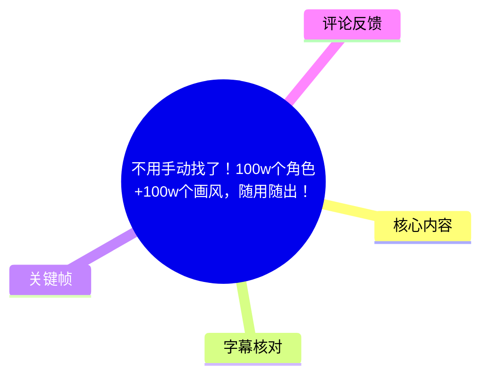
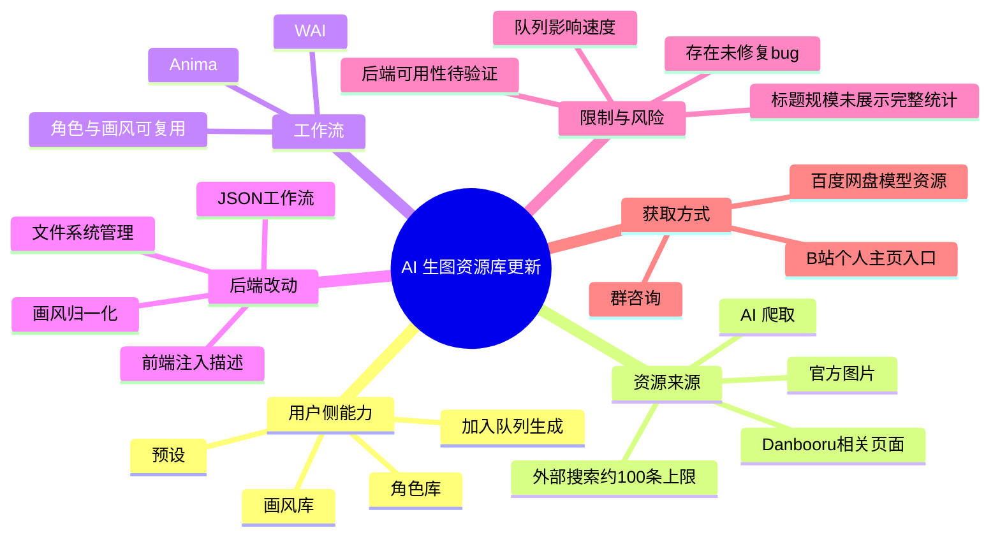
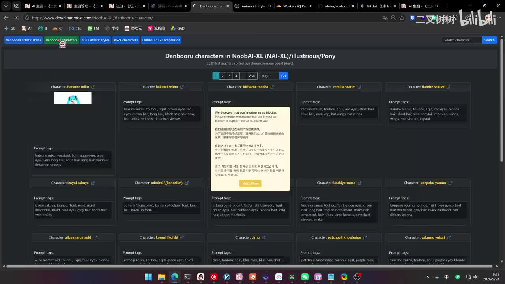
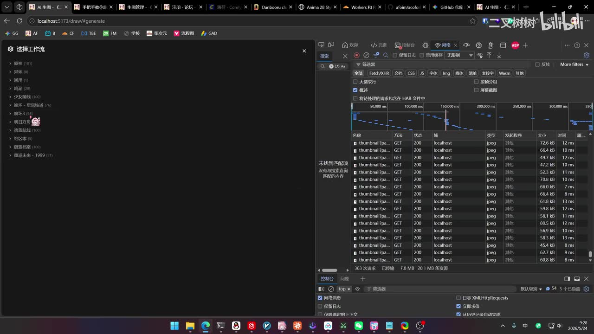
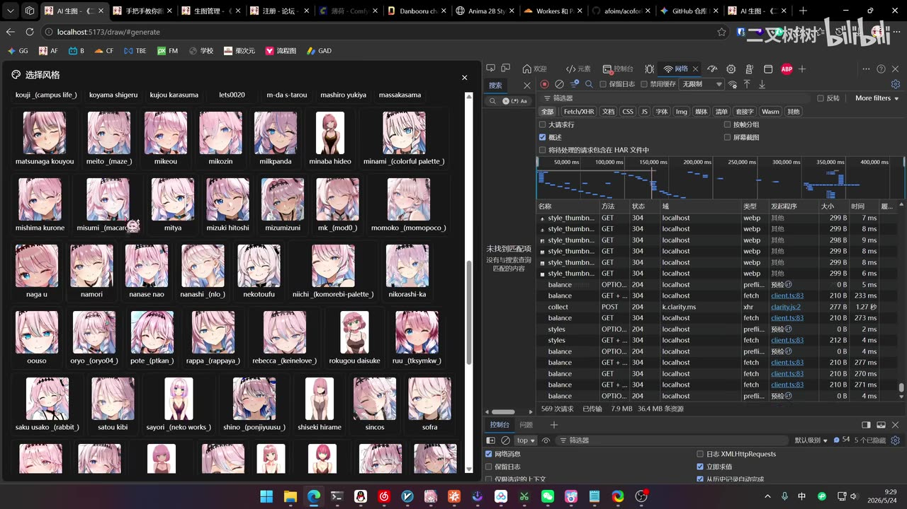
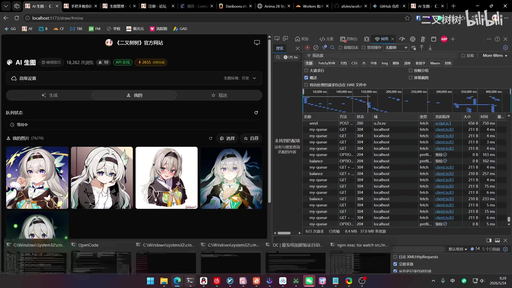

# 不用手动找了！100w个角色+100w个画风，随用随出！

> 来源：[Bilibili 视频](https://www.bilibili.com/video/BV1PVGj6QECP)  
> UP 主：二叉树树｜合集：AIcode｜时长：7 分 22 秒｜分辨率：2560×1440  
> 数据抓取时间：2026-07-13。视频标题中的“100w 个角色 + 100w 个画风”为标题宣传表述；正文仅记录视频实际展示与说明的能力边界。

## 小结

视频展示了 UP 主对“AI 生图”本地工具的一次功能更新：将 Danbooru / NoobAI-XL 相关角色标签与画风标签整理为可搜索、可点选的资源库，目标是让用户不必手动到外部站点复制角色或画风描述，再粘贴到生图工作流中。

面向普通用户，核心体验是：在“选择工作流”和“选择风格”的界面中浏览或搜索条目，选中角色、画风及可选预设后加入队列；UP 主称 WAI 工作流通常约 30 秒可出图，但实际时长仍取决于队列状态。视频还展示了生成结果与“我的图片”页。

面向二次开发者，视频说明了后端的归一化改动：不再在数据中保存不同模型/工作流所需的画风前缀，而是只保存实际画风内容；前端或对应工作流再自动补齐前缀或注入文本。工作流与相关资源也改为按文件系统、文件夹分类管理，工作流本体使用 JSON，预览图可用 WebP、PNG、JPG 等格式。

资源不是人工逐条录入。UP 主称角色信息由 AI 爬取，且使用的是站点官方图片；但外部站点一次搜索最多返回约 100 条结果，因此单个角色/关键词的可获得结果会受这一上限约束。视频也提到目前有功能尚未修复的 bug，且“后端不可用”等运行问题未在视频中给出明确排障方案。

站内字幕与本次视频内容完全不匹配，实际是电竞赛事访谈与英文歌曲歌词，不能使用；本次 ASR 虽有大量术语误识别和断句问题，但主题、操作顺序与关键帧相符，故正文以 ASR 为主并结合画面作保守校正。涉及无法从素材确认的具体项目名称、参数与文件夹名称，均不作确定性补全。

本视频适合已经在使用 AI 绘图工作流、希望减少角色/画风 prompt 查找成本的用户，以及需要理解资源库归一化设计的开发者。它不是完整安装教程，也没有展示源代码、接口规范、模型下载校验值或稳定性测试数据。

## 思维导图

## 目录

- [背景：从手动复制 Prompt 到资源库选择](#背景从手动复制-prompt-到资源库选择)
- [角色库：爬取、检索与可选范围](#角色库爬取检索与可选范围)
- [画风库与生图操作流程](#画风库与生图操作流程)
- [预设与生成结果](#预设与生成结果)
- [开发者部分：归一化与文件系统管理](#开发者部分归一化与文件系统管理)
- [资源获取、模型与时效性](#资源获取模型与时效性)
- [实践步骤与排障边界](#实践步骤与排障边界)
- [结论与限制](#结论与限制)
- [字幕比对](#字幕比对)
- [评论分析](#评论分析)
- [处理记录](#处理记录)

## [背景：从手动复制 Prompt 到资源库选择](https://www.bilibili.com/video/BV1PVGj6QECP?t=0)

UP 主开场称，经过约 5 小时处理，完成了两项主要更新。视频的实际问题是：过去使用角色 LoRA / 角色描述或特定画风时，用户往往需要自行到标签站点寻找条目、复制描述，再回到生图界面填写；更新后希望将常用内容直接置入工具的选择界面。

视频画面打开的是 Danbooru 角色页面，页面标题可见为 “Danbooru characters in NoobAI-XL (NAI-XL)/illustrious/Pony”，页面中列出角色名与 Prompt tags。这是视频所述角色资料的参考来源之一，而不是视频内生图工具本身。

> 图：关键帧展示 Danbooru / NoobAI-XL 相关角色页面中“角色名—Prompt tags”的组织形式。它说明视频所称“爬取角色”的对象是可用于提示词的角色标签资料，而非仅有角色图片的图库。

视频中提及已将部分“常用角色”一键爬取到工具内，举例涉及《崩坏：星穹铁道》《原神》以及其他作品角色。由于 ASR 对作品名有明显误识别，且视频素材未提供完整清单，不能据此扩展为全量支持列表。

需要区分两件事：

1. **标题的规模说法**：标题使用“100w 个角色 + 100w 个画风”的表述。
2. **视频可验证的演示**：画面展示了角色、风格的选择窗口与大量缩略图；UP 主说明资源通过 AI 爬取并做了归一化，但没有在视频内展示总条目统计、去重规则、更新频率或“百万级”计数方法。

因此，“可随用随出”应理解为其工具内的选择与入队流程，不应推断为任意角色或画风都已被完整覆盖。

## [角色库：爬取、检索与可选范围](https://www.bilibili.com/video/BV1PVGj6QECP?t=35)

视频在工作流选择界面中展示了按分类排列的工作流。左侧可见多类目录及数量标记，说明该工具会通过分类目录承载不同类型的工作流或资源。UP 主称，用户可以在角色库中挑选已有角色，再直接运行对应流程。

> 图：该帧同时呈现“选择工作流”的分类面板和浏览器开发者工具网络面板。前者用于说明用户侧的资源选择入口；后者为后续关于前后端资源请求、文件管理改造的开发者说明提供画面上下文。

### 视频明确说明的资源获取方式

- 角色资料由 AI 自动爬取，非 UP 主人工逐条录入。
- 画面中使用的图片被 UP 主称为来源站点的官方图片。
- 常用角色被优先纳入工具，减少自行搜索、复制的操作。
- 如果用户有希望补充的角色，UP 主建议通过群内咨询/反馈提出需求。

### 外部检索上限

UP 主特别说明：某些角色在来源站点上可能有超过 100 条相关结果，但该站点一次搜索最多只能返回约 **100 条**。这意味着：

- 工具中某个角色看到的条目数量，不必然等于来源站点的全部可用条目；
- “只有 100”不一定是本地爬取失败，也可能是上游搜索结果限制；
- 若要补足更多结果，可能需要来源站点提供分页、分词或其他检索策略；视频没有展示已实现这些机制。

## [画风库与生图操作流程](https://www.bilibili.com/video/BV1PVGj6QECP?t=90)

视频接着展示“选择风格”窗口。窗口内以缩略图配合名称展示众多画风条目，用户可以滚动浏览并选择。UP 主称画风库“又加了一点”，并提出 WAI 与 Anima 所使用的画风信息存在可复用部分：尽管两者所需的前置写法不同，后续实际画风词可能相同。

> 图：关键帧展示画风条目以缩略图网格呈现，适合说明视频的核心交互：用户可以从库中选画风，而不必手动输入完整的画风描述。

### 视频演示的操作顺序

1. 进入生成页，选择适合的工作流。
2. 在角色库中选择需要的角色；视频以常用二次元角色资源为主要场景。
3. 打开画风选择窗口，选择一个画风条目。
4. 根据需要填写自然语言描述；UP 主演示中表示可以写，也可以暂不写，仅作测试。
5. 将任务加入队列。
6. 等待任务从“等待中”进入执行并出图。
7. 在结果或“我的图片”页面查看生成结果。

### 生成耗时与队列含义

UP 主称，若使用其口述为 “WAI” 的流程，通常约 **30 秒**可以出图；这只是其演示环境下的经验值，不是服务等级承诺。视频中任务一度显示“等待中”，UP 主也询问前方队列人数何在，并说明理想情况下等待状态应显示前方还有多少任务。

可据此得到的实际判断是：

- 出图时间至少受工作流与当前队列状态影响；
- 30 秒不是固定参数；
- 视频没有展示显卡型号、分辨率、采样步数、批量大小、模型版本或并发配置，因此无法复现实测速度。

## [预设与生成结果](https://www.bilibili.com/video/BV1PVGj6QECP?t=166)

除角色和画风外，视频还提到新增“预设”。UP 主以一个包含动作/表情描述的预设为例，说明用户可直接附加预设，也可以自己新建。视频称自建预设保存在云端，并可后续修改。

这部分可理解为将重复使用的描述片段保存为可复用配置，降低每次重复输入的成本。视频未展示预设的数据结构、是否支持分类/共享/版本回滚，也没有展示删除与权限控制。

视频随后展示 WAI 和 Anima 均可生成结果，并评价画面效果“还不错”。这是 UP 主对单次演示样本的主观评价，并不能推导为所有角色、画风、提示词组合均稳定可用。

> 图：该帧展示工具的“我的”页面、顶部 API 状态标记、等待中队列以及多张生成图。它有助于理解视频所说的生成结果查看入口，同时也直观保留了任务可能处于排队状态这一限制。

## [开发者部分：归一化与文件系统管理](https://www.bilibili.com/video/BV1PVGj6QECP?t=228)

UP 主明确表示，这一段主要面向希望二次开发的用户；普通用户可跳过。其描述的改动可整理为以下两类。

### 1. 画风信息归一化

视频称此前不同工作流/模型对画风词可能要求不同的前缀形式；更新后，资源侧只存储“实际画风”，不保存前面的特定前缀。随后由工作流或前端按目标类型自动添加对应前缀。

以视频的表达概括，其设计意图是：

| 环节 | 更新后的处理方式 | 目的 |
| --- | --- | --- |
| 画风资源存储 | 只保存核心画风内容 | 避免同一画风因不同前缀产生重复数据 |
| WAI 侧使用 | 运行时自动补充其所需前缀 | 保持工作流可用 |
| Anima 侧使用 | 运行时自动补充/追加其所需内容 | 复用同一份核心画风资源 |
| 前端交互 | 将文本注入对应工作流 | 用户无需重复手写自然语言描述 |

视频中所称 WAI、Anima 的精确拼写与具体前缀形式受 ASR 误识别影响；关键帧中浏览器标签可见 “Anima 2B Style”，因此“Anima”可由画面佐证。其他具体前缀文本未能从素材可靠还原，故不写成固定配置。

### 2. 工作流改为文件系统管理

UP 主称，后端不再通过原有的“工作流和画风管理”方式集中管理，而是将资源放入文件系统，以文件夹分类。这种方式的好处是目录层级更直观，便于按资源类型组织。

视频提到的文件约定包括：

- 工作流文件为 **JSON**；
- 若需要显示预览图，可使用 **WebP、PNG 或 JPG**；
- 不同工作流可对应不同目录；
- 自定义 LoRA / 自定义工作流被放在相应分类中；
- 角色和画风可在不同工作流间复用，因此经过归一化后，本地不必为每种工作流维护完全重复的资源集。

UP 主还描述了一个文本注入路径：资源侧以文本形式保存，前端在使用时将其转换并注入到 LoRA 或工作流的正向描述中。ASR 将部分文件夹名、字段名误识别为无意义词语，视频未展示清晰代码或目录文本，因此不能可靠给出精确路径与字段名称。

## [资源获取、模型与时效性](https://www.bilibili.com/video/BV1PVGj6QECP?t=365)

视频结尾提供了资源入口指引：

- 可从 UP 主 Bilibili 个人主页进入其所述工具/页面；
- 有需求可进入其提到的群进行咨询；
- 因已接入 Anima，UP 主称百度网盘中也上架了 Anima 相关模型，可自行下载；
- UP 主同时表示，也可以直接从官方渠道下载，并认为没有必要一定从其提供的网盘获取；
- 视频口述提供了某种站内/页面跳转方式，但 ASR 对具体按键、缩写与页面名称识别严重失真，无法可靠复现，因此不写为可执行步骤。

UP 主称网盘资源中提供了“无 LoRA”和另一个 LoRA 相关版本；但其随后承认当前演示中忘记挂载 LoRA、稍后会补充。由此可见：

1. 视频中的单次生成效果不一定使用了 LoRA；
2. 相关资源版本和链接可能处于补充或调整状态；
3. 截至抓取日，实际可下载文件、版本号、授权要求与模型兼容性均应以页面实时信息为准。

视频还含有一句与当时促销/价格有关的口述，但 ASR 对具体活动、时长和金额无法可靠识别，且这类信息强时效，故不将其整理为有效价格承诺。

## [实践步骤与排障边界](https://www.bilibili.com/video/BV1PVGj6QECP?t=70)

### 适合普通用户的最小操作流程

1. 进入工具的生成页面。
2. 选择目标工作流，例如视频所示的 WAI 或 Anima 类型流程。
3. 从角色库选取已有角色资源。
4. 从画风库选取画风；如有需要，补充自然语言正向描述。
5. 可选：添加已有预设，或新建自己的预设。
6. 点击“加入队列”。
7. 观察任务状态；若仍为“等待中”，等待前方任务处理。
8. 在结果页或“我的图片”页检查出图结果。
9. 若效果不符合预期，调整角色、画风、预设或提示词后重新入队。

### 使用前应确认的条件

| 项目 | 视频可确认的信息 | 未提供的信息 |
| --- | --- | --- |
| 工作流 | 有 WAI、Anima 等流程概念 | 完整工作流清单、版本与安装方法 |
| 角色资源 | 支持从库中选择常用角色 | 完整覆盖范围、更新频率、版权/许可说明 |
| 画风资源 | 支持缩略图选择，后端做归一化 | 每个画风的精确词表与适配模型 |
| 预设 | 支持云端保存、修改与复用 | 存储配额、权限、导入导出能力 |
| 速度 | WAI 口述约 30 秒 | 硬件配置、生成参数、并发上限 |
| 文件格式 | JSON 工作流；预览支持 WebP/PNG/JPG | 目录规范、字段 schema、校验要求 |

### 已知异常与不应自行脑补的处理方式

视频开头和操作中，UP 主提到一个尚未修好的 bug，并表示“不影响用”；但没有说明 bug 的触发条件、影响范围或修复版本。

热评中还有用户询问“后端不可用”是否表示稍后重试，但视频本身没有解释这一错误。因此，以下内容不能视为视频已经给出的结论：

- “后端不可用”一定只需重试；
- 服务必然会自动恢复；
- 本地网络、账号额度、队列、接口或后端进程中哪一个是唯一原因；
- 任何固定等待时长可以解决问题。

更稳妥的做法是记录报错文本和出现时间，检查工具公告或向 UP 主所指的咨询渠道提交问题；若工具提供状态页或日志，再依据实际状态判断。

## [结论与限制](https://www.bilibili.com/video/BV1PVGj6QECP?t=420)

这次更新的可迁移经验，不在于某一个特定角色库，而在于将 AI 绘图的重复操作拆成可管理的资源层：

- **角色、画风、预设**作为可搜索和可选的资产；
- **核心描述**与不同模型/工作流的包装前缀分离；
- 通过运行时注入或自动补全，减少用户输入与重复维护；
- 用文件夹、JSON 工作流和预览图实现对资源的可视化分类管理。

但视频同时留下重要限制：

1. 标题宣称的百万级角色、画风规模未展示计数页面或统计口径，不能仅凭标题验证。
2. 角色资料受来源站点单次约 100 条搜索上限影响。
3. 生成速度受队列影响，约 30 秒只是演示者经验。
4. 视频承认仍有未修复 bug，且没有提供排障流程。
5. 模型、网盘资源、活动与入口均可能随时间改变。
6. 本视频未提供源码、部署命令、API 文档或精确目录结构，不能据此直接完成二次开发部署。
7. AI 绘图的角色与画风使用还可能涉及模型许可、站点条款、作品角色及画风相关权利问题；视频未讨论，实际使用者需自行核验。

## 字幕比对

| 字幕来源 | 完整性 | 专有名词 | 时间轴 | 主要问题 |
| --- | --- | --- | --- | --- |
| Bilibili 站内字幕 | 与本视频内容不对应，无法用于整理 | 大量为电竞战队、人名与赛事术语 | 未提供可用分段时间 | 内容是英文歌曲歌词与电竞采访，如 WB、BLG、LPL、世界赛等，与 AI 生图工具演示无关 |
| 本次 ASR 字幕 | 覆盖了视频主要讲述顺序和结尾引导 | 有较多误识别，但能识别 Danbooru、Anima、JSON、LoRA、WebP/PNG/JPG 等部分线索 | 未提供逐条可靠时间码，按视频顺序与关键帧定位 | 普通话转写混入繁简、英文和无意义词；WAI、文件夹名、作品名、活动信息等存在误识别 |

### 最终字幕选择

本次 **ASR 已执行**。由于站内字幕与视频实际内容完全错配，正文不采用站内字幕；以本次 ASR 为主，并以关键帧和上下文进行有限校正。

重点校正原则如下：

- 将画面中可见的 Danbooru / NoobAI-XL 页面作为角色标签来源的依据；
- 将浏览器标签中可见的 “Anima 2B Style” 作为 “Anima” 名称的画面佐证；
- 将 ASR 中反复出现的 “WI / WII” 保守记为视频口述的 **WAI**，不展开其精确全称；
- 将 “工作流是 Jason” 校正为 **JSON**；
- 保留“WebP、PNG、JPG 可作预览图”的文件格式信息；
- 对 ASR 无法可靠还原的文件夹名、跳转口令、促销价格、群名与模型版本，不作猜测性补全。

## 评论分析

以下仅处理本次可获取的热评前三条；评论为用户观点或提问，不等同于已验证事实。

1. **delusionxb｜4 赞**  
   评论询问：“后端不可用”是否意味着稍后重试。该评论反映出用户在实际使用中遇到服务可用性或接口错误提示。视频没有对该报错给出定义、原因或恢复策略，因此不能确认“稍后重试”一定有效；它是一个值得补充官方错误码与状态说明的产品问题。

2. **oneds6｜1 赞**  
   评论认为“目前 2d 还是不稳定，稳定以后只能靠 3d”。这是对 AI 2D 生成稳定性的个人判断，可能指角色一致性、可控性或结果质量，但评论没有说明评价指标、使用模型、工作流和测试样本。视频演示了若干单张结果，无法据此证实或证伪该判断。

3. **太二真人鲁讯｜1 赞**  
   评论询问“ai 绘画吗？”。从视频内容看，答案应为：视频展示的是 AI 生图/AI 绘图相关工具，包括角色、画风、预设、工作流与出图队列管理；但它并非传统手绘教学，也没有详细讲解绘画基本功或图像编辑流程。

## 处理记录

- Worker ID：`worker-mrj0wbly-5dc4e50c`
- 模型：`gpt-5.6-terra`
- 调用工具与素材：使用任务提供的视频元数据、素材清单、站内字幕、已执行的 ASR 字幕、4 张可见关键帧及可获取热评前三条进行整理；素材产物目录包含视频、音频、帧、字幕、ASR 与评论文件。
- 字幕选择：站内字幕内容与本视频主题严重不符，判定为错配字幕；本次 ASR 已执行，虽然误识别较多，但与关键帧及视频主题一致，故作为主文本来源，并进行保守的上下文校正。
- 关键帧选择依据：
  - `frames/frame-001.jpg`：展示 Danbooru 角色与 Prompt tags 来源，支撑“角色资源爬取”说明；
  - `frames/frame-002.jpg`：展示工作流分类选择界面，支撑用户入口与工作流管理描述；
  - `frames/frame-003.jpg`：展示画风缩略图库，支撑“无需手动找画风”的核心交互；
  - `frames/frame-004.jpg`：展示队列状态和生成结果页，支撑排队与结果查看说明。
- 缓存清理：任务提供的素材清单未包含缓存清理日志；未将“已清理缓存”写为既成事实。
- 未解决问题：
  - “100w 个角色、100w 个画风”的具体统计口径与实际数量未在视频内展示；
  - WAI 的准确全称、各模型的前缀规则、目录结构与文本注入字段未能由素材可靠确认；
  - 站内入口口令、群信息、网盘具体地址、模型版本和活动价格受 ASR 误识别及强时效影响，未纳入可执行说明；
  - “后端不可用”及视频提及 bug 的原因、影响范围与修复状态未公开。
