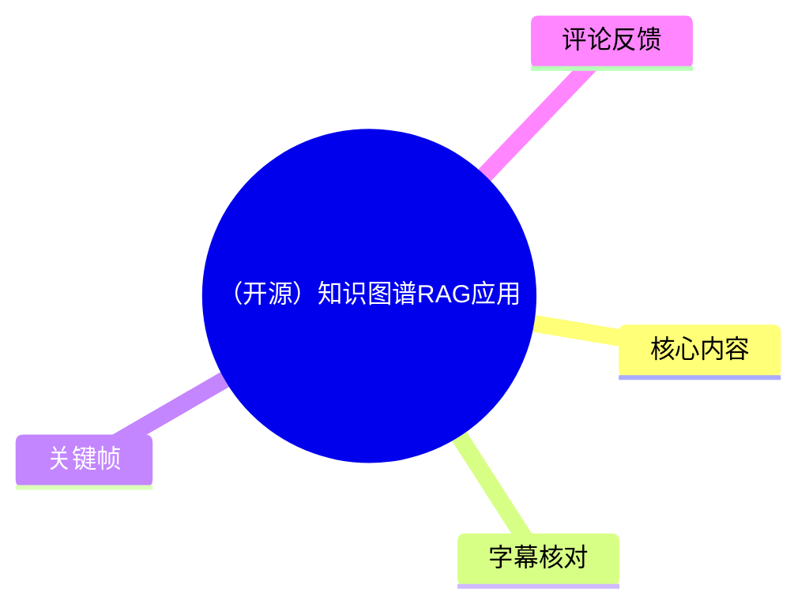
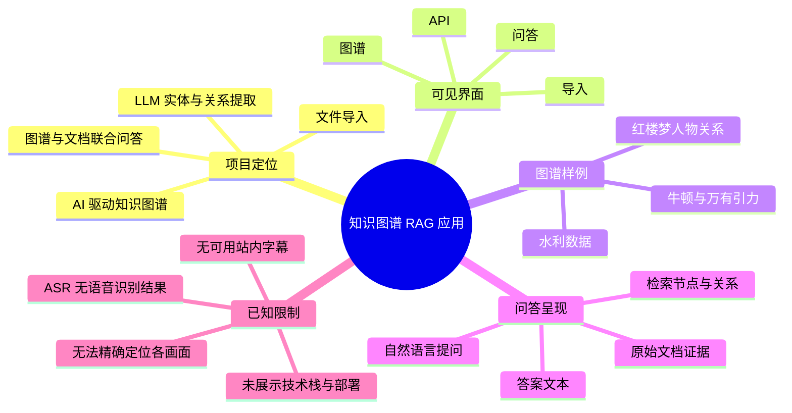
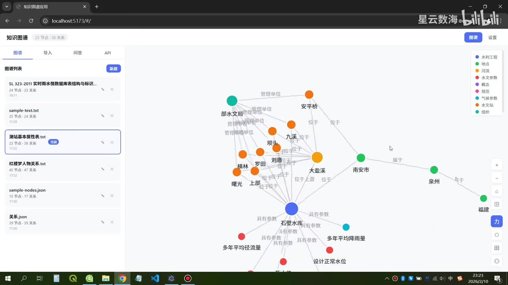
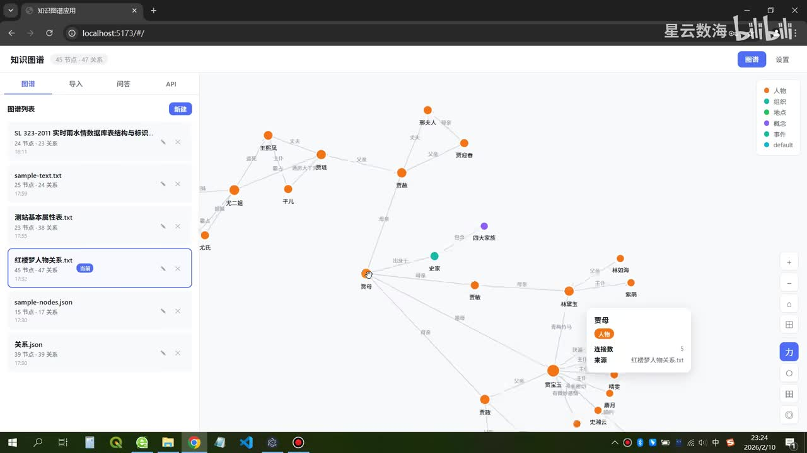
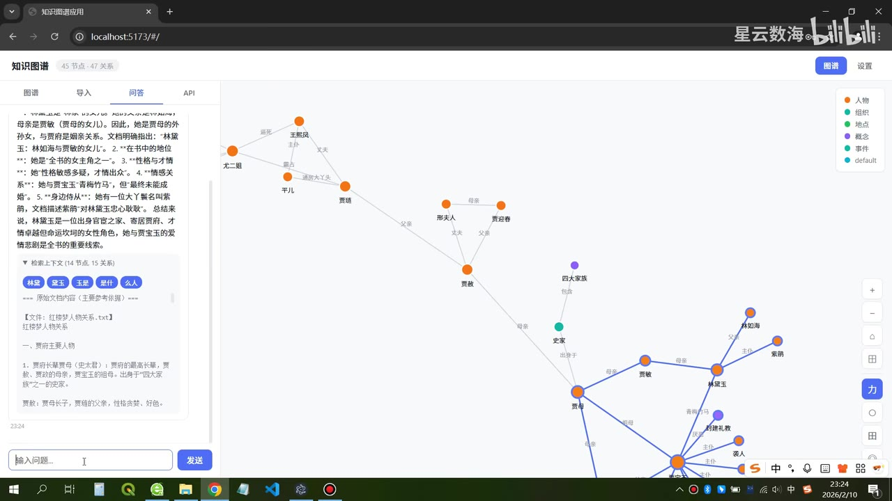
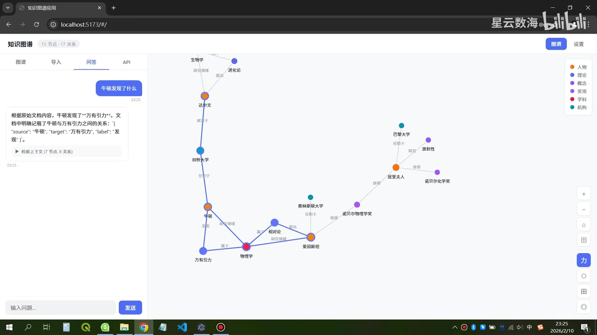

# （开源）知识图谱RAG应用

> 来源：[Bilibili 视频](https://www.bilibili.com/video/BV18NF9zUEdZ)<br>
> UP 主：星云数海｜发布时间：2026-02-11｜视频时长：3 分 05 秒｜分区集合：AIcode  
> 资料下载说明：视频简介提供夸克网盘链接及提取码 `pnYP`，并以“需要源码的求三连+关注”作为获取条件；链接有效性、源码完整性及许可证未在本素材中验证。

## 小结

视频展示的是一个本地浏览器界面中的“知识图谱”应用，而非对 GraphRAG 算法原理、部署环境或代码实现的讲解。界面包含**图谱、导入、问答、API**四个入口；核心可见能力是从不同文本或 JSON 文件中切换图谱、以节点—关系网络可视化内容，并在“问答”页基于原始文档和图谱返回答案、标示检索到的节点与关系。

从视频简介可知，作者将该项目定位为“基于 AI 的知识图谱 RAG 应用”，声称可为导入文件创建知识图谱，并通过 LLM 提取实体和关系，再结合知识图谱与导入文件进行 LLM 问答。画面实际展示了水利数据、红楼梦人物关系、牛顿相关知识等图谱样例，能证明前端已具备多图谱浏览及问答演示；但**无法仅凭本视频确认**所用 LLM、提示词、向量库、图数据库、实体消歧策略、模型版本、部署命令或评测效果。

画面中的图谱以颜色区分实体类型。例如，红楼梦样例的图例含“人物、组织、地点、概念、事件、default”；水利样例中可见“水利工程、地点、河流、水文参数、概念、规范、气候参数、水文站、组织”等类型。节点间连线附有诸如“管理单位”“位于”“属于”“具有参数”“父亲”“母亲”等关系文本，说明该工具不仅显示实体，还保留了关系语义。

问答能力至少展示了两种使用形态：一是围绕红楼梦人物的自然语言问题，左侧回答区显示文本答案、关键词标签、原始文档内容及“检索上下文（节点、关系）”；二是询问“牛顿发现了什么”，答案指出“万有引力”，并展示三元组形式的原始文档证据：`source: 牛顿`、`target: 万有引力`、`label: 发现`。这体现的是“回答 + 图谱高亮/路径 + 文档证据”的联合呈现。

重要限制是：站内没有可用字幕；本次 ASR 虽成功读取音频文件并生成带时间戳能力的任务结果，但未识别出任何语音片段。因此，除视频起点外，不能依据真实字幕为各个画面建立精确秒级定位，正文只能按关键帧和界面可见文字归纳，不能把视觉顺序伪装为精确讲解时间轴。视频发布于 2026-02-11，项目下载链接、依赖、模型接口和界面功能均可能随后变化。

## 思维导图





## 目录

- [项目定位与素材边界](#项目定位与素材边界)
- [图谱浏览：多文件、多类型实体与关系](#图谱浏览多文件多类型实体与关系)
- [问答演示：红楼梦人物关系检索](#问答演示红楼梦人物关系检索)
- [问答演示：牛顿与万有引力证据](#问答演示牛顿与万有引力证据)
- [可复用的操作流程与参数记录](#可复用的操作流程与参数记录)
- [结论、限制与时效性](#结论限制与时效性)
- [字幕比对](#字幕比对)
- [评论分析](#评论分析)
- [处理记录](#处理记录)

## [项目定位与素材边界](https://www.bilibili.com/video/BV18NF9zUEdZ?t=0)

视频标题为“（开源）知识图谱RAG应用”。作者简介对项目能力的描述包括：

1. 为导入文件创建知识图谱；
2. 基于 LLM 对导入文件进行实体、关系提取；
3. 将知识图谱与导入文件共同用于 LLM 问答；
4. 提供源码下载地址。

这些内容属于作者在简介中作出的项目定位，不能直接等同于已由视频画面验证的实现细节。画面实际可确认的是一个运行于 `localhost:5173/#/` 的网页界面，顶部名称为“知识图谱”，导航栏包含：

- **图谱**：图谱列表与网络可视化；
- **导入**：入口存在，但本批关键帧未展示导入过程或支持的文件格式；
- **问答**：问题输入、回答文本、检索上下文和图谱联动；
- **API**：入口存在，但未展示接口地址、请求参数、鉴权、返回结构或调用示例。

因此，若要复现或评估此项目，视频只能作为产品界面参考；模型提供方、图谱存储引擎、抽取 schema、文本切分策略、RAG 检索排序、上下文窗口、延迟、成本和准确率均需以源码或实际运行结果为准。

## [图谱浏览：多文件、多类型实体与关系](https://www.bilibili.com/video/BV18NF9zUEdZ?t=0)

图谱页左侧是“图谱列表”，每个条目可见节点数、关系数和创建/更新时间；右侧是可缩放、平移的图结构画布。画面中可见如下样例条目：

| 可见图谱文件/名称 | 节点数 | 关系数 | 画面可见内容 |
| --- | ---: | ---: | --- |
| `SL 323-2011 实时雨水情数据库表结构与标识...` | 24 | 23 | 水利领域图谱样例 |
| `sample-text.txt` | 25 | 24 | 文本样例 |
| `测站基本属性表.txt` | 23 | 38 | 水利测站及其参数图谱 |
| `红楼梦人物关系.txt` | 45 | 47 | 红楼梦人物关系图 |
| `sample-nodes.json` | 15 | 17 | JSON 节点样例 |
| `关系.json` | 39 | 39 | JSON 关系样例 |

这里的数量为界面截图中可见的图谱统计，代表对应演示数据当前显示的节点、关系规模；它们不是系统支持规模的上限，也不能据此推断抽取准确率。



> 图：该帧展示“测站基本属性表.txt”图谱被选中，左侧标为 **23 节点、38 关系**。中心可见“石壁水库”“大盈溪”“南安市”“福建”等节点，以及“具有参数”“位于”“属于”“管理单位”等连线。它直观证明应用可将领域文本中的对象、属性/参数和地理或组织关系组成可交互网络。

水利图谱右上角图例显示的实体类别包括“水利工程、地点、河流、水文参数、概念、规范、气候参数、水文站、组织”。其中，画面可观察到：

- “石壁水库”作为较大的核心节点；
- “多年平均径流量”“多年平均降雨量”“设计正常水位”等参数节点；
- “大盈溪”“南安市”“福建”等河流或地点节点；
- “安平桥”等水利工程节点；
- 通过“具有参数”“位于”“属于”等边表达关系。

这说明展示层至少具有**节点类别颜色编码**和**带文本标签的关系边**。不过，画面没有提供类型定义文件、关系 schema、属性字段、去重规则或抽取置信度，因此无法判断这些类别是预设 schema、模型自由生成，还是人工修订所得。



> 图：该帧切换至“红楼梦人物关系.txt”，左侧显示 **45 节点、47 关系**。画布中以“贾母”为中心连出“贾敏、贾政、林如海、林黛玉、贾宝玉”等人物，并在右下浮层显示选中节点“贾母”的类型为“人物”、连接数为 5。该帧的价值在于展示节点详情与人物关系网络的结合。

红楼梦图例中的“人物”以橙色呈现，画面中可见“父亲、母亲、妻子、丈夫、祖母、外孙女”等关系标签。该样例主要强调人物亲属关系；它没有在可见画面中展示人物事件、时间线、关系有效期、出处页码或冲突关系处理。

## [问答演示：红楼梦人物关系检索](https://www.bilibili.com/video/BV18NF9zUEdZ?t=0)

问答页保留右侧图谱画布，并在左侧增加对话面板、输入框和“发送”按钮。可见的回答区由几层信息组成：

1. **回答文本**：面向用户问题生成自然语言说明；
2. **关键词标签**：例如“林黛玉”“贾宝玉”“王熙凤”“是什么”“怎么”等；
3. **原始文档内容**：以 `[文件：红楼梦人物关系.txt]` 标识来源；
4. **检索上下文**：以节点和关系的数量概括检索结果；
5. **图谱高亮**：相关节点呈现蓝色连线、橙色描边等区别于普通图的视觉状态。



> 图：该帧位于“问答”页，左侧可见一段针对“贾母”相关关系的回答及原始文档摘录，右侧以高亮线条展示涉及的关系子图。它的价值在于说明系统不是只输出文本，还试图把回答关联到检索得到的节点、边和源文件。

画面可见的回答文字围绕“贾母”的家庭关系展开，包含其与“贾政”“贾敏”“贾宝玉”“林黛玉”等人物的亲属关联。回答区域中的原始文档标题为“贾府主要人物”，表明问答时会回显一部分源文本。该机制有助于使用者检查回答是否与导入资料相符，但视频没有展示：

- 回答是否逐句引用可点击来源；
- 图谱边是否都来自同一文件；
- 当文档内容与图谱关系冲突时如何处理；
- 多轮对话的上下文保存与清理策略；
- 检索节点/关系的排序分数、阈值、召回数量；
- 大型图谱下的性能表现。

因此，视频所示“检索上下文”可视为可追溯性界面的初步证据，不能据此推断系统已经解决幻觉、歧义消解或关系冲突问题。

## [问答演示：牛顿与万有引力证据](https://www.bilibili.com/video/BV18NF9zUEdZ?t=0)

另一个问答样例的问题气泡为“牛顿发现了什么”。左侧回答显示：根据原始文档内容，牛顿发现了“万有引力”。回答还明确给出文档中的三元组关系：

```text
{
  "source": "牛顿",
  "target": "万有引力",
  "label": "发现"
}
```



> 图：该帧展示“牛顿发现了什么”的问答结果。左侧明确回显“牛顿与万有引力之间的关系”，并显示检索上下文为“7 节点、8 关系”；右侧图中“牛顿”与“万有引力”被高亮连接。它是本视频中最清晰的“问题—三元组证据—图谱高亮”闭环示例。

右侧图谱还可见“相对论、爱因斯坦、物理学、剑桥大学、达尔文”等节点。这些节点展示了知识网络的扩展性，但不能仅从画面断定其每条边的事实正确性或抽取来源。尤其是“牛顿发现万有引力”在表述上属于演示语料中的关系陈述；视频并未说明该语料是否经过人工审核，不能将该图谱示例当作严谨历史学论证。

这一演示给出的可迁移经验是：若知识图谱 RAG 用于可信问答，答案区域应尽量同时呈现：

- 用户问题；
- 最终自然语言答案；
- 命中的实体与关系；
- 可读的三元组或路径；
- 源文档片段；
- 画布中的对应高亮。

但视频并未展示引用粒度、置信度、失败案例或人工校正入口，实际生产使用仍需补充这些能力。

## [可复用的操作流程与参数记录](https://www.bilibili.com/video/BV18NF9zUEdZ?t=0)

由于没有可用语音字幕、导入页关键帧、源码内容或 API 说明，以下流程分为“画面可直接确认”与“作者简介声称但未在画面逐步演示”两部分，避免把推测写成事实。

### 画面可直接确认的使用流程

1. **进入图谱页**  
   在左侧“图谱列表”选择已有图谱文件。界面会显示该文件当前的节点数和关系数。

2. **浏览图结构**  
   在右侧画布观察节点、关系边和类别图例。右侧工具栏可见放大、缩小等图形操作按钮；具体每个图标的全部功能未在视频中说明。

3. **查看节点信息**  
   点击图中节点后会出现详情浮层。红楼梦样例中，“贾母”节点显示类型“人物”及“连接数 5”。

4. **切换至问答页**  
   在左侧输入问题并点击“发送”。画面证明问答结果会显示回答正文、关键词、原始文档内容和检索上下文。

5. **核查图谱联动结果**  
   对照左侧答案中出现的实体/关系与右侧高亮子图，确认问答所依据的关系是否可读、是否与源文本一致。

### 作者简介声称、但未在画面中展开的流程

作者称可以“导入文件创建知识图谱”，并使用 LLM 完成实体、关系提取。若按该项目定位理解，预期流程是“导入文件 → LLM 抽取实体/关系 → 生成或更新图谱 → 基于图谱与文件问答”；但以下关键步骤均没有在本素材中展示，不能补写为具体命令或配置：

- 支持 `.txt`、`.json` 之外的哪些文件类型；
- 文件大小、字符数、批量导入上限；
- 文本分块长度、重叠长度；
- LLM 名称、模型版本、温度、最大输出 token；
- 实体类别、关系类别是否可配置；
- 图谱数据库或向量数据库的选型；
- 增量导入、覆盖导入、实体合并与关系去重规则；
- API 的路径、请求参数、响应 JSON；
- 开源许可证、安装方式和环境变量。

### 视频中可见的数量参数

| 场景 | 可见参数 | 含义与边界 |
| --- | --- | --- |
| 水利“测站基本属性表.txt”图谱 | 23 节点、38 关系 | 当前样例图的统计，不代表容量上限 |
| 红楼梦人物关系图谱 | 45 节点、47 关系 | 当前样例图的统计 |
| `sample-nodes.json` | 15 节点、17 关系 | 当前样例图的统计 |
| `关系.json` | 39 节点、39 关系 | 当前样例图的统计 |
| 牛顿问答检索上下文 | 7 节点、8 关系 | 单次问答页面展示的检索上下文规模，不等同于全图规模 |

## [结论、限制与时效性](https://www.bilibili.com/video/BV18NF9zUEdZ?t=0)

该视频的主要价值是展示知识图谱 RAG 应用的一个前端形态：把文档转化为实体—关系图，允许从多个图谱中浏览节点关系，并以“回答文本 + 原始文档 + 检索上下文 + 图谱高亮”的方式回答问题。水利与红楼梦两个不同领域样例说明，这一呈现方式并不局限于单一专业场景。

对实际落地而言，最值得吸收的不是将可视化等同于知识正确，而是保留可审查链路：关系类型、三元组、命中文档片段和高亮路径应同时可见。这样更容易发现实体混淆、关系遗漏和回答与证据不一致的问题。

同时，本视频未提供充分技术细节。未展示部署步骤、完整导入流程、代码结构、模型及数据库选型、抽取提示词、评估指标、性能数据、权限控制或错误处理。因此，它适合用作产品交互和能力边界的初步参考，不足以单独作为技术选型、生产部署或效果承诺的依据。

时效性方面，视频发布时间为 2026-02-11；素材抓取时视频数据为播放 40,065、收藏 2,105、硬币 1,208、点赞 1,156、评论 1,501、转发 125。上述统计是抓取元数据中的时点数值，会持续变化。简介中的网盘链接、提取码、项目仓库状态及 AI 服务接口也可能失效或更新，使用前应再次验证。

## [字幕比对](https://www.bilibili.com/video/BV18NF9zUEdZ?t=0)

| 字幕来源 | 完整性 | 专有名词 | 时间轴 | 主要问题 |
| --- | --- | --- | --- | --- |
| Bilibili 站内字幕 | 未提供可用字幕 | 无法核验 | 无可用分段 | 素材明确标注“未提供可用站内字幕” |
| 本次 ASR 字幕 | 空 | 无法识别或校正 | ASR 任务具备时间戳能力，但无任何分段 | `medium` 模型自动识别语言为 `en`，概率 `0.541015625`；共识别 0 句、语音时长 0 秒、覆盖率 0，且提示未识别到语音片段 |

本次 ASR 已被实际检查，结果为空。诊断信息仅提示“未识别到语音片段”，**未提供 `noAudioStream=true` 标记**；同时素材清单中存在 `audio/audio.wav`，因此不能将本视频断言为“源视频没有音轨”，也不能把空 ASR 擅自解释为中文讲解转写失败的唯一原因。

最终没有可采用的逐句字幕。本整理以视频元数据、作者简介、关键帧中可辨识的界面文字和多模态画面理解为依据。由于没有“`HH:MM:SS,mmm --> HH:MM:SS,mmm`”形式的有效字幕段，除视频起点 `00:00` 外不存在可验证的内容级秒数；所有正文标题统一链接到 `t=0`，而非根据画面出现顺序虚构时间点。

通过关键帧确认、并在正文中采用的关键术语包括：知识图谱、图谱、导入、问答、API、LLM、实体、关系、检索上下文、原始文档内容、红楼梦人物关系、牛顿、万有引力，以及三元组字段 `source`、`target`、`label`。

## [评论分析](https://www.bilibili.com/video/BV18NF9zUEdZ?t=0)

仅处理可获取的热评前三条。评论反映用户的实践关切，不构成对该项目实现效果的验证。

1. **eddy615｜29 赞**  
   观点是知识图谱的难点不止于人物关系，而在于复杂问题的抽象；以红楼梦为例，若把人物与事件连接，复杂度会明显上升。该评论对视频中的红楼梦样例形成了有价值的补充：画面重点确实是亲属关系，未见事件节点和事件—人物关系的完整演示。其“复杂度上一个档次”是经验判断，合理但未给出具体数据或解决方案。

2. **绯樱欢愉｜21 赞**  
   评论称“直接用AI数据库转知识图谱”，并以“半天工作量”表达实现门槛可能较低。该说法没有说明使用何种 AI 数据库、输入规模、抽取质量、是否需要人工校正或如何处理增量更新，因此只能视为个人感受，不能作为工期或技术路线结论。

3. **敏特红烧鱼｜11 赞**  
   评论者称其做过类似的知识点关联图谱，遇到的主要问题是多次询问结果不一致；增量构图会产生脏数据，而剪枝又可能造成图谱碎片化、削弱关键性。这一反馈直接指出 LLM 图谱系统的工程风险：输出稳定性、实体/关系去重、增量合并与剪枝策略。视频未展示这些治理机制，因此该评论提出的是待验证的实践挑战，而非对视频项目已存在缺陷的事实认定。

## [处理记录](https://www.bilibili.com/video/BV18NF9zUEdZ?t=0)

- **Worker ID**：`worker-mrj0wbly-5dc4e50c`
- **模型**：`gpt-5.6-terra`
- **调用工具与素材**：视频元数据、视频素材清单、关键帧、ASR 覆盖诊断、热评数据；ASR 识别模型记录为 `medium`，运行设备为 CUDA、计算类型为 `float16`。
- **字幕检查与选择**：检查结果为“站内无可用字幕”；本次 ASR 亦已检查，0 个语音片段、0 秒语音覆盖，未采用任何字幕文本。未发现 `noAudioStream=true` 标记，故不将其描述为无音轨视频。
- **时间轴处理**：ASR 没有可用起止时间分段，站内也无 SRT；内容级时点无法验证。章节链接使用唯一可验证的视频起点 `t=0`，并明确未对关键帧按视觉顺序猜测秒数。
- **关键帧选择依据**：选用 `frame-001.jpg` 呈现水利多类型图谱与 23 节点/38 关系统计；`frame-002.jpg` 呈现红楼梦人物图及节点详情；`frame-003.jpg` 呈现红楼梦问答、源文档和高亮子图；`frame-004.jpg` 呈现牛顿问答、三元组证据及检索上下文。所选帧均直接支持正文中的可见界面事实。
- **缓存清理**：本任务仅收到已产出的素材路径与内容，未提供可执行缓存清理日志；未虚构清理完成状态。
- **未解决问题**：源码下载链接是否仍有效、许可证、项目依赖、前后端技术栈、LLM/数据库配置、文件导入规格、API 文档、抽取精度、增量更新策略、性能上限和安全机制均未在给定素材中得到验证。

## 评论分析

- 热评 1：我也在做知识图谱，但是难点在于，复杂问题的抽象。比如，你的红楼梦知识图谱，仅仅包含了人物关系，没有事件。如果把人物和事件连起来，整个复杂度可能就上一个档次了。
- 热评 2：直接用AI数据库转知识图谱。[doge]半天工作量
- 热评 3：你这个和我前段时间自己搞的很类似，但是我是应用于大框架的梳理和知识点关联图谱，但是中间遇到好多问题，其中最难控制的就是多次询问的结果不一致，导致相同内容建立的图谱完全不一样，采用增量的情况会出现很多脏数据，剪枝又会出现很多碎片化的图，关键性就又不大了

以上内容是观众反馈摘录，只用于补充理解视频反响，不作为正文事实依据。
