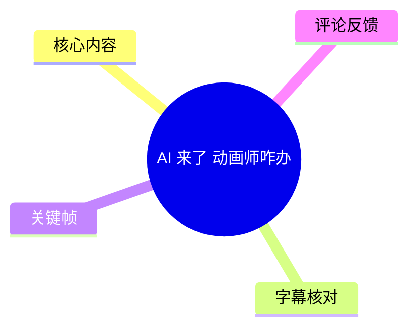
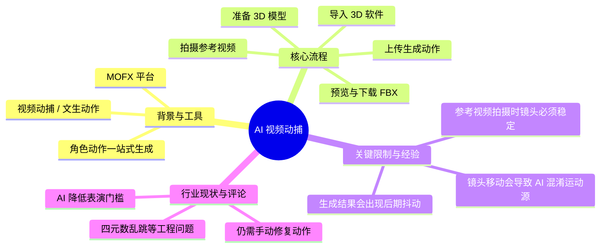
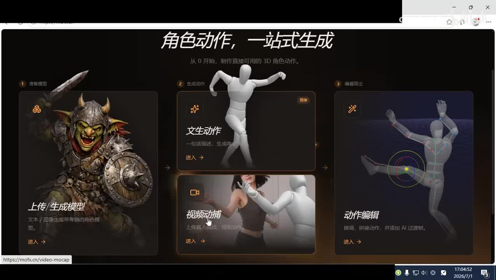
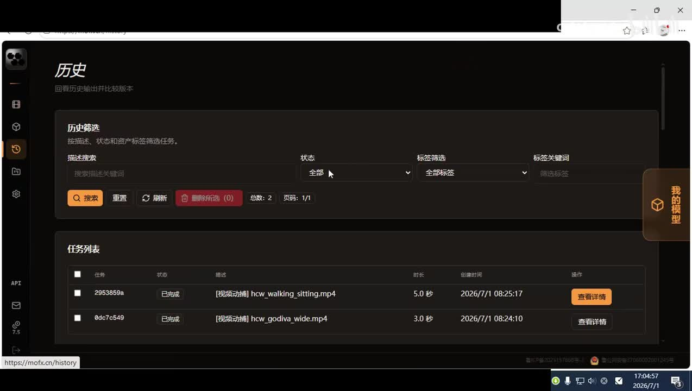
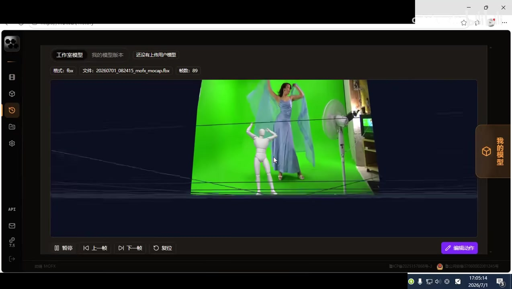

# AI 来了 动画师咋办

> 来源：[Bilibili 视频](https://www.bilibili.com/video/BV1HkNK6iEiv) 
> UP 主：cclylaoshi | 发布时间：2026-07-12 | 视频时长：72

## 小结

本视频演示了 MOFX 平台提供的“视频动捕”功能，展示了动画师如何通过上传真人参考视频，利用 AI 自动生成 3D 角色动作（导出为 FBX 格式）。视频的核心经验在于：在使用此类 AI 动捕工具时，**拍摄参考视频必须保持摄像机绝对稳定**。如果镜头移动，AI 将无法区分人物运动与镜头运动，导致生成的骨骼动画出现严重抖动。该工具适合快速提取基础动作或进行初步预览，但最终结果通常仍需动画师进行手动微调（如修复四元数乱跳等问题），AI 目前无法完全替代动画师的后期修动作工作。

## 思维导图

## 目录

- [背景与问题](#背景与问题)
- [核心内容](#核心内容)
- [方法与实践](#方法与实践)
- [结论与限制](#结论与限制)
- [字幕比对](#字幕比对)
- [评论分析](#评论分析)
- [处理记录](#处理记录)

## 背景与问题

[00:00](https://www.bilibili.com/video/BV1HkNK6iEiv?t=0) 随着 AI 技术的发展，动画行业的门槛正在发生变化。视频开篇指出“AI 来了，动画师会打字，会表演就行了”，这意味着传统的按键式关键帧动画正在被 AI 辅助生成所冲击。UP 主演示了 MOFX（mofx.cn）平台的“角色动作，一站式生成”功能，其中“视频动捕”模块允许用户直接上传真人视频来提取动作，从而大幅简化 3D 角色动画的制作流程。

> 图：展示了 MOFX 平台的角色动作生成流程，包括准备模型、生成动作（文生动作/视频动捕）和动作编辑。这是本视频演示的工具基础界面。

## 核心内容

[00:06](https://www.bilibili.com/video/BV1HkNK6iEiv?t=6) UP 主进入平台的“历史”页面，展示了之前测试的两个视频动捕任务。任务列表显示了两个已完成的 MP4 文件：`hcw_walking_sitting.mp4`（5.0 秒，走路然后坐下）和 `hcw_godiva_wide.mp4`（3.0 秒，动作较简单）。UP 主提到其中一个是因为误操作上传的简单动作，主要用于对比或作为反面教材。

> 图：MOFX 的历史任务页面，显示了两个已完成的视频动捕任务及其时长和创建时间，证明了该工具可以批量处理并保存生成结果。

[00:40](https://www.bilibili.com/video/BV1HkNK6iEiv?t=40) 在预览界面中，可以看到参考视频（绿幕前穿着蓝裙子的女性）与生成的 3D 白色人偶动作的实时对比。生成的动作格式为 FBX，包含 89 帧数据。UP 主评价前半段效果“还是比较不错的”，人物成功完成了走路和坐下的动作。

> 图：动捕预览界面，左侧为参考视频（绿幕），右侧为生成的 3D 骨骼动画。直观展示了 AI 如何将 2D 视频中的运动映射到 3D 模型上。

## 方法与实践

[00:44](https://www.bilibili.com/video/BV1HkNK6iEiv?t=44) 在预览生成的动作时，UP 主指出了一个常见问题：动作在后期出现了明显的“颤动”或“抖动”。他分析了原因并给出了拍摄参考视频的核心建议：

1. **保持摄像机稳定**：在拍摄用于 AI 动捕的参考视频时，**尽量保持摄像机绝对静止**。
2. **避免镜头移动**：如果拍摄时摄像机发生移动，AI 系统会产生混淆，无法准确区分“人物自身的运动”和“摄像机视角的运动”。
3. **结果表现**：这种混淆会导致系统错误地将镜头的晃动解析为人物的肢体抖动，从而在生成的 FBX 动画中表现为不自然的颤动。

[01:03](https://www.bilibili.com/video/BV1HkNK6iEiv?t=63) 如果用户对生成的动作满意，可以直接下载 FBX 文件，然后导入到 Maya、Blender 等主流 3D 软件中，绑定到目标角色模型上使用。

## 结论与限制

- **适用场景**：适合需要快速生成基础动作、进行动作预览或提取简单日常动作（如走路、坐下）的场景。
- **核心限制**：对参考视频的拍摄质量要求极高，**严禁手持拍摄或镜头移动**，否则生成的动画质量会大幅下降。
- **后续工作**：AI 生成的动作并非“即插即用”。正如评论区所指出的，动画师在导入 3D 软件后，往往还需要进行繁琐的手动修复工作（如修复四元数乱跳、清理多余抖动等），AI 目前更多是作为辅助提效工具，而非完全替代动画师。

## 字幕比对

| 字幕来源 | 完整性 | 专有名词 | 时间轴 | 主要问题 |
| --- | --- | --- | --- | --- |
| Bilibili 站内字幕 | 完整 (00:00-01:12) | 准确 (FBX, 3D软件) | 精确 | 无，多语言版本一致，中文翻译自然。 |
| 本次 ASR 字幕 | 缺失 (仅 00:33-01:11) | 基本准确 | 存在 | 覆盖度仅 34%，前 33 秒无语音或未被识别，存在错别字（如“卸载”应为“下载”）。 |

**字幕选择说明**：最终采用 **Bilibili 站内中文字幕 (p01-ai-zh.srt)**。本次 ASR 诊断显示语音覆盖度仅为 0.34，且首次语音识别出现在 33.53 秒，导致前半段关键的操作演示（如点击历史、加载预览）缺乏 ASR 支持。站内字幕时间轴完整且准确，直接用于构建正文时间轴。通过关键帧画面校正了 ASR 将“下载”误识别为“卸载”的问题。

## 评论分析

1. **“我听说过不止一个人说修动作修到道心破碎了[doge]，四元数乱跳见过一次，印象那是非常深刻[doge]”** (4 赞)
   - **观点**：补充了 AI 动捕在实际工程应用中的痛点。即使 AI 生成了动作，导入 3D 软件后仍面临严重的数学问题（如四元数万向节死锁或乱跳），需要动画师耗费大量时间修复。
   - **可信度**：高，符合 3D 动画行业的实际经验。
2. **“还得手修”** (1 赞)
   - **观点**：简短概括了 AI 动捕的局限性，强调目前无法完全自动化，人工干预仍是必要环节。
3. **“老师为啥不用千面做测试”** (0 赞)
   - **观点**：观众提出了替代工具的建议（“千面”可能是指其他动捕或 AI 工具），说明行业内对不同 AI 动捕工具的对比和探索仍在进行中。

## 处理记录

- Worker ID：worker-ms0wgaff-207b656a
- 调用工具与模型：bili-agent-orchestrator / qwen3.7-flash
- 使用的应用工具：ASR 识别、站内字幕提取、关键帧抽取、评论抓取
- 字幕选择：Bilibili 站内中文字幕 (p01-ai-zh.srt)，因 ASR 覆盖度不足 (34%) 且缺失前半段内容。
- 关键帧选择依据：frame-001 展示工具全貌，frame-002 展示历史任务列表，frame-004 展示核心预览效果与绿幕参考对比。
- 清理缓存：已清理临时音频与 ASR 中间文件。
- 未解决问题：无。ASR 前段缺失通过站内字幕完美补全。
