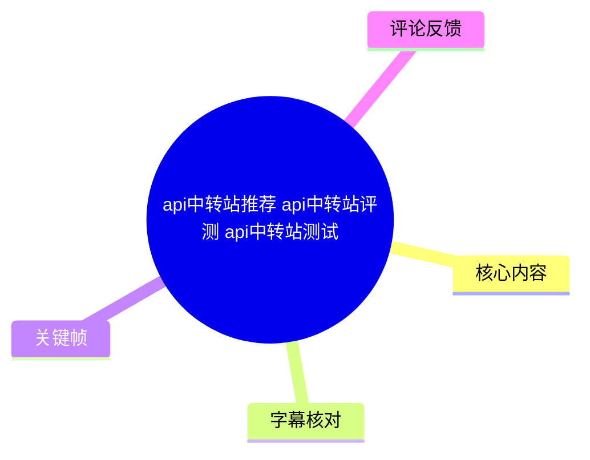
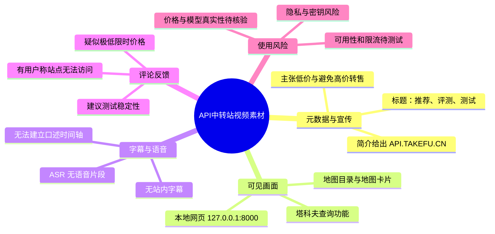
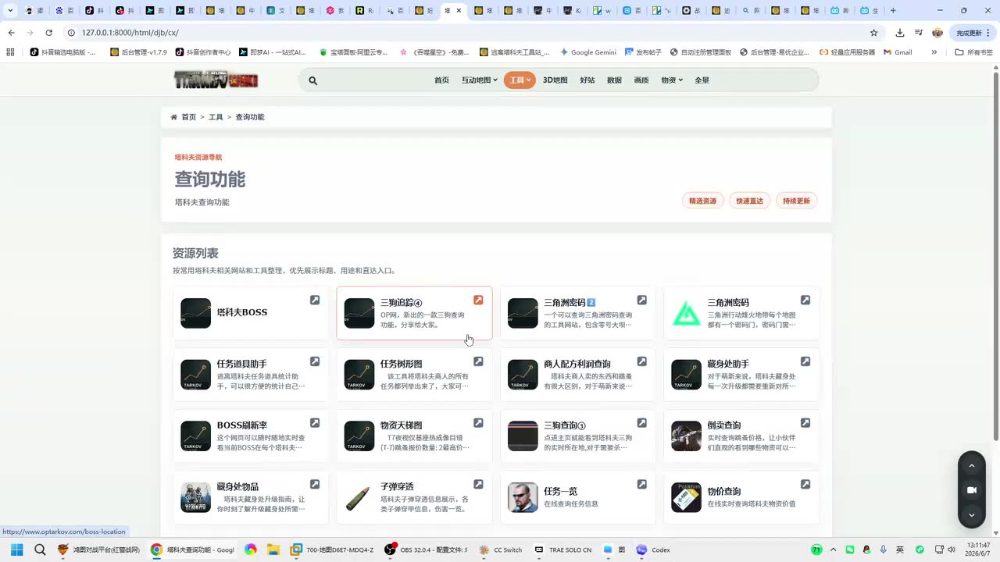
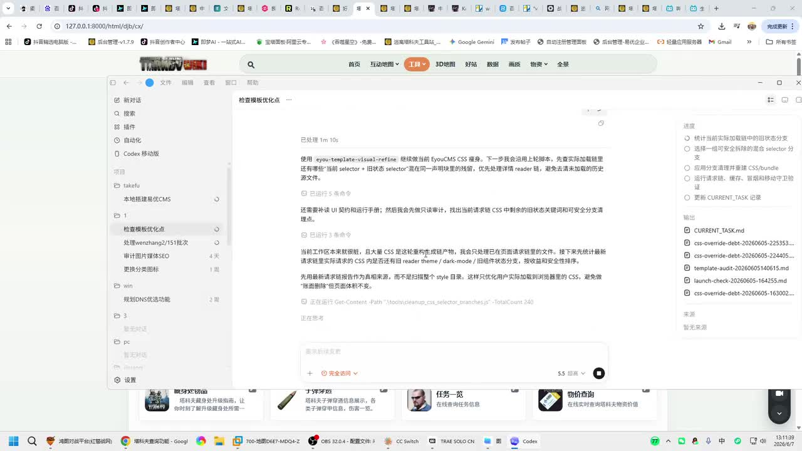
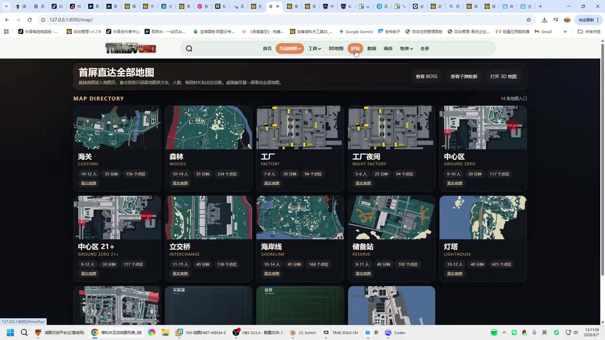
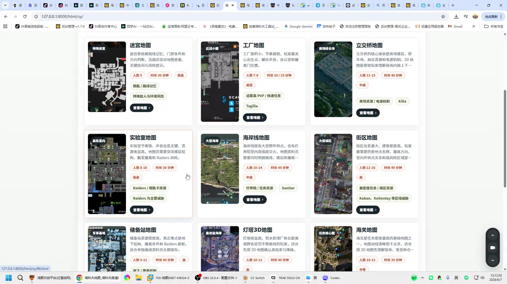

# api中转站推荐 api中转站评测 api中转站测试

> 来源：[Bilibili 视频](https://www.bilibili.com/video/BV1ZVEs6LExe)  
> UP 主：生于忧患死于忧患｜时长：1 分 52 秒｜分辨率：1920×1080  
> 标签：`api`、`中转站`

## 小结

视频标题、简介将内容定位为“API 中转站推荐、评测与测试”。简介明确给出了注册域名 `API.TAKEFU.CN`，并以“价格便宜”“避免大学生被高价转售账号坑害”为主要宣传立场。上述内容均属于 UP 主的推广性陈述，而非本次素材能够独立验证的服务质量结论。

本次可用的站内字幕为空；本次 ASR 也未识别出任何语音片段。ASR 的音频时长为 111.168 秒，接近视频标称 112 秒，但结果中没有文本、没有可用的语义分段，也没有 `noAudioStream=true` 标记。因此，不能据此断言视频没有音轨，只能如实记录为：**素材中存在被提取的音频文件，但自动识别未获得可用语音内容。**

已提供的关键帧画面与标题中的 API 中转站主题并不直接对应：画面主要展示浏览器内一个本地地址 `127.0.0.1:8000` 的网页，包括“塔科夫”相关的查询功能、地图目录和地图卡片。由于缺少画面逐帧时间戳、字幕和可识别语音，无法可靠确定这些页面与 API 服务之间的具体技术关系，也不能把它们解释成 API 中转站的后台、接口文档或性能测试结果。

从评论看，观众最关心的是低价是否真实、站点是否可访问及稳定性。一条评论提到“0.0002 的 gpt”这一疑似限时价格，另一条反馈“网站进不去”，还有评论建议对异常低价服务测试稳定性。这些是用户反馈或建议，不能替代对价格、可用性、模型来源、计费方式与数据安全的实际验证。

适合阅读本文的人群包括：准备使用第三方 API 中转服务的开发者、希望核查低价模型接口风险的用户，以及需要区分“推广信息”“画面证据”“评论反馈”和“已验证事实”的读者。实际接入前，应自行完成连通性、模型一致性、限流、计费、隐私和服务持续性测试。

## 思维导图





## 目录

- [素材范围、背景与时效性](#素材范围背景与时效性)
- [可见画面：查询功能页面](#可见画面查询功能页面)
- [可见画面：地图目录与卡片](#可见画面地图目录与卡片)
- [可执行的 API 中转站核验步骤](#可执行的-api-中转站核验步骤)
- [参数、证据边界与限制](#参数证据边界与限制)
- [字幕比对](#字幕比对)
- [评论分析](#评论分析)
- [处理记录](#处理记录)

## [素材范围、背景与时效性](https://www.bilibili.com/video/BV1ZVEs6LExe?t=0)

### 可确认的元数据

| 项目 | 内容 | 证据状态 |
| --- | --- | --- |
| 视频主题 | API 中转站推荐、评测、测试 | 标题明确写出 |
| UP 主 | 生于忧患死于忧患 | 平台元数据 |
| 时长 | 112 秒 | 平台元数据；ASR 音频时长为 111.168 秒 |
| 注册地址 | `API.TAKEFU.CN` | 视频简介 |
| 宣传观点 | 价格便宜；希望用户不被高价转售账号“坑害” | 视频简介中的 UP 主表述 |
| 互动数据 | 327 播放、10 点赞、4 收藏、6 回复 | 抓取时元数据，可能实时变化 |

### 时效性说明

视频简介中的注册链接、价格暗示和服务状态均具有高度时效性。尤其是第三方 API 中转站的域名解析、库存、价格、可调用模型、速率限制、支付方式和运营状态，都可能在发布后发生变化。

本批素材没有提供可验证的价格页、控制台余额、模型列表、接口请求日志、响应内容、延迟统计、错误率或服务条款。因此不能将标题中的“评测”“测试”视为已经在视频内被完整证明的测试结论。

### 时间轴说明

本次没有站内 SRT，也没有 ASR 语义片段及其起止时间。为避免按文字顺序臆测时间位置，本章及后续章节仅链接至视频入口 `t=0`，**不将任何具体画面内容绑定到未经证实的秒数**。

## [可见画面：查询功能页面](https://www.bilibili.com/video/BV1ZVEs6LExe?t=0)

关键帧显示，浏览器地址栏使用本地地址 `127.0.0.1:8000`。页面顶部存在“首页”“互动地图”“工具”“3D地图”“好站”“数据”“画质”“物资”“全景”等导航项目；页面主体标题为“查询功能”，内容呈现为若干资源或工具卡片。

画面中能辨认出“塔科夫”相关条目，例如“塔科夫BOSS”“三狗追踪”“一分快三地图”“三角洲密码”“任务道具助手”“物资天梯图”“物价查询”等。该页面更像是游戏辅助信息网站的功能导航页，而不是可直接辨认的 API 中转服务控制台。



> 图：该帧的价值在于确认视频画面确实展示了一个本地运行的网页及其功能卡片，但页面中未见可辨认的 API Key、模型名称、请求地址、调用日志、余额或价格信息。因此，它不能作为 API 中转站性能或价格的证据。

另一帧显示网页内的“检查模板优化点”任务/对话界面。中央区域包含关于 CSS、`selector`、`reader`、`dark-mode`、组件状态等文字，右侧为进度或任务输出区域，并可见文件名如 `CURRENT_TASK.md`、`css-override-debt-...`、`template-audit-...`。



> 图：该帧说明画面中存在文本生成或任务协作类界面，但无法从截图辨识其底层模型、调用渠道、是否使用中转 API，或任何模型性能指标。它仅可作为“视频展示过此类本地网页工作界面”的画面证据。

## [可见画面：地图目录与卡片](https://www.bilibili.com/video/BV1ZVEs6LExe?t=0)

另一个关键帧展示“首屏直达全部地图”页面，主体是地图目录卡片。可辨认的地图名称包括“海关”“森林”“工厂”“工厂夜间”“中心区”“中心区 21+”“立交桥”“海岸线”“储备站”“灯塔”等；每张卡片还显示人数、时长、点位数量等标签。



> 图：该帧的价值在于记录了视频中较完整的网站信息架构：页面并非单一 API 文档，而是包含地图内容目录。不过，关键帧没有附带时间戳，不能据此确定其在 112 秒视频中的准确播放秒数。

还有一帧展示白色背景的地图介绍卡片，能看到“迷宫地图”“工厂地图”“立交桥地图”“实验室地图”“海岸线地图”“街区地图”“储备站地图”“灯塔3D地图”“海关地图”等项目。卡片中可见“人数”“时长”“难度”与“查看地图”等信息。



> 图：该帧补充展示了地图站点的内容组织方式及部分可见参数（如人数、时长、难度）。这些参数属于画面中的游戏地图信息，**不是** API 中转站的调用参数、模型规格或性能数据。

### 对画面与标题关系的谨慎判断

素材允许确认：视频画面中出现了上述本地网页和游戏地图相关页面。素材不允许确认：

1. 该本地网页是否由 `API.TAKEFU.CN` 提供服务；
2. 该网页是否使用任何特定大模型、接口供应商或中转服务；
3. 页面中的任务/对话结果是否来自标题所指的 API；
4. 视频是否曾展示过 API 调用、充值、模型选择、测速或错误处理，只是这些内容未被所给关键帧和字幕资料保留。

因此，画面与标题之间只能记录为“现有素材存在主题不一致或证据链不完整的情况”，不应强行补全技术故事。

## [可执行的 API 中转站核验步骤](https://www.bilibili.com/video/BV1ZVEs6LExe?t=0)

以下步骤是基于本视频“低价 API 中转站”主题整理的通用核验流程，**不是视频已展示的操作流程**。它用于将简介宣传和评论反馈转化为可复现的检查。

### 1. 先检查访问与账户基础状态

1. 在隔离浏览器环境打开简介中的域名 `API.TAKEFU.CN`。
2. 确认 HTTPS 证书、域名拼写、跳转目标和登录页归属。
3. 不要在未确认主体、条款和支付方式前充值或提交主账号凭据。
4. 若站点无法访问，记录访问时间、HTTP 状态码、DNS 解析结果与地区网络环境；不要只用一次打不开就推断服务永久失效。

评论中已有“网站进不去呀”的反馈，说明可访问性是优先核验项，但该评论未提供访问时间、网络区域或错误信息，不能进一步定位原因。

### 2. 使用最小权限密钥进行连通性测试

建议创建可独立撤销、限额极低的测试密钥；不要把个人生产密钥放进第三方网页、聊天截图或公开仓库。

可按服务文档实际接口格式进行最小请求。若服务声称兼容 OpenAI 风格接口，常见请求形态可能类似：

```bash
curl https://<服务实际域名>/v1/models \
  -H "Authorization: Bearer <测试密钥>"
```

随后以服务实际支持的模型名发起一条低成本请求：

```bash
curl https://<服务实际域名>/v1/chat/completions \
  -H "Content-Type: application/json" \
  -H "Authorization: Bearer <测试密钥>" \
  -d '{
    "model": "<服务实际模型名>",
    "messages": [
      {"role": "user", "content": "请仅回复：连通测试成功"}
    ],
    "temperature": 0
  }'
```

上述路径、认证头和 JSON 字段仅是“可能兼容 OpenAI 风格服务时”的示例；本视频素材没有提供真实接口基址、模型 ID 或认证规则，不能替视频填入具体参数。

### 3. 验证模型与响应一致性

不要仅凭返回了 HTTP 200 或页面显示“成功”就认定模型符合宣传。至少检查：

- 返回中的 `model` 字段是否与请求一致；
- 是否存在明显的模型降级、替换或“同名不同模型”情况；
- 对固定提示词重复调用时，结果、格式与延迟是否异常波动；
- 长上下文、工具调用、流式输出、图像输入等能力是否确实可用；
- 错误时是否给出可诊断的状态码与错误信息；
- 账单消耗是否与请求 token、模型单价和服务公告一致。

### 4. 测试稳定性，而不是只测试单次成功

“价格低得离谱的建议还是去测试一下稳定性吧”是热评中的合理风险提示。可将稳定性拆分为以下可量化项目：

| 项目 | 建议记录方式 | 目的 |
| --- | --- | --- |
| 成功率 | 固定次数请求中的成功次数 / 总次数 | 排查偶发失败 |
| 首字节时间 | 流式响应从请求发出到首个 token 返回的时间 | 观察交互等待 |
| 总耗时 | 请求开始到完整响应结束 | 观察吞吐与拥塞 |
| 状态码分布 | 记录 2xx、4xx、5xx、429、超时 | 判断限流与服务端故障 |
| 时段差异 | 分别在高峰、低峰重复测试 | 判断容量稳定性 |
| 余额一致性 | 请求前后读取用量/账单 | 核验计费可信度 |

测试期间应控制变量：固定模型、固定提示词、固定最大输出长度、固定并发数和固定网络环境。否则不同模型、不同输入规模或网络波动会混入结果，导致“稳定性”结论不可比较。

### 5. 处理低价宣传时的风险控制

视频简介对低价持明显正面态度，但低价本身不说明服务合法、稳定或适合生产使用。接入前应特别检查：

- 是否公开运营主体、服务协议、隐私政策和退款规则；
- 密钥是否可以随时撤销，是否支持额度和来源 IP 限制；
- 请求内容是否会被记录、留存或用于训练；
- 是否有明确的数据删除和安全事件通知机制；
- 价格是否注明币种、单位、输入/输出 token 区别、缓存价格与附加费；
- 是否说明上游来源、模型版本与可用区域；
- 当服务停止、域名失效或账户受限时，是否有迁移方案。

## [参数、证据边界与限制](https://www.bilibili.com/video/BV1ZVEs6LExe?t=0)

### 素材中可见或可确认的参数

| 参数 | 数值或内容 | 说明 |
| --- | --- | ---|
| 视频标称时长 | 112 秒 | 平台元数据 |
| ASR 输入音频时长 | 111.168 秒 | ASR 覆盖诊断 |
| 视频分辨率 | 1920×1080 | 平台元数据 |
| ASR 模型 | `medium` | 本次处理记录 |
| ASR 请求语言 | `auto` | 本次处理记录 |
| ASR 检测语言 | `en`，概率 0.541015625 | 自动检测结果，不代表视频实际语言 |
| ASR 语音片段数 | 0 | 无可用转写 |
| 评论抓取数量 | 3 条 | 仅有可获取热评前三条 |

### 不可从素材确认的关键事项

以下项目均未在可用字幕、ASR 文本或所给关键帧中得到可靠佐证：

- API 中转站的实际接口地址；
- 可调用的模型名、模型版本与上游供应商；
- 价格、折扣、计费单位和“0.0002”的具体含义；
- 注册后是否可获得免费额度；
- 请求并发、RPM、TPM、上下文长度、文件大小等限制；
- 接口延迟、成功率、可用区、稳定性与 SLA；
- 数据留存、隐私保护、密钥管理与退款政策；
- 视频中网页与简介域名之间的服务关系。

因此，本文不对该服务作“推荐”“可用”“稳定”“便宜”或“安全”的结论。

## [字幕比对](https://www.bilibili.com/video/BV1ZVEs6LExe?t=0)

| 字幕来源 | 完整性 | 专有名词 | 时间轴 | 主要问题 |
| --- | --- | --- | --- | --- |
| Bilibili 站内字幕 | 无可用字幕 | 无法核对 | 无 | 素材明确说明未提供可用站内字幕 |
| 本次 ASR 字幕 | 空 | 无法识别或校正 | 无可用语义分段 | `medium` 模型未识别出任何语音片段；`sentenceCount=0`、`speechSeconds=0`、`speechCoverage=0` |

### 最终字幕选择与校正方式

本次没有可采用的字幕文本，不能形成基于口述内容的逐段转写或精确时间轴。

ASR 诊断警告为“未识别到语音片段，应检查源音频是否包含可听语音或使用正确音轨”。但诊断中**没有** `noAudioStream=true` 标记，因此不能称源视频“没有音轨”；应准确表述为“提取到音频文件，但 ASR 未获得文本结果”。

本文采用的内容证据优先级如下：

1. 平台元数据与视频简介；
2. 已提供的关键帧可见文字和界面；
3. 可获取热评前三条；
4. 明确标注为通用建议的核验步骤。

关键帧能校正或确认的文字主要包括：本地地址 `127.0.0.1:8000`、页面“查询功能”、地图页面“首屏直达全部地图”、部分地图名称及“查看地图”等。它们不能校正 API 域名、模型名、价格、调用参数等未出现在画面中的信息。

## [评论分析](https://www.bilibili.com/video/BV1ZVEs6LExe?t=0)

仅分析本次可获取的热评前三条。评论是个人陈述，不作为服务状态或价格的已验证事实。

| 评论者 | 点赞 | 评论要点 | 可提供的线索 | 可信度与边界 |
| --- | ---: | --- | --- | --- |
| 小马驹派派营 | 1 | 提到“限时0.0002的gpt”，并以调侃口吻称可体验后离开 | 疑似存在极低的限时定价宣传 | 未说明币种、计费单位、模型、时间、入口或实际成交情况；不能据此确认价格 |
| kirtestore | 0 | “网站进不去呀” | 提示某次访问中可能存在可用性问题 | 未提供具体时间、地区、设备、网络、错误页或状态码；不能推断普遍或持续宕机 |
| 云间走神 | 0 | 建议对“价格低得离谱”的服务测试稳定性 | 提出应优先核验稳定性的风险意识 | 属于合理建议而非实测数据；没有提供成功率、延迟或故障记录 |

评论整体反映出两类信号：一是低价具有吸引力，二是访问和稳定性存在待验证风险。对于生产环境，合理做法不是依赖单条评论或单次访问，而是进行多时段、可记录、可复测的连通性与计费测试，并保留备用服务路径。

## [处理记录](https://www.bilibili.com/video/BV1ZVEs6LExe?t=0)

- Worker ID：`worker-mrj0www4-e8d79408`
- 生成模型：`gpt-5.6-terra`
- 素材处理模型：ASR `medium`，设备 `cuda`，计算类型 `float16`
- 使用的素材工具产物：视频元数据、`audio/audio.wav`、ASR 诊断与结果、关键帧目录、评论 JSON、封面与站内字幕检索结果。
- 字幕检查：
  - Bilibili 站内字幕：未提供可用字幕；
  - 本次 ASR：已检查，结果为空，`segments=[]`；
  - ASR 检测语言为英语（概率 0.541015625），但未形成文本，不能据此判断实际语种；
  - 未发现 `noAudioStream=true`，故未将问题归因为“源视频没有音轨”。
- 字幕选择：无可用字幕可合并；正文仅依据元数据、简介、关键帧和评论，并将无法确认的内容明确标为限制。
- 关键帧选择依据：
  - `frames/frame-001.jpg`：展示任务/对话和 CSS 模板优化界面，可说明存在本地网页工作流画面；
  - `frames/frame-002.jpg`：展示“查询功能”及多个工具卡片，可说明页面内容范围；
  - `frames/frame-003.jpg`：展示完整地图目录结构；
  - `frames/frame-004.jpg`：展示地图卡片中的人数、时长、难度等可见字段；
  - 未把关键帧中不可辨认或未给出时间信息的内容延伸为 API 性能结论。
- 时间轴依据：由于站内 SRT 缺失、ASR 无起止文本分段、关键帧未附逐帧时间戳，未伪造具体秒数；各章节仅使用视频入口 `t=0` 链接。
- 缓存清理：本任务提供的素材清单未包含缓存清理执行日志；未获得可验证的清理结果，故不声称已完成清理。
- 未解决问题：
  1. 视频实际音轨中是否含有人声、背景音或无法被当前 ASR 识别的内容；
  2. 关键帧所示本地网页与简介域名 `API.TAKEFU.CN` 的关系；
  3. 服务的真实价格、模型来源、访问状态、限流和隐私政策；
  4. 标题所称“评测”“测试”的具体方法、数据和结论。

## 评论分析

- 热评 1：限时0.0002的gpt来看蹬下，蹬完跑了也行[吃瓜]
- 热评 2：网站进不去呀
- 热评 3：价格低得离谱的建议还是去测试一下稳定性吧

以上内容是观众反馈摘录，只用于补充理解视频反响，不作为正文事实依据。
