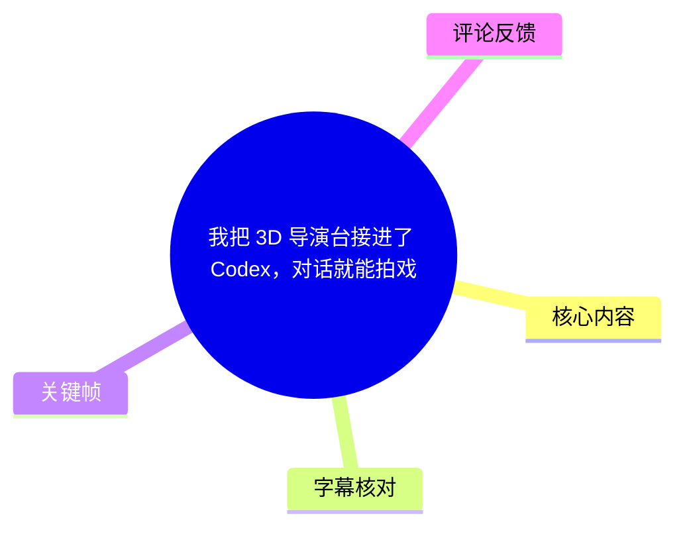
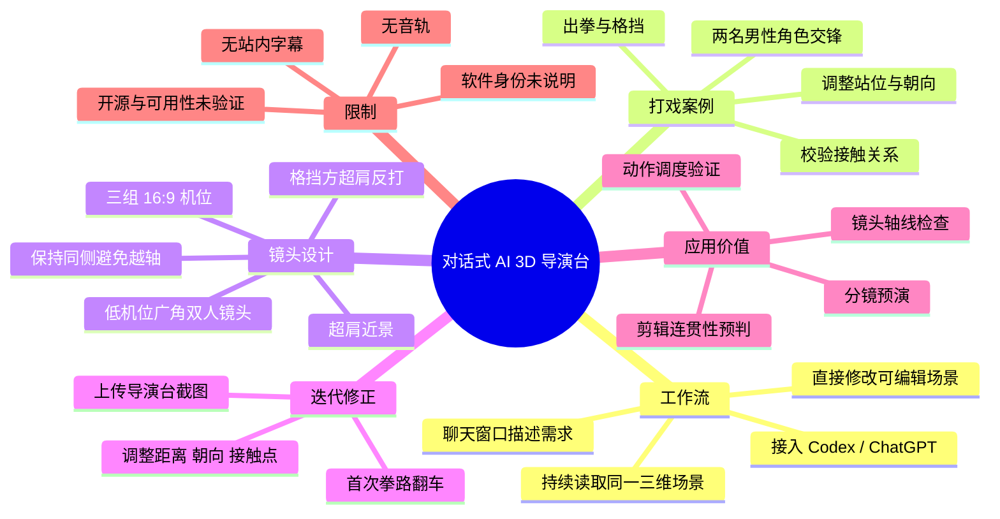
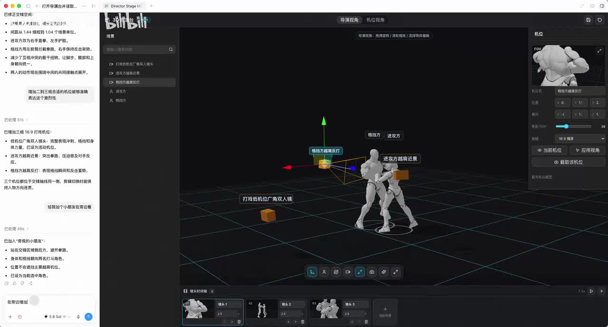
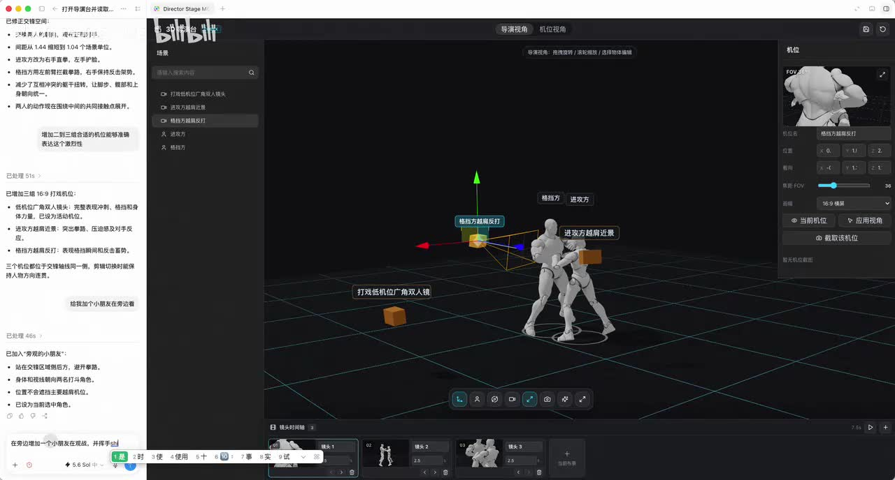
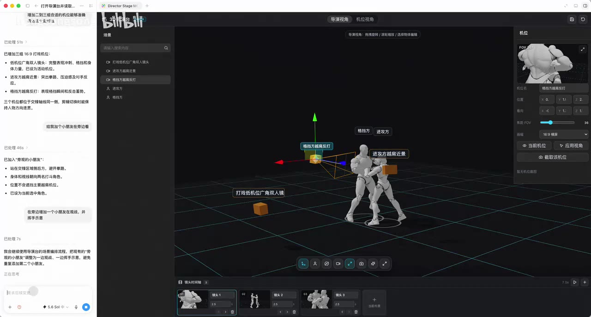

# 我把 3D 导演台接进了 Codex，对话就能拍戏

> 来源：[Bilibili 视频](https://www.bilibili.com/video/BV1pLNq6xEvM) 
> UP 主：chongsongsong｜时长：1 分 52 秒｜标签：短剧创作、AI 导演、电影分镜、Codex、镜头设计

## 小结

视频展示了一个被接入 Codex / ChatGPT 工作流的 AI 3D 导演台：创作者不必在多个软件间来回切换，也无需手动完成全部复杂的三维操作，而是在聊天窗口用自然语言描述场景、角色、动作与镜头需求，由 AI 持续读取并修改同一个可编辑的 3D 场景。

案例围绕一段打戏展开。根据视频简介与界面画面，创作者先让系统增加两名正在交锋的男性角色，再要求进攻方出拳、另一方格挡；随后添加三组表现激烈感的机位，最后加入一名挥手观战的小朋友并为其安排特写。界面中可以看到两名灰色人形角色、角色标签、机位图标及底部镜头时间线。

该工作流的核心不在于“根据一句话生成一张图片”，而在于以对话连续驱动真实三维场景：可添加和选择角色、调整站位和朝向、设计动作与接触关系、建立广角/近景/正反打机位，并检查镜头轴线和空间关系。视频强调，场景可以被反复读取、诊断和修正。

创作者明确提到首次设计打戏时曾出现人物朝向和拳路不正确的问题；其解决方式是把导演台截图发回对话，让 AI 根据当前画面重新调整人物间距、身体方向与格挡接触点。这说明该流程仍需要人类通过画面复核结果，而不是一次自然语言指令即可保证动作关系正确。

画面展示的导演台界面右侧有镜头预览与参数区，能看到 `FOV 36`；底部至少有 3 个镜头卡片，且界面文字显示新增了“三组 16:9 打戏机位”。这些是视频案例中的具体可见设置，不应泛化为所有软件或所有项目的固定参数。

本视频没有音轨，且未提供可用的 Bilibili 站内字幕。因此不能依据语音或 SRT 将每个操作精确定位到视频秒数。下文所有时间轴链接统一指向视频起点，并将聊天窗口中“已处理 51s / 46s / 7s / 15s”等数字视为界面任务处理时长，而非视频播放时间。工具名称、是否开源、具体可安装方式、价格、模型权限和真实项目稳定性，视频素材均未给出结论。

## 思维导图

## 目录

- [背景：从聊天指令到可编辑 3D 场景](#背景从聊天指令到可编辑-3d-场景)
- [打戏场景的角色、动作与空间调度](#打戏场景的角色动作与空间调度)
- [三组 16:9 打戏机位与轴线控制](#三组-169-打戏机位与轴线控制)
- [加入观战小朋友：背景角色也要服务构图](#加入观战小朋友背景角色也要服务构图)
- [截图反馈与迭代修正](#截图反馈与迭代修正)
- [可复用的操作步骤](#可复用的操作步骤)
- [参数、限制与时效性](#参数限制与时效性)
- [字幕比对](#字幕比对)
- [评论分析](#评论分析)
- [处理记录](#处理记录)

## 背景：从聊天指令到可编辑 3D 场景 [00:00](https://www.bilibili.com/video/BV1pLNq6xEvM?t=0)

视频主张把一个“AI 3D 导演台”整合进 Codex / ChatGPT 工作流。其目标是降低三维预演的交互门槛：用户直接用聊天语言表达导演意图，AI 据此读取当前场景状态并操作导演台，而不是让用户在建模、角色、动画、摄影机等多个软件界面中逐项处理。

从视频简介可整理出该流程声明支持的操作范围：

- 添加与选择 3D 角色；
- 调整角色位置、相互距离和身体朝向；
- 设计肢体动作及角色之间的接触关系；
- 创建广角、特写、正反打等摄影机；
- 检查镜头轴线与空间关系；
- 在后续轮次持续读取、修改同一个场景。

这里的关键区别是“场景状态持续存在”。如果每次指令都只生成独立图像，那么角色、站位、镜头和动作关系难以稳定继承；而视频所展示的目标是让同一场三维调度可以累积修改，供后续分镜、动画或视频制作前预演。

> 图：画面左侧为聊天记录，中间为带网格地面的 3D 场景，两个人形角色处于对抗姿势，场内标注了“格挡方”“进攻方”“进攻方右腿前近景”等标签。该帧证明视频展示的是可见的三维场景和摄影机对象，而不仅是文本或静态生成图。

## 打戏场景的角色、动作与空间调度 [00:00](https://www.bilibili.com/video/BV1pLNq6xEvM?t=0)

视频简介给出的打戏指令顺序是：

1. “增加两个正在交锋的男性角色。”
2. “让进攻方出拳，另一方格挡。”
3. “增加三组能表现激烈感的机位。”
4. “旁边再加一个挥手观战的小朋友。”
5. “给小朋友来一个特写。”

在当前画面中，两名灰色人形角色相对站立，其中一人有前伸动作，另一人以手臂接近对方动作路径的姿态进行防守。界面标签将角色区分为“进攻方”和“格挡方”，从而为后续指令中的镜头选择、动作修正与角色关系提供对象引用。

视频描述的动作设计并不止于让角色摆出“打斗姿势”，还包括：

- 进攻方的拳路是否指向合理；
- 格挡方是否处于能够防守的位置；
- 人物间距是否足以形成接触关系；
- 身体朝向是否让力量方向和人物对抗关系成立；
- 机位是否可以清楚说明进攻、防守和反应。

这类判断属于导演预演和动作调度问题，不等同于最终动画质量。视频的价值在于先在三维空间中确认关系是否成立，再进入正式拍摄、动画制作或生成视频阶段。

> 图：该帧清楚显示两名角色之间的对抗姿态、场景中的摄影机/机位辅助图形，以及“格挡方右臂反打”“进攻方右腿前近景”等对象标签。标签将角色动作、镜头用途和空间位置关联起来，有助于检查镜头到底在拍谁、拍什么动作。

## 三组 16:9 打戏机位与轴线控制 [00:00](https://www.bilibili.com/video/BV1pLNq6xEvM?t=0)

画面左侧的执行结果显示，系统已增加“三组 16:9 打戏机位”。其中列出的机位用途为：

| 机位 | 画面与叙事用途 | 视频中可见的设计意图 |
| --- | --- | --- |
| 低机位广角双人镜头 | 同时容纳双方角色 | 完整表现冲刺、格挡与身体力量，作为建立打斗空间的画面 |
| 进攻方超肩近景 | 以进攻者视角强调攻击 | 突出拳路、压迫感及对手反应 |
| 格挡方超肩反打 | 以防守者视角回应攻击 | 表现格挡瞬间及后续反击蓄势 |

界面还说明：三个机位都保持在“同一侧”，以便剪辑切换时保持人物方向连贯。这对应影视摄影中的轴线原则：若镜头随意越过两名对手之间的动作轴，角色的左右位置和运动方向可能在剪辑中发生反转，使观众误判人物关系或拳路方向。

因此，该案例不是简单地堆叠“广角 + 特写”，而是将机位分工与剪辑连续性绑定：

- **广角双人镜头**负责交代双方距离、位置和整体力量关系；
- **超肩近景**负责把观众带入其中一方的主观压力或动作细节；
- **反打镜头**负责展示被攻击者的防守、受力或准备反击；
- 三者同侧布置，使切换仍维持一致的屏幕方向。

右侧摄影机面板可见 `FOV 36`，顶部有“导演视角 / 机位视角”切换，底部有镜头时间线卡片。该参数和界面状态仅能说明本案例正在以这一视场角和多镜头编排方式工作；视频没有交代焦距换算、相机传感器规格，也没有解释 `36` 是否可作为通用推荐值。

> 图：底部时间线可见至少 3 个镜头卡片，右侧为机位参数面板，面板中可见 `FOV 36`，并有“当前机位”“应用视角”“截取该机位”等控件。它直观呈现了对话结果会落到可调整的机位对象与镜头序列中。

## 加入观战小朋友：背景角色也要服务构图 [00:00](https://www.bilibili.com/video/BV1pLNq6xEvM?t=0)

在打戏主体和基础机位完成后，创作者继续要求“在旁边增加一个小朋友在观战，并挥手示意”。界面返回的执行结果明确列出该角色的布置原则：

- 放置在交锋区域后方，避开拳路；
- 身体和视线朝向两名打斗角色；
- 位置不会遮挡主要构图；
- 已设为当前选中角色。

这部分体现出背景角色不能仅按“场景里多一个人”处理。它至少涉及三项导演判断：

1. **安全与动作空间**：观战者不能进入角色攻击或移动的主要区域，否则会破坏动作逻辑。
2. **视线引导**：观战者面对打斗双方，可使其视觉行为与叙事事件一致。
3. **构图层次**：背景角色必须避免遮住打斗主体或关键动作线，同时可增加场景深度与反应信息。

视频简介还提出“给小朋友来一个特写”。素材截图未展示该特写最终画面，因此只能确认这是创作者提出的后续需求，不能断言特写机位已成功生成或已完成具体构图。

> 图：左侧聊天区可见“在旁边增加一个小朋友在观战，并挥手示意”的指令及系统处理文字；中间仍保留打戏场景、对象标签和镜头布置。该帧的价值在于说明新增角色是在已有场景上继续编辑，而非另起一个独立画面。

## 截图反馈与迭代修正 [00:00](https://www.bilibili.com/video/BV1pLNq6xEvM?t=0)

创作者在视频简介中说明，第一次设计打戏时出现过“人物朝向和拳路翻车”的情况。其采用的修正机制是：

1. 查看当前导演台场景；
2. 将导演台截图发送回对话；
3. 由 AI 识别当前画面中的问题；
4. 重新调整人物间距、身体朝向和格挡接触点；
5. 再继续镜头和角色的后续安排。

这一机制的实际意义是把视觉检查重新纳入对话闭环。自然语言指令可能存在歧义，例如“出拳”没有天然限定出拳手、击打方向、距离、受力姿态和防守手位；而截图可以让模型看到实际几何关系，帮助其针对画面纠偏。

但需要区分视频陈述与尚未验证的能力边界：

- **视频明确陈述**：AI 可以在截图反馈后调整距离、朝向和格挡接触点。
- **画面可见事实**：界面中存在对象标签、3D 人物、机位标记、镜头卡片及聊天记录。
- **不能由本素材确认的部分**：系统是否具备物理碰撞检测、骨骼运动学约束、自动防穿模能力、动作质量评估标准，以及对复杂多人动作的稳定性。

## 可复用的操作步骤 [00:00](https://www.bilibili.com/video/BV1pLNq6xEvM?t=0)

以下步骤依据视频案例整理，适合作为使用类似“对话 + 3D 导演台”工具时的工作顺序；其中的具体工具名称、命令格式和权限配置未在视频中公开。

### 1. 先建立角色关系，而不是先追求镜头

用自然语言明确角色数量、身份和当前关系。例如本例先定义两名交锋的男性角色，再指定一方为进攻方、另一方为格挡方。

应尽量补充的约束包括：

- 谁主动进攻、谁被动防守；
- 角色相对朝向；
- 两人的前后/左右站位；
- 这段动作的开始与结束状态；
- 是否存在第三人及其与主动作区的距离。

### 2. 让动作需求落到可检查的空间关系

把“出拳、格挡”拆解为可验证的关系：

- 进攻肢体的运动方向；
- 防守肢体的拦截位置；
- 拳与格挡点之间是否形成合理接近或接触；
- 双方躯干、脚步与重心方向是否支持该动作；
- 角色间距是否过远、过近或造成视觉穿插。

若出现拳路错误、朝向相反或接触点不成立，不应仅重复原句指令，而应提供当前导演台截图并要求针对问题重调。

### 3. 先用双人广角锁定空间，再补近景与反打

本例中的机位层级可复用为：

1. 建立低机位广角双人镜头，交代人物关系和整个动作；
2. 添加进攻方超肩近景，突出拳路、力量和压迫；
3. 添加格挡方超肩反打，展示防守反应及可能的反击蓄势；
4. 让机位尽量位于动作轴同侧，再检查角色屏幕方向能否在剪辑中保持一致。

### 4. 加入背景人物时检查遮挡和视线

加入观战者、路人或其他环境角色后，逐项检查：

- 是否站进主角动作路线；
- 是否挡住打斗主体或关键肢体；
- 角色视线是否指向事件中心；
- 该角色是否需要独立反应镜头；
- 新角色的存在是否改变原有构图平衡。

### 5. 在进入正式制作前完成预演验证

视频将该导演台定位为正式拍摄、制作动画或生成视频之前的验证层。可重点核验：

- 人物站位是否合理；
- 动作是否真实形成接触关系；
- 镜头能否传递情绪与力量；
- 正反打是否越轴；
- 多个镜头剪辑后是否保持叙事和方向连贯。

## 参数、限制与时效性 [00:00](https://www.bilibili.com/video/BV1pLNq6xEvM?t=0)

### 画面可确认的参数与状态

| 项目 | 可确认内容 | 说明 |
| --- | --- | --- |
| 视频时长 | 112 秒 | 来自视频元数据 |
| 项目画幅 | 16:9 | 界面执行结果写有“三组 16:9 打戏机位” |
| 机位数量 | 至少 3 组打戏机位 | 包括低机位广角、进攻方超肩近景、格挡方超肩反打 |
| 可见视场角 | `FOV 36` | 右侧机位面板可见；未说明单位或通用性 |
| 镜头组织 | 底部存在多镜头时间线卡片 | 可见至少 3 个镜头对象 |
| 角色关系 | 进攻方与格挡方 | 由场内标签和视频简介共同支持 |

### 视频未说明的限制

以下问题在现有素材中没有答案，不能据此视频自行补全：

- “导演台”究竟是哪一款软件、网页应用或私有工具；
- 该工具是否开源、是否可下载、是否需要邀请码或付费；
- Codex 与 ChatGPT 分别以何种方式连接导演台；
- 是否依赖 MCP、浏览器自动化、插件、API 或本地服务；
- 支持哪些 3D 模型格式、动画骨骼格式和导出格式；
- 是否支持多人复杂打斗、真实碰撞、物理模拟或动作捕捉；
- FOV、镜头时长及角色参数是否由模型自动决定，或可由用户精确控制；
- 结果在不同提示词、不同场景下的稳定性和可复现性。

### 时效性

视频元数据显示发布时间为 2026 年 7 月。AI 工具、Codex / ChatGPT 功能、第三方集成入口以及开源状态都可能随时间变化。尤其评论区仍在询问“导演台是什么软件”“是否开源”，说明视频本身没有公开足以供观众立即复现的工具信息；在实际采用前，应以 UP 主后续说明、项目官方文档或可验证的发布页面为准。

## 字幕比对 [00:00](https://www.bilibili.com/video/BV1pLNq6xEvM?t=0)

| 字幕来源 | 完整性 | 专有名词 | 时间轴 | 主要问题 |
| --- | --- | --- | --- | --- |
| Bilibili 站内字幕 | 未提供可用字幕 | 无法核验 | 无法使用 | 素材中没有站内 SRT 或字幕文本 |
| 本次 ASR 字幕 | 无语音转写内容 | 无法由 ASR 识别 | 无有效语音分段 | `noAudioStream=true`，源视频没有音频流，ASR 被正确跳过 |

本次 ASR 已检查。诊断结果表明：

- `noAudioStream: true`；
- 语音分段数为 `0`；
- 语音覆盖时长为 `0` 秒；
- ASR 跳过原因是 `NO_AUDIO_STREAM`。

这不是 ASR 工具故障，而是源视频本身不包含音频流。又因未提供站内字幕，本文最终采用以下证据组合：

1. 视频元数据中的标题、简介、标签与时长；
2. 可见关键帧中的聊天内容、场景标签、机位面板与时间线；
3. 热评文本。

由于不存在可直接使用的 SRT 时间段，不能为“增加角色”“创建机位”“加入小朋友”等操作提供可信的精确秒级定位。正文使用的 `[00:00]` 链接仅用于回到视频起点，不代表各段内容发生在第 0 秒。

经关键帧和上下文校正、可较有把握保留的术语包括：`Codex`、`ChatGPT`、`Director Stage`（浏览器标签中可见）、`FOV 36`、`16:9`、进攻方、格挡方、超肩近景、超肩反打。需要注意的是，画面只能证明标签中出现了 `Director Stage`，不能证明其完整产品名、发行方或开源状态。

## 评论分析 [00:00](https://www.bilibili.com/video/BV1pLNq6xEvM?t=0)

仅获取到热评前三条，且三条点赞数均为 0。评论反映的是观众诉求，不构成对软件信息的验证。

| 评论者 | 评论内容 | 可提炼观点 | 可信度与边界 |
| --- | --- | --- | --- |
| 阿莱克喜ALU | “三连求分享” | 观众希望 UP 主分享项目、工具或使用方法 | 未提供具体软件信息，仅表达支持和索取意愿 |
| 学习Key | “导演台是什么软件？” | 视频没有让观众明确识别导演台的具体工具 | 是合理疑问，但评论本身未给出答案 |
| 爱岸宝爱小椿爱洛洛 | “求软件，开源的嘛？” | 观众关心工具获取渠道与开源性质 | 不能据此推断软件已开源或不开源；视频素材也未说明 |

综合来看，评论区最集中的信息缺口是“工具身份”和“获取方式”。这与视频的演示重点一致：它展示了工作流效果，但没有在现有素材中给出可验证的软件名称、安装步骤或开源仓库。

## 处理记录 [00:00](https://www.bilibili.com/video/BV1pLNq6xEvM?t=0)

- Worker ID：`worker-mrj0www4-e8d79408`
- 模型：`gpt-5.6-terra`
- 调用工具与素材范围：视频元数据读取、音频流诊断、ASR 结果检查、关键帧多模态画面理解、热评读取。
- 使用的应用工具：未提供可执行工具调用日志；依据任务提供的 `audio/status.json`、`asr/asr-result.json`、关键帧路径、元数据与评论结果完成整理。
- 字幕选择：未提供可用 Bilibili 站内字幕；本次 ASR 已检查但因源视频 `noAudioStream=true` 被跳过，故不使用 ASR 文本。正文改以视频简介、关键帧画面和元数据为依据。
- 时间轴依据：没有 ASR/SRT 的真实文本时间段可换算；所有章节时间轴链接均保守指向 `t=0`，并明确不将其误作内容精确发生时间。
- 关键帧选择依据：选择 `frame-001.jpg` 至 `frame-004.jpg`，因为这些帧可直接辨认聊天指令、进攻方/格挡方的三维布局、机位标签、镜头时间线、FOV 参数和小朋友观战指令，是支持正文事实的主要视觉证据。
- 未采用的关键帧：素材仅列出了 `frame-005.jpg` 至 `frame-012.jpg` 路径，未附带其画面内容；为避免对未见画面作出推断，未引用。
- 缓存清理：未提供缓存清理执行记录或回执，无法确认是否已清理。
- 未解决问题：导演台具体软件身份、产品归属、开源状态、部署方法、Codex/ChatGPT 接入机制、授权与定价、导入导出能力、复杂场景稳定性，均未能从现有素材验证。

## 评论分析

- 热评 1：三连求分享
- 热评 2：导演台是什么软件？
- 热评 3：求软件，开源的嘛？

以上内容是观众反馈摘录，只用于补充理解视频反响，不作为正文事实依据。
