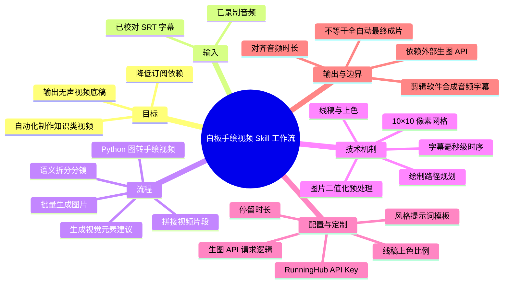
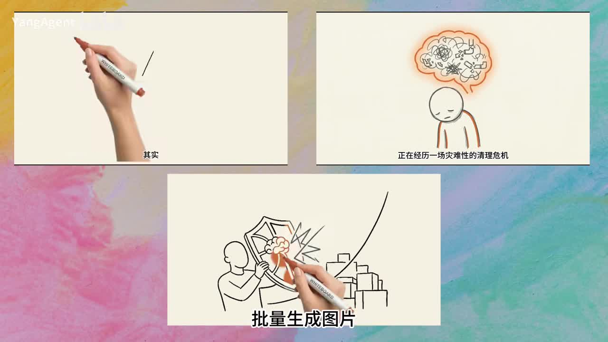
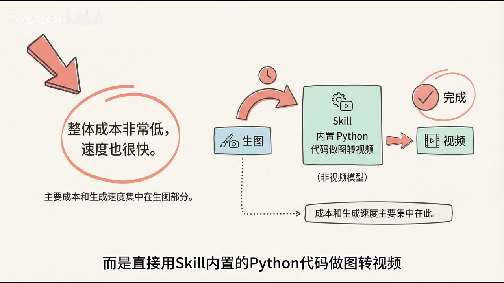

# Skill自动化工作流：抛弃昂贵订阅，爆款白板手绘视频一键生成！

> 来源：[Bilibili 视频](https://www.bilibili.com/video/BV1m3DEBsEtk)  
> UP 主：YangAgent｜时长：10 分 33 秒｜合集：AIcode  
> 抓取时视频数据：播放 20,271、点赞 1,281、投币 1,549、收藏 2,280、评论 1,691（数据抓取于 2026-07-13，后续会变化）。

## 小结

视频介绍了一套面向“白板手绘风格”知识类短视频的 Skill 自动化工作流。其目标是替代或补充订阅价格较高、可定制性有限的白板动画 SaaS：用户提供已校对的 SRT 字幕文件，工作流自动完成语义分镜、批量生图、代码式图转白板手绘动画与片段拼接，输出一条与原音频时长对齐的**无声视频底稿**。

核心设计是把 SRT 当作时序控制中心。SRT 同时包含文本和每句的精确起止时间，因此既能支持 AI 按语义切分相对完整的分镜，也能让每段画面持续时间匹配配音。视频强调：分镜时不仅拆字幕，还要为每段生成视觉元素建议，以降低生图模型脱离上下文后出现画面跑偏的概率。

成本与速度的关键取舍在于：工作流不使用视频生成模型完成图转视频，而是在 Skill 内用 Python 代码将静态图片转换为模拟手绘过程的动画。因此主要成本和生成耗时集中于生图 API；视频中默认使用 RunningHub API 与 `nano-punada2` 生图模型，并以每批 10 张图的方式处理。

工作流包含两个可单独或组合调用的 Skill：其一将任意图片快速转换为白板手绘视频；其二从 SRT 到完整无声视频底稿。视频称其可用于小龙虾、Claude Code、OpenCode、Codex 等 Agent 环境，并支持通过自然语言让 Agent 协助安装、配置和执行。

适合已经拥有录音与字幕、需要批量制作知识科普、读书笔记或教学内容的创作者。它并非真正意义上从文本直接生成最终成片：当前流程的后半段以 SRT 为输入，仍需用户准备或生成音频、导出并校对字幕，最终还要在剪辑软件中合并音频、字幕和视频底稿。

时效与限制方面，视频中提到的 Skill 名称、安装命令、RunningHub API、默认模型、文件路径及 Agent 兼容情况都可能随项目更新而变化；视频没有展示完整安装命令、API 价格、源码、失败案例或实际生成质量的完整对比，部署时应以作者文档和当前接口说明为准。

## 思维导图




## 目录

- [背景、定位与工作流结构](#背景定位与工作流结构)
- [为什么以 SRT 作为输入](#为什么以-srt-作为输入)
- [第一环：语义分镜与视觉建议](#第一环语义分镜与视觉建议)
- [第二环：批量生图与提示词组成](#第二环批量生图与提示词组成)
- [第三环：Python 白板手绘动画机制](#第三环python-白板手绘动画机制)
- [部署、调用与素材准备](#部署调用与素材准备)
- [可修改项与后续扩展](#可修改项与后续扩展)
- [结论、限制与时效性](#结论限制与时效性)
- [字幕比对](#字幕比对)
- [评论分析](#评论分析)
- [处理记录](#处理记录)

## 背景、定位与工作流结构 [00:00](https://www.bilibili.com/video/BV1m3DEBsEtk?t=0)

开场以白板手绘视频的典型表现形式切入：画面中模拟手持马克笔逐步绘制图形，适合用作知识解释、教学或读书笔记的视觉承载。作者的判断是，这类内容容易吸引观众注意力，但现有工具存在两类问题：

1. 白板手绘视频 SaaS 的订阅价格可能较高；
2. 平台化工具可修改的范围有限，难以按个人需求深度定制。

作者因此自行制作了一个 Skill，试图同时满足“低成本、快速、自动化”三项目标。视频所称的“低成本”不是零成本：生图仍需调用 API，成本只是从视频模型生成和订阅服务，转移并集中到图片生成环节。



> 图：关键帧展示了手绘笔、人物线稿及“批量生成图片”等画面元素，直观说明该方案的输出视觉风格与自动化生产目标。它有助于区分“生成白板风格图片”与“让图片呈现逐笔绘制动画”这两个步骤。

工作流拆分为两个 Skill：

| Skill 角色 | 输入 | 输出 | 使用方式 |
| --- | --- | --- | --- |
| 图片转白板手绘视频 Skill | 任意图片 | 白板手绘风格视频片段 | 可独立使用 |
| 完整工作流 Skill | SRT 字幕文件 | 自动分镜、生图、动画片段与拼接后的无声视频底稿 | 可独立使用，也可与前者组合 |

视频称二者均可在小龙虾、Claude Code、OpenCode、Codex 等 Agent 工具中安装和调用。这里的“支持”是作者在视频中的产品说明，具体兼容性仍取决于各 Agent 当前的 Skill 安装机制、运行环境及权限。


> 图：关键帧明确区分“任意图像→白板手绘视频”的快速转换能力和“输入字幕文件→自动分镜、生图、拼接视频”的完整流程，说明模块化设计是该方案可复用和可替换组件的基础。

## 为什么以 SRT 作为输入 [02:05](https://www.bilibili.com/video/BV1m3DEBsEtk?t=125)

作者将制作场景限定为：创作者已经录好了音频，也持有对应字幕文件，但尚未制作画面。该工作流最终生成时长已对齐的无声视频底稿；用户将底稿、原音频和字幕置入剪辑软件合成后即可导出。

从输入 SRT 到输出底稿，共经历三个环节：

```text
SRT 字幕
  → 语义分镜与视觉建议
  → 按分镜批量生成图片
  → 图片转白板手绘视频片段
  → 自动拼接
  → 与配音时长对齐的无声视频底稿
```

作者给出 SRT 作为输入源的两个理由：

- **文本准确性相对更高**：字幕通常已经由创作者检查，尤其是专有名词更不容易在后续视觉生成阶段被误解。
- **内置精确时码**：SRT 记录每段文本的开始与结束时间，可精确到毫秒。每个分镜的时长可以由此继承，从而使视觉片段与音频节奏匹配。

这意味着 SRT 在此不仅是字幕显示文件，更是流程中的结构化脚本与时间轴数据源。若字幕文本错漏、断句不合理或时间轴不准确，后续分镜、画面内容与片段时长都会受到影响。

## 第一环：语义分镜与视觉建议 [03:03](https://www.bilibili.com/video/BV1m3DEBsEtk?t=183)

分镜阶段并不是机械地按每条 SRT 字幕切片。作者通过提示词要求 AI：

1. 按照语义切分字幕；
2. 尽量保持每个片段内容连贯、相对完整；
3. 避免从一句话中间生硬切断；
4. 在切分时通读整份字幕，以获得上下文；
5. 同时为每个分镜生成一段“视觉元素建议”。

每个切分后的片段都对应一个分镜，天然携带来自字幕时间轴的持续时长。后续通常为每个分镜生成一张图片与一段视频。

“视觉元素建议”的作用是把脚本文意和推荐画面元素一并传递给生图模型。例如，单独给模型一句抽象台词时，模型可能无法理解叙述上下文；分镜阶段补充视觉建议后，画面更有机会保持与脚本一致。视频只说明该机制旨在“尽量避免”画面跑偏，并未承诺消除模型幻觉或展示量化准确率。

作者还特别提到，该阶段的关键结果是“分镜描述文件”。由于真正所需的是最终结构化结果，作者让子 Agent 直接给出结果，避免无关的中间思考占用上下文。可迁移的经验是：对于长链路 Agent 工作流，应明确中间产物的格式与职责，控制上下文中无助于下游执行的信息量。

## 第二环：批量生图与提示词组成 [04:12](https://www.bilibili.com/video/BV1m3DEBsEtk?t=252)

图片生成阶段的默认信息如下：

| 项目 | 视频中的说明 |
| --- | --- |
| 默认生图模型 | `nano-punada2` |
| 默认调用方式 | RunningHub API |
| 批处理策略 | 每 10 张图片一组 |
| API 代码 | 作者称已内置在 Skill 中 |
| 目标 | 为每个分镜生成一张符合白板手绘风格的图片 |

生成提示词由三部分拼接：

1. 固定的风格提示词模板；
2. 当前分镜的字幕内容；
3. 当前分镜的视觉元素建议。

作者在默认提示词中要求画面尽量**不要出现文字**。其理由是：白板手绘视频中，画面承担视觉表达，字幕承担文本信息；如果直接把台词堆叠在画面里，整体观感可能变差。这里是作者的审美与设计选择，而不是生图模型的硬性限制；如有品牌标识、术语强调或信息图需求，用户可通过修改提示词改变策略，但也要承担模型文字生成不稳定的风险。



> 图：关键帧以“生图→Skill 内置 Python 代码做图转视频→完成视频”表示处理链路，并标注主要成本与生成速度集中在生图部分。这是理解该方案成本结构、而非把它误解为完全免费工具的关键画面。

视频没有披露 `nano-punada2` 的具体版本、分辨率、单张价格、并发上限、失败重试策略或生成耗时统计。因此，实际生产成本应按当前 RunningHub 计费规则、所选模型、分镜数量及重绘次数单独核算。

## 第三环：Python 白板手绘动画机制 [05:15](https://www.bilibili.com/video/BV1m3DEBsEtk?t=315)

该方案的图转视频不走视频模型，而是使用 Skill 内置 Python 渲染代码。作者描述的处理逻辑可整理为以下步骤：

1. **线稿预处理**  
   对彩色图片进行处理，根据明暗差异，尽量将线条、边缘和主体轮廓压为黑色，将背景压为白色，得到便于提取结构的图像。

2. **网格化**  
   将整张图按 **10×10 像素**划分网格。网格中若存在深色像素，代表该位置属于需要绘制的区域；否则按背景处理。

3. **绘制路径规划**  
   程序尝试判断不同区域更接近文字、图形还是信息块，并模拟手绘时的绘制习惯，安排不同区域的显现顺序。该步骤决定“先画什么、后画什么”，是提升自然感的重点。

4. **线稿逐格显现**  
   按规划好的路径，从纯色背景开始，一个格子一个格子地显示黑色结构。

5. **沿相同路径恢复颜色**  
   线稿呈现后，继续沿相同路径逐步恢复原图颜色。

6. **叠加手部图片**  
   通过固定的手部图片叠加，增加“真人正在绘制”的视觉感受。

视频给出了几个直接影响节奏的参数：

| 参数 | 默认值 / 规则 | 作用 |
| --- | --- | --- |
| 网格大小 | 10×10 像素 | 决定绘制区域的离散化粒度 |
| 线稿与上色时间比例 | 2:1 | 分配黑白绘制阶段与颜色恢复阶段的时长 |
| 停留时间 | 3 秒 | 画面完成后保留的时长 |
| 分镜总时长 | 继承分镜描述文件记录 | 对齐原始音频对应片段 |
| 单张图转视频速度 | 通常只需数秒，作者口述 | 实际受硬件、分辨率和实现影响 |


> 图：画面中的“非视频模型”标注直接对应视频的技术取舍：以图像生成加代码渲染替代视频模型生成。对于关注速度、可控性和成本来源的读者，该帧比单纯成片展示更具解释价值。

需要注意，视频没有公开路径分类算法、阈值、帧率、分辨率、手部图资源来源、FFmpeg 拼接参数或异常处理逻辑。因此“更自然”的效果是作者对实现目标的描述，最终效果仍会受到输入图片线条复杂度、文字数量、主体边缘质量和参数设置影响。

当全部片段完成后，Skill 自动拼接为一条无声视频底稿。作者称其总时长和各分镜时长均可与原音频对齐；用户在剪辑软件中叠加音频、字幕，若无需额外特效即可导出。

## 部署、调用与素材准备 [06:48](https://www.bilibili.com/video/BV1m3DEBsEtk?t=408)

视频中的部署说明为操作逻辑，未提供可直接复现的完整命令文本。实际执行应以作者文档为准。

### 部署流程

1. 在命令行执行作者提供的 Skill 安装命令。
2. 安装界面出现两个 Skill 时，按空格同时选中两个项目。
3. 选择安装选项中的“全局安装”（视频称为第二项）。
4. 由于默认采用 RunningHub 生图，需要获取并配置 RunningHub API Key。
5. 安装完成后，可询问 Agent 配置该 Skill 的 API Key 的路径；若信任 Agent，也可让其代为写入配置。
6. 后续向 Agent 发出类似“使用白板手绘视频工作流制作视频”的请求，并提供 SRT 字幕文件的完整路径。
7. Agent 将检查环境、安装依赖（ASR 中识别为 “E-Line”，该依赖名称存在不确定性），随后执行整个生成流程。

### 准备 SRT 字幕

视频给出的常见方式是：

1. 将音频拖入剪辑软件；
2. 使用软件的自动识别字幕功能；
3. 人工检查并修正识别文本；
4. 在导出界面选择字幕导出；
5. 选择 **SRT** 格式。

作者强调“检查字幕”是必要环节。因为该工作流将字幕文本用于分镜和生图提示词，也将其时间码用于控制视频时长，错误会沿工作流放大。

### 安全与协作提示

- API Key 属于敏感凭据。让 Agent 自动配置前，应确认 Agent 的权限范围、日志记录方式和配置文件是否会被提交到版本库。
- 视频建议“直接把 key 发给 Agent”的前提是用户信任该 Agent；这不是普适的安全建议。更稳妥的做法是使用环境变量、秘密管理工具或由用户自行写入本地配置。
- 作者称文档包含 API Key 获取方法、不同密钥之间的差别及安装说明；本素材未提供文档正文，无法替代其具体步骤。

## 可修改项与后续扩展 [08:20](https://www.bilibili.com/video/BV1m3DEBsEtk?t=500)

作者将该方案定位为模块化而非封闭式成品，视频明确提到以下可改位置：

| 可修改项 | 修改方向 | 预期影响 |
| --- | --- | --- |
| RunningHub API 请求逻辑 | 换成自己常用的生图 API | 改变服务商、模型或成本结构 |
| 图片风格提示词模板 | 修改白板手绘风格，或改为其他视觉风格 | 改变画面审美与元素构成 |
| 停留时长 | 调整画面绘制完成后的停留时间 | 改变节奏与分镜时长分配 |
| 线稿与上色时间比例 | 调整默认 2:1 的比例 | 改变“绘制”与“上色”的动画节奏 |
| 手绘路径相关算法 | 修改代码实现 | 影响绘制顺序与自然度 |

作者没有在视频中展开具体文件路径和参数名，只表示可直接询问 Agent 相关文件的位置，或参考部署文档。因此，上表描述的是视频明确提及的可改类别，不应被理解为已验证的 API 或配置字段名称。

作者还提出了一个可行但尚未完成分享的扩展链路：

```text
文本
  → AI 生成语音
  → 自动生成字幕
  → 白板手绘视频工作流
  → 音频、字幕与视频合成
  → 完整视频
```

他暂未将前后半段全部打包的理由是：部分用户会自行录音；后半段也不一定要采用白板手绘风格，还可以替换为其他动画形式。可迁移的设计思路是保留“分镜→按分镜制作画面/视频”这一通用中间层，而把配音、视觉风格和渲染器作为可替换模块。

## 结论、限制与时效性 [09:35](https://www.bilibili.com/video/BV1m3DEBsEtk?t=575)

这套工作流的主要价值不在于单独生成某一张白板风格图片，而在于以 SRT 的内容和时间码为中心，把脚本理解、分镜设计、图片生成、代码渲染和视频拼接串为闭环。它特别适合已有配音与校对字幕、希望减少重复剪辑劳动的知识型内容生产者。

可迁移的实践经验包括：

- 把字幕作为既包含语义又包含时序的数据源；
- 在分镜阶段补充视觉元素建议，而非直接拿孤立句子生图；
- 使用结构化“分镜描述文件”作为长工作流的中间产物；
- 将昂贵或不稳定的模型生成步骤限制在图片层，将确定性更强的动画部分交由代码处理；
- 用模块化接口替换生图服务、提示词模板和渲染参数。

但它也有明确边界：

1. **输入依赖未消失**：仍需要音频和经过检查的 SRT；视频并未实现当前可用的“一句话直接得到最终发布成片”。
2. **成本并非为零**：默认生图 API 仍可能产生费用，且分镜越多、重绘越多，成本越高。
3. **质量取决于上游图片**：代码渲染主要模拟绘制过程，无法自动修复生图内容不准、复杂文字、边缘混乱或构图失衡等问题。
4. **时长约束会影响观感**：每段视频要对齐既定音频时间；若时间过短，绘制、上色和停留阶段可分配的时间有限。
5. **部署细节未完整公开于视频**：命令、模型版本、路径、依赖、计费和 API 参数需以文档及当前项目版本确认。
6. **工具信息具有时效性**：视频发布于 2026-04-08；截至素材抓取日 2026-07-13，RunningHub、模型、Skill 安装方式以及各 Agent 的兼容能力都可能已经更新。

## 字幕比对 [00:00](https://www.bilibili.com/video/BV1m3DEBsEtk?t=0)

本次已执行 ASR。站内字幕虽然可获取，但其内容仅为重复的“♪ 音乐 ♪”，未承载讲解语音，无法用于知识整理。

| 字幕来源 | 完整性 | 专有名词 | 时间轴 | 主要问题 |
| --- | --- | --- | --- | --- |
| Bilibili 站内字幕 | 极低；仅有音乐标记 | 无法识别 | 未提供可用的语义时间信息 | 没有转写讲解内容 |
| 本次 ASR 字幕 | 较高；覆盖了主要讲解段落 | 存在误识别 | 提供了顺序性内容，但素材未给出逐句显式时码 | 英文产品名、模型名与部分技术词存在混淆、漏字和重复 |

最终采用策略：**以本次 ASR 为主体，结合视频元数据、作者简介和关键帧进行上下文校正；站内字幕不作为正文事实来源。**

重点校正或保留不确定性的词语如下：

| ASR 表达 | 正文处理 | 依据与说明 |
| --- | --- | --- |
| `Skyl`、`Skyo`、`skew` | 统一为“Skill” | 视频标题、标签和简介均写作 Skill；属于 ASR 对英文词的常见混淆 |
| `Cloud Code` | 写作“Claude Code” | 作者简介列出“Claude Code”等 Agent 环境 |
| `Open Code` | 写作“OpenCode” | ASR 语境为 Agent 工具名称；保留产品当前写法的时效风险 |
| `nano-punada2` | 原样保留 | ASR 提供该模型读音/文本，但素材没有官方拼写截图或文档，不能擅自改写为其他模型名 |
| `runninghub` | 写作“RunningHub” | 作者简介明确写有 RunningHub API |
| `SPEED` | 不采用 | ASR 在“Skill 内置代码做图转视频”附近产生混淆，关键帧与后文都支持 Python 代码路径 |
| `E-Line` | 标注为未确认依赖名 | ASR 识别结果不稳定，视频素材未提供文字证据确认具体依赖 |

此外，ASR 在个别句段有重复，例如“后面我会具体讲在哪里修改”重复出现；正文已按语义去重，但未补写素材中未出现的配置细节或命令。

## 评论分析 [10:15](https://www.bilibili.com/video/BV1m3DEBsEtk?t=615)

以下仅处理本次可获取的热评前三条。三条评论均获得 1 个赞，互动量很低，不能代表全部观众意见。

| 评论者 | 热评内容 | 观点与可得信息 | 可信度与边界 |
| --- | --- | --- | --- |
| LiOH呀 | “三连求分享” | 表达已进行或希望以“三连”支持，并希望作者分享工作流/资料。 | 未补充链接、使用经验或技术验证；只能说明存在索取资源需求。 |
| 先生底细 | “已三连 求分享～～” | 同样期待作者公开工作流或文档，和视频中“免费分享”的承诺相呼应。 | 评论未证明资源已经发布，也未说明获取方式。 |
| 骸千Azureus | “已三连” | 对视频表达支持。 | 没有提供工作流效果、部署体验或争议信息。 |

评论区可获取的前三条共同反映出观众对工作流分享资料存在兴趣，但并未提供可验证的安装反馈、成本数据、质量评价或问题报告。因此不能据此推断该工具已被大量成功部署，或作者资料已实际可用。

## 处理记录 [10:25](https://www.bilibili.com/video/BV1m3DEBsEtk?t=625)

- Worker ID：`worker-mrj0www4-e8d79408`
- 模型：`gpt-5.6-terra`
- 调用工具与素材：视频元数据、视频素材清单、站内字幕、已执行的本次 ASR 字幕、可获取热评前三条、关键帧文件清单与所提供关键帧画面。
- 字幕选择：站内字幕仅含重复“♪ 音乐 ♪”，不具备语义信息；采用本次 ASR 为主，并以标题、简介、关键帧和上下文校正“Skill”“Claude Code”“RunningHub”等明显误识别。`nano-punada2` 与疑似依赖“E-Line”缺乏官方拼写证据，分别保留 ASR 原貌或标记不确定。
- 关键帧选择依据：选用 `frames/frame-001.jpg` 解释白板手绘输出与批量生图目标；选用 `frames/frame-003.jpg` 解释“生图成本 + Python 图转视频”的核心技术取舍；选用 `frames/frame-004.jpg` 解释两个 Skill 的模块化关系。未将未提供画面内容的其余帧强行引用。
- 时间轴依据：根据 ASR 内容顺序、10 分 33 秒总时长及关键帧主题定位章节起点；时间点用于导航，非逐句官方字幕时码。
- 缓存清理：素材清单显示任务已完成，未提供可验证的缓存清理日志；本记录不虚构清理结果。
- 未解决问题：未获得作者部署文档正文、完整安装命令、源码、API 实际价格、模型官方拼写、运行依赖清单、生成参数明细及完整质量测试样本，故未对这些内容作超出视频素材的推断。

## 评论分析

本次流程未获取到可用热评，因此不推断观众态度或额外结论。
