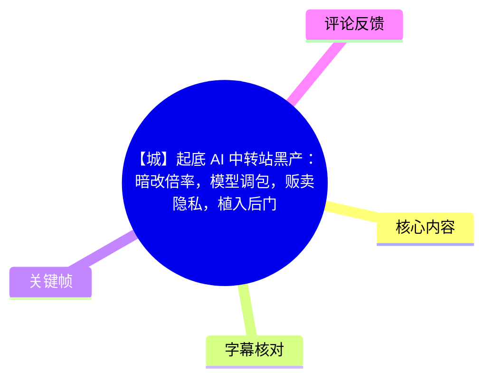
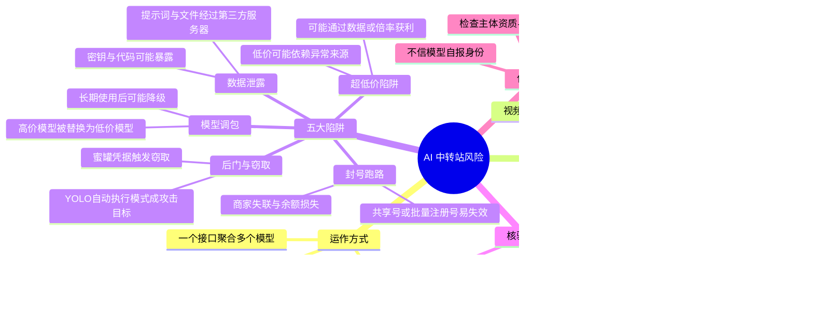
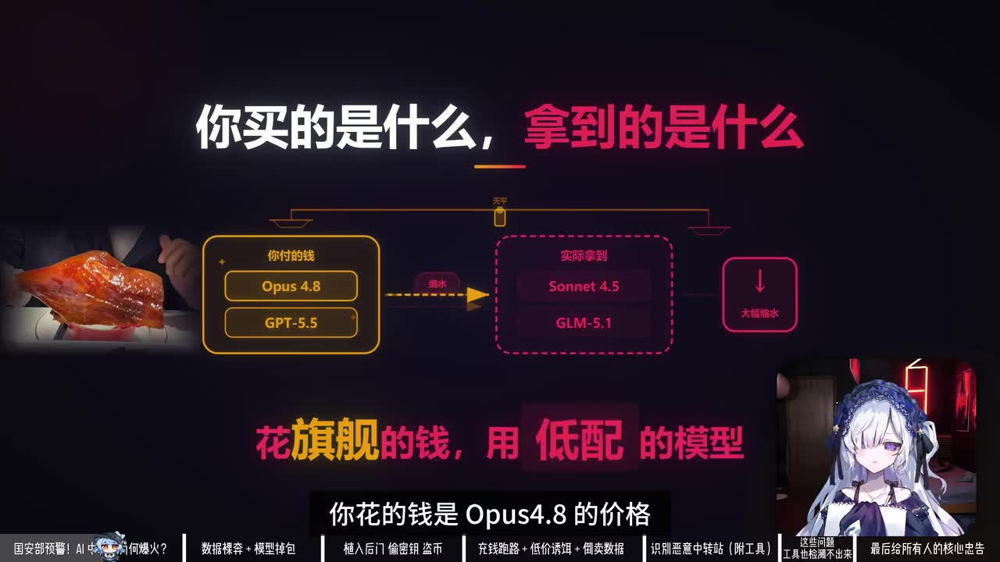
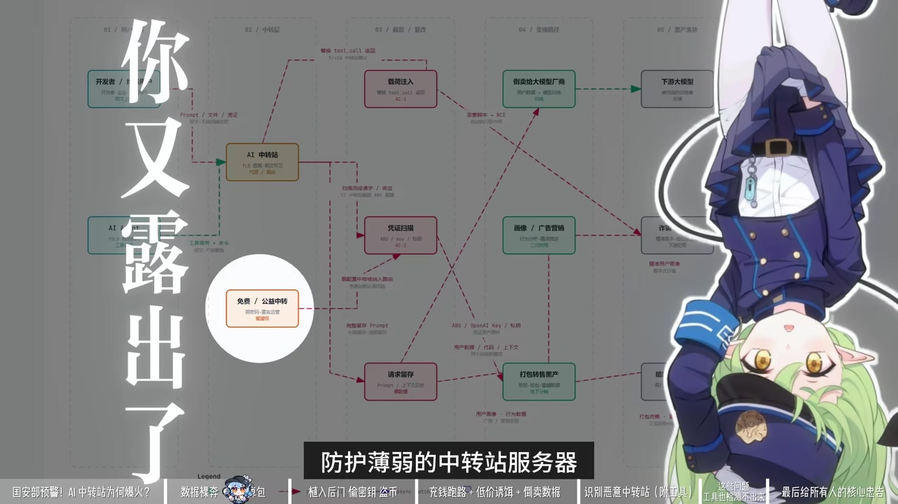

# 【城】起底 AI 中转站黑产：暗改倍率，模型调包，贩卖隐私，植入后门

> 来源：[Bilibili 视频](https://www.bilibili.com/video/BV1SHj66MEAS)  
> UP 主：网络小白_Uncle城｜时长：09:31｜收藏数：5,615｜播放量：201,857  
> 视频主题：从模型调包、数据泄露、恶意后门、账号封禁与低价套餐五个角度，讨论 AI API 中转站的安全与消费风险。

## 小结

视频将“AI API 中转站”定义为介于用户与模型官方 API 之间的转发服务：用户向中转站充值，由中转站代为把请求转发至官方模型接口。它的便利在于注册、支付和连通性门槛较低，并可能以一个接口聚合多家模型；其风险则在于用户的提示词、文件、密钥及请求元数据都需要经过第三方服务器。

视频最核心的警示是：**中转站的“模型名、计费、上下文长度、数据处理方式”都不应仅凭商家口头承诺或模型自述判断**。视频援引《Real Money, Fake Models》称，受测接口中有 45.83% 的模型身份与中转站声称不符；并以“购买 Opus 4.8，实际可能得到 Sonnet 4.5”“购买 GPT-5.5，实际可能运行 GLM-5.1”为例说明模型调包。

视频还援引《Your Agent Is Mine》所述测试：研究人员汇集 28 个付费和 400 个免费中转服务、共 428 个样本进行测试，其中 17 个触发 AWS 蜜罐告警；有一个样本在测试请求中发现以太坊私钥后，自动进行了转币操作，造成约 50 美元损失。视频据此强调：对于可自主执行任务的 AI 编程工具，风险已不只是“回答变差”，还可能扩展为凭据窃取或供应链攻击。

实操层面，视频提出四种核验路径：用相同高难题与官方 API 对比、检查 API 返回模型名/Token 消耗/响应速度、长期固定题监控、组合使用 Veridrop、何为 AI 在线检测平台、绿光 API、LLMmap 等工具。与此同时，视频明确承认检测工具存在边界：计费倍率篡改、系统提示注入伪造身份、上下文被从 128K 截断至 32K 等问题，未必能被单次工具检测发现。

这份内容适合使用第三方模型聚合 API 的开发者、AI 编程工具用户、需要上传代码或文档的团队，以及因超低价格而考虑购买“包月不限量”服务的用户。最可迁移的原则是：**敏感数据不走第三方中转；需使用时坚持低余额、可复测、可审计、可追责。**

需要注意时效性与证据边界：视频中的机构、论文、价格、模型版本、平台活动、案例和统计均是视频在“2026 年”语境下的陈述，本文未对论文原文、具体服务商、平台声明或价格进行外部独立验证。尤其视频前段称某论文“找到 17 家、深入测试其中 3 家”，末段又称“CISPA 审计的 1700 多家中近九成身份不透明”，二者的样本口径在视频中没有充分解释，不能直接视为同一项统计。

## 思维导图

## 目录

- [背景：中转站为何出现、如何运作](#背景中转站为何出现如何运作)
- [研究与市场热度：模型身份不符的风险](#研究与市场热度模型身份不符的风险)
- [五大陷阱之一：数据泄露与地下链条](#五大陷阱之一数据泄露与地下链条)
- [五大陷阱之二：模型调包](#五大陷阱之二模型调包)
- [五大陷阱之三：后门、蜜罐与自动化攻击](#五大陷阱之三后门蜜罐与自动化攻击)
- [五大陷阱之四：封号跑路](#五大陷阱之四封号跑路)
- [五大陷阱之五：低价与异常计费](#五大陷阱之五低价与异常计费)
- [识别中转站的四步方法](#识别中转站的四步方法)
- [工具无法覆盖的限制](#工具无法覆盖的限制)
- [供应链风险与使用建议](#供应链风险与使用建议)
- [关键帧索引](#关键帧索引)
- [字幕比对](#字幕比对)
- [评论分析](#评论分析)
- [处理记录](#处理记录)

## 背景：中转站为何出现、如何运作 [00:00:12](https://www.bilibili.com/video/BV1SHj66MEAS?t=12)

视频称，2026 年国内 AI API 中转站数量“超过 1700 家”，且这是“最低保底数据”。这一数字是视频陈述，未在视频中交代完整统计口径和数据来源。

视频所述中转站的业务逻辑如下：

1. 用户希望调用 GPT-5、Claude Opus 等海外大模型。
2. 官方 API 可能存在注册麻烦、需要境外信用卡、国内直连不稳定或无法使用等门槛。
3. 用户向中转站或其代理充值。
4. 中转站将用户请求转发至其对接的上游 API。
5. 用户收到的响应在表面上可能与官方服务相近。

其吸引力包括：价格看似更低、支付更方便、一个接口可调十余种模型、一次充值可覆盖多模型。但这种架构同时意味着：中转站处在请求链路中，理论上具备看到、存储、修改、转发甚至拒绝请求的技术位置。

> 图：关键帧以“那么这些中转站是干什么的呢”为提问，适合作为理解后续风险的前置画面。核心不在于画面人物，而在于提示读者先区分“官方 API”与“居中的转发服务”。

## 研究与市场热度：模型身份不符的风险 [00:00:46](https://www.bilibili.com/video/BV1SHj66MEAS?t=46)

### 视频引用的《Real Money, Fake Models》

视频称，德国 CISPA 信息安全中心在当年 3 月发布论文《Real Money, Fake Models》，即“真金白银，假模型”。

视频给出的信息为：

| 项目 | 视频陈述 |
| --- | --- |
| 发现的中转站数量 | 17 家 |
| 深入测试的对象 | 其中 3 家 |
| 模型身份与声明不符的接口比例 | 45.83% |
| 风险例子 | 支付 Opus 4.8 的价格，实际获得 Sonnet 4.5；购买 GPT-5.5，实际可能运行 GLM-5.1 |

视频用“花旗舰的钱，用低配的模型”概括这种行为。这里的技术关键是：模型名称出现在中转站自己的控制面和转发链路中，若缺乏端到端的可验证身份机制，用户仅通过页面标签、商家广告或模型输出文本，很难单独证明真实后端模型。

> 图：关键帧明确列出“Opus 4.8 / GPT-5.5”与“Sonnet 4.5 / GLM-5.1”的对照，并以“花旗舰的钱，用低配的模型”强调模型声明与实际执行模型可能不一致，是视频论证“掉包”风险的核心视觉材料。

### 视频列举的市场活动

视频接着描述中转站赛道在当年 5 月“突然火了”，并列举以下案例：

- 孙宇晨推出 b.ai，宣传一个 API Key 可使用 Claude、GPT、Gemini 和国产大模型全系列；
- 视频称其“每天补贴 10 万块、100 亿 Token、5 天注册用户突破 170 万”；
- 视频称 WorldRouter 于 5 月 5 日推出，将 AI 调用与加密货币绑定；兑换 100 万 AI 积分需要 250 万枚 WLFI 代币或 9,999 美元；
- 视频称媒体报道该代币销售收入的 75% 归特朗普家族。

上述活动、价格和分成数据均为视频转述，且具有明显时效性；本文不将其视为已独立验证的事实。它们在视频中的作用，是说明“聚合模型调用”和“低门槛/高补贴”叙事带来了市场热度，也可能让用户更容易忽略服务提供方的真实能力与责任主体。

## 五大陷阱之一：数据泄露与地下链条 [00:01:52](https://www.bilibili.com/video/BV1SHj66MEAS?t=112)

视频将数据泄露列为第一类风险，理由是用户对 AI 输入的每句话、上传的每个文件都要经过中转站服务器。视频认为，部分中转站没有正规的数据加密，有的还可能保存用户数据，并打包出售给其他模型厂商用于训练。

视频特别点出下列高风险数据：

- 账号密码；
- API Key；
- 源代码与数据库信息；
- 商业文档；
- 用户不希望他人知晓的对话内容；
- Agent 或 AI 编程环境中的环境变量、工具调用参数和上下文。

视频援引前小米 AI 产品专家张和的说法：用户数据交到 AI 中转站手中“基本是裸奔状态”，整个请求过程是“100% 黑盒”。这是受访观点或视频引用观点，不等于本文对所有中转服务的普遍事实判断；但从架构上看，未经端到端加密且由第三方代转的请求，确实增加了数据暴露面。

### 视频描述的地下产业链

视频还描述了一条可能的黑产路径：

1. 新手开发者部署 AI Agent 时，因疏忽把 API Key 上传到 GitHub；
2. 防护薄弱的中转站服务器和泄露 API Key 被收集；
3. 数据经重新打包后在暗网转售；
4. 用户购买的中转服务，也可能来自这类黑暗产业链。

这段内容意在提醒：**中转站风险不只取决于“商家是否诚实”，还取决于其上游账号、服务器和密钥来源是否合规、是否安全。**

> 图：关键帧展示“你又暴露出去了”的链路图，并出现“AI 中转站”“凭证泄漏”“请求暂存”等节点。它有助于理解风险不是只发生在最终回答，而是贯穿请求、凭据、存储和转售的整个链条。

## 五大陷阱之二：模型调包 [00:02:42](https://www.bilibili.com/video/BV1SHj66MEAS?t=162)

视频把“AI 用着用着突然变笨”解释为模型调包的可能表现。其描述的常见套路包括：

- 用户以为调用的是顶级模型，实际被路由到更便宜的模型；
- 初期提供真实模型以建立信任，待用户充值后再切换；
- 服务商为压缩成本，直接把请求转至更便宜、更快的后端；
- 用户可能仍看到原先的模型名称，因此难以仅凭界面辨别。

模型调包影响的不只是主观回答质量，还可能影响：

| 维度 | 可能变化 |
| --- | --- |
| 推理与代码能力 | 复杂推理、长链条任务、代码重构质量下降 |
| 上下文能力 | 长文档、仓库级任务更容易失败或遗忘 |
| 输出稳定性 | 同一提示词的格式、工具调用、遵循指令能力变化 |
| 安全特性 | 不同模型的安全策略、工具调用行为和输出限制不同 |
| 成本透明度 | 用户按高规格模型支付，却可能获得低规格模型服务 |

视频的重点不是说“任何性能波动都是掉包”，而是提醒：如果质量长期、明显地偏离对应模型应有表现，且伴随异常速度、异常 Token 账单或返回字段不一致，就应将模型替换列入排查范围。

## 五大陷阱之三：后门、蜜罐与自动化攻击 [00:03:03](https://www.bilibili.com/video/BV1SHj66MEAS?t=183)

### 《Your Agent Is Mine》测试结果

视频称，当年 4 月另一篇论文《Your Agent Is Mine》发布，并入选 CCS 2026。按照视频叙述，研究人员：

- 从淘宝、闲鱼、Shopee 等渠道购买 28 个付费中转站；
- 从开源社区收集 400 个免费中转站；
- 合计对 428 个中转服务逐个测试；
- 发现 17 个中转站触发 AWS 蜜罐报警。

视频解释了蜜罐测试逻辑：研究人员在测试数据里埋入假的账号和密码；某些中转服务检测到凭据后主动进行窃取行为，因此触发告警。

### 以太坊私钥案例

视频称，研究人员在测试请求中放入一把以太坊私钥。一个中转站检测到之后，自动进行全自动转币操作，令研究人员损失约 50 美元。

视频强调，50 美元本身不是重点，重点是该行为反映出自动化攻击能力：若服务能自动利用加密货币私钥，也可能尝试窃取 API Key、数据库密码或其他凭据。

> **边界说明**：上述测试细节、金额和归因均来自视频对论文的转述。本文不将其延伸为“所有中转站都会窃取凭据”的结论；它证明的是第三方转发层一旦恶意且拥有请求可见性，攻击面可能远超“模型回答质量”。

### 潜伏攻击与 YOLO 模式

视频称，有两个中转站采用潜伏策略：

1. 前 50 次调用表现完全正常；
2. 让用户形成“服务可靠”的判断；
3. 当检测到用户开启 YOLO 模式，即自动执行模式时，再触发恶意行为。

视频将 Cursor、Windsurf 中的 YOLO 模式，以及 Codex、Claude Code 中类似的自动执行/目标模式，作为高风险场景。此类模式的共同特征是：AI 可以在较少人工确认的情况下连续调用工具、读写文件、执行命令或完成任务。

因此，对开发者而言，风险模型从“提示词可能被看到”升级为：

- 中转层可观察代码任务内容；
- 请求中可能含密钥、路径、环境变量或数据库配置；
- Agent 可能拥有文件、网络、命令执行等权限；
- 恶意请求修改、工具调用诱导或凭据搜集可能造成更大影响。

## 五大陷阱之四：封号跑路 [00:04:24](https://www.bilibili.com/video/BV1SHj66MEAS?t=264)

视频把“封号跑路”称为用户最常踩的坑，给出三类案例。

### 案例一：44.9 元包月不限量

视频称，程序员 SAKI 酱在电商平台购买 44.9 元包月、不限量服务，初期使用正常，不到一个月服务中断，商家失联、售后群解散，充值金额损失。

视频给出的解释是：部分商家并非正规运营中转业务，而是：

- 批量注册免费账号；
- 将一个付费账号拆分给多位用户；
- 一旦官方大规模封号，就无法继续提供服务并直接退出。

### 案例二：两次购买后均失效

视频称，开发者 Allin：

| 次数 | 购买条件 | 使用结果 |
| --- | --- | --- |
| 第一次 | GPT-5.4 中转，25 元/月，每日 120 美元额度 | 使用约 20 天后，视频称 OpenAI 大规模封号，商家消失 |
| 第二次 | 70 元/月，每日 90 美元额度 | 使用十多天后，商家以封号严重、成本上涨为由，将计费提高至原来的 3～4 倍，取消月卡，改为 100 元兑换 500 美元额度 |

视频认为，后一次价格甚至比官方更贵，说明“低价包月”不等于稳定或真实的成本优势。

### UP 主自述经验

视频中 UP 主还自述曾在一个代理站充值 50 元，后来站长跑路，无法登录、无法联系，已充值 Token 全部损失。因此给出的经验是：**若仍要使用此类服务，应少量、多次充值，而不是一次性预存大额余额。**

这条建议只能降低“余额被卷走”的损失，不解决数据安全、模型调包、后门或账号来源不合规的问题。

## 五大陷阱之五：低价与异常计费 [00:05:20](https://www.bilibili.com/video/BV1SHj66MEAS?t=320)

视频列举电商平台上“一元兑换 285 万 Token、覆盖主流大模型”的宣传，并通过 Claude Opus 4.7 的价格进行对比。

视频给出的计算口径：

| 项目 | 视频中的数值 |
| --- | ---:|
| Claude Opus 4.7 输入价格 | 5 美元 / 百万 Token |
| Claude Opus 4.7 输出价格 | 25 美元 / 百万 Token |
| 285 万 Token 输入成本 | 约 97 元人民币 |
| 285 万 Token 输出成本 | 约 485 元人民币 |
| 商家宣传价格 | 1 元兑换 285 万 Token |

视频由此质疑：若价格显著低于上游公开成本，商家如何维持服务？视频的判断是，部分中转站未必依靠正常价差盈利，可能依赖用户数据买卖、异常账号来源或其他未透明的获利方式。

视频还提及一位名为“西瓜的皮”的中转站站长发布关停声明，称自己因通过非法技术手段获取 API 被行政拘留 37 天，取保候审后仍待判刑，并称体重下降 20 多斤。此为视频转述的个人声明，不构成对具体个案法律事实的独立确认。

### 低价不等于低成本：应检查的三个问题

1. **成本是否自洽**：服务价格能否覆盖模型输入、输出、带宽、存储、支付和运维成本？
2. **计费是否透明**：是否能导出明细、核验 Token 单价、检查输入/输出分别计费？
3. **供给是否可持续**：服务是否依赖共享号、免费号、被盗密钥、灰色账号池或不可持续补贴？

## 识别中转站的四步方法 [00:06:06](https://www.bilibili.com/video/BV1SHj66MEAS?t=366)

### 第一步：官方 API 与中转站跑同一高难题 [00:06:11](https://www.bilibili.com/video/BV1SHj66MEAS?t=371)

视频建议准备“真正有难度”的固定测试题，例如：

- 复杂数学推理；
- 代码重构任务；
- 长上下文信息检索；
- 需要精确约束的结构化输出；
- 多步工具调用规划。

将同一题目分别提交到官方 API 和中转站，并比较：

- 最终答案正确性；
- 推理完整性与错误类型；
- 代码是否可运行；
- 是否遵循格式、约束与上下文；
- 响应时间和 Token 消耗。

若中转站结果长期明显更弱，视频认为基本可以判断存在模型调包风险。更严谨地说，单次差异也可能由采样参数、系统提示词、速率限制、上下文配置或模型版本差异造成，因此应多次复测，而非只用一次测试定性。

### 第二步：检查 API 返回内容 [00:06:24](https://www.bilibili.com/video/BV1SHj66MEAS?t=384)

视频建议检查：

- 返回的模型名是否等于请求模型；
- Token 消耗是否正常；
- 响应速度是否合理。

视频举例：若请求的是 Opus，但响应速度却与低价模型相同，应保持警惕。

这里需要补充视频随后给出的限制：**返回模型名可以被中转层伪造，不能单独作为真实身份的证明。**它应与质量基准、账单、长期趋势和密码学验证机制结合使用。

### 第三步：长期固定题监控 [00:06:36](https://www.bilibili.com/video/BV1SHj66MEAS?t=396)

视频建议每周使用同一套固定高难题测试一次，保存结果并观察变化。如果某天开始质量突然下降，则可能是中转站在后期替换模型。

可记录的字段包括：

| 记录项 | 用途 |
| --- | --- |
| 测试日期与请求 ID | 追踪异常发生时间 |
| 请求模型名和实际返回模型名 | 检查声明是否变化 |
| 温度、最大输出 Token、系统提示词 | 排除参数变动干扰 |
| 首 Token 延迟、总耗时 | 观察路由与负载变化 |
| 输入/输出 Token | 发现异常倍率或截断 |
| 准确率、代码测试结果、人工评分 | 量化质量变化 |
| 可处理的最大上下文长度 | 检查上下文缩水 |

### 第四步：组合使用检测工具 [00:06:43](https://www.bilibili.com/video/BV1SHj66MEAS?t=403)

视频介绍以下工具或平台：

| 工具/平台 | 视频所述用途 | 视频所述限制或特点 |
| --- | --- | --- |
| Veridrop | 检测 Claude、OpenAI、Gemini 三类模型 | 开源免费；Claude 检测使用 Anthropic 官方加密签名；视频称报告耗时 30～75 秒 |
| 何为 AI 在线检测平台 | 多轮探测请求、交叉判断 | 视频未说明具体检测原理 |
| 绿光 API | 充值前检测接口可用性、模型真实性、计费透明度 | 作为预充值检查工具 |
| LLMmap | 通过分析回答特征识别模型真实身份 | 视频称《Your Agent Is Mine》使用该工具进行检测 |

视频的结论不是“装一个工具就能解决”，而是多种方法组合使用才能覆盖更多情形。

## 工具无法覆盖的限制 [00:07:25](https://www.bilibili.com/video/BV1SHj66MEAS?t=445)

视频明确指出，以下风险可能无法通过常规检测工具或单次模型对话发现。

### 1. 暗改 Token 消耗倍率

视频举例：官方收费 1 元，中转站表面只收费 0.3 元，但后台将用户 Token 消耗乘以 4。最终用户实际花费可能高于官方，却因名义单价更低而误以为便宜。

因此，核验计费不能只看“充值兑换比例”，而应看：

- 输入 Token 与输出 Token 的原始计数；
- 单位 Token 价格；
- 最终账单与模型官方定价的对应关系；
- 是否存在不明“倍率”“折算系数”“渠道系数”；
- 是否能获取逐请求账单明细。

### 2. 注入假指令、伪造模型身份

视频举例，用户问“你是什么模型”，模型回答“我是 GPT-5”，不代表真的在运行 GPT-5。中转站可能在后台追加指令：“你必须声称自己是 GPT-5”。

因此，**直接询问模型身份是视频认定的最不可靠核验方法**。这也是实践中应避免把自然语言自述当作身份验证的原因。

### 3. 偷偷截断上下文长度

视频举例，用户购买的模型宣称支持 128K 上下文，但中转站只给到 32K。短期小任务不易发现，处理长文档时才暴露问题。

可采用渐进式上下文测试：构造多个具有唯一锚点信息的长文本，在不同长度位置询问锚点，以观察模型能否检索到前部、中部、后部的内容。测试时需同时控制模型参数与提示词，避免将模型本身的注意力衰减误判为中转截断。

## 供应链风险与使用建议 [00:07:58](https://www.bilibili.com/video/BV1SHj66MEAS?t=478)

视频回到“为何国家安全部会发文”的问题，认为中转站问题不仅是用户被多收费或拿到低配模型，更可能属于供应链和网络空间安全问题。

视频引用《Your Agent Is Mine》中的一组数据，称一个泄露 API Key 被滥用后：

- 产生 1 亿个 GPT-5.4 Token 和超过 7 个 Codex 会话；
- 在安全设置较弱的诱饵账户中产生 20 亿计费 Token；
- 涉及 99 个凭据与 440 个 Codex 会话；
- 其中 401 个会话已运行在自主 YOLO 模式下。

这些数字与具体模型版本为视频转述；其想表达的风险链条是：泄露凭据 → 大规模滥用 → 自主 Agent 执行 → 可能横向扩散或形成组织化供应链攻击。

### 视频给出的直接建议

1. **敏感数据绝对不要走第三方中转。**
2. 检查服务主体是否有企业备案。
3. 检查是否有正规、可追责的支付渠道。
4. 检查运营时长、社区口碑、价格透明度。
5. 对“价格只有官方三分之一、没有企业信息、只收 USDT”的服务高度警惕。
6. 若不得不充值，采取“多次少充”的策略。

### 可落地的最小安全清单

以下清单是根据视频建议整理出的执行版，不新增视频未出现的具体服务结论：

- [ ] 不向第三方中转发送密钥、密码、私钥、生产数据库连接串、客户数据、商业机密或涉密信息。
- [ ] 为测试用途使用隔离账号、最小权限凭据和可撤销 Token。
- [ ] 不给不可信中转链路提供具备自动执行能力的 Agent 权限。
- [ ] 对所有中转 API 建立固定基准题、账单记录和上下文长度测试。
- [ ] 不以“模型说自己是什么”作为模型真实性证据。
- [ ] 核验企业主体、支付渠道、服务条款、数据保留与删除说明。
- [ ] 将余额控制在可承受损失范围内，避免一次性大额预存。
- [ ] 对显著低于上游成本的套餐，优先追问数据处理、账号来源、倍率和计费规则。

## 关键帧索引

| 关键帧 | 对应内容 | 图片价值 |
| --- | --- | --- |
|  | 中转站是什么 | 用问题引出中转服务的中间层定位，适合建立概念前提。 |
|  | 高价模型被替换为低价模型 | 直观呈现“购买什么、实际拿到什么”的模型调包结构。 |
|  | 从市场热度转入风险讨论 | 以“疯狂的背后”衔接行业扩张与风险清单。 |
|  | 请求、凭据与数据外泄 | 展示中转站位于数据流中间的结构性风险，而非仅是服务稳定性问题。 |

## 字幕比对

| 字幕来源 | 完整性 | 专有名词 | 时间轴 | 主要问题 |
| --- | --- | --- | --- | --- |
| Bilibili 站内中文字幕 `p01-ai-zh.srt` | 覆盖约 00:00:00～09:30，分段细 | 大量名称存在语音识别式错字，如“GBT5”“cloud opus”“word RT”“密关报警”等 | 精确到毫秒，覆盖视频全程 | 中文文本有错别字、断句和术语误识别，但起止时间可用 |
| Bilibili 站内英文/日文字幕 | 覆盖全程，可用于交叉校正 | 英文版对 CISPA、Real Money, Fake Models、WorldRouter、Veridrop、LLMmap 等术语较清晰 | 同样精确到毫秒 | 有自动翻译痕迹；部分版本存在重复、错译或不自然表述 |
| 本次 ASR `medium` | 诊断显示语音覆盖率约 94.82%，识别语言为中文，非无音轨 | 多处把 GPT、Claude、Opus、Windsurf、YOLO 等识别错误，如“GBT”“Cloud”“Windserve”“优努模式” | 有时间戳，但首段从 00:00:26.140 才开始，且以约 24 秒大块分段，不适合精确章节定位 | 起始约 26 秒缺失、术语错识别较多、文本连写严重；不宜作为主时间轴 |

### 最终字幕选择

- **正文时间轴**：采用站内 `p01-ai-zh.srt` 的毫秒级起止时间换算秒数。
- **正文术语校正**：以站内英文、日文字幕和上下文交叉确认，统一写作 GPT-5、Claude Opus、CISPA、Real Money, Fake Models、WorldRouter、AWS 蜜罐、YOLO 模式、Cursor、Windsurf、Codex、Claude Code、Veridrop、LLMmap。
- **ASR 检查结论**：本次 ASR 已检查。`asr-result.json` 未标记 `noAudioStream=true`，且诊断明确识别到中文语音，因此源视频存在音轨；ASR 问题属于识别质量与切分问题，不是工具失败，也不是无音轨。

### 重要校正说明

1. 站内中文字幕多次将 GPT 写为“GBT”，将 Claude 写作“cloud”，将“蜜罐”识别为“密关”；正文按英文字幕及上下文修正。
2. 站内字幕和 ASR 都在个别模型版本、平台名称处出现识别偏差；本文仅保留视频能稳定支持的表述，不依据单一错字字幕扩展解释。
3. 视频中“17 家中转站、深测 3 家”与结尾“1700 多家中近九成身份不透明”的统计口径未被完整说明，本文保留原话并标记为不可直接合并的统计。

## 评论分析

以下仅分析可获取的热评前三条。评论是用户个人陈述或观点，不应替代视频证据、论文结论或独立调查。

### 1. `空_---_白`｜142 赞

> “中转站最喜欢干的就是一边贬低国内 AI 吹国外 AI，然后卖你国外 AI 但是调包成国内 AI。”

这条评论强化了视频关于“模型调包”的叙事：用户被营销话术引导购买海外高价模型，实际后端可能被替换为其他模型。评论采用调侃口吻，没有给出具体平台、日志、测试方法或证据，因此只能视为对视频主题的情绪化认同，不能据此判断某一模型或某一中转站必然存在调包。

### 2. `每天都在训练的猪子哥`｜92 赞

> 自称经营中转站，称行业受到“劣币驱逐良币”、恶性价格竞争影响；其表示正规账号也容易因用户渗透、逆向、外挂、爬虫和色情等行为收到官方警告或被封，并称自己不存取 `messages` 信息。

这条评论提供了一个服务商自述视角：中转站经营者也可能面对上游封号、用户滥用、账号池成本和价格竞争等压力，与视频“封号跑路”部分形成呼应。

但需要区分两点：

- 评论者“自己不存取 messages 信息”的说法未附带技术架构、日志策略、隐私政策或第三方审计，无法独立验证；
- 即使某服务商不保存正文，转发服务是否仍可访问请求、元数据、错误日志、计费数据或临时缓存，仍取决于其具体实现。

因此，这条评论有助于理解行业激励与经营压力，但不足以证明“某类中转站安全”或“封号完全由用户行为导致”。

### 3. `两大类扣除`｜24 赞

> “你甚至能看到中转站用不知道哪里的模型渗水 dsv4。”

该评论表达了对中转站可能混用来源不明模型、掺水替换模型的担忧，与视频的“模型缩水/掉包”主题一致。“dsv4”具体指代、服务商和验证方法均未说明，证据不足，不能作为可核验案例使用。

## 处理记录

- Worker ID：`worker-mrj0wjed-b0c290ad`
- 模型：`gpt-5.6-terra`
- 可用素材与工具结果：
  - 视频元数据、封面、12 个关键帧路径；
  - Bilibili 多语言站内 SRT 字幕；
  - 本次 ASR：`medium`，CUDA、`float16`、中文识别；
  - 热评抓取结果：可获取 3 条，已全部分析。
- 字幕选择：
  - 主时间轴采用站内 `p01-ai-zh.srt`，因为其从 00:00:00 开始、分段细且有毫秒级真实时间；
  - 站内英文/日文字幕用于校正术语；
  - 本次 ASR 已完整检查，但其从 26.14 秒才开始、术语错识别较多，仅作为语音存在与内容交叉参考，不作为章节定位依据。
- 音轨判断：
  - `asr-result.json` 未标记 `noAudioStream=true`；
  - ASR 诊断显示识别语言为 `zh`、语音覆盖约 `94.82%`，因此按“视频具有音轨”处理。
- 关键帧选择依据：
  - `frame-001.jpg`：对应中转站定义问题；
  - `frame-002.jpg`：明确显示高价模型与低价模型替换关系；
  - `frame-003.jpg`：对应行业热度之后的“五大陷阱”转场；
  - `frame-004.jpg`：展示中转链路中的凭据、请求和数据泄露面。
- 缓存清理：
  - 本次任务提供的素材清单未包含可执行的缓存清理日志或清理结果；未编造清理状态。
- 未解决问题：
  - 未提供论文全文、平台后台日志、检测工具链接或实际 API 返回样本，无法对视频中的研究统计、模型版本、价格、具体平台和个案作外部独立验证。
  - 视频内部对“17 家/深测 3 家”与“1700 多家审计对象”的统计口径未充分说明，已在正文中保留该限制。
