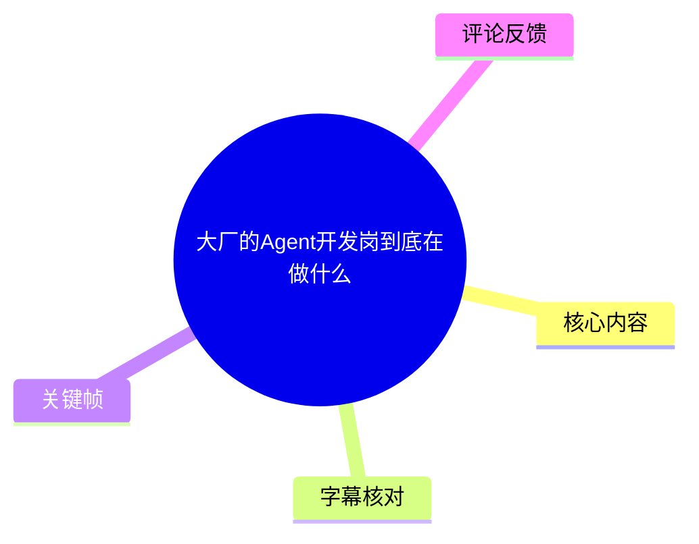
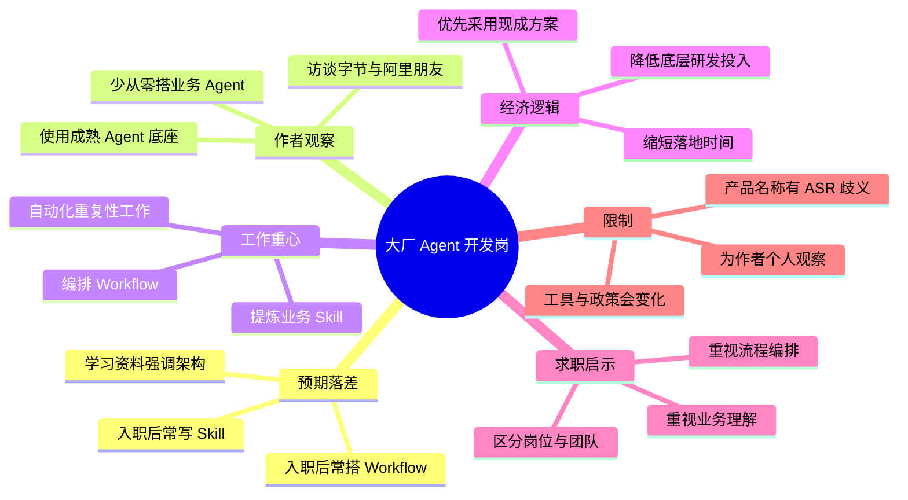
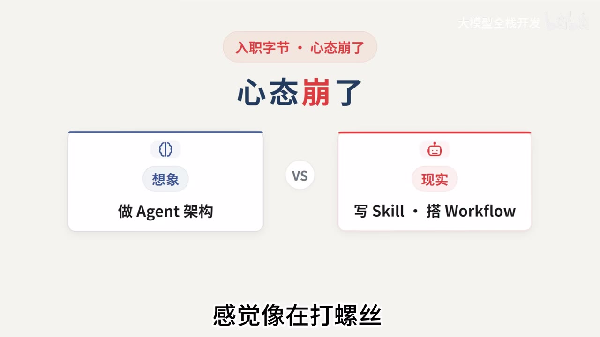
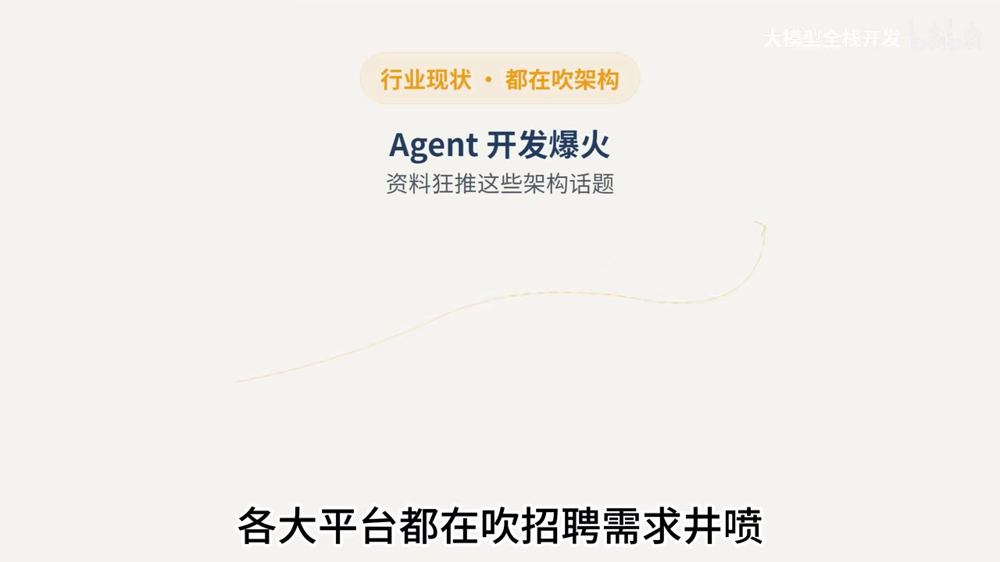

# 大厂的Agent开发岗到底在做什么

> 来源：[Bilibili 视频](https://www.bilibili.com/video/BV1oV3w6hEV1) 
> UP 主：大模型全栈开发｜发布时间：2026-07-27｜视频时长：02:04｜分辨率：3840×2160

## 小结

视频讨论的是一个求职预期校准问题：大众在学习资料与招聘宣传中常将 Agent 开发描述为架构设计、记忆管理、上下文压缩、MCP 接入和多 Agent 协作；但视频作者基于其与字节、阿里相关从业朋友的交流，认为多数大厂业务部门的日常工作更接近于在既有 Agent 底座上**编写 Skill、编排 Workflow，并把重复性业务流程自动化**。

作者用“面试造火箭，进去打螺丝”概括落差。其核心论据是经济性：从零建设面向业务的 Agent，需要了解底层架构的团队、较多时间与人力投入，且最终效果未必超过成熟产品或内部工具。因此，直接采用成熟 Agent 底座、注入业务经验并组织流程，被作者视为更符合大厂效益目标的方案。

对准备进入大厂 Agent 岗位的读者，视频给出的隐含学习优先级是：不要只把注意力放在“从零造 Agent”的宏大架构上，还应重视 Skill 的设计、业务知识结构化、Workflow 编排及自动化落地。这里的“只需要会写 Skill”是作者带有强调意味的职业观察，不应理解为所有公司、所有团队都不要求模型原理、系统工程或评测能力。

视频中涉及字节、阿里及其工具使用情况的表述，来源是作者个人访谈和观察，并未提供岗位 JD、团队范围、内部文档或公开可核验材料；尤其 ASR 对部分产品名称的转写存在不确定性。因此，这些内容只能作为**特定时间点、特定受访圈层下的经验性信息**，不能外推为两家公司全部团队的统一事实。

视频发布于 2026-07-27，Agent 工具、企业采购策略、模型接入政策和岗位职责都可能快速变化。适合将其作为“理解业务型 Agent 岗位可能做什么”的参考，而不是作为求职、技术选型或公司政策的唯一依据。

## 思维导图

## 目录

- [背景：从“做 Agent 架构”到“写 Skill、搭 Workflow”](#背景从做-agent-架构到写-skill搭-workflow)
- [行业叙事与岗位现实的落差](#行业叙事与岗位现实的落差)
- [作者观察：成熟 Agent 底座与两类日常工作](#作者观察成熟-agent-底座与两类日常工作)
- [为何不从零搭建：效益优先的技术决策](#为何不从零搭建效益优先的技术决策)
- [岗位实践：Skill、Workflow 与业务自动化](#岗位实践skillworkflow-与业务自动化)
- [求职与学习建议：应掌握什么、不能误读什么](#求职与学习建议应掌握什么不能误读什么)
- [结论、限制与时效性](#结论限制与时效性)
- [字幕比对](#字幕比对)
- [评论分析](#评论分析)
- [处理记录](#处理记录)

## [背景：从“做 Agent 架构”到“写 Skill、搭 Workflow”](https://www.bilibili.com/video/BV1oV3w6hEV1?t=29)

视频以一位“入职字节两周”的粉丝私信切入：该粉丝原本期待从事 Agent 架构，实际却每天“写 Skill 加 Workflow”，因而感觉像在“打螺丝”。作者的回应是，这恰恰是其所理解的“大厂 Agent 开发的正经活”。

这段叙事建立了视频的主要对照：

| 进入岗位前的想象 | 作者描述的业务部门现实 |
| --- | --- |
| 做 Agent 架构 | 写 Skill |
| 亲手从零造一个 Agent | 编排 Workflow |
| 研究复杂 Agent 能力 | 把业务经验接入既有底座 |
| 聚焦通用技术炫酷度 | 聚焦重复工作自动化与效益 |

> 图：画面直接以“做 Agent 架构”对照“写 Skill・搭 Workflow”，并标注“感觉像在打螺丝”。它是理解视频论点的核心视觉概括：作者并非否认 Agent 技术，而是在强调企业业务岗的交付重心可能与求职者想象不同。

视频前段没有给出该粉丝所属的具体部门、岗位名称、工作内容样例或可复核的 JD。因此，这个案例应视为作者引出主题的个人转述，不能据此确认字节全部 Agent 岗位的职责结构。

## [行业叙事与岗位现实的落差](https://www.bilibili.com/video/BV1oV3w6hEV1?t=31)

作者认为，近几个月 Agent 开发受到广泛关注，平台讨论与学习资料经常聚焦以下主题：

- Agent 架构设计；
- 记忆管理；
- 上下文压缩；
- MCP 接入；
- 多 Agent 协作；
- 招聘需求增长的市场叙事。

这些主题会使学习者产生“入职后要亲手造一个 Agent”的预期。作者随后以“面试造火箭，进去打螺丝”形容反差，并认为这一现象在 Agent 领域可能尤其明显。

> 图：画面写有“行业现状・都在吹架构”“Agent 开发爆火”“资料狂推这些架构话题”。该关键帧说明作者批评的对象不是某一项技术本身，而是市场传播中对架构议题的过度聚焦。

> 图：画面用“热血沸腾”表现学习者看到 Agent 热潮后的心理状态，有助于理解作者为何将视频定位为对岗位预期的“降温”说明。

需要区分两件事：视频确认的是作者观察到的岗位分工倾向；“招聘需求井喷”等市场描述是作者在视频中的概括，未附带招聘数据、统计口径或时间区间，不能直接作为量化就业结论。

## [作者观察：成熟 Agent 底座与两类日常工作](https://www.bilibili.com/video/BV1oV3w6hEV1?t=55)

作者称，其近期分别与字节和阿里的朋友交流后，发现两家在做法上“出奇一致”：业务团队倾向于依赖现成的 Agent / 编程 Agent 工具，而不是从零搭建一个专属业务场景的 Agent。

根据 ASR，作者提到了以下名称或名称片段：

- `Codex`；
- `Cloud Code`；
- 字节侧另一个被 ASR 识别为“`Tcode`/字节字研的 Agent”的名称；
- 阿里侧一个被 ASR 识别为“阿里内部的 coder”的工具或产品。

其中，`Codex`、`Skill`、`Workflow` 在音频与画面语境中较明确；“Cloud Code”“Tcode”及“阿里内部 coder”的精确产品名称，因 ASR 连读、音近词与断句问题无法仅凭给定素材可靠确认。本文保留其为音频转写结果，不将其扩展为已证实的工具清单。

作者将日常工作归纳为两项：

1. **提炼 / 编写 Skill**：将业务中可复用的能力、规则或操作方式封装成可被 Agent 调用的能力单元。
2. **编排 Workflow**：将多步骤任务组织成执行流程，面向重复性业务任务实现自动化。

视频没有展示 Skill 的代码形式、参数定义、工具调用协议、状态存储、评测集或 Workflow 编排平台；因此不能从本视频推导出具体 SDK、框架、语言或部署架构。

## [为何不从零搭建：效益优先的技术决策](https://www.bilibili.com/video/BV1oV3w6hEV1?t=79)

作者给出的解释是，大厂最看重效益。自行从头构建 Agent，意味着需要投入理解底层架构的团队，以及较大的人力和时间成本；且最终产品不一定优于市场上成熟的可用方案。

据此，作者描述的落地路径可以整理为：

1. **选择成熟的 Agent 底座**：优先使用外部成熟产品或公司已有内部能力，而非重复建设基础 Agent。
2. **注入业务经验**：把业务流程、知识、规则与任务要求转化为系统可使用的内容。
3. **用 Skill 承载专门能力**：针对业务需要补充可调用的操作能力。
4. **用 Workflow 组织任务流**：连接多个步骤，使重复性工作可以自动执行。
5. **以效率作为结果标准**：目标不是展示复杂架构，而是减少重复劳动、提高业务处理效率。

> 图：画面明确写出“面试造火箭｜进去打螺丝”，并说明“放到 Agent 领域，可能更彻底”。它将作者的成本—效益判断浓缩为易于辨识的职业现实比喻。

这里的“成熟底座 + 业务经验 + Skill + Workflow”是视频所表达的方法框架，而不是一套可直接部署的技术方案。视频未说明底座如何进行模型选择、权限管理、数据隔离、调用成本控制、失败重试、可观测性、人工审核或安全评测；在实际企业场景中，这些往往同样是 Agent 系统交付的一部分。

## [岗位实践：Skill、Workflow 与业务自动化](https://www.bilibili.com/video/BV1oV3w6hEV1?t=79)

作者的核心判断是：互联网大厂中“**大部分部门**”所谓的 Agent 开发，本质就是“写 Skill + 搭 Workflow”；不论字节还是阿里，其观察到的思路一致。

从视频信息可还原的实践链条如下：

| 环节 | 视频中的表述 | 可理解的交付目标 | 视频未提供的信息 |
| --- | --- | --- | --- |
| 复用底座 | 直接使用成熟 Agent 底座 | 避免重复建设基础能力 | 具体产品、模型与部署方式 |
| 灌入经验 | 把业务经验灌进去 | 让 Agent 更贴近业务任务 | 数据来源、知识更新和权限机制 |
| 写 Skill | “写 Skill” | 增加专用动作或能力 | 接口、输入输出、异常处理与测试 |
| 搭 Workflow | “搭 Workflow” | 将步骤串成可运行流程 | 编排引擎、条件分支、并发与状态管理 |
| 自动化 | 自动化重复性工作、提效 | 形成可衡量的业务价值 | 指标、基线、效果数据与人工兜底 |

对于求职者或初学者，视频的实用含义并非“无需学习 Agent 原理”，而是应把以下能力纳入准备范围：

- 识别业务中的重复任务与可自动化边界；
- 把业务规则拆解为相对清晰、可复用的 Skill；
- 设计有明确输入、输出、前后依赖的 Workflow；
- 理解成熟 Agent 工具的使用与集成方式；
- 用业务效率、稳定性与可维护性评估方案，而不只看架构复杂度。

这些是从作者论述中提炼出的学习方向，不是视频展示的操作教程。视频没有提供实际的需求文档、Skill 示例、Workflow 图、代码、命令、配置项、模型参数、上下文窗口参数、RAG 参数或性能指标，因而不存在可按视频原样复现的实施步骤。

## [求职与学习建议：应掌握什么、不能误读什么](https://www.bilibili.com/video/BV1oV3w6hEV1?t=103)

作者指出，一些新人刚进入岗位时会困惑：“天天只写 Skill 和 Workflow，这有什么成长？”但工作数月后会发现，这正是大厂对该类 Agent 开发工作的定义之一。作者以较强的概括语气称，“压根不需要”对 Agent 有特别复杂、深刻的理解，“只需要会写 Skill”。

该说法应结合上下文理解：

- **作者明确主张**：在其观察到的大厂业务型 Agent 团队中，Skill 与 Workflow 是高频、实际的交付事项。
- **不能直接推出的结论**：所有 Agent 岗位都只要求写 Skill；基础模型、推理优化、Agent 平台、评测、安全、基础设施与研究型岗位的职责不必然相同。
- **更稳妥的求职做法**：针对目标岗位核对 JD、面试题、部门业务和产品阶段，判断该岗是业务应用集成、平台工程、模型算法，还是研究探索。
- **作者的课程推广**：结尾称自己整理了面向进入中小厂的完整 Agent 学习路线，包含知识点讲解与实战代码，并引导有需要者留言“agent”。视频未展示课程目录、代码内容、定价、适用前提或效果证明。

视频对“中小厂”的建议与前文大厂观察并不完全等价：前文强调大厂业务团队优先复用成熟底座，结尾则说中小厂学习路线包含更系统的知识点与实战代码。由于没有课程细节，无法判断其是否覆盖从底座选型、Skill 设计、Workflow 编排到评测运维的完整链路。

## 结论、限制与时效性

视频最可迁移的经验是：在业务导向的 Agent 开发中，技术价值往往不只来自“造出一个通用 Agent”，而来自把现有 Agent 能力转化为可靠的业务流程——即沉淀 Skill、编排 Workflow，并对重复任务形成自动化交付。

但这一结论的适用范围有限。作者依据的是与少量字节、阿里相关朋友的交流，未给出团队数量、部门类型、访谈时间、岗位样本、内部工具文档或效率数据；“大部分部门”“根本没有人”等绝对化措辞应理解为视频观点，而非已完成统计验证的行业结论。

技术名词也有转写限制：本次 ASR 能够清晰支持 `Agent`、`Skill`、`Workflow`、`Codex` 等关键词，但对若干产品名称存在歧义。本文未以猜测方式补全为特定产品，也不据此确认任何企业内部工具的真实使用情况。

时效上，视频发布于 2026-07-27。Agent 底座能力、企业内部工具、外部模型接入、合规政策、组织分工与招聘岗位描述均可能在后续发生调整。准备求职时，应以目标公司最新 JD、面试反馈、公开技术分享和实际业务需求为准。

## 字幕比对

| 字幕来源 | 完整性 | 专有名词 | 时间轴 | 主要问题 |
| --- | --- | --- | --- | --- |
| Bilibili 站内字幕 | 未提供可用字幕 | 无法核验 | 无法使用 | 素材记录显示字幕抓取过程报错：`Invalid URL`；因此没有可供比对的站内 SRT。 |
| 本次 ASR 字幕 | 覆盖 00:29.220—02:03.180，共 5 段；诊断语音覆盖率 76.16% | `Agent`、`Skill`、`Workflow`、`Codex` 较可辨；部分工具名存在误识别或连读 | 有真实分段时间戳，可用于正文链接 | 单段文本过长、缺少标点；“Cloud Code”“Tcode”“阿里内部 coder”等名称无法仅凭音频可靠标准化；部分“RAG”等词疑有误转写。 |

**最终字幕选择：**站内字幕不可用，采用本次 `large-v3-turbo` 中文 ASR 的 SRT 时间轴作为正文时间依据。ASR 文件未标记 `noAudioStream=true`，且素材包含 `audio/audio.wav`、识别出 93.96 秒语音，说明源视频存在音轨；这不是无音轨视频，也不是工具失败。

**校正原则：**

- 保留 ASR 可明确识别且与画面一致的通用术语：`Agent`、`Skill`、`Workflow`。
- 对“架构”“招聘需求”“造火箭/打螺丝”等内容，结合画面文字进行断句和语义校正。
- 对无法从现有素材可靠确认的产品名称，不擅自补写为某个具体品牌、内部项目或开源工具。
- 视频从约 00:29 才出现 ASR 语音段；正文不对 00:00—00:29 的具体口播内容作未证实补充。

## 评论分析

仅处理可获取的热评前三条。评论是观众观点或个人经历，不作为已验证的公司政策、产品事实或行业统计。

1. **袁泽枫（40 赞）**  
   评论认同“不要重复造轮子”的主线，认为既有商业产品、开源项目和可接入模型已经很多，公司难以在通用能力上与世界级厂商竞争。该评论补充了“复用现成产品”的市场视角，与视频的效益论证相呼应。  
   不过，评论中关于 Codex 可接入模型、相关工具试用政策等说法未附出处，且不同时间、地区、版本与企业环境下能力和授权可能不同，不能据此确认具体产品政策。

2. **绝区零6连歪已卸载（3 赞）**  
   评论提出疑问：阿里是否曾禁用 Claude Code，以及视频所说情况是否与该政策冲突。这指出了视频中企业工具使用情况的可验证性问题。  
   视频没有给出阿里具体团队、时间点、工具名称、授权范围或信息来源，无法凭现有素材裁定是 UP 主表述不准确、评论前提有误，还是不同团队/时期存在差异。该争议反而强化了本文对企业内部工具结论应谨慎对待的限制说明。

3. **whYBeeBee（28 赞）**  
   评论者自称刚进入 Agent 开发岗位，实际“天天写 skills”，且需求方均为内部；其个人体验与视频对日常工作的描述一致。评论还表达了对部门持续性的担忧。  
   前半部分可作为一个与视频观点相符的个体样本；后半部分关于“部门活不久”的判断属于个人感受，缺乏经营数据、组织信息或项目证据，不能推导为该部门或同类 Agent 团队的普遍前景。

## 处理记录

- Worker ID：`worker-mrj0wjed-b0c290ad`
- 整理模型：`gpt-5.6-terra`
- ASR 模型：`large-v3-turbo`，语言识别为中文（`zh`），语言置信度 `0.99853515625`，运行设备为 CUDA，计算类型为 `int8_float16`。
- 使用的素材与工具产物：视频元数据、`audio/audio.wav`、`asr/transcript.srt`、`asr/asr-result.json`、关键帧目录 `frames/`、热评文件 `comments/comments.json`。
- 字幕选择：未获得可用 Bilibili 站内字幕；已检查本次 ASR，使用其带真实起止时间的 5 段 SRT 作为时间轴依据。站内字幕抓取报错为 `Invalid URL`。
- 关键帧选择依据：选用 `frames/frame-001.jpg` 至 `frames/frame-004.jpg`，因为它们分别直观呈现“架构想象与 Skill/Workflow 现实”的对照、Agent 热门叙事、学习者预期升温，以及“造火箭/打螺丝”的核心比喻；图片用于辅助解释，不用于推断未出现的业务细节。
- 缓存清理：未提供可核验的缓存清理执行记录；本文不声称已完成缓存清理。
- 未解决问题：部分 ASR 专有名词无法可靠辨认；视频未展示企业内部工具、岗位 JD、代码、Workflow 配置、统计数据或课程详情；对字节、阿里具体团队实践的描述无法由现有素材独立核验。
