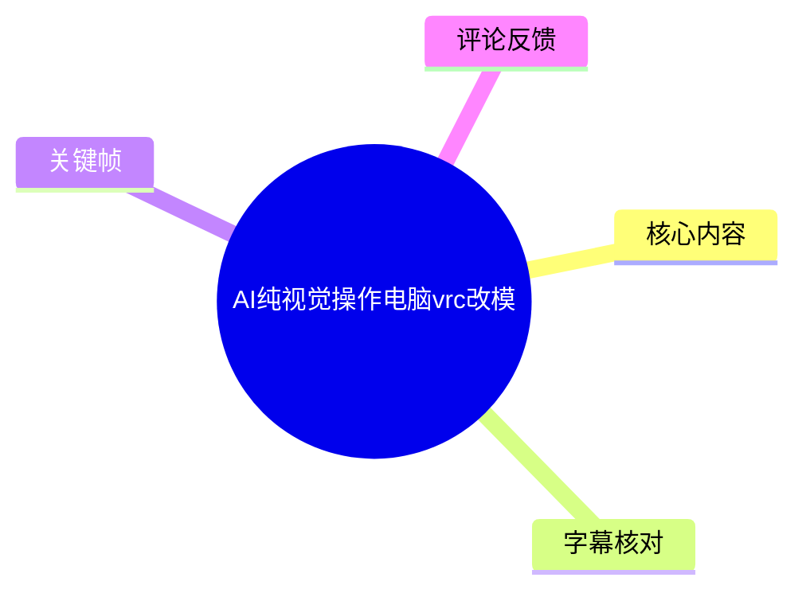
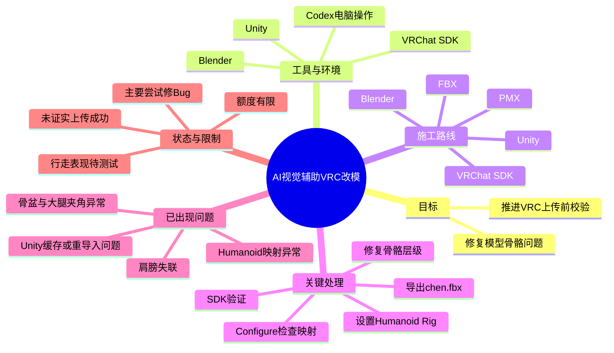
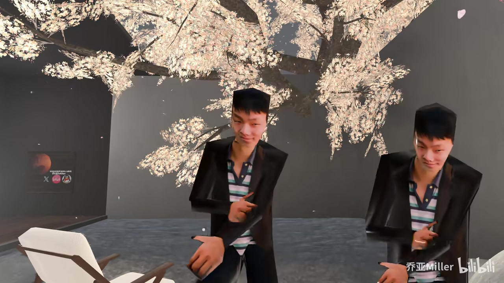
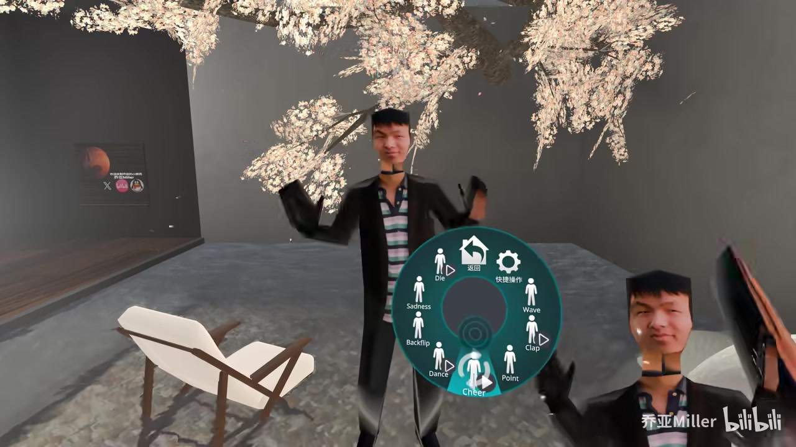

# AI纯视觉操作电脑vrc改模

> 来源：[Bilibili 视频](https://www.bilibili.com/video/BV1V1V76kEPy) 
> UP 主：乔亚Miller｜视频时长：02:45｜分区集合：AIcode  
> 视频简介提及工具为 **Codex**；Windows 可通过 Microsoft Store、macOS 可通过 App Store 获取，手机端路径为 ChatGPT → Codex。

## 小结

这是一段展示 AI 通过屏幕视觉与电脑操作界面参与 VRChat（VRC）模型修复的短视频。视频的核心不是从零制作角色，而是让 AI 围绕一个已有模型的骨骼层级、FBX 导出、Unity Humanoid 映射及 VRChat SDK 校验问题进行排错和推进。

视频呈现的施工路线可概括为：**PMX → Blender → FBX → Unity → VRChat SDK**。画面中的 Codex 任务清单将其拆解为四项：检查并修复 Blender 骼骨层级、导出 `chen.fbx`、在 Unity 重新导入并检查 Humanoid 映射、执行 VRChat SDK 校验并尝试上传。

最重要的技术经验是：VRC 改模的关键不只是“骨骼是否存在”，还包括**骨骼父子层级、肩膀/颈部归属、Unity Humanoid Rig 映射，以及重新导入后配置是否被重置**。视频中 AI 先在 Blender 内修复并导出，再在 Unity 中将模型 Rig 调整为 Humanoid、进入 Configure 检查映射；这说明跨软件回流验证是必要步骤。

不过，这不是一份已经验证成功的全自动改模案例。作者明确表示当前主要让 AI “修 Bug”，且受额度限制；旁白也称“看能不能正常走路尚待测试”。画面还可见 Unity/VRChat SDK 的警告或失败状态，因此不能据此断言模型已成功上传、动作表现完全正常，或工作流能够无监督地适用于所有模型。

适合已经接触 Blender、Unity、VRChat SDK，且想评估视觉型电脑 Agent 能否辅助排错的 VRC 创作者阅读。对于想直接“一句话自动改好模”的读者，视频提供的是一个具有潜力的过程演示，而不是可复现的完整自动化成品方案。

## 思维导图

## 目录

- [背景、范围与时效性](#背景范围与时效性-000000)
- [AI 视觉操作与骨骼层级修复](#ai-视觉操作与骨骼层级修复-000000)
- [PMX 到 VRChat SDK 的处理路线](#pmx-到-vrchat-sdk-的处理路线-000024)
- [Unity Humanoid 映射与问题回流](#unity-humanoid-映射与问题回流-000024)
- [当前结果、验证边界与可迁移经验](#当前结果验证边界与可迁移经验-000048)
- [字幕比对](#字幕比对)
- [评论分析](#评论分析)
- [处理记录](#处理记录)

## [背景、范围与时效性](https://www.bilibili.com/video/BV1V1V76kEPy?t=0)

视频标题为“AI纯视觉操作电脑vrc改模”，结合画面中 “Codex is using your computer” 提示，可确认演示对象是由 Codex 操作图形界面来辅助处理 VRC 模型。这里“纯视觉”可理解为 Agent 依据屏幕所见界面推动操作；视频没有提供其底层视觉模型、权限配置、提示词全文或完整操作日志，因此不能扩展解释为完全不需要人工输入、文件权限或环境配置。

视频发布于 2026-05-31。其涉及的软件界面、VRChat SDK 校验规则、Codex 客户端能力与应用商店分发路径均可能随版本变化；本文只记录视频素材中出现的流程与状态，不将其视为长期固定配置。

已知项目中至少出现以下环境与对象：

| 项目 | 素材中的证据 | 作用 |
| --- | --- | --- |
| Codex | 视频简介直接写明“AI工具：codex”；画面出现“Codex is using your computer” | 执行电脑端界面操作、生成/执行任务步骤 |
| Blender | 画面可见 Blender 界面与 Python Console | 检查、修复骨骼层级并导出 FBX |
| Unity | 画面可见 Unity Inspector、Rig 设置和 VRChat SDK 面板 | 导入 FBX、设定 Humanoid、检查映射 |
| VRChat SDK | Unity 中可见 “Create an Avatar” 面板 | 对 Avatar 内容执行验证并进入上传前流程 |
| `chen.fbx` | 画面左侧 Agent 文字与 Unity Assets 路径均出现该文件名 | 修复后在软件间传递的 FBX 文件 |

## [AI 视觉操作与骨骼层级修复](https://www.bilibili.com/video/BV1V1V76kEPy?t=0)

旁白以戏谑口吻介绍 AI “不懂骨骼，但会检查骨骼”，并说它将骨骼重新挂回上半身。结合后续 Blender 与 Unity 画面，应将这里理解为：AI 在已有模型骨架中识别或处理父子层级、再将修复后的结果导出给 Unity 验证；素材没有给出完整骨骼树、脚本源码或每根骨骼的确切改动，因此不能确认具体重挂了哪些节点。

画面中的 Codex 任务清单显示了可见的执行目标：

1. 检查并修复 Blender 骨骼层级，然后导出 `chen.fbx`。
2. 在 Unity 重新导入修复后的 FBX，并验证 Humanoid 映射。
3. 运行 VRChat SDK 验证，继续完成上传流程。
4. 确认最终 VRChat Avatar 上传结果。

> 图：画面左侧为 Codex 的任务与执行说明，右侧为 Blender；底部字幕强调“它不懂骨骼，但它会检查骨骼”。该帧的价值在于同时给出 Agent 的目标拆分与实际操作软件，说明演示并非只停留在文字建议。

骨骼层级在 VRC 工作流中尤为关键：即使网格与骨骼对象都存在，若肩膀、颈部或上肢的父子关系不符合 Humanoid 识别预期，Unity 仍可能无法生成正确映射。视频的旁白将“肩膀和脖子必须服从组织架构”作为核心判断，属于对这一层级依赖的形象描述。

需要注意，ASR 在开头将“AI纯视觉”识别为“纯AR视觉”，并出现大量骨骼名误识；标题、简介、Codex 操作界面均支持采用“AI 纯视觉操作电脑”的表述，而非将其写成 AR 功能演示。

## [PMX 到 VRChat SDK 的处理路线](https://www.bilibili.com/video/BV1V1V76kEPy?t=24)

旁白在 00:24 前后给出的路线依次涉及 PMX、Blender、FBX、Unity 与 VRChat SDK。由于 ASR 将其中部分英文工具名识别为 “Gives”“UMD”等无意义词，本节以视频标题、可见界面和后续操作为依据进行保守校正：可确认的主干流程是从模型源文件进入 Blender，导出 FBX，在 Unity 中配置并接受 VRChat SDK 校验。

### 实际可见的操作顺序

| 步骤 | 软件/环节 | 素材所示动作 | 目的与注意点 |
| --- | --- | --- | --- |
| 1 | 模型源文件 | 旁白称“本次施工路线为 PMX” | 表明 PMX 是流程起点；素材未展示 PMX 的导入具体参数。 |
| 2 | Blender | 检查、修复骨骼层级；画面出现 Python Console | 处理骨架父子关系并生成修复结果。未提供脚本全文，无法复现命令。 |
| 3 | FBX | 导出名为 `chen.fbx` 的文件 | 将 Blender 修复结果传给 Unity；需警惕导出后层级或配置发生变化。 |
| 4 | Unity | 将修复后的 FBX 导入 Assets 并进入 Rig 面板 | 将导入设置转为 Humanoid，再进入 Configure 检查骨骼映射。 |
| 5 | VRChat SDK | 在 “Create an Avatar” 面板中查看内容检查项 | 进行 SDK 校验，处理警告后才具备进一步 Build/Publish 的条件。 |
| 6 | VRChat 内测试 | 旁白称“看能不能正常走路尚待测试” | 即使 SDK 配置通过，仍应实机验证站立、行走和动作表现。 |

视频没有展示 PMX 导入 Blender 的插件选择、FBX 导出面板参数、Unity 版本、VRChat SDK 版本、Avatar Descriptor 配置及最终 Build & Publish 的结果。因此，上表只能作为素材内流程顺序，不能替代一份逐项可运行的改模教程。

## [Unity Humanoid 映射与问题回流](https://www.bilibili.com/video/BV1V1V76kEPy?t=24)

视频集中暴露出几个跨软件处理时常见、但尚未被完全验证解决的问题：

- **肩膀失联**：旁白明确提及“肩膀失联”。这与骨骼层级或 Humanoid 映射不正确相符，但素材没有展示异常前后的完整骨架对照。
- **Humanoid 映射异常**：画面和旁白均涉及 Unity 的 Humanoid 映射。Unity 导入后需要在 Rig 配置中选择 Humanoid 并进入 Configure 检查；自动映射不能视为最终正确结果。
- **重新导入后配置回退**：画面左侧 Agent 文本称，修复后的 FBX 重新导入 Unity 后，导入设置回到 Non-humanoid，需要再次将 `Assets\chen.fbx` 的 Rig 设置为 Humanoid 并应用。这说明 Blender 修复与 Unity 设置不是一次性动作，重导入会改变或重置状态。
- **骨盆与大腿夹角异常**：旁白/画面给出“你的骨盆和大腿夹角有点抽象”的提醒。这说明验证器或映射检查仍发现人体骨架姿势/方向问题；视频未给出该问题的最终修正值。
- **Unity 缓存与缩略图问题**：旁白提到 Unity 缓存相关问题，以及缩略图被拍成“后脑勺”。前者没有提供清理方法；后者应理解为 Avatar 上传展示图的视角问题，而非必然影响骨架可用性。

> 图：该帧同时显示 VRChat SDK 的 “Create an Avatar” 面板、Unity Inspector 的 Rig 标签及左侧 Agent 对重新导入问题的说明。它直接支撑“导入后需重新检查 Humanoid 设置”的结论，也提示当时仍有警告/待处理状态。

> 图：Blender Python Console 与左侧 Agent 文本同屏出现，画面说明 Agent 将问题回流到 Blender 后处理，再导出 FBX。该帧的价值在于展示流程不是单向导入 Unity，而是“Unity 发现问题—Blender 修复—再次导入”的闭环。

### 可迁移的排错顺序

基于视频实际呈现，较稳妥的排错顺序应是：

1. 在 Blender 检查骨骼父子结构，特别关注躯干、颈部、肩膀及左右上肢的连续关系。
2. 导出修复后的 FBX，例如画面中的 `chen.fbx`。
3. 在 Unity 中重新导入该 FBX。
4. 在 Inspector 的 Rig 设置中确认 Animation Type 为 **Humanoid**，并执行 Apply。
5. 进入 Configure，检查肩膀、上臂、前臂、手、腿等映射是否合理；不能只依赖自动识别结果。
6. 回到 VRChat SDK 的 Avatar 创建/校验面板，逐项处理警告。
7. 在实际 VRChat 环境测试走路及动作；视频明确说明这一环仍待测试。

以上是按素材重组出的操作逻辑。视频没有给出自动化脚本、按钮坐标、具体 Unity/SDK 版本或可复制的命令，因此无法据此承诺相同项目能够得到相同结果。

## [当前结果、验证边界与可迁移经验](https://www.bilibili.com/video/BV1V1V76kEPy?t=48)

旁白的结论是：这个“凭截图理解人体工程学”的数字角色正缓慢走向 VRChat，“看能不能正常走路尚待测试”，但“至少已经拥有了符合规范的肩膀”。这是一种阶段性进展表述，而非最终交付确认。

> 图：画面可见 Unity Inspector 中 Animation Type 为 Humanoid，VRChat SDK 面板仍显示检查项目。该帧有助于区分“已完成 Humanoid 设置/映射检查”与“已成功上传并完成实机验证”这两个不同层级的结论。

### 视频确认到的结果

- AI 已被用于操作 Blender 与 Unity 的图形界面，并围绕骨骼问题推进修复。
- 工作流至少走到了 Unity Humanoid 设置、Configure 检查及 VRChat SDK 校验界面。
- 旁白认为肩膀已达到“符合规范”的状态。
- 后续行走测试仍未完成或至少未在素材中展示完成结果。

### 不应超出素材的结论

- 不能确认 Avatar 已成功 Build & Publish。
- 不能确认 VRChat 内的站立、走路、IK、表情或全身追踪表现正常。
- 不能确认 AI 对不同 PMX 模型都能自主完成骨骼修复。
- 不能确认画面中执行的 Python 代码适用于其他模型，因代码全文与运行上下文均未提供。
- 不能把旁白中的戏谑说法当作严格的技术指标或性能测试结果。

### 对创作者的经验提示

1. **让 AI 执行 GUI 不等于免检。** AI 可以把多个软件中的重复操作串联起来，但骨骼层级和 Humanoid 映射需要人类复核。
2. **以 SDK 和实机表现为最终门槛。** Unity 中的映射通过不等于 VRC 中动作正常；SDK 提示、上传结果和实际行走测试缺一不可。
3. **保留回退与复查节点。** 导出 FBX、Unity 重导入、Rig 设置变动都可能引入新问题，应保留修复前文件与每轮导出版本。
4. **把“异常描述”转换为可检查项。** 如“肩膀失联”对应骨骼父级和映射，“骨盆与大腿夹角”对应姿态、方向或映射检查，“后脑勺缩略图”对应拍摄/缩略图视角，而不是混为一个问题处理。

## 字幕比对

| 字幕来源 | 完整性 | 专有名词 | 时间轴 | 主要问题 |
| --- | --- | --- | --- | --- |
| Bilibili 站内字幕 | 未提供可用字幕 | 无法评估 | 无法使用 | 素材包中没有可用站内字幕。 |
| 本次 ASR 字幕 | 仅覆盖 00:00:00.020–00:01:00.050，约 60.03 秒语音；视频总长约 164.50 秒 | 较差，多个软件名、骨骼术语失真 | 可用，共 3 段真实 SRT 时间轴 | 将“AI”识别为“AR”，PMX/Blender/FBX/Unity/VRChat SDK 等术语多处误识，且缺少后续约 104 秒内容的文本。 |

本次 ASR 使用 `medium` 模型，识别语言为中文，语言概率为 0.9863，带时间戳；诊断未标记 `noAudioStream=true`，因此不能称源视频无音轨。相反，ASR 确实识别到了开头约 60 秒的语音，只是覆盖不足且专有名词错误较多。

最终采用策略如下：

- **时间轴**：采用 ASR SRT 的三个真实分段起止时间，章节链接仅使用 0 秒、24 秒和 48 秒等可追溯时间，不根据文字顺序臆测后半段的时间位置。
- **正文术语**：以标题、视频简介、可见软件界面和关键帧作为校正依据，将明显错误的“纯AR视觉”校为“AI纯视觉”，将乱码式软件链路校正为 PMX、Blender、FBX、Unity、VRChat SDK。
- **未能校正的内容**：ASR 中疑似骨骼缩写或节点名称，如 “GNL”“GNR”“MND”等，缺乏可靠画面或文本证据，不将其扩写为具体骨骼名。
- **后半段内容**：由于没有站内字幕、ASR 又未覆盖完整视频，只能依据提供关键帧中的可见 UI 记录 Blender、Unity、Rig 与 SDK 状态；不补写无法从素材确认的旁白或操作。

## 评论分析

当前仅获取到 2 条热评，未达到“热评前三条”的数量；以下仅分析可获得的两条，不将评论观点视为已验证事实。

1. **小congser（14 赞）**  
   观点是认可该演示的潜力，并提出自己想通过插件和多 Agent 协同实现“全自动改模”。评论补充了其已尝试使用部分插件、但觉得效果仍有限的个人经验，同时认为独立开发插件困难、阻力较多。  
   这条评论反映了创作者对自动化改模的需求，但其中“一年写 Agent”“全自动改模”的计划属于个人设想，不能证明当前视频已经达到该能力。

2. **摸鱼的布偶猫（14 赞）**  
   观点是未来或许能做到用户提供材料、甚至让 AI 自制模型，再用一句话完成改模。  
   该评论体现对自然语言驱动改模的期待，与视频展示的 GUI Agent 方向一致；但这属于预测。视频本身仍受额度、Bug 修复范围和待测试状态限制，不能据此推导已能一键完成任意模型改造。

## 处理记录

- Worker ID：`worker-mrj0www4-e8d79408`
- 模型：`gpt-5.6-terra`
- 调用工具与素材：视频元数据、音频 ASR 结果、ASR SRT 时间轴、关键帧、评论 JSON；ASR 模型为 `medium`，CUDA / `float16`。
- 字幕选择：站内字幕未提供可用文件；已检查本次 ASR，并以其 3 段 SRT 的真实时间戳制作时间轴。正文术语以标题、简介和关键帧进行有限校正。
- 关键帧选择依据：选择包含 Codex 任务清单与 Blender、Unity Inspector 的 Humanoid Rig、VRChat SDK “Create an Avatar” 面板、Blender Python Console 的画面，分别支撑任务拆分、导入配置、校验状态与问题回流的描述。
- 缓存清理：素材未提供缓存清理执行记录；本文不虚构已清理结果。
- 未解决问题：无站内字幕；ASR 只覆盖约 60 秒语音且专有名词误识明显；未提供完整脚本、FBX 导出参数、Unity/SDK 版本、最终上传结果和 VRChat 实机走路测试结果。
