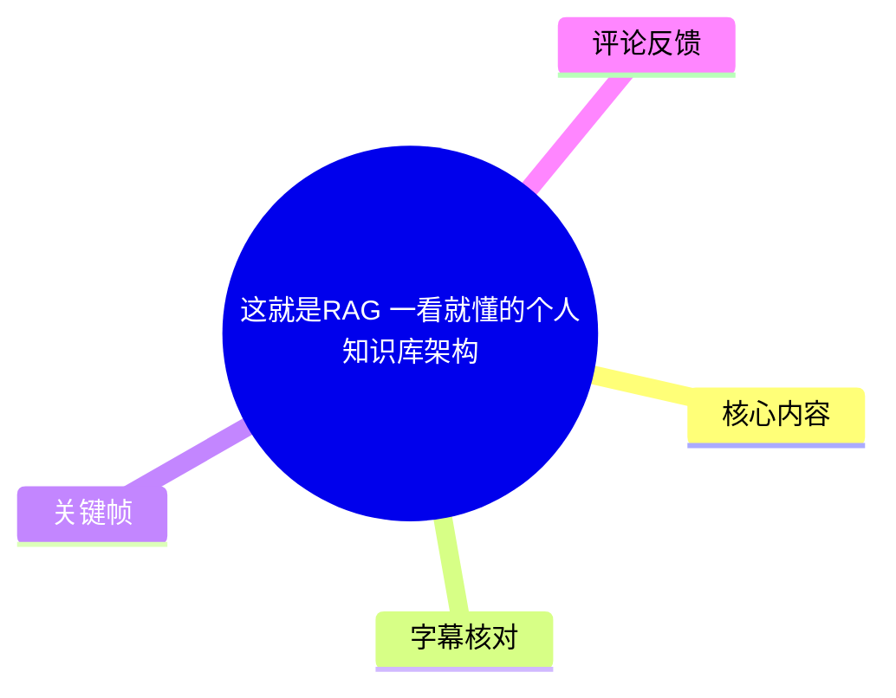
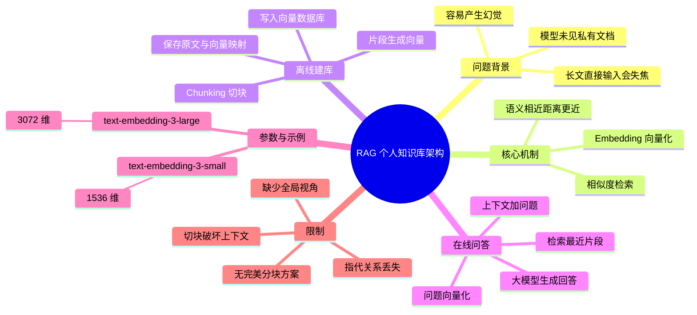
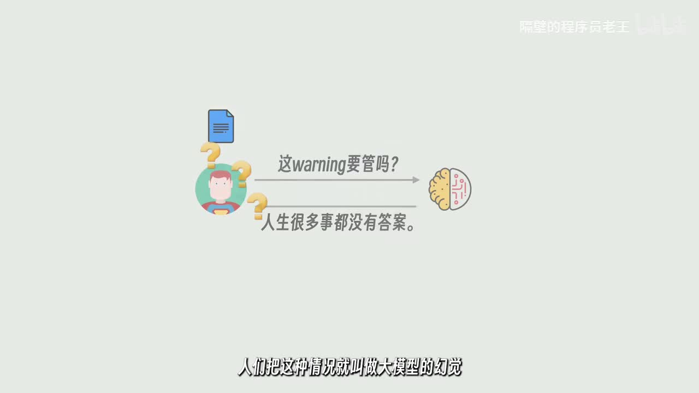
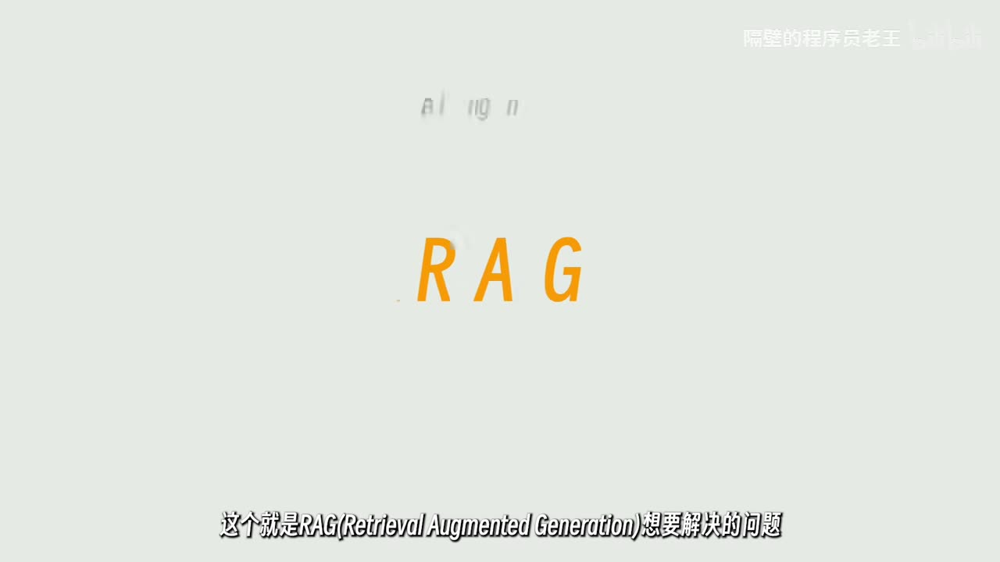
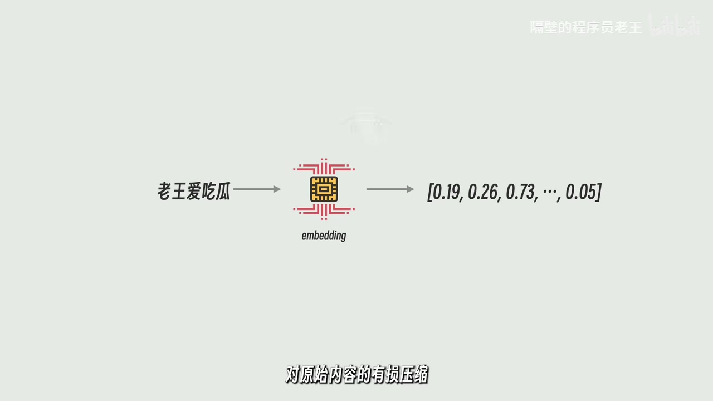
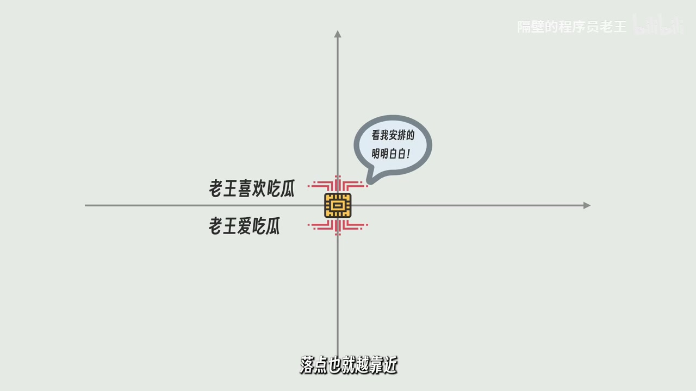

# 这就是RAG 一看就懂的个人知识库架构

> 来源：[Bilibili 视频](https://www.bilibili.com/video/BV19RJhzyEWN)  
> UP 主：隔壁的程序员老王｜发布时间：2025-05-22｜视频时长：09:01  
> 标签：AI、人工智能、教程、RAG、个人知识库

## 小结

视频以“程序员拿内部文档询问大模型”为场景，解释了 RAG（Retrieval-Augmented Generation，检索增强生成）为何存在：模型未见过私有文档时可能产生与问题无关、但看似合理的回答；而将整份长文直接塞入上下文，又会因信息过多而难以聚焦。RAG 的策略是在生成回答前，先从知识库中找出与问题最相关的小段内容，再连同问题一起交给大模型。

核心技术是 **Embedding（嵌入）模型**：它将不同长度的文本映射为固定长度的数值向量。视频举例称，OpenAI 的 `text-embedding-3-small` 输出 1536 维向量，`text-embedding-3-large` 输出 3072 维向量。语义相近的文本在向量空间中的距离通常更近，因此可以按距离检索相关内容。

视频给出的完整 RAG 流程可概括为：**文档切块（Chunking）→ 每块生成向量 → 将向量与原文片段的对应关系写入向量数据库 → 将用户问题向量化 → 相似度检索最近片段 → 片段、问题共同输入大语言模型生成答案**。它强调，向量数据库解决的是“找最近向量”的近似语义检索需求，不是传统数据库擅长的精确值匹配。

RAG 并非万能方案。视频指出两项先天限制：其一，切块可能截断指代、上下文和关键语义；其二，局部相似度检索缺少全局视角，难以回答“全文一共出现多少个某字”这类与整篇文档相关、但没有单一高相关片段的问题。预处理消歧、让大模型参与语义切块等方法可缓解问题，但视频认为尚无“十全十美”的方案。

本片适合刚接触个人知识库、企业内部文档问答或 AI 应用架构的读者。片中模型名称、向量维度及向量数据库举例是视频发布时的讲解信息；具体产品能力、价格、版本与可用性会随时间变化，工程实践应以当前官方文档和实际评测为准。

## 思维导图





## 目录

- [问题背景：为何不能直接问模型](#问题背景为何不能直接问模型)
- [RAG 与 Embedding：把语义变为可比较的向量](#rag-与-embedding把语义变为可比较的向量)
- [向量空间与相似度检索](#向量空间与相似度检索)
- [完整 RAG 架构：建库与问答步骤](#完整-rag-架构建库与问答步骤)
- [向量数据库：保存与召回知识片段](#向量数据库保存与召回知识片段)
- [RAG 的限制与改进方向](#rag-的限制与改进方向)
- [结尾观点：压缩、取舍与上下文](#结尾观点压缩取舍与上下文)
- [关键帧索引](#关键帧索引)
- [字幕比对](#字幕比对)
- [评论分析](#评论分析)
- [处理记录](#处理记录)

## [问题背景：为何不能直接问模型](https://www.bilibili.com/video/BV19RJhzyEWN?t=34)

视频从一个内部文档问答的情境切入：程序员面对未被模型训练或访问过的内部文档时，直接向大模型提问，模型可能给出语言流畅、结构完整，却与真实问题无关的回答。视频将这类现象称为大模型的“幻觉”。

一种直觉式改法是把“文档 + 问题”一并发送给模型。对于文档较短的情况，这可以让模型获得必要上下文并提升回答正确性。但视频随即指出，文档规模增大后，答案可能只在某个小段或零散语句中；让模型读取整份材料，反而会使重点被大量无关信息淹没，回答仍可能跑偏。

因此，RAG 要处理的不是单纯“让模型看到资料”，而是更具体的问题：

1. 私有资料并非模型已有知识，需要外部提供。
2. 资料不能无差别地整份输入。
3. 系统需要在回答前识别：**哪些内容与当前问题真正相关**。
4. 检索到的相关片段应作为上下文，与问题共同交给生成模型。



> 图：画面以“这 warning 要管吗？”等提问示意模型面对未知内部信息时的回答风险。它直观说明了 RAG 的起点：知识不在模型上下文或训练知识中时，不能把回答可靠性寄托于模型自行猜测。

## [RAG 与 Embedding：把语义变为可比较的向量](https://www.bilibili.com/video/BV19RJhzyEWN?t=60)

视频在此给出 RAG 的英文全称：**Retrieval-Augmented Generation**，即“检索增强生成”。其基本思想是：先检索，再生成；生成阶段获得的不是整篇原文，而是针对问题筛选出的相关上下文。

要判断文本片段是否相关，视频引入 Embedding 模型。它的输入也是一段文本，但输出不同于聊天模型的自然语言回答，而是一个**固定长度的数值数组**，也可称为向量。

视频明确列出的参数为：

| 模型 | 视频所述输出维度 | 含义 |
| --- | ---: | --- |
| OpenAI `text-embedding-3-small` | 1536 维 | 每段输入文本被映射为长度固定的数值向量 |
| OpenAI `text-embedding-3-large` | 3072 维 | 输出维度更高的固定长度向量 |

无论输入是一句话还是一段话，Embedding 输出长度保持固定。视频将此比喻为对原始内容的“有损压缩”：细节会被浓缩或丢失，但文本所表达的部分语义特征仍保留在向量中。



> 图：画面直接呈现 “RAG” 与其英文全称，是理解后续“检索后再生成”流程的概念锚点。



> 图：该画面展示文本经 Embedding 模型映射为数组的过程，补足了“向量并不是原文、而是数值表示”的关键认知。

### 关键理解：向量不是事实数据库

视频的“有损压缩”比喻也隐含边界：向量表示适合比较语义关联程度，却不能保证完整保留原文中的每一个字、精确数字或全局结构。RAG 实际回答时仍需取回原始文本片段，而不是让大模型仅根据向量数值作答。

## [向量空间与相似度检索](https://www.bilibili.com/video/BV19RJhzyEWN?t=132)

为便于解释，视频假设存在一个“特别弱”的 Embedding 模型，它只输出两个数字。这样，每段文字都可以被放在二维坐标系中的一个点上；真实模型通常对应一千多维到三千多维的高维空间，无法用平面图完整画出。

视频用以下语义关系说明“距离”的意义：

- “老王爱吃瓜”与“老王喜欢吃瓜”语义相近，向量落点应彼此接近。
- “我也爱 Python”与前两句仍有“爱好”层面的部分关联，因此可能更远。
- “刚买的飞机被打了”与“老王爱吃瓜”主题差异很大，因此会非常远。

二维图只用于教学。现实中句子数量和表达关系复杂，二维空间无法准确容纳所有距离关系；使用更高维的向量空间，能更细致地区分句子的语义关系。这里的“距离”是视频的通俗说法；实际系统还需要选择具体相似度或距离度量、索引策略及召回数量，视频未展开这些工程参数。



> 图：画面把“老王喜欢吃瓜”和“老王爱吃瓜”放在相近位置，直观解释了向量检索为何能将同义或近义表达召回。

### 查询时发生什么

当用户提出“老王爱吃什么”时，系统使用**与建库阶段相同的 Embedding 模型**将问题变为向量；随后计算问题向量与已有片段向量之间的距离，选出距离最近的若干片段，例如“老王爱吃瓜”“老王喜欢吃瓜”。

最终发送给大模型的是：

- 用户原始问题；
- 检索出的高相关原文片段；
- 应用设计中可能附加的回答指令。

视频的判断是：与整份长文相比，这样能让模型看到更集中、更强相关的上下文，从而降低幻觉风险；但它说的是“风险小很多”，并未宣称 RAG 可完全消除幻觉。

## [完整 RAG 架构：建库与问答步骤](https://www.bilibili.com/video/BV19RJhzyEWN?t=229)

视频将 RAG 过程分为用户提问前的离线预处理，以及用户提问后的在线检索与生成。

### 一、离线阶段：处理并建立知识库

#### 1. 文档切块（Chunking）

首先把一份长文档拆成多个小片段。视频列举的切分方式包括：

- 按字数切；
- 按段落切；
- 按句子切；
- 使用更复杂的切分策略。

这一过程的术语是 **Chunking**，可直译或理解为“切块”。切块的目的不是简单缩短文本，而是为后续检索建立足够细的候选单元。

#### 2. 对每个片段生成 Embedding

对每一个文本块分别调用 Embedding 模型，获得长度统一的数值数组，即向量。统一维度使不同片段能被置于同一向量空间内并进行距离比较。

#### 3. 保存“向量—原文片段”对应关系

视频强调，仅有向量不够。系统必须保存每一个向量对应的原始文本片段；否则即便检索到相近向量，也无法把可阅读、可引用的文本上下文提供给大模型。

### 二、在线阶段：响应用户问题

#### 4. 将用户问题向量化

用户提出问题后，使用同一个 Embedding 模型将问题转换为向量。使用同类模型的前提是：问题与知识片段需要处于可比较的同一向量表示体系中。

#### 5. 从向量库检索最近片段

将问题向量作为查询条件，从知识库中选取距离最近的若干文本片段。视频未规定固定的 Top-K 数量、距离阈值或重排模型，因此这些属于实际部署时需要自行评估的参数。

#### 6. 将“问题 + 检索上下文”发送给大模型

最后，把被选中的片段作为上下文，与原始问题一同输入大语言模型。至此，视频所描述的完整 RAG 架构完成。

```text
离线建库：
原始文档
  → Chunking（切块）
  → 各片段 Embedding（向量化）
  → 保存 [原文片段, 向量] 对应关系
  → 向量数据库

在线问答：
用户问题
  → 使用同一 Embedding 模型生成问题向量
  → 向量数据库相似度检索
  → 取回最相近的原文片段
  → [片段上下文 + 用户问题] 交给大语言模型
  → 生成回答
```

## [向量数据库：保存与召回知识片段](https://www.bilibili.com/video/BV19RJhzyEWN?t=277)

视频区分了传统数据库与向量数据库的主要查询差异：

| 类型 | 视频中的侧重点 |
| --- | --- |
| 传统数据库 | 擅长根据明确数值或确定条件查找记录，例如精确匹配 |
| 向量数据库 | 面向“哪个向量离查询向量最近”的检索需求，可让每条数据关联一个向量 |

在向量数据库中，每条知识记录可关联对应的 Embedding 向量。查询时输入问题向量，数据库返回距离最近的若干条记录；这些记录携带的原始文本片段，就是 RAG 提供给生成模型的候选上下文。

视频提到的常见方案包括：

- Pinecone；
- ChromaDB；
- PostgreSQL 配合 `pgvector` 插件。

这些名称在 ASR 中存在明显误识别（如 “pan-con”“chromadb”“posagryziko”），此处依据上下文及产品常见写法进行术语校正。视频仅作类别举例，没有比较它们的性能、成本、部署模式、索引算法或适用规模，不能据此推导某一方案必然更优。

### 实践中的最小数据结构

按视频所述逻辑，每个切块至少需要能够关联以下信息：

| 字段类别 | 作用 |
| --- | --- |
| 原始文本片段 | 被检索后提供给大模型作为上下文 |
| Embedding 向量 | 用于与问题向量计算相似度/距离 |
| 片段标识符 | 区分和定位每个片段 |
| 文档来源或位置 | 便于回溯片段来自哪份文档、哪个位置；这是对视频“对应关系保存”要求的工程化展开 |

其中，前三项直接来自视频架构所需；“来源或位置”是为了实现可追溯性而作的合理工程补充，并非视频逐字列出的固定字段。

## [RAG 的限制与改进方向](https://www.bilibili.com/video/BV19RJhzyEWN?t=350)

视频明确认为 RAG 不是完美架构，并给出两个核心限制。

### 限制一：分块会切断上下文与指代关系

不同文章的结构和语义边界不同，按句子、按段落乃至更复杂的算法，都无法适配全部场景。视频举例：

> 我是程序员老王。我爱吃瓜。

若恰好在两句之间切块，第二个片段中的“我”失去“老王”这一指代对象。此时，用户询问“老王喜欢吃什么”，检索系统可能无法将“我爱吃瓜”视为高度相关内容，导致其向量距离变远、召回概率下降。

视频的结论是：更复杂的分块策略只能**尽量减少**这种误伤，无法彻底避免。

### 限制二：局部检索缺少全局视角

视频以“这篇文章里一共出现多少个‘我’字”为例说明：这种问题与全文每句话都有关，但没有任何一个句子与问题显得特别相关。基于局部片段相似度的 RAG，难以自然覆盖全体文本，因此基本无法处理此类全局统计或整体性问题。

这提醒使用者区分任务类型：

| 更符合 RAG 局部检索特征的任务 | 视频指出较难处理的任务 |
| --- | --- |
| 查找某个事实、规则、步骤或定义 | 全文字符计数 |
| 从大量资料中定位相关段落 | 需要整篇结构综合、覆盖所有内容的问题 |
| 根据召回证据回答具体问题 | 不存在单一高相关片段的全局性问题 |

### 视频提及的缓解思路

为减少上述问题，视频提到两类改进：

1. **预处理消歧**：例如将文本中的“我”统一替换为“老王”，降低指代丢失带来的语义断裂。
2. **让大模型参与分块**：基于语义自动判断在哪里断开、如何切分，而非仅按固定字数或机械边界切分。

但视频同时强调，目前没有真正十全十美的方案，新的思路仍在持续出现。因此，RAG 应被理解为在模型上下文有限条件下的实用折中，而非一次性解决所有知识问答问题的终局架构。

## [结尾观点：压缩、取舍与上下文](https://www.bilibili.com/video/BV19RJhzyEWN?t=446)

视频以观点收束：RAG 的本质可看作一种压缩——文章过长时，系统通过切块、筛选和建索引保留重要部分，舍弃暂时不重要的内容。它将这种技术过程类比为日常生活中对人和事的分类、记忆与取舍。

但视频也回扣 RAG 的技术风险：当内容被切得过碎，可能失去上下文、误解原意，一些原本重要的信息会失去连接。结尾进一步把“向量坐标越来越远”借喻人与人之间联系逐渐疏远，并用过去游戏截图中队友 DPS 较低的玩笑收尾。

这一段属于作者的总结性表达，而非新增技术方案。它强化的技术认识是：**RAG 的检索效率来自压缩和筛选，而压缩和筛选必然伴随上下文损失风险。**

## 关键帧索引

| 关键帧 | 正文用途 | 画面价值 |
| --- | --- | --- |
|  | 问题背景 | 以文档提问与模型回答的关系，说明私有知识缺失时的幻觉风险。 |
|  | RAG 定义 | 直接呈现 RAG 英文全称，帮助建立“检索增强生成”的概念对应。 |
|  | Embedding 原理 | 说明文本经模型映射为数值数组，支撑“固定维度向量”的讲解。 |
|  | 语义相似度 | 将近义句置于临近坐标位置，直观展示向量距离与语义关联的关系。 |

## 字幕比对

| 字幕来源 | 完整性 | 专有名词 | 时间轴 | 主要问题 |
| --- | --- | --- | --- | --- |
| Bilibili 站内字幕 `p01-ai-zh.srt` | 与本视频主题严重不符 | 未包含 RAG 讲解所需术语 | 从 00:00:00 至约 00:04:11，且内容为地球承载力、外星人等话题 | 明显对应错误内容，不能作为本视频正文依据 |
| 本次 ASR 字幕 | 覆盖 00:00:34.640—00:08:53.000；诊断语音覆盖率 91.68% | 有较多音译、错字和英文术语误识别 | 具有真实分段起止时间；全片时长约 540.27 秒 | 每段文本过长；RAG 被误写为 RUG/Rogue，Embedding、数据库名称等存在识别错误 |

### 最终字幕选择

正文以**本次 ASR 的时间轴**为准，因为它与视频标题、关键帧画面和 RAG 技术主题一致；章节链接均取自 ASR 提供的明确起始时间。站内字幕虽存在，但内容完全偏离本片，故不采用。

本次 ASR 检测结果显示：

- 识别语言：中文；
- 语言置信度：`0.9990234375`；
- 音频时长：约 `540.27` 秒；
- 首段语音：`00:00:34.640`；
- 末段语音：`00:08:53.000`；
- 未标记 `noAudioStream=true`，因此可确认源视频存在可供识别的音轨，并非无音轨视频。

结合关键帧、视频标题及上下文，对以下重要术语进行了校正：

| ASR 结果 | 正文采用写法 | 校正依据 |
| --- | --- | --- |
| RUG / Rogue | RAG | 视频标题、关键帧中的 “RAG”、英文全称上下文 |
| Retrieval Augmented Generation | Retrieval-Augmented Generation | RAG 通用英文全称写法 |
| Embadding / Embing | Embedding | 技术术语与画面标注 |
| Text Embedding 3 Small / Large | `text-embedding-3-small` / `text-embedding-3-large` | 视频语义与模型命名惯例 |
| pan-con | Pinecone | 向量数据库举例上下文 |
| posagryziko 配合 pgvector | PostgreSQL 配合 `pgvector` | 常见向量检索组合及上下文 |
| 向量数据裤 | 向量数据库 | 明显同音识别错误 |

需要注意：ASR 首个时间段将较长语句压缩到 `00:00:34.640—00:00:36.100`，其内部文本长度与时间不成比例；因此本文只将其作为章节定位依据，不将该异常分段精度误当作逐句级时间精度。

## 评论分析

以下仅分析可获取的热评前三条，评论反映的是观众感受，不构成对技术内容的独立验证。

1. **adkda｜420 赞**  
   评论认为视频在约 9 分钟内将复杂的 RAG 讲得清楚，并肯定 UP 主的知识归纳能力。该评价与视频采用“问题—向量—检索—架构—限制”的递进叙事相吻合，但属于主观观看体验，不能单独证明讲解的全面性或工程准确性。

2. **达格列净｜157 赞**  
   评论称赞本片及此前 Agent 介绍视频在“专业性”和“通俗性”之间取得平衡，并期待更多相关内容。它补充了受众定位信息：该作者的讲解风格可能更适合希望理解 AI 架构、但不希望一开始进入复杂实现细节的观众。评论未提出具体技术异议。

3. **膛｜113 赞**  
   评论以玩笑概括视频表面讲 RAG、结尾吐槽游戏队友 DPS 低。这准确捕捉了视频结尾的叙事反转与幽默风格，但不应被误读为视频缺乏技术主体；从 ASR 内容看，绝大部分时长仍用于解释 RAG 架构、Embedding、向量数据库和局限性。

## 处理记录

- Worker ID：`worker-mrj0wbly-5dc4e50c`
- 模型：`gpt-5.6-terra`
- 调用工具与素材：视频元数据、Bilibili 站内字幕 `p01-ai-zh.srt`、本次 ASR 结果 `asr/asr-result.json` 与 `asr/transcript.srt`、关键帧 `frames/`、热评数据 `comments/comments.json`
- 字幕选择：已检查站内字幕与本次 ASR。站内字幕内容与本视频完全不符，正文采用本次 ASR 的真实时间轴，并依据关键帧和上下文校正专有名词。
- 关键帧选择依据：选择了分别呈现“模型幻觉问题”“RAG 名称”“文本向量化”“二维语义空间”的 `frame-001` 至 `frame-004`，它们直接对应视频核心概念，避免使用与正文关联较弱的画面。
- 时间轴依据：各章节时间均使用 ASR SRT 的明确起始时间换算为秒数，未依据文字顺序臆测位置。
- 评论处理范围：仅处理可获取热评前三条。
- 缓存清理：素材清单未提供可核验的缓存清理执行日志；本记录不虚构清理结果。
- 未解决问题：ASR 分段过粗且包含术语误识别；站内字幕错配。文中已对可由标题、关键帧与技术上下文确认的术语进行校正，无法从现有素材验证的产品版本、性能、费用和实现参数均未作延伸断言。
