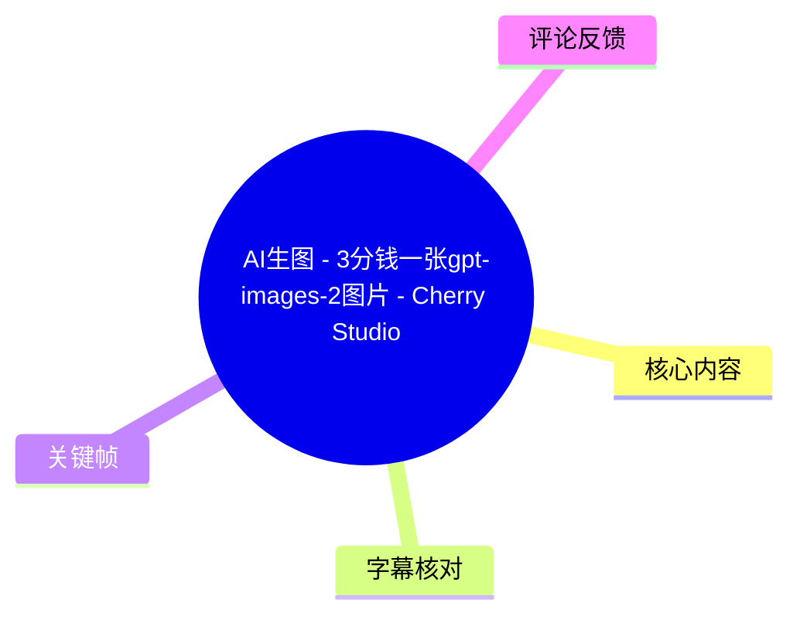
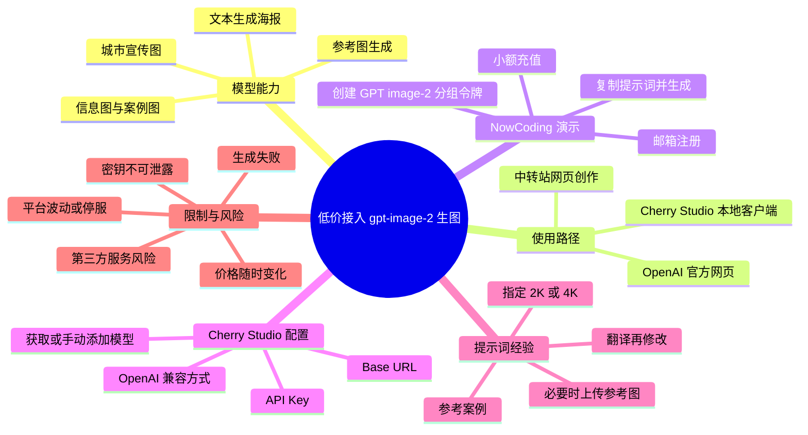
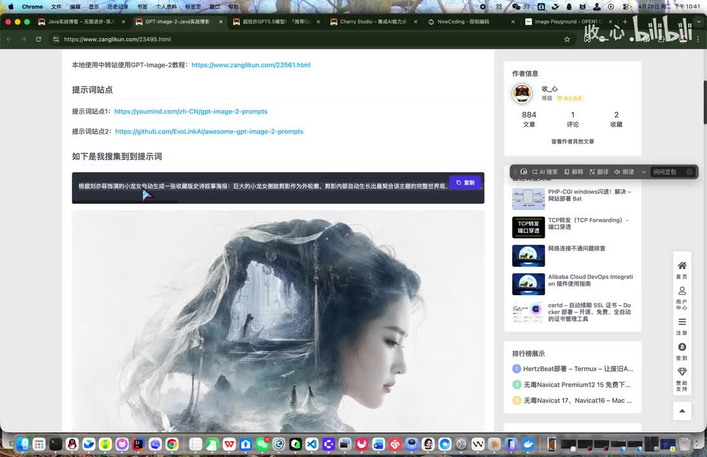
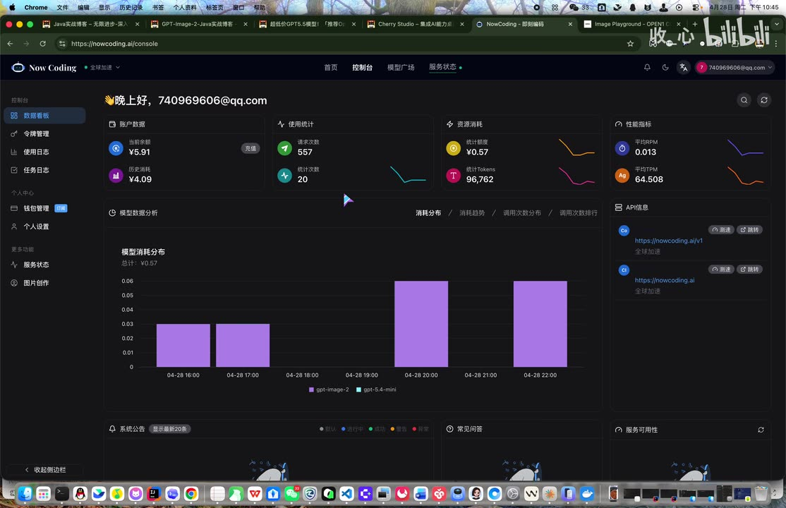
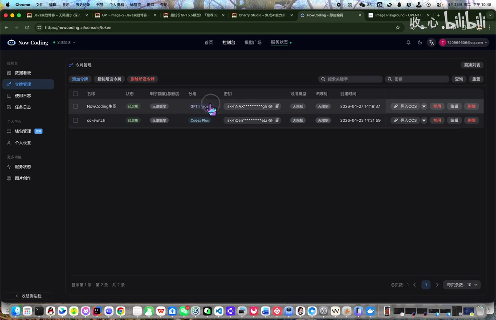
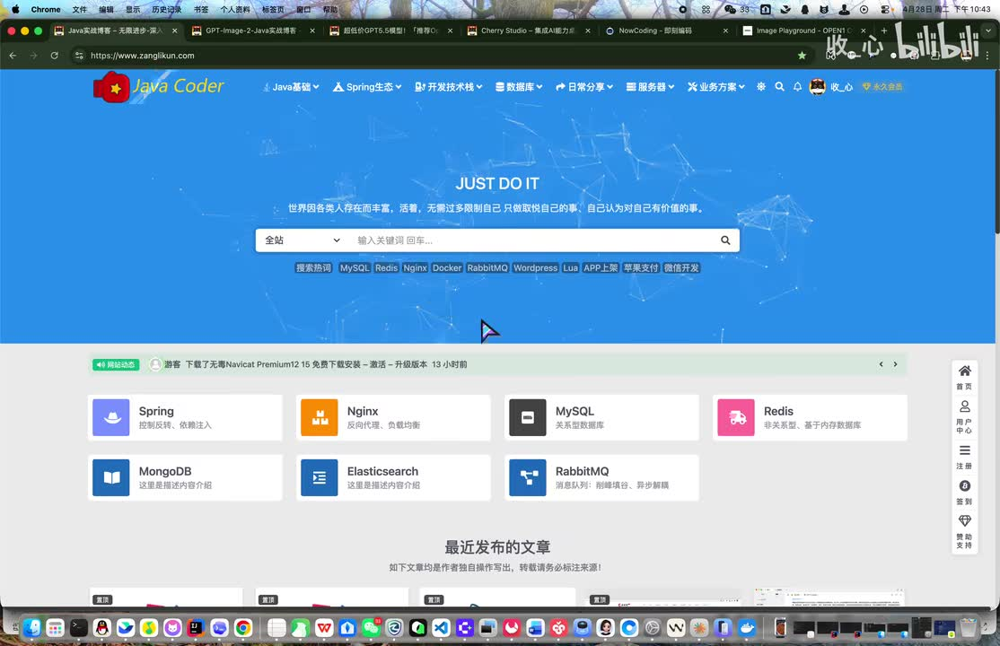

# AI生图 - 3分钱一张gpt-images-2图片 - Cherry Studio使用 - 中转站生图介绍

> 来源：[Bilibili 视频](https://www.bilibili.com/video/BV1nj9yBZEnD)<br>
> UP 主：收_心｜时长：27 分 43 秒｜合集：AIcode  
> 视频描述中提供了作者博客、`gpt-image-2` 与 Cherry Studio 的介绍页，以及 NowCoding、Open1 的注册链接。

## 小结

视频介绍了普通用户使用 `gpt-image-2` 类图像生成模型的两条路径：一是在中转站自带的“图片创作 / Imagine Playground”页面直接生成，二是把中转站的 API 接入本地客户端 Cherry Studio 后，通过对话方式完成文生图、参考图生图等操作。

UP 主以 NowCoding 为主要演示平台，称其在录制当日的实测价格约为 **0.03 元/张**；另展示了 Open1（口述中也有将其误识别为 OpenAI 的情况，实际应区分）。视频的核心操作是：注册并小额充值、创建对应 `gpt-image-2` 分组的令牌、复制 API Key，在网页或 Cherry Studio 中选定模型并输入提示词生成图片。

提示词不必从零开始写。视频建议从提示词案例站或 GitHub 案例页复制现成提示词，再结合自己的目标翻译、阅读与改写；若需要更高画面清晰度，可在提示词中明确要求 2K 或 4K，但 UP 主同时说明生成可能失败、重试也未必必然成功。

Cherry Studio 配置的关键不是平台名称，而是两项连接信息：**Base URL / API Endpoint** 与 **API Key**。在客户端中添加 OpenAI 兼容提供商后，获取模型列表并选择或手动添加 `gpt-image-2`，即可新建会话，输入文字或上传图片进行生成。API Key 属于敏感凭据，不应分享或暴露在截图、视频及公开内容中。

价格、模型列表、平台可用性和充值方式均高度时效性。UP 主明确提醒，任何中转站都可能暂停服务，视频只是提供一套“寻找并接入服务”的方法，不应把某个站点、某一价格或某项模型支持视为长期承诺。中转服务还涉及余额损失、接口波动、内容合规、隐私与密钥泄露等风险。

适合希望低门槛体验图像生成、愿意自行配置 API 的普通用户与开发者阅读。对只追求官方稳定性、不能接受第三方中转站波动或不愿承担预充值风险的用户，应优先评估官方渠道和服务条款。

## 思维导图





## 目录

- [背景、能力与适用范围](#背景能力与适用范围-000046)
- [直接在中转站生成图片](#直接在中转站生成图片-000514)
  - [NowCoding：注册、充值与令牌](#nowcoding注册充值与令牌-000539)
  - [提示词、参考图与生成结果](#提示词参考图与生成结果-000829)
  - [Open1 的演示与平台比较](#open1-的演示与平台比较-001150)
- [Cherry Studio 接入中转 API](#cherry-studio-接入中转-api-001643)
  - [下载与基础认知](#下载与基础认知-001734)
  - [Base URL、API Key 与模型配置](#base-urlapi-key-与模型配置-001842)
  - [对话生图、分辨率与失败重试](#对话生图分辨率与失败重试-002301)
- [限制、时效性与可迁移经验](#限制时效性与可迁移经验-002553)
- [字幕比对](#字幕比对)
- [评论分析](#评论分析)
- [处理记录](#处理记录)

## [背景、能力与适用范围](https://www.bilibili.com/video/BV1nj9yBZEnD?t=46)

视频开头以 `gpt-image-2` 为主题，但本次 ASR 将模型名多次识别为“gbd / gbt imagine tool / GPT imagine”。结合视频标题、描述、关键帧中的页面文字及后续模型配置，应统一理解为 **`gpt-image-2`**；“Imagine Playground”则是演示中出现的图片生成页面名称，不等同于模型名称。

UP 主的背景判断包括：

1. 其所称 OpenAI 免费账号每天可生成 3 张图片，Plus 或 Pro 可无限生成；这属于视频录制时的个人说法，未在素材中提供官方政策页面，不能视为当前有效的官方规则。
2. 国内用户直接使用 OpenAI 官方服务可能存在注册、支付或使用场景上的门槛，因此视频转向介绍中转站。
3. 中转站将 OpenAI 模型集成到自己的平台，用户通过充值、令牌和 API 调用使用模型；UP 主主张从易用性、持续性与便利性角度选择相对知名的平台。
4. `gpt-image-2` 可按文字描述生成图像，但输出并非完全可控。UP 主将模型称为“黑盒”：输入相关文本后获得对应图片，不应假设每次都会精确满足预期。

视频展示的案例包含：以“小龙女”为主题的史诗叙事海报、广州城市宣传海报、博物馆介绍图、学习防护类图像和信息图等。这里展示的是图像生成的应用形式，并非对模型能力边界的完整测试。



> 图：画面显示作者博客中的提示词站点链接、可复制的长提示词，以及以人物侧脸为主体的“小龙女”风格示例图。它说明视频的提示词获取方式是“案例页 + 复制按钮 + 结果预览”，也是后续实操的输入来源。

## [直接在中转站生成图片](https://www.bilibili.com/video/BV1nj9yBZEnD?t=298)

### [NowCoding：注册、充值与令牌](https://www.bilibili.com/video/BV1nj9yBZEnD?t=339)

UP 主选用 **NowCoding（nowcoding.ai）** 作为主要演示平台，理由是其根据某个展示合集考察过平台上线时间与可用性后，主观认为它“目前较稳定”。这是一项个人体验结论，而非对平台稳定性、安全性或合规性的保证。

操作顺序如下：

1. **注册账号**  
   输入邮箱、接收验证码、设置密码后完成注册。

2. **先做小额充值**  
   UP 主建议初次只充值 1 元或少量金额，不要大额预存。其演示称下午实际生成的一张图价格为 **0.03 元人民币**，即约 3 分钱一张。

3. **进入令牌列表并创建令牌**  
   创建令牌时，需要在令牌分组中选择 **`gpt-image-2`**。可为令牌填写任意名称后提交，平台会生成密钥。

4. **复制并妥善保管密钥**  
   令牌密钥后续既可供网页选择，也可被 Cherry Studio 用作 API Key。密钥本质上是访问与计费凭据，不能公开分享。

5. **进入“图片创作”页面生成**  
   选择先前创建的令牌；视频特别强调，若使用 NowCoding，这个令牌需要正确归入 `gpt-image-2` 分组，否则可能无法调用目标模型。



> 图：画面为 NowCoding 控制台，包含账户余额、历史消费、请求/错误次数、Token 统计和 API 信息区域。该帧能帮助理解中转站不仅提供图片创作页面，也提供余额、调用统计与接口地址等 API 管理能力。



> 图：画面为“令牌管理”列表，可见令牌名称、状态、分组、已打码的密钥及“导入 CCS”等操作入口；其中一个令牌分组显示为 `GPT Image-2`。这直接支撑了视频“创建令牌时选对模型分组”的操作要点。

#### 成本信息的边界

- **NowCoding：约 0.03 元/张**，来自 UP 主录制当日的个人实测与界面演示。
- **Open1：UP 主口述为约 0.02 或 0.04 元/张，但其本人表示记不清，随后倾向于 0.04 元/张。**因此不能将 Open1 的精确单价作为确定结论。
- 价格还会受模型版本、图像规格、服务商规则、充值政策和时间影响；实际使用前应在目标平台的价格页、生成记录或扣费明细中确认。

### [提示词、参考图与生成结果](https://www.bilibili.com/video/BV1nj9yBZEnD?t=480)

视频的提示词实践包含以下经验：

1. **优先参考已有案例**  
   UP 主展示了一个提示词案例站，以及一个含有大量 case 的 GitHub 页面。案例通常同时给出提示词与生成结果，适合作为学习素材。

2. **先选择元素较少的示例**  
   其认为复杂提示词在部分国内中转链路上的稳定性可能不强，因此演示时选了元素相对简单的“马斯克”相关示例。

3. **文本输入可搭配参考图**  
   在图片创作页粘贴提示词后，若有参考图可以上传；没有参考图也可以直接生成。参考图适合用于提供人物、构图、主体或风格线索，但视频未说明具体权重控制参数。

4. **结果不符合预期时，检查提示词语义**  
   演示中的首张图片未生成预期的马斯克形象。UP 主回看后认为原提示词更接近“将社交媒体直播界面叠加到人物肖像上”，并非严格指定马斯克。其建议重写提示词，明确增加“马斯克”等主体描述。

5. **未知人物可上传本人照片或参考对象照片**  
   视频称系统可能识别公众人物，但不会知道普通同学的姓名；在此类情况下可以上传对应人物照片作为参考。实际使用时还应取得被摄者授权，并遵守平台关于肖像、深度合成和内容安全的规则。

6. **翻译是修改提示词的辅助步骤，不是替代理解**  
   对英文、日文提示词，UP 主建议先翻译成中文，理解后再根据目标改写。其个人体验是中英文提示词效果差距不大，但这并不构成所有模型、平台和任务上的普遍保证。

生成时长方面，UP 主给出的经验值是 **约 2～3 分钟**。该时间不是接口 SLA，实际会因排队、服务端负载、图像大小、模型与网络状况而变动。

### [Open1 的演示与平台比较](https://www.bilibili.com/video/BV1nj9yBZEnD?t=710)

视频还介绍了 **Open1** 中转平台。ASR 多处将其识别为“OpenAI”，但根据视频描述给出的链接名、后续口述“OpenOne 和 OpenAI 大家要分清楚”，这里应校正为：

- **Open1 / OpenOne**：视频所说的中转平台名称；
- **OpenAI**：模型接口兼容协议或官方模型提供方；
- 两者不是同一概念。

UP 主演示的 Open1 操作是：

1. 注册后进行小额充值，可自定义金额，视频中提到可用支付宝。
2. 在仪表盘确认余额。
3. 创建 API Key。UP 主称该平台没有需要特别选择的模型分组，填写名称后即可创建。
4. 返回图片生成页面并选择 Key。
5. 用群聊中看到的一张图片作参考，配合“千与千寻风格”的描述生成图像。

对平台的主观比较为：

| 平台/路径 | 视频中的评价 | 证据性质 |
| --- | --- | --- |
| OpenAI 官方网站 | “最稳定” | UP 主个人体验 |
| NowCoding | 相对稳定 | UP 主个人体验与当时演示 |
| Open1 | 可能逊色一些 | UP 主个人体验 |
| 中转站整体 | 小额充值即可体验 | 视频演示与主观建议 |

上述比较仅反映视频录制时的个人观感。视频未提供连续可用率、失败率、隐私协议、官方授权关系、模型真实性验证或长期价格数据，不能据此推导平台质量排名。

## [Cherry Studio 接入中转 API](https://www.bilibili.com/video/BV1nj9yBZEnD?t=1003)

### [下载与基础认知](https://www.bilibili.com/video/BV1nj9yBZEnD?t=1054)

UP 主随后将重点转到 **Cherry Studio**。其将它描述为可在本地打开、接入多种模型并进行对话/生图的客户端；视频使用的是 Mac 版界面。

下载方式方面，UP 主称可以：

- 从 GitHub 地址下载；
- 或从 Cherry Studio 官网下载；
- 并对官网可能使用的网盘下载方式表达个人不满。

这只是视频中的下载经验，未给出经核验的版本号、系统要求、签名校验方法或安装包哈希。实际下载安装时，应优先从官方项目页或可信发布渠道获取安装包，并自行验证来源。



> 图：画面显示作者博客首页及导航区域。视频通过该站点整理 `gpt-image-2`、Cherry Studio、提示词案例等链接；该帧的价值在于说明视频依赖外部文章和链接作为补充材料，而非所有操作细节都在视频内逐字展示。

### [Base URL、API Key 与模型配置](https://www.bilibili.com/video/BV1nj9yBZEnD?t=1122)

视频将接入过程归纳为两个必备信息：

| 信息 | 视频中的称呼 | 含义 | 安全要求 |
| --- | --- | --- | --- |
| 服务地址 | Base URL、API Endpoint、公网地址 | 中转服务的接口地址 | 应从服务商控制台复制并确认协议兼容性 |
| 密钥 | API Key、SK、令牌密钥 | 调用接口与计费的身份凭据 | 不要分享、不要写进公开截图或代码仓库 |

UP 主特别展示了“创建假的配置”以避免泄露自己的真实信息，并明确提醒 API Key 不要给别人分享。这是本视频最明确的安全操作建议之一。

在 Cherry Studio 中的配置流程可整理为：

1. 打开 **设置**。
2. 添加一个新的提供商（Provider）。
3. 以 Open1 为例填写提供商名称；名称可自定义。
4. 将平台创建的密钥复制到 **API Key** 字段。
5. 将中转站提供的服务地址复制到 **API Endpoint / Base URL** 字段。
6. 接口类型选择 **OpenAI**。这里的“OpenAI”指兼容的调用方式；并不意味着正在使用 OpenAI 官方账户。
7. 点击获取模型列表。
8. 在模型列表中找到并勾选 `gpt-image-2` 后添加。
9. 若模型列表未显示，则可手动添加模型名。根据 ASR 和上下文，UP 主口述的模型名应为：

```text
gpt-image-2
```

10. 添加后可进行可用性测试；如果客户端提示可用，则说明当时的地址、密钥和模型配置能够连通。

视频还提到 NowCoding 的界面中存在“导入 CCS”以及监控图标一类入口，可将配置导入 Cherry Studio。由于素材未展示完整导入字段、导入内容及成功后的配置差异，实际使用时仍应核验导入的 Base URL、密钥归属和模型列表。

#### 配置排错优先级

当无法调用时，可按视频内容归纳为以下顺序检查：

1. API Key 是否复制完整、是否属于当前账户、是否被禁用或余额不足；
2. API Endpoint / Base URL 是否从对应平台正确复制；
3. 接口类型是否选择 OpenAI 兼容方式；
4. 令牌分组是否为 `gpt-image-2`（NowCoding 的网页创作路径尤为重要）；
5. 模型名是否是 `gpt-image-2`；
6. 平台当时是否发生更新、波动或模型不可用。

视频中在测试环节出现异常，UP 主称可能因平台当晚更新或不稳定导致，后续改以另一个平台说明。这说明**“配置正确”并不必然保证实时可用**。

### [对话生图、分辨率与失败重试](https://www.bilibili.com/video/BV1nj9yBZEnD?t=1381)

完成接入后，UP 主描述的 Cherry Studio 使用方法为：

1. 回到首页；
2. 新建话题或会话；
3. 选择已添加的 `gpt-image-2`；
4. 输入文字提示词，或上传图片并附带改图要求；
5. 等待模型生成图片；
6. 结果不满意或生成失败时，可点击重新生成按钮尝试再次生成。

视频展示了若干生成案例：

- 上传一张猫的照片，要求根据“宝可梦”生成新图；
- 使用朋友提供的环境照片进行改造；
- 生成多个童年游戏元素的联合宣传海报；
- 以人物与政治人物相关主题作图像演示。

这些例子只说明演示者尝试过文本和图片输入，不能据此保证任何主题都可成功生成。尤其涉及真实人物、公众人物、版权角色、敏感事件或政治内容时，平台的审核、输出限制和地区规则可能不同，用户需自行遵守适用法律及服务条款。

UP 主的分辨率经验是：

- 平台支持 **2K**；
- “将来也会支持 4K”是其对未来的说法；
- 若觉得图片模糊，可在提示词中加入“帮我生成 4K 图片”。

这里需要区分：**在提示词中写“4K”只是表达期望，不等于服务端一定按 4K 输出。**视频未提供实际分辨率参数、接口字段、固定尺寸选项、扣费变化或 4K 成功结果，因此不能将其当作可验证的技术规格。

视频还提到 Cherry Studio 存在一个已提交 issue 的显示问题：生成后可能不会再次把图片展示出来；UP 主认为其目的是获得图像即可。由于没有 issue 链接、版本号和复现条件，无法判断该问题是否仍存在或影响哪些系统版本。

## [限制、时效性与可迁移经验](https://www.bilibili.com/video/BV1nj9yBZEnD?t=1553)

视频结尾明确给出两层结论：

- 普通用户可以直接在中转站的图片创作页面生成图片；
- 也可以把中转 API 接入 Cherry Studio 后在本地客户端中生成。

更具迁移性的经验不是记住某一站点名称，而是理解一套通用链路：

```text
选择服务商
→ 注册并小额验证
→ 获取 Base URL 与 API Key
→ 确认 OpenAI 兼容方式和模型名
→ 在网页或客户端配置
→ 用简单提示词测试
→ 再逐步增加参考图、主体、风格和清晰度要求
```

### 视频明确提及的限制

1. **中转站不永久存在**  
   UP 主多次强调 NowCoding、Open1 等平台都可能暂停服务，视频仅作使用引导。

2. **价格和可用性会变化**  
   “3 分钱一张”、Open1 的估算价格、优惠券与模型列表，均是录制时信息，不能据此判断当前价格。

3. **生成会失败，重试也不一定有结果**  
   UP 主演示中遇到配置或调用问题，并承认重新生成不保证成功。

4. **结果可能偏离预期**  
   提示词含义不够明确时，模型可能生成与演示目标不同的人物或画面；应复核语义、增加明确描述或提供参考图。

5. **提示词案例不等于可直接照搬**  
   外文提示词应先理解再编辑；图像目标、参考图和平台差异都会影响最终结果。

6. **密钥与账户余额有风险**  
   API Key 泄露可能导致他人调用和消耗余额；中转站预充值则存在服务停止、余额无法使用或规则变化的风险。

7. **内容合规和权利风险未被充分展开**  
   视频涉及现实人物、风格模仿、版权角色和敏感主题的示例，但未系统说明授权与平台政策。实际生成、发布或商用前，应自行确认肖像权、著作权、商标、深度合成标识与平台规则。

### 时效性说明

本条视频元数据显示发布时间为 2026-04-28，素材抓取时间为 2026-07-16。视频中的价格、免费额度、充值优惠、平台地址、网页功能、Cherry Studio 界面、模型可用性及“支持 2K/未来支持 4K”等说法均可能已发生变化。应将本视频作为 **API 接入思路和操作框架**，而不是当前服务状态或价格的依据。

## 字幕比对

| 字幕来源 | 完整性 | 专有名词 | 时间轴 | 主要问题 |
| --- | --- | --- | --- | --- |
| Bilibili 站内字幕 | 未提供可用字幕 | 无法核对 | 无法使用 | 素材诊断显示站内字幕工具因 URL 无效退出，未获得可用站内字幕 |
| 本次 ASR 字幕 | 较完整：116 段，语音覆盖约 87.72%，覆盖至 27:40 | 误识别较多 | 完整提供毫秒级分段，可用于正文时间轴 | `gpt-image-2`、NowCoding、Open1、API、Base URL、Cherry Studio 等专名存在大量音近错误 |

最终采用 **本次 ASR 的时间轴**，并依据视频标题、描述、关键帧和上下文校正专有名词。ASR 诊断未标记 `noAudioStream=true`；相反，识别到中文音轨，语言置信度为 0.9917，故本视频不是无音轨素材。

重点校正如下：

| ASR 常见识别 | 正文采用写法 | 校正依据 |
| --- | --- | --- |
| gbd / gbt imagine tool / GBT Image2 | `gpt-image-2` | 视频标题、描述链接、关键帧令牌分组 |
| Nail Coding / Null Cooling / Node coding | NowCoding | 视频描述中的注册链接与关键帧控制台标识 |
| OpenAI（部分平台语境） | Open1 / OpenOne | 视频描述中的 Open1 链接及 UP 主后续主动区分 |
| IPI / IPI-K | API / API Key | 后续对“密钥”“服务地址”的解释 |
| BEST URL | Base URL | API 配置语境 |
| Chery / Cherie Studio | Cherry Studio | 视频标题及上下文 |
| CCS | 可能为 Cherry Studio 的导入入口标记 | 关键帧仅显示“导入 CCS”，未提供完整释义，保留不确定性 |

## 评论分析

仅处理素材中可获取的热评前三条。评论反映的是用户个人体验或观点，不作为已验证事实。

1. **桥北木头（2 赞）**  
   > “画画党福音，image 2 模型完美解决构图难题”

   观点是该模型对构图有明显帮助，适合绘画创作者。该评价与视频中“通过提示词和参考图生成海报”的展示方向一致，但“完美解决”属于主观夸张表达；视频本身也展示了首次生成偏离预期的情况，因此不能据此推断模型能稳定解决所有构图问题。

2. **TKS白晴朗（1 赞）**  
   > “The 'gpt-image-2' model is not supported when using Codex with a ChatGPT account.”

   评论补充称：使用 ChatGPT 账户搭配 Codex 时，不支持 `gpt-image-2` 模型。该信息涉及具体产品、账户类型和调用环境，但视频没有演示 Codex，也没有提供官方文档或复现过程，无法在本素材内核验。它提醒读者：**不同客户端、账户授权和 API 通道的模型可用性可能不同**，不应把某一处可用性推广到全部环境。

3. **专注小子Z-1（1 赞）**  
   > “确实很不错，这个中转站价格确实没有毛病，然后还有直接可以调用的页面，对我这种小白来说非常好，便宜直接上手，画质没有压缩”

   评论认可中转站低价、网页直用和上手门槛低，契合视频的主要卖点。关于“画质没有压缩”则是该评论者的个人观察；视频没有提供原图与输出图的像素、文件大小、编码格式或压缩率对照，不能据此认定服务不存在压缩或质量损失。

## 处理记录

- Worker ID：`worker-mrj0wbly-5dc4e50c`
- 模型：`gpt-5.6-terra`
- 使用素材与工具结果：视频元数据、视频描述、关键帧、ASR 时间轴字幕（`asr/transcript.srt`）、ASR 分段诊断（`asr/asr-result.json`）、热评数据（前 3 条）。
- 字幕选择：未提供可用 Bilibili 站内字幕；已检查本次 ASR，采用其毫秒级时间段制作时间轴，并以标题、描述、关键帧和上下文校正专有名词。
- 站内字幕获取状态：素材警告显示字幕工具因 `Invalid URL` 退出，故无站内字幕可供比对；这不影响本次 ASR 音轨识别结果。
- 关键帧选择依据：
  - `frames/frame-001.jpg`：提示词案例站、可复制提示词和小龙女风格图，支撑提示词学习部分；
  - `frames/frame-002.jpg`：作者博客主页，说明教程外部资料入口；
  - `frames/frame-003.jpg`：NowCoding 控制台、余额与 API 信息，支撑中转站管理流程；
  - `frames/frame-004.jpg`：令牌列表及 `GPT Image-2` 分组，支撑令牌分组配置要点。
- 缓存清理：素材中未提供缓存清理执行记录或结果，无法确认是否已清理；未将其编造为已完成。
- 未解决问题：
  - 未提供可用站内字幕，无法逐段与官方字幕交叉验证；
  - 未提供 Cherry Studio 具体版本、API 完整响应、图像尺寸参数或平台价格页；
  - 中转站的实时价格、存续状态、模型真实性、服务条款与隐私实践均未在素材中独立验证。
