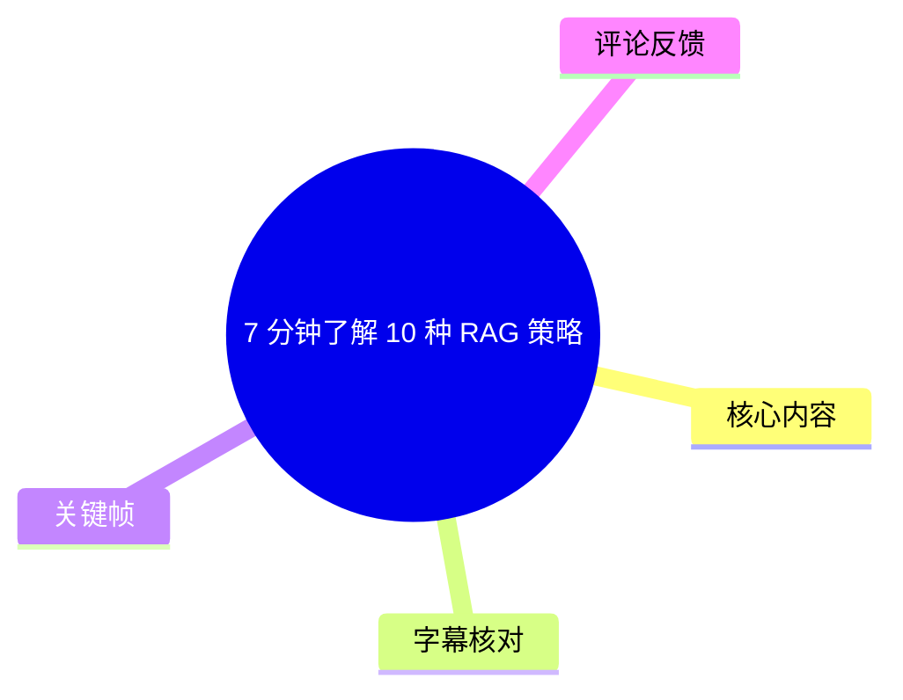
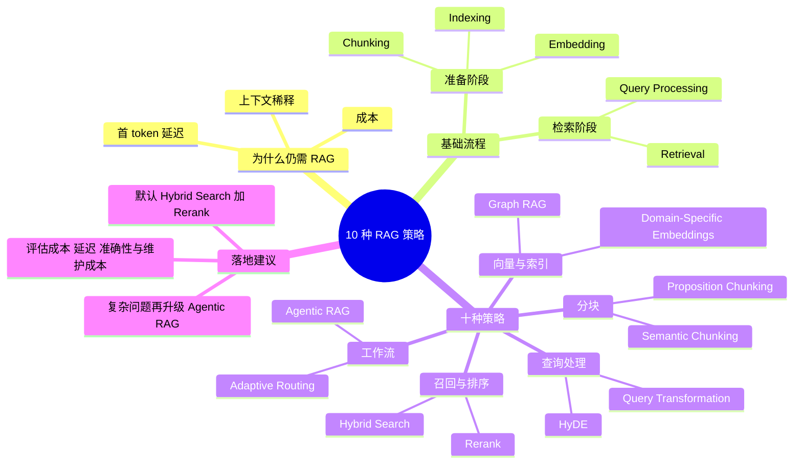
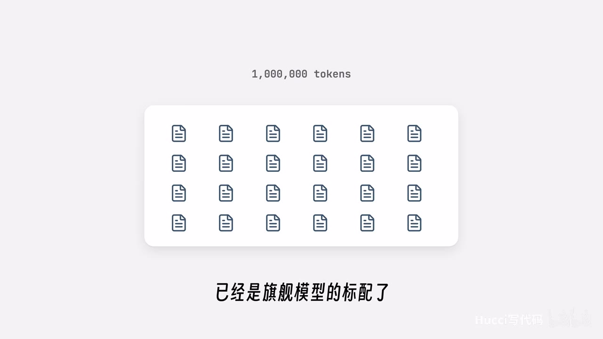
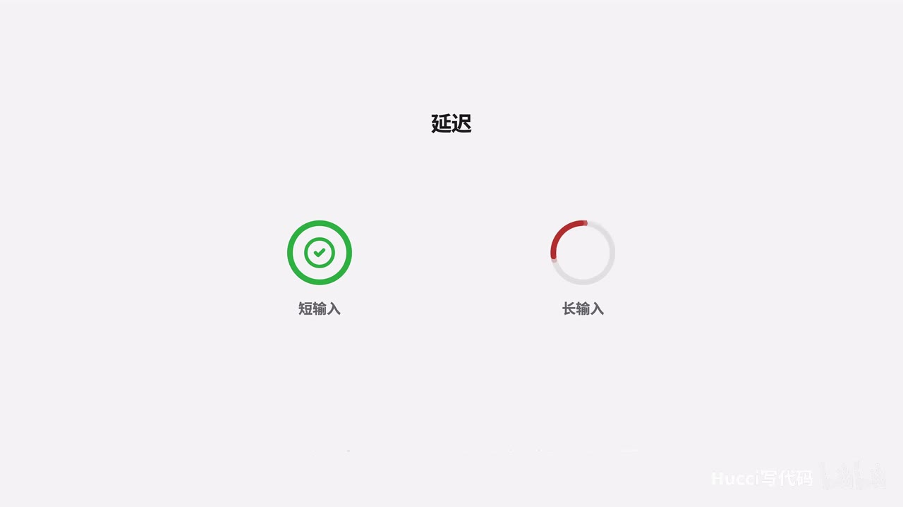
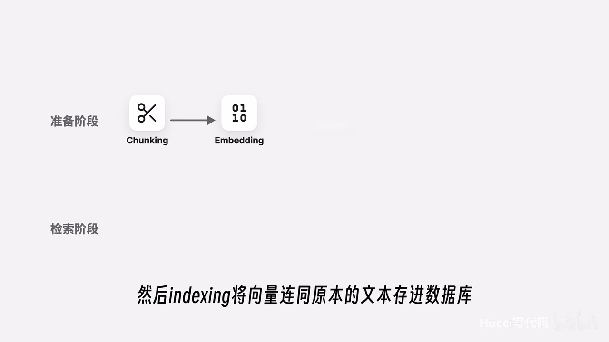
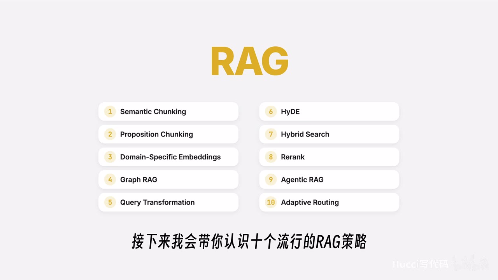

# 7 分钟了解 10 种 RAG 策略

> 来源：[Bilibili 视频](https://www.bilibili.com/video/BV17J3B6PEGK)  
> UP 主：Hucci写代码｜发布时间：2026-07-30｜视频时长：07:31  
> 标签：AI、编程、RAG

## 小结

视频以“长上下文是否会让 RAG 失效”为切入点，给出明确的工程判断：即使旗舰模型已具备约百万 token 的上下文窗口，RAG 仍然有价值。原因不在于模型不能读长文本，而在于把全部资料持续塞入上下文会带来**成本、首 token 延迟和上下文稀释**问题。

作者把 RAG 拆成准备阶段与检索阶段：准备阶段包括分块（Chunking）、向量化（Embedding）、索引（Indexing）；检索阶段包括查询处理（Query Processing）与检索（Retrieval）。十种策略分别嵌入这些环节，不是彼此完全替代的“十套系统”。

对于刚开始落地 RAG 的项目，视频给出的默认组合是：**Hybrid Search（混合检索）+ Rerank（重排序）**。前者弥补纯向量检索对精确关键词、实体名称区分不足的问题，后者在初筛候选集之后重新排序，以较高性价比提升相关性。

当知识依赖实体关系、引用链或跨块关联时，可考虑 Graph RAG；当问题复杂、一次检索不足以获得答案时，可升级到 Agentic RAG，让 Agent 通过循环和工具进行多轮探索。二者的共同代价是更高的成本、延迟及维护复杂度。

视频中的技术判断具有时效性：内容发布于 2026-07-30，关于“百万 token 已成为旗舰模型标配”、模型与数据库组件的表述，均应以发布时点理解。实际选型还需用自身语料、更新频率、查询量、延迟预算与评测结果验证，不能把视频中的推荐直接视为普适结论。

## 思维导图





## 目录

- [背景：长上下文并未取代 RAG](#背景长上下文并未取代-rag)
- [基础流程：从资料入库到生成回答](#基础流程从资料入库到生成回答)
- [十种策略总览](#十种策略总览)
- [准备阶段：分块、向量与索引](#准备阶段分块向量与索引)
- [查询处理：改写问题与 HyDE](#查询处理改写问题与-hyde)
- [检索与排序：混合检索、重排序](#检索与排序混合检索重排序)
- [从 Pipeline 到 Agent：Agentic RAG 与自适应路由](#从-pipeline-到-agentagentic-rag-与自适应路由)
- [落地步骤、参数与决策框架](#落地步骤参数与决策框架)
- [结论、限制与时效性](#结论限制与时效性)
- [字幕比对](#字幕比对)
- [评论分析](#评论分析)
- [处理记录](#处理记录)

## 背景：长上下文并未取代 RAG [00:00:28](https://www.bilibili.com/video/BV17J3B6PEGK?t=28)

视频将 RAG 定义为一套架构：预先把资料存入数据库；用户提问时，从数据库取回相关信息，供模型参考后生成回答。它主要用于个人笔记、企业内部资料等模型原本不知道、且不能仅依赖通用预训练知识回答的问题。

作者回应了“RAG 已死”的看法：其前提是旗舰模型具备约 **1,000,000 token** 上下文窗口，因此可以把所有资料直接放进提示词。视频认为，这个方案在工程上仍有三项核心问题：

1. **成本**：视频称，完整塞入数万字资料，与只塞入经检索挑出的数百字相关内容相比，价格“可能差出几千倍”。这是视频中的量级判断，具体倍率会随模型定价、输入长度、缓存策略和调用频率变化。
2. **延迟**：模型需要处理完输入后才开始输出；输入越长，用户等待首 token 的时间越长。
3. **上下文稀释**：模型注意力会分布在所有输入内容上。无关信息越多，真正有用信息占据的注意力越少，出错风险越高。



> 图：画面以“1,000,000 tokens”和大量文档图标说明长上下文能力。它对应视频讨论的前提：上下文窗口变大并不自动消除检索、成本与信息聚焦问题。



> 图：画面对比“短输入”和“长输入”的延迟进度，直观支持视频关于长输入会拉长等待时间的工程论据。

## 基础流程：从资料入库到生成回答 [00:00:53](https://www.bilibili.com/video/BV17J3B6PEGK?t=53)

作者把 RAG 流程划为两段、五个步骤：

| 阶段 | 步骤 | 视频中的职责 |
| --- | --- | --- |
| 准备阶段 | Chunking | 把原始资料切成小块（chunk） |
| 准备阶段 | Embedding | 把文本块转成数字向量 |
| 准备阶段 | Indexing | 将向量与原始文本写入数据库 |
| 检索阶段 | Query Processing | 处理用户问题，使其更易命中相关内容 |
| 检索阶段 | Retrieval | 从数据库挑出真正相关的内容 |

在检索到上下文后，模型以这些资料为参考，组织最终回答。视频后续的十项技术，分别是在上述环节中修补不同缺陷：分块语义损失、通用向量模型领域失配、跨块关系丢失、查询表述不匹配、关键词漏召回、候选排序不足，以及固定 Pipeline 缺少探索能力等。



> 图：关键帧明确展示“准备阶段”的 Chunking 与 Embedding，并以字幕说明 Indexing 会把向量和原文写入数据库。它帮助定位策略在完整 RAG 管线中的位置。

## 十种策略总览 [00:00:53](https://www.bilibili.com/video/BV17J3B6PEGK?t=53)

视频列出的十种策略如下。名称以画面英文及上下文为准；ASR 对部分英文术语存在误识别，具体校正见“字幕比对”。



> 图：该帧是视频的策略总览，按画面列出了全部十项：Semantic Chunking、Proposition Chunking、Domain-Specific Embeddings、Graph RAG、Query Transformation、HyDE、Hybrid Search、Rerank、Agentic RAG、Adaptive Routing。

| 编号 | 策略 | 所在环节 | 解决的主要问题 | 视频指出的代价或限制 |
| --- | --- | --- | --- | --- |
| 1 | Semantic Chunking | Chunking | 固定长度切分破坏语义 | 对“语义距离远但仍有关联”的句子不够好 |
| 2 | Proposition Chunking | Chunking | 需要更细粒度、可独立理解的事实陈述 | 需要 LLM 参与拆解 |
| 3 | Domain-Specific Embeddings | Embedding | 通用向量模型不理解专业语义 | 需选择适合领域的模型 |
| 4 | Graph RAG | Indexing / Retrieval | 向量库丢失实体与引用关系 | 构图成本高、准确性与更新维护困难 |
| 5 | Query Transformation | Query Processing | 用户问题与文档措辞不匹配 | 需要 LLM，增加延迟 |
| 6 | HyDE | Query Processing | 用问题直接检索时语义表达不足 | 假设答案可能幻觉并带偏检索 |
| 7 | Hybrid Search | Retrieval | 纯向量检索难匹配精确关键词 | 需要结合关键词与向量检索 |
| 8 | Rerank | Retrieval | 初筛候选的相关性排序不足 | 成本较高，应放在初筛后 |
| 9 | Agentic RAG | Workflow | 单次流水线检索不足 | LLM 深度参与，成本和延迟高 |
| 10 | Adaptive Routing | Workflow | 所有问题均走复杂流程造成浪费 | 依赖轻量分类器判断难度 |

## 准备阶段：分块、向量与索引 [00:01:41](https://www.bilibili.com/video/BV17J3B6PEGK?t=101)

### 1. Semantic Chunking：按语义而不是固定字数切分 [00:02:06](https://www.bilibili.com/video/BV17J3B6PEGK?t=126)

传统分块方式按固定字数截断文本，可能将连续的两句话切成多个破碎片段。作者认为，语义被破坏的块即使检索出来，也会让模型难以正确理解。

Semantic Chunking 的步骤是：

1. 为每个句子计算数字向量；
2. 比较相邻句子的向量距离；
3. 向量相近，说明语义接近，则将句子合并为同一块；
4. 向量距离较远，则拆分为不同块。

它比固定长度切分灵活，视频判断在“大部分情况”下足够使用。限制是：两句话的向量距离可以较远，但文本逻辑上仍互相关联；此时仅用语义距离进行边界判断会误切。

### 2. Proposition Chunking：把文本拆成原子化陈述 [00:02:30](https://www.bilibili.com/video/BV17J3B6PEGK?t=150)

面对“语义不近却有关系”的内容，视频推荐 Proposition Chunking。做法是先把资料粗略切为较大块，再交给 LLM 拆解成一条条“原子化的陈述”。

其关键不是保留原始段落形态，而是让每个检索单元尽量成为独立、明确、可理解的事实或主张。这样在检索时，系统可以直接召回较精确的陈述，而非混杂多个事实的大段文本。

视频未提供具体提示词、块大小、事实粒度或事实与原文之间的溯源设计。因此，实际应用时，这些实现参数仍需根据语料测试；尤其要避免 LLM 拆解时遗漏限定条件或改变原文含义。

### 3. Domain-Specific Embeddings：领域专用向量模型 [00:02:53](https://www.bilibili.com/video/BV17J3B6PEGK?t=173)

Embedding 阶段将文本转换为数字向量。视频提到常见选择包括 OpenAI 的 `text-embedding-3`、BGE 与阿里千问相关 Embedding 模型，并认为这些通用模型在多数场景表现良好。

但法律、代码、医学等特定领域中，通用向量模型可能无法可靠区分专业概念。视频以法律概念为例，说明表面字词接近、但法律含义不同的术语，在通用模型空间中可能被映射得过近。

因此，领域项目可选择对应领域的 Embedding 模型。这里的判断重点是**领域语义区分能力**，而不只是通用基准分数。视频没有给出具体模型版本、向量维度、相似度度量或评测集，不能据此推导某一模型必然优于另一模型。

### 4. Indexing 与元数据：向量、原文和可过滤字段 [00:03:17](https://www.bilibili.com/video/BV17J3B6PEGK?t=197)

索引阶段需要把向量与原始文本写入数据库。视频给出的数据库选型示例为：

- 小型项目：SQLite 搭配 `sqlite-vec` 插件；
- 大型项目：PostgreSQL 搭配 `pgvector` 插件。

除向量和文本外，作者建议保留结构化元数据（Metadata），例如：

- 内容日期；
- 内容类型；
- 来源。

检索时可以按这些 Metadata 过滤，从而缩小候选范围、约束时效或来源。例如，若提问只关心某时间段内的内部公告，应先以日期或文档类型过滤，再进行向量或关键词检索。

### 5. Graph RAG：保留实体与关系 [00:03:41](https://www.bilibili.com/video/BV17J3B6PEGK?t=221)

将文本块独立存入数据库的风险是丢失块与块之间的关系。视频用合同说明：第 12 条引用第 5 条时，如果两条被拆开存储，普通向量索引未必保留“引用”这层结构。

Graph RAG 的做法是：

1. 从每个文本块抽取实体；
2. 抽取实体之间的关系；
3. 把实体作为图的节点、关系作为图的边；
4. 检索时先定位命中节点，再沿关系边寻找关联节点与内容。

它适合关系本身是答案关键部分的知识库，例如合同条款引用、组织关系、知识依赖链等。

但视频特别强调其显著代价：

- 需要 LLM 通读资料、抽取实体和关系，时间与金钱成本高；
- 关系抽取的准确率难以保证；
- 文档更新时，可能不只是更新局部块，而是需要重新梳理整张图。

因此 Graph RAG 是高收益也高风险的选择，应先确认“关系检索”是否真的构成核心需求。

## 查询处理：改写问题与 HyDE [00:04:29](https://www.bilibili.com/video/BV17J3B6PEGK?t=269)

### 6. Query Transformation：重写用户查询 [00:04:29](https://www.bilibili.com/video/BV17J3B6PEGK?t=269)

Query Processing 的目标是处理用户问题，使其更容易匹配数据库里的相关文本块。Query Transformation 使用 LLM 重写原问题，视频列出三类方向：

- 改写得更具体；
- 改写得更泛化；
- 拆成多个子问题。

核心假设是：用户自然语言的提问方式与文档的写法未必一致。通过重写或拆解，检索器可以获得更多、更合适的查询表达，从而增加召回相关信息的机会。

其代价是额外调用 LLM，因而会增加处理时间与成本。对于对延迟敏感的项目，作者提出可以完全不对用户输入做处理，直接进入检索。

### 7. HyDE：以假设答案进行检索 [00:04:29](https://www.bilibili.com/video/BV17J3B6PEGK?t=269)

HyDE（Hypothetical Document Embeddings）的流程是：

1. 让模型根据用户问题生成一篇“假设答案文档”；
2. 将这篇假设文档向量化；
3. 使用该向量而非原问题向量去检索真实文档。

视频中的解释是：相比简短问题，一篇答案式文档在语义形态上可能更接近知识库中的真实文档，因此召回质量可能更高。

关键风险是幻觉：当用户问的是模型不熟悉的冷门内容时，模型生成的假设文档可能是错误的。此时错误语义会直接成为检索方向，导致系统召回偏离真实答案的材料。HyDE 不应被理解为“先生成答案再相信答案”；生成文本仅是检索中间表示，最终回答仍需要由真实召回证据约束。

## 检索与排序：混合检索、重排序 [00:05:17](https://www.bilibili.com/video/BV17J3B6PEGK?t=317)

### 8. Hybrid Search：向量检索结合关键词检索 [00:05:17](https://www.bilibili.com/video/BV17J3B6PEGK?t=317)

最简单的检索方式是：把 Query 转为 Embedding，并与数据库中已有文本块的 Embedding 比较相似度。视频指出，这种方式偏重语义相近，未必能可靠处理必须精确区分的关键词。

视频以“一型糖尿病”与“二型糖尿病”为例：两者语义相关、文本也相近，但作为具体病名，检索时必须精确区分。纯向量相似度可能无法做到这一点。

Hybrid Search 同时使用：

- **向量检索**：捕捉语义相关性；
- **关键词检索**：精确匹配关键术语。

视频将它作为兼顾效果与成本的高性价比方案之一。其实际融合方式、关键词索引类型、权重或候选数量并未在视频给出，属于需要自行评测的工程配置。

### 9. Rerank：在初筛后重新排序 [00:05:41](https://www.bilibili.com/video/BV17J3B6PEGK?t=341)

无论是向量检索还是 Hybrid Search，初步检索都主要是让 Query 与每个 Chunk 独立打分。Rerank 模型则将 **Query 和候选 Chunk 放在一起**，重新判断并排序，选择最相关的文本块。

推荐的调用位置是：

```text
用户 Query
  → 向量检索或 Hybrid Search：快速初筛候选
  → Rerank：对候选块重新排序
  → 取靠前结果作为上下文
  → LLM 生成回答
```

视频强调 Rerank 成本较高，所以通常应在初筛之后使用，而不是直接对全量数据库逐条重排。这一顺序体现了“先快召回、后精排序”的成本控制思路。

## 从 Pipeline 到 Agent：Agentic RAG 与自适应路由 [00:06:06](https://www.bilibili.com/video/BV17J3B6PEGK?t=366)

### 10. Agentic RAG：让检索成为循环探索 [00:06:06](https://www.bilibili.com/video/BV17J3B6PEGK?t=366)

作者认为，召回并非一次性工作：即使人类查资料，也会先探索一次，判断信息是否足够；不足时再继续检索。因此 Agentic RAG 用循环（loop）替代固定流水线（pipeline）。

其基本过程是：

1. Agent 判断当前信息是否足以回答；
2. 若不足，判断下一步应如何搜索；
3. 调用工具继续探索，例如 Semantic Search、Bash Tool；
4. 多轮查找并整理信息；
5. 当信息足够时，将整理结果交给负责回答的 LLM。

视频把它视为范式变化，认为优点是质量更高、工程难度也更低；但 LLM 深度参与每一轮决策和工具调用，会显著增加成本与延迟。对简单问题采用这种流程会造成浪费。

### 11. Adaptive Routing：按问题难度决定流程 [00:06:30](https://www.bilibili.com/video/BV17J3B6PEGK?t=390)

为避免所有请求都使用复杂 Agent 流程，视频提出 Adaptive Routing：

1. 先用轻量级分类器判断问题难度；
2. 简单问题直接走普通 Pipeline；
3. 复杂问题才升级到 Agentic RAG。

这是一种资源分层策略：将高成本、多轮检索能力留给真正需要它的任务。视频未说明分类器的特征、准确率指标、难度标签定义或错误路由后的回退机制；实际落地中，这些因素会直接影响节省成本与回答质量之间的平衡。

## 落地步骤、参数与决策框架 [00:06:54](https://www.bilibili.com/video/BV17J3B6PEGK?t=414)

视频没有演示代码或给出可直接复制的参数配置，但依据其方法顺序，可整理出以下保守的落地路径。

### 1. 先建立最小可用 Pipeline

```text
文档
  → 分块
  → Embedding
  → 向量与原文写入数据库
  → 用户 Query 向量化
  → 召回相关 Chunk
  → 将 Chunk 作为上下文交给 LLM
```

先验证基础链路能否从资料中召回答案依据，再增加高级策略。不要一开始就同时引入图谱、多查询改写、多工具 Agent 等多个变量，否则出现效果问题时难以定位原因。

### 2. 为文档保留元数据

至少在视频提及的文本、向量外，存储：

| 字段类别 | 视频举例 | 用途 |
| --- | --- | --- |
| 日期 | 内容日期 | 做时效过滤 |
| 类型 | 内容类型 | 限定检索范围 |
| 来源 | 文档来源 | 回答溯源与过滤 |
| 原文 | 文本块原文 | 作为生成时的证据上下文 |
| 向量 | Embedding | 相似度检索 |

### 3. 默认叠加 Hybrid Search 与 Rerank

作者对初学项目的明确建议是先使用 **Hybrid Search + Rerank**，理由是收益相对于成本很高。可将它理解为默认的两段式检索：

```text
关键词检索 + 语义向量检索
  → 合并或汇总候选集
  → Rerank 对候选集排序
  → 取高相关块回答
```

视频没有指定 `top_k`、融合权重、Rerank 候选数或最终上下文长度。这些都是结果敏感参数，必须在自身语料上以召回率、答案正确性、延迟和单次成本共同评估。

### 4. 按问题特征引入增量能力

| 观察到的问题 | 可优先尝试的策略 | 理由 |
| --- | --- | --- |
| 固定字数切块导致句意断裂 | Semantic Chunking | 尽量保持块内语义完整 |
| 需要按细粒度事实命中 | Proposition Chunking | 使用原子化陈述作为检索单元 |
| 法律、代码、医学等领域概念混淆 | Domain-Specific Embeddings | 增强专业语义区分 |
| 引用、实体关系、依赖链很重要 | Graph RAG | 显式保存节点与边 |
| 用户问法与文档表述差异大 | Query Transformation | 生成更适配检索的查询 |
| 原始问题短而难以匹配文档措辞 | HyDE | 使用假设文档扩展语义表示 |
| 专有名词、编号、型号不能混淆 | Hybrid Search | 保留精确关键词能力 |
| 初筛结果中相关块顺序不佳 | Rerank | 让 Query 与候选块联合判断 |
| 一次查询无法找齐证据 | Agentic RAG | 多轮工具调用与信息充分性判断 |
| 简单请求被复杂流程拖慢 | Adaptive Routing | 分流到普通 Pipeline 或 Agent |

### 5. 谨慎处理高复杂度方案

视频对以下边界给出清晰提醒：

- **Graph RAG**：构图需要抽取实体与关系；成本、时间、抽取准确性及文档更新后的图维护都需承担。
- **HyDE**：假设文档会在冷门问题上幻觉，反而误导召回。
- **Query Transformation / HyDE**：两者都依赖 LLM，会提高延迟。
- **Rerank**：计算成本相对高，适合对初筛候选使用。
- **Agentic RAG**：质量可能提高，但不适合简单问题。
- **Adaptive Routing**：分类器判断错误会使请求走错路径；视频未提供纠错或回退方案。

## 结论、限制与时效性 [00:06:54](https://www.bilibili.com/video/BV17J3B6PEGK?t=414)

视频的核心结论不是“某一种 RAG 技术最佳”，而是：每种策略都有收益与代价，没有绝对答案。RAG 解决的是“如何召回信息”；要构建完整 Agent，仍需处理 Agent Memory、效果评估、持续优化框架等问题。

对实际项目而言，可以将视频的建议压缩为三条：

1. **不要因为长上下文而跳过检索设计**：仍要计算成本、等待时间和无关上下文干扰。
2. **从高性价比的检索质量改进开始**：优先 Hybrid Search 与 Rerank。
3. **复杂度由问题驱动，而不是由技术潮流驱动**：只有关系结构、多跳探索或复杂问题确实存在时，再考虑 Graph RAG、Agentic RAG 与自适应路由。

### 素材边界

- 本视频为概念与策略综述，不包含代码、命令、评测数据、基准测试方法或生产部署案例。
- 视频提到的“价格可能差出几千倍”“工程难度更低”等属于作者在视频中的判断，未提供计算过程和实验条件。
- SQLite + `sqlite-vec`、PostgreSQL + `pgvector` 仅是视频中给出的选型例子，不构成对其他向量数据库或检索引擎的排他性结论。
- 模型能力、上下文窗口、模型价格和开源组件状态变化很快；文中技术时效以 2026-07-30 发布时点为准。

## 字幕比对

| 字幕来源 | 完整性 | 专有名词 | 时间轴 | 主要问题 |
| --- | --- | --- | --- | --- |
| Bilibili 站内字幕 | 未提供可用字幕，无法比对正文 | 无法判断 | 无法使用 | 素材中未提供站内字幕文件或文本 |
| 本次 ASR 字幕 | 较完整：19 段，覆盖约 421.99 秒语音；首段 00:00:28.440，末段 00:07:30.430 | 存在较多英文术语与中英混读误识别 | 可用；SRT 提供真实起止时间 | 出现“数捷库”“TRUNKING”“GraphRack”“Height”“Hybrid Research”“Adaptive Routine”等误识别或拼写不稳定 |

### 最终字幕选择与校正

本次采用 **ASR 的真实时间轴** 作为章节时间定位依据；由于没有可用站内字幕，正文基于 ASR 上下文与提供的关键帧画面校正明显术语错误。ASR 诊断显示音频语言为中文，识别模型为 `large-v3-turbo`，语言置信度为 0.9980；素材未标记 `noAudioStream=true`，因此不存在“源视频没有音轨”的情况。

重要校正如下：

| ASR 近似文本 | 正文采用术语 | 校正依据 |
| --- | --- | --- |
| RAC / Rack | RAG | 视频标题、关键帧总览与上下文 |
| TRUNKING | Chunking | RAG 标准流程及画面 |
| IMBEDDING / EMBODDING | Embedding | RAG 标准术语及上下文 |
| RETRIVAL | Retrieval | RAG 标准术语及上下文 |
| 数捷库 / 数捕库 | 数据库 | 中文语境与流程说明 |
| LRM / LM | LLM | 上下文为模型进行拆解、生成、抽取 |
| Tax Embedding 3 | `text-embedding-3` | OpenAI 产品命名与上下文；ASR 误识别可能性高 |
| Cycline / CycliveVec | SQLite / `sqlite-vec` | 视频所述“小型项目数据库 + 向量插件”语境 |
| GraphRack | Graph RAG | 关键帧策略名称 |
| Height | HyDE | 关键帧策略名称 |
| Hybrid Research | Hybrid Search | 关键帧策略名称 |
| Rerang | Rerank | 关键帧策略名称 |
| Agentic React | Agentic RAG | 关键帧策略名称及 RAG 语境 |
| Adaptive Routine | Adaptive Routing | 关键帧策略名称 |

## 评论分析

以下仅分析可获取的热评前三条；评论反映个人经验与观点，不作为已验证事实。

### 热评 1：RAG 调优链路黑盒，偏向 “LLM Wiki + grep”

用户“随便你们吧”（60 赞）认为 RAG 落地门槛高：需要向量数据库、分块策略，而 Embedding 与 Rerank 的效果较黑盒；当语料扩大时，即便召回结果不佳，也难定位问题在分块、向量化、召回还是重排。

该评论提出替代思路：用类似 Wiki 的文档组织加 `grep` / 关键词搜索先定位材料，再由 AI 沿文档结构和上下文继续阅读。其强调的优点是过程透明、便于验证和调试。

这与视频的 Hybrid Search 主张存在交集：评论偏好关键词及结构化浏览，视频则建议把关键词检索与向量检索结合。评论关于“个人或中小知识库未必需要传统 RAG”的结论属于经验判断，是否成立取决于文档规模、命名规范、同义表达比例、上下文预算与查询类型。

### 热评 2：RAG 的价值与知识更新频率有关

用户“不死の祥云”（76 赞）认为 RAG 当前主要用于控制成本，并提出一个选型条件：被查询内容的更新速度应显著低于查询次数。若资料更新很快，使用目录和分节文档，让 Agent 自行查找两轮，可能更方便且能保持实时更新；个人笔记属于后者。

该评论补充了视频未展开的**索引更新成本**问题，尤其与视频对 Graph RAG 更新时可能需重梳理全图的提醒相呼应。但“更新频率低于查询频率”并非视频给出的硬性阈值，也不是已验证的通用公式；实际还要考虑增量索引能力、文档规模、更新内容比例和服务 SLA。

### 热评 3：先蒸馏系统文档，再搭配简单推理

用户“bili_30918233834”（3 赞）质疑为何仍要做 RAG，提出先用 Obsidian 对数百万字系统文档进行蒸馏，再搭配简单推理能力，并称可保留图片信息。

这条评论体现了另一条路线：先对知识进行编辑、摘要或结构化压缩，以减少运行时检索和上下文负担。它可能适用于知识相对稳定、人工或自动蒸馏质量可控的文档体系。

限制同样明显：蒸馏过程可能丢失细节、限定条件或原始证据，资料更新后还需重新蒸馏。评论未提供测试条件、准确率或成本对比，不能据此判断其方案整体优于视频所述 RAG 策略。

## 处理记录

- Worker ID：`worker-mrj0wjed-b0c290ad`
- 整理模型：`gpt-5.6-terra`
- ASR 模型：`large-v3-turbo`（CUDA，`int8_float16`，自动检测为中文，语言置信度 0.998046875）
- 使用素材与工具产物：视频元数据、`audio/audio.wav`、`asr/transcript.srt`、`asr/asr-result.json`、关键帧目录 `frames/`、热评文件 `comments/comments.json`。
- 字幕检查与选择：站内字幕未提供可用内容；已检查本次 ASR。最终以 ASR SRT 的 19 个真实时间分段定位时间轴，并依据关键帧和技术语境校正明显专有名词误识别。
- 音轨状态：ASR 结果未标记 `noAudioStream=true`；诊断显示有效语音覆盖约 93.61%，未将字幕问题归因为工具失败。
- 关键帧选择依据：
  - `frames/frame-001.jpg`：展示 1,000,000 token 长上下文前提；
  - `frames/frame-002.jpg`：展示长输入与延迟的关系；
  - `frames/frame-003.jpg`：直接列出十种 RAG 策略，是术语校正与结构总览依据；
  - `frames/frame-004.jpg`：展示 Chunking、Embedding 与 Indexing 的准备阶段流程。
- 评论范围：严格处理可获取热评前三条，不扩展至其他评论。
- 缓存清理：未提供缓存清理执行日志；本记录不虚构清理结果。
- 未解决问题：
  - 原始站内字幕不可用，无法进行逐句交叉校验；
  - ASR 的个别数据库插件和模型名称存在误识别，正文仅对可由画面和上下文稳定确认的术语进行了校正；
  - 视频未提供参数、代码、基准数据和评测集，相关实施细节不能从素材中补写。
