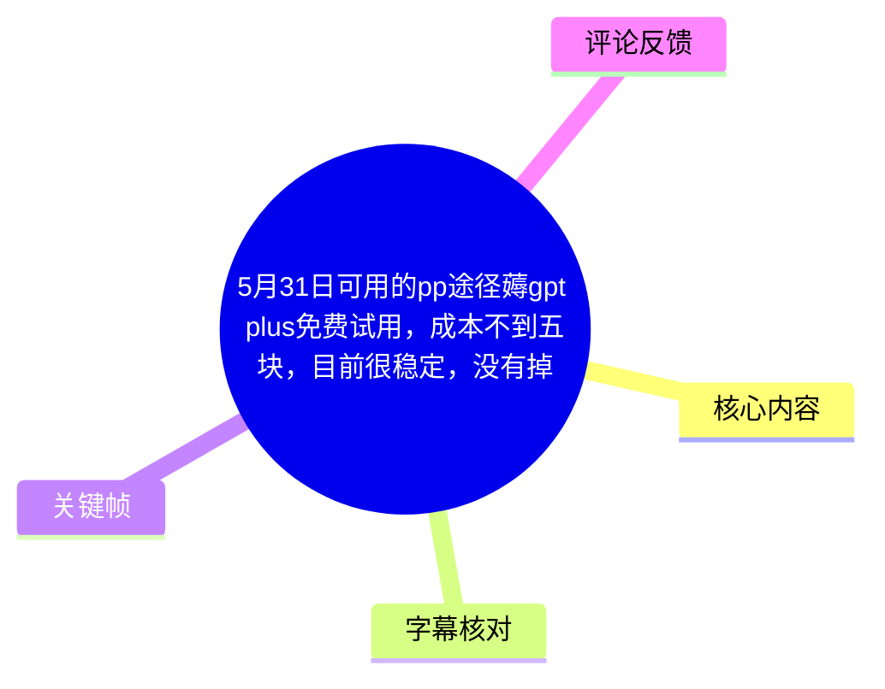
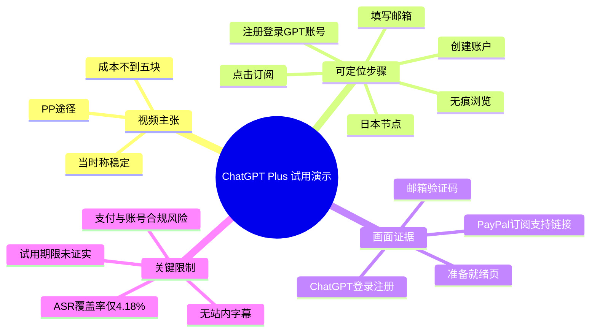
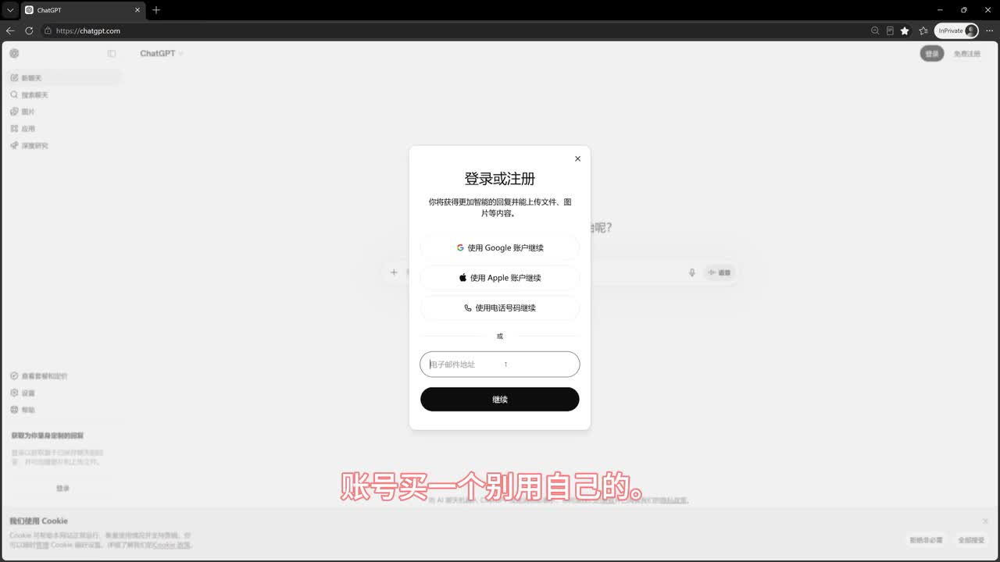
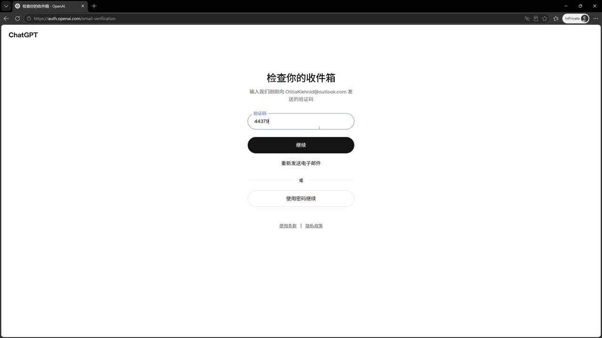
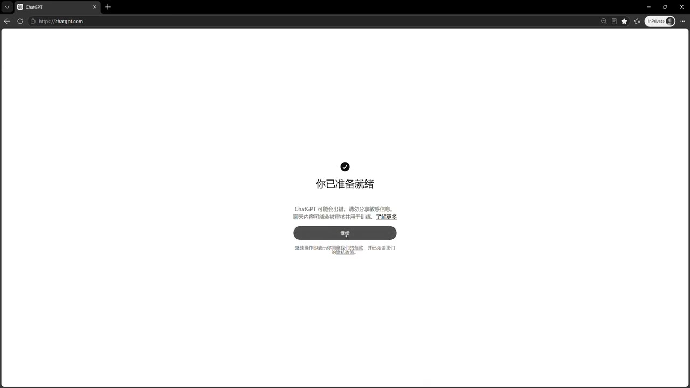
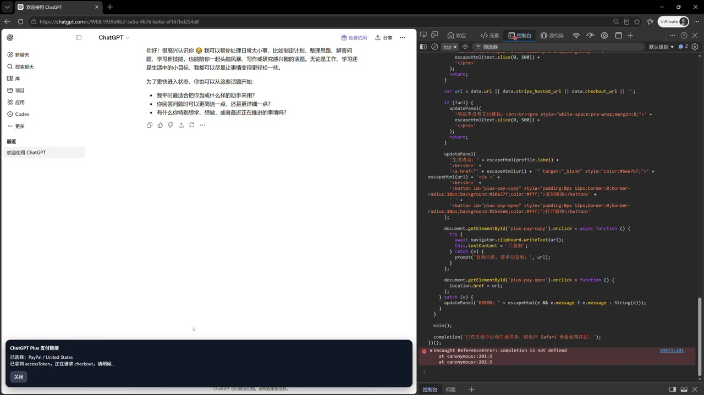

# 5月31日可用的pp途径薅gpt plus免费试用，成本不到五块，目前很稳定，没有掉。

> 来源：[Bilibili 视频](https://www.bilibili.com/video/BV1ZnVn6xEtr) 
> UP 主：A雾绕空山i｜视频时长：4 分 48 秒｜分辨率：1920×1080

## 小结

视频展示了一套围绕 ChatGPT 注册、账户验证、订阅入口和 PayPal 支付的操作演示。标题声称可通过“PP（PayPal）途径”获得 GPT Plus 免费试用，成本“不到五块”，并称当时“目前很稳定，没有掉”。

可被 ASR 明确定位的内容包括：开头要求使用浏览器无痕模式、使用日本节点；随后提出注册并登录 GPT 账号，且口播称“买一个别用自己的”；约 1 分 44 秒出现“点击订阅”；之后依次出现“创建账户”和填写邮箱的操作提示。关键帧还显示了 ChatGPT 的登录/注册、邮箱验证码、准备就绪页面，以及一个同时打开浏览器开发者工具的订阅支持链接页面。

不过，本次 ASR 仅覆盖约 12 秒有效语音，占视频总时长约 **4.18%**；站内字幕也未提供。因此，无法依据字幕完整还原中段的每个点击、页面字段、金额构成、试用期限或支付后结果。视频标题中的“稳定”“没有掉”“不到五块”均属于 UP 主在特定时间点的主张，素材不足以独立验证。

视频涉及使用地区节点、非本人账号、订阅试用与支付页面等高风险环节，可能违反服务平台、支付渠道或账号服务的条款，也可能导致账号、支付或隐私风险。本文只整理素材中可确认的界面与陈述，不将其包装为可复现、合规或长期有效的方法。

## 思维导图

## 目录

- [背景、范围与时效性](#背景范围与时效性-000001)
- [可确认的注册与验证流程](#可确认的注册与验证流程-000008)
- [订阅页面与支付相关画面](#订阅页面与支付相关画面-000144)
- [素材可还原的操作顺序](#素材可还原的操作顺序-000001)
- [参数、限制与风险边界](#参数限制与风险边界-000144)
- [字幕比对](#字幕比对-000001)
- [评论分析](#评论分析-000000)
- [处理记录](#处理记录-000000)

## 背景、范围与时效性 [00:00:01](https://www.bilibili.com/video/BV1ZnVn6xEtr?t=1)

视频标题把信息限定为“5 月 31 日可用”，并使用“目前很稳定，没有掉”的描述。这意味着它针对的是视频录制/发布前后的短期状态，而不是长期有效的官方规则。元数据显示视频发布于 2026-05-31（按 Unix 时间换算；时区未在素材中标注），截至素材抓取时，视频数据为 3,795 播放、62 收藏、30 点赞、28 回复。

ASR 开头的原话为：

> “首先浏览器打开无痕模式节点使用日本的”（00:00:01.360—00:00:05.660）

这表明视频将无痕浏览和日本地区节点作为演示前置条件。但素材没有给出节点提供方、线路参数、是否需要特定地区的手机号/支付资料，也没有证明这些条件是平台官方要求。地区伪装或跨区域访问可能触发风控或违反相关服务条款，不应据此推断为稳定、合规的通用途径。

视频简介称：“长链接、地址生成器、邮箱，codex二验等都在企鹅qun里了710384613”。这是一条 UP 主自行发布的群聊引流信息；素材未提供群内内容，亦无法验证其中的链接、邮箱、地址生成器或“codex 二验”是否安全、真实、必要或合规。

## 可确认的注册与验证流程 [00:00:08](https://www.bilibili.com/video/BV1ZnVn6xEtr?t=8)

ASR 在 00:00:08.030—00:00:12.670 识别到：

> “注册登录GPT账号买一个别用自己的”

该句中的“买一个别用自己的”是视频口播的直接主张，暗示使用非本人或购买取得的账号。素材没有说明账号来源的合法性、归属、恢复方式、是否存在共享或盗号风险。使用购买、租赁或他人账号通常会带来账号回收、隐私泄露、会话被查看、支付争议和封禁等风险，因此不应作为可信的账户管理方案。

> 图：画面显示 ChatGPT 的“登录或注册”弹窗，并提供 Google、Apple、手机号及邮箱地址等登录/注册方式。它证明视频确实处于账户入口页面，但不能证明任一注册方式、邮箱来源或后续订阅资格有效。

视频随后展示了邮箱验证码验证页：页面标题为“检查你的收件箱”，中部有验证码输入框、“继续”和“重新发送电子邮件”等按钮。画面中可见一个 Outlook 邮箱地址及验证码，但出于隐私与安全考虑，不应将其视作可复用的账号资料或验证凭据。

> 图：该帧的价值在于确认流程包含邮箱验证环节，并能看到“重新发送电子邮件”“使用密码继续”等常规选项；它不能说明邮箱服务来源、验证码有效性或账户最终归属。

> 图：该帧显示 ChatGPT 提示“你已准备就绪”，表示画面中的注册/登录流程至少进入完成提示页面。页面文字同时提示不要分享敏感信息；该提示也从侧面说明，不应在陌生账户、共享账户或不可信渠道中输入个人资料。

## 订阅页面与支付相关画面 [00:01:44](https://www.bilibili.com/video/BV1ZnVn6xEtr?t=104)

ASR 在 00:01:44.220—00:01:45.260 仅识别出“点击订阅”。这可以确认视频在约 1 分 44 秒处进入订阅动作，但没有足够音频文本说明订阅套餐、价格、试用规则、地区条件或扣费日期。

后续两个带时间戳的 ASR 片段为：

| 时间段 | ASR 原文 | 可确认含义 | 不能确认的内容 |
| --- | --- | --- | --- |
| 00:01:44.220—00:01:45.260 | 点击订阅 | 演示者口头指向订阅入口。 | 订阅是否成功、所选套餐与支付金额。 |
| 00:01:51.120—00:01:52.180 | 创建账户 | 此处存在“创建账户”操作提示。 | 是创建支付账户、服务账户还是其他页面账户。 |
| 00:01:56.820—00:01:57.780 | 留箱随便书 | 识别文本语义不完整，疑似与填写邮箱有关。 | 具体字段、可使用的邮箱类型及其合规性。 |

关键帧中，浏览器左侧为已登录的 ChatGPT 页面，右侧打开开发者工具；底部提示条显示“ChatGPT Plus 支付链接”，并出现“已选择：PayPal / United States”以及“已复制 accessToken，正在请求 /pre checkout，请稍候……”等文字。右侧控制台还可见脚本和报错信息。该帧表明视频涉及订阅支持链接、PayPal/美国地区选择、令牌以及浏览器开发者工具操作。

> 图：这是理解视频技术风险的关键帧。它表明演示不只是常规前台订阅，还伴随开发者工具、访问令牌和支付链接请求。由于素材没有提供完整脚本、请求上下文、授权来源与平台许可，不能将此画面解释为官方支持的订阅流程，更不应复制或传播令牌、链接及可能绕过正常支付流程的代码。

### 关于“PP”“免费试用”与“不到五块”

- 标题中的“PP”结合关键帧“PayPal / United States”的显示，可合理理解为 PayPal；但视频未提供完整、连续的字幕或页面录制以验证付款/试用的全部链路。
- “免费试用”不等于不产生支付责任。许多订阅服务可能要求有效支付方式、预授权、在试用期结束后自动续订，或受地区与账户资格限制。
- “成本不到五块”未被素材拆分说明：无法确定是账号、邮箱、地址、网络节点、支付验证还是其他成本，也无法确认币种、实际结算金额、退款规则及后续扣费。
- “目前很稳定，没有掉”没有给出样本规模、观察时长、成功率或失败记录，只能视为 UP 主的即时经验陈述。

## 素材可还原的操作顺序 [00:00:01](https://www.bilibili.com/video/BV1ZnVn6xEtr?t=1)

以下顺序仅按 ASR 的真实时间戳和关键帧中可见页面整理；对于 ASR 未覆盖的大片段，不补写具体点击路径。

1. **00:00:01—00:00:05：准备浏览器环境。**  
   口播提到“无痕模式”和“日本”节点。素材没有说明设置方法、节点服务或其必要性。

2. **00:00:08—00:00:12：进入 GPT 账号注册/登录。**  
   关键帧可见 ChatGPT 登录/注册弹窗，支持第三方登录、手机号及邮箱入口。口播含有使用非本人/购买账号的表述；这属于高风险且可能违反条款的做法，不宜采用。

3. **邮箱验证：输入验证码并继续。**  
   关键帧显示 ChatGPT 要求检查收件箱、填入验证码。该步骤可以理解为常规账户验证，但未提供该画面的准确时间戳，不能据此精确标注其在视频中的秒数。

4. **完成账户初始进入。**  
   “你已准备就绪”页面显示流程到达 ChatGPT 初始界面。页面提示用户不要分享敏感信息，适用于任何账户使用场景。

5. **00:01:44：点击订阅。**  
   这是 ASR 明确出现的操作指令。视频未以可用字幕说明后续具体套餐选择或权益内容。

6. **00:01:51—00:01:57：创建账户、填写邮箱相关操作。**  
   ASR 只提供“创建账户”和一条不完整文本“留箱随便书”。结合画面无法可靠判定字段与用途，不能据此给出可复现参数。

7. **支付支持链接与开发者工具画面。**  
   关键帧显示了 PayPal/美国地区选项、支付链接提示和开发者工具。该部分缺少连续字幕与可验证说明，且涉及令牌和支付请求，应避免将其当作普通用户操作教程。

## 参数、限制与风险边界 [00:01:44](https://www.bilibili.com/video/BV1ZnVn6xEtr?t=104)

### 素材中出现的参数与状态

| 项目 | 素材可确认信息 | 证据来源 |
| --- | --- | --- |
| 视频时长 | 288 秒（实际 ASR 音频时长为 287.32375 秒） | 元数据、ASR 诊断 |
| 视频画面 | 1920×1080 | 元数据 |
| ASR 语言 | 中文，语言置信度 0.9873046875 | ASR 诊断 |
| ASR 模型 | medium，CUDA，float16 | ASR 诊断 |
| 可识别语音 | 5 段、约 12 秒 | ASR 诊断 |
| ASR 覆盖率 | 4.18% | ASR 诊断 |
| 地区相关文字 | 日本节点；PayPal / United States | ASR、关键帧 |
| 订阅相关文字 | 点击订阅；ChatGPT Plus 支付链接 | ASR、关键帧 |
| 支付网络请求状态 | 画面提示正在请求 `/pre checkout` | 关键帧 |
| 代码运行状态 | 开发者工具中可见报错 | 关键帧 |

### 未被素材证实的关键问题

1. **是否真的获得 GPT Plus 免费试用。**  
   关键帧没有显示最终订阅成功页、权益生效状态、订单详情或到期日期。

2. **试用能使用多少天。**  
   视频和可获取评论均未给出可靠答案。热评中有人询问“可以用多少天”，但没有被回复或验证。

3. **“不到五块”的构成。**  
   缺少币种、收费项目、实际支付记录及后续账单，无法核验。

4. **所谓“稳定”的可持续性。**  
   缺少时间跨度、失败率、账号存活率与平台规则依据。支付、地区、账户资格和风控政策均可能随时改变。

5. **开发者工具中的技术操作是否合规。**  
   画面出现访问令牌、支付链接和请求行为。任何未经授权的令牌获取、接口调用、支付流程改写或地区规避，都可能导致安全和合规问题。不要复制、分享或在自己的账号上测试来源不明的脚本和令牌。

### 更稳妥的实践原则

- 仅通过服务官方页面、官方说明和本人可验证的支付方式开通订阅。
- 使用本人注册、可恢复且已启用安全保护的账号；不要购买、共用或接收来源不明的账号。
- 不向群聊、第三方页面、脚本或浏览器控制台泄露访问令牌、Cookie、验证码、支付信息或个人邮箱。
- 在任何试用/订阅前，核对试用资格、自动续费时间、价格、税费、退款政策与地区限制。
- 若页面、支付信息或操作提示要求绕开正常流程，应停止操作并通过官方支持渠道确认。

## 字幕比对 [00:00:01](https://www.bilibili.com/video/BV1ZnVn6xEtr?t=1)

| 字幕来源 | 完整性 | 专有名词 | 时间轴 | 主要问题 |
| --- | --- | --- | --- | --- |
| Bilibili 站内字幕 | 无可用字幕。 | 无法评估。 | 无可用时间段。 | 素材明确标注“未提供可用站内字幕”。 |
| 本次 ASR 字幕 | 很低：5 段、约 12 秒语音，覆盖全片约 4.18%。 | 能识别 GPT、订阅、账户等少量词；“PP/PayPal”“Codex”等未被完整语音可靠识别。 | 可用：全部 5 段均有毫秒级起止时间。 | 00:00:12.670—00:01:44.220 存在约 91.55 秒大空档；“留箱随便书”语义不完整。 |

本次 ASR 已被检查：其诊断未标记 `noAudioStream=true`，且输出显示已从 `audio/audio.wav` 中识别到中文语音。因此，不能将字幕缺失归因于“源视频没有音轨”；实际问题是音轨中的可识别语音非常少，或大量内容未被 ASR 捕获。

最终采用策略如下：

- **时间轴定位**：仅使用 ASR SRT 提供的真实时间段，即 00:00:01.360、00:00:08.030、00:01:44.220、00:01:51.120、00:01:56.820。
- **界面内容校正**：使用关键帧中的可见文字补充登录注册、邮箱验证、准备就绪、PayPal/United States、支付链接和 `/pre checkout` 等信息。
- **不做的推断**：不根据文字出现顺序为无时间戳关键帧编造秒数；不把 ASR 的不完整文本扩写成具体邮箱、账号、支付参数或成功结果。

## 评论分析 [00:00:00](https://www.bilibili.com/video/BV1ZnVn6xEtr?t=0)

以下仅覆盖可获取的热评前三条，均为 1 点赞；评论属于个人表达，不构成对视频方法有效性或合规性的验证。

1. **plus一起平摊55：**“放在十年前都是难以置信的科技☺”  
   - 观点：感叹 AI 技术发展速度和能力。  
   - 补充信息：没有提供关于试用、支付或账号状态的实质验证。  
   - 可信度判断：属于情绪性评价，不能证明视频中的路径有效。

2. **黑猫小猪熊：**“可以用多少天”  
   - 观点：关注免费试用持续时间。  
   - 补充信息：没有答案，也没有看到 UP 主回复。  
   - 可信度判断：该问题恰好指出素材中的核心缺口——视频标题未能通过可用字幕或订单画面证实试用期限。

3. **plus可开票149走平台：**“现在AI更新太快，不学真的跟不上✧”  
   - 观点：认为 AI 更新迅速，需要持续学习。  
   - 补充信息：没有涉及视频方法的细节、成功率或风险。  
   - 可信度判断：是泛 AI 学习态度表达，与本视频订阅操作的真实性无直接关系。

## 处理记录 [00:00:00](https://www.bilibili.com/video/BV1ZnVn6xEtr?t=0)

- **Worker ID：**worker-mrj0wbly-5dc4e50c
- **模型：**gpt-5.6-terra
- **ASR 模型与运行参数：**medium / CUDA / float16；自动语言识别为中文，语言置信度 0.9873046875。
- **使用的素材与工具产物：**视频元数据、`audio/audio.wav`、`asr/transcript.srt`、`asr/asr-result.json`、关键帧目录 `frames/`、热评数据 `comments/comments.json`。
- **字幕选择：**站内字幕不可用；已检查本次 ASR，采用其 5 个带毫秒时间戳的片段作为唯一时间轴依据，并以关键帧可见文字补足界面事实。
- **关键帧选择依据：**选用 `frame-001` 至 `frame-004`，分别呈现登录/注册、邮箱验证、初始准备完成、订阅支持链接与开发者工具画面；这些帧直接支撑正文的界面描述。其余帧虽在路径清单中列出，但本次提供的可见素材未展示其内容，故未对其内容作推断。
- **缓存清理：**未提供缓存清理执行日志，无法确认是否已清理；本记录不虚构清理结果。
- **未解决问题：**缺少完整站内字幕；ASR 覆盖率低；关键帧没有对应时间戳；无法确认套餐资格、试用天数、价格构成、最终订阅状态、支付结果与后续自动续费情况。

## 评论分析

- 热评 1：放在十年前都是难以置信的科技☺
- 热评 2：可以用多少天
- 热评 3：现在AI更新太快，不学真的跟不上✧

以上内容是观众反馈摘录，只用于补充理解视频反响，不作为正文事实依据。
