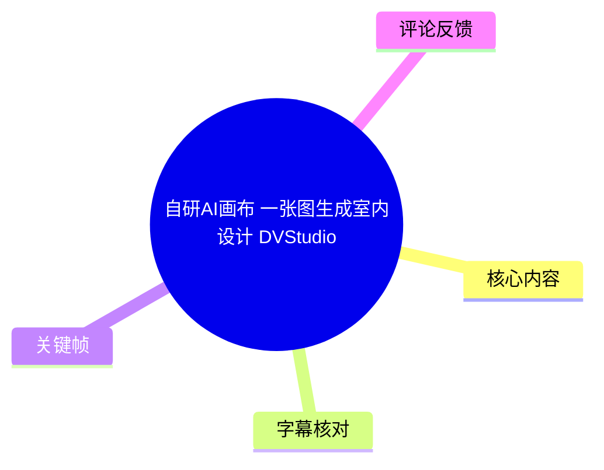
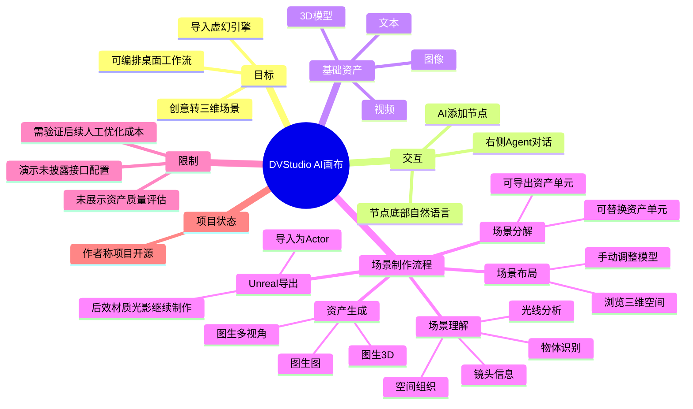
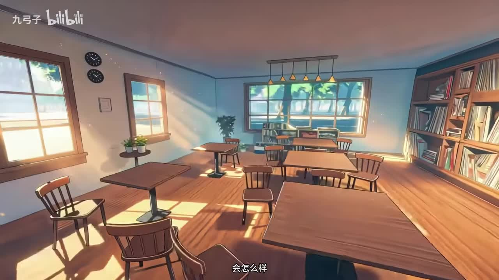
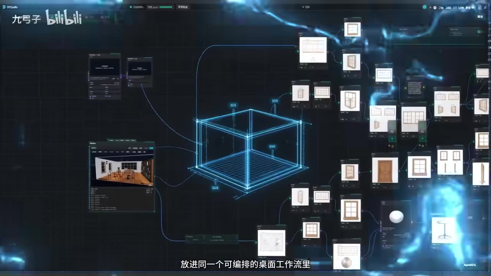
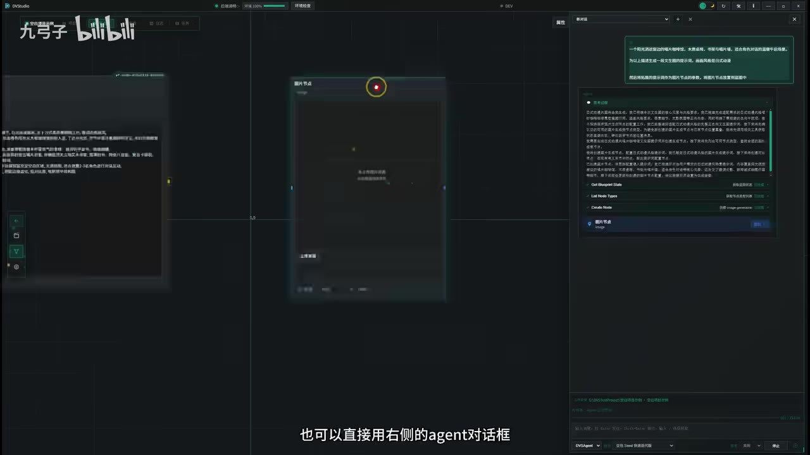
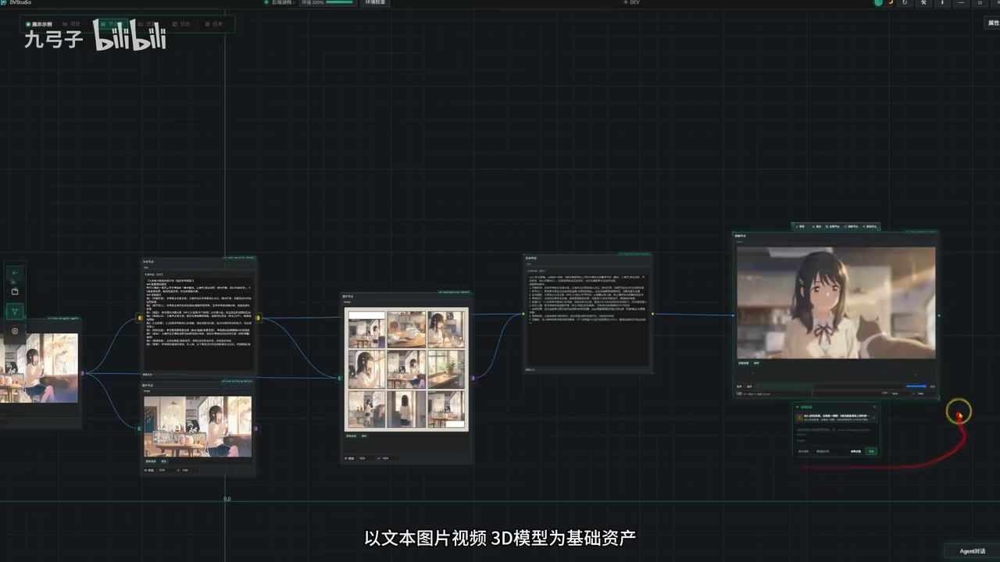

# 自研 AI 画布：一张图生成室内设计 DVStudio

> 来源：[Bilibili 视频](https://www.bilibili.com/video/BV1m2T463EXP)  
> UP 主：九弓子｜合集：AIcode｜视频时长：2 分 36 秒  
> 视频简介：`412845222/DVStudio: 开源的AI动画引擎编辑器`  
> 发布时间：2026-07-03（依据素材路径中的发布日期；页面元数据时间戳对应未来时点，存在时效性异常）

## 小结

视频展示了名为 **DVStudio** 的桌面端可视化 AI 工作流工具。作者将其定位为一条连接「创意描述／参考图」与「可导入虚幻引擎（Unreal Engine）的三维场景」的生产管线，而非单一的图片生成入口。

其核心方法是把文本、图像、视频、3D 模型等基础资产封装为可连接的节点，并通过节点画布编排处理流程。用户既可以在节点底部输入自然语言，也可以通过右侧 **Agent 对话框**让 AI 直接向画布添加图像生成节点。

面向室内场景的演示路径为：先用场景理解节点解析参考图中的物体、空间组织、光源与镜头信息；再查看三维空间布局；随后把场景拆分为可制作、可替换、可导出的资产单元，并进行图生图、图生多视角、图生 3D 等资产制作；最后调整布局并借助虚幻导出节点和配套插件导入 Unreal。

视频明确提到：场景理解环节使用了 **豆包 2.1 Pro 多模态能力**。但它没有给出具体 API 配置、模型费用、节点输入输出格式、生成耗时、资产拓扑质量、Unreal 插件安装过程或项目地址，因此不能据此判断工具的稳定性与生产级可用性。

这份内容适合希望探索 AI 辅助概念设计、关卡白盒、室内场景预可视化、节点式 AI 工作流和 Unreal 场景导入的创作者阅读。对于要直接交付游戏或影视资产的团队，仍需重点验证生成资产的可编辑性、规范性与后续优化成本。

## 思维导图





## 目录

- [定位：一句话到 Unreal 场景](#定位一句话到-unreal-场景-0000)
- [可编排画布与 Agent 交互](#可编排画布与-agent-交互-0012)
- [多类型 AI 节点与创作管线](#多类型-ai-节点与创作管线-0037)
- [从参考图理解三维空间](#从参考图理解三维空间-0056)
- [场景分解与资产生成](#场景分解与资产生成-0117)
- [布局校验、Unreal 导出与后续制作](#布局校验unreal-导出与后续制作-0145)
- [结论、限制与时效性](#结论限制与时效性-0214)
- [字幕比对](#字幕比对)
- [评论分析](#评论分析)
- [处理记录](#处理记录)

## 定位：一句话到 Unreal 场景 [00:00](https://www.bilibili.com/video/BV1m2T463EXP?t=0)

视频开场提出的问题是：能否通过一句话开始构建一个可进入虚幻引擎的场景。这里的「一句话」是对自然语言驱动创作入口的概括，并不意味着视频展示了仅输入一次短句即可完成所有生产环节。

作者随后以一个带有桌椅、书架、窗户和自然光照的室内画面作为视觉化目标示例。该画面呈现的是风格化室内空间效果，用于说明从图像／创意到可编辑场景的目标方向；视频未说明该画面是否为最终 Unreal 场景截图、AI 原始生成图或后期展示素材。



> 图：该关键帧展示视频提出的室内场景目标。它的价值在于直观说明后续「场景理解—布局—资产拆分—导出」流程所面向的内容：不是抽象文本，而是包含家具、建筑构件和光照关系的空间画面。

## 可编排画布与 Agent 交互 [00:12](https://www.bilibili.com/video/BV1m2T463EXP?t=12)

作者称 DVStudio 将以下环节放入同一个可编排的桌面工作流：

1. 创意素材；
2. AI 生成；
3. 场景处理；
4. 3D 布局；
5. 游戏引擎导出。

这里的关键不是某一个模型，而是以节点画布承载多个阶段的数据流。画面中可以看到中央的空间线框／布局表示、周围的图像或资产节点，以及连线关系，反映出系统尝试把场景信息与资产生成过程串联起来。



> 图：该关键帧直接呈现了「同一个可编排桌面工作流」的界面形态。中心空间结构与周围节点的连线说明，DVStudio 的表达方式是画布式流程编排，而非单一聊天窗口或单一生成页。

视频提到两类交互入口：

- **节点底部对话框**：用户可用自然语言描述希望得到的空间、情绪和趋势，系统可将其扩写为细节更丰富的提示词。
- **右侧 Agent 对话框**：用户可让 AI 直接在蓝图／画布中添加一个用于生成图片的节点。

画面中的右侧面板展示了 Agent 对话和操作区域，但视频没有展示完整输入提示词、Agent 实际生成的节点参数、执行日志或失败处理。因此，「Agent 可在蓝图添加节点」应理解为作者展示的功能意图与界面能力，不能进一步推断其对所有节点类型、所有工作流均可自动配置。



> 图：该关键帧的价值在于区分两类交互：左侧／中央是节点画布，右侧是 Agent 面板。它支撑了视频中「通过 Agent 直接在蓝图添加图片生成节点」的说明。

## 多类型 AI 节点与创作管线 [00:37](https://www.bilibili.com/video/BV1m2T463EXP?t=37)

作者表示，DVStudio 集成了市面上常见的 AI 生成接口，并以以下内容作为基础资产：

| 基础资产类型 | 视频中说明的用途 |
| --- | --- |
| 文本 | 作为自然语言创意、提示词或节点输入 |
| 图像 | 作为参考画面、图像生成或图像转换的输入／输出 |
| 视频 | 作为工作流可处理的基础资产之一 |
| 3D 模型 | 作为资产制作和场景构成的基础之一 |

在此基础上，作者称工具采用「模块化节点」设计（ASR 原文在此处识别为“原则化形式”，结合后文“节点设计”以及画面中的节点连接关系，保守校正为模块化／节点化表达；具体产品术语未能由站内字幕核验）。创作者可在画布工作台中组合不同节点，搭建自己的创作管线。



> 图：该关键帧展示文本、图片、多图结果、处理节点和视频预览共存于同一画布，因而能够帮助理解视频所说的「以文本、图像、视频、3D 模型为基础资产」以及「自行搭建创作管线」。

需要注意，视频中的「集成常见 AI 生成接口」没有列出接口服务商、授权方式、模型版本、计费规则、私有部署能力或数据传输范围。对于涉及商业项目或保密素材的使用者，这些信息仍需在项目文档或实际软件配置中核实。

## 从参考图理解三维空间 [00:56](https://www.bilibili.com/video/BV1m2T463EXP?t=56)

作者介绍了场景理解节点的作用：把参考画面转换为结构化信息。视频明确列举的分析维度包括：

- 画面中有哪些物体；
- 空间如何组织；
- 光线来自哪里；
- 镜头如何进入或展示场景。

该段称演示使用 **豆包 2.1 Pro 的多模态能力**进行分析。分析返回的数据被描述为 JSON 结构化结果；在看到结构化数据后，用户可以通过场景布局节点浏览识别出的三维空间。

这一阶段可理解为从二维图像语义到可用于布局的空间描述的转换。不过视频未展示 JSON 的完整字段、坐标系定义、尺度估计、遮挡处理方法、物体类别置信度和人工修正机制。因此，不能根据演示断定其可恢复精确的真实世界尺寸或自动获得工程可用的三维重建结果。

### 实际操作顺序（依据视频叙述）

1. 准备室内参考画面。
2. 将其输入场景理解节点。
3. 调用多模态模型分析物体、空间组织、光照和镜头信息。
4. 获取结构化的 JSON 式分析结果。
5. 进入场景布局节点浏览被识别后的三维空间。

## 场景分解与资产生成 [01:17](https://www.bilibili.com/video/BV1m2T463EXP?t=77)

在具备三维空间识别结果后，视频进入场景分解环节。作者的表述是：通过场景分解节点，把整体空间拆成能够制作、替换和导出的资产单元，为后续 3D 生成和 Unreal 导入做准备。

可以将其概括为以下生产链路：

```text
参考图／创意
  → 场景理解
  → 三维空间浏览
  → 场景分解
  → 独立资产单元
  → 图像与3D资产生成
  → 场景布局
  → Unreal导出
```

在每个资产生产单元内，作者提到了三类行业常见流程：

| 流程 | 视频中的含义 | 本视频未展示的细节 |
| --- | --- | --- |
| 图生图 | 以图片为基础继续生成或变化图像资产 | 提示词、模型、采样参数、尺寸、控制条件 |
| 图生多视角 | 基于图像得到多个视角，为后续三维处理服务 | 视角数量、相机一致性、遮挡区域处理 |
| 图生 3D | 将图像相关结果用于生成 3D 模型资产 | 网格质量、贴图、拓扑、UV、格式与可编辑性 |

ASR 在该处把相关术语识别为“涂生涂、涂成多视角、涃成3D”。结合中文 AI 创作领域通行表达及视频语境，正文将其整理为「图生图、图生多视角、图生 3D」，但这属于基于上下文的转写校正，并非站内字幕验证结果。

### 可迁移经验

- **先拆场景，再做资产**：将完整室内空间拆为独立单元，有利于单独替换家具、门窗等对象，也更贴合后续导入引擎时的资产管理需求。
- **把图像生成与三维目标连接起来**：图像结果不应只作为最终视觉稿，也可成为多视角与 3D 资产生成的中间输入。
- **保留人工复核环节**：视频在后续明确提到手动调整布局，说明自动理解和生成结果仍应接受人工检查。

## 布局校验、Unreal 导出与后续制作 [01:45](https://www.bilibili.com/video/BV1m2T463EXP?t=105)

作者表示，在最终导出前，用户可通过场景布局节点检查模型在场景中是否摆放合适，也可以手动调整。该环节是视频中明确出现的人为干预点，意味着场景布局并非完全自动完成后不可修改。

随后，配合虚幻导出节点和配套 Unreal 插件，视频称可以把整个场景导入虚幻引擎，并成为一个单独的 **Actor**。这里应注意：

- 「导入为一个单独的 Actor」是作者在视频中的描述；
- 视频未说明该 Actor 内部是否包含多个 Static Mesh、层级结构、材质实例、碰撞体或蓝图逻辑；
- 视频也未展示导入所需文件格式、版本兼容性、插件安装、路径设置及报错处理。

在 Unreal 中，用户可以继续利用后效、材质和光影制作表现力更强的游戏或视频项目。该描述将 DVStudio 放在前期生成与场景搭建的位置，而把最终实时渲染、材质调整、光影与后期表现的深化交给 Unreal 完成。

### 视频所示的完整实践步骤

1. 用自然语言或参考素材定义目标空间。
2. 在节点画布中组合创意、生成与场景节点。
3. 通过节点底部对话框扩写空间描述；必要时用 Agent 添加图片生成节点。
4. 将参考图交给场景理解节点，获得物体、空间、光照、镜头等结构化信息。
5. 在场景布局节点中检查识别出的三维空间。
6. 用场景分解节点把整体空间拆为独立资产单元。
7. 针对单个资产单元执行图生图、图生多视角、图生 3D 等流程。
8. 返回场景布局节点检查并手动调整模型摆放。
9. 使用 Unreal 导出节点及其配套插件导入场景。
10. 在 Unreal 中使用后效、材质、光影等能力继续完善游戏或视频项目。

## 结论、限制与时效性 [02:14](https://www.bilibili.com/video/BV1m2T463EXP?t=134)

作者最终将 DVStudio 定义为一条从创意、素材、空间理解到 3D 场景制作的可视化工作流，并称模块化节点设计与 Agent 辅助使用户能够搭建更多有创意的生产线。视频还称该项目「一直是开源的」。

### 视频已明确说明的能力

- 可编排的桌面节点工作流；
- 自然语言描述与提示词扩写；
- Agent 辅助添加图像生成节点；
- 文本、图像、视频、3D 模型等基础资产处理；
- 参考图的场景理解与结构化信息输出；
- 三维场景布局浏览及手动调整；
- 场景分解、资产生成和 Unreal 导出；
- Unreal 内的后效、材质、光影后续制作。

### 重要限制

1. **开源状态待项目地址核验**：作者称项目开源，但素材未提供代码仓库 URL、许可证、提交状态或安装说明，无法确认具体开放范围。
2. **接口和成本未披露**：没有给出集成模型接口的名称清单、密钥管理、调用费用、速率限制和数据政策。
3. **资产生产级质量未验证**：没有展示网格面数、拓扑、UV、贴图质量、碰撞、LOD、骨骼、材质绑定或引擎性能数据。
4. **空间理解精度未验证**：没有公布尺度、坐标、深度、遮挡与物体识别的准确率，也未展示复杂室内的失败案例。
5. **导出兼容性未验证**：没有提供 Unreal 版本、插件版本、导入格式及 Actor 层级细节。
6. **演示不等于端到端自动化**：视频展示了手动布局调整，因此实际工作流仍需要人工检查与修订。

### 时效性说明

本视频时长为 156 秒，内容以产品演示与作者陈述为主。AI 模型接口、豆包模型版本、第三方服务可用性、插件兼容性、开源仓库状态与 Unreal 版本支持均可能随时间变化。页面元数据中的发布时间时间戳与素材目录中的 `20260703` 存在异常对应关系，本文以素材路径日期作为记录参考，并不据此延伸判断产品当前状态。

## 字幕比对

| 字幕来源 | 完整性 | 专有名词 | 时间轴 | 主要问题 |
| --- | --- | --- | --- | --- |
| Bilibili 站内字幕 | 未提供可用字幕，无法比对正文 | 无法核验 | 无可用时间轴 | 无站内字幕文件或字幕段落 |
| 本次 ASR 字幕 | 较完整：9 段、语音覆盖约 137.38 秒，占视频约 88.37% | 存在较多同音／术语误识别 | 可用：含 0.46–154.38 秒的真实分段时间 | “虚幻引擎”“模块化节点”“图生图”等被误识别；少数句子断词不自然 |

### 本次 ASR 检查结果

本次 ASR 使用 `medium` 模型，识别语言为中文，语言置信度为 `0.9990234375`，音频时长为 `155.457625` 秒，启用 CUDA 与 `float16` 推理。诊断信息显示：

- 共有 9 个语音段；
- 首段语音从 00:00:00.460 开始；
- 末段语音至 00:02:34.380；
- 未报告大段音频缺失；
- 未标记 `noAudioStream=true`，因此源视频具有可识别音轨。

### 最终字幕选择与校正原则

正文以**本次 ASR 时间轴**为时间依据，因为站内未提供可用字幕。以下术语依据视频语境、画面文字及技术常识进行了保守校正：

| ASR 识别文本 | 正文采用表述 | 校正依据 |
| --- | --- | --- |
| 虚幻引擇／虚换引擎／虚化插件 | 虚幻引擎（Unreal Engine）／配套 Unreal 插件 | 标题标签含“虚幻引擎”，语境为导出至游戏引擎 |
| Jason 结构化数损返过的结果 | JSON 结构化数据返回结果 | 前后语义为多模态场景理解后的结构化数据 |
| 涂生涂、涂成多视角、涃成3D | 图生图、图生多视角、图生 3D | AI 资产生成领域常用流程，且与后文“模型资产制作流程”相符 |
| 蛮图工作台／蓝图工作台 | 节点画布／蓝图工作台 | 画面展示的是节点连线式画布；保留“蓝图”作为视频表达 |
| 原则化的节点设计 | 模块化／节点化设计 | ASR 词语不通顺，画面与上下文仅能支持节点化工作流，不确定其官方命名 |

其中，「豆包 2.1 Pro」为 ASR 能够较清晰识别的模型名，但由于没有站内字幕或画面中的完整模型设置页，仍应视为视频作者的口述信息。

## 评论分析

仅获取到 2 条热评，未达到可获取热评前三条；以下不把评论中的判断视为已验证事实。

### 热评 1：概念验证价值与资产优化疑虑

- **评论者**：哔哔pudgy
- **获赞**：9
- **核心观点**：认为工具对于前期概念验证和体验化设计有实际意义，也可能减少关卡策划重复摆放物体的工作；但担忧 AI 生成的资产后续如何优化，最终可能仍需建模师处理。
- **补充价值**：该评论指出了视频未详细展示的生产落地问题：从生成资产到可维护、可用、可交付资产之间仍存在人工优化链路。
- **可信度与边界**：这是基于行业经验的主观判断，不是对 DVStudio 实测后的性能报告；但其关注点与视频未展示拓扑、UV、性能优化等信息的限制相吻合。

### 热评 2：对项目的积极评价

- **评论者**：何荙铭UE官方认证导师
- **获赞**：4
- **核心观点**：以“真真的牛逼”表达对项目的高度认可。
- **补充信息**：未提供技术细节、使用经验或可验证数据。
- **可信度与边界**：可反映评论者的积极态度，不能单独作为工具成熟度、功能稳定性或 Unreal 兼容性的证据。

### 热评可获取性说明

素材请求限制为热评前三条，但返回数据中只有 2 条可获取评论。因此未对不存在的第 3 条评论进行补写、推测或编造。

## 处理记录

- Worker ID：`worker-mrj0wbly-5dc4e50c`
- 整理模型：`gpt-5.6-terra`
- 素材处理所用模型：ASR `medium`，中文识别，CUDA，`float16`
- 已使用的素材与工具输出：视频元数据、ASR 时间轴字幕（`asr/transcript.srt`）、ASR 分段诊断（`asr/asr-result.json`）、关键帧目录（`frames/`）、热评数据（`comments/comments.json`）
- 字幕选择：站内字幕未提供可用内容；已检查本次 ASR，正文采用其真实 SRT 分段时间轴，并对明显术语误识别作了上下文校正
- 关键帧选择依据：
  - `frames/frame-001.jpg`：展示目标室内空间，支撑开场问题和应用场景；
  - `frames/frame-002.jpg`：展示空间线框与多节点连接，支撑可编排工作流说明；
  - `frames/frame-003.jpg`：展示右侧 Agent 面板与画布，支撑 Agent 添加节点的交互说明；
  - `frames/frame-004.jpg`：展示文本、图像、视频预览等节点连接，支撑多类型基础资产与创作管线说明。
- 缓存清理：提供的素材中未包含缓存清理执行记录；本文未声称已执行清理，也未对源文件作删除处理。
- 未解决问题：
  - 未获得站内字幕，无法进行逐句双字幕交叉验证；
  - 未提供 DVStudio 项目地址、代码仓库、许可证与安装文档；
  - 未提供实际节点参数、接口配置、导出文件结构或 Unreal 插件兼容性信息；
  - 无法仅凭演示确认生成资产的生产级质量与后续人工优化成本。
