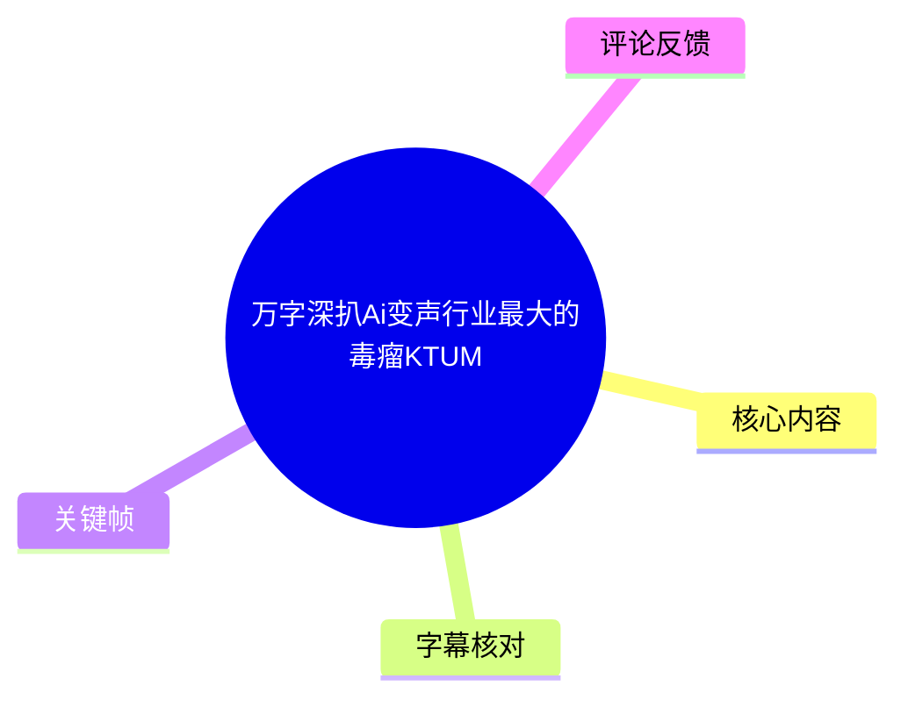
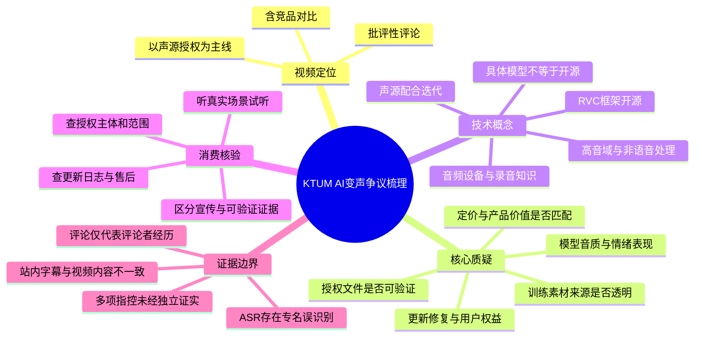
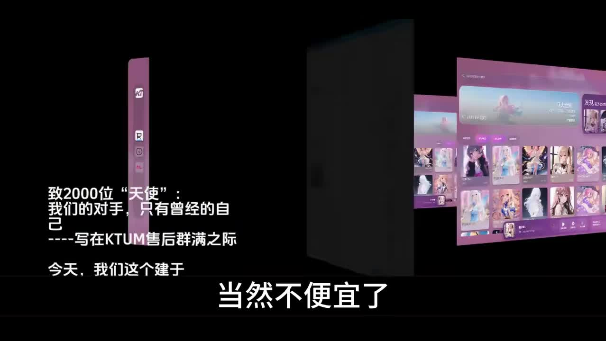
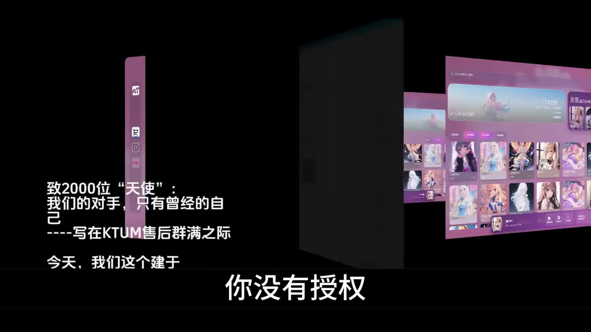
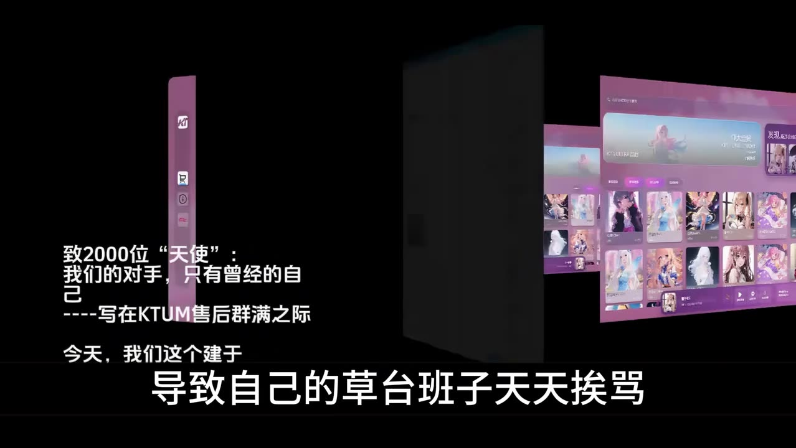
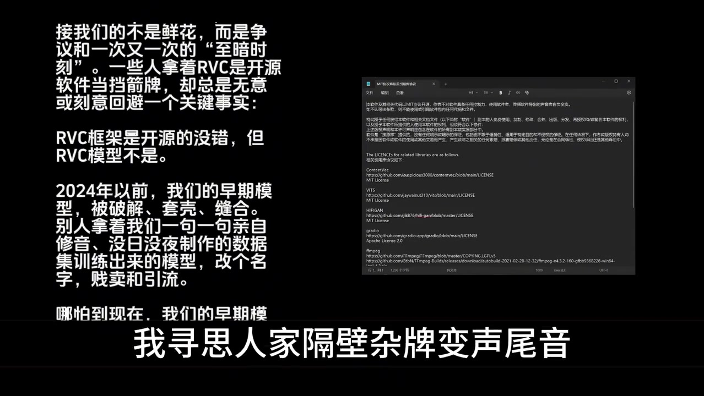

# 万字深扒 Ai 变声行业最大的毒瘤 KTUM

> 来源：[Bilibili 视频](https://www.bilibili.com/video/BV1mWdZB7E5P)  
> UP 主：Ai变声测评师周通｜发布于：2026-04-19｜时长：10 分 49 秒  
> 合集：AIcode｜标签：AI 变声、KTUM、RVC、变声器、音宗、魂灵变声

## 小结

本视频是一条针对 **KTUM AI 变声产品及其宣传内容**的批评性评论视频。UP 主以“声源授权”为核心标准，质疑 KTUM 所售模型的声源来源、授权证明、产品迭代能力、音质、定价、用户权益与营销表达，并将其与“魂灵变声”等竞品进行主观对比。

视频最重要的可迁移观点是：评估 AI 变声产品时，不能只看“算法”“开源框架”或宣传话术，应优先核验**声源授权链路、模型训练来源、更新与问题修复机制、试听效果、售后规则及用户补偿方案**。UP 主尤其强调：RVC 框架是否开源，不等同于具体模型及训练数据可以不受授权约束。

视频包含多个强烈批评和指控性表达，例如“无授权”“素材来自网络”“技术能力不足”“高价销售”等。这些均属于 UP 主的观点、推测或对其他素材的转述；本视频素材中**未提供可独立核验的合同、授权书、产品源代码、订单数据或第三方法律结论**，不应将其直接视为已被证实的事实。

技术层面，视频提到了 RVC、模型训练、声源授权、咳嗽等非语音片段的处理、高音域表现、机架跳线、混音、声卡调试、低频陷阱等概念，但没有展示可复现的软件设置、模型参数、训练命令或测评数据。因此它更适合作为消费风险与产品核验思路的材料，而非 AI 变声技术教程。

时效上，视频发布于 2026-04-19。KTUM、竞品及其模型、价格、授权状态、功能和售后政策均可能在此后变化；购买或传播相关结论前，应回到产品当前页面、授权文件及正式声明核验。

## 思维导图

## 目录

- [视频背景、范围与证据边界](#视频背景范围与证据边界)
- [授权：视频提出的首要评价标准](#授权视频提出的首要评价标准)
- [RVC、模型与产品效果争论](#rvc模型与产品效果争论)
- [破解、版权及用户权益问题](#破解版权及用户权益问题)
- [音频专业能力与产品宣传批评](#音频专业能力与产品宣传批评)
- [“玩具产品”、营销素材与价格评价](#玩具产品营销素材与价格评价)
- [可执行的 AI 变声产品核验步骤](#可执行的-ai-变声产品核验步骤)
- [结论、限制与时效性](#结论限制与时效性)
- [关键帧](#关键帧)
- [字幕比对](#字幕比对)
- [评论分析](#评论分析)
- [处理记录](#处理记录)

## 视频背景、范围与证据边界 [00:00:00](https://www.bilibili.com/video/BV1mWdZB7E5P?t=0)

视频开头，UP 主称其此前视频被指“拉踩”，并明确表示本期将对 KTUM 的“最新视频”逐项批评。整条视频采用口播评论加插入式画面的形式，核心不是产品实测流程，而是围绕 KTUM 宣传内容作反驳。

需要区分以下三层信息：

1. **视频可确认内容**：UP 主确实提出了授权、价格、音质、功能、营销、售后等质疑；视频中也出现了 KTUM 界面、文字宣传和许可证页面等被引用的画面。
2. **UP 主的评价与推断**：例如对声源来源、团队能力、产品性质、用户数量与资金用途的判断，多为强烈的主观批评，不能因视频存在而自动成立。
3. **尚未在素材内核验的外部事实**：KTUM 是否持有授权、授权的具体范围、模型价格、销量、是否曾发生破解、用户被移出群聊、产品是否“负优化”等，均需要原始授权材料、产品记录、平台公告、当事方回应或第三方证据进一步验证。

视频标题使用“毒瘤”等贬损性标签，反映的是作者立场，不是中立结论。阅读或引用本笔记时，应避免将其改写为确定的侵权、欺诈或违法结论。

## 授权：视频提出的首要评价标准 [00:00:26](https://www.bilibili.com/video/BV1mWdZB7E5P?t=26)

### 1. 对模型定价与授权透明度的质疑 [00:00:26](https://www.bilibili.com/video/BV1mWdZB7E5P?t=26)

UP 主称，KTUM 曾有“模型卖 1999”的情况，并认为高价本身不是问题，关键在于产品是否物有所值、声源是否有清晰授权。这里的 **1999** 为视频口播中提及的价格，素材没有给出币种、商品名称、销售页面或有效期，不能作为当前报价使用。

UP 主提出的核验问题包括：

- 声音素材的质量是什么；
- 声音素材来源是什么；
- 声源本人是否知情；
- 是否存在可公开查验的授权；
- 若有争议，消费者如何确认模型的使用范围。

这些问题具有普遍的消费核验价值，但“KTUM 没有授权”在视频中是 UP 主的指控；本素材未展示能够完整证明或否定该项指控的授权文档。

### 2. 授权与模型迭代的关系 [00:00:50](https://www.bilibili.com/video/BV1mWdZB7E5P?t=50)

UP 主解释了其认为授权重要的原因：如果声源本人参与并授权，开发者理论上能够与声源沟通，补录语料或针对特定表现进行调整，从而改善模型的后续体验。

他举了一个功能性例子：某个变声模型若对“咳嗽”处理不佳，可能在用户咳嗽时产生异常声音；若开发方能够与声源沟通，便可能通过协调、补充录音或更新产品来改善表现。

这一段应理解为一种**产品迭代逻辑**，而不是对所有模型的技术保证：

- 授权可以降低权利关系不清的风险，也可能使补录和长期合作更可行；
- 但“有授权”不必然保证模型一定能处理咳嗽、笑声、喘息、嘶吼等非语音片段；
- 是否能改善表现仍取决于采样质量、数据覆盖、训练方案、实时推理链路、后处理和产品工程能力；
- 无授权也不当然能够仅凭视频口播即认定其训练数据“来自偷取”，这需要独立证据。

> 图：画面展示粉紫色产品界面及视频对定价的批评字幕。它有助于定位本段讨论的是产品售价与价值匹配，而不是可核验的现行价格证明。

### 3. “没有授权”与升级能力的论证 [00:01:14](https://www.bilibili.com/video/BV1mWdZB7E5P?t=74)

UP 主进一步主张，若开发方无法与真实声源对接，便不利于补充训练素材或改进模型；他由此将 KTUM 与“魂灵变声”的持续更新能力作对比，并将后者描述为能够开发新功能的产品。

这一论证的可迁移部分是：购买前应检查产品是否有持续维护的证据，例如：

- 明确的版本号；
- 可追溯的更新日志；
- 对音高、发音、噪声、断音、非语音片段等问题的修复说明；
- 合理的售后反馈渠道；
- 可验证的模型或声源合作说明。

但视频未提供 KTUM 与竞品的版本历史、测试样本、更新频率统计或授权协议，故不能据此定量判断两者的迭代能力差异。

> 图：画面直接呈现“你没有授权”的视频字幕与 KTUM 界面。其价值在于准确记录作者批评焦点；该字幕本身不是授权状态的独立证明。

### 4. 用户规模与授权投入的说法 [00:02:02](https://www.bilibili.com/video/BV1mWdZB7E5P?t=122)

UP 主口播中以“2000 人”和“不便宜的单价”推论团队应有资源解决授权问题，并以夸张措辞质疑资金使用。这里的“2000”没有在所给素材中对应到可核验的用户统计、订单记录或财务数据，属于作者论辩中的数字引用。

对消费者而言，更有实际意义的不是根据用户规模推算团队收入，而是直接索取或检查：

- 声源或权利方身份；
- 授权方与销售方是否一致；
- 授权用途：实时变声、歌声转换、商用内容、二创发布等；
- 授权地域、期限、可否转授权；
- 模型下架、授权终止、争议发生时的退款或补偿条款。

> 图：画面保存了 UP 主在用户数量与授权问题上的批评性表达。该帧适合说明视频语气及论证方式，不应用作团队规模或授权状态的事实证据。

## RVC、模型与产品效果争论 [00:02:26](https://www.bilibili.com/video/BV1mWdZB7E5P?t=146)

### 1. RVC 框架开源，不等于具体模型没有权利边界 [00:02:26](https://www.bilibili.com/video/BV1mWdZB7E5P?t=146)

UP 主提出一个关键技术区分：**RVC 框架可以是开源的，但具体 RVC 模型并不因此自动“开源”或没有权利问题。**

这一区分值得保留。开源软件项目的许可证通常约束代码及其分发方式；而声音数据、模型权重、角色形象、商标、录音制品和人格权益可能分别受到不同规则约束。使用某个开源框架训练或部署模型，并不能自动说明训练数据、模型权重或商业化使用已获得充分许可。

视频主张用户真正关心的是“能不能超越 RVC”，可拆分为更可操作的评测维度：

| 维度 | 应检查的问题 |
| --- | --- |
| 声音相似度 | 音色是否稳定，是否存在明显机械感或失真？ |
| 情绪表现 | 平静、兴奋、愤怒、叙述等语气是否保留或自然？ |
| 发音清晰度 | 辅音、尾音、咬字是否清楚？ |
| 音高覆盖 | 高音、低音、音域跳变时是否破音或变形？ |
| 非语音表现 | 咳嗽、笑声、吸气、停顿等是否异常？ |
| 实时性 | 延迟、CPU/GPU 占用、卡顿和掉音情况如何？ |
| 授权与售后 | 训练数据来源、授权范围、退款和更新机制是否明确？ |

### 2. 对音质、情绪与价格的主观对比 [00:02:56](https://www.bilibili.com/video/BV1mWdZB7E5P?t=176)

在此段，UP 主播放或转述 KTUM 的配音演示，认为其声音缺乏情感起伏、人声细节不足，并使用“像罩了两层棉裤”等比喻描述听感。随后又播放“魂灵变声”的“彩玲”声音作为对照，认为后者在读稿体验上更好。

这是一次**主观听感比较**。素材中没有给出：

- 两边是否使用相同麦克风、输入音量、采样率和降噪设置；
- 是否使用同一段原始文本；
- 是否在相同的音高、混响、压缩、EQ 或后处理条件下录制；
- 是否为同一版本的软件和模型；
- 是否盲听或有量化评分。

因此，视频可说明作者的偏好和批评点，但不能代替严格的横评。想比较产品的人，应在相同输入、相同文本、相同输出响度和相同监听条件下做 A/B 测试。

## 破解、版权及用户权益问题 [00:04:01](https://www.bilibili.com/video/BV1mWdZB7E5P?t=241)

### 1. 关于“破解”的争论 [00:04:01](https://www.bilibili.com/video/BV1mWdZB7E5P?t=241)

UP 主称，KTUM 在其宣传内容中提及早期 AI 变声行业的“破解”问题；UP 主则质疑其过去对破解话题的态度，并进一步质问：若产品曾被破解，付费用户是否获得补偿。

“破解”涉及软件保护、盗版、账号或许可绕过等多个可能情形。视频没有展示具体漏洞说明、破解样本、处理公告、受影响人数、补偿规则或开发方回应。因此，这一段只能整理为作者提出的用户权益问题：

- 若付费软件或模型遭未经授权分发，官方如何确认影响范围？
- 原用户的授权、激活、更新、售后是否受影响？
- 是否存在替换、延期、退款、升级或其他补偿方案？
- 官方是否通过可追溯的公告说明了处置过程？

### 2. 对“市场份额”“低价产品”的反驳 [00:04:25](https://www.bilibili.com/video/BV1mWdZB7E5P?t=265)

视频转述了“早期模型占据所谓 AI 变声器 80% 以上份额”“低价变声器卖的是我们的昨天”等说法，并要求提出被指涉产品的具体名称。这里的 **80% 以上** 是视频转述的市场份额表述；未给出市场研究机构、统计口径、时间范围或样本量。

这提示了面对行业宣传数字时的基本判断方法：

1. 先问统计对象是什么：用户数、活跃用户、模型数量、销售额还是内容播放量；
2. 问统计地域和期间；
3. 问数据来源是否可审计；
4. 将“市场份额”“行业第一”“多数产品”类说法与实际证据分开；
5. 避免将未点名的竞品、低价产品或用户群体一概而论。

### 3. “原创团队”与训练授权的边界 [00:04:49](https://www.bilibili.com/video/BV1mWdZB7E5P?t=289)

UP 主转述 KTUM “不拿未授权的游戏、影视、音乐等人物角色训练模型或做噱头”的表达，继而指出：即使不使用上述角色，若其他声源授权无法证明，仍有授权问题。

这一段的核心不是某一方结论，而是授权审查不能只停留在“是否使用知名角色”。应覆盖：

- 声音是否来自真人、角色配音、公开录音或合成素材；
- 录音素材的录制者、表演者、制作方及权利链；
- 是否取得针对模型训练与模型商业销售的许可；
- 是否允许用户将输出用于直播、视频、配音、广告或商业项目；
- 是否会因声源方撤回许可而改变用户使用权。

## 音频专业能力与产品宣传批评 [00:05:38](https://www.bilibili.com/video/BV1mWdZB7E5P?t=338)

### 1. 音频设备知识相关批评 [00:05:38](https://www.bilibili.com/video/BV1mWdZB7E5P?t=338)

UP 主批评 KTUM 及相关宣传者不了解音频设备，并提到“机架跳线”“混音”“声卡调试”“混响”等概念。此处没有演示任何具体软件界面、设备型号、连线方式或参数，不能整理为可直接执行的调音教程。

这些概念的作用可简要区分：

- **机架跳线**：在宿主或虚拟音频机架中，将输入、效果器、虚拟通道和输出建立正确的信号路由；
- **混音**：对多个声源的音量、EQ、动态、空间效果等进行平衡；
- **声卡调试**：通常包括输入增益、驱动、采样率、缓冲区、监听与通道配置；
- **混响**：为声音加入空间反射感；过多会降低清晰度；
- **低频陷阱**：用于改善录音/监听环境中低频驻波问题的声学处理设备或结构。

这些知识确实影响变声输入质量和最终听感，但它们不是判断 AI 模型授权状态的证据，也不意味着懂设备就必然拥有更强的模型研发能力。

### 2. 对“无版权争议”“算法和数据集”的追问 [00:07:05](https://www.bilibili.com/video/BV1mWdZB7E5P?t=425)

UP 主针对宣传中的“确保产品无版权争议”“在算法和数据集上达到近乎强迫症”等表述提出反问，要求看到授权证明。

从风险管理角度，“无版权争议”是很强的宣传表述。消费者或合作方不宜仅根据口头承诺判断，而可要求查看在合理范围内可披露的材料，例如：

- 授权主体、授权对象和授权日期；
- 可用于模型训练、部署和销售的范围说明；
- 商品/服务协议中的责任边界；
- 知识产权投诉处理渠道；
- 在不能公开合同全文时，是否提供经必要脱敏的授权证明、权利声明或合作公告。

由于授权合同往往涉及隐私、商业机密和个人信息，无法公开全部文件并不自动证明无授权；但销售方至少应提供足以让用户理解权利范围和风险承担方式的信息。

### 3. 高音域、升级与用户沟通 [00:07:29](https://www.bilibili.com/video/BV1mWdZB7E5P?t=449)

UP 主质疑产品高音域表现、升级效果与用户群管理，并提及有用户认为升级不如旧版本、或因质疑被移出群聊。后两项在素材中没有聊天记录、用户访谈或官方公告支撑，应保持为作者的说法。

视频中可提炼出的产品验证问题是：

- 高音演唱、假声、强情绪语音是否出现断裂、音色漂移或爆音；
- 更新前后是否提供版本说明和回滚机制；
- 用户反馈通道是否允许提出性能问题；
- 是否有明确的社区管理规则与申诉途径；
- 是否存在可试听的更新前后对照样本。

## “玩具产品”、营销素材与价格评价 [00:08:08](https://www.bilibili.com/video/BV1mWdZB7E5P?t=488)

### 1. 对“玩具产品”表述的解读 [00:08:08](https://www.bilibili.com/video/BV1mWdZB7E5P?t=488)

UP 主称自己在 KTUM 宣传视频中听到“玩具产品”一词，并对此作了讽刺性解读：若产品自我定位为玩具，便不应再以专业变声产品的业务能力、授权和技术开发标准衡量。

这里需要谨慎。“玩具”可能是营销中的轻量化、娱乐化定位，也可能是视频作者截取语境后的理解；素材没有提供 KTUM 原始宣传视频的完整上下文。因此不能仅凭该片段判断 KTUM 的正式产品定位。

但产品定位确实会影响购买判断：

- 若定位为娱乐玩具，用户应重点确认基础体验、价格合理性、隐私、安全、适用平台和非专业用途限制；
- 若定位为专业变声工具，则还应关注稳定性、低延迟、专业音频链路、授权、商用条款、版本维护与技术支持；
- 无论定位如何，销售方都不应以模糊定位代替对商品能力、权利边界和售后的说明。

### 2. 对营销视频制作质量的批评 [00:08:40](https://www.bilibili.com/video/BV1mWdZB7E5P?t=520)

UP 主批评 KTUM 的营销视频“字幕和语音对不上”，并将宣传素材质量延伸为对团队整体能力的否定。这种延伸属于评价性推论：一个视频字幕不同步可能由制作疏漏、版本错误、剪辑流程等多种原因造成，无法单独证明算法、授权或售后能力。

不过，营销素材仍可作为低成本的观察入口。用户可检查：

- 配音和字幕是否一致；
- 演示是否清晰标注原声、变声结果、后处理与版本号；
- 是否避开高音、笑声、噪声等困难场景；
- 是否提供未经强混响、压缩和剪辑修饰的原始样本；
- 页面中的价格、功能、系统要求和售后政策是否一致。

### 3. 价格、使用场景与“优质产品”的判断 [00:09:04](https://www.bilibili.com/video/BV1mWdZB7E5P?t=544)

UP 主再次以“1999”对比“更少的钱”，表达其对 KTUM 性价比的否定，并对部分特定使用场景的声音选择作嘲讽。关于价格与用途的价值判断具有明显主观性，不能以此替代个人需求分析。

对潜在用户而言，正确的问题应是：

- 我需要实时变声、歌曲转换、配音、直播还是内容创作？
- 需要变为特定声线，还是需要训练自己的声音？
- 是否需要商用或对外发布？
- 是否需要长期更新、多个模型、跨平台支持？
- 在授权、音质、稳定性和售后均可验证的前提下，成本是否匹配？

## 可执行的 AI 变声产品核验步骤 [00:00:50](https://www.bilibili.com/video/BV1mWdZB7E5P?t=50)

以下步骤根据视频反复提出的授权、音质、功能、价格和售后问题整理；它们是购买前的核验框架，并非视频中展示的软件操作流程。

### 步骤 1：确认产品、模型与版本

记录待购买产品的：

- 产品名称与开发/销售主体；
- 模型名称和版本号；
- 标价、订阅周期、是否一次性买断；
- 支持的操作系统、应用场景及硬件要求；
- 演示素材发布日期。

避免只根据群聊截图、转售页面或短视频片段下单。

### 步骤 2：核验授权与使用范围

优先向销售方询问并保存书面答复：

1. 模型声源是否取得授权；
2. 授权是否覆盖模型训练、部署、销售和用户使用；
3. 用户是否可以将输出用于直播、视频发布、商业项目或二次创作；
4. 授权终止、模型下架或权利争议发生时，用户权益如何处理；
5. 是否有投诉、下架和退款机制。

注意：不要把“使用 RVC”“模型原创”“不使用角色音色”等单一表述，当作完整授权证明。

### 步骤 3：使用统一素材试听

在同一输入条件下测试至少以下内容：

- 普通说话；
- 快速说话；
- 高音与低音；
- 情绪起伏较大的语句；
- 咳嗽、笑声、吸气、停顿；
- 目标平台中的实时延迟与断音。

测试时尽量固定麦克风、输入增益、采样率、背景噪声、后处理和播放响度。若不同产品用不同素材或不同修音链路演示，横向比较的意义会显著降低。

### 步骤 4：检查版本维护与反馈机制

查看是否有：

- 可追溯更新日志；
- 已知问题清单；
- 性能问题的修复记录；
- 用户反馈或工单渠道；
- 更新失败、体验下降时的回滚或补偿说明。

视频中的“咳嗽变声异常”“高音域表现”“升级不如旧版”等讨论，都提示了应在购买前测试边界场景，而不是只听一段精修宣传音频。

### 步骤 5：审阅交易与售后条款

特别关注：

- 数字商品是否支持退款；
- 模型是否可转移设备或账号；
- 授权是否限定个人、商用或特定平台；
- 服务停止时是否仍可离线使用；
- 账号封禁、模型下架、许可争议时的处理规则。

若销售页面无法明确这些内容，风险应计入购买决策。

## 结论、限制与时效性 [00:10:09](https://www.bilibili.com/video/BV1mWdZB7E5P?t=609)

视频结尾，UP 主总结其系列标准为：能拿出声源授权的产品，在其评价体系中会获得较高容忍度；并称若被批评对象后续将问题整改到位，自己会调整批评重点。这表明其内容方法以“授权可证明性”为主轴。

本视频的价值主要在于提出了一套值得检验的问题：模型究竟来自哪里、谁拥有声音相关权利、销售者能否说明授权范围、模型能否持续更新、用户在争议中能获得何种保障。对于 AI 变声、歌声转换、直播变声等高风险消费场景，这些问题比“算法先进”“开源”“行业领先”等口号更具实际意义。

但本视频也有明确限制：

- 立场鲜明，语言激烈，包含大量嘲讽、推断和未展示原始证据的指控；
- 没有完整展示 KTUM 对相关质疑的回应；
- 没有提供统一测试环境下的量化音质、延迟、稳定性或模型能力数据；
- 提及的价格、用户数量、市场份额、破解情况和社区事件均缺少可在素材内独立验证的原始材料；
- ASR 对产品专名存在多次误识别，文本阅读需以视频标题和关键帧中的 **KTUM** 为准。

因此，最稳妥的结论不是“视频已经证明某产品存在何种问题”，而是：**将视频中的质疑转化为购买前的证据清单，并同时核对官方声明、授权材料、实际试用与独立测评。**

## 关键帧 [00:02:02](https://www.bilibili.com/video/BV1mWdZB7E5P?t=122)

| 图片 | 画面内容 | 正文使用价值 |
| --- | --- | --- |
|  | KTUM 粉紫色界面与“当然不便宜了”字幕 | 对应视频对售价与价值匹配的批评。 |
|  | KTUM 界面与“你没有授权”字幕 | 直观标记整条视频最核心的争议议题：声源授权。 |
|  | “致 2000 位天使”等画面与批评字幕 | 用于说明视频将用户数量、价格与授权投入关联的论证方式。 |
|  | 引用画面显示“RVC 框架是开源的没错，但 RVC 模型不是”及许可证窗口 | 有助于理解视频对“开源框架”和“模型/数据权利”进行区分的技术讨论。 |

> 关键帧仅用于记录视频画面与定位讨论主题。画面中的字幕、引用材料和界面不等于其所表达的事实已经被独立验证。

## 字幕比对 [00:00:00](https://www.bilibili.com/video/BV1mWdZB7E5P?t=0)

| 字幕来源 | 完整性 | 专有名词 | 时间轴 | 主要问题 |
| --- | --- | --- | --- | --- |
| Bilibili 站内字幕 `p01-ai-zh.srt` | 不完整且与本视频主题不匹配；仅覆盖约 00:00:02—00:07:20 | 未出现 KTUM、RVC、授权等本片核心术语 | 有毫秒级 SRT 时间轴 | 内容为音乐、家庭/搞笑片段等，与本视频连续评论口播明显不一致，不能用作正文依据。 |
| 本次 ASR `medium` | 覆盖约 00:00:00—00:10:48；诊断语音覆盖率 94.95% | 多处误识别：KTUM 被识别为“KTOM”“KTAM”“Tom”；“变声”“授权”等也有错字 | 有可直接使用的分段起止时间；共 32 段 | 长段落缺少断句，包含口语误听与错别字；00:06:06—00:06:17 左右存在约 10.81 秒较大空隙。 |

### 最终字幕选择

正文以**本次 ASR 时间轴**为准，因为其主题、时长和口播内容与视频标题及关键帧一致；站内字幕虽有时间轴，但内容明显错配，未采用为事实依据。

本次 ASR 检测到有效音轨，未标记 `noAudioStream=true`。因此不存在“源视频没有音轨”的情况。对以下关键专名和术语进行了基于元数据、标题、标签与关键帧的审慎校正：

- `KTOM`、`KTAM`、`Tom` → **KTUM**；
- `RVC` 保留为 **RVC**；
- `变生`、`变身`等上下文误识别 → **变声**；
- `授全`、`授拳`等上下文误识别 → **授权**；
- `魂灵变生` → **魂灵变声**。

除上述明确的专名与常见术语校正外，正文不对无法从素材确认的口播细节作扩写。

## 评论分析 [00:10:33](https://www.bilibili.com/video/BV1mWdZB7E5P?t=633)

仅处理本次可获取的热评前三条。以下内容反映评论者个人观点或经历，未经过独立核验。

### 热评 1：训练能力与自有声音需求

- 评论者：各浮萍
- 获赞：50
- 核心观点：评论者称自己曾见到 KTUM，认为其“不开源、没授权、不能训练”；其个人需求是用自己的声音唱歌，因此将“支持训练”视为使用门槛，并认为 RVC 模型的音色融合能力更适合改善自训练模型。
- 补充价值：该评论提供了一个不同于视频主线的选购维度——**用户是否需要训练自己的声音**。对有自训练需求的人，“能否训练”“训练门槛”“融合能力”可能比预置音色数量更重要。
- 可信度与限制：评论没有附带产品页面、操作记录或版本信息；“不能训练”等表述不能直接视为当前产品功能事实，需查看 KTUM 当前功能说明和试用结果。

### 热评 2：社区管理与旧版 RVC 讨论

- 评论者：赖赖喵_Meko
- 获赞：16
- 核心观点：评论者称自己曾在群内提及旧版无框架 RVC 并发送变声语音，随后被移出群聊；其将此理解为管理者对竞争或替代方案的敏感。
- 补充价值：与视频中关于用户沟通、群管理和反馈机制的批评形成呼应，提示消费者关注社区规则、反馈渠道与申诉机制。
- 可信度与限制：这是单一用户的自述，未提供聊天记录、群规或管理方回应；不能据此概括整个社区或团队的管理行为。

### 热评 3：对经营模式与版权话术的负面评价

- 评论者：华一就是华1啊
- 获赞：10
- 核心观点：评论者回忆 2024 年曾发布批评“AI 换皮骗钱”的视频，并称遭到对方鼓动粉丝举报账号；评论者据此评价对方缺乏技术、借声音版权话题高价销售模型。
- 补充价值：该评论补充了一个较早时间点的个人纠纷叙述，也体现出评论区对“版权正义话术”和实际授权透明度之间是否一致的关注。
- 可信度与限制：该评论包含对具体人物和行为的严重负面指称，但未附证据链、视频链接、举报记录或对方回应。应严格视为评论者陈述，不能作为事实结论或进一步传播的依据。

## 评论分析

- 热评 1：前两天刷到过KTUM，又不开源又没授权，还不能训练。光不能训练这点就懒得下载了，想用自己的声音唱歌，首先就得支持训练，不能训练就只能变一个不知道是谁的声音了。就算买模型，RVC买个好一点的模型好歹还能用音色融合功能改善自己训练的模型的效果
- 热评 2：[doge_金箍]还有就是在群里就提了一嘴老版本无框架的rvc以及发了一下变声后的语音条，就被莫名其妙的踢了，生怕抢了他什么饭碗似的，难蚌[呲牙]我是来玩的，又不是来做生意的，也不知道搁这ptsd啥呢
- 热评 3：确实啊，空调人品挺那啥的，他干的坏事24年被爆出来的时候很多人发视频骂他，骂他的视频下面b站首推我23年发布的视频《拒绝换皮ai换皮骗钱》，换皮骗钱这几个字像是戳中他内心痛点一样，他鼓动粉丝举报我哔站账号（我水友跑到我这里打报告我才知道的）。我觉得这个人就是又没技术又爱打着声音版权的正义旗子高价卖模型的贩子罢了。

以上内容是观众反馈摘录，只用于补充理解视频反响，不作为正文事实依据。

## 处理记录

- Worker ID：worker-mrj0www4-e8d79408
- 模型：gpt-5.6-terra
- 调用工具与素材：视频元数据、关键帧、Bilibili 站内字幕 `p01-ai-zh.srt`、本次 ASR 结果 `asr/asr-result.json`、ASR SRT `asr/transcript.srt`、热评数据 `comments/comments.json`
- 字幕选择：检查了站内字幕与本次 ASR；站内字幕内容与视频主题明显错配，最终以具有完整时间轴的本次 ASR 为时间定位依据，并结合标题、标签和关键帧校正 KTUM、RVC、变声、授权、魂灵变声等明显误识别词。
- 关键帧依据：选用 `frame-001` 至 `frame-004`，因为它们分别直观呈现价格批评、授权质疑、用户数量关联论证，以及 RVC 框架与模型权利边界；未将关键帧字幕视为独立事实证据。
- 评论处理：仅分析可获取热评前三条，均明确标注为评论者个人陈述，未提升为已核验事实。
- 缓存清理：未提供可执行的缓存清理日志或清理结果；本记录不虚构清理操作。
- 未解决问题：素材内没有 KTUM 的完整原始回应、授权文件、现行产品页、版本日志、统一条件下的音质测试、交易记录或第三方调查材料，无法独立确认视频中的多数指控与价格/份额数字。
