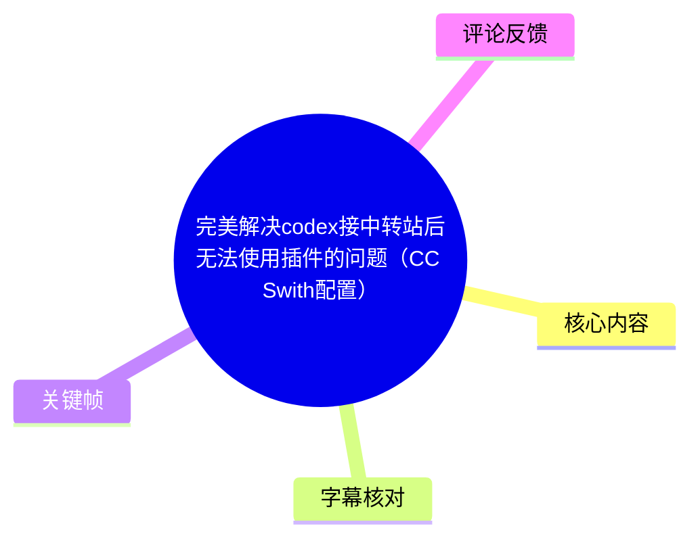
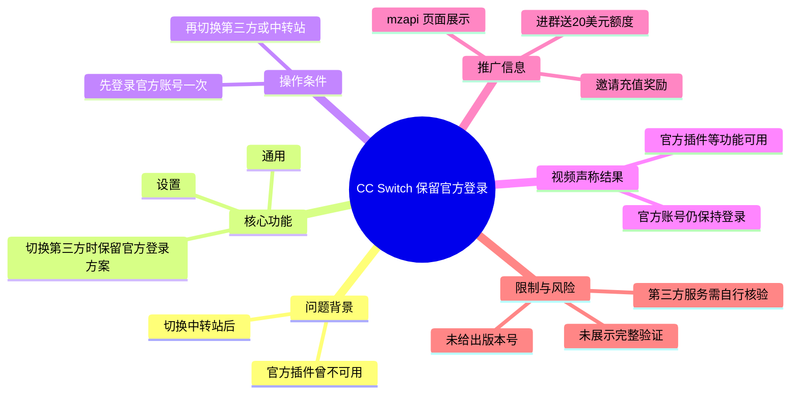
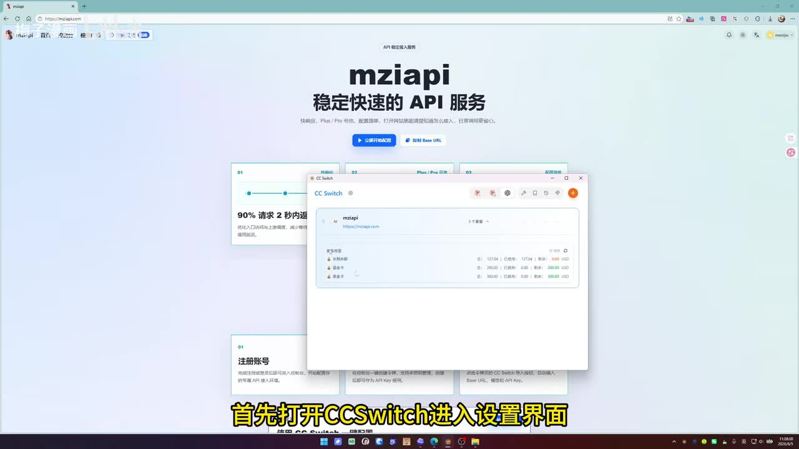
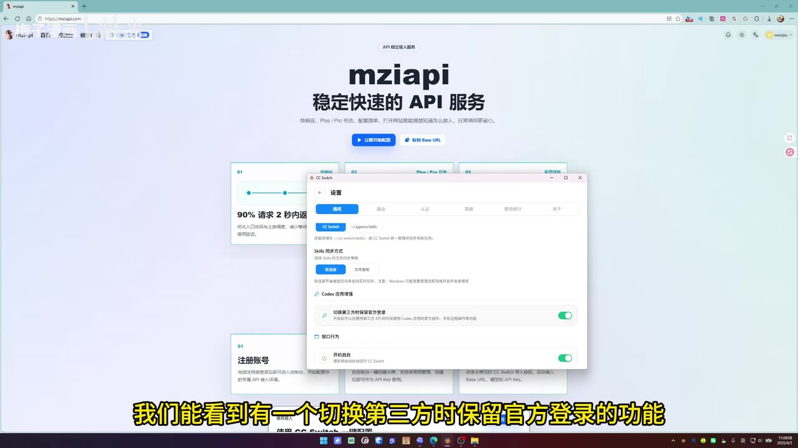
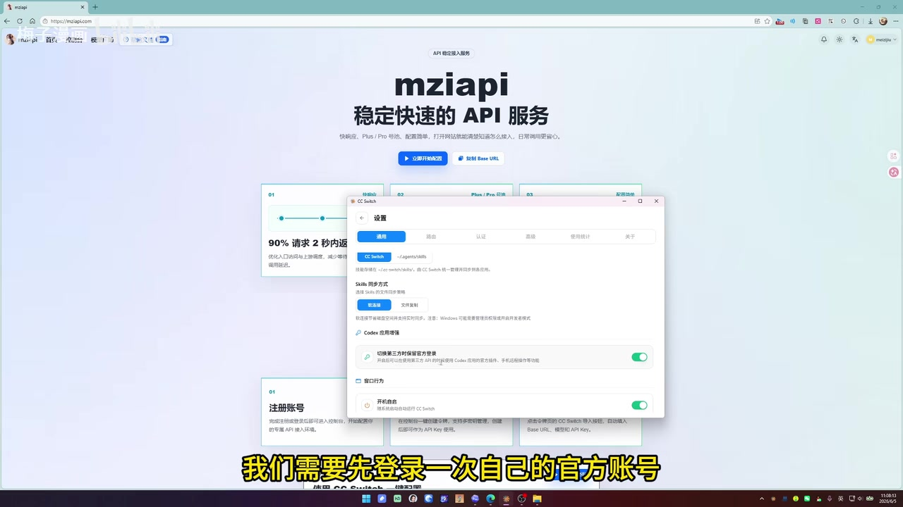
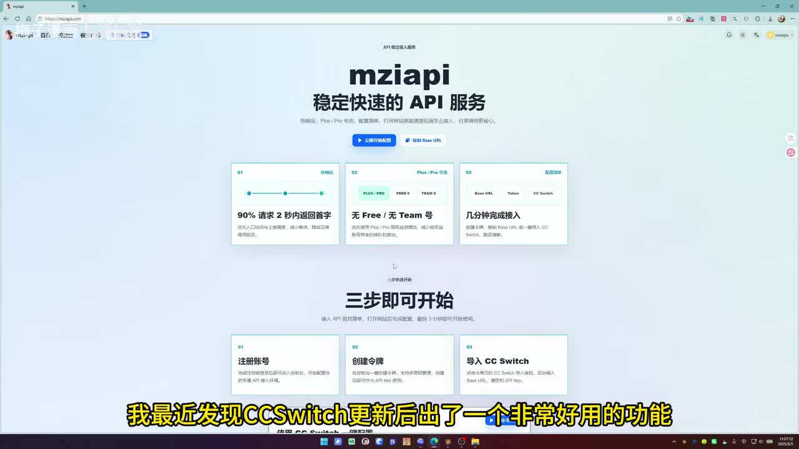

# 完美解决 codex 接中转站后无法使用插件的问题（CC Swith 配置）

> 来源：[Bilibili 视频](https://www.bilibili.com/video/BV1ZR7r6tEfG)  
> UP 主：梅子漫画｜合集：AIcode｜视频时长：61 秒  
> 视频标题中的 “CC Swith” 疑似为 “CC Switch”；正文以画面和 ASR 中出现的 **CC Switch** 为准。

## 小结

视频介绍了 CC Switch 更新后新增的一项配置：在 **设置 → 通用** 中开启“**切换第三方时保留官方登录方案**”。UP 主称，这能解决此前切换至中转站后无法使用官方插件的问题。

按视频演示，操作前提是用户需要先登录一次自己的官方账号；之后再通过 CC Switch 切换到第三方/中转站配置。UP 主表示，此时官方账号仍会维持登录状态，官方插件等功能仍可使用。

这是一项以“保留官方登录状态”为核心的配置经验，而非对中转站接口、Codex 插件协议或账号机制的底层原理说明。视频没有展示中转站的具体 Base URL、API Key 填写方式、CC Switch 版本号、插件名称、成功验证过程或报错对比。

后半段为 UP 主对其自建中转站的推广：宣称服务稳定可用、进群可领取 20 美元额度，并称邀请好友注册、充值成功后双方可获得与付款金额等额的额度奖励。这些属于发布者宣传口径，素材中没有可独立验证的服务条款、倍率、价格、稳定性数据或安全说明。

信息具有明显时效性：该功能依赖 CC Switch 的特定更新版本和第三方服务的当前状态。实际使用前应自行确认软件版本、官方账号与第三方服务的使用条款、令牌安全和费用规则。

## 思维导图

## 目录

- [背景：视频要解决的插件可用性问题](#背景视频要解决的插件可用性问题)
- [核心配置：保留官方登录方案](#核心配置保留官方登录方案)
- [实际操作步骤与验证边界](#实际操作步骤与验证边界)
- [画面中的中转站推广与奖励信息](#画面中的中转站推广与奖励信息)
- [技术要点、限制与时效性](#技术要点限制与时效性)
- [字幕比对](#字幕比对)
- [评论分析](#评论分析)
- [处理记录](#处理记录)

## 背景：视频要解决的插件可用性问题 [00:00:26](https://www.bilibili.com/video/BV1ZR7r6tEfG?t=26)

视频的有效口述内容从 ASR 的 `00:00:26,500` 开始。UP 主称，其发现 CC Switch 更新后出现了一个“非常好用的功能”，并将其用途概括为：解决切换中转站后不能使用插件的问题。

视频中可明确区分的事实如下：

- **视频陈述**：此前切换至中转站后，插件无法使用。
- **视频陈述**：CC Switch 更新后提供了用于保留官方登录状态的开关。
- **画面可见**：浏览器背景为名为 “mzapi” 的 API 服务页面，前景打开了 CC Switch 窗口。
- **未展示的信息**：此前故障的报错界面、不可用插件的具体名称、故障触发条件，以及 CC Switch 的版本号。

因此，视频提供的是一个针对特定工作流的配置建议：同时使用官方账号能力与第三方/中转站配置时，尝试保留官方登录。它并未证明所有中转站、所有插件或所有系统环境都适用。

> 图：画面显示 CC Switch 已打开，背景是 “mzapi 稳定快速的 API 服务”页面。该帧说明视频的实际演示环境包含第三方 API/中转站页面，但不能据此推断其服务质量或兼容性。

## 核心配置：保留官方登录方案 [00:00:26](https://www.bilibili.com/video/BV1ZR7r6tEfG?t=26)

UP 主给出的关键路径是：

1. 打开 **CC Switch**。
2. 进入 **设置**。
3. 选择顶部的 **通用** 页签。
4. 向下查找并开启“**切换第三方时保留官方登录方案**”。
5. 先登录一次自己的官方账号。
6. 再通过 CC Switch 切换至中转站。

画面中的设置页可见“通用”页签，以及“Codex 应用增强”区域；开关的完整文字为“切换第三方时保留官方登录方案”。视频字幕/口述将其称为“功能”，而画面表明它是一个可切换的开关项。

> 图：该帧直接展示 CC Switch 的“设置 → 通用”界面，并可见“切换第三方时保留官方登录方案”开关已处于开启状态。这是视频中最关键、可由画面核对的配置依据。

### 配置含义

视频没有解释实现机制，但其描述的行为关系是：

| 配置状态 | 视频所述结果 |
| --- | --- |
| 未启用该功能、切换中转站 | 过去可能无法使用插件 |
| 已启用该功能、先登录官方账号、再切换中转站 | 官方账号保持登录，官方插件等功能仍可用 |

这里的“官方插件等功能都还是可以用”是 UP 主的经验性结论，不等同于 CC Switch 官方文档保证，也不代表第三方接口能够获得官方服务的全部能力。

> 图：同一设置页中，视频口述强调“需要先登录一次自己的官方账号”。该帧有助于明确操作顺序：不是先切到中转站后再补登录，而是先建立官方登录状态，再执行切换。

## 实际操作步骤与验证边界 [00:00:27](https://www.bilibili.com/video/BV1ZR7r6tEfG?t=27)

由于 ASR 将长段口述合并为 `00:00:26,500–00:00:51,420`，素材无法为每一次点击提供更细粒度的可靠秒级时间；以下步骤按该段口述和关键帧中可见界面整理。

### 操作步骤

1. **准备官方账号登录**
   - 在 CC Switch 中完成一次自己的官方账号登录。
   - 视频没有说明登录入口位于哪个页签，也没有展示账号授权流程。

2. **打开设置**
   - 启动 CC Switch。
   - 打开“设置”窗口。
   - 进入“通用”页签。

3. **开启保留登录开关**
   - 找到“切换第三方时保留官方登录方案”。
   - 将其开启。画面中该开关呈绿色开启状态。

4. **切换第三方/中转站**
   - 在官方账号已登录、开关已开启的前提下，通过 CC Switch 切换至中转站。
   - 视频没有展示具体的中转站配置字段，也未展示 Base URL、模型名、密钥或代理参数。

5. **自行验证插件**
   - 视频声称切换后官方登录状态仍在，官方插件等功能可用。
   - 实际操作时应自行打开目标插件并执行一次真实任务验证，而不能只以登录状态存在作为插件可用的充分证据。

### 建议的本地核验清单

下列检查是基于视频内容作出的实践建议，不是视频已展示的操作：

- 确认 CC Switch 当前版本中确实存在该开关。
- 切换前确认官方账号处于登录状态。
- 开启开关后再切换第三方配置，而非反向操作。
- 记录切换前后的账号状态、插件列表和实际调用结果。
- 若出现异常，避免在截图、日志或群聊中泄露官方令牌、第三方 API Key、Cookie 或授权链接。
- 在涉及付费中转站时，先确认充值金额、赠送额度、余额有效期、退款与风控规则。

### 视频未提供的关键参数

视频时长较短，以下技术信息均未给出，不能补充臆测：

| 信息项 | 视频是否提供 | 说明 |
| --- | --- | --- |
| CC Switch 版本号 | 否 | 无法判断该功能从哪个版本开始提供。 |
| 操作系统版本 | 否 | 画面为桌面环境，但未说明系统版本与兼容范围。 |
| 中转站 Base URL | 否 | 未显示具体地址。 |
| API Key 配置 | 否 | 未演示输入方式或安全存储方式。 |
| 所谓“插件”的名称与版本 | 否 | 无法针对特定插件复现。 |
| 成功调用截图/日志 | 否 | 没有实际插件请求与结果证据。 |
| 故障前后对照 | 否 | 没有展示关闭开关后的失败状态。 |

## 画面中的中转站推广与奖励信息 [00:00:27](https://www.bilibili.com/video/BV1ZR7r6tEfG?t=27)

视频前景演示 CC Switch，背景页面显示名为 **mzapi** 的服务。画面可读到“稳定快速的 API 服务”“三步即可开始”等营销文案；UP 主在口述中进一步推广其自建中转站。

### UP 主的推广性陈述

在 `00:00:27,360–00:00:51,420` 的 ASR 段落中，UP 主称：

- 如未找到中转站，可以查看其自建的中转站；
- 该服务“保证稳定好用”；
- 进群可免费领取 **20 刀**额度奖励；
- 有问题可在群内询问，扫码可加入；
- 存在拉新活动：好友通过邀请码注册并“成功充值”后，邀请人和好友可获得与付款金额等额的额度奖励。

其中“20 刀”按中文网络语境通常指 20 美元额度，但视频没有展示币种、发放条件、有效期或提现/退款规则，故只能按原意记录为“20 刀额度”，不能视为已核实的固定优惠。

> 图：页面顶部显示 “mzapi 稳定快速的 API 服务”，下方出现“注册账号、创建令牌、导入 CC Switch”的三步说明。该图说明推广页面所呈现的接入流程，但并不构成对其稳定性、请求延迟或服务合规性的独立验证。

### 对推广信息的审慎解读

- “保证稳定好用”是发布者的主观承诺，视频没有给出可重复测试的可用性、延迟、失败率或 SLA 数据。
- “充值后双方获得等额额度”涉及具体活动规则，可能存在门槛、封顶、时限或适用产品限制；视频未展示细则。
- 画面中虽然出现第三方服务页面，但未展示其运营主体、隐私政策、数据处理方式或 API 请求如何转发。
- 用户若使用第三方中转服务，应自行评估账号、代码、提示词和业务数据是否会经过第三方系统，避免提交敏感信息。

## 技术要点、限制与时效性 [00:00:51](https://www.bilibili.com/video/BV1ZR7r6tEfG?t=51)

ASR 在 `00:00:51,420–00:00:59,160` 继续讲述邀请充值奖励，随后以“今天的分享就到这里”结束。视频未提供新的配置步骤。

### 可迁移的经验

1. **切换配置前保留身份状态**  
   对于需要在官方账号能力和第三方连接配置之间切换的工具，应优先检查是否存在“保留登录”“保持认证”“不覆盖官方凭据”等选项。

2. **操作顺序可能影响结果**  
   本视频的关键前提是“先登录官方账号，再切换第三方”。若反复切换后状态异常，可尝试重新建立官方登录状态后再执行切换。

3. **用真实任务验证，而非只看界面**  
   登录状态保留不必然等于插件功能可用。应通过目标插件的实际调用、返回内容和错误日志确认结果。

### 适用范围与限制

- 本方法仅依据该视频中演示的 CC Switch 设置项，不能外推至其他客户端、插件管理器或中转工具。
- 视频标题称“完美解决”，但素材没有展示多环境测试、失败案例、性能测试或官方说明，因此不应将其视为普适保证。
- 视频没有交代“官方插件”与第三方中转站在认证、计费、访问权限上的边界；使用者须自行遵守相关服务条款。
- 第三方服务与奖励活动均可能变更、下线或调整，特别是额度赠送和邀请返利，不宜仅根据视频决定充值。
- 元数据发布时间为 2026 年 6 月，视频记录的是当时的界面与功能状态；CC Switch 后续更新可能改变设置名称、路径或行为。

### 新闻与时效性说明

本视频不是新闻报道，未提供外部新闻事件、官方公告或版本更新日志。其“CC Switch 更新后新增功能”的说法属于 UP 主口述，未附版本号、发布日期或官方更新链接；因此只能确认视频表达了这一观点，无法据素材确认该功能的首次发布时间。

## 字幕比对

| 字幕来源 | 完整性 | 专有名词 | 时间轴 | 主要问题 |
| --- | --- | --- | --- | --- |
| Bilibili 站内字幕 `p01-ai-zh.srt` | 与视频主题不匹配 | 未包含 CC Switch、Codex、中转站等关键术语 | 有逐句时间轴，范围为 00:00:00,120–00:01:02,760 | 内容为关于“享受当下”的励志文案，与本视频实际画面和语音不一致；结束时间还超过元数据标注的 61 秒。 |
| 本次 ASR（medium） | 覆盖主要口述内容 | 能识别 CC Switch、官方账号、中转站、插件等核心概念，但存在错字 | 有时间轴，三段覆盖 00:00:26,500–00:00:59,160 | 分段过粗、句子连写；“切损/切捡中轢站”“插键”“管方货号”“手冲”等明显识别错误。 |
| 关键帧与画面理解 | 仅覆盖截帧所示界面 | 可确认 CC Switch、“通用”“切换第三方时保留官方登录方案” | 不提供独立精确时间戳 | 可校正界面文字，但不能补足未展示的版本、参数与验证结果。 |

### 最终字幕选择与校正

正文**不采用站内字幕的语义内容**，因为其与视频主题完全不符；时间轴以本次 ASR 的真实分段为主，并通过关键帧校正产品名、设置路径和开关名称。

本次 ASR 诊断结果显示：

- 识别语言：中文，语言概率 `0.9990234375`；
- 模型：`medium`；
- 音频时长：约 `60.05` 秒；
- 语音覆盖：约 `32.66` 秒，占比 `54.39%`；
- 首段语音：`00:00:26,500`；
- 末段语音：`00:00:59,160`；
- 未标记 `noAudioStream=true`，说明素材诊断中**不存在“源视频没有音轨”**这一情况；本次 ASR 确实从音轨中识别到了口述内容。

重要校正如下：

| ASR 原文/问题词 | 校正结果 | 校正依据 |
| --- | --- | --- |
| “CC Switch” | CC Switch | ASR 多次出现，且窗口标题与视频标题语境一致。 |
| “切换第三方时保留官方登录的功效” | 切换第三方时保留官方登录方案 | 关键帧中的设置开关文字。 |
| “切损/切捡中轢站” | 切换中转站 | 标题、标签及上下文共同支持。 |
| “管方货号还是登彻状态” | 官方账号还是登录状态 | 上下文语义校正。 |
| “插键” | 插件 | 视频标题和上下文均指向插件。 |
| “手冲后” | 充值后 | 后文讨论付款金额等额额度奖励，语义对应充值。 |

由于 ASR 在 26.5 秒后以两段超长文本承载完整教程，本文只在已知可靠分段点使用时间轴链接，未根据文字顺序虚构更细的时间位置。

## 评论分析

本次素材仅获取到 **2 条热评**，不足前三条；以下仅分析可获取内容，不将评论视为已验证事实。

1. **一一小云一一： “什么倍率啊你这？”**
   - 评论关注中转服务的“倍率”，通常可能指模型调用计费倍率或价格系数。
   - 这指出视频推广信息没有交代一项重要的消费参数：额度与实际调用成本之间的换算关系。
   - 视频和评论均未给出具体倍率，不能据此推断收费标准。

2. **gpt升级开会票元： “整体节奏很舒服”**
   - 评论对视频节奏作正面主观评价。
   - 未补充配置步骤、版本信息、服务质量或技术验证，因此对教程可复现性的增量有限。

3. **第三条热评**
   - 素材未提供，无法分析。

## 处理记录

- Worker ID：`worker-mrj0wjed-b0c290ad`
- 整理模型：`gpt-5.6-terra`
- 素材中的 ASR 模型：`medium`，使用 CUDA、`float16` 推理。
- 使用的素材工具输出：视频元数据、站内 SRT、ASR 时间轴 SRT、ASR 诊断 JSON、评论 JSON、关键帧目录及已提供的关键帧画面。
- 字幕选择：
  - 已检查站内字幕与本次 ASR。
  - 站内字幕内容与实际视频不匹配，未用于正文语义。
  - 采用本次 ASR 的 `00:00:26,500–00:00:59,160` 时间段作为口述时间轴依据。
  - 以关键帧校正 ASR 中的设置项、产品名和明显错词。
- 关键帧选择依据：
  - `frames/frame-001.jpg`：展示 mzapi 页面及“注册账号、创建令牌、导入 CC Switch”的推广式接入信息。
  - `frames/frame-002.jpg`：展示 CC Switch 在第三方 API 页面环境中打开，说明演示上下文。
  - `frames/frame-003.jpg`：直接显示“设置 → 通用”及“切换第三方时保留官方登录方案”开关，是配置结论的主要视觉证据。
  - `frames/frame-004.jpg`：配合口述强调先登录官方账号这一操作前置条件。
- 缓存清理：提供的素材中没有缓存清理执行日志；无法确认是否已清理，故不作已清理声明。
- 未解决问题：
  - 未提供 CC Switch 版本号、下载来源和官方更新说明。
  - 未提供具体中转站地址、价格倍率、活动规则或服务条款。
  - 未展示插件实际调用成功的证据，无法独立验证“完美解决”的普适性。
