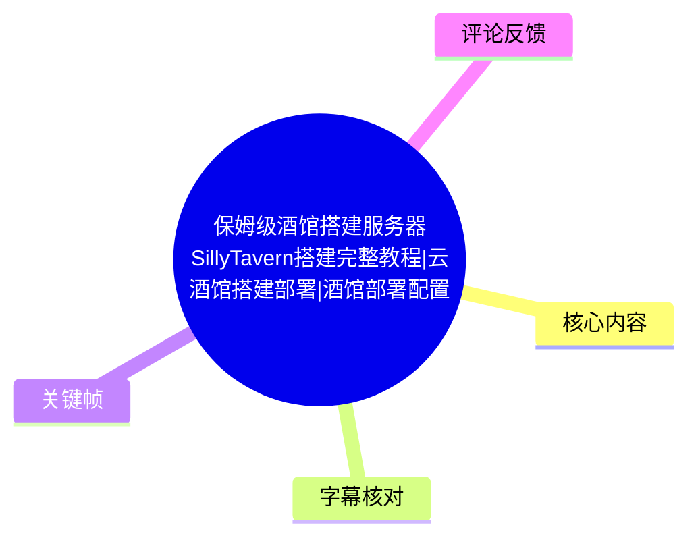
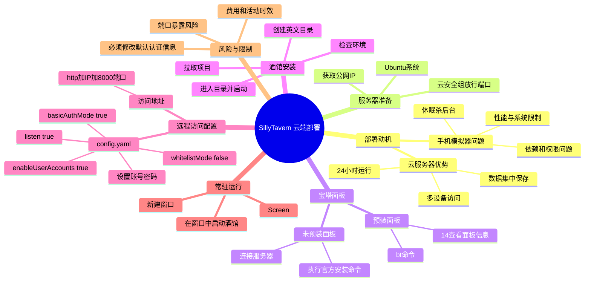
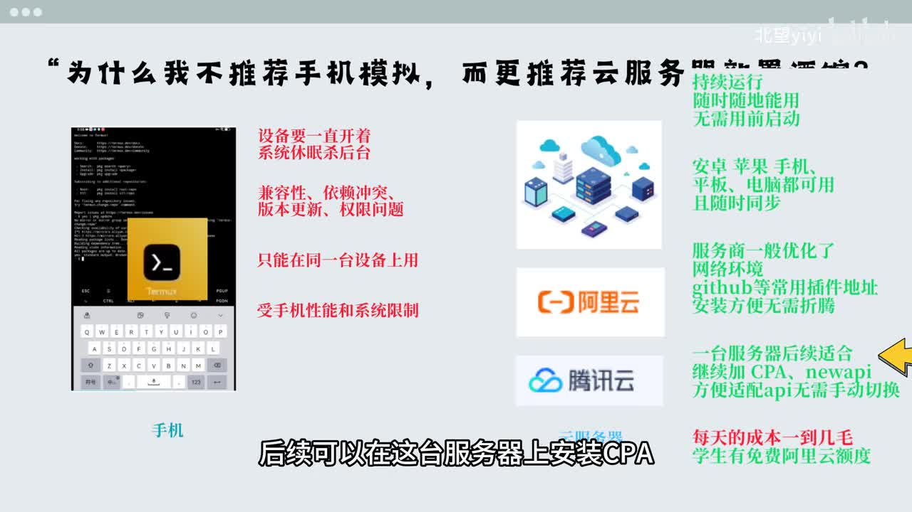
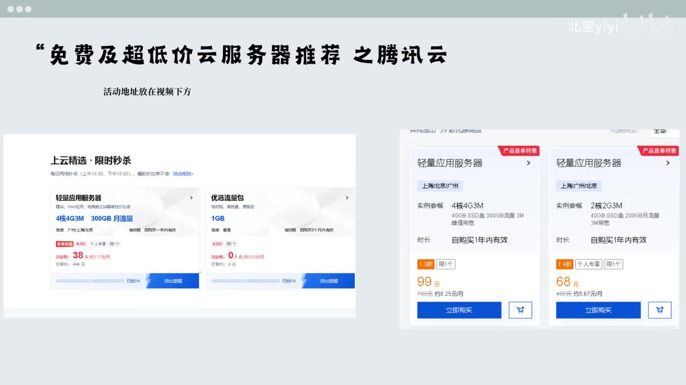
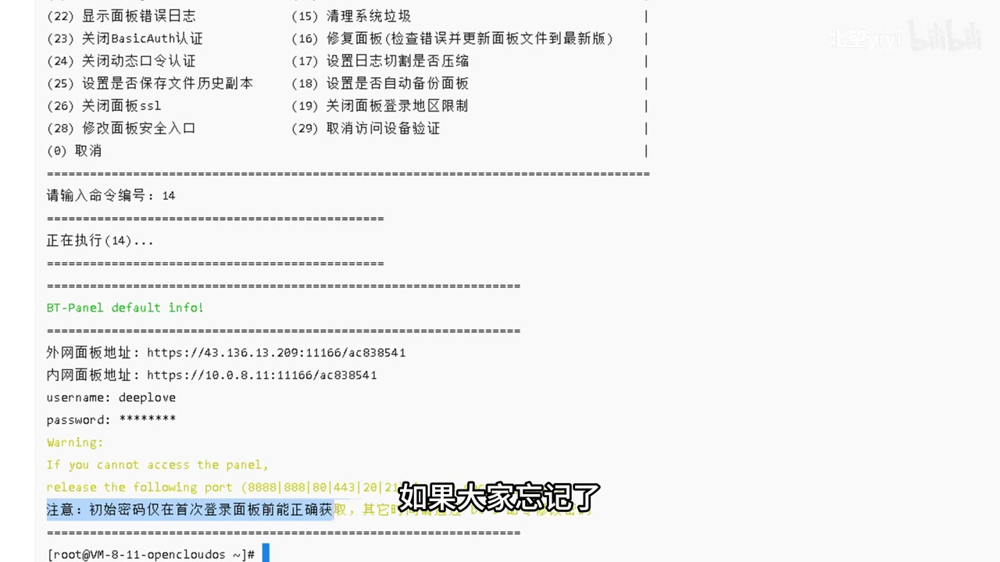

# 保姆级酒馆搭建服务器 SillyTavern 完整教程

> 来源：[Bilibili 视频](https://www.bilibili.com/video/BV141dVBsEuD)  
> UP 主：北望Ai｜时长：15 分 54 秒｜合集：AIcode  
> 主题：将 SillyTavern（“酒馆”）部署至云服务器，并借助宝塔面板、端口放行、配置文件和 Screen 实现远程访问与后台常驻。

## 小结

视频面向服务器新手，提供了一条以**云服务器 + 宝塔面板**为主的 SillyTavern 部署路径。UP 主认为，相比手机模拟器或 Termux 环境，云端部署能避免设备休眠、后台被杀、移动端性能限制、依赖冲突和只能在单设备使用等问题；代价是需要持续承担服务器费用。

实操流程可概括为：购买并获取服务器公网 IP → 安装或进入宝塔面板 → 在云安全组放行宝塔面板端口和酒馆默认端口 `8000` → 在宝塔文件管理器中按文档完成环境检查、拉取项目、进入目录及启动 → 修改 `config.yaml` 以开启监听与账号认证 → 在宝塔侧补充放行 `8000` → 使用 `Screen` 让进程脱离终端继续运行。

远程访问的关键不只是启动程序：视频明确展示了需要将配置中的监听项设为开启，并开启基础认证和用户账号；同时，云厂商安全组和宝塔面板自身端口管理都可能构成拦截点。演示中正是因为宝塔侧未放行 `8000`，导致外网一度无法访问。

视频没有展示具体的宝塔安装命令、SillyTavern 拉取命令、Screen 安装脚本或创建窗口命令的完整文本，而是说明这些命令放在视频下方文档中。因此，本文保留其操作顺序与已明确的配置参数，**不补写或臆造命令**。

价格、学生优惠、免费额度、云厂商活动和链接均属于高度时效信息。视频提到阿里云、腾讯云的若干年度价格和优惠，但这些是发布当时的推广/活动口径，购买前应以云厂商当前控制台、地区、实名与学生认证条件为准。

适合已有一台 Linux 云服务器、但不熟悉 SSH 命令行的新手；若仅在家庭局域网使用，也可参考热评中“本地低功耗设备 + 飞牛”的替代方案，但其部署、安全性与外网访问方案不在视频验证范围内。

## 思维导图





## 目录

- [部署背景、成本与前置条件](#部署背景成本与前置条件)
- [宝塔面板：获取或安装](#宝塔面板获取或安装)
- [安全组与端口放行](#安全组与端口放行)
- [在宝塔中安装 SillyTavern](#在宝塔中安装-sillytavern)
- [修改 config.yaml 开启远程访问](#修改-configyaml-开启远程访问)
- [排查 8000 端口无法访问](#排查-8000-端口无法访问)
- [使用 Screen 实现后台常驻](#使用-screen-实现后台常驻)
- [结论、限制与安全建议](#结论限制与安全建议)
- [字幕比对](#字幕比对)
- [评论分析](#评论分析)
- [处理记录](#处理记录)

## 部署背景、成本与前置条件 [00:00:35](https://www.bilibili.com/video/BV141dVBsEuD?t=35)

UP 主先解释为何不建议以手机模拟器运行酒馆，而推荐云服务器：

| 对比维度 | 手机模拟器 / 移动端环境 | 云服务器部署 |
| --- | --- | --- |
| 运行连续性 | 设备需长期保持开启；系统休眠可能杀死后台 | 服务器可持续运行 |
| 设备访问 | 倾向于局限在当前设备 | Android、iPhone、平板和电脑均可通过网络访问 |
| 性能与兼容性 | 受手机性能、系统和权限限制；可能有依赖冲突、更新问题 | 由服务器承载运行环境 |
| 使用前准备 | 可能需要先启动模拟器或相关环境 | 访问服务地址即可使用 |
| 插件与后续扩展 | 移动端环境可能较麻烦 | 视频称云服务商网络环境对安装 GitHub 插件更便利；同一服务器还可部署其他应用 |
| 成本 | 通常可利用已有设备 | 存在服务器持续成本 |



> 图：画面列出移动端“设备要一直开着、系统休眠杀后台、兼容性与权限问题”等限制，并列出云服务器“持续运行、随时随地使用、多设备同步”的卖点。这是理解视频为什么选择云端方案的核心背景。

### 视频提及的服务器价格与选择 [00:00:37](https://www.bilibili.com/video/BV141dVBsEuD?t=37)

视频中出现的价格、优惠和选择建议如下，均应视为**发布期的活动信息，而非固定报价**：

- UP 主称云服务器日成本约“一到几毛钱”。
- 阿里云方面，视频口述新用户可获得 `300 元` 免费额度；新用户有 `68 元/年` 的服务器选项，非新用户有 `99 元/年` 的选项。
- 学生用户可进行阿里云认证；视频称可每年领取 `300 元` 无门槛抵扣金，并以此购买一年服务器。
- 系统建议选择 Ubuntu；购买页如可选“预装宝塔面板”，可直接勾选。
- 腾讯云方面，视频展示新用户限时秒杀 `38 元/年` 的轻量应用服务器，以及 `68 元/年` 的轻量应用服务器选项，认为足以运行酒馆及其他基础应用。



> 图：画面展示腾讯云轻量应用服务器的活动页与价格卡片，是视频报价来源的画面证据；活动价、地域、实例规格和资格均可能改变，不能据此直接作为当前购买价格。

### 开始前需记录的信息 [00:02:14](https://www.bilibili.com/video/BV141dVBsEuD?t=134)

购买实例后，视频要求先在云厂商控制台找到并保存：

1. **公网 IP**：后续连接服务器、访问宝塔面板和访问酒馆均要使用。
2. **服务器登录账号与密码**：新手可优先采用账号密码登录；忘记默认密码时，按云厂商控制台提供的重置密码流程处理。
3. **服务器操作系统和面板状态**：确认 Ubuntu 是否已安装，是否已勾选预装宝塔面板。
4. **安全组规则配置入口**：后续需要放行宝塔面板端口及 `8000`。

> 视频将服务器比作一台 24 小时不间断运行的电脑。该比喻有助于理解常驻与外网访问，但服务器仍受安全组、系统防火墙、服务进程状态和网络策略共同约束。

## 宝塔面板：获取或安装 [00:02:36](https://www.bilibili.com/video/BV141dVBsEuD?t=156)

宝塔面板在本视频中的定位是降低新手使用门槛：通过网页文件管理和内置终端替代大量直接 SSH 命令行操作。视频分成两种情况。

### 情况一：购买系统时已预装宝塔 [00:03:00](https://www.bilibili.com/video/BV141dVBsEuD?t=180)

在腾讯云控制台的演示里，操作为：

1. 点击登录，并选择凭据验证方式进入服务器。  
   [00:03:25](https://www.bilibili.com/video/BV141dVBsEuD?t=205)
2. 在服务器终端输入 `bt` 并回车。  
   [00:03:36](https://www.bilibili.com/video/BV141dVBsEuD?t=216)
3. 在宝塔命令行菜单中输入数字 `14`，查看面板信息。  
   [00:03:47](https://www.bilibili.com/video/BV141dVBsEuD?t=227)
4. 保存输出的外网面板地址、账号和密码。视频强调初始密码通常只有首次展示时可直接看到；如遗忘，则重新运行 `bt`，选择数字 `5` 修改密码。  
   [00:04:14](https://www.bilibili.com/video/BV141dVBsEuD?t=254)



> 图：终端画面显示执行菜单项 `14` 后的“BT-Panel default info”，其中含外网面板地址、内网地址、用户名及密码字段。该帧证明视频所说的“通过 `bt` 菜单查看面板信息”是具体演示步骤；图中的地址、端口和账户仅为演示信息，不应照抄到自己的服务器。

### 情况二：服务器未预装宝塔 [00:05:42](https://www.bilibili.com/video/BV141dVBsEuD?t=342)

若未安装面板，视频给出的流程是：

1. 连接到自己的服务器。
2. 从宝塔官网或视频下方命令文档复制宝塔通用安装命令。
3. 粘贴并执行安装命令。
4. 出现确认提示后输入 `Y` 并回车，等待安装结束。  
   [00:06:41](https://www.bilibili.com/video/BV141dVBsEuD?t=401)
5. 成功后保存输出的面板地址、账号和密码。  
   [00:07:08](https://www.bilibili.com/video/BV141dVBsEuD?t=428)

视频还提到可选用 Xshell 8 一类终端工具：新建会话，主机填写服务器地址，认证用户名通常为 `root`，输入自己的密码后连接。  
[00:06:06](https://www.bilibili.com/video/BV141dVBsEuD?t=366)

> **素材边界**：视频未在提供的字幕中给出宝塔安装命令全文，不能从“通用安装命令”的描述推导出具体命令。应以宝塔官方当前文档及自身系统版本为准。

## 安全组与端口放行 [00:04:34](https://www.bilibili.com/video/BV141dVBsEuD?t=274)

拿到宝塔外网面板地址后，视频要求在云厂商安全组/防火墙中放行对应端口：

1. 面板端口不是所有人都相同，应以自己的宝塔面板地址中的端口为准。
2. 视频口述中把示例端口识别成 `11116`，但关键帧中的外网地址显示为 `11166`；因此应以自己的面板实际输出为唯一依据。
3. 酒馆服务使用的端口是 `8000`。
4. 在云厂商防火墙或安全组中添加规则：来源选择全部 IPv4 地址，分别放行宝塔面板实际端口与 `8000`。  
   [00:04:58](https://www.bilibili.com/video/BV141dVBsEuD?t=298)

完成后，在浏览器打开宝塔外网面板地址并登录；视频将其视为宝塔安装成功的验证。  
[00:05:30](https://www.bilibili.com/video/BV141dVBsEuD?t=330)

> **安全提醒**：视频演示“来源选择全部 IPv4 地址”方便新手操作，但这会扩大管理面暴露范围。尤其是宝塔面板属于高权限入口，实际使用时应优先按自身固定公网 IP、VPN 或其他访问控制条件收缩来源范围，并使用强密码。

## 在宝塔中安装 SillyTavern [00:07:34](https://www.bilibili.com/video/BV141dVBsEuD?t=454)

登录宝塔面板后，视频演示通过“文件 + 终端”完成程序安装。

### 文件夹与终端操作 [00:07:42](https://www.bilibili.com/video/BV141dVBsEuD?t=462)

1. 登录后可自行绑定宝塔账号；视频建议“推荐安装”先关闭，需要时再安装。
2. 进入“文件”，新建文件夹。  
3. 文件夹名称使用英文字母。  
   [00:07:58](https://www.bilibili.com/video/BV141dVBsEuD?t=478)
4. 进入该文件夹，点击“终端”打开命令行。  
   [00:08:05](https://www.bilibili.com/video/BV141dVBsEuD?t=485)

### 命令执行顺序 [00:08:08](https://www.bilibili.com/video/BV141dVBsEuD?t=488)

视频要求按照其文档依次输入四类命令：

| 顺序 | 视频描述 | 验证或后续动作 |
| --- | --- | --- |
| 1 | 检查环境 | 若看到两个相关依赖均已安装，即可继续 |
| 2 | 安装环境/等待自动安装完成，并拉取酒馆 | 等待过程结束 |
| 3 | 进入酒馆目录 | 切换至项目目录 |
| 4 | 启动酒馆 | 初次启动成功后仍需修改配置 |

视频在 [00:09:07](https://www.bilibili.com/video/BV141dVBsEuD?t=547) 明确指出：此时程序虽已运行成功，但远程仍不能访问，必须进一步修改设置。

> **重要限制**：ASR 仅保留“检查环境、拉取酒馆、进入目录、启动酒馆”等操作语义，没有识别出可靠完整的命令文本；且没有站内字幕可交叉验证。故本文不提供可能错误的 `git`、`node`、`npm` 或启动命令。执行时应使用视频作者提供文档，或查阅 SillyTavern 官方仓库与当前版本安装说明。

## 修改 config.yaml 开启远程访问 [00:09:22](https://www.bilibili.com/video/BV141dVBsEuD?t=562)

初次启动后，视频要求关闭终端、刷新文件列表、进入酒馆目录，找到并编辑 `config.yaml`：

1. 关闭终端并右键刷新。  
   [00:09:18](https://www.bilibili.com/video/BV141dVBsEuD?t=558)
2. 进入项目文件夹，找到 `config.yaml`，点击编辑。  
   [00:09:27](https://www.bilibili.com/video/BV141dVBsEuD?t=567)
3. 按视频设置远程访问与认证相关配置。
4. 保存文件，重新打开终端并再次执行启动命令。  
   [00:11:27](https://www.bilibili.com/video/BV141dVBsEuD?t=687)

### 视频明确的配置项

ASR 中部分英文配置名存在音近识别错误；结合 SillyTavern 常见配置命名和语义，可整理为下表。应以当前 `config.yaml` 中实际出现的字段为准，避免向不存在的字段写入配置。

| 视频口述/画面语义 | 目标值 | 作用 |
| --- | ---: | --- |
| `listen` | `true` | 开启监听，使服务可接受远程访问 |
| `whitelistMode`（ASR 误作 “Write this mode”） | `false` | 关闭白名单模式 |
| `basicAuthMode`（ASR 误作 “Basic author mode”） | `true` | 开启基础认证 |
| 基础认证账号 | 自定义 | 不使用默认账号 |
| 基础认证密码 | 自定义 | 不使用默认密码 |
| `enableUserAccounts` | `true` | 开启用户账号功能 |

视频强调：一旦开启远程访问，必须自己设置账号和密码，**不要使用默认值**。账号与密码修改位置分别在 [00:10:28](https://www.bilibili.com/video/BV141dVBsEuD?t=628) 和 [00:10:38](https://www.bilibili.com/video/BV141dVBsEuD?t=638) 展示。

配置保存、重新启动后，视频以终端出现监听地址 `0.0.0.0` 作为远程监听成功的判断信号。  
[00:11:59](https://www.bilibili.com/video/BV141dVBsEuD?t=719)

> `0.0.0.0` 在此表示服务监听所有网络接口；它解决“服务只绑定本机”的问题，但也意味着网络暴露面扩大。因此账号认证、端口策略及面板账户保护不可省略。

## 排查 8000 端口无法访问 [00:12:10](https://www.bilibili.com/video/BV141dVBsEuD?t=730)

视频给出的访问形式是：

```text
http://<服务器公网IP>:8000
```

即输入公网 IP、英文冒号和端口 `8000`。视频特别指出默认使用的是 `http`，将 `https` 中的 `s` 去掉。  
[00:12:26](https://www.bilibili.com/video/BV141dVBsEuD?t=746)

### 演示中的故障与修复 [00:12:41](https://www.bilibili.com/video/BV141dVBsEuD?t=761)

视频故意或实际展示了一个“安全组已放行但仍打不开”的场景，排查结果为：

1. 先检查云服务器侧端口是否已放开；此前已经处理过安全组。
2. 关闭终端后，查看宝塔面板里的端口管理。
3. 发现宝塔侧的 `8000` 还没有放行。
4. 在宝塔端口管理中添加 `8000`。  
   [00:13:00](https://www.bilibili.com/video/BV141dVBsEuD?t=780)
5. 重新访问，视频在 [00:14:01](https://www.bilibili.com/video/BV141dVBsEuD?t=841) 确认页面可打开。

这个案例说明，外网访问失败至少应分层检查：

- 服务是否正在运行；
- 配置是否已监听 `0.0.0.0`；
- URL 是否为 `http://公网IP:8000`；
- 云厂商安全组是否允许入站 `8000`；
- 宝塔面板的端口/防火墙规则是否允许 `8000`。

## 使用 Screen 实现后台常驻 [00:14:10](https://www.bilibili.com/video/BV141dVBsEuD?t=850)

即便网页已经可以打开，视频指出还有一个运行维护问题：若直接在终端启动酒馆，关闭终端后酒馆进程也会退出。

解决方案是使用 **Screen**：

1. 复制视频文档提供的 Screen 安装脚本。  
   [00:14:31](https://www.bilibili.com/video/BV141dVBsEuD?t=871)
2. 复制创建 Screen 窗口的命令。  
   [00:14:42](https://www.bilibili.com/video/BV141dVBsEuD?t=882)
3. 在新建的 Screen 窗口内重新启动酒馆。  
   [00:14:50](https://www.bilibili.com/video/BV141dVBsEuD?t=890)
4. 关闭当前终端后，再测试酒馆是否仍可访问；视频确认仍能访问。  
   [00:15:16](https://www.bilibili.com/video/BV141dVBsEuD?t=916)

> Screen 的意义是让服务进程与当前终端会话分离，而非自动解决崩溃重启、系统重启后自启、日志轮转或版本更新问题。视频只验证了“关闭终端后服务继续可访问”，未展示开机自启、故障自动恢复或进程监控配置。

## 结论、限制与安全建议 [00:15:22](https://www.bilibili.com/video/BV141dVBsEuD?t=922)

视频完成的最终状态是：用户可在任何联网设备中，以服务器 IP 和端口访问酒馆；数据保存在自己的服务器上，并可通过配置创建多个账号共同使用。

### 可迁移的部署经验

- **先验证最小可运行状态，再开放远程访问**：先启动服务，再改监听配置、认证设置和网络规则。
- **网络连通性要双层检查**：云厂商安全组和服务器/宝塔内的防火墙规则都可能阻断端口。
- **运行状态与访问状态是两个问题**：能打开网页不等于关闭终端后仍可运行；常驻方案是另一个步骤。
- **面板与应用都需要独立保护**：宝塔管理账户、SillyTavern 认证账户及服务器登录密码不能复用弱密码或默认密码。
- **配置以实际版本为准**：视频使用的 `config.yaml` 字段和当前 SillyTavern 版本可能不同，升级或重新部署前应先备份配置与数据。

### 视频未覆盖或未充分验证的内容

| 项目 | 素材中的情况 |
| --- | --- |
| 完整安装命令 | 未在字幕素材中提供；视频称放在下方文档 |
| 服务器具体规格 | 仅展示云厂商商品卡片，没有形成完整、稳定的最低配置表 |
| HTTPS、域名与反向代理 | 未讲解；视频访问方式为 `http://IP:8000` |
| SSH 密钥、安全组最小权限 | 未讲解；视频主要使用账号密码与“全部 IPv4”规则演示 |
| 自动重启与开机自启 | 未讲解；Screen 只解决关闭终端后的持续运行 |
| 多用户隔离、备份与升级策略 | 仅提到可创建多个账号，未展示权限、备份和更新流程 |
| API、模型服务配置 | 本视频重点为酒馆服务器部署，并未讲具体 API 配置 |

### 时效性说明

视频中阿里云/腾讯云的 `38 元`、`68 元`、`99 元` 年度价格、阿里云 `300 元` 免费额度、学生抵扣金以及推广链接，都可能随地区、活动、新老用户资格和平台政策变化。元数据所示发布时间为 2026 年 4 月，整理时间为 2026 年 7 月；购买前必须以当日活动页面和服务条款为准。

## 字幕比对

| 字幕来源 | 完整性 | 专有名词 | 时间轴 | 主要问题 |
| --- | --- | --- | --- | --- |
| Bilibili 站内字幕 | 未提供可用站内字幕，无法核对 | 无法评价 | 无法评价 | 本次素材明确标注“未提供可用站内字幕” |
| 本次 ASR 字幕 | 覆盖 35.44 秒至 953.33 秒；语音覆盖约 57.01%，有 16 个较大静音/操作间隔 | 存在多处误识别，但可由上下文与关键帧校正 | 有真实 SRT 起止时间，可用于时间轴 | “宝塔/酒馆/服务器”等频繁出现错字；英文配置名和端口号识别不稳定；命令文本未保留 |

### 最终字幕选择与校正

本视频没有可用站内字幕，因此正文采用**本次 ASR 的真实时间戳**作为时间轴基础，并以关键帧和上下文校正术语。ASR 诊断未标记 `noAudioStream=true`：源视频具有音轨，本次 ASR 语言判定为中文，置信度为 `0.99853515625`。

主要校正如下：

- `宝卡 / 宝台 / 宝堂`：统一按上下文修正为“宝塔”。
- `酒管 / 酒馘 / 酒馄`：统一为 “SillyTavern（酒馆）”。
- `X-HELP8`：按常见软件名称及视频语境写作 “Xshell 8”；视频仅作为可选连接工具提及。
- `Bubens`：修正为 Ubuntu。
- `11116`：ASR 如此识别，但关键帧显示示例面板端口为 `11166`；两者都不应作为固定值，实际应从个人宝塔面板地址读取。
- `Write this mode`：按配置语境整理为 `whitelistMode`。
- `Basic author mode`：按配置语境整理为 `basicAuthMode`。
- `Enable user accounts`：整理为 `enableUserAccounts`。

ASR 中若干大时间间隔主要对应演示操作、等待安装或等待页面加载；本文未把这些静音时段补写为未经素材证实的操作。

## 评论分析

以下仅分析可获取的热评前三条，不将评论内容视为已验证事实。

### 1. 本地低功耗设备替代云服务器

- **评论者**：久夜夜夜  
- **点赞**：14  
- **核心观点**：若主要在家使用，购买低价二手设备并刷入飞牛系统可能优于长期租云服务器；举例称 `J1900 + 4G 内存 + 双盘位` 即可，并建议通过飞牛自带 FN、反向代理或 IPv6 处理外网访问。
- **补充价值**：提供了视频之外的“本地自托管”路径，尤其适合不希望长期承担云服务器租金、且有家庭网络与硬件维护意愿的人。
- **限制与风险**：评论中的硬件规格、飞牛、FN、IPv6、反向代理可行性依赖实际负载、家庭宽带公网能力、运营商策略与安全配置；视频未验证该方案，也未比较其稳定性与维护成本。

### 2. UP 主提供代部署并建议海外服务器

- **评论者**：北望Ai  
- **点赞**：6  
- **核心观点**：称可协助自备服务器的粉丝部署，并链接服务器选购视频；若后续要玩 AI，建议使用腾讯云海外服务器，理由是方便折腾模型。
- **补充价值**：说明 UP 主将本视频定位为其服务器入门内容的一部分，并延伸到 AI 模型部署场景。
- **可信度与边界**：这是作者提供的服务与推荐，可能带有推广属性；“海外服务器更方便”的具体原因、合规性、网络表现、价格和模型服务可用性均未在本视频中展开证明。

### 3. 再次推荐腾讯云国际

- **评论者**：北望Ai  
- **点赞**：4  
- **核心观点**：再次表示可协助自备服务器部署，并建议使用腾讯云国际以便后续折腾模型。
- **补充价值**：与上一条形成一致的作者建议：预期未来运行 AI 相关服务时，服务器地区选择可能影响后续操作便利性。
- **限制与风险**：该观点是作者建议而非普适结论。跨境服务的账号资质、费用、地域网络、数据合规、访问稳定性和服务条款均需用户自行确认。

## 处理记录

- **Worker ID**：worker-mrj0www4-e8d79408
- **模型**：gpt-5.6-terra
- **使用素材与工具结果**：使用任务提供的视频元数据、关键帧路径、ASR 诊断、带时间戳 SRT、热评数据进行整理；ASR 模型为 `medium`，运行设备为 CUDA，计算类型为 float16。
- **字幕选择**：站内字幕未提供可用版本；已检查本次 ASR，确认存在音轨且 ASR 带真实分段时间。正文以 ASR SRT 时间轴为主，并结合画面与上下文修正明显术语误识别。
- **关键帧选择依据**：
  - `frames/frame-001.jpg`：展示手机模拟与云服务器的优缺点对比，用于说明部署动机；
  - `frames/frame-002.jpg`：展示腾讯云轻量服务器价格页，用于标记活动价格的时效性；
  - `frames/frame-004.jpg`：展示 `bt` 菜单项 `14` 输出面板地址、账号和密码，用于支撑宝塔信息获取步骤。
- **关键帧使用限制**：仅将关键帧作为画面内容佐证，不从模糊画面推导完整命令、密码或固定端口；敏感信息不复述为可使用凭据。
- **缓存清理**：提供的素材清单未包含缓存清理工具调用或清理日志；本次仅基于已提供的产物整理，未能确认或宣称执行了缓存清理。
- **未解决问题**：
  1. 视频下方命令文档内容未随素材提供，无法核验完整安装与 Screen 命令；
  2. 无站内字幕，英文配置字段只能依据 ASR、画面语境及常见命名校正；
  3. 云服务价格、额度、活动与地区建议具有时效性，未做实时网页验证。
