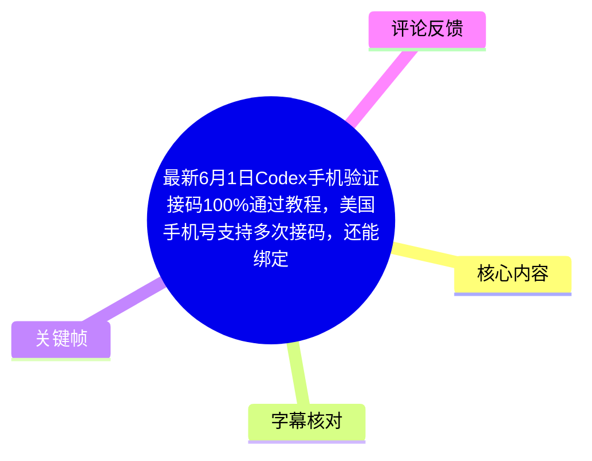
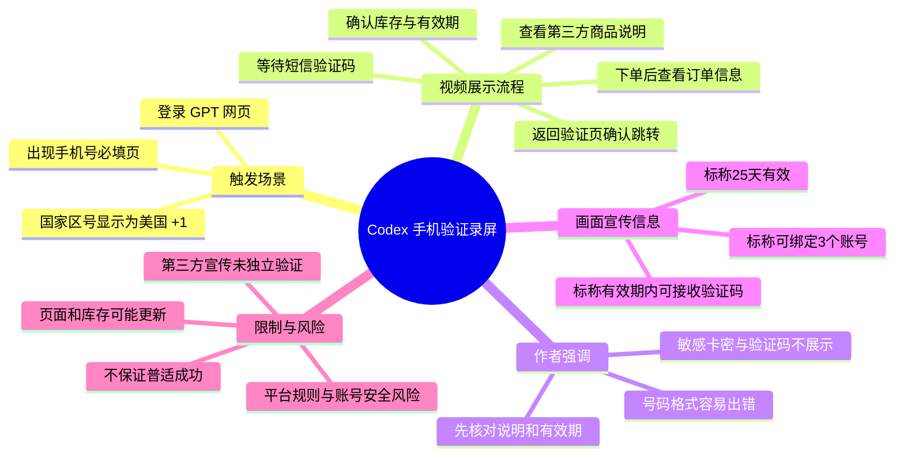
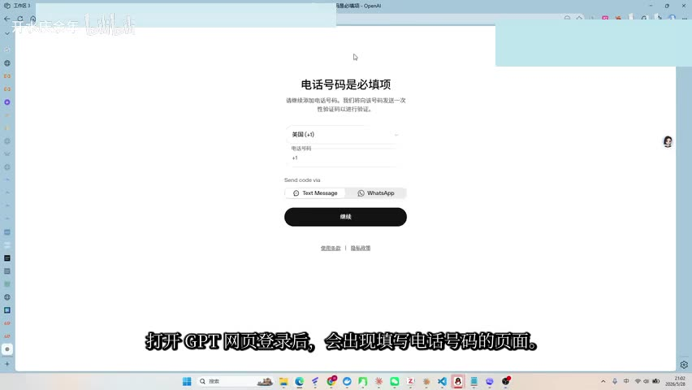
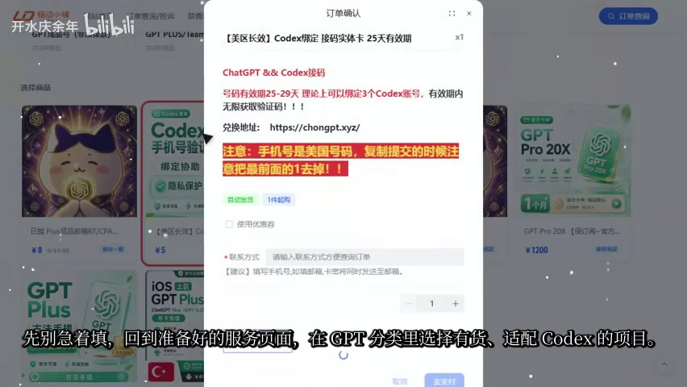
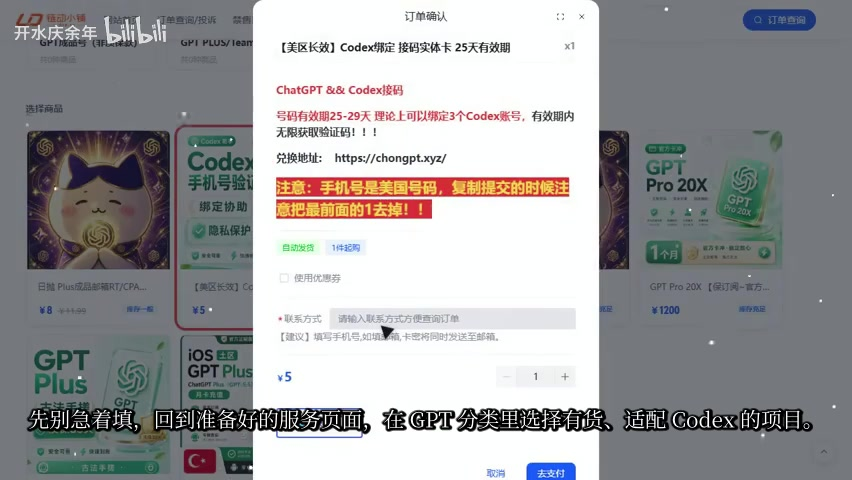

# 最新6月1日Codex手机验证接码100%通过教程，美国手机号支持多次接码，还能绑定3个Codex gptplus账号

> 来源：[Bilibili 视频](https://www.bilibili.com/video/BV1kYV964EzL)  
> UP 主：开水庆余年｜视频时长：1 分 20 秒｜分区/合集：AIcode  
> 视频描述说明：内容为公开页面流程演示，敏感卡密与完整验证码已遮挡；页面、库存、有效期与平台规则均可能变化。

## 小结

本视频演示的是：当 Codex／GPT 登录流程出现手机号验证页面时，如何从第三方服务页面选择一项标称适配 Codex 的号码服务、查看订单中的号码信息、接收短信验证码，并在验证页面看到账号信息与额度页面跳转。视频的叙述重点是“从验证页到验证通过”的顺序，而非 Codex 功能本身。

视频给出的核心经验有三项：第一，在填写手机号之前先核对待选服务的商品说明、库存和有效期；第二，号码格式是作者强调的易错点，视频称订单页号码可能带有 `1` 前缀，回填时需留意验证页的国家区号输入方式；第三，验证码应在订单页收到后再复制回验证页提交。

画面中的订单确认弹窗含有“25 天有效”“可绑定 3 个 Codex 账号”“有效期内可接收验证码”等宣传性文字，视频标题亦称“100%通过”“美国手机号支持多次接码”。这些均属于发布者或第三方商品页面的单方声明，视频未提供可独立复核的服务条款、长期稳定性证据或 OpenAI 官方认可说明，不能视为保证。

该内容具有强时效性：视频元数据发布时间为 2026 年 6 月 1 日，UP 主在评论中又称 6 月 7 日“已大量补货”。库存、价格、号码质量、地区可用性、短信送达情况，以及 Codex/OpenAI 的验证规则都可能随时改变。

使用第三方号码服务可能涉及隐私、账号归属、后续二次验证、号码回收和平台规则风险。视频仅展示一次录屏结果，未证明该方法适用于所有账号、所有地区或所有时间。遇到验证问题，应优先使用 OpenAI 支持的正式验证途径，并核对服务条款与账户安全要求。

## 思维导图

## 目录

- [背景、目标与时效性](#背景目标与时效性)
- [验证页面与演示起点](#验证页面与演示起点)
- [第三方服务商品页面中的信息](#第三方服务商品页面中的信息)
- [视频中的流程与易错点](#视频中的流程与易错点)
- [成功判定、信息遮挡与限制](#成功判定信息遮挡与限制)
- [可迁移经验与风险边界](#可迁移经验与风险边界)
- [字幕比对](#字幕比对)
- [评论分析](#评论分析)
- [处理记录](#处理记录)

## 背景、目标与时效性

### 验证触发场景与视频目标（[00:00](https://www.bilibili.com/video/BV1kYV964EzL?t=0)）

ASR 在 00:00–00:07.880 表示，作者将演示 Codex“需要手机验证时”，从页面出现到验证通过的完整流程。该表述限定了视频所解决的问题：不是注册、订阅或使用 Codex 的完整教程，而是面向已进入手机号验证环节的用户。

视频没有展示以下前置条件，因此不能从素材中推断：

- 触发验证的具体账号状态、地区、网络环境或风控原因；
- 号码服务与 OpenAI/Codex 之间是否存在官方合作或兼容承诺；
- 多个账号绑定的具体定义、次数限制、后续验证表现；
- 号码失效、回收或无法收到短信时的退款与申诉机制。

视频标题中的“最新 6 月 1 日”对应其发布时间附近的信息状态；但元数据抓取时间为 2026 年 7 月 17 日，且评论区补货信息为 6 月 7 日。应将其理解为某一时点的录屏与库存宣传，不应延伸为持续有效的规则结论。

## 验证页面与演示起点

### 登录后出现“电话号码是必填项”（[00:08](https://www.bilibili.com/video/BV1kYV964EzL?t=8)）

00:08.080–00:13.100，作者称登录 GPT 网页后会出现填写电话号码的页面。关键帧可见页面标题为“电话号码是必填项”，页面包含国家/地区选择、电话号码输入区域、短信发送方式选项以及“继续”按钮；画面中地区显示为“美国（+1）”。

> 图：该帧直接呈现视频的起点——手机号验证界面，以及国家区号与号码输入区分开的交互结构。它有助于理解作者后续反复提到的“号码格式”问题，但不构成任何号码服务的官方兼容性证明。

视频没有说明该页面是否对所有 Codex 用户都会出现，也没有给出 OpenAI 对可接受号码类型的官方规则。页面显示短信与 WhatsApp 选项，但作者实际演示的重点是短信接收。

## 第三方服务商品页面中的信息

### 选择商品前核对说明、库存与有效期（[00:13](https://www.bilibili.com/video/BV1kYV964EzL?t=13)）

00:13.240–00:24.940，作者称不要立刻填写号码，而是返回准备好的服务页面，在“GPT”相关分类中选择“有货、适配 Codex”的项目，确认说明和有效期后进入订单页。

关键帧中的订单确认窗口展示了若干第三方页面的**宣传文字**，包括：

| 画面字段/主张 | 画面可见内容 | 应如何理解 |
| --- | --- | --- |
| 商品名称 | “美区长效 Codex绑定 接码实体卡 25天有效” | 为第三方商品标题，不等同于平台官方规则。 |
| 账号数量 | “号码有效期25-29天 理论上可以绑定3个Codex账号” | “理论上”表明其本身带有条件性；视频未验证三次绑定。 |
| 短信能力 | “有效期内无限获取验证码” | 为商品页宣传，未展示完整服务条款或实际次数记录。 |
| 价格 | 画面下方显示“¥5” | 仅反映录制时的页面价格，不应视为现行报价。 |
| 下单信息 | 窗口包含联系方式、数量和支付按钮 | 录屏展示了下单界面，但关键个人/订单信息应保持遮挡。 |

> 图：该帧是视频中“核对商品说明与有效期”这一环节的主要视觉证据。其价值在于保留作者所依据的商品宣传条件；同时也说明这些条件来自第三方页面，具有库存、价格和条款变动风险。

视频描述也提示观众在下单和验证前自行核对商品说明、有效期、地区限制、平台规则与账号安全。该提示与视频后段“实际页面可能更新”的说法一致。

## 视频中的流程与易错点

### 视频叙述的操作顺序（[00:24](https://www.bilibili.com/video/BV1kYV964EzL?t=24)）

00:24.940–00:28.980，作者称购买后，订单中会显示卡密和对应号码。00:40.460–00:45.800，作者继续称提交后返回订单页等待短信，收到验证码后再复制至 Codex 页面。

结合 00:13–00:45 的 ASR，视频展示的顺序可整理为：

1. 在 Codex/GPT 的手机号验证页确认需要的国家/地区与验证方式。
2. 回到第三方服务页面，选择作者称为“有货且适配 Codex”的项目。
3. 在订单确认阶段查看商品说明、有效期等条件。
4. 完成购买后，在订单中查看对应号码及订单信息。
5. 根据验证页的国家区号与输入框规则检查号码格式。
6. 提交号码后，在订单页等待短信验证码。
7. 收到验证码后返回验证页完成验证，并观察是否跳转至账户信息与额度页面。

其中第 4–6 步涉及第三方号码与验证码。为避免将录屏整理成规避平台验证的可执行指引，本文不复述卡密兑换、号码获取或验证码提交的具体操作细节；应以平台允许的身份验证方式为准。

### 作者强调的格式问题（[00:29](https://www.bilibili.com/video/BV1kYV964EzL?t=29)）

00:29.180–00:40.260，作者指出号码格式“最容易出错”：订单侧展示的号码可能带有 `1` 前缀，而 Codex 页面已经显示美国国家区号 `+1`。其表达的本质是：**国家区号字段与本地号码字段可能分离，重复填写国家代码可能导致格式不匹配。**

这是一条界面输入逻辑层面的提醒，不代表所有地区、所有号码或所有版本页面都使用相同格式。实际填写应以当前页面的占位提示、国家区号选择和官方说明为准；不要仅因视频中的一次展示而假定固定格式。

> 图：该帧保留了订单页对号码格式的醒目提示，同时可见“自动发货”“1件起购”等页面元素。它解释了作者为何在配音中将格式识别列为主要易错点；但页面文字属于第三方商家的说明，不能替代验证页面自身的格式要求。

## 成功判定、信息遮挡与限制

### 账户信息与额度页面跳转（[00:46](https://www.bilibili.com/video/BV1kYV964EzL?t=46)）

00:46.340–00:52.760，作者称点击“继续”后，若页面跳转到“账户信息和额度”，即可认为本次验证流程跑通。这个判断只描述录屏中一次流程的页面结果。

它不能证明：

- 账号未来不会再次被要求验证；
- 号码在有效期后仍可用于恢复账号或处理安全验证；
- 所有账户都能获得相同页面、额度或权限；
- 账号使用行为符合 OpenAI、Codex 或相关服务的现行规则。

### 公开视频范围与信息保护（[00:52](https://www.bilibili.com/video/BV1kYV964EzL?t=52)）

00:52.760–00:59.720，作者明确称视频只演示公开页面的操作顺序，不展示个人卡密和完整验证码。该处理降低了录屏中敏感凭据泄露的风险，也意味着外部无法据此复核订单信息、号码归属、短信内容和完整验证过程。

00:59.980–01:05.220，作者再次提醒实际页面可能更新，操作前需核对说明、库存和有效期。这是视频中最明确的时效性限制。

### 末尾复盘（[01:05](https://www.bilibili.com/video/BV1kYV964EzL?t=65)）

01:05.220–01:17.400，作者将流程压缩复盘为：先查看验证页需要的号码条件，再选有货项目；检查号码格式；收到验证码后回填；确认跳转成功。

复盘强化了三个判断节点：

| 判断节点 | 视频中的检查重点 | 不能据此推导的结论 |
| --- | --- | --- |
| 验证页 | 需要哪类国家/地区号码、页面如何输入 | 不等于第三方号码一定被平台接受。 |
| 商品页 | 是否有货、是否标称适配、有效期多长 | 不等于库存真实、长期可用或符合平台规则。 |
| 结果页 | 是否跳转到账户信息与额度 | 不等于账号永久安全、可免除后续验证。 |

## 可迁移经验与风险边界

### 适用于任何账号验证流程的经验（[00:59](https://www.bilibili.com/video/BV1kYV964EzL?t=59)）

从视频中可迁移、且不依赖第三方服务的经验包括：

- **先读当前验证页。** 国家区号、号码输入格式、可选验证方式和错误提示，应以当前页面为准。
- **区分宣传与证据。** “100%通过”“多次接码”“绑定 3 个账号”“无限获取验证码”等是标题或商品页主张，不是视频独立证明的事实。
- **记录时点。** 本视频时长仅 80 秒，所见价格、库存和页面配置均是录屏时刻的快照。
- **保护凭据。** 不公开完整验证码、卡密、订单号、手机号或账户资料；这些信息可能被用于接管账号或实施诈骗。
- **预留恢复路径。** 账号验证不应只考虑首次通过，还应考虑后续登录、二次验证、号码失效和申诉时是否能提供可持续的证明材料。

风险边界则包括：第三方号码可能被回收或多人使用，短信可能延迟或无法送达；号码服务商也可能记录订单和联系信息；使用不符合服务条款的验证方式可能造成账号受限。素材没有提供这些风险的处置方案，因此不能据此得出安全或合规结论。

## 字幕比对

| 字幕来源 | 完整性 | 专有名词 | 时间轴 | 主要问题 |
| --- | --- | --- | --- | --- |
| Bilibili 站内字幕 | 未提供可用字幕，无法比较文本完整性 | 无可用内容 | 无可用时间轴 | 素材明确标注“未提供可用站内字幕”。 |
| 本次 ASR 字幕 | 较完整：11 段，语音覆盖约 75.7 秒/79.98 秒（94.65%） | `Codex`、`GPT`、`OpenAI`语境基本可辨，但有识别误差 | 可用：SRT 含 00:00:00–00:01:17.400 的真实分段时间 | 繁简混用；“GPTP”“有獲”“號碴/号碴”等存在转写或乱码错误。 |

最终采用本次 ASR 的时间轴作为章节定位依据，原因是站内字幕不可用，且 ASR 诊断显示音频存在、无大间隔、未标记 `noAudioStream=true`。因此，本视频并非“无音轨”情形。

结合关键帧和上下文，对重要词语作如下校正性理解：

- ASR 的“GPTP 分类”应理解为 GPT 相关分类；关键帧左侧可见“GPT PLUS/…”分类文字，但完整分类名称受画面清晰度限制，故不扩展为未见内容。
- ASR 的“有獲项目”按上下文校正为“有货项目”。
- ASR 的“号碴/號碼格式”按上下文校正为“号码/号码格式”。
- “CodeX”“Codex”统一记为产品名 **Codex**。
- “帐户信息和额度”保留为作者配音中的成功判断描述，未对其具体页面字段作超出素材的推断。

## 评论分析

仅获取到 2 条热评，少于“前三条”的上限；未获取到第 3 条评论，因此不补写或推测。

1. **黑夜缓风（5 赞）**：评论称该服务“秒接码”，号码“28 天有效”，并认为可防止二次验证，价格“无敌”。这提供了用户体验层面的正面反馈，但属于单个评论者陈述；其中“防二次验证”缺乏定义与证据，且与视频画面“25 天有效”、商品说明“25–29 天”的表述并不完全一致，不能据此确认稳定性。
2. **开水庆余年（3 赞）**：UP 主称“6 月 7 日已大量补货”，并再次给出店铺地址。这是发布者对库存状态的补充，能够说明其在该日进行过补货宣传；但库存是高时效信息，无法证明当前仍有货，也不构成服务质量保证。

评论区未出现可验证的反例、账号受限反馈或平台政策讨论，因此无法从现有热评评估该流程的整体成功率与合规性。

## 处理记录

- Worker ID：`worker-mrj0www4-e8d79408`
- 模型：`gpt-5.6-terra`
- ASR 模型与运行参数：`medium`｜语言识别为 `zh`（置信度 `0.994140625`）｜`CUDA`｜`float16`
- 使用素材与工具结果：视频元数据、关键帧 `frames/`、本次 ASR SRT/分段诊断、热评抓取结果；结合关键帧进行多模态画面核对。
- 字幕选择：站内字幕不可用；检查并采用本次 ASR 的真实 SRT 分段时间轴。ASR 音频覆盖率为 94.65%，未见 `noAudioStream=true` 标记。
- 关键帧选择依据：`frame-002.jpg` 用于确认手机号必填页、美国 `+1` 与输入区结构；`frame-003.jpg` 用于记录订单确认页中关于有效期、账号数量和价格的第三方宣传；`frame-004.jpg` 用于对应作者强调的号码格式提示。图片均服务于事实核对，不将商家页面主张当作已验证事实。
- 缓存清理：提供的素材清单未包含缓存清理日志或清理结果，无法确认是否执行清理。
- 未解决问题：未提供 OpenAI/Codex 官方规则、第三方服务条款、完整订单/验证码证据、长期可用性测试及第 3 条热评；因此无法验证“100%通过”“多次接码”“绑定 3 个账号”等宣传结论。
