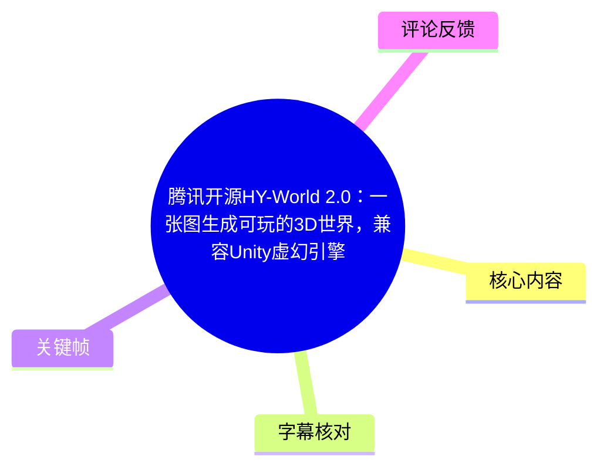
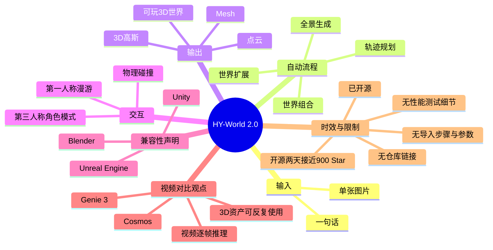
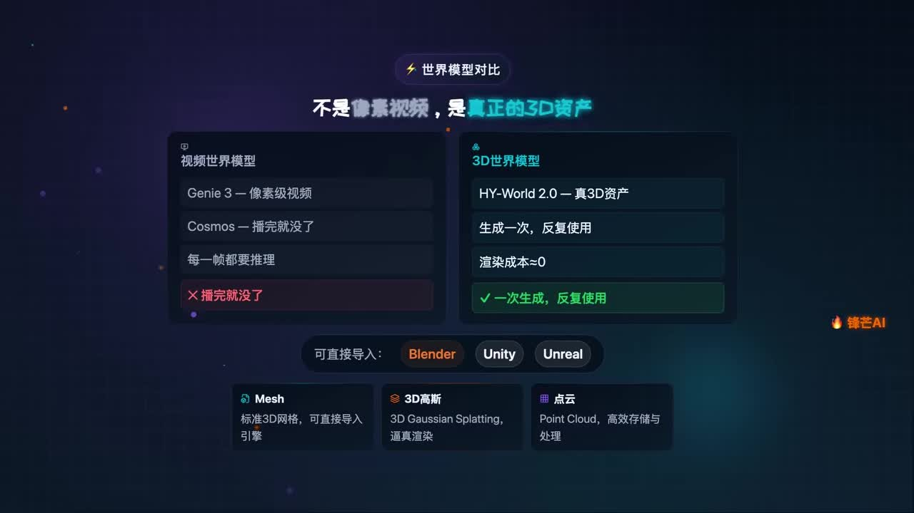
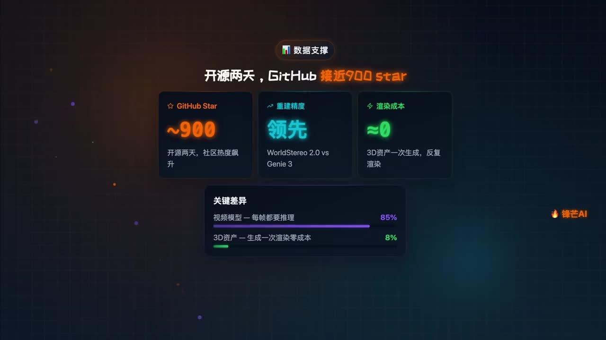

## 小结

视频介绍腾讯混元团队开源的 **HY-World 2.0**：它被定位为一种从**单张图片或一句文本**生成可进入、可交互的 3D 世界的方案。视频强调，最终结果不是只能播放的像素级视频，而是可留存、可复用的 3D 资产。

按视频说法，HY-World 2.0 会自动经过四个阶段：**全景生成、轨迹规划、世界扩展、世界组合**。产物可包括 **Mesh（网格）、3D Gaussian / 3D 高斯、点云**，并可导入 **Blender、Unity、Unreal Engine（虚幻引擎）**。展示的交互形式包括第一人称漫游、第三人称角色模式与物理碰撞。

视频以 Genie 3、Cosmos 等“视频世界模型”为对照，认为视频模型需要持续逐帧推理，而 3D 资产生成后可以反复使用。这里“渲染成本≈0”应理解为视频的传播性概括：它更可能指重复使用已生成资产时无需再次进行生成模型推理，并不表示游戏引擎的 GPU 渲染、加载、物理和内存成本真正为零。

新闻性信息包括：视频称模型已开源、在线演示可体验，且“开源两天 GitHub 接近 900 Star”。这些都是视频制作时点的快照，当前仓库状态、Star 数、权重开放范围、演示可用性和许可证均可能变化。素材未提供官方仓库地址、安装命令、硬件需求、生成参数、导出格式或完整引擎导入流程，因此不能据此直接判断其生产环境可用性。

适合关注 AI 3D 生成、游戏原型、场景资产生产与 Unity/Unreal 工作流的读者。实际采用前，应重点验证资产格式、材质和碰撞导出、插件依赖、引擎版本、场景性能与许可证。

## 思维导图





## 目录

- [背景与核心定位](#背景与核心定位)
- [输入与四阶段生成流程](#输入与四阶段生成流程)
- [可玩世界与交互能力](#可玩世界与交互能力)
- [资产类型与引擎兼容](#资产类型与引擎兼容)
- [与视频世界模型的对比](#与视频世界模型的对比)
- [新闻数据、时效性与验证边界](#新闻数据时效性与验证边界)
- [实践验证清单](#实践验证清单)
- [关键帧解读](#关键帧解读)
- [字幕比对](#字幕比对)
- [评论分析](#评论分析)
- [处理记录](#处理记录)

## 背景与核心定位 [00:00](https://www.bilibili.com/video/BV1kfdBBQEe4?t=0)

视频开场提出的目标是：**“一张图生成一个能进去玩的 3D 世界。”** 结合标题、简介与字幕，视频所介绍的对象为腾讯混元团队开源的 **HY-World 2.0**。

其核心定位可整理为：

| 维度 | 视频表达 |
| --- | --- |
| 输入 | 一句话或一张图 |
| 结果 | 可进入、可玩的完整 3D 世界 |
| 主要资产形式 | Mesh、3D Gaussian、点云 |
| 后续使用 | 可导入 Blender、Unity、Unreal Engine |
| 交互形态 | 第一人称漫游、第三人称角色模式、物理碰撞 |
| 对比对象 | Genie 3、Cosmos 等视频世界模型 |

视频的关键主张并非单纯“生成一段看起来像 3D 的视频”，而是将生成结果组织成可供后续引擎或 DCC 软件使用的三维资产。对于游戏开发或 3D 内容工作流而言，资产能否长期保存、编辑、导出和复用，通常比一次性生成画面更重要。

不过，视频未演示从输入图片或提示词到下载模型文件、再导入目标引擎的完整操作链路。因此，“可玩”“可导入”“有碰撞”等表述应视为视频对产品能力的介绍，尚不能仅凭素材确认其在所有场景、所有引擎版本下均可自动实现。

## 输入与四阶段生成流程 [00:18](https://www.bilibili.com/video/BV1kfdBBQEe4?t=18)

视频称，HY-World 2.0 支持由**一句话或一张图**启动自动生成流程，并依次经过四个阶段：

1. **全景生成**
   - 基于文本或单张图像补全更大范围的环境视觉内容。
   - 视频未提供全景图分辨率、视场角、是否为完整 360° 内容，以及多视角一致性的技术细节。

2. **轨迹规划**
   - 为场景中的移动或探索过程规划路径。
   - 素材没有说明轨迹是完全自动生成、可由用户编辑，还是可接受角色路径、移动距离等约束。

3. **世界扩展**
   - 在初始内容基础上向外扩展场景。
   - 视频未展示扩展边界的几何连续性、重复内容控制、远景质量、物体尺度稳定性或扩展范围。

4. **世界组合**
   - 将前述内容组合为一个完整的三维世界。
   - 视频强调组合结果“不是视频”，而是“完整的、可以玩的 3D 世界”。

这四阶段名称来自视频字幕。素材没有提供每个阶段独立的配置参数、API 调用方式、模型模块关系、耗时或可视化中间结果，因此不能进一步推断其具体实现机制。

## 可玩世界与交互能力 [00:29](https://www.bilibili.com/video/BV1kfdBBQEe4?t=29)

视频列出三类可玩或交互能力：

- **第一人称漫游**：用户以第一人称视角在场景中移动。
- **第三人称角色模式**：用户可以以可见角色为中心进行操作或观察。
- **真实的物理碰撞**：视频声称生成世界具备物理碰撞能力。

这表明视频强调的是“生成后进入世界交互”的使用方式，而不仅是静态展示或镜头控制。

但“物理碰撞”在实际项目中通常涉及多个工程环节，包括但不限于：

- 生成或配置碰撞网格；
- 为地面、墙体、障碍物设置碰撞体；
- 配置角色控制器；
- 建立导航网格或寻路数据；
- 对接 Unity 或 Unreal Engine 的物理系统；
- 处理复杂网格、洞口、悬浮物与非封闭几何导致的碰撞异常。

视频没有展示碰撞体如何生成，也未说明碰撞信息是否随资产一同导出。因此，现有素材只能确认视频提出了该能力，不能确认不同资产类别和不同引擎工作流中的实际可靠性。

## 资产类型与引擎兼容 [00:33](https://www.bilibili.com/video/BV1kfdBBQEe4?t=33)

视频称 HY-World 2.0 可输出真正的 3D 资产，画面和字幕明确提到以下三类：

| 资产类型 | 视频画面中的说明 | 对实际工作流的含义与待确认项 |
| --- | --- | --- |
| Mesh（网格） | “标准 3D 网格，可直接导入引擎” | 网格通常适合进一步编辑、贴图、绑定碰撞和引擎渲染；视频未说明格式、面数、UV、法线、纹理和材质槽。 |
| 3D Gaussian / 3D 高斯 | “3D Gaussian Splatting，逼真渲染” | 适合高保真新视角渲染的表达方式；是否能直接适配交互、碰撞、光照和常规游戏管线，取决于具体引擎支持与插件能力。 |
| 点云（Point Cloud） | “高效存储与处理” | 点云可保留空间采样信息，但常需额外处理表面、材质、碰撞和引擎渲染适配。 |

视频还称资产可以直接导入：

- **Blender**
- **Unity**
- **Unreal Engine / Unreal（虚幻引擎）**



> 图：`frames/frame-001.jpg` 集中展示了视频中的“视频世界模型”与“3D 世界模型”对照，并列出 Mesh、3D 高斯、点云以及 Blender、Unity、Unreal。该图的价值在于直接保留了视频关于资产形态和引擎兼容的核心表述；但它是信息图，不是实际导入录屏或性能日志，不能单独证明不同引擎版本中的导入结果。

实际接入前，至少需要核对以下事项：

1. 输出文件格式是什么，是否包含纹理、材质、坐标系和单位信息；
2. Mesh、3D 高斯、点云是否均可使用相同导入流程；
3. Unity 与 Unreal 是否依赖专用插件、特定渲染管线或特定版本；
4. 材质、贴图、碰撞体、角色控制和导航数据是否可自动导出；
5. 大型场景的分块加载、LOD、显存占用、帧率和启动时间表现如何；
6. 资产与模型权重的开源许可证是否允许目标用途，尤其是商业游戏项目。

## 与视频世界模型的对比 [00:42](https://www.bilibili.com/video/BV1kfdBBQEe4?t=42)

视频将 HY-World 2.0 与 Genie 3、Cosmos 进行了概念性对比。根据关键帧与字幕，视频的表达如下：

| 对比维度 | 视频对 Genie 3 / Cosmos 的描述 | 视频对 HY-World 2.0 的描述 |
| --- | --- | --- |
| 输出结果 | 像素级视频 | 真正的 3D 资产 |
| 使用持续性 | “播完就没了” | 生成一次、反复使用 |
| 计算叙述 | 每一帧都要推理 | 生成后重复渲染成本“≈0” |
| 资产使用 | 视频播放 | 可导入 Blender、Unity、Unreal |

这一比较反映了视频的核心判断：若结果以可保存的三维资产形式存在，后续可在 DCC 软件或游戏引擎中重复调用，不需要每次重新生成整段视频。

但以下边界必须明确：

- “视频模型”不必然意味着完全不可复用；不同系统可能支持缓存、轨迹控制、场景表示或后处理导出。
- “3D 资产生成一次，渲染成本≈0”不等于实时渲染真的没有成本。游戏运行仍需承担模型加载、GPU 光栅化或其他渲染管线、材质、光照、物理和脚本运行成本。
- 视频没有给出生成时间、GPU 型号、显存占用、分辨率、场景规模、帧率、网格复杂度或统一测试条件，无法量化其成本优势。
- 视频画面中的比较结论是作者展示的产品观点，不能替代独立基准测试。

## 新闻数据、时效性与验证边界 [00:47](https://www.bilibili.com/video/BV1kfdBBQEe4?t=47)

视频给出的新闻性信息包括：

- HY-World 2.0 “已经开源”；
- 有在线演示可体验；
- “开源两天，GitHub 接近 900 Star”；
- 关键帧称“重建精度领先”，并出现 `WorldStereo 2.0 vs Genie 3` 的文字；
- 关键帧以 `85%` 和 `8%` 的横条表达视频模型与 3D 资产方案的成本差异。



> 图：`frames/frame-002.jpg` 展示“开源两天，GitHub 接近 900 Star”、`WorldStereo 2.0 vs Genie 3` 的“重建精度领先”文字，以及 `85%`、`8%` 两个成本相关横条。其价值在于保存视频使用的数据和比较口径；但图中没有解释 85% 和 8% 对应的单位、任务、测试环境或计算公式，不能将其视为可复现实验参数。

需要谨慎处理的事实边界：

1. **Star 数是历史快照**
   - “接近 900 Star”被限定在“开源两天”的时间点。
   - GitHub Star 数会持续变化，不能当作当前实时数据，也不能单独证明模型质量。

2. **开源状态需要官方仓库核验**
   - 素材没有提供官方 GitHub 链接、权重下载地址、许可证或商业用途限制。
   - 仅凭视频“已开源”的表述，无法确认代码、模型权重、训练数据、在线服务是否以相同范围开放。

3. **精度比较缺少实验条件**
   - 关键帧中出现的是 `WorldStereo 2.0 vs Genie 3`，但标题与简介的主体是 `HY-World 2.0`。
   - 给定素材未解释 WorldStereo 2.0 与 HY-World 2.0 的关系，不能自行认定二者是同一项目、子模块或名称笔误。
   - “领先”未提供数据集、评价指标、样本规模、输入条件、模型版本和误差范围，无法独立复核。

4. **视频未提供工程参数**
   - 未提供安装方式；
   - 未提供硬件需求；
   - 未提供推理或生成耗时；
   - 未提供文本提示词、图像规格或随机种子；
   - 未提供资产导出格式；
   - 未提供 Unity、Unreal 或 Blender 的版本与导入步骤。

## 实践验证清单 [00:54](https://www.bilibili.com/video/BV1kfdBBQEe4?t=54)

视频没有提供可复现命令、参数或操作界面，因此以下内容是基于视频主张整理的**验证清单**，不是视频已经演示过的操作步骤。

### 1. 确认项目身份、版本与权限

- 从官方渠道确认项目名称是否为 HY-World 2.0；
- 核对视频画面中的 WorldStereo 2.0 是否为相关模块或其他项目；
- 记录代码仓库地址、提交版本、模型权重版本与发布日期；
- 阅读代码、权重、输出资产和在线演示各自的许可证；
- 单独确认商业使用、再分发、模型服务部署和资产版权的限制。

### 2. 验证输入范围

- 分别测试文本输入和单张图输入；
- 记录图像分辨率、宽高比、画面内容、主体数量和视觉风格；
- 观察生成结果中是否出现几何扭曲、重复物体、空间断裂、尺度不一致、漂浮物或遮挡区域补全错误；
- 若项目支持参数控制，应记录种子、生成步数、扩展范围、输出分辨率及其他影响结果的配置。

### 3. 检查四阶段是否可控

- 确认全景生成、轨迹规划、世界扩展、世界组合是否可单独执行；
- 检查用户能否指定行走方向、扩展边界、目标距离或角色移动路径；
- 记录每一阶段耗时、显存占用、失败原因、重试机制和输出文件；
- 比较自动轨迹与手动约束轨迹在几何一致性上的差异。

### 4. 检查资产质量

- 确认实际输出是 Mesh、3D Gaussian、点云中的哪一种或多种；
- 对 Mesh 检查面数、封闭性、法线、UV、材质、纹理和比例；
- 对点云检查密度、噪点、空洞与坐标信息；
- 对 3D 高斯检查渲染依赖、编辑能力、转换路径和引擎兼容性；
- 检查场景中是否包含可用的地面、墙体、障碍物和碰撞层。

### 5. 在目标软件和引擎中验证

- 在实际版本的 Blender 中导入并检查网格、材质、尺度和法线；
- 在 Unity 中验证材质、光照、碰撞和角色控制器；
- 在 Unreal Engine 中验证资源导入、渲染、碰撞和第三人称模板适配；
- 测试第一人称和第三人称移动是否能够正常通行；
- 记录导入报错、插件依赖、资源加载时间、内存/显存使用与帧率。

### 6. 分开记录生成成本与运行成本

- **生成成本**：模型推理时间、硬件规格、显存、耗电或服务调用费用；
- **资产处理成本**：网格清理、贴图修复、碰撞配置、场景切块和人工编辑时间；
- **运行成本**：引擎加载、CPU/GPU 占用、帧率、物理计算、网络同步成本。

这样才能避免将视频的“生成一次、反复使用”简化为“运行成本为零”。

## 关键帧解读 [00:33](https://www.bilibili.com/video/BV1kfdBBQEe4?t=33)

本次素材仅提供两张关键帧，均为总结型信息图。正文选择它们的依据如下：

| 文件 | 对应正文 | 画面内容 | 选择价值 | 使用限制 |
| --- | --- | --- | --- | --- |
| `frames/frame-001.jpg` | 资产类型与引擎兼容、视频世界模型对比 | Genie 3、Cosmos 与 HY-World 2.0 的对照；Mesh、3D 高斯、点云；Blender、Unity、Unreal | 是视频核心产品定位最集中的画面，可确认视频确实提出“3D 资产”“可导入引擎”等说法 | 不含实际导入过程、模型输出样本或性能数据 |
| `frames/frame-002.jpg` | 新闻时效、精度与成本主张 | 开源两天接近 900 Star、重建精度领先、85% 与 8% 成本横条 | 保留视频的时间性数据和量化传播口径 | 未提供 Star 抓取时间、精度指标、85%/8% 的单位或实验条件 |

两张图都可用于说明“视频表达了什么”，但不能作为 HY-World 2.0 性能、兼容性或成本的独立验证证据。

## 字幕比对 [00:00](https://www.bilibili.com/video/BV1kfdBBQEe4?t=0)

本次任务同时提供了 Bilibili 站内字幕和本次执行得到的 ASR 字幕。**本次 ASR 已执行。**

最终采用策略为：以站内字幕作为主要内容顺序依据，使用本次 ASR 做交叉核对，再依据视频标题、简介和关键帧统一专有名词；无法由素材确认的名称关系不作强行合并。

| 字幕来源 | 完整性 | 专有名词识别 | 时间轴情况 | 主要问题 |
| --- | --- | --- | --- | --- |
| Bilibili 站内字幕 | 覆盖开场、四阶段、资产类型、交互能力、开源信息和结尾，整体完整 | 存在“腾讯会员”“high world2.0”“JI3cosmos”“render”等明显误识或混写 | 提供为连续文本，素材未提供逐句秒级时间码 | “腾讯混元”误作“腾讯会员”；模型名、软件名和英文术语不稳定 |
| 本次 ASR 字幕 | 覆盖主干信息和结尾，包含“播完就没了”的重复识别 | 存在“HiWorld”“Genis”“MASH”“点语”“Gini 3”等误识 | 同样未提供逐句秒级时间码 | 简繁混用；Mesh 被识别为 MASH；点云被识别为“点语”；Genie 3 被识别为 Genis/Gini 3 |
| 最终采用文本 | 两份字幕共同覆盖完整内容 | 统一采用 HY-World 2.0、Genie 3、Cosmos、Mesh、3D Gaussian、点云、Blender、Unity、Unreal Engine | 正文跳转秒数根据内容先后进行近似定位 | 不将关键帧的 WorldStereo 2.0 自动等同于 HY-World 2.0 |

重点校正记录：

- 站内字幕的“腾讯会员最新开源”与视频简介“腾讯混元团队开源”不一致；正文采用简介中的“腾讯混元团队”作为元数据描述。
- `high world2.0` 与 `HiWorld 2.0` 统一为 **HY-World 2.0**，依据标题与简介。
- `JI3`、`Genis`、`Gini 3` 统一为 **Genie 3**，依据关键帧英文名称。
- `MASH` 统一为 **Mesh**，`点语` 统一为 **点云**，依据关键帧的资产分类文字。
- `render unity 虚幻引擎` 校正为 **Blender、Unity、Unreal Engine**，依据视频简介与关键帧。
- `WorldStereo 2.0` 仅按关键帧原文保留。现有素材不足以确认其与 HY-World 2.0 的对应关系。

## 评论分析 [01:00](https://www.bilibili.com/video/BV1kfdBBQEe4?t=60)

可获取的热评数据为：

```text
items: []
```

同时，元数据中的评论数为 `reply: 0`。因此，本次不存在可分析的热评前三条。

本文不以播放量、点赞、收藏、投币或转发数据替代评论内容，也不从“无评论”推断观众对项目的正面或负面态度。

## 处理记录 [01:05](https://www.bilibili.com/video/BV1kfdBBQEe4?t=65)

- Worker ID：`worker-mrj0wjed-b0c290ad`
- 模型：`gpt-5.6-terra`
- 调用工具与素材来源：基于任务提供的 Bilibili 元数据、素材清单、站内字幕、本次 ASR 字幕、热评 JSON、封面信息与两张关键帧整理。
- 使用的素材产物：`merged.mp4`、`audio/audio.wav`、`frames/`、`subtitles/`、`asr/`、`comments/comments.json` 已在素材清单中列出。
- 字幕选择：站内字幕为主要语义与内容顺序依据；本次 ASR 已执行并用于交叉核验；依据标题、简介与关键帧校正专有名词。
- 时间轴依据：原始素材未提供逐句秒级字幕时间码；正文时间轴根据 66 秒视频中各段信息的出现顺序近似标注，仅用于跳转定位。
- 关键帧选择依据：
  - `frames/frame-001.jpg`：展示视频世界模型与 3D 世界模型的对照、Mesh/3D 高斯/点云以及 Blender/Unity/Unreal，是资产定位与兼容性章节的直接画面依据。
  - `frames/frame-002.jpg`：展示开源两天接近 900 Star、精度领先和成本横条，是时效性与宣传数据章节的直接画面依据。
- 评论处理：仅处理可获取热评前三条；本次热评列表为空，未生成或补写虚构评论。
- 缓存清理：任务提供的素材中未包含缓存清理的执行结果，无法确认清理状态；未作“已清理”声明。
- 未解决问题：
  - 未提供 HY-World 2.0 官方仓库链接、模型权重地址、许可证与在线演示地址；
  - 未提供硬件要求、部署步骤、推理命令、生成参数、耗时和导出格式；
  - 未提供 Blender、Unity、Unreal 的实际导入过程与版本要求；
  - 未提供“重建精度领先”与 `85%`、`8%` 的具体指标、单位、数据集和实验设置；
  - 无法仅凭现有素材确认 `WorldStereo 2.0` 与 `HY-World 2.0` 的关系。

## 评论分析

本次流程未获取到可用热评，因此不推断观众态度或额外结论。
