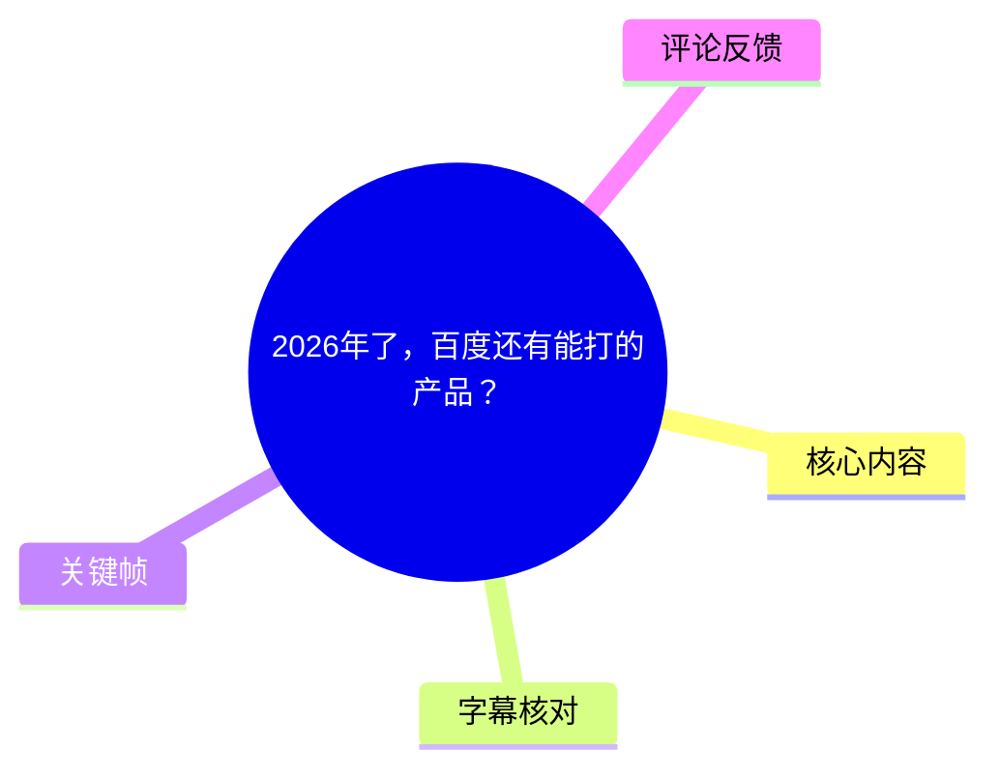
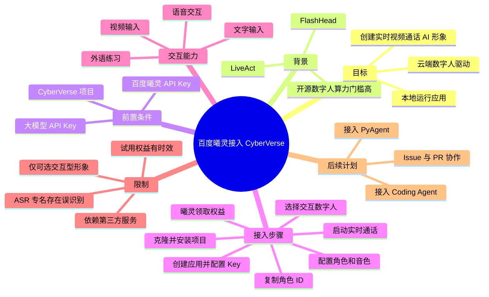
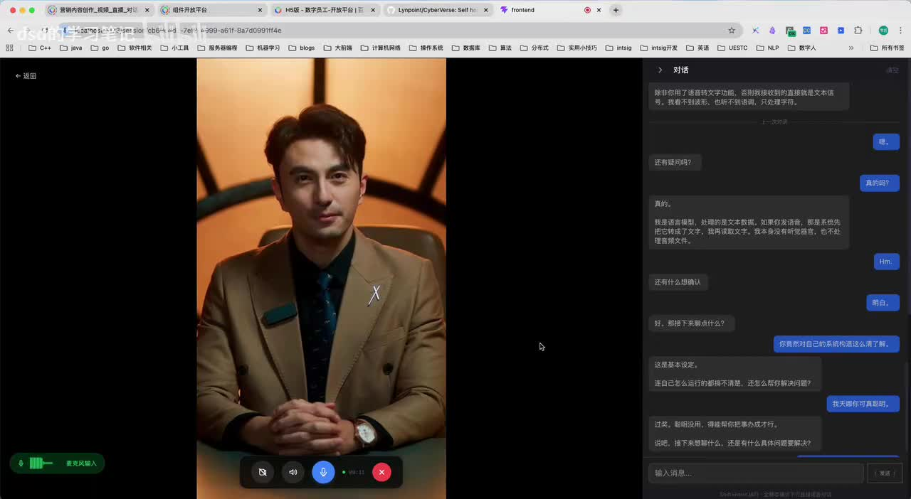
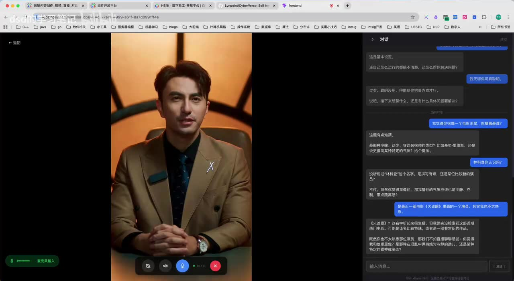
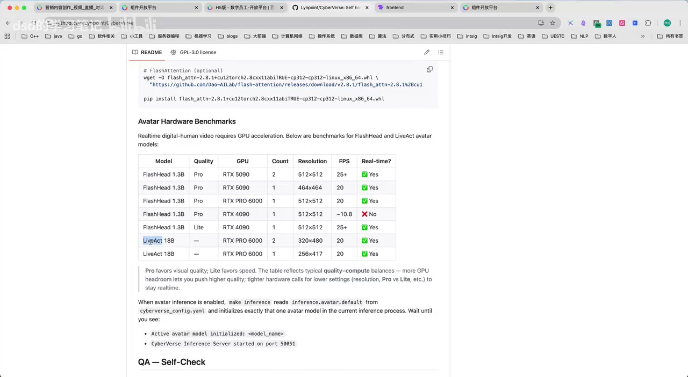
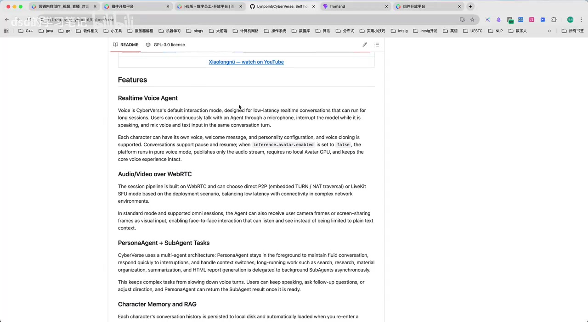

# 2026年了，百度还有能打的产品？

> 来源：[Bilibili 视频](https://www.bilibili.com/video/BV1Lcj46LEBm) 
> UP 主：dsd的学习笔记｜发布时间：2026-06-21｜视频时长：13 分 05 秒｜合集：AIcode  
> 视频描述提供的地址：[百度数字人平台（曦灵）](https://xiling.cloud.baidu.com/)｜[CyberVerse GitHub](https://github.com/Lynpoint/CyberVerse)

## 小结

视频演示了如何把百度曦灵数字人接入开源实时视频通话 Agent 框架 **CyberVerse**，从而在本地运行应用前端、通过云端数字人服务完成实时视频对话。作者给出的核心判断是：相较于本地部署开源数字人模型，这一方案把高显卡算力需求转移到了百度服务侧，本地不必安装 CUDA、PyTorch，也不用下载数字人权重；但仍须准备大模型 API Key 与百度数字人 API Key。

技术路径可概括为：克隆并按 CyberVerse README 完成前七步安装 → 配置一个用于对话的大模型 Key → 在曦灵的“组件开放平台”领取试用、创建应用并获得 Key → 在 CyberVerse 中选择百度曦灵形象来源 → 从曦灵公共资产中选择“可交互”的数字人、复制角色 ID → 配置角色提示词、交互模式与音色 → 启动实时通话。

视频中的本地开源数字人路线以 FlashHead、LiveAct 为例，作者称其算力门槛较高。关键帧中的 README 基准表可直接看到，FlashHead 1.3B 在不同质量档位下列出 RTX 4090、RTX 5090、RTX PRO 6000 等 GPU；LiveAct 18B 则列出 RTX PRO 6000。ASR 把部分型号识别成“1090”“5090”，其中“1090”与画面表格不符，应以画面中的 **RTX 4090** 为准。

适合希望快速验证“AI 伴侣 / 学习陪练 / 外语口语练习 / 实时数字人客服或助手”交互形式的开发者。视频并未展示完整命令、配置文件字段、API 计费标准或生产部署安全方案，因此它更适合作为接入流程与产品能力的演示，而非可直接照抄的生产部署文档。

需要注意的限制包括：只能选取曦灵公共资产中支持“交互”的数字人，不能把仅用于视频制作的形象直接用于该流程；语音、模型与角色设定会影响体验；作者提到新账号可领 7 天试用，但试用权益、支持模型、价格、模型名称及平台页面均可能随时间变化，应在实际使用时以平台当前规则为准。

## 思维导图

## 目录

- [演示效果与方案定位](#演示效果与方案定位-0000)
- [本地开源模型与云端数字人的取舍](#本地开源模型与云端数字人的取舍-0147)
- [前置条件与项目安装](#前置条件与项目安装-0304)
- [申请并配置两类 API Key](#申请并配置两类-api-key-0344)
- [创建百度曦灵数字人角色](#创建百度曦灵数字人角色-0640)
- [交互模式、音色与实时通话](#交互模式音色与实时通话-0851)
- [用途、成本说法与限制](#用途成本说法与限制-1021)
- [项目后续方向](#项目后续方向-1212)
- [时效性与结论](#时效性与结论)
- [字幕比对](#字幕比对)
- [评论分析](#评论分析)
- [处理记录](#处理记录)

## 演示效果与方案定位 [00:00](https://www.bilibili.com/video/BV1Lcj46LEBm?t=0)

作者开场称，自己调研过国内云厂商提供的数字人服务，对其中大部分效果并不满意；直到发现百度数字人后，认为其效果“很不错”。这是作者基于其调研与演示的主观评价，并非横向评测结论。

随后视频给出一段实时对话 Demo：屏幕左侧为西装男性数字人，右侧为聊天记录，用户通过文本或语音和数字人互动。对话中，数字人能围绕“像哪位电影明星”的提示追问、给出候选对象并继续回应，体现的是“数字人形象 + 大模型对话”的组合体验，而不应将形象表现与语言模型知识能力混为一谈。

> 图：该帧呈现数字人处于实时通话界面、右侧保留多轮对话记录的形式。它说明本视频所说的“实时视频通话”并非单纯生成视频，而是带有连续对话界面的交互式产品形态。

> 图：该帧保留了“电影明星”猜测话题的上下文及数字人回复，能用于理解作者为何认为形象与互动效果已经“立住”。

## 本地开源模型与云端数字人的取舍 [01:47](https://www.bilibili.com/video/BV1Lcj46LEBm?t=107)

作者使用的项目是 **CyberVerse**，视频将其描述为一个开源的实时视频通话 Agent 框架，可用于创建数字形象并进行实时视频通话。视频描述中给出了其 GitHub 地址：<https://github.com/Lynpoint/CyberVerse>。

在接入百度服务前，CyberVerse 可使用开源数字人模型。作者点名了 **FlashHead** 与 **LiveAct**，并强调本地实时数字人对显卡算力要求较高：如果希望获得更好效果，需要更高档次的 GPU，这构成了个人开发者的部署门槛。

关键帧展示的 README“Avatar Hardware Benchmarks”表格提供了比 ASR 更可靠的细节：

| 模型 | 质量档位/参数 | 画面列出的 GPU | 分辨率 | FPS | 实时性 |
| --- | --- | --- | --- | --- | --- |
| FlashHead 1.3B | Pro，2 路实例 | RTX 5090 | 512×512 | 25+ | 是 |
| FlashHead 1.3B | Pro，1 路实例 | RTX 5090 | 464×464 | 20 | 是 |
| FlashHead 1.3B | Pro，1 路实例 | RTX PRO 6000 | 512×512 | 20 | 是 |
| FlashHead 1.3B | Pro，1 路实例 | RTX 4090 | 512×512 | 约 10.8 | 否 |
| FlashHead 1.3B | Lite，1 路实例 | RTX 4090 | 512×512 | 25+ | 是 |
| LiveAct 18B | — | RTX PRO 6000 | 320×480 | 20 | 是 |
| LiveAct 18B | — | RTX PRO 6000 | 256×417 | 25 | 是 |

> 图：此帧直接展示 FlashHead、LiveAct 的硬件基准、分辨率、帧率和是否实时，既能佐证“本地推理门槛高”，也能校正 ASR 将“RTX 4090”误识别为“1090”的问题。

作者提出的替代路线是：使用百度数字人服务，只需申请百度 API Key，就可以在本地把 CyberVerse 应用“跑起来”。此处“本地运行”应理解为本地运行项目服务与前端，而非在本机完成数字人模型推理；视频在后续明确称，由于采用第三方数字人服务，不必安装 CUDA/PyTorch 或下载开源数字人模型。

## 前置条件与项目安装 [03:04](https://www.bilibili.com/video/BV1Lcj46LEBm?t=184)

### 1. 克隆 CyberVerse 项目 [03:04](https://www.bilibili.com/video/BV1Lcj46LEBm?t=184)

作者首先将项目克隆到本地，并称自己已经完成克隆。视频没有展示可复制的 `git clone` 命令、仓库分支或具体目录结构，因此不能据此补写具体命令；应以项目 GitHub README 的当前说明为准。

### 2. 依据 README 安装，完成至第七步 [03:18](https://www.bilibili.com/video/BV1Lcj46LEBm?t=198)

作者建议按 README 安装，也提到可借助 AI 辅助完成安装。对于本视频采用的“第三方数字人服务”路线，他明确表示：

- 不需要安装 CUDA；
- 不需要安装 PyTorch 环境；
- 不需要下载开源数字人模型；
- 按 README 操作至“第七步”即可继续后续接入。

这不是对 CyberVerse 所有功能和所有部署模式的通用结论。若选择“自定义形象”或本地数字人模型，视频后文说明仍需走本地数字人模型路径，硬件与环境要求会重新出现。

> 图：该帧的 README 展示了实时语音 Agent、WebRTC 音视频、可接收摄像头/屏幕共享画面、角色记忆等功能描述。它有助于理解 CyberVerse 不只是一张数字人展示页，而是围绕实时交互构建的 Agent 框架；具体功能可用性仍应以仓库当前版本为准。

## 申请并配置两类 API Key [03:44](https://www.bilibili.com/video/BV1Lcj46LEBm?t=224)

完成基础安装后，作者要求准备两类凭据。

### 1. 用于驱动对话的大模型 API Key [03:44](https://www.bilibili.com/video/BV1Lcj46LEBm?t=224)

第一类是大模型 API Key，用于驱动数字人的语言对话。作者口述当前系统支持：

- OpenAI；
- 阿里百炼；
- 豆包；
- LiteLLM。

其中 ASR 将“阿里百炼”误识别成“阿尼百恋”，将 “LiteLLM” 误识别为 “LiteIllm”；本文依据常见产品/项目名称作了校正。视频未说明各供应商所需模型名、Base URL、计费、并发限制及具体配置键名。

作者称，申请完成后需将相应 API Key 填入环境变量文件。ASR 多次把文件名识别为 `.emv`、`.emw`，结合其“复制一份到本地并改名”的描述，只能确认这是一个环境变量配置文件；**视频素材未能可靠确认其准确文件名，不能把 ASR 的 `.emv` / `.emw` 当作可执行文件名。** 实操时应查看仓库 README 或示例环境变量文件。

配置策略上，作者说在豆包、阿里或 OpenAI 中任选一个填写即可，随后还需要填入百度数字人的 Key。

### 2. 在百度曦灵获取数字人 API Key [04:59](https://www.bilibili.com/video/BV1Lcj46LEBm?t=299)

作者将百度数字人平台称为“曦灵”，视频描述中已提供网址：<https://xiling.cloud.baidu.com/>。其视频内步骤如下：

1. 进入曦灵官网，选择“组件开放平台”。
2. 注册或登录账号。
3. 在“权益领取”处领取试用时间；作者称可使用 2D 或 3D。
4. 进入“应用管理”，创建应用。
5. 按视频界面勾选所需能力。
6. 创建完成后复制页面提供的 API Key 与另一项应用凭据，并填入 CyberVerse 环境变量文件。

ASR 将第二项凭据识别为“APKey”，素材不足以确认其精确标签；因此应以曦灵控制台页面的实际字段为准，避免将名称误填。

> **凭据安全提醒：** 视频说自己的环境变量文件中是个人 Key。不要将包含真实 Key 的环境变量文件提交到 Git、上传截图或发布到公共仓库。该提醒是通用安全实践，不是视频展示的额外功能。

## 创建百度曦灵数字人角色 [06:07](https://www.bilibili.com/video/BV1Lcj46LEBm?t=367)

### 1. 启动 CyberVerse 的三个服务 [06:07](https://www.bilibili.com/video/BV1Lcj46LEBm?t=367)

作者展示自己已启动服务，并称主要包含三个部分：

- Inference；
- Server；
- Frontend。

启动后可进入 CyberVerse 前端页面。作者区分了两类角色：此前创建的“自定义角色”需走本地数字人模型；本视频要使用的是百度数字人模型。视频没有给出三个服务的启动命令、端口、启动先后关系和故障排查方式。

### 2. 创建角色并选择百度曦灵来源 [06:40](https://www.bilibili.com/video/BV1Lcj46LEBm?t=400)

在前端点击“创建角色”，进入角色创建页面。在“形象来源”处：

- 自定义形象主要走本地数字人模型；
- 本视频选择百度曦灵数字人作为形象来源。

### 3. 从公共资产选择“可交互”数字人 [07:00](https://www.bilibili.com/video/BV1Lcj46LEBm?t=420)

作者返回曦灵平台，切换至“公共资产”，从众多数字人中选择形象。这里有视频特别强调的限制：

- **不能选择仅用于制作视频的数字人；**
- 必须选择可用于互动的数字人；
- 可以通过筛选，将范围限定为交互数字人。

选择一个形象后，点击“创建交互”进入对应页面。作者称该页面会提供一些接入记录方式，但本次接入只需要复制其**角色 ID**。

### 4. 将角色 ID 加载到 CyberVerse [07:49](https://www.bilibili.com/video/BV1Lcj46LEBm?t=469)

回到 CyberVerse，把角色 ID 填入并点击加载。作者演示中，角色会出现在界面中并带有名称。这里的“加载成功”只代表前端识别和载入角色资料；是否能建立稳定实时通话，还取决于 Key、服务状态、网络、语音选择及平台侧权限。

### 5. 定义人格、描述与提示词 [08:08](https://www.bilibili.com/video/BV1Lcj46LEBm?t=488)

作者强调：本方案使用百度提供的数字人形象，但角色人格仍可由使用者自行设定，包括：

- 角色描述；
- 风格；
- 提示词；
- 角色的“耳朵”和“嘴巴”配置，即输入与声音输出相关设定。

这体现了形象资产与角色人格的分离：百度曦灵提供可视化数字人形象，CyberVerse 侧仍可通过提示词和模型选择塑造其交流方式。

## 交互模式、音色与实时通话 [08:51](https://www.bilibili.com/video/BV1Lcj46LEBm?t=531)

### 1. 选择标准模式或 Omni 模型 [08:51](https://www.bilibili.com/video/BV1Lcj46LEBm?t=531)

作者称角色声音输出有两种选择：

- **standard（标准）模式**；
- 使用 Omni 模型的模式。

视频将 Omni 解释为可同时支持文字、语音、视频的多模态模型，并举例可选择豆包或“千问”。ASR 中“千问”的实际产品名称虽然可辨，但视频没有给出具体版本、模型标识或配置方法。应将其理解为框架可能支持的模型类别/供应商选项，而不是对全部模型均已可用的保证。

### 2. 选择并试听音色 [09:15](https://www.bilibili.com/video/BV1Lcj46LEBm?t=555)

选择模型后，作者建议选择声音，并可到官方页面试听音色；检查正常后保存。保存成功后，角色会出现在角色列表，点击“启动”即可尝试与数字人实时视频通话。

作者随后指出，自己没有提前试听，结果选到了带较明显台湾腔的声音。这是一个直接的实践经验：**音色不能只看名称，应在正式使用前试听，确认口音、音质与角色设定相匹配。**

### 3. 输入方式与对话演示 [10:00](https://www.bilibili.com/video/BV1Lcj46LEBm?t=600)

作者演示了文字输入，并称该数字人还可进行语音交互；ASR 在“用户册的视频”处出现明显识别异常，结合上下文仅能确认视频在说明多种输入/交互方式，无法据此可靠还原该句具体功能名称。

视频列出的使用场景包括：

- 日常闲聊；
- 学习陪伴；
- 外语口语练习；
- 直接使用英语进行对话。

作者解释其知识能力来自后端连接的大模型，因此“知识丰富”属于其对大模型能力的概括；具体知识覆盖、准确性、幻觉率和语言能力取决于所选模型及提示词，视频并未测试或量化这些指标。

## 用途、成本说法与限制 [10:21](https://www.bilibili.com/video/BV1Lcj46LEBm?t=621)

作者把数字人定位为较丰富的交互入口，而非只有一次性视频生成功能。视频中的 CyberVerse README 画面还提到，实时语音 Agent 支持低延迟、长会话、用户打断；WebRTC 可按部署场景采用直连 P2P 或 LiveKit SFU；在标准模式与受支持的 Omni 会话中，Agent 可以接收用户摄像头或屏幕共享画面作为视觉输入。这些是画面中 README 的功能说明，不等于本视频已逐项完成实测。

### 长时间挂起与 Token 消耗 [11:25](https://www.bilibili.com/video/BV1Lcj46LEBm?t=685)

作者称可以把数字人连续挂着数小时而不中断，想起时再聊；并认为不对话时不会消耗 Token，对话时的消耗主要在语音识别与输出阶段，且不会太多。

这一段应谨慎理解：

- 它是作者对自己演示/使用体验的说法；
- 是否真能“数小时不中断”会受到平台会话时长、网络、浏览器、服务端超时、账户额度等条件影响；
- “不说话不消耗 Token”不必然意味着完全没有成本，云端数字人、音视频连接、实例或并发资源是否收费，应以曦灵和模型服务商的实际计费规则为准；
- 视频未提供 Token 用量、单次通话费用、平台调用单价或账单截图，不能据此估算成本。

### 试用权益与形象限制 [11:50](https://www.bilibili.com/video/BV1Lcj46LEBm?t=710)

作者最后再次说明，使用百度数字人需要 API Key，新账号有 7 天免费试用。该权益是视频发布时点的作者陈述，具有明显时效性；注册资格、试用天数、可用 2D/3D 资源、调用额度、地区和实名要求都可能发生变化。

归纳本视频已出现的限制：

| 类别 | 限制或注意事项 |
| --- | --- |
| 形象资产 | 必须选“可交互”数字人；仅用于视频制作的资产不适用本接入流程。 |
| 本地能力 | 使用百度服务可免去本地 CUDA/PyTorch/权重下载，但自定义形象仍可能走本地模型。 |
| 凭据 | 至少涉及大模型 API Key 与百度数字人 API Key；须妥善保管。 |
| 模型/音色 | 模型、口音和声音均需自行选择并试听验证。 |
| 成本 | 作者只作定性说明，未提供可复核的 Token、调用价格或计费表。 |
| 稳定性 | 长时间不中断为作者陈述，未展示系统级稳定性测试。 |
| 功能边界 | 未展示完整部署命令、环境变量字段、错误处理、认证权限和生产安全配置。 |

## 项目后续方向 [12:12](https://www.bilibili.com/video/BV1Lcj46LEBm?t=732)

作者邀请对数字人项目感兴趣的观众参与构建和交流，并提到后续可能接入更多功能：

- 正在接入 **PyAgent**；
- 若后续接入 **Coding Agent**，可以通过语音下达指令，再由后端运行；
- 欢迎通过 GitHub 提交 issue 或 PR。

这些内容属于开发计划，不表示相关能力已经在视频发布时完成、可用或稳定。对于希望参与开发的读者，应以 CyberVerse 仓库的 issue、PR、分支状态及最新版 README 为准。

## 时效性与结论

这是一份以演示为主的集成教程。其可迁移的经验是：把“实时数字人形象”和“对话大模型”分层处理，在本地运行编排与交互界面、通过第三方数字人服务降低本地 GPU 门槛；再以角色 ID、提示词、模型与音色配置完成角色塑造。

但视频并不是百度数字人或 CyberVerse 的全面评测。作者没有对延迟、并发、稳定性、成本、隐私、数据留存、商业授权及形象使用权进行实证比较；“效果好”“不费 Token”“可一直挂着”等表达应保留为作者体验，而不能推广为普遍结论。

截至视频元数据所示的 2026-06-21，视频描述中的百度曦灵地址与 CyberVerse 仓库可作为入口；但平台试用权益、控制台操作路径、API 字段、支持模型、GPU 基准、开源仓库功能和计费都会变化。实际部署前应重新查阅官方文档与仓库当前版本，并进行小规模调用测试。

## 字幕比对

| 字幕来源 | 完整性 | 专有名词 | 时间轴 | 主要问题 |
| --- | --- | --- | --- | --- |
| Bilibili 站内字幕 | 未提供可用字幕 | 无法核验 | 无法使用 | 素材记录显示字幕工具因 `Invalid URL` 退出，未取得站内字幕。 |
| 本次 ASR 字幕 | 较完整，共 46 段，语音覆盖约 648.37 秒，占视频约 82.65% | 存在多处误识别 | 可用，含精确 SRT 起止时间 | “1090”、CyberVerse、README、CUDA、PyTorch、阿里百炼、LiteLLM、环境变量文件名、曦灵凭据字段等识别不稳定；存在 5 段较大无语音间隔。 |

最终采用本次 ASR 的 **SRT 时间轴** 作为各章节链接依据，并结合关键帧和视频描述修正显著专有名词。ASR 诊断显示音频识别语言为中文，置信度约 0.996，使用 `medium` 模型、CUDA 与 `float16`；诊断中**未标记** `noAudioStream=true`，且生成了含时间戳的 46 段结果，因此不能将该视频认定为无音轨。

本次已进行的关键校正包括：

- ASR“Severus / Cyberverse”统一为视频描述提供的仓库名 **CyberVerse**。
- ASR“西宁”统一为视频描述链接对应的 **曦灵**。
- ASR“1090”不采用；关键帧硬件表明确出现 **RTX 4090**。
- ASR“阿尼百恋”校正为 **阿里百炼**，“LiteIllm”校正为 **LiteLLM**。
- ASR 对环境变量文件名及百度第二项凭据字段存在冲突和失真，本文不强行写成确定名称，保留“以当前 README/控制台字段为准”的结论。
- 00:10:21 附近一句关于输入方式的 ASR 文本明显异常，未据此编造未确认能力。

## 评论分析

仅获取到热评前三条，评论点赞数均较低，不能代表整体观众意见。

1. **花生补眠中**（1 赞）：称“内容很赞”，并请求 UP 回关。  
   - 观点：对内容作正面评价。  
   - 补充信息：无技术补充。  
   - 可信度与价值：属于互动性支持，不构成对方案效果、成本或操作正确性的验证。

2. **北冥系咸鱼**（1 赞）：称“每个视频我都会评论，这是第3263个”。  
   - 观点：表达固定评论行为。  
   - 补充信息：无。  
   - 可信度与价值：与视频技术内容无直接关系，不能用于判断教程质量。

3. **firstcpunter**（0 赞）：询问“百度这个是只能使用百度自己的形象吗”。  
   - 观点：关注形象资产范围与自定义能力。  
   - 补充信息：提出了视频中尚未完全展开的实际使用问题。  
   - 对照视频：视频明确演示的是从曦灵公共资产选取可交互形象；同时作者说 CyberVerse 的“自定义形象”需走本地数字人模型。因此，不能仅根据本视频断言百度服务一定只能使用百度自有形象；可确认的是，**本演示接入路径使用了曦灵公共资产中的交互数字人**。

## 处理记录

- Worker ID：`worker-mrj0wjed-b0c290ad`
- 模型：`gpt-5.6-terra`
- 调用工具与模型：素材处理链已提供音频提取、关键帧导出、ASR 与评论获取结果；ASR 模型为 `medium`，设备为 CUDA，计算类型为 `float16`。
- 使用的应用工具：视频元数据读取、站内字幕尝试、关键帧提取、音频 ASR、热评获取。
- 字幕选择：站内字幕未提供可用结果，且工具日志显示 `Invalid URL`；已检查并采用本次 ASR 的带时间戳 SRT 作为时间轴依据，同时以关键帧和视频描述校正专有名词。
- 关键帧选择依据：  
  - `frames/frame-001.jpg`：展示实时数字人与通话控制界面；  
  - `frames/frame-002.jpg`：展示多轮对话 Demo；  
  - `frames/frame-003.jpg`：展示 README 硬件基准，是校正 GPU 型号与说明算力门槛的直接画面证据；  
  - `frames/frame-004.jpg`：展示 README 中实时语音、WebRTC、多模态输入及 Agent 架构相关能力说明。  
- 缓存清理：素材中未提供缓存清理执行日志；未擅自声明已清理缓存。
- 未解决问题：未取得站内字幕；未提供完整 README、实际环境变量样例、服务启动命令、平台计费页和 API 文档；ASR 对部分配置字段及 00:10:21 附近语句存在不可可靠恢复的误识别。
