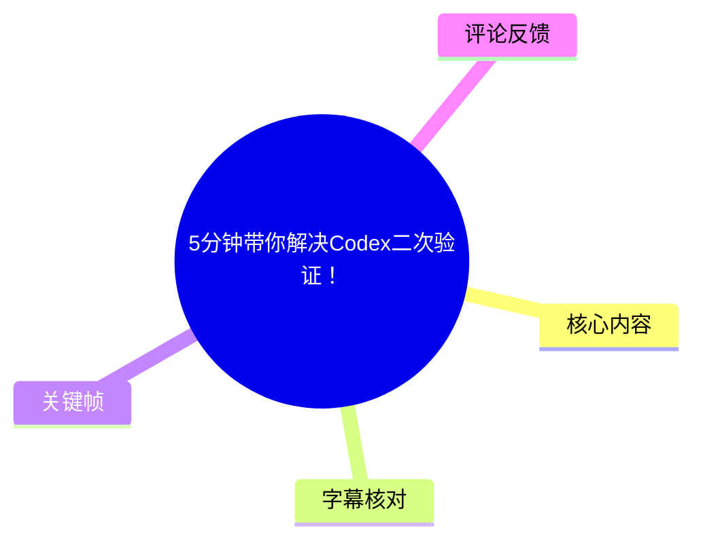
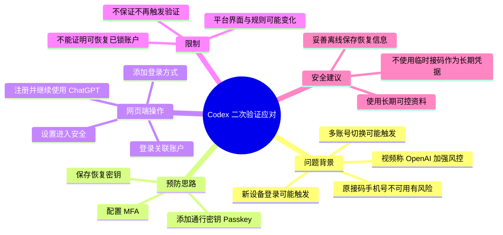
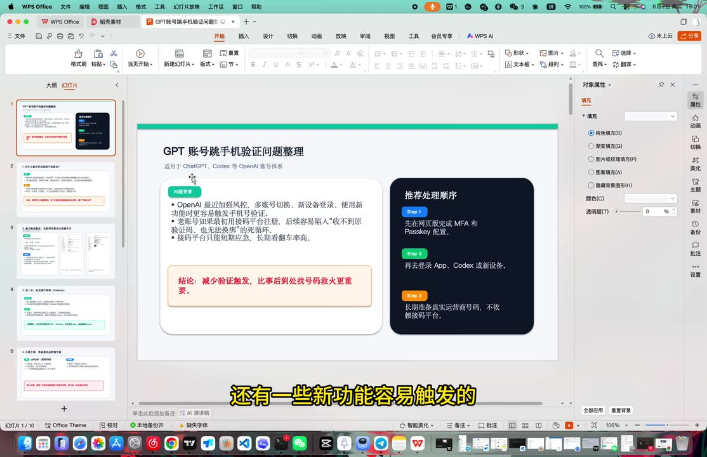
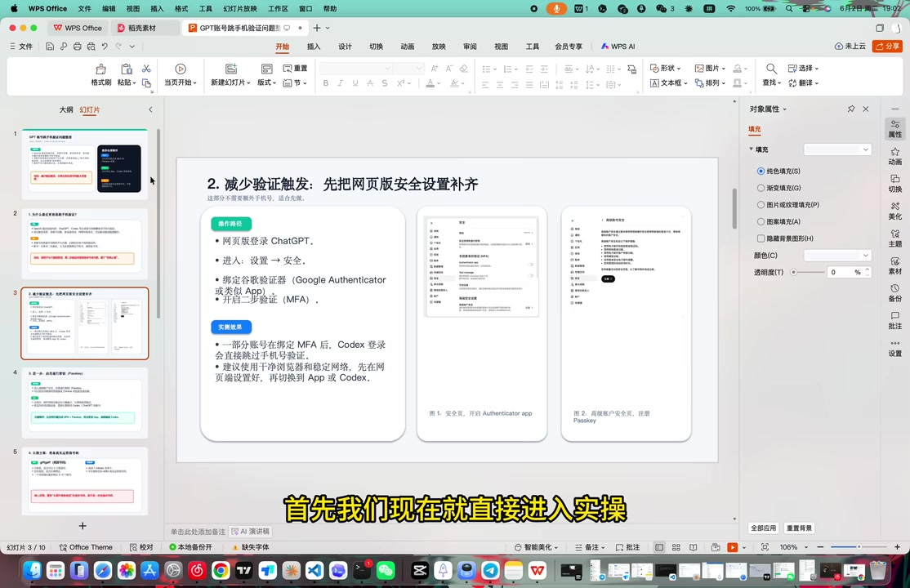
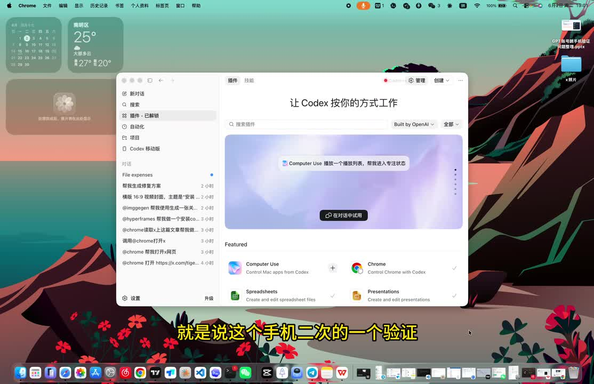

# 5分钟带你解决Codex二次验证！

> 来源：[Bilibili 视频](https://www.bilibili.com/video/BV1Q1VB6AEyu) 
> UP 主：JayJie学AI｜视频时长：06:12｜合集：AIcode  
> 视频简介称：这是对“昨天二次验证”问题的补充教程；公开元数据抓取时间为 2026-07-15，发布时间字段换算为 2026-06-02。

## 小结

视频讨论的是：使用 Codex / ChatGPT 相关账户时，若遇到手机号二次验证，如何**提前完善账户安全登录方式**，以降低再次被要求依赖原手机号验证的风险。UP 主给出的核心路径是：在 ChatGPT 网页端的安全设置中配置 **MFA（多因素认证）**、**通行密钥（Passkey）**，并保存恢复密钥/恢复代码。

视频将问题归因于 OpenAI 近期加强风控：多账号切换、新设备登录及部分新功能使用，可能触发手机二次验证。尤其是通过接码平台注册、且无法再次取得原手机号验证码的账户，一旦被要求验证，可能无法继续完成登录。该归因和“近期加强”的时效性均为视频陈述，未提供官方公告链接，不能视为已独立核验的官方规则。

实操部分以 ChatGPT 网页端为例：登录与 Codex 关联的同一账户，进入左下角“设置”，在“安全”相关页面设置认证器 MFA，并在高级安全设置中添加通行密钥。演示中可将通行密钥保存至 Google 个人资料或其他可用位置，随后保存恢复密钥并完成注册。

这里的“解决”更准确地说是**建立可替代的安全验证与恢复方式**，而不是保证永远不会出现风控、手机验证或账户限制。视频也没有展示被锁账户、丢失原手机号后如何直接恢复的完整案例；因此，已经无法访问账户或恢复信息的用户不能据此推定一定可找回账号。

该教程适合已经能正常登录 ChatGPT、希望为 Codex 相关使用补充 MFA 和 Passkey 的用户。应使用本人长期可控的认证器、设备与恢复资料；不应依赖临时接码号码，也不建议将多账号规避风控作为使用目标。

## 思维导图

## 目录

- [背景：二次验证为何成为问题](#背景二次验证为何成为问题-0025)
- [视频给出的安全配置方案](#视频给出的安全配置方案-0114)
- [实操：从 ChatGPT 设置进入安全页面](#实操从-chatgpt-设置进入安全页面-0144)
- [实操：添加通行密钥与认证器](#实操添加通行密钥与认证器-0322)
- [恢复密钥、完成注册与效果边界](#恢复密钥完成注册与效果边界-0507)
- [结论、限制与时效性](#结论限制与时效性-0535)
- [字幕比对](#字幕比对)
- [评论分析](#评论分析)
- [处理记录](#处理记录)

## 背景：二次验证为何成为问题 [00:25](https://www.bilibili.com/video/BV1Q1VB6AEyu?t=25)

视频开场说明，此教程是针对前一日 Codex 安装视频评论中“手机二次验证如何处理”的补充。UP 主表示自己未亲历该问题，因而收集资料并制作演示文稿；这意味着前半段是整理性说明，并非其本人遭遇后的恢复实测。

根据视频在 00:25—01:14 的陈述，可能触发二次手机号验证的场景包括：

1. 多个账户之间切换；
2. 在新设备登录；
3. 使用某些新功能；
4. 平台风控策略加强后出现额外验证。

视频特别指出一种高风险情形：账户注册时使用接码平台，而后续又被要求二次验证；如果原接码平台不能再次接收该号码的验证码，用户便无法通过验证。UP 主将其结果描述为账号“只能作废”。这一结论反映了视频中的风险判断，但具体是否无其他官方恢复渠道，仍取决于账户状态、平台政策和可提交的验证材料。

> 图：关键帧展示题为“GPT 账号跳手机验证码问题整理”的页面。画面列出“多账号切换、新设备登录、使用新功能”等触发因素，并给出先配 MFA 与 Passkey、再登录 App/Codex 的顺序，是理解视频问题定义和总体方案的直接依据。

### 视频中的前置经验 [00:49](https://www.bilibili.com/video/BV1Q1VB6AEyu?t=49)

演示文稿进一步给出三项经验性建议：

- 先在网页端完成 MFA 与 Passkey；
- 再登录 App、Codex 或新设备；
- 长期准备真实运营商号码，不依赖接码平台。

其中，“真实运营商号码”的建议应理解为使用长期可控、能够持续接收验证信息的手机号，而不是把任何第三方临时号码当作账户恢复凭据。视频并未给出地区可用性、号码绑定规则或官方支持范围等参数。

## 视频给出的安全配置方案 [01:14](https://www.bilibili.com/video/BV1Q1VB6AEyu?t=74)

UP 主在 01:14—01:42 概括了两类配置：

| 配置项 | 视频中的用途 | 视频展示的关联方式 |
| --- | --- | --- |
| MFA（多因素认证） | 为登录增加认证器验证方式 | 使用 Google Authenticator 一类验证器 |
| 通行密钥（Passkey） | 添加可用于登录/身份确认的通行密钥 | 可保存到 Google 个人资料或其他位置 |
| 恢复密钥/恢复代码 | 在后续恢复场景中留存备用信息 | 注册流程后出现，需自行保存 |

需要区分三件事：

- **MFA** 是额外验证机制，视频称可在“安全”页面开启认证器应用；
- **Passkey** 通常由设备、浏览器或密码管理体系保存，视频演示将 OpenAI 通行密钥存至 Google 个人资料；
- **恢复密钥**是敏感恢复材料。视频只强调“保存”，没有公开其具体内容；不应把恢复密钥截图、发送给他人或仅存放在同一台可能丢失的设备中。

> 图：该页标题为“减少验证触发：先把网页版安全设置补齐”，画面明确写出网页端进入“设置 → 安全”、绑定 Google Authenticator、开启 MFA，并提示在高级安全设置中注册 Passkey。它为 ASR 中不够清晰的菜单名称提供了画面校正依据。

## 实操：从 ChatGPT 设置进入安全页面 [01:44](https://www.bilibili.com/video/BV1Q1VB6AEyu?t=104)

视频从 01:44 开始进入实际操作。按照画面与语音可复现的顺序如下：

1. 打开 Codex 界面。
2. 从右上角入口进入 ChatGPT 官方网站。
3. 使用与此前 Codex 关联的**同一个账户**登录 ChatGPT。
4. 在网页左下角点击“设置”。
5. 在设置中进入“安全”相关区域，寻找 MFA 与高级安全设置。

> 图：关键帧显示 Codex 页面，右上角可见 ChatGPT 相关入口，左侧导航底部有“设置”。该画面说明视频的操作起点是 Codex/ChatGPT 的网页生态，而非单独的手机短信页面。

### MFA 的视频操作说明 [02:08](https://www.bilibili.com/video/BV1Q1VB6AEyu?t=128)

在 02:08—02:52，UP 主提到设置页面中有“设置 MFA”的入口，并将其描述为 Google 验证器相关设置。随后为了演示通行密钥注册，他退出了自己的高级安全设置状态，再重新点选注册。

视频没有展示完整的二维码扫描、认证器生成的 6 位动态码、备用代码数量或失效周期。因此，以下内容不应被补写为视频已演示的参数：

- 未展示 MFA 动态码的位数；
- 未展示认证器绑定二维码；
- 未展示恢复代码的具体格式和数量；
- 未展示不同浏览器、不同操作系统的兼容性。

在实际使用中，应以当前账户安全页面的提示为准；如果平台要求再次输入密码或验证码，这是身份确认流程的一部分，视频在 02:55、03:03 也简略展示了“密码验证身份”“验证码”等步骤。

## 实操：添加通行密钥与认证器 [03:22](https://www.bilibili.com/video/BV1Q1VB6AEyu?t=202)

### 1. 进入“登录方式”并添加 [03:22](https://www.bilibili.com/video/BV1Q1VB6AEyu?t=202)

完成身份确认后，视频进入“登录方式”页面，并选择“添加”。UP 主说明自己的页面已存在此前设置过的登录方式；新进入页面的用户界面可能不同。

### 2. 选择通行密钥 [03:49](https://www.bilibili.com/video/BV1Q1VB6AEyu?t=229)

在“添加”后的选项中，视频提及“通行密钥”和“安全密钥”。UP 主建议优先添加通行密钥，或添加与 Google 认证器相关的密钥/认证方式。由于 ASR 将多个术语识别为“通信密钥”“安全密钦”等，结合画面和上下文，此处统一校正为：

- **通行密钥（Passkey）**
- **安全密钥（Security Key）**
- **认证器应用 / MFA**

视频并未逐项解释 Passkey 与物理安全密钥之间的技术区别，也没有展示硬件安全密钥的注册过程。因此，不能将“安全密钥不用管”推广为所有用户都不应使用硬件安全密钥；这只是 UP 主针对本次演示给出的简化建议。

### 3. 选择通行密钥保存位置 [04:17](https://www.bilibili.com/video/BV1Q1VB6AEyu?t=257)

UP 主说明，点击添加后可选择保存 OpenAI 通行密钥的位置，画面语境中提到：

- Google 个人资料；
- 其他可用位置；
- 其本人选择使用 Google 个人资料创建/保存。

这里的关键不是必须使用 Google，而是选用自己长期可访问、具备适当同步与账户保护能力的凭据保存体系。若更换设备、注销同步账户、丢失系统解锁方式或删除凭据，通行密钥可用性可能受影响；视频未涵盖这些迁移与丢失场景。

## 恢复密钥、完成注册与效果边界 [05:07](https://www.bilibili.com/video/BV1Q1VB6AEyu?t=307)

在约 05:07，视频出现“保存恢复密钥”的步骤，UP 主提醒用户自行保存，之后继续；约 05:20 出现“保护你的账户”，点击“注册”；约 05:26 完成三步后，点击继续使用 ChatGPT。

按视频流程整理：

1. 完成通行密钥添加；
2. 在系统提示时保存恢复密钥/恢复信息；
3. 继续并确认“保护你的账户”页面；
4. 点击“注册”；
5. 选择继续使用 ChatGPT；
6. 返回后检查 MFA 是否已勾选或已添加。

### 视频宣称的效果 [05:35](https://www.bilibili.com/video/BV1Q1VB6AEyu?t=335)

UP 主在结尾表示，完成上述绑定后，在多账号切换时“不容易”再次跳转到手机二次验证；若还要使用 MFA，则在对应区域添加并勾选即可，前提是拥有 Google 验证器。

这个表述包含明确边界：原话是“不容易”，而非“绝不会”。实际触发何种验证仍可能由账户风险状态、登录环境、设备、网络、地区、服务策略和平台实时判断决定。MFA/Passkey 的价值在于增强可控的验证路径，并不能绕过服务条款、平台风控或账户资格审查。

## 结论、限制与时效性 [05:35](https://www.bilibili.com/video/BV1Q1VB6AEyu?t=335)

视频可迁移的经验是：在正常可登录时，优先补齐安全与恢复手段，而不是等到失去原手机号后再处理。对本视频所涉账户而言，可执行的最小闭环是：

1. 确认能登录与 Codex 关联的 ChatGPT 账户；
2. 进入“设置 → 安全”；
3. 配置认证器 MFA；
4. 添加通行密钥；
5. 妥善保存恢复密钥；
6. 再使用 App、Codex 或新设备登录。

但应注意以下限制：

- **非账户恢复教程**：没有展示被锁定、无法收验证码或失去所有登录方式时的官方找回流程。
- **非官方规则证明**：视频有关“官方加强封控”“哪些行为必然触发”的说明没有附官方依据，应视为经验性总结。
- **界面时效性**：ChatGPT/Codex 的菜单名称、入口、Passkey 支持条件和验证策略均可能在视频发布后调整。
- **不保证规避验证**：完成 MFA 与 Passkey 后，平台仍可能要求额外验证。
- **安全与合规边界**：接码平台号码不适合承担长期账户恢复职责；不应通过频繁切换账户、伪造设备环境或其他方式规避平台安全机制。
- **恢复材料风险**：恢复密钥一旦泄露，可能直接影响账户安全；应以加密、离线或可信密码管理方案保存，并避免单点丢失。

## 字幕比对

| 字幕来源 | 完整性 | 专有名词 | 时间轴 | 主要问题 |
| --- | --- | --- | --- | --- |
| Bilibili 站内字幕 | 未提供可用字幕 | 无法核验 | 无法核验 | 素材记录显示字幕工具报 `Invalid URL`，未获得站内 SRT |
| 本次 ASR 字幕 | 较完整，覆盖约 325.46 秒语音、覆盖率 87.56% | 存在较多误识别 | 可直接使用，首段 00:00:00.820，末段 00:06:10.940 | “CodeS”“TrapGPT”“通信密钥”“密钦”等词不准确；03:04—03:17 有约 12.89 秒语音空缺 |

最终采用本次 ASR 的真实分段时间轴作为章节定位依据，并结合关键帧和上下文对部分专有词作了最小必要校正：

| ASR 识别 | 正文校正 | 校正依据 |
| --- | --- | --- |
| `CodeS` / `CodeX` | Codex | 视频标题、画面中的 Codex 页面与上下文 |
| `TrapGPT` | ChatGPT | 视频画面与口述的 OpenAI/ChatGPT 账户设置语境 |
| `通信密钥` / `密钢` | 通行密钥（Passkey） | 演示文稿中明确出现 `Passkey`，且与登录方式添加流程一致 |
| `谷歌验证器` | Google Authenticator/Google 验证器 | 画面文案与 MFA 设置上下文 |
| `PVD` | PPT/演示文稿 | 画面实际为 WPS 演示文稿；仅用于描述载体，不影响操作结论 |

ASR 诊断未标记 `noAudioStream=true`；相反，素材包含音频文件，识别语言为中文，置信度约 0.991。因此，本视频不是“无音轨”情形，站内字幕缺失时以 ASR 时间轴、关键帧和画面文字共同整理。

## 评论分析

仅处理可获取的热评前三条；评论属于用户观点或经验，不等同于平台规则或已验证事实。

1. **nooooohh（36 赞）**  
   评论询问“不能二次接码”的接码平台号码是否就废了”，并表示其刚使用约一周的土区 Plus 已失效。该评论与视频所强调的风险高度相关：原接码号码不可再次获取会造成验证困境。但“没了”的具体原因、账户状态和平台处置并未披露，不能据此确认一定是二次验证导致。

2. **爱潜水的ml（20 赞）**  
   评论认为问题与教程关系不大，提出“浏览器指纹验证”可能与硬件有关，重装浏览器也无效；同时称专门的指纹浏览器可能触发另一层风控。它补充了设备/浏览器环境可能影响风险判断的观点，也对视频“通过 MFA/Passkey 降低触发”的效果提出质疑。由于评论未提供官方来源或测试过程，应作为待核验的技术经验，而非确定机制。

3. **200刀pro都可开票的（12 赞）**  
   评论仅写“专业接码”，没有解释操作、证据或与视频方案的具体关系。其信息量有限，且与视频建议使用长期可控号码的方向相冲突，不宜据此采取接码服务作为账户长期安全方案。

## 处理记录

- Worker ID：`worker-mrj0wjed-b0c290ad`
- 模型：`gpt-5.6-terra`
- 调用工具与素材：视频元数据、音频 ASR 结果（`medium`，CUDA、`float16`）、ASR SRT 时间轴、关键帧素材、热评 JSON。
- 字幕选择：未取得可用 Bilibili 站内字幕；已检查本次 ASR，采用其 SRT 的真实起止时间作为时间轴依据，并以画面文字校正明显专有名词误识别。
- 关键帧选择依据：  
  - `frames/frame-001.jpg`：展示 Codex 页面、ChatGPT 入口与设置入口；  
  - `frames/frame-002.jpg`：展示二次验证触发因素和推荐处理顺序；  
  - `frames/frame-004.jpg`：展示“设置 → 安全”、MFA、Passkey 的具体路径。  
  这些帧均直接支撑正文中的操作流程或问题背景，未使用无法从现有画面确认含义的图片。
- 缓存清理：提供的素材中没有缓存清理执行日志；本文不将缓存视为已清理。
- 未解决问题：未获得站内字幕；未提供 OpenAI 官方风控规则、账户恢复政策或 MFA/Passkey 页面在不同地区与设备上的完整兼容性信息；视频也未实测已失去原手机号的账户恢复结果。
