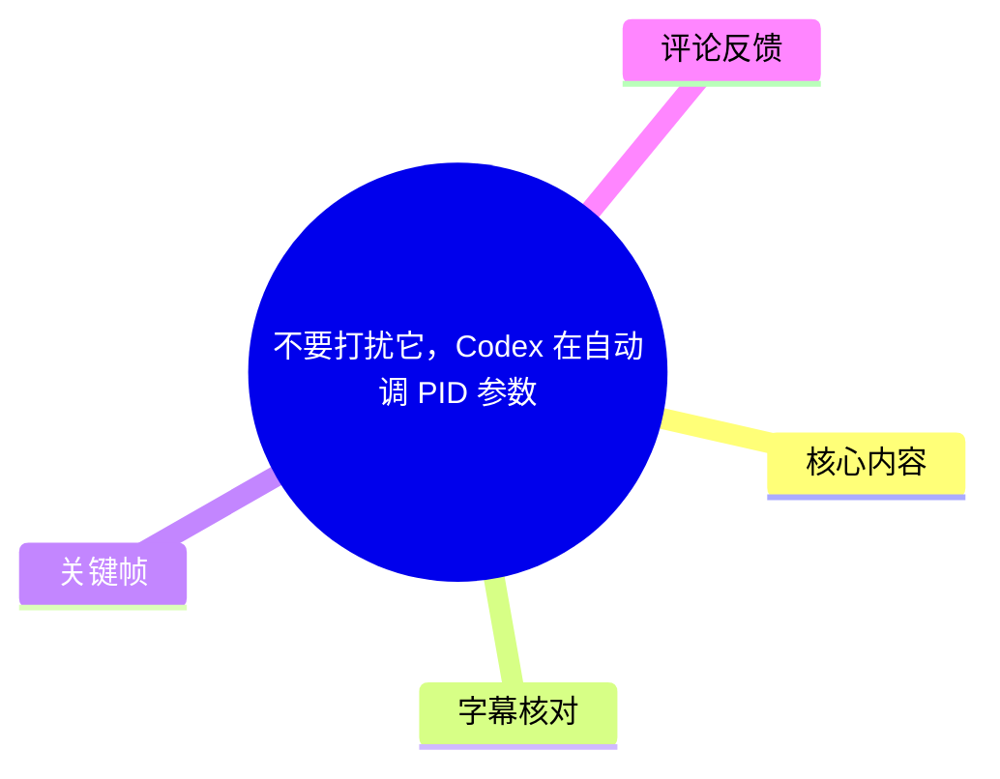
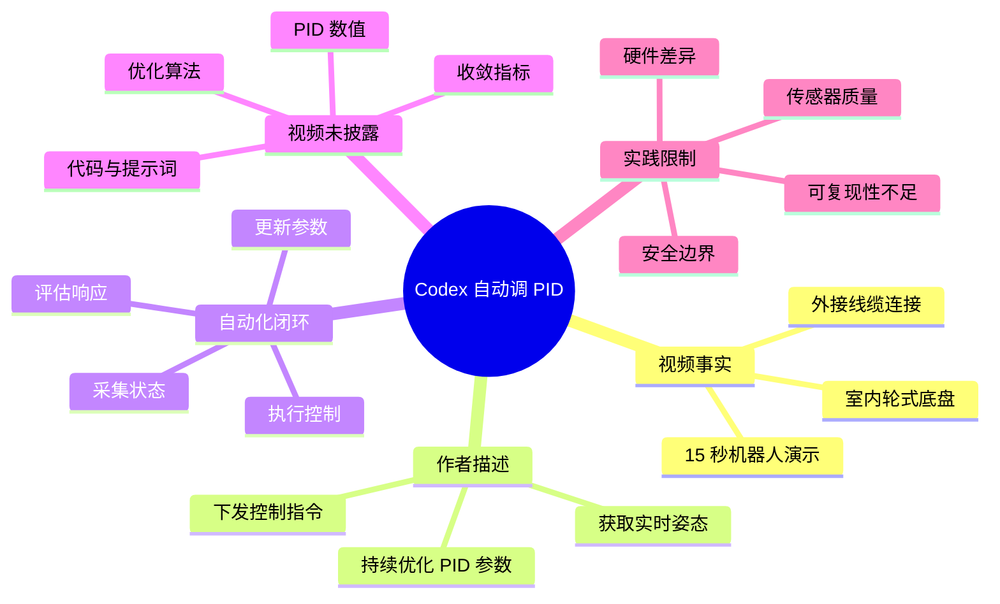
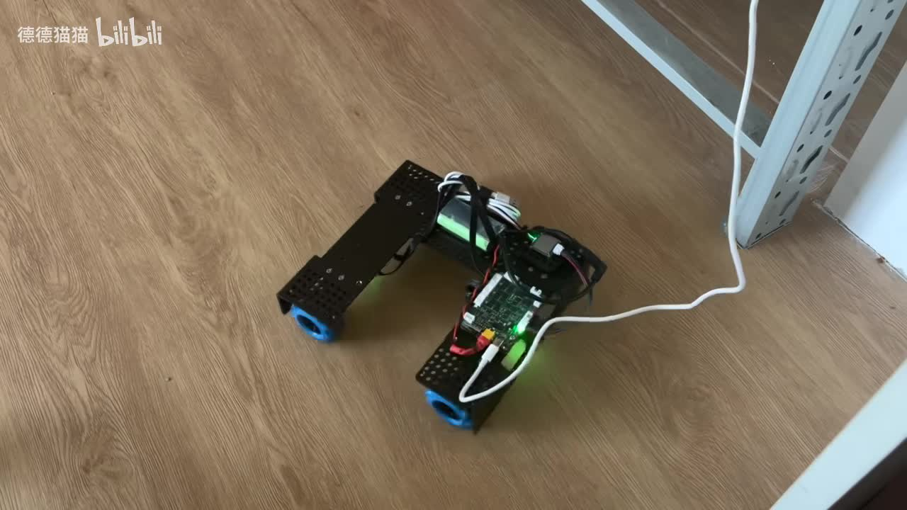
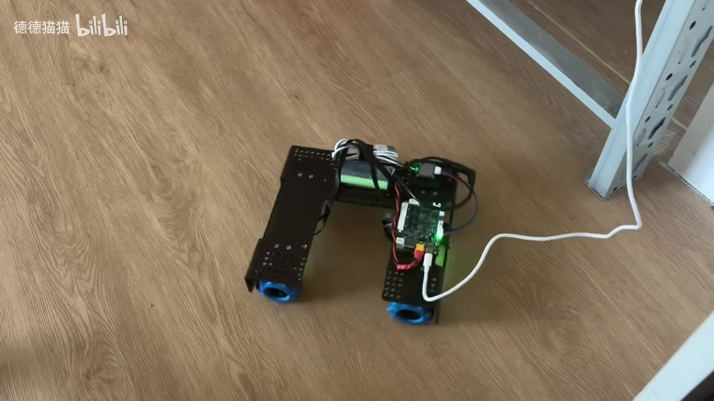
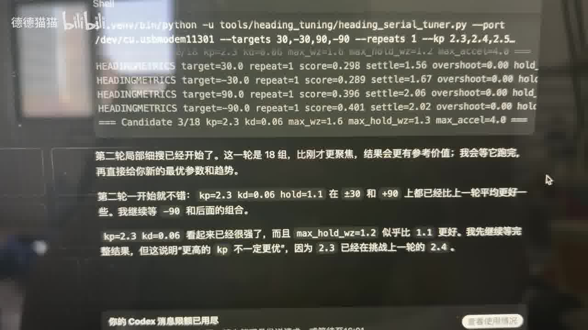

# 不要打扰它，Codex 在自动调 PID 参数

> 来源：[Bilibili 视频](https://www.bilibili.com/video/BV1AJcUzZEMB)  
> UP 主：德德猫猫｜时长：15 秒｜分区/收藏集：AIcode  
> 视频简介称：Codex 下发控制指令、获取实时运动姿态，并持续优化 PID 参数；UP 主以“睡一觉 PID 参数就差不多了”形容其自动调参愿景。

## 小结

这是一段 15 秒的机器人运动演示视频。画面中可见一台带轮式底盘、控制板、电池/线束和外接线缆的机器人在室内地面上运动或调整姿态。视频标题及简介将该过程描述为：由 Codex 参与下发控制指令，读取实时运动姿态，并持续优化 PID 参数。

视频传递的核心思路不是展示某一组具体 PID 数值，而是将传统依赖人工经验的“观察响应—修改参数—再次测试”循环，转化为自动化闭环：获取运动状态，评估当前响应，再继续调整控制参数。对于需要反复调节运动控制器的机器人项目，这种工作流具有明确的效率吸引力。

但视频本体没有展示代码、提示词、控制器结构、传感器来源、目标函数、参数搜索范围、单次迭代时长或最终收敛曲线。因此，能够确认的是“作者正在展示自动调 PID 的机器人实验”；不能仅凭标题和简介确认 Codex 的具体权限、自动优化算法、稳定性、实际收敛速度，或其是否能直接迁移到其他机器人平台。

从画面可见，机器人与外部设备之间存在一根白色线缆连接。该线缆可能承担供电、通信、调试或其他作用，但视频未给出说明，不能据此断言其功能。画面也未呈现人员介入、急停装置、限幅策略和安全保护逻辑，因此实际部署时仍需将安全约束置于自动调参之前。

该内容具有时效性：它反映的是视频发布时作者所展示的一次实验状态。Codex 的产品能力、接口形式、可用模型以及机器人项目所使用的软件栈都可能随后变化；评论中提到的第三方开源项目也仅是评论者提供的线索，并非本视频已验证内容。

## 思维导图





## 目录

- [视频事实与问题背景](#背景)
- [画面中的机器人实验](#画面)
- [自动调 PID 的闭环含义](#闭环)
- [可复用的实施步骤与必要参数](#步骤)
- [限制、风险与时效性](#限制)
- [关键帧索引](#关键帧)
- [字幕比对](#字幕)
- [评论分析](#评论)
- [处理记录](#记录)

<a id="背景"></a>

## [视频事实与问题背景（00:00）](https://www.bilibili.com/video/BV1AJcUzZEMB?t=0)

视频标题为“不要打扰它，Codex 在自动调 PID 参数”，标签包含“机器人、PID、控制、运动控制、codex、robomaster、调参、机器人运动”等。结合视频简介，作者所描述的实验链路包括：

1. **Codex 下发控制指令**：即由 Codex 参与控制指令的生成或调整。
2. **获取实时运动姿态**：即系统需要有某种运动状态反馈。简介只使用“姿态”一词，未说明传感器是 IMU、编码器、视觉定位、里程计还是它们的融合。
3. **持续优化 PID 参数**：即不是固定使用一组人工写定的比例、积分、微分参数，而是在测试过程中继续修正参数。
4. **目标是减少人工守候**：作者用“睡一觉 PID 参数就差不多了”表达自动调参可在较长时间内持续运行的预期。这是作者的表述，不构成已由视频量化证明的性能承诺。

PID 控制器通常可表为：

\[
u(t)=K_p e(t)+K_i\int_0^t e(\tau)d\tau+K_d\frac{de(t)}{dt}
\]

其中：

- \(u(t)\)：输出给执行器的控制量；
- \(e(t)\)：目标状态与当前状态之间的误差；
- \(K_p\)：比例系数，通常影响响应强度；
- \(K_i\)：积分系数，通常用于减小稳态误差，但过大可能累积并导致振荡；
- \(K_d\)：微分系数，通常用于抑制快速变化或改善阻尼，但会受噪声影响。

以上是 PID 的通用控制知识，不是视频中展示的具体实现。视频没有披露任何 \(K_p\)、\(K_i\)、\(K_d\) 数值，也没有说明其控制对象是速度、角度、位置、航向，还是多个控制环的组合。

<a id="画面"></a>

## [画面中的机器人实验（00:00）](https://www.bilibili.com/video/BV1AJcUzZEMB?t=0)

视频画面持续展示一台放置在木地板上的轮式机器人。可辨识的视觉信息包括：

- 底盘采用黑色金属或工程材料构件；
- 前后可见蓝色轮组/轮毂区域；
- 机身中央安装了控制电路板、线束及供电相关部件；
- 电路板上可见绿色指示灯；
- 一根白色线缆从机器人连接至画面右侧外部区域；
- 机器人所在空间靠近金属架/支撑结构，属于室内测试环境。



> 图：该帧提供了实验对象的整体结构证据：轮式底盘、中央控制板、线束和外接白色线缆同时可见。它有助于区分“软件概念演示”和“连接实体机器人进行运动测试”的实验场景；但无法从画面判定线缆的具体功能或控制板型号。

视频没有以文字叠加、终端窗口、控制面板或曲线图展示自动调参过程。因此，画面能够支持“机器人正在被用于实际运动测试”的判断；“Codex 如何下发指令、姿态如何回传、参数如何改变”则主要来自标题和简介，缺乏视频内可逐项核验的技术细节。

<a id="闭环"></a>

## [自动调 PID 的闭环含义（00:00）](https://www.bilibili.com/video/BV1AJcUzZEMB?t=0)

若按作者简介所述的“控制指令—实时姿态—持续优化 PID 参数”理解，该实验可抽象为如下闭环，而不是将大模型直接等同于底层实时控制器：

```text
设定目标状态
    ↓
PID 控制器计算执行器指令
    ↓
机器人电机与底盘产生运动
    ↓
传感器/状态估计获得实时姿态或运动状态
    ↓
计算误差、超调、振荡、稳态误差等评价指标
    ↓
调参模块提出新的 PID 参数
    └──────── 返回 PID 控制器
```

其中，Codex 可能参与的环节是生成或修改调参策略、控制配置、测试命令，或根据反馈提出下一轮参数候选。**视频没有说明它是否直接接入实时电机控制循环。** 在工程上，更稳妥的架构通常是：

- 底层控制循环由 MCU、实时控制器或确定性软件负责；
- 上层自动化模块在较慢时间尺度上收集实验数据、判断效果并更新参数；
- 每次参数更新都经过边界检查和安全验证；
- 在异常时由硬件/固件保护优先切断或限幅，而非依赖模型文本推理。

视频简介中“自己持续优化 PID 参数”表明作者强调的是持续迭代能力，但没有提供优化目标。一个可操作的评价目标通常需要同时惩罚跟踪误差与控制不稳定，例如：

\[
J=\sum_t \left(
w_e e(t)^2+
w_u u(t)^2+
w_{\Delta u}(\Delta u(t))^2
\right)
+\lambda_o\cdot \text{Overshoot}
+\lambda_s\cdot \text{SettlingTime}
\]

该公式是对自动调参常见评价方式的说明，不是视频公开的公式。没有目标函数，就无法判断视频中“优化”具体偏向更快响应、更小超调、更低能耗，还是更好的姿态稳定性。



> 图：该帧保留了机器人、地面测试空间和外接线缆之间的关系。它的价值在于提示自动调参实验依赖真实硬件运行状态；电机、轮胎、地面摩擦、负载和供电波动均可能影响同一组 PID 参数的表现。

<a id="步骤"></a>

## [可复用的实施步骤与必要参数（00:00）](https://www.bilibili.com/video/BV1AJcUzZEMB?t=0)

以下步骤是根据作者所描述的闭环目标整理出的**工程实施框架**，用于说明若要复现实验通常需要补齐什么；并非视频中已经展示的操作流程、代码或命令。

### 1. 明确控制对象与测试任务

先定义一个可测、可重复的任务，例如：

- 保持指定航向；
- 以设定速度直行；
- 从初始角度转向目标角度；
- 跟踪给定位置或速度轨迹。

同一机器人可能需要多个 PID 环：电机速度环、车体速度环、航向环或姿态环。不能将视频中泛称的“PID 参数”直接理解为仅有一组三元参数。

### 2. 固定安全边界

在让自动化系统修改参数之前，应在底层控制器中固定不可被上层轻易突破的约束：

| 约束项 | 作用 |
| --- | --- |
| 电机输出限幅 | 防止指令过大造成冲撞、过流或机构损伤 |
| 速度/角速度上限 | 限制测试运动范围 |
| 参数上下界 | 防止 \(K_p\)、\(K_i\)、\(K_d\) 被调整至明显危险的区域 |
| 积分限幅或抗积分饱和 | 防止输出饱和后积分项持续累积 |
| 传感器超时检测 | 状态反馈丢失时停止或降级 |
| 急停与看门狗 | 通信异常、程序卡死或失控时优先停止 |
| 测试区域边界 | 避免机器人驶入人员、障碍物或危险区域 |

视频画面未展示这些机制，不能确认作者是否已实施；它们是将“可连续运行”变成可接受工程实践的前提。

### 3. 采集带时间戳的测试数据

每轮测试至少应记录：

- 目标值与实际值；
- 姿态、速度、位置或其他被控状态；
- 当前 PID 参数；
- 控制输出与饱和标志；
- 时间戳、供电状态、异常状态；
- 测试任务编号及环境条件。

仅仅“看机器人动起来”不足以判断参数变好。至少需要可比较的误差、超调、稳定时间或振荡指标。视频没有显示数据记录格式、采样率、传感器精度及控制频率，因此这些关键参数均未知。

### 4. 在受限候选集中优化参数

实际执行时，可将调参模块限制为提出候选值，而由确定性程序做校验：

```text
读取当前测试日志
→ 计算性能指标
→ 在参数边界内提出下一组 Kp、Ki、Kd
→ 参数合法性检查
→ 写入配置并重启/热更新控制器
→ 执行固定测试动作
→ 记录结果
→ 满足停止条件后结束
```

可使用的停止条件通常包括：

- 达到预设最大迭代次数；
- 连续若干轮改进低于阈值；
- 已达到误差、超调和稳定时间目标；
- 出现传感器异常、碰撞风险、输出饱和或振荡；
- 测试环境变化明显。

视频未说明 Codex 是否采用网格搜索、随机搜索、贝叶斯优化、规则调节、基于日志的语言模型建议，或其他算法。因此不能将“Codex 自动调 PID”进一步具体化为某一种优化方法。

### 5. 用独立工况复验结果

自动调出的参数不能只在生成它的单一测试轨迹上评估。至少应在不同初始角度、不同速度、不同负载、不同电池电压或不同地面条件下复验。轮式机器人对摩擦与供电状态较敏感，单次看似平稳的结果不代表具有泛化性。



> 图：该帧突出机械结构、电气组件与测试连接共存的状态。它提醒读者：PID 调参不是纯软件变量优化，执行器、供电、机械间隙、轮胎接触和传感器噪声都会共同决定结果。

### 视频已公开与未公开的参数边界

| 信息类别 | 视频素材可确认的内容 | 视频未提供的内容 |
| --- | --- | --- |
| 时长 | 15 秒 | 完整运行时长、单轮测试时长 |
| 控制方法 | 标题和简介明确提到 PID | 控制环数量、离散化方式、控制频率 |
| 参数 | 存在“PID 参数”优化这一表述 | \(K_p\)、\(K_i\)、\(K_d\) 初值、范围、步长、最终值 |
| 状态反馈 | 简介称获取“实时运动姿态” | 传感器类型、采样率、滤波与状态估计方案 |
| 自动化主体 | 简介称 Codex 下发指令并持续优化 | Codex 版本、模型、提示词、工具调用、权限范围 |
| 优化成效 | 作者称可长期运行到“差不多” | 收敛曲线、成功率、基线对比、量化指标 |
| 硬件 | 画面可见轮式机器人、控制板、线束、外接线 | 底盘型号、控制板型号、电机和驱动器规格 |

<a id="限制"></a>

## [限制、风险与时效性（00:00）](https://www.bilibili.com/video/BV1AJcUzZEMB?t=0)

### 证据边界

本视频属于极短的现场演示，缺少可复现技术材料。以下说法应严格区分：

- **可由视频元数据确认**：标题、UP 主、时长、标签、简介中的作者陈述。
- **可由关键帧确认**：存在实体轮式机器人、控制板/线束、室内测试环境和外接白色线缆。
- **作者的实验描述**：Codex 下发控制指令、获取实时姿态、持续优化 PID。
- **不能确认**：自动调参算法、模型版本、具体控制架构、参数值、优化指标、是否收敛，以及相较人工调参的量化提升。

### 自动调参的主要工程风险

1. **探索造成不稳定**：为寻找更优响应而扩大参数范围时，可能出现高频振荡、轮胎打滑、碰撞或机构冲击。
2. **积分饱和**：执行器已经饱和时，积分项仍累积会导致恢复迟缓或剧烈反向响应。
3. **微分项放大噪声**：姿态传感器和编码器测量噪声可能使微分项产生不稳定控制输出。
4. **目标函数错配**：若只追求更快到达目标，可能牺牲超调、能耗、温升、机械寿命和安全性。
5. **环境漂移**：电量、地面摩擦、负载、轮胎磨损和温度变化会改变系统特性，使某次最优参数失效。
6. **语言模型非确定性**：若大模型参与生成参数或修改控制配置，需要额外的结构化校验、参数白名单和回滚机制；不能将自然语言输出直接写入执行器控制逻辑。
7. **外接线缆限制**：画面中外接线缆可能限制运动范围或增加缠绕风险，但其实际用途未公开，不能据此判断系统是否为有线控制。

### 时效性说明

视频元数据记录的发布时间为 2026 年 3 月 13 日。其标题中的“Codex”指代在该时间点的相关工具或工作流，但视频并未给出具体产品版本、接口或调用方式。后续软件能力、机器人 SDK、硬件固件和开源项目均可能变化。若将该思路用于实际项目，应重新验证当前工具链和安全策略，而不是假定视频中的实验状态仍可原样复现。

<a id="关键帧"></a>

## [关键帧索引（00:00）](https://www.bilibili.com/video/BV1AJcUzZEMB?t=0)

由于本次 ASR 没有输出可用语音分段，且关键帧素材未附带逐帧提取时间戳，以下图片按视觉内容归档，**不将其标注为精确到秒的发生时刻**。

| 关键帧 | 画面信息 | 正文使用价值 |
| --- | --- | --- |
|  | 室内木地板上的轮式机器人，可见中央控制组件和白色外接线缆 | 证明视频展示的是实体机器人测试，而非单纯软件界面 |
|  | 机器人、地面空间、支撑结构与外接线缆共同出现 | 用于说明真实测试环境及外部连接关系 |
|  | 可见底盘构件、轮组区域、电路组件和线束 | 用于强调 PID 参数受软硬件系统共同影响 |

<a id="字幕"></a>

## [字幕比对（00:00）](https://www.bilibili.com/video/BV1AJcUzZEMB?t=0)

| 字幕来源 | 完整性 | 专有名词 | 时间轴 | 主要问题 |
| --- | --- | --- | --- | --- |
| Bilibili 站内字幕 | 未提供可用字幕 | 无法核验 | 无可用分段 | 素材明确标注“未提供可用站内字幕” |
| 本次 ASR 字幕 | 空 | 未识别出文本 | ASR 配置支持时间戳，但结果无分段 | `segments` 为空；语音时长为 0 秒；未识别出语音内容 |

本次 ASR 使用 `medium` 模型，自动语言检测结果为英语，置信度约为 `0.5410`；音频分析时长为 `14.2506875` 秒，但没有产生任何语音识别片段。诊断信息提示“未识别到语音片段，请确认源文件是否包含可听语音并使用正确音轨重试”。

需要特别说明：ASR 结果中**没有** `noAudioStream=true` 标记。因此不能说该视频“没有音轨”，只能如实表述为：本次提取到了音频文件，但 ASR 未识别到可转写的语音内容。视频可能主要由环境声、机械声、音乐、低音量内容或不易被当前模型识别的音频构成；现有素材不足以进一步判定。

最终未采用任何字幕文本。本文的事实依据改为：

1. 视频标题、简介、标签与元数据；
2. 可见关键帧中的机器人硬件与测试环境；
3. 对 PID 通用原理的明确标注性补充。

“Codex”“PID”“实时运动姿态”等词均来自标题、简介或标签，而非本次 ASR 转写；没有对空 ASR 结果进行臆测性补写。

<a id="评论"></a>

## [评论分析（00:00）](https://www.bilibili.com/video/BV1AJcUzZEMB?t=0)

以下仅处理本次可获取的热评前三条，按点赞数排序。评论是观众观点或线索，不应当作视频技术细节已经被验证的证据。

### 1. “手调 pid这种东西也要失传了吗”｜低光速黑域｜653 赞

这条评论以调侃方式指出自动调参可能替代大量人工 PID 调试工作。它反映出观众对“经验型调参被自动化”的直观感受。

需要保留的边界是：自动化并不等于不再需要控制工程知识。控制对象建模、安全阈值、任务设计、评价函数、异常处置及最终复验仍需要工程判断。视频本身也没有给出人工调参和自动调参之间的效率或性能对比，因此“失传”应视为评论情绪表达，而非事实结论。

### 2. “是不是可以用在各种竞赛，比如什么RobotMaster、电赛之类的？”｜勉之丶｜484 赞

评论者询问该方法能否用于 RobotMaster、电子设计竞赛等场景，并希望 UP 主讲解具体做法。该问题与视频标签中的“robomaster”相呼应，说明观众关注其跨平台、竞赛化应用。

从原理上看，带有稳定传感反馈、可重复任务和安全测试条件的运动控制系统确实可能受益于自动化参数搜索；但是否适用于具体竞赛，要取决于控制对象、调参时间预算、现场环境变化、规则限制和故障风险。视频没有展示这些竞赛场景，也没有提供跨平台验证，因而不能将该适用性视为已证实。

### 3. 关于 `llm-pid-tuner` 开源项目的推荐｜KINGSTON-115｜333 赞

评论者称存在一个“打通 LLM 和调 PID 通路”的开源项目，并给出 GitHub 链接：<https://github.com/KINGSTON-115/llm-pid-tuner>；同时主张其效果“应该比直连 codex 要稳定快速”。

这条评论的价值在于提供了潜在的延伸检索方向：除了直接让 Codex 参与控制工作流，也可能存在将 LLM、日志、参数搜索与控制器之间做专门适配的开源实现。

但需要注意：

- 链接和项目效果来自评论者，本文未对仓库代码、发布日期、维护状态、许可证、硬件支持范围或实验数据进行独立核验；
- “更稳定快速”是评论者判断，不能视为与本视频方案的已验证性能比较；
- 即使项目存在，也仍需审查其安全机制、参数约束和真实硬件测试设计。

<a id="记录"></a>

## [处理记录（00:00）](https://www.bilibili.com/video/BV1AJcUzZEMB?t=0)

- **Worker ID**：`worker-mrj0www4-e8d79408`
- **模型**：`gpt-5.6-terra`
- **素材与工具产物**：使用任务提供的视频元数据、封面信息、关键帧目录、ASR 诊断与结果、热评 JSON；素材清单显示已产出 `merged.mp4`、`audio/audio.wav`、`frames/`、`asr/`、`comments/comments.json` 等文件。
- **ASR 工具信息**：ASR 模型为 `medium`，设备为 `cuda`，计算类型为 `float16`，请求语言为自动识别；输出无语音分段。
- **字幕选择**：站内字幕未提供可用内容；本次 ASR 输出为空且无时间分段；因此未选用字幕文本。正文以标题、简介、标签、元数据和关键帧为依据，并明确区分作者陈述、画面事实与通用技术说明。
- **时间轴依据**：没有可用的站内 SRT 分段，也没有 ASR 分段；各视频章节统一链接至已确认的视频起点 `00:00`，未根据文字顺序虚构后续秒数位置。
- **关键帧选择依据**：选用 `frame-001.jpg`、`frame-006.jpg`、`frame-012.jpg`，因为它们用于呈现机器人整体、测试空间/外接连接关系，以及底盘电子组件；关键帧未提供提取时间戳，故未虚构精确帧时刻。
- **热评处理范围**：仅分析可获取热评前三条，未延展至其他评论或回复。
- **缓存清理**：任务素材未提供缓存清理执行日志，无法确认是否已清理；本文不宣称已完成清理。
- **未解决问题**：未获得代码、提示词、控制器架构、硬件型号、传感器方案、PID 参数、优化策略、日志、成功率与安全机制；无法验证自动调参的具体方法和实际性能。

## 评论分析

- 热评 1：手调 pid这种东西也要失传了吗
- 热评 2：我去，这个是不是可以用在各种竞赛，比如什么RobotMaster、电赛之类的？主播能讲讲具体这么做的吗，已经投币了！
- 热评 3：有个上个月开源的异曲同工的项目，打通LLM和调PID的通路，加快收敛，不光codex！[脱单doge] https://github.com/KINGSTON-115/llm-pid-tuner[doge] 可以试试鸭🤗，效果应该比直连codex要稳定快速🤓

以上内容是观众反馈摘录，只用于补充理解视频反响，不作为正文事实依据。
