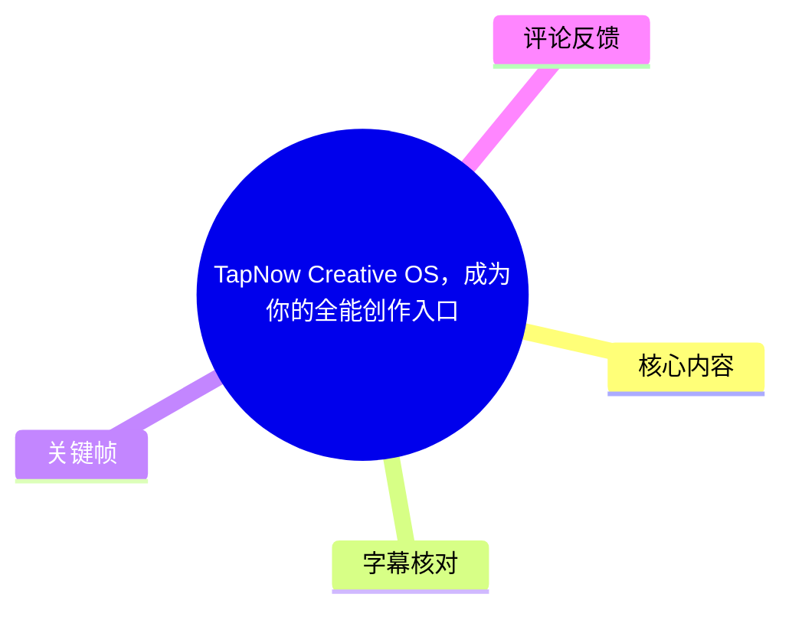
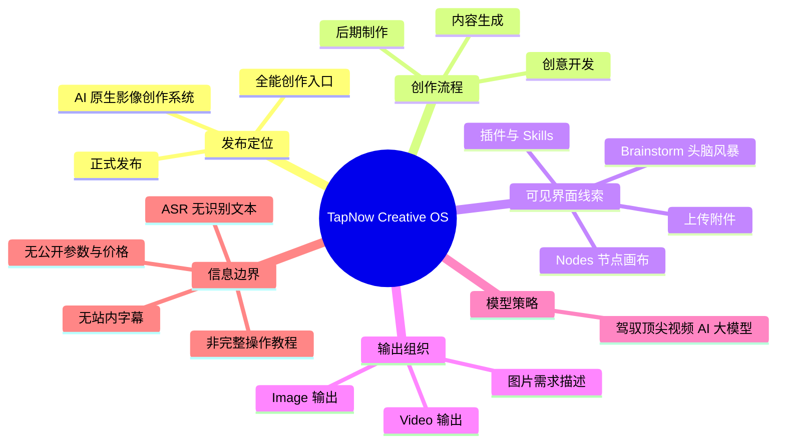
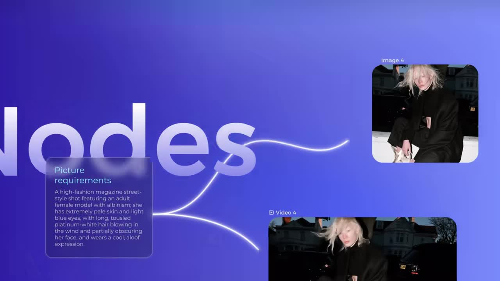
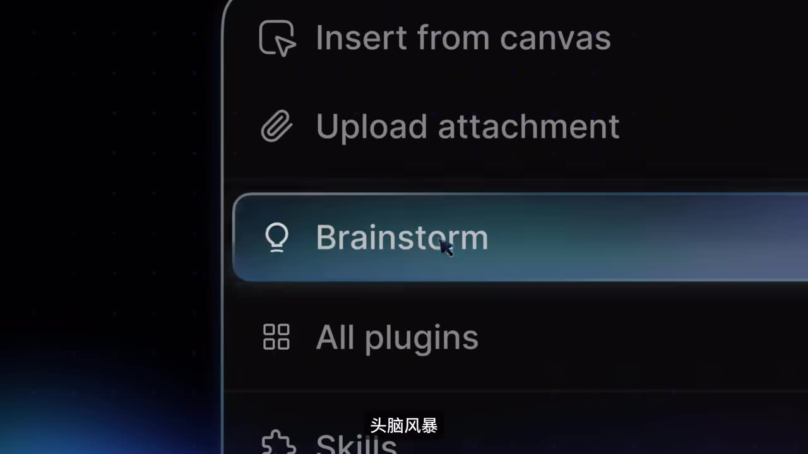
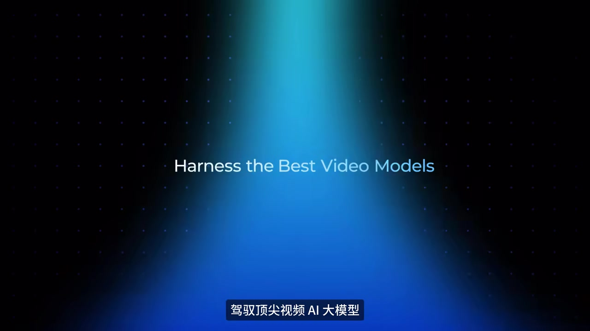

# TapNow Creative OS，成为你的全能创作入口

> 来源：[Bilibili 视频](https://www.bilibili.com/video/BV1xiK56iEW4)<br>
> UP 主：TapNow｜视频时长：94 秒｜分辨率：3840×2160<br>
> 素材抓取时间：2026-07-21 02:09:05 UTC

## 小结

TapNow 在这支约 94 秒的宣传视频中宣布 **TapNow Creative OS 正式发布**。依据视频标题、UP 主简介与可见画面，其定位并非某一个单项生成工具，而是面向影像创作的 AI 原生入口：覆盖创意开发、内容生成与后期制作等环节。

视频可见的产品表达集中于三点：其一，以 **Nodes**（节点）组织创作要求、图片与视频等素材或结果；其二，界面提供 **Brainstorm**（头脑风暴）、从画布插入、上传附件、插件与 Skills 等入口；其三，强调“驾驭顶尖视频 AI 大模型”（画面英文为 “Harness the Best Video Models”）。这些内容说明其目标是把创意构思、素材输入、模型调用和输出管理汇集到同一工作环境。

对创作者而言，最具可迁移性的思路不是“再使用一个模型”，而是将需求文本、参考图、生成视频和后续制作过程纳入可视化工作流，减少在多个工具间复制、整理和追溯素材的成本。画面中“Picture requirements”连接至 Image 与 Video 结果的示意，尤其体现了从需求描述到多模态输出的组织方式。

不过，本片属于发布宣传片而非完整教程：未展示可复现的完整操作过程，也没有公开模型清单、生成时长、价格、套餐、分辨率选项、并发限制、版权政策、地区可用性或具体后期能力。因此，不能据此确认某项功能已全面开放，亦不能将画面中的概念展示视为性能承诺。

时效上，以上“正式发布”及产品定位均来自视频发布时的官方描述与画面，记录截至素材抓取日（2026-07-21）。AI 产品的模型接入、入口名称和可用范围可能随版本调整，实际应以 [TapNow 官网入口](https://app.tapnow.ai/home) 当时页面与产品条款为准。

## 思维导图





## 目录

- [发布背景与证据边界](#发布背景与证据边界-0000)
- [产品定位：影像流程的一体化入口](#产品定位影像流程的一体化入口-0000)
- [可见工作流：Nodes、需求与图像视频输出](#可见工作流nodes需求与图像视频输出-0000)
- [界面入口：头脑风暴、素材插入与扩展能力](#界面入口头脑风暴素材插入与扩展能力-0000)
- [模型层表达与可迁移经验](#模型层表达与可迁移经验-0000)
- [操作步骤、参数与限制](#操作步骤参数与限制-0000)
- [关键帧索引](#关键帧索引-0000)
- [字幕比对](#字幕比对-0000)
- [评论分析](#评论分析-0000)
- [处理记录](#处理记录-0000)

## [发布背景与证据边界 [00:00]](https://www.bilibili.com/video/BV1xiK56iEW4?t=0)

视频标题为“TapNow Creative OS，成为你的全能创作入口”，发布者为 TapNow。UP 主简介明确写道：

- “TapNow Creative OS 正式发布”；
- 该产品不是“单一工具的叠加”；
- 面向“贯穿影像全流程”的 AI 原生创作系统；
- 覆盖“创意开发、内容生成到后期制作”；
- 主张“听得懂你，记得住你”，并从工具进化到“影像生态”。

这些属于**发布方的产品定位与宣传主张**，可用于理解该视频要传达的方向，但不等同于对全部功能、效果或服务稳定性的独立验证。

本次素材没有提供可用的站内字幕；ASR 结果也为空，且没有可直接利用的 SRT 分段。因而，除视频起点 `00:00` 外，不能根据文案出现顺序臆造精确段落时间。以下按画面证据、标题和官方简介整理，并把涉及功能的表述严格限定为“可见”“展示”或“官方宣称”。

## [产品定位：影像流程的一体化入口 [00:00]](https://www.bilibili.com/video/BV1xiK56iEW4?t=0)

TapNow 对 Creative OS 的核心叙事，是将影像创作从分散的单点工具使用，转为统一入口下的连续流程。官方描述覆盖的阶段包括：

| 阶段 | 视频/简介中的表述 | 可据此确认的程度 |
| --- | --- | --- |
| 创意开发 | 创意开发、头脑风暴 | 官方简介与界面文字均有依据 |
| 内容生成 | 内容生成、图片与视频结果示意 | 有画面依据，但未展示具体生成设置 |
| 后期制作 | 后期制作全覆盖 | 来自官方简介；片段未提供完整功能演示 |
| 模型调用 | 驾驭顶尖视频 AI 大模型 | 有画面文字依据；未列出模型名称 |
| 生态与记忆 | “听得懂你，记得住你” | 官方宣传语；未见机制、数据范围或隐私说明 |

“Creative OS”在这里更接近一种产品架构与工作方式的命名：用户在一个工作台里承接创意、素材、模型和输出，而不是逐一打开互不连通的生成网站。该理解是根据官方“全能创作入口”“贯穿影像全流程”以及画面中的节点画布作出的整理，**不是对底层技术实现的断言**。



> 图：画面以 “Nodes” 为主标题，左侧的 “Picture requirements” 卡片通过连线连接到右侧的图片与视频卡片。它是理解本片“需求—素材/生成结果—多模态输出”组织逻辑的关键视觉证据；但画面未给出这些节点的具体配置、模型名称或执行状态。

## [可见工作流：Nodes、需求与图像视频输出 [00:00]](https://www.bilibili.com/video/BV1xiK56iEW4?t=0)

关键帧显示，产品以 **Nodes** 为标题展示一种节点化画布。画面中可辨识的信息包括：

1. 一个标题为 **Picture requirements** 的需求卡片。
2. 卡片中展示英文自然语言描述，内容指向一张时尚杂志街头风格人物图像的拍摄/画面要求。
3. 从该需求卡片引出多条发光连线。
4. 连线指向标记为 **Image 4** 的图片结果，以及标记为 **Video 4** 的视频结果。

据此可以谨慎归纳出如下工作流结构：

```text
创作需求（文本描述）
        ↓
节点化编排 / 关联
        ↓
图片结果（Image）
        └── 视频结果（Video）
```

这里的“图片结果”和“视频结果”是对画面卡片标签的直观描述，不能进一步推断为“单次提示必然同时生成图片与视频”，也不能确认 `4` 表示版本号、数量、节点编号还是其他内部标记。

### 可迁移的创作经验

即使不依赖特定平台，视频呈现的工作流可以转化为以下实践原则：

- **先结构化需求**：将主体、风格、服装、光线、构图和情绪等信息写入需求描述，减少仅靠模糊关键词反复试错。
- **保留输入与结果关联**：让参考图、文本要求、图片版本和视频版本保持可追溯关系，便于比较和返工。
- **将静态视觉与动态内容放在同一项目上下文中**：当视频需要延续图片中的人物、造型或氛围时，统一管理素材会比跨工具手动搬运更清晰。
- **把“节点”当作过程记录，而非仅是界面形式**：节点画布的价值通常在于暴露步骤依赖关系；但本片未演示是否支持编辑、分支、复用、协作或导出。

## [界面入口：头脑风暴、素材插入与扩展能力 [00:00]](https://www.bilibili.com/video/BV1xiK56iEW4?t=0)

另一张关键帧展示了深色界面的菜单项，可清晰辨认：

- `Insert from canvas`：从画布插入；
- `Upload attachment`：上传附件；
- `Brainstorm`：头脑风暴；
- `All plugins`：全部插件；
- `Skills`：技能（下方仅部分可见）。

画面底部还叠加了中文“头脑风暴”字幕/文案。该画面至少说明产品宣传中存在与创意发散、附件输入、画布内容引用和扩展能力相关的入口概念。



> 图：该关键帧将 “Brainstorm” 高亮，同时可见 “Insert from canvas”“Upload attachment”“All plugins”“Skills”。它支持“创意构思、素材输入和扩展能力被放在同一交互环境”的整理结论，但无法据此确认每一项入口的具体行为、插件来源或 Skills 的执行权限。

### 基于可见入口的最小操作路径

视频并未给出完整演示，因此不能编写未经验证的点击教程；但按画面所表达的流程，创作者可将其理解为一条**概念上的最小路径**：

1. **准备创作上下文**：在画布或项目中整理已有的构思、参考图和文字要求。
2. **发散创意**：使用画面中可见的 `Brainstorm` 入口进行想法扩展。  
   - 未知项：输入形式、是否可选模型、是否支持中文、是否保留历史上下文。
3. **补充外部素材**：通过 `Upload attachment` 引入附件。  
   - 未知项：支持格式、大小上限、文件数量、保存期限及版权处理方式。
4. **引用已有画布内容**：通过 `Insert from canvas` 将画布中的内容引入当前工作。  
   - 未知项：引用是否为静态副本、动态链接还是节点关系。
5. **探索扩展能力**：通过 `All plugins` 或 `Skills` 查找能力。  
   - 未知项：插件名单、是否由官方维护、是否收费、是否要求第三方授权。

上述步骤是根据界面项目的功能语义进行的工作流归纳，不应被视为已验证的实际 UI 操作说明。

## [模型层表达与可迁移经验 [00:00]](https://www.bilibili.com/video/BV1xiK56iEW4?t=0)

视频以英文标语 **“Harness the Best Video Models”** 呈现模型层卖点，画面下方对应中文为“驾驭顶尖视频 AI 大模型”。



> 图：该关键帧直接展示产品对视频模型能力的宣传语，是本片涉及“模型聚合/调用”定位的主要画面依据。画面没有出现任何模型厂商、模型版本、输入输出规格或效果对比，因此不能据此列出支持的具体模型。

### 对创作者的实际启示

若一个工作台要承接多个视频模型，真正需要评估的通常不是宣传语本身，而是以下可操作问题：

| 评估维度 | 本片是否提供答案 | 使用前应核实的问题 |
| --- | --- | --- |
| 模型范围 | 否 | 可选哪些模型、版本和地区？ |
| 输入能力 | 部分 | 是否支持文本、图片、视频、音频、角色参考等输入？ |
| 输出规格 | 否 | 时长、分辨率、帧率、比例、水印和导出格式是什么？ |
| 成本与额度 | 否 | 免费额度、积分消耗、订阅价格与失败任务计费规则如何？ |
| 一致性控制 | 否 | 是否支持种子、参考图权重、镜头控制、角色保持或版本管理？ |
| 后期衔接 | 未证实 | 能否在同一项目中剪辑、配音、字幕化或导出工程？ |
| 数据与版权 | 否 | 上传素材是否用于训练、保存多久、商用权归属如何界定？ |

因此，视频中“顶尖视频 AI 大模型”的价值应被理解为产品方向，而非已完成的客观横向评测。想要将其用于正式项目，应先以同一组素材和提示词做小样测试，并记录生成成功率、耗时、可控性、成本和导出质量。

## [操作步骤、参数与限制 [00:00]](https://www.bilibili.com/video/BV1xiK56iEW4?t=0)

### 视频中明确可得的参数与元数据

| 项目 | 数值/状态 | 来源 |
| --- | --- | --- |
| 视频时长 | 94 秒（ASR 音频诊断为 93.367 秒） | Bilibili 元数据 / ASR 诊断 |
| 视频分辨率 | 3840×2160 | Bilibili 元数据 |
| 互动数据 | 21,564 播放、8,109 点赞、3,425 收藏、94 投币、96 分享、76 回复 | 抓取时的元数据快照 |
| 站内字幕 | 未提供可用字幕 | 字幕素材清单 |
| 本次 ASR | 空结果、0 个语音分段 | ASR 诊断 |
| ASR 识别模型 | medium，CUDA，float16 | ASR 诊断 |
| ASR 识别语言判断 | 英语，概率 0.541015625 | ASR 诊断 |

互动数据仅是抓取时快照，会持续变化，不应理解为当前实时数据。

### 本片未提供、不能补写的产品参数

以下内容在给定素材中均无可靠答案：

- 可调用的视频 AI 模型名称、版本及供应商；
- 生成视频的最长时长、分辨率、帧率、画幅比；
- 图片到视频、文本到视频或视频编辑功能是否分别开放；
- 上传附件的格式、容量、数量和保留期限；
- 节点画布是否支持循环、分支、协作、模板、导出或版本回滚；
- 插件与 Skills 的具体名单、权限边界和费用；
- 定价、积分、订阅套餐、API、商用许可与区域限制；
- “记得住你”所涉及的记忆范围、开关方式、数据使用和删除机制。

### 使用限制与风险

1. **宣传片信息密度有限**：片中强调愿景和界面氛围，未形成从输入到交付的可复现证据链。
2. **字幕和 ASR 均无法补足语义**：本次不能依靠转写去确认旁白细节或精确镜头顺序。
3. **画面文本不等于正式功能清单**：菜单项、节点卡片和模型标语可证明展示过相应概念，不可证明功能已向所有用户开放。
4. **AI 生成使用风险仍需自行核验**：涉及人物肖像、参考图版权、素材来源、商用授权和第三方模型条款时，需以服务协议为准。
5. **产品具有强时效性**：模型聚合类产品可能频繁替换模型、调整额度或修改入口，本文只记录视频及抓取时可获得的信息。

## [关键帧索引 [00:00]](https://www.bilibili.com/video/BV1xiK56iEW4?t=0)

由于没有可用的 ASR/SRT 时间分段，以下关键帧只能按文件编号和画面内容索引，**不为单帧补写未经提供的秒级时间**。

| 关键帧 | 画面内容 | 正文使用价值 |
| --- | --- | --- |
| `frames/frame-001.jpg` | “Nodes” 页面；图片需求卡片连向图片、视频卡片 | 证明节点化组织需求与图像/视频输出的视觉叙事 |
| `frames/frame-002.jpg` | `Brainstorm` 高亮；可见画布插入、上传附件、插件、Skills | 证明创意、素材输入与扩展能力入口的展示 |
| `frames/frame-004.jpg` | “Harness the Best Video Models” | 证明视频模型能力是发布宣传的核心卖点之一 |

未在正文中选用其余关键帧，原因是给定可见素材中它们未提供比上述三帧更明确、可核对的产品信息；其中模糊画面不适合承担功能事实依据。

## [字幕比对 [00:00]](https://www.bilibili.com/video/BV1xiK56iEW4?t=0)

| 字幕来源 | 完整性 | 专有名词 | 时间轴 | 主要问题 |
| --- | --- | --- | --- | --- |
| Bilibili 站内字幕 | 无可用字幕 | 无法评估 | 无 | 素材明确标注“未提供可用站内字幕” |
| 本次 ASR 字幕 | 空，0 个分段 | 无法转写与核对 | ASR 具备时间戳能力，但无可用分段 | 诊断显示未识别出语音；`speechCoverage=0`、`speechSeconds=0` |

### 最终字幕选择与校正策略

本次**没有可采用或合并的字幕文本**：

- 站内字幕：未提供可用文件；
- 本次 ASR：模型为 `medium`，自动识别语言判断为英语（概率约 0.541），但输出为空，未产生任何语音段；
- ASR 诊断仅提示“未识别出语音，建议检查是否含可听语音并重试”，**没有**标记 `noAudioStream=true`。因此，不能声称源视频“没有音轨”；只能如实记录为“本次 ASR 未识别到语音内容”。

正文改以以下证据整理：

1. 视频标题与 UP 主发布简介；
2. 可辨识的英文界面/宣传文字：`Nodes`、`Picture requirements`、`Image 4`、`Video 4`、`Brainstorm`、`Insert from canvas`、`Upload attachment`、`All plugins`、`Skills`、`Harness the Best Video Models`；
3. 关键帧中的中文可见文字：“头脑风暴”“驾驭顶尖视频 AI 大模型”。

这些文字仅用于校正专有名词与界面标签，不用于补造旁白、字幕原句或精确时间段。

## [评论分析 [00:00]](https://www.bilibili.com/video/BV1xiK56iEW4?t=0)

仅处理本次可获取的热评前三条；评论均属于用户表达，不构成对产品能力或运营行为的事实证明。

1. **DaftJayee｜9 赞**  
   - 原意：“这是买评论了？”  
   - 观点：对评论区互动真实性提出质疑。  
   - 可信度与补充价值：未提供证据、样本或具体账号信息，不能据此认定存在购买评论行为；它反映的是一名用户对评论生态的观感。

2. **xhtx8448｜29 赞**  
   - 原意：“评论咋全是机器人啊[笑哭]”。  
   - 观点：认为评论区可能存在机器人式内容。  
   - 可信度与补充价值：同样没有给出可验证证据。与第一条一起，说明评论区真实互动质量是部分观看者关注的争议点，但与 TapNow Creative OS 的功能是否成立没有直接证据关系。

3. **KarsenLan｜4 赞**  
   - 内容：大段与视频主题无关的梗文/歌词式文本，末尾截断。  
   - 观点：未针对产品、视频内容或使用体验提出可分析意见。  
   - 可信度与补充价值：可视为低信息量、偏离主题的评论，不提供产品判断依据。

总体来看，前三条热评没有提供产品实测、模型效果、价格、可用性或故障信息；其中前两条是对评论区真实性的未证实怀疑，第三条与主题无关。

## [处理记录 [00:00]](https://www.bilibili.com/video/BV1xiK56iEW4?t=0)

- Worker ID：`worker-mrj0wjed-b0c290ad`
- 整理模型：`gpt-5.6-terra`
- ASR 模型与运行信息：`medium` / CUDA / `float16` / 自动语言识别；诊断语言为英语，概率 `0.541015625`
- 使用的素材处理工具/产物：已提供的视频合并文件、WAV 音频、12 张关键帧、ASR 诊断结果、视频元数据及热评前三条；未提供可用站内字幕。
- 字幕选择：不采用站内字幕（缺失）；不采用本次 ASR 文本（输出为空）。以标题、官方简介和关键帧中的可见文字完成多模态整理。
- 关键帧选择依据：  
  - `frame-001.jpg`：同时出现 Nodes、需求文本、Image 与 Video 卡片，信息密度最高；  
  - `frame-002.jpg`：清楚展示 Brainstorm、附件、画布、插件与 Skills 入口；  
  - `frame-004.jpg`：直接呈现视频模型卖点。  
  因无字幕分段，未为这些帧杜撰具体秒级位置。
- 缓存清理：提供的素材中没有缓存清理执行记录；本次文档无法确认是否已执行清理，故不作“已清理”声明。
- 未解决问题：旁白/配乐中是否包含可转写语音、产品当前模型清单、功能开放范围、定价与额度、隐私和商用条款、精确关键帧时间点，均需回到原视频、官网或实际产品界面进一步核验。

## 评论分析

- 热评 1：这是买评论了？
- 热评 2：评论咋全是机器人啊[笑哭]
- 热评 3：斯卡雷特🌟❗ 警察👮♀❗❗ 巡逻贫民区🚷❗ 巡逻贫民区❗❗ 根据我的嗅觉(斯斯斯.....）👃 这附近绝对有问题⚠❗ 等一下❗🖐 斯卡雷特警察是什么玩意啊❗❓ 斗舞💃可是我们贫民窟心灵的冰🧊结温泉♨啊❗❗ 就算是警察👮♀也不能来碍事🖐❗ 见识一下我的⚠⚠舞步💃吧~❗❗ 在舞蹈💃的Chance中用朋克风🌬的乱舞🕺❗让你目👀瞪口呆🉐说出 ❗【多么的Funky】❗ ❗【多么的Funky】❗ 跳舞的💃途中把小脚🦶趾扭到了😭虽然有点小失誤😞但人家🉑是【无尽♾的Dance】 稍微有点像🤔舞蹈🕺的🉐样子了呢❗❓ 自以为完美🌟的抓住了节拍🎶 觉得那边兼顾的很完美🤣 这边也✌时髦🌟🉐动人❤心弦 感觉不错👌🉐舞者💃❗ 人家就是从很久以前开始在此处以技术极佳的💃舞者🕺为名🉐琪🌟露🌟诺🌟❗❗ ❗【名为琪露诺】❗ 🦶踩着节奏🎼而起舞💃❗ 从☀早到🌙晚💃Dance to Dance💃 心❤中“啪🤯”地感受到了❗ 气氛🎈在最高潮❗ 🦶踩着节奏🎼而起舞💃❗ 从☀早到🌙晚💃Dance to Dance💃 这❗就❗是❗L

以上内容是观众反馈摘录，只用于补充理解视频反响，不作为正文事实依据。
