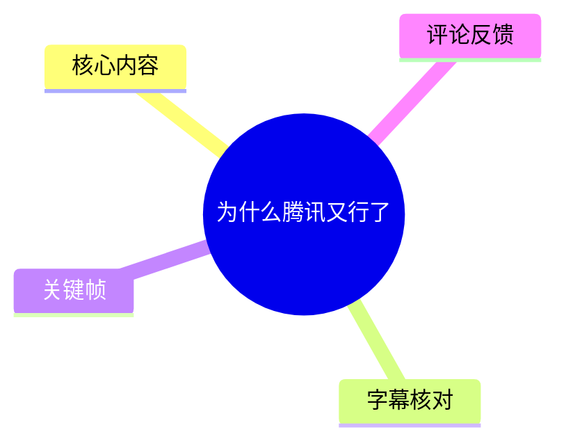
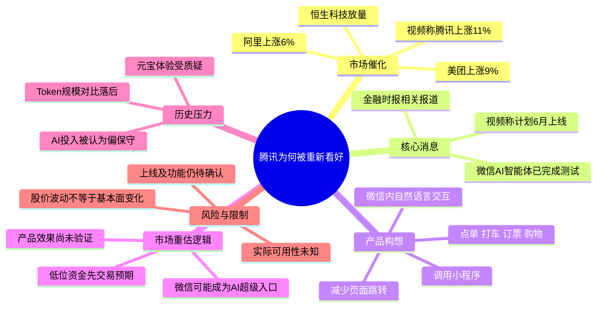

# 为什么腾讯又行了

> 来源：[Bilibili 视频](https://www.bilibili.com/video/BV1sFVz6XEJv)<br>
> UP 主：创业投资钱博士｜发布时间：2026-06-02｜视频时长：02:07｜竖屏 1080×1920

## 小结

视频围绕“腾讯为什么又行了”展开，核心催化剂是 UP 主援引《金融时报》相关报道所作的判断：腾讯基于微信的 AI 智能体据称已完成测试，并计划于 2026 年 6 月上线。视频将这一消息与腾讯当日股价上涨、恒生科技板块放量联系起来，认为市场开始重新评估腾讯的 AI 入口价值。

视频所描述的产品路径并非单纯聊天机器人，而是嵌入微信界面的智能体：用户以自然语言发起需求，系统调用小程序完成点单、打车、订票、购物等任务，目标是减少跨应用跳转。若能落地，这意味着微信可能从社交工具进一步成为 AI 驱动的服务入口。

UP 主同时回顾了腾讯此前 AI 叙事偏弱的市场印象：元宝的使用体验、调用规模和大模型竞争力受到质疑，腾讯股价也曾出现较大回撤。但视频强调，腾讯基本经营数据与估值未必差，市场更在意的是其 AI 能力与投入决心。

投资逻辑上，视频给出的并不是“产品已经成功”的结论，而是“低位资金愿意先交易预期”：产品尚未上线、体验尚未验证，但市场认可其方向。相应风险也很直接——若实际产品能力不足，预期可能迅速回落。

本文适合关注腾讯、微信生态、AI 智能体应用以及港股科技股预期交易的人阅读。需要特别注意：视频中的涨跌幅、估值、Token 调用量、上线时间及媒体报道均属于视频发布时点的陈述；其中多项未经本素材提供的原始财报、交易数据或官方公告独立核验，不能直接作为投资依据。

## 思维导图





## 目录

- [市场异动与讨论起点](#市场异动与讨论起点-0035)
- [微信 AI 智能体：从聊天到调用服务](#微信-ai-智能体从聊天到调用服务-0035)
- [腾讯 AI 叙事为何此前承压](#腾讯-ai-叙事为何此前承压-0100)
- [估值、资金与预期交易](#估值资金与预期交易-0124)
- [可复用的分析步骤](#可复用的分析步骤)
- [结论、限制与时效性](#结论限制与时效性)
- [字幕比对](#字幕比对)
- [评论分析](#评论分析)
- [关键帧索引](#关键帧索引)
- [处理记录](#处理记录)

## 市场异动与讨论起点 [00:35](https://www.bilibili.com/video/BV1sFVz6XEJv?t=35)

> 时间依据：本次 ASR/SRT 的首段真实起止时间为 `00:00:35,060 --> 00:00:35,980`。但该段在不足 1 秒的时间窗内塞入了大量语句，时间粒度明显过粗；以下时间链接仅按素材提供的 ASR 时间戳定位，不将其误认为逐句精确对齐。

视频开头以当日市场表现建立讨论背景。UP 主口述称：

- 腾讯“直接暴涨 11%”；
- 美团上涨 9%；
- 阿里上涨 6%；
- 恒生科技“放量起飞”；
- 京东、B 站、小米等股票也受到板块情绪带动。

其中，美团上涨被视频归因于此前讨论过的“外卖大战胜负已分”；但该部分没有在本视频中展开论证。因此，本片真正聚焦的是腾讯，而不是对外卖行业进行完整分析。

这些数字在视频中承担的是**市场情绪与资金行为的背景**，并不自动证明上涨由单一消息造成。短线股价和成交量可能同时受到指数、行业、宏观流动性、机构调仓及新闻预期等多重因素影响。


> 图：该关键帧显示视频开篇的口播形式与“美团跟着涨了 9%”字幕。它说明视频先用板块异动作为叙事入口，再转向腾讯的 AI 预期；对理解该视频是财经观点短评而非产品发布会很有帮助。

## 微信 AI 智能体：从聊天到调用服务 [00:35](https://www.bilibili.com/video/BV1sFVz6XEJv?t=35)

视频援引《金融时报》报道，称腾讯“基于微信”的 AI 智能体已经完成测试，并称将在 6 月上线。关键帧中可见英文报道标题大意为：腾讯接近为拥有约 14 亿中国用户的微信推出 AI Agent。画面中的中文叠字则写有“6 月就上线了”。


> 图：这张图是视频中最直接的消息来源呈现。其价值在于区分“视频作者的解读”与“作者援引的媒体报道”：画面只能表明视频引用了该报道，不能替代腾讯官方公告或正式产品说明。

### 视频所述能力链路

UP 主描述的交互方式是：

1. 用户留在微信（口语称“绿泡泡”）界面；
2. 通过自然语言提出任务；
3. AI 智能体理解任务并自动调用小程序；
4. 在不频繁跳转页面的前提下完成服务操作。

视频列举的服务场景包括：

| 场景 | 视频中的描述 | 智能体需要完成的关键动作 |
| --- | --- | --- |
| 餐饮 | 点单 | 理解地点、人数、口味、预算等需求，并选择相应小程序 |
| 出行 | 打车 | 获取上车点、目的地、车型等信息，发起订单 |
| 出行/消费 | 订票 | 理解时间、路线、乘客等约束，进入相应服务流程 |
| 零售 | 购物 | 基于商品需求、价格、收货信息等执行搜索与下单 |

视频声称该系统可调用“超过百万小程序”。这是一项规模化生态能力的表述，而非本素材中可逐项验证的产品参数。即使调用能力存在，实际体验仍取决于小程序接口开放程度、智能体权限边界、支付确认机制、错误处理、隐私授权及售后责任划分。


> 图：画面中的场景字幕将抽象的“AI 智能体”具体化为高频生活服务任务。这有助于理解视频的重点不是模型参数竞争，而是微信生态内的任务执行与服务分发。

### 为什么它会被称作“AI 超级入口”

UP 主的核心推论是：若微信智能体面向约 14 亿月活用户规模落地，微信就可能从社交工具“升级”为 AI 超级入口。

这一推论包含三层逻辑：

- **用户基础**：微信已有高频使用习惯，用户不必专门下载、打开一个新的 AI 应用；
- **服务供给**：小程序生态提供大量可被编排的服务入口；
- **任务闭环**：AI 若能把“理解意图—匹配服务—执行操作”连起来，入口价值会高于只回答问题的聊天产品。

但“入口”不等于“收入”或“壁垒”。智能体是否能提高交易转化、广告效率、支付频次或小程序服务效率，视频没有给出收入模型、成本结构、用户留存等后续证据。

## 腾讯 AI 叙事为何此前承压 [01:00](https://www.bilibili.com/video/BV1sFVz6XEJv?t=60)

视频认为，资本市场此前对腾讯 AI 的评价较低，是腾讯股价承压的重要原因之一。UP 主的叙述集中在三方面。

### 1. 同业规模比较带来的落差

视频称，当“豆包日调用 Token 已超过 120 万亿”时，腾讯元宝的规模仅为“3 万亿”左右。由于 ASR 在专有名词和数量单位上有明显错识别，原文中的“元宝”“Token”“120 万亿”“3 万亿”已结合语境及视频主题作谨慎整理；但本素材未提供对应统计报告，不能确认统计口径是否一致。

这种比较的含义是：市场常将大模型产品的调用规模视为用户使用、开发者生态或产品渗透率的信号。但 Token 数量不是完整商业质量指标，原因包括：

- 不同产品的统计周期、用户构成、模型长度与调用方式不同；
- Token 消耗可由长上下文、Agent 链路、开发接口等显著放大；
- 高调用量不必然等于高留存、低成本或可持续盈利；
- 面向消费者的聊天应用与面向企业/API 的调用量不宜简单横比。

### 2. 元宝产品体验受到质疑

UP 主以强烈且带贬义的比喻评价元宝体验，表达的实质是：用户可能认为其回答或任务完成能力不足，资本市场因此认为腾讯在 AI 产品化上落后于竞争对手。

这一部分属于作者评价，而不是基于可复现测试得出的结论。要验证“体验是否落后”，至少需要明确：

- 测试模型、版本与测试日期；
- 提问集或任务集；
- 是否联网、是否开启工具调用；
- 成功率、响应时间、幻觉率与人工修正次数；
- 与竞品的同条件对比。

### 3. 股价回撤与 AI 预期的关联

视频称腾讯股价曾从 675 跌至 420，回撤超过 30%，并将主因概括为“AI 太拉胯”“大模型不行”“资本投入特别抠门”。

这里需要将**市场叙事**与**因果结论**分开：

- 视频确实提出了“AI 预期弱导致估值承压”的解释；
- 但股价回撤通常无法仅用一个因素完整解释；
- 腾讯的游戏、广告、金融科技、企业服务、监管环境、宏观风险偏好、港股资金流向等，也可能共同影响估值和股价。

因此，视频的价值在于呈现当时市场如何讨论腾讯，而不是提供已被严格证明的单因果归因。

## 估值、资金与预期交易 [01:24](https://www.bilibili.com/video/BV1sFVz6XEJv?t=84)

> 本节标题链接仍以 ASR 段落起点定位。提供的 SRT 第 4 段从 `00:01:24,300` 开始，但其中包含前文语句，反映 ASR 分段与真实语速不匹配；不据此虚构逐句发生时刻。

UP 主提出一个反问：“腾讯真的差吗？”并给出两项判断：

- 一季度净利润同比增长 21.5%；
- 对应 2026 年估值约 15 倍，低于海外同行，在中概/港股语境中被认为偏便宜。

这些数字构成视频的估值逻辑：**基本面并不差，但 AI 叙事拖累估值；一旦 AI 入口预期改善，估值可能修复。**

随后，视频称腾讯当日“放量大涨 11%”，成交量仅次于“去年 4 月 8 日官宣战那天”（该事件名称在 ASR 中不清晰，未作臆测性补全）。UP 主由此判断，资金开始认可腾讯的 AI 路线。

### 视频的预期交易框架

可以将作者逻辑整理为如下链条：

```text
微信 AI 智能体消息
        ↓
市场认为腾讯具备 AI 入口潜力
        ↓
原先偏低的 AI 预期出现修复
        ↓
资金在低估值位置提前交易上线预期
        ↓
股价与成交量同步走强
```

作者明确保留了结果不确定性：产品还没有正式上线，“好用不好用没人知道”。但在其观点中，资金愿意先“假装你行”，即先对潜在成功定价；若上线后仍无法满足需求，资金就会撤离。

这也是本片最值得迁移的财经分析经验：**区分“预期改善”与“业绩兑现”。** 前者可以推动短期估值重估，后者才决定中长期逻辑能否成立。

## 可复用的分析步骤

本视频没有演示软件操作、代码或模型部署流程，但其观点可被整理成一套审视“AI 消息驱动股价”的分析步骤。

### 步骤 1：确认消息层级

依次辨别消息来自：

1. 公司官方公告、发布会或产品页面；
2. 权威媒体报道；
3. 产业链传闻或市场转述；
4. 自媒体二次解读。

本视频的直接信息链是“UP 主引用《金融时报》报道”，而非素材中展示的腾讯正式公告。实际研究时，应回到原报道及腾讯官方信息核对上线范围、日期和功能。

### 步骤 2：把产品能力拆成可验证环节

对“微信 AI 智能体”这类产品，不能只问“是否有 AI”，而应逐项检查：

| 环节 | 应验证的问题 |
| --- | --- |
| 意图识别 | 能否稳定理解多约束、多轮任务？ |
| 服务选择 | 能否选对小程序或服务商？ |
| 工具调用 | 是否真的具备可执行接口，而非只提供跳转建议？ |
| 交易确认 | 涉及下单、支付时，用户确认与授权如何处理？ |
| 失败恢复 | 缺货、定位失败、订单失败时如何纠错？ |
| 数据与隐私 | 位置、联系人、支付、订单等数据如何授权和保护？ |
| 生态激励 | 小程序开发者是否愿意开放接口并承担适配成本？ |

### 步骤 3：区分流量入口、使用量与商业化

视频强调微信用户规模和小程序数量，但分析中应避免把这些概念混为一谈：

- **用户规模**：理论可触达的人群；
- **使用量**：真正使用智能体的人数、频率和任务数；
- **成功率**：请求能否被可靠完成；
- **商业化**：是否改善广告、支付、交易佣金、云服务或企业服务收入；
- **成本**：模型推理、工具编排、客服、风险控制与生态补贴成本。

只有后四项得到持续验证，“超级入口”的商业价值才更具实质。

### 步骤 4：用“预期—验证—修正”追踪市场

可采用三个观察节点：

1. **预期阶段**：媒体报道、产品传闻、市场先行定价；
2. **发布阶段**：上线地区、人群、功能边界、合作方及实际演示；
3. **验证阶段**：活跃用户、任务完成率、留存、成本、变现与监管反馈。

视频主要处于第一阶段。此时不宜把股价上涨直接等同于产品成功。

## 结论、限制与时效性

视频给出的结论是：腾讯被重新看好，并不是因为其 AI 产品已被证明成功，而是因为微信 AI 智能体消息让市场重新看到腾讯在 AI 应用入口上的可能性。微信的用户规模、小程序生态与高频服务场景，共同构成了这一预期的基础。

从产品角度看，视频最有价值的部分是指出 AI 的潜在形态：不只“回答问题”，而是代替用户在生态内完成实际任务。点单、打车、订票、购物等高频服务，若能被可靠编排，确实比孤立聊天功能更接近可衡量的用户价值。

但该逻辑面临明确限制：

- 视频称“6 月上线”，但本素材没有腾讯官方公告、产品截图或实际试用记录；
- “完成测试”“调用超过百万小程序”“约 14 亿月活用户”等说法需要追溯原始报道或官方资料确认；
- 视频中的市场涨跌、利润增速、估值、Token 调用规模均未在素材内附带数据来源与统一口径；
- 大模型/智能体能否规模化执行交易型任务，受制于权限、隐私、支付确认、服务接口与异常处理；
- 股价上涨可以交易预期，但预期交易一旦缺乏产品兑现，也可能逆转。

时效性方面，本视频发布于 2026 年 6 月 2 日，讨论的是当时的新闻和市场反应。对于“6 月上线”的预测，应以之后的腾讯官方公告、微信实际功能、产品覆盖范围及真实用户反馈为准。本文不构成任何投资建议。

## 字幕比对

| 字幕来源 | 完整性 | 专有名词 | 时间轴 | 主要问题 |
| --- | --- | --- | --- | --- |
| Bilibili 站内字幕 | 无可用字幕 | 无法评估 | 无法评估 | 素材记录显示字幕工具返回 `Invalid URL`，未提供可用站内字幕文本 |
| 本次 ASR 字幕 | 覆盖 90.82 秒，约占视频 72.06% | 存在较多错识别 | 有 SRT 时间戳，但分段异常粗糙 | 首段从 35.06 秒开始；5 个分段分别容纳大量长文本，与标注时长明显不匹配；“腾讯/元宝/Token/金融时报”等词存在误识别 |

### 本次 ASR 检查结果

- ASR 模型：`medium`
- 识别语言：中文，语言置信度 `0.99951171875`
- 音频时长：`126.0379375` 秒
- 语音覆盖：`90.82` 秒
- 首次识别到语音：`35.06` 秒
- 最后识别到语音：`125.88` 秒
- 素材未标记 `noAudioStream=true`，且提供了 `audio/audio.wav`，因此不能称源视频无音轨。

### 最终字幕选择与校正原则

最终以**本次 ASR 的时间戳**作为章节链接依据，因为没有可用的站内字幕；但不将其文本逐字视作可靠转写。处理时采用以下校正原则：

- 将 ASR 中的“腾逊/腾信/腾询”统一按语境整理为“腾讯”；
- 将“英国金融职报”按关键帧中的报纸页面整理为“《金融时报》”；
- 将“元宁”等明显误识别按语境整理为“元宝”；
- 保留“Token”这一术语，但不对 ASR 中的具体规模数字进行超出视频表述的推断；
- “去年 4 月 8 日官说战”无法从素材可靠恢复原词，故保留其为 ASR 不清晰事件，不臆测补写；
- 关键帧用于核对画面上明确可见的英文标题、中文叠字和场景词，不能据此补充画面外未出现的产品细节。

## 评论分析

以下仅处理可获取的热评前三条。评论反映观众观点，不构成已经核验的事实或投资结论。

### 1. joshY（979 赞）

评论认为，“Token 叙事逻辑已经开始崩溃”，并声称亚马逊、微软在缩减 Token 开支；其进一步推论是，AI 替代人工未必降低整体成本，反而可能让腾讯这类在 AI 赛道起步较慢、但基本盘稳健的公司成为赢家。

- **补充价值**：提出了一个重要的商业化问题——局部自动化效率不必然等于整体收益提升。这与视频只比较 Token 调用规模形成互补。
- **争议与限制**：关于亚马逊、微软缩减开支及 AI 成本变化的说法，评论未给出处、时间范围和统计口径，不能直接采信。
- **与视频关系**：该评论弱化“调用规模越大越好”的叙事，更重视现金流、成本和利润兑现。

### 2. 熊吉KUN（208 赞）

评论认为腾讯上涨“无他，跌多了而已”，并表示 AI 应用若普遍“赔本赚吆喝”，最终将是现金流更稳、实力更雄厚的公司胜出；还以美股“七姐妹”为例，强调成熟互联网巨头仍可能在新技术周期中获胜。

- **补充价值**：将视频的“低估值+预期修复”逻辑延伸到资产负债表、现金流和长期竞争耐力。
- **争议与限制**：“跌多了”只是对股价的单一解释；“AI 应用全都赔本”也是泛化判断，评论未提供行业数据支持。
- **与视频关系**：与 UP 主“腾讯基本面并不差、AI 预期拖累估值”的观点部分一致，但更强调估值位置而非产品消息本身。

### 3. cc同学不吃土（113 赞）

评论指出：“涨了就叫又行了，跌了又叫不行了，一周反复横跳，公司啥也没变。”其核心是在质疑财经内容以短期价格波动反推公司质量的叙事方式。

- **补充价值**：提醒读者避免把日度市场表现直接等同于公司长期经营能力。
- **争议与限制**：公司并非“什么都没变”；新闻、预期、资金流和估值要求都会变化。更准确的说法应是：短期股价变化未必足以证明基本面已发生实质改变。
- **与视频关系**：该评论直接构成对本视频标题和短期市场归因的反思，提示应持续跟踪产品上线后的真实数据。

## 关键帧索引

| 关键帧 | 正文位置 | 画面信息 | 选择价值 |
| --- | --- | --- | --- |
|  | 市场异动与讨论起点 | UP 主口播，“美团跟着涨了 9%”字幕 | 直观呈现视频以科技股联动上涨切入的叙事背景 |
|  | 微信 AI 智能体 | 《金融时报》报道页面与“6 月就上线了”叠字 | 是视频展示消息来源和上线预期的关键画面 |
|  | 微信 AI 智能体 | “点单打车订票购物”字幕 | 将 AI Agent 的价值落到具体服务调用场景，便于理解产品路径 |

## 处理记录

- Worker ID：`worker-mrj0www4-e8d79408`
- 主模型：`gpt-5.6-terra`
- ASR 模型：`medium`（CUDA / `float16`，自动识别中文）
- 使用的应用工具与素材：视频信息读取、音频提取（`audio/audio.wav`）、关键帧抽取（`frames/`）、ASR 转写（`asr/transcript.srt`、`asr/asr-result.json`）、评论读取（`comments/comments.json`）。
- 站内字幕检查：已检查；素材明确说明未提供可用站内字幕，字幕工具曾返回 `Invalid URL`。这属于站内字幕获取失败，非“视频没有音轨”。
- 字幕选择：以本次 ASR 为唯一可用时间轴来源；结合关键帧对“腾讯”“《金融时报》”“元宝”等明显误识别进行有限校正。ASR 分段时间与文本量不匹配，故仅用于章节级定位，不用于逐句精确定位。
- 关键帧选择依据：优先选取实际承载论点的画面，包括市场异动字幕（`frame-001.jpg`）、媒体报道截图（`frame-003.jpg`）和智能体生活服务场景（`frame-004.jpg`）；未将未展示的关键帧内容作为事实引用。
- 缓存清理：提供的素材清单未包含缓存清理命令、日志或结果，无法确认是否已执行；本文不虚构清理完成状态。
- 未解决问题：无法基于现有素材独立核验腾讯实际涨幅、估值、利润增速、Token 调用量、智能体上线日期与功能范围；“去年 4 月 8 日”所指事件的 ASR 原文不清晰，未作猜测性还原。
