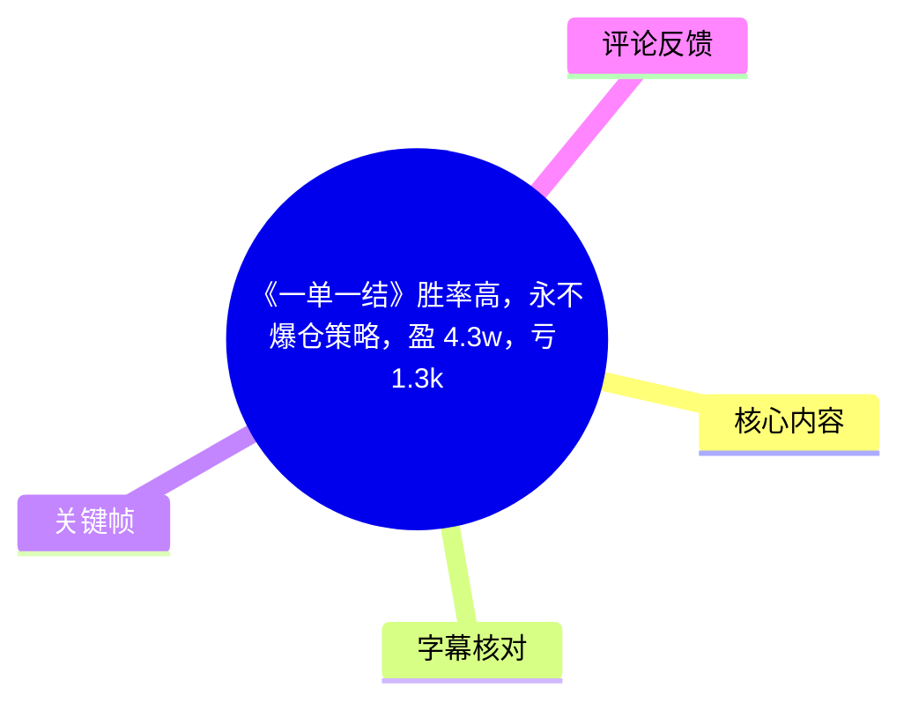
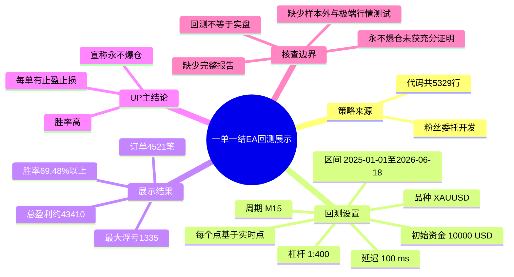
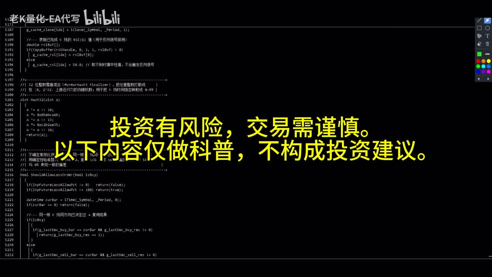
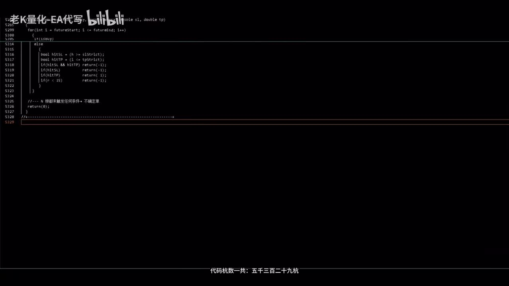
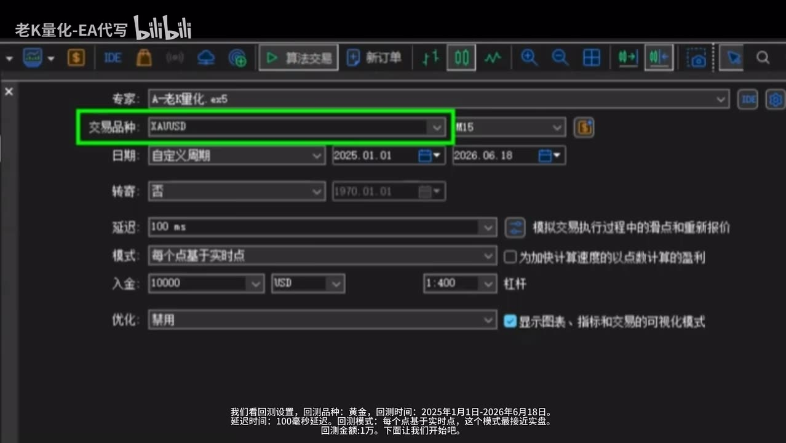
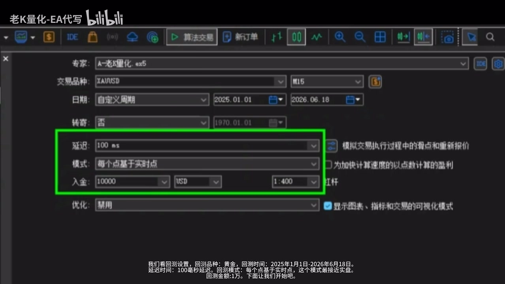

# 《一单一结》胜率高，永不爆仓策略，盈:4.3w，亏:1.3k》

> 来源：[Bilibili 视频](https://www.bilibili.com/video/BV1aTji6wEUT) 
> UP 主：老K量化-EA代写｜发布时间：2026-06-18｜视频时长：97 秒  
> 标签：EA、趋势策略、XAUUSD、外汇、量化交易、美黄金、自动交易、马丁策略、一单一结

## 小结

视频展示了一款由粉丝委托编写的“一单一结”自动交易策略（EA）的历史回测。UP 主称该策略代码共 **5,329 行**，并在 MetaTrader 风格的测试器中演示黄金 `XAUUSD`、`M15` 周期下的回测设置与结果。

回测设置为：测试区间 **2025-01-01 至 2026-06-18**，初始资金 **10,000 USD**，延迟 **100 ms**，模式为“每个点基于实时点”；画面还能看到杠杆设为 **1:400**。这些设置决定了结果的解释边界：回测并不等同于实盘，尤其会受到点差、滑点、流动性、实际成交、经纪商报价和风控规则影响。

视频口述和站内字幕给出的主要回测指标包括：总盈利约 **43,410**、最大浮亏 **1,335**、交易笔数 **4,521 笔**、胜率 **69.48% 以上**。标题中的“盈 4.3w、亏 1.3k”与这些指标大体对应；但字幕中出现“4万3400亿”的明显识别/转写异常，应以最终报告口述的“43,410”及标题“4.3w”为更合理的记录，且视频未展示完整报表字段，币种、净利润定义、手续费和点差细节仍需进一步核验。

UP 主将策略特点概括为“每单都有止盈止损、胜率高、永不爆仓”。其中，“每单均设止盈止损”属于视频明确陈述；“胜率高”是基于该次回测的结果描述；“永不爆仓”则是强结论，视频没有展示极端行情压力测试、样本外测试、实盘净值、风控阈值或不同杠杆下的验证，因此不能据此推导该策略在任何市场环境下均不会爆仓。

这份内容适合希望理解 EA 回测展示、核查回测参数与识别量化策略宣传边界的读者。它不是可复现的策略说明书：视频没有公开入场逻辑、止盈止损数值、仓位算法、是否使用加仓/马丁、交易成本假设和完整回测报告。

## 思维导图

## 目录

- [风险提示与策略来源（00:00）](#风险提示与策略来源0000)
- [回测环境与参数（00:15）](#回测环境与参数0015)
- [加速测试与资金曲线展示（00:34）](#加速测试与资金曲线展示0034)
- [订单记录与最终指标（00:49）](#订单记录与最终指标0049)
- [策略主张、可操作经验与限制（01:15）](#策略主张可操作经验与限制0115)
- [时效性与结果解读](#时效性与结果解读)
- [字幕比对](#字幕比对)
- [评论分析](#评论分析)
- [处理记录](#处理记录)

## [风险提示与策略来源（00:00）](https://www.bilibili.com/video/BV1aTji6wEUT?t=0)

视频一开始明确提示：“投资有风险，交易需谨慎；以下内容仅做科普，不构成投资建议。”这一定义了内容性质：视频是在展示一次策略回测，而非对收益或风险的承诺。

UP 主自称“老K”，称该 EA 是“粉丝委托我写的一款一单一结策略”，并称代码行数为 **5,329 行**。画面中可见代码编辑器末段，底部字幕也标注“代码行数一共：五千三百二十九”。

> 图：画面同时呈现代码编辑器、风险提示以及 5,329 行附近的行号。这一帧的价值在于确认视频展示的是编程实现的 EA，并保留了“仅科普、不构成投资建议”的原始免责声明；但仅凭代码画面无法验证交易逻辑质量或收益可实现性。

“**一单一结**”在本视频中的可确认含义主要来自 UP 主后续说明：每笔订单都有对应的止盈与止损。视频没有详细解释其入场条件、单笔持仓时长、是否同向叠加、手数递增规则或是否实际使用马丁。因此，虽然元数据标签中包含“马丁策略”，也不能仅据标签断定该 EA 的具体马丁规则。

> 图：该帧显示代码文件接近末尾的位置，以及“代码行数一共：五千三百二十九”的屏幕字幕。它能佐证开发规模的展示，但代码行数不是策略稳健性、可维护性或盈利能力的证明。

## [回测环境与参数（00:15）](https://www.bilibili.com/video/BV1aTji6wEUT?t=15)

UP 主随后进入回测设置界面，并按站内字幕依次说明参数。结合屏幕画面，可整理如下：

| 项目 | 视频展示值 | 证据与说明 |
| --- | --- | --- |
| 测试品种 | `XAUUSD`（黄金） | 画面交易品种栏显示 `XAUUSD`；口述称“黄金”。 |
| 图表/测试周期 | `M15` | 设置界面右侧周期栏可见 `M15`。 |
| 回测区间 | 2025-01-01 至 2026-06-18 | 站内字幕和屏幕日期栏一致。 |
| 延迟 | 100 ms | 站内字幕称“延迟时间100ms”，画面显示 `100 ms`。 |
| 测试模式 | 每个点基于实时点 | UP 主称其“最接近实盘”。这只是对测试建模逼真度的描述，不等价于真实成交。 |
| 初始资金 | 10,000 USD | 口述为“回测金额1万”，画面入金栏显示 `10000 USD`。 |
| 杠杆 | 1:400 | 画面右侧杠杆下拉框可见 `1:400`。 |
| 优化 | 禁用 | 画面“优化”栏显示“禁用”。 |

> 图：该帧清楚展示专家程序、`XAUUSD` 品种、`M15` 周期及 2025-01-01 至 2026-06-18 的测试日期，是核对测试对象与时间样本的关键证据。

> 图：绿色框强调延迟 `100 ms`、模式“每个点基于实时点”、入金 `10000 USD` 与杠杆 `1:400`。这些参数直接影响回测成交模拟、资金使用和风险暴露，因此比单独展示收益数字更具解释价值。

### 参数解读与复核要点

1. **XAUUSD 与 M15 仅限定了本次测试场景**  
   视频未显示该策略在其他货币对、其他黄金报价源或其他周期上的表现，不能外推为全品种有效。

2. **“每个点基于实时点”不等于实盘**  
   该模式相较粗粒度 K 线建模通常更细，但实盘仍存在报价差异、滑点突变、拒单、流动性缺失、网络延迟和佣金变化等问题。视频没有展示实际点差、佣金、隔夜利息或滑点设置。

3. **100 ms 延迟与 1:400 杠杆是不可忽略的条件**  
   延迟会影响模拟下单价格；高杠杆会放大资金利用率与风险。若实盘账户的杠杆、执行规则或点差不同，回测结果可能不能直接迁移。

4. **缺失可复现参数**  
   视频没有给出 EA 输入参数、仓位大小、风险百分比、开仓过滤条件、止损止盈距离和最大持仓限制，外部读者无法据此独立复跑结果。

## [加速测试与资金曲线展示（00:34）](https://www.bilibili.com/video/BV1aTji6wEUT?t=34)

UP 主称“为了节省时间，我们加速看最后结果”，随后表示回测结束，并展示资金曲线图。其口述解释为：

- 账户盈利曲线上涨；
- 账户亏损曲线下跌；
- 因此认为曲线“非常漂亮”。

这里应区分**画面描述**与**风险结论**：

- 视频确实展示并评价了资金曲线；
- 一条外观平滑或向上的曲线只能说明该测试配置下的历史结果，不能单独证明策略对未来市场、不同执行环境或尾部行情具有稳健性；
- 视频没有披露最大回撤百分比、收益回撤比、夏普比率、利润因子、连续亏损次数、持仓时长分布等通常用于评价策略质量的指标。

## [订单记录与最终指标（00:49）](https://www.bilibili.com/video/BV1aTji6wEUT?t=49)

UP 主打开历史订单记录，先提到起始金额为 1 万，之后转入“最终的测试总报告”。依据站内字幕，视频列出的结果如下：

| 指标 | 视频陈述 | 解读边界 |
| --- | ---: | --- |
| 起始金额 | 10,000 | 画面与前述入金设置一致；货币栏显示 USD。 |
| 总盈利 | 43,410 | 站内字幕在 01:00-01:04 表述为“总盈利43410”；标题概括为“盈4.3w”。未展示完整报表，无法确认是净利润、总盈利还是其他统计口径。 |
| 最大浮亏金额 | 1,335 | 标题概括为“亏1.3k”。视频没有说明该值是否为绝对最大浮亏、最大回撤金额或浮动亏损峰值的具体定义。 |
| 交易订单数 | 4,521 笔 | 属于较高频的历史交易样本，但未披露交易分布、实际持仓重叠情况和成本。 |
| 交易胜率 | 69.48% 以上 | 胜率本身不能说明盈亏比；仍需结合平均盈利、平均亏损、最大单笔亏损和收益分布判断。 |

### 数值转写校正说明

站内字幕在 00:54-00:57 写作“总盈利金额4万3400亿”，本次 ASR 也将该处识别为“43400亿”。这与标题“盈:4.3w”、后续站内字幕“总盈利43410”以及上下文不一致，属于明显的文字/单位异常。本文记录为“**约 43,410**”，但不将其进一步解释为可验证的净收益金额，也不擅自补充币种、手续费或税费信息。

### 可迁移的回测核查步骤

视频所展示的流程可以整理成一套最基础的复核顺序：

1. 在测试器中确认 **品种、周期、日期范围**；
2. 记录 **初始资金、杠杆、延迟、建模模式**；
3. 运行测试后先查看资金曲线；
4. 打开历史订单，检查订单数量与交易序列；
5. 查看最终总报告，至少记录起始资金、收益、浮亏/回撤、订单数和胜率；
6. 在做结论前补查未展示的成本与风险字段，而不是只依据收益、胜率或单条曲线判断。

## [策略主张、可操作经验与限制（01:15）](https://www.bilibili.com/video/BV1aTji6wEUT?t=75)

UP 主将该策略的特点概括为：

- 每单都有止盈止损；
- 胜率高；
- “永不爆仓”。

之后，UP 主称赞粉丝的交易思路，并表示可联系其将交易思路“落地”，提供建议和优化方案。

### 视频中能够成立的陈述

- UP 主**宣称**策略为“一单一结”，且每单设置止盈止损；
- 在所展示的单一回测配置中，UP 主**报告**胜率为 69.48% 以上、最大浮亏金额为 1,335；
- 视频存在一个明确的策略开发/优化服务引导。

### 不应由视频直接推出的结论

1. **“永不爆仓”未被充分验证**  
   有止损并不自动保证不会爆仓。极端跳空、价格断层、滑点、流动性不足、保证金规则变化、多笔暴露及高杠杆都可能使实际结果偏离预设止损。

2. **高胜率不等于高质量收益**  
   若亏损单显著大于盈利单，或策略存在尾部风险，胜率较高仍可能出现严重回撤。视频没有展示盈亏比、利润因子、最大连续亏损和单日风险。

3. **单段历史回测不等于样本外验证**  
   该测试时间覆盖 2025-01-01 至 2026-06-18，但视频没有提供训练期与验证期切分、滚动回测、不同市场阶段对比，亦未展示实盘前向测试。

4. **回测报告信息不完整**  
   需要至少补齐点差、佣金、隔夜利息、交易服务器、报价源、EA 输入参数、每笔手数和仓位上限，才具备进一步判断条件。

## 时效性与结果解读

本视频的回测数据截止至 **2026-06-18**，发布信息也对应 2026 年 6 月。策略展示具有明显时效性：

- 回测区间结束后，黄金市场波动结构、流动性、点差和交易条件均可能变化；
- EA 的实际运行表现依赖经纪商环境和版本，视频未提供 EA 文件版本号、参数集或后续更新记录；
- 视频的统计仅适用于其展示的 `XAUUSD`、`M15`、100 ms 延迟、1:400 杠杆与 10,000 USD 入金组合，不能视为未来收益预测；
- 标题与口播中的“永不爆仓”应理解为 UP 主的宣传性主张，而非经独立审计的风险保证。

## 字幕比对

| 字幕来源 | 完整性 | 专有名词与数值 | 时间轴 | 主要问题 |
| --- | --- | --- | --- | --- |
| Bilibili 站内字幕 `p01-ai-zh.srt` | 覆盖 00:00.040-01:36.080，分段细，基本覆盖完整视频 | `XAUUSD` 在画面中可核；“一单一结”、5,329、100 ms、4,521、69.48% 等较完整 | 与视频 97 秒时长匹配，可直接用于章节定位 | “总盈利金额4万3400亿”显然与标题及后续“43410”矛盾；“永不爆仓”是原话，不能当成已验证事实。 |
| 本次 ASR 字幕（medium） | 诊断语音覆盖约 94.9%，共 5 个长分段 | 多处同音/识别错误，如“投赠建议”“一单一节”“回浙”“每个点基于10时点”“永不饱餐”；将收益误为“43400亿” | 有时间戳，但分段过长；且 ASR 最后时间到 01:34，视频尾部仍有极短尾音/音乐片段 | 专有名词、交易术语和数值准确性显著弱于站内字幕，不能直接作为正文依据。 |

### 最终字幕选择

正文以**站内时间轴字幕**作为主时间依据：其分段精细，且与视频时长匹配。已完成对本次 ASR 的检查，ASR 诊断显示音频语言为中文、`speechCoverage` 为 **0.949**，并**未标记 `noAudioStream=true`**，说明源视频存在可识别音轨。

对于以下内容，采用“站内字幕 + 关键帧画面 + 上下文”交叉校正：

| 原始异常文本 | 本文采用表述 | 校正依据 |
| --- | --- | --- |
| 一单一节 / 一班一截 | 一单一结 | 视频标题、站内字幕和上下文一致。 |
| 回浙 / 回浴 | 回测 | 视频主题与站内字幕语义一致。 |
| 每个点基于10时点 | 每个点基于实时点 | 站内字幕原文及设置画面。 |
| 指鹰止损 | 止盈止损 | 站内字幕原文及交易语境。 |
| 永不饱餐 | 永不爆仓 | 站内字幕原文。 |
| 43400亿 / 4万3400亿 | 约43,410 | 标题“盈4.3w”、后续字幕“总盈利43410”及上下文；但未将其视为完整报表已审计数值。 |

## 评论分析

仅处理本次可获取的热评前三条。评论是观众观点，不构成对策略或业绩的验证。

1. **三尺间11｜4 赞：“拟合到天上去了”**  
   - 观点：质疑策略可能存在过度拟合，即针对历史样本优化得过好、未来表现可能显著退化。  
   - 价值：指出了本视频最关键的验证缺口——未见样本外测试、滚动验证或实盘前向数据。  
   - 可信度边界：评论未给出参数、统计检验或复现结果，因此只能视作风险提醒，不能据此断定策略确实过拟合。

2. **BorysC｜2 赞：“出售吗？”**  
   - 观点：关注策略是否可以购买或取得。  
   - 价值：反映视频中的“联系我”“将思路落地”等表述容易被观众理解为存在服务或商业化可能。  
   - 可信度边界：视频没有公开售价、授权方式、交付内容、实盘支持范围或售后条款；不能据此判断策略是否实际出售。

3. **大波浪2024｜2 赞：“真能赚钱 他还在B站发什么视频”**  
   - 观点：对展示收益与内容发布动机持怀疑态度。  
   - 价值：提示读者区分“回测展示”“策略开发服务”“实盘持续盈利”三件不同的事。  
   - 可信度边界：该评论是动机层面的质疑，并未提供对 EA、UP 主或回测过程的具体反证，不能作为业绩真伪结论。

## 处理记录

- **Worker ID**：`worker-mrj0wbly-5dc4e50c`
- **模型**：`gpt-5.6-terra`
- **调用工具与素材**：视频元数据、关键帧提取结果、Bilibili 站内字幕 `p01-ai-zh.srt`、本次 ASR 的 `asr-result.json` 与 SRT、热评数据 `comments.json`。
- **字幕选择**：优先采用站内字幕作为时间轴与正文主文本；已检查本次 ASR。ASR 有音轨识别结果，语言为中文，未出现 `noAudioStream=true`；因 ASR 分段粗且术语、数值误识别较多，仅作为覆盖与交叉核验来源。
- **关键帧选择依据**：选用 `frame-001.jpg`、`frame-002.jpg` 记录风险提示与 5,329 行代码展示；选用 `frame-003.jpg`、`frame-004.jpg` 核验 `XAUUSD`、`M15`、日期范围、100 ms 延迟、10,000 USD 入金和 1:400 杠杆。未将未提供画面内容的关键帧臆测为报表证据。
- **数值处理**：对“4万3400亿/43400亿”保留字幕与 ASR 的异常事实，并结合标题与后续“43410”作上下文校正；未擅自补全收益币种、净利润口径或成本项目。
- **评论范围**：仅分析可获取的热评前三条，未扩展至其他评论。
- **缓存清理**：素材清单未提供实际缓存清理执行日志；本文不声称已执行文件删除或缓存清理。
- **未解决问题**：未提供完整测试总报告、EA 参数集、订单明细、点差/佣金/隔夜利息、仓位与风控规则、样本外测试、极端行情测试及实盘前向记录，因此无法独立验证“高胜率”与“永不爆仓”主张。
