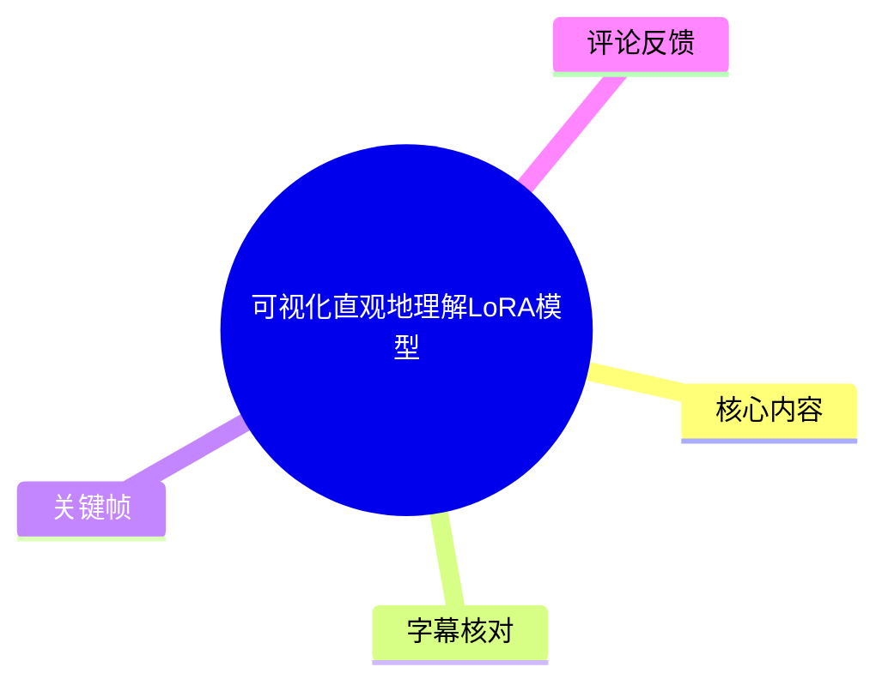
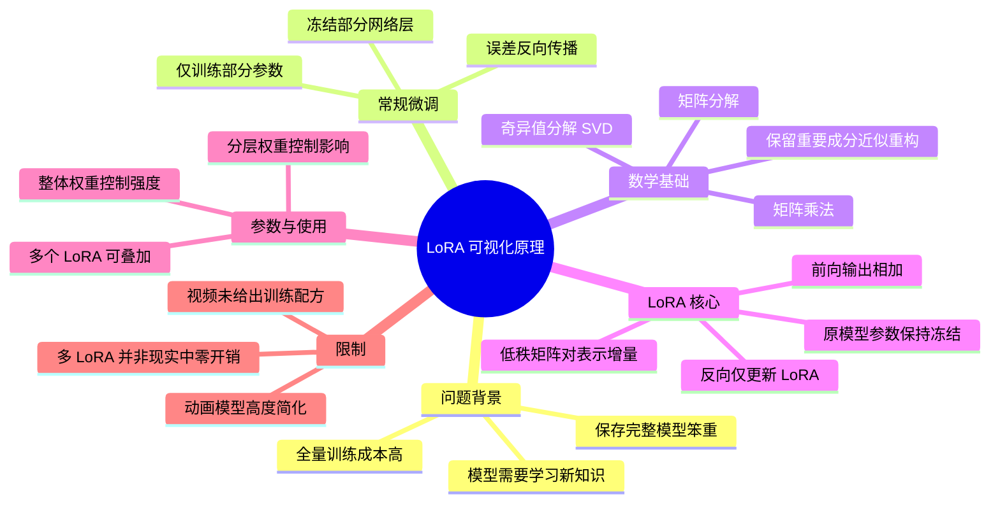
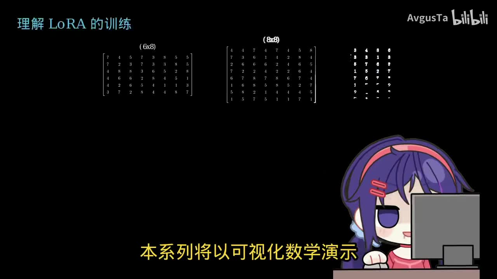
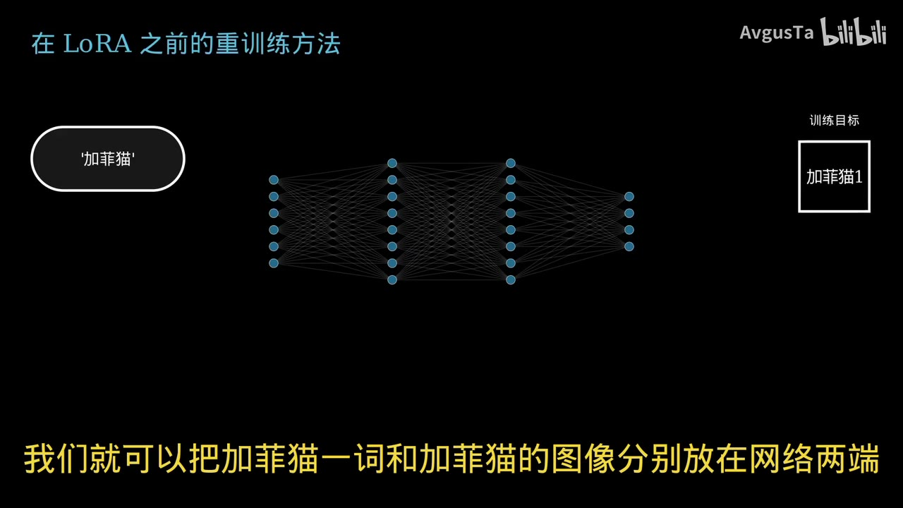
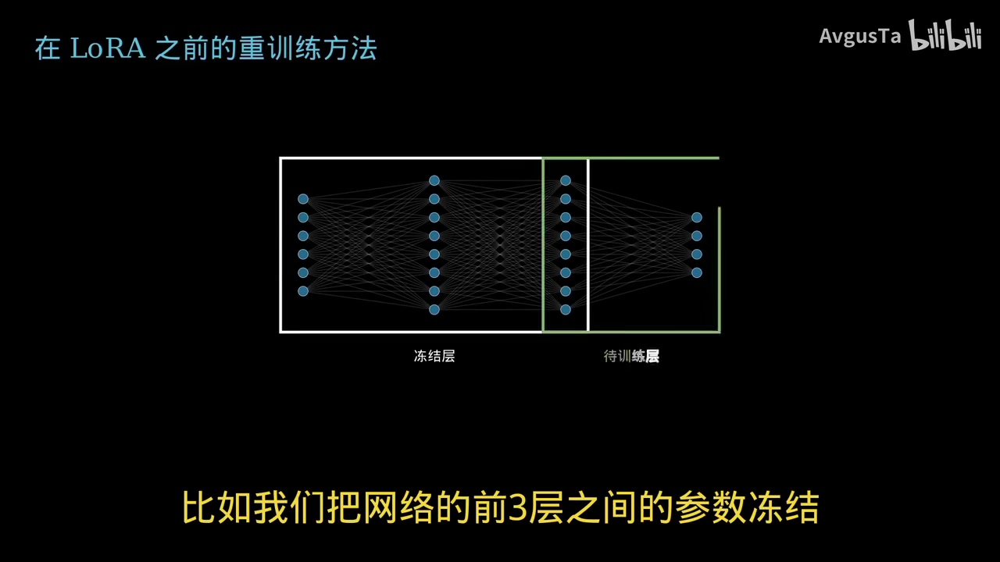
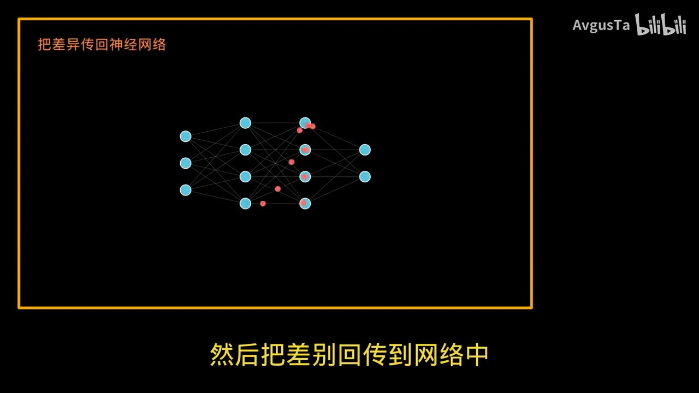

# 可视化直观地理解LoRA模型

> 来源：[Bilibili 视频](https://www.bilibili.com/video/BV1TADGBqEch)  
> UP 主：AvgusTa｜合集：AIcode｜时长：10 分 22 秒  
> 标签：科普、神经网络、SDXL、LoRA 模型、深度学习、3Blue1Brown、可视化数学  
> 说明：视频以“加菲猫”作为示例，借助矩阵分解和神经网络示意动画，解释 LoRA（Low-Rank Adaptation）的直觉性原理。

## 小结

视频围绕“如何以较低成本让已有模型获得新知识”展开。其主线是：全量微调需要更新大量原始参数；冻结部分层虽可减少训练量，但仍可能需要保存较大的模型文件；LoRA 则以低秩矩阵对的形式学习原模型参数的“增量”，将新增知识从底座模型中拆出保存。

作者先回顾神经网络训练：输入样本与目标输出经过网络产生预测，通过比较预测和目标之间的差异（误差），再将该差异反向传回网络，以调整参数。若要让模型理解“加菲猫”这一新概念，朴素方案是继续训练整个模型，但现实大模型参数规模高，成本很高。

视频的数学基础是矩阵乘法与奇异值分解（SVD）。作者用“将一个矩阵拆成多组较小矩阵相乘的结果，再按重要性权重叠加重构”的方式说明：如果只保留最重要的少数成分，也能近似保留原矩阵的大部分信息。灰度图示例中，原始 `30×30` 图像矩阵有 900 个数字；保留 4 组 `30×1` 与 `1×30` 的矩阵对，可用 240 个数字近似表达图像的主体信息。

映射到神经网络后，LoRA 不直接重新训练原始权重矩阵，而是为其增加低秩更新矩阵。训练时冻结原模型、仅让误差回传至 LoRA 参数；推理时，将原模型输出与 LoRA 分支输出相加。这样，LoRA 学到的可以理解为“目标知识相对于底座模型已有知识的差值”。

视频还说明了 LoRA 权重的作用：将 LoRA 更新整体乘以较小权重，例如 `0.5`，会减弱新增知识对结果的影响；不同层的 LoRA 矩阵也可设置不同权重，例如 `0.8`、`0.6`、`0.2`，以控制其对不同网络层的影响。

需要注意，视频是概念可视化而非训练教程：没有提供代码、数据集规模、学习率、rank、alpha、训练步数或具体 SDXL 工作流。视频末尾“叠加多少 LoRA 都一样快”的表述适合作为其动画结构下“无需替换底座模型”的直觉说明，但不应直接视为现实部署中的严格性能结论：实际多 LoRA 叠加仍可能带来额外矩阵计算、显存占用、加载及调度开销。

## 思维导图

## 目录

- [视频定位与问题背景](#视频定位与问题背景)
- [从全量训练到冻结层训练](#从全量训练到冻结层训练)
- [矩阵乘法：低秩表示的直觉](#矩阵乘法低秩表示的直觉)
- [SVD、重要性权重与灰度图近似](#svd重要性权重与灰度图近似)
- [LoRA 如何压缩神经网络参数表示](#lora-如何压缩神经网络参数表示)
- [LoRA 的训练流程](#lora-的训练流程)
- [推理、权重与多 LoRA 叠加](#推理权重与多-lora-叠加)
- [参数、步骤与实践边界](#参数步骤与实践边界)
- [结论、限制与时效性](#结论限制与时效性)
- [关键帧索引](#关键帧索引)
- [字幕比对](#字幕比对)
- [评论分析](#评论分析)
- [处理记录](#处理记录)

## [视频定位与问题背景](https://www.bilibili.com/video/BV1TADGBqEch?t=0)

视频开场说明，本期受 3Blue1Brown 可视化数学风格启发，目标是以尽量低门槛的图形化方式理解 AIGC 基础设计中的 LoRA 原理。作者将 LoRA 概括为同时具备以下特点的方法：

1. **较低训练算力需求**：不必更新底座模型的全部参数。
2. **较小文件体积**：新知识以较小的低秩参数增量保存。
3. **灵活使用**：可在原模型基础上加载或叠加 LoRA。
4. **适合为已有模型补充信息、知识或任务能力**：视频使用“加菲猫”这一概念作为示例。

视频提出的前置问题是：**一个模型如何获得此前没有获取的信息或知识？**

作者回顾了一般神经网络训练过程：将输入内容与希望得到的目标内容放在网络两端，网络产生预测；随后比较预测结果与目标结果，得到差异，并将该差异反馈到网络中，使各节点连接所代表的参数得到调整。重复这一过程，预测会逐渐接近训练目标。

> 图：画面明确标出“理解 LoRA 的训练”，并用矩阵和角色动画建立视频的讲解风格。它有助于确认本视频聚焦的是原理可视化，而不是具体软件界面的操作教学。

## [从全量训练到冻结层训练](https://www.bilibili.com/video/BV1TADGBqEch?t=51)

若希望模型在看到“加菲猫”一词时生成加菲猫图像，视频给出的朴素训练思路是：

1. 将“加菲猫”文本作为输入；
2. 将加菲猫图像作为训练目标；
3. 网络进行预测；
4. 将预测输出与目标图像进行比较；
5. 把差异回传到网络，反复调整参数；
6. 经多轮包含加菲猫图像的训练后，模型可逐渐将该词与目标概念建立关联。

问题是，若对已训练好的大型网络进行全量再训练，网络中所有参数都可能需要参与梯度计算与更新。视频强调，面对现实中参数可达数亿乃至更多的模型，这会带来较高训练成本。

在 LoRA 出现前，视频提到一种常见的降成本方式：**冻结网络中的若干层，只训练少数层的参数**。动画示例中，前 3 层之间的参数被冻结，仅训练后续层间参数。如此一来，反向传播时只需针对待训练部分计算和调整，从而减少计算量。

> 图：左侧输入为“加菲猫”，中间为多层神经网络，右侧为训练目标。该帧直观展示了“文本输入—网络预测—目标图像”的监督训练关系，是理解后续 LoRA 仅学习增量的前提。

> 图：白框标注“冻结层”，绿框标注“待训练层”。这解释了冻结层微调如何降低训练计算量，也衬托出其仍需保存较大模型结构的局限。

不过，视频进一步指出，冻结部分层并未解决一个存储层面的痛点：每次为了让模型学习一种新知识，仍可能需要训练并保存一个完整或较大的模型副本，文件依然笨重。LoRA 要解决的正是“减少训练量”与“以小文件保留新增知识”这两个目标。

## [矩阵乘法：低秩表示的直觉](https://www.bilibili.com/video/BV1TADGBqEch?t=151)

在解释 LoRA 前，视频先用矩阵乘法建立直觉。

对于左矩阵 \(A\) 和右矩阵 \(B\)，结果矩阵 \(C=AB\) 中某一位置的数值，来自：

- 左矩阵对应行的元素；
- 右矩阵对应列的元素；
- 两者逐项相乘后求和。

例如，结果矩阵第一行第一列，等于左矩阵第一行与右矩阵第一列的点积。按同样方式计算所有行列组合，就能获得完整结果矩阵。

视频特别强调了一个重要现象：

- 当左矩阵只有一行、右矩阵只有一列时，结果只有一个数字；
- 当左矩阵为“多行一列”、右矩阵为“一行多列”时，即使两个因子矩阵都很“窄”，相乘后却可以产生更大的矩阵。

这为低秩表示提供了直觉：**一个较大的矩阵，有时可由两个较小矩阵的乘积近似表达。**

视频随后将大矩阵的构成视为多个“小型外积矩阵”的叠加：把左侧矩阵按列拆开，把右侧矩阵按行拆开；每一对“列向量 × 行向量”生成一个与原结果同尺寸的矩阵。将这些结果按位置相加，便等价于直接的矩阵乘法结果。

## [SVD、重要性权重与灰度图近似](https://www.bilibili.com/video/BV1TADGBqEch?t=245)

视频将前述“分解—叠加—重构”的技巧称为**奇异值分解（SVD，Singular Value Decomposition）**。其动画性表述是：

1. 将结果矩阵拆为多组矩阵成分；
2. 每个成分可生成与原矩阵同尺寸的局部结果矩阵；
3. 为不同成分赋予从大到小排列的权重；
4. 将各成分按其权重叠加，可重构原矩阵；
5. 权重越大，表示该成分对原矩阵整体信息越重要。

作者展示，当只叠加权重较高的少数矩阵时，结果已经接近完整矩阵。因此，若信息主要集中在少数重要成分中，便不需要保留全部成分来获得可用的近似。

### 灰度图示例中的明确参数

视频用灰度图解释矩阵近似：

| 项目 | 视频中的数值/描述 |
| --- | --- |
| 原图大小 | `30×30` 灰度图 |
| 原图矩阵元素数量 | `30×30=900` 个数字 |
| 保留的主要成分数量 | 4 组 |
| 每组因子形状 | `30×1` 与 `1×30` |
| 等价的合并形状 | `30×4` 与 `4×30` |
| 近似表示使用的数字数 | `4×30 + 4×30 = 240` |
| 视频结论 | 用 240 个数字表示原 900 个数字中绝大部分视觉内容 |

这里的“近似”非常关键：视频不是说 240 个数字可无损替代 900 个数字，而是说在展示的例子中，保留高重要度成分后，图像主体仍可被较好地还原。

## [LoRA 如何压缩神经网络参数表示](https://www.bilibili.com/video/BV1TADGBqEch?t=334)

视频将神经网络抽象成“节点”和“层间连接”。节点之间每条连接都有一个参数，某两层之间的全部连接参数可以排成一个矩阵。

例如：

- 第 3 层有 6 个节点；
- 第 4 层有 4 个节点；
- 层间连接总数为 `6×4=24`；
- 这 24 个参数可表示为一个 `6×4` 矩阵。

作者随后用一个 `8×12×12×8` 的简化网络说明参数压缩。按视频叙述，其三组层间连接矩阵可以理解为：

\[
8\times12,\quad 12\times12,\quad 12\times8
\]

原始参数量为：

\[
8\times12+12\times12+12\times8=96+144+96=336
\]

如果对每个参数矩阵保留 rank 为 2 的低秩表示，则三组矩阵可拆成：

\[
8\times2 \text{ 与 } 2\times12
\]

\[
12\times2 \text{ 与 } 2\times12
\]

\[
12\times2 \text{ 与 } 2\times8
\]

按照这些形状计算，低秩因子总数字数量为：

\[
(8\times2+2\times12)+(12\times2+2\times12)+(12\times2+2\times8)
=40+48+40=128
\]

因此，该简化例子可将原本 336 个参数的表示，转为 128 个低秩因子参数的表示，并以近似方式保留原网络的大部分信息。

> 注：ASR 在该处出现“120 个数”“28 个数字”等不稳定识别片段；根据视频口述的矩阵尺寸重新计算，应为 **128 个数字**。这里是基于给定尺寸的算术校正，而非将 ASR 的错误数字当作事实。

视频由此给出的 LoRA 核心理解是：**通过对神经网络参数矩阵进行低秩分解与重构，用较少数字表示与保存模型中需要提取或补充的主要信息。**

## [LoRA 的训练流程](https://www.bilibili.com/video/BV1TADGBqEch?t=408)

视频将原模型和 LoRA 模型都重新画为节点与连线，以展示训练中的信息流。

动画中的原模型为一个简化的 `6×8×8` 四层网络；LoRA 部分则对应多个低秩矩阵对，例如 `6×2` 与 `2×8`、`8×2` 与 `2×8` 等。它们被绘制为更窄的额外网络分支。

训练“加菲猫”知识时，视频中的过程可整理为：

1. **准备底座模型与 LoRA 分支**  
   原模型保持已有能力，例如它可能更倾向输出普通猫；LoRA 是附加的可训练低秩参数分支。

2. **输入同一条件**  
   将“加菲猫”这一文本条件同时输入原模型及 LoRA 分支。

3. **比较预测与训练目标**  
   当前模型若只输出普通猫，就将该输出与目标加菲猫图像比较，获得差异。

4. **冻结原模型参数**  
   视频强调，误差不回传以更新原模型，而只回传至 LoRA 网络。

5. **仅更新 LoRA 参数**  
   由于待更新的是较小的低秩矩阵对，计算量相对更低。

6. **反复训练**  
   LoRA 分支逐步学习“加菲猫相对于普通猫的差异”。

> 图：画面以“把差异传回神经网络”为标题，展示了误差在网络中回传、局部参数发生变化的视觉表达。它对应视频训练逻辑的核心：通过误差调整参数；而在 LoRA 中，调整范围被限制在 LoRA 分支。

视频用“普通猫 + 差异 = 加菲猫”描述 LoRA 的作用。更准确地按该动画逻辑理解：

\[
\text{最终输出} \approx \text{底座模型输出}+\text{LoRA 增量输出}
\]

其中 LoRA 增量不必独立生成完整目标，而是负责补足底座模型未表达的目标特征。

## [推理、权重与多 LoRA 叠加](https://www.bilibili.com/video/BV1TADGBqEch?t=482)

### 推理阶段

视频说明，LoRA 参与推理时，可先将低秩矩阵对相乘，恢复为与原模型参数矩阵相同的尺寸，再叠加至原模型参数上。用常见符号可概括为：

\[
W' = W + \Delta W
\]

其中：

- \(W\)：原模型的权重矩阵；
- \(\Delta W\)：由 LoRA 低秩矩阵相乘得到的增量；
- \(W'\)：加载 LoRA 后用于推理的有效权重。

视频将此解释为：原模型保留“普通猫”等原有知识，而 LoRA 保存“加菲猫”相关补充信息；两者结合后，模型可输出更接近加菲猫的结果。

### LoRA 权重

视频指出，LoRA 可设置整体强度。若把 LoRA 参数表示的更新整体乘以 `0.5`，新增知识对结果的影响会减弱，得到的可能是“不那么加菲猫的加菲猫”。

可以将其写为：

\[
W' = W + s\Delta W
\]

其中 \(s\) 是 LoRA 的整体权重。视频示例中的 \(s=0.5\)。

作者还提到可以为不同 LoRA 矩阵设置不同权重，并举出 `0.8`、`0.6`、`0.2` 这一组数值。它表达的是：可分别控制 LoRA 对网络不同层的影响程度，而不一定只能用单一全局权重。

### 多 LoRA 叠加

视频以“加菲猫 LoRA”和“米老鼠 LoRA”为例：可将两者的参数增量都叠加到同一原模型参数矩阵上。对应的抽象形式为：

\[
W' = W+\Delta W_{\text{Garfield}}+\Delta W_{\text{Mickey}}
\]

视频的观点是，多个 LoRA 可在同一底座模型上共同发挥作用，因此便于组合不同风格、角色或知识增量。

不过，组合效果并不必然稳定。视频没有讨论两个 LoRA 可能表达相互冲突概念、作用于相同层、或因权重设置不当导致结果互相干扰的情况；这些属于视频未覆盖的实践边界。

## [参数、步骤与实践边界](https://www.bilibili.com/video/BV1TADGBqEch?t=530)

本视频没有展示命令行、训练脚本或实际模型配置，但其概念步骤可归纳如下。

### 视频所表达的 LoRA 使用步骤

1. 选择已经具备基础能力的原模型；
2. 确定想补充的新概念、风格、知识或任务；
3. 准备输入条件与对应训练目标，例如“加菲猫”文本和加菲猫图像；
4. 在原模型相关权重旁加入 LoRA 低秩分支；
5. 冻结原模型权重；
6. 执行前向计算，获取原模型与 LoRA 分支共同形成的输出；
7. 计算输出与目标之间的差异；
8. 仅向 LoRA 参数反向传播并更新；
9. 保存 LoRA 小型参数文件；
10. 推理时加载原模型与 LoRA，并按需要调节整体或分层权重。

### 视频明确涉及的参数/尺寸

| 项目 | 含义 | 视频示例 |
| --- | --- | --- |
| 原矩阵尺寸 | 层间完整连接参数 | `6×4`、`8×12`、`12×12`、`12×8` |
| 低秩维度 | 因子矩阵的中间维度，可视作 rank 的可视化例子 | `2` |
| 图像矩阵尺寸 | 用于 SVD 近似的灰度图 | `30×30` |
| 保留成分数 | 灰度图近似中保留的重要矩阵对数 | `4` |
| LoRA 全局权重 | 控制全部 LoRA 更新强度 | `0.5` |
| 分层/分矩阵权重 | 控制不同位置 LoRA 的影响 | `0.8`、`0.6`、`0.2` |

### 视频未提供、不能据此补全的训练信息

以下项目在给定素材中均未出现，因此不能从本视频导出具体推荐值：

- 使用的底座模型名称及版本；
- 训练器、界面或框架；
- 数据集数量、图片分辨率与标注格式；
- 学习率、batch size、epoch、训练步数；
- LoRA rank、alpha、dropout 的实际训练配置；
- 优化器、精度模式、显卡型号与显存需求；
- SDXL 的具体节点工作流或推理提示词；
- LoRA 文件格式、模型加载路径及兼容性要求。

## [结论、限制与时效性](https://www.bilibili.com/video/BV1TADGBqEch?t=592)

视频成功把 LoRA 的抽象机制压缩为一条易于迁移的理解链：

> 大型权重矩阵中存在可由少量重要成分近似表示的结构 → 将新任务所需的更新限制在低秩增量中 → 训练时冻结底座模型、只更新增量 → 使用时将增量与底座模型结合。

对初学者而言，最值得带走的经验不是将 LoRA 理解为“完整小模型”，而是将其理解为：**相对于特定底座模型的一组低秩权重更新，通常用于表达某种新增或偏移的能力。**

同时应保留以下限制意识：

- 视频采用简化的全连接网络、矩阵和图像例子，真实扩散模型与语言模型的模块结构更复杂。
- “低秩近似能保留绝大部分信息”取决于具体权重或更新是否适合低秩表示；不是所有任务、层或数据都具有同等压缩效果。
- LoRA 的文件小与训练量较低，并不意味着数据准备、训练试错、质量评估一定成本低。
- 视频没有给出能够复现的实操参数，不能据此直接开展稳定训练。
- “无论叠加多少个 LoRA 都一样快”是视频的概念化表述。现实系统中，多 LoRA 的加载、融合、显存、批处理及运行时开销受推理框架与实现方式影响，不能一概而论。
- 元数据显示视频发布时间为 2026 年 4 月 5 日；截至素材抓取时间 2026 年 7 月 13 日，LoRA 的基础数学机制仍具有参考价值，但具体模型生态、训练工具和兼容方式可能已变化。

## [关键帧索引](https://www.bilibili.com/video/BV1TADGBqEch?t=0)

本次正文选用的关键帧均服务于“训练逻辑—传统微调—冻结层”的叙事链，而非仅作装饰。

| 关键帧 | 正文位置 | 画面信息 | 选择价值 |
| --- | --- | --- | --- |
| `frames/frame-001.jpg` | 视频定位与问题背景 | “理解 LoRA 的训练”、矩阵与可视化讲解画面 | 说明视频主题、讲解方法和非实操教程定位 |
| `frames/frame-002.jpg` | LoRA 的训练流程 | 差异回传神经网络 | 对应误差反向传播这一训练核心 |
| `frames/frame-003.jpg` | 从全量训练到冻结层训练 | “加菲猫”输入、神经网络和训练目标 | 直观呈现监督训练的输入与目标关系 |
| `frames/frame-004.jpg` | 从全量训练到冻结层训练 | 冻结层与待训练层 | 呈现 LoRA 前常见“冻结部分层”的降成本思路 |

素材清单中还列出 `frames/frame-005.jpg` 至 `frames/frame-012.jpg`，但当前提供的可见关键帧内容不足以确认其具体画面及语义，故未在正文中附会使用。

## [字幕比对](https://www.bilibili.com/video/BV1TADGBqEch?t=0)

本次任务中，**站内字幕可获取，且本次 ASR 已执行**。两份字幕质量差异显著。

| 字幕来源 | 完整性 | 专有名词 | 时间轴 | 主要问题 |
| --- | --- | --- | --- | --- |
| Bilibili 站内字幕 | 与视频主题完全不匹配 | 无 LoRA、矩阵、SVD 等相关内容 | 未提供逐句时间信息 | 内容为《西游记》式人物对白与歌词，显然不是本视频有效字幕 |
| 本次 ASR 字幕 | 覆盖了视频的主要讲解链条 | 存在大量同音/形近误识别 | 提供素材未含逐句时间戳 | “LoRA”常被识别为“Lara”“Laura”“Rare”，“矩阵”“奇异值分解”等有错字、断句和数字错误 |

### 最终字幕选择

正文以**本次 ASR 字幕为主要依据**，并结合：

- 视频标题“可视化直观地理解LoRA模型”；
- 视频简介中“可视化数学”与 3Blue1Brown 风格说明；
- 标签中的“SDXL”“lora模型”“神经网络”；
- 已提供关键帧中出现的“理解 LoRA 的训练”“冻结层”“待训练层”等画面文字；
- 上下文中的矩阵维度与算术关系；

对术语和个别数字进行了有限校正。

### 重要校正项

| ASR 识别结果 | 正文采用 | 校正依据 |
| --- | --- | --- |
| Lara / Laura / Rare | LoRA | 标题、标签、画面标题均明确为 LoRA |
| 曲阵、举阵等 | 矩阵 | 全段均在讲矩阵乘法、分解及重构 |
| 奇异质分解 | 奇异值分解（SVD） | 上下文为线性代数中的矩阵分解方法；热评亦提及 SVD |
| 加飞猫、加菱猫 | 加菲猫 | 关键帧画面文字为“加菲猫” |
| 120 个数、28 个数字 | 128 个数字 | 由视频列出的低秩矩阵形状重新计算得出 |
| 迷老鼠 | 米老鼠 | 语境为“加菲猫 LoRA”和另一角色 LoRA 的叠加示例，属同音识别校正 |

> 说明：由于提供的 ASR 文本没有逐句时间戳，正文中的章节时间轴是按视频话题推进和总时长进行的定位性整理，用于跳转到相应讲解段落，不应视作逐字字幕时间码。

## [评论分析](https://www.bilibili.com/video/BV1TADGBqEch?t=600)

仅处理本次可获取的热评前三条。接口请求上限为 3 条，但实际仅返回 2 条，因此不存在可分析的第 3 条热评。

### 1. 咕咕咯嘎嘎｜15 赞

> “我的qwen-Image-Edit炼丹电费早就超过4位数了，跟gemini交流技术细节也几百万字了，每天一睁眼就是练，不知道什么时候是个头”

- **观点概括**：评论者以个人经历表达图像模型训练的时间、资金与试错成本很高。
- **与视频的关联**：这从实践者角度呼应视频开头的动机——全量或反复训练成本高，因此需要更节省参数与算力的适配方式。
- **可补充的信息**：提及 `Qwen-Image-Edit`、电费和长时间技术交流，说明其可能确有持续训练或调参经验。
- **可信度边界**：这是个人陈述，未给出硬件、训练时长、电价、数据量、训练配置或账单，不能将“超过四位数电费”推广为 LoRA 训练的通用成本结论。

### 2. gdccz｜3 赞

> “svd太伟大了😇”

- **观点概括**：评论者赞赏 SVD 在视频中的基础性作用。
- **与视频的关联**：视频确实用 SVD 的“重要成分保留与近似重构”直觉引出低秩表示，评论准确抓住了关键数学桥梁。
- **可信度边界**：这是简短态度表达，没有额外论据或实践信息；其价值主要在于反映观众对视频数学主线的认同。

### 第 3 条热评

本次可获取数据中仅有 2 条热评，未返回第 3 条内容，因此不进行补充、猜测或扩展分析。

## [处理记录](https://www.bilibili.com/video/BV1TADGBqEch?t=0)

- **Worker ID**：`worker-mrj0wbly-5dc4e50c`
- **模型**：`gpt-5.6-terra`
- **调用工具与素材**：视频元数据、素材清单、站内字幕文本、本次 ASR 字幕文本、热评 JSON、关键帧目录及已提供的关键帧画面。
- **使用的应用工具**：未提供独立工具调用日志；本整理基于任务中已产出的 `merged.mp4`、`audio/audio.wav`、`frames/`、`subtitles/`、`asr/` 与 `comments/comments.json` 对应素材信息。
- **字幕选择**：站内字幕与视频主题严重不符，未作为正文事实依据；采用已执行的本次 ASR 为主，并通过标题、标签、关键帧文字、上下文和矩阵算术校正关键术语与数值。
- **关键帧选择依据**：优先选择能够直接证明视频结构与核心教学步骤的画面：开场主题、反向传播、“加菲猫”监督训练示例、冻结层训练方法。未确认内容的其余关键帧未强行引用。
- **评论处理范围**：按要求仅分析可获取热评前三条；数据实际返回 2 条，已如实说明。
- **缓存清理**：素材清单仅说明产物已生成，未提供缓存清理命令或执行结果；因此无法确认是否已清理临时缓存，不作已清理的虚构记录。
- **未解决问题**：
  - ASR 未提供逐句时间戳，时间轴只能按内容段落定位；
  - 未提供第 5 至第 12 张关键帧的可见画面内容；
  - 视频未提供可复现实操代码与训练超参数；
  - 站内字幕疑似错配，无法用于本视频文本核验。

## 评论分析

本次流程未获取到可用热评，因此不推断观众态度或额外结论。
