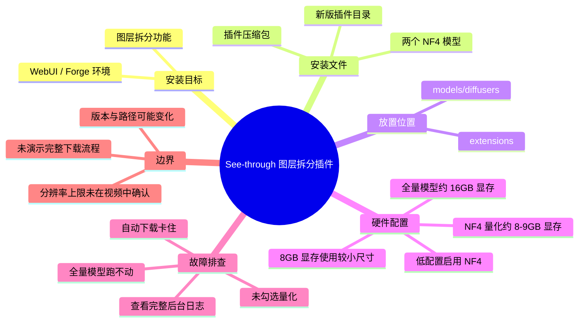
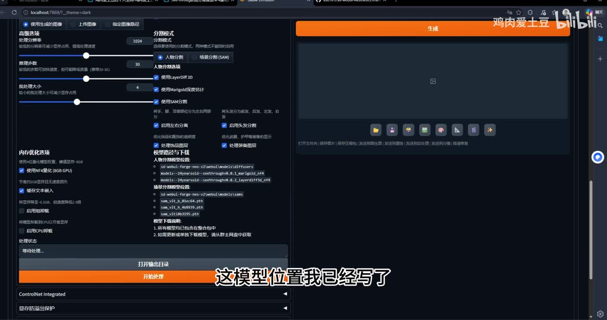
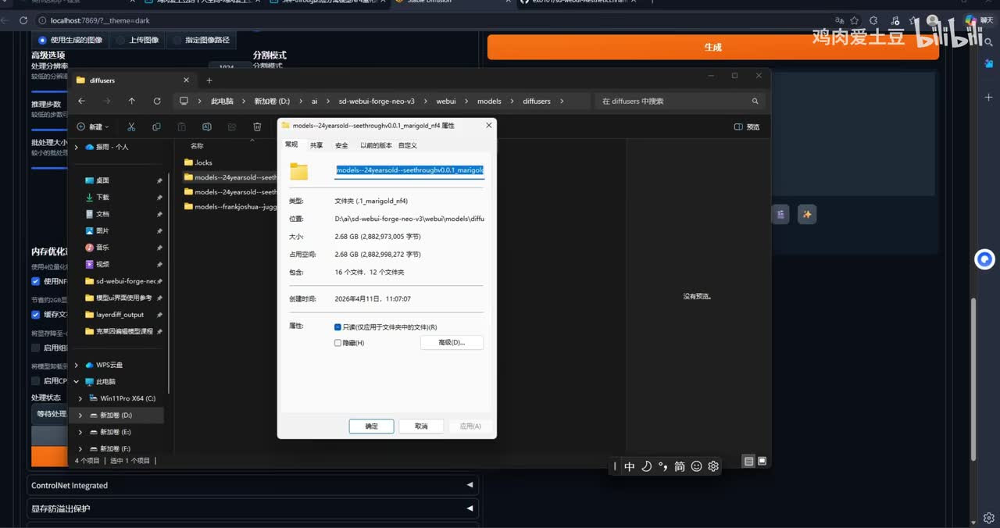
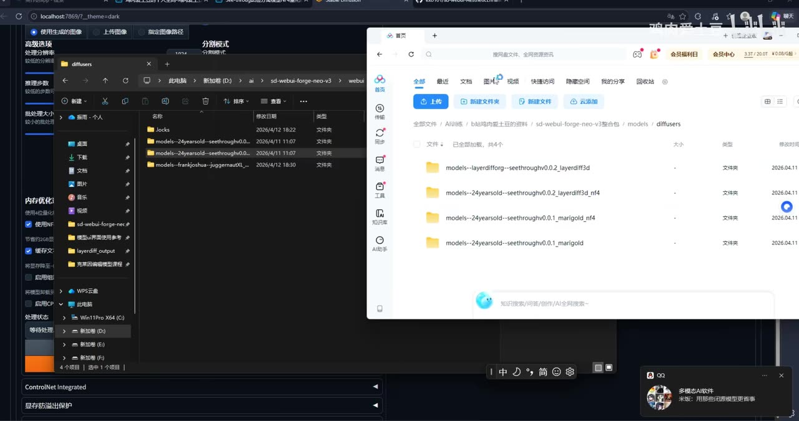
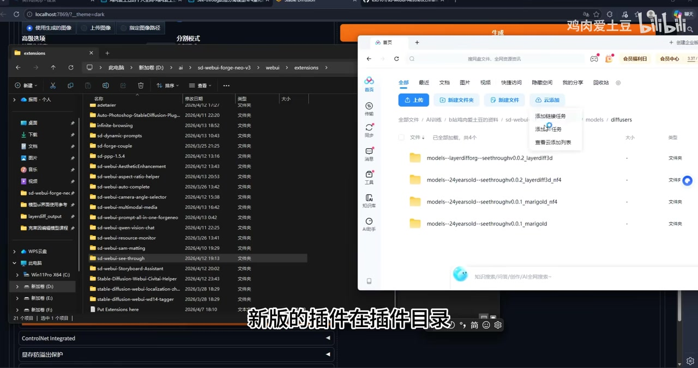

# See-through拆分图层插件webui版本安装教程

> 来源：[Bilibili 视频](https://www.bilibili.com/video/BV1MvQtB9E1X)<br>
> UP 主：鸡肉爱土豆｜分区：AIcode｜视频时长：02:34｜画面分辨率：2044 × 1080

## 小结

本视频是 See-through 拆分图层插件的 WebUI 安装与常见报错排查教程，使用场景为在 SD WebUI / Forge 类 WebUI 中运行图层拆分功能。作者的核心结论是：若只使用“拆分”功能，需准备插件压缩包、两个模型与插件本体，共四项内容。

模型应放入 WebUI 的 `models/diffusers` 目录。画面中展示的路径为 `sd-webui-forge-neo-v3\webui\models\diffusers`；作者强调需要使用 **NF4 量化模型** 的用户，应将相应模型目录放到该位置。

插件安装取决于下载时间：较早下载的用户可能持有旧插件版本；作者展示将新版插件放入 `extensions` 目录，并以新版内容替换旧版。画面可见插件目录名称为 `sd-seethrough`，但视频未展示完整的下载、解压及重启过程。

显存是本教程最关键的硬件限制：不带 NF4 的全精度模型约占用 **16 GB 显存**，NF4 量化模型约占用 **8–9 GB 显存**。作者建议 8 GB 显存使用 `960 × 832` 一类尺寸；16 GB 显存可使用 `1024 × 1280` 一类尺寸。低配置机器必须勾选 WebUI 中的“启用 NF4 量化”选项。

大量报错并非插件本身损坏，而是未启用量化后触发全量模型下载，或本机显存无法运行全量模型。作者建议从运行后台辨别当前状态究竟是“下载中”、模型复制中，还是实际报错；若有错误，应复制完整报错文本交给 AI 分析，或将完整日志发到群内，而不是只发局部截图。

本视频发布于 2026 年，插件版本、模型目录、下载包内容和分辨率上限均可能后续变化。视频未说明插件的官方仓库、模型校验值、依赖版本、完整安装命令及重启要求，因此应以实际下载包中的说明和当前插件文档为准。

## 思维导图




## 目录

- [教程范围、前置条件与时效性](#教程范围前置条件与时效性)
- [模型文件与目录放置](#模型文件与目录放置)
- [新版插件替换旧版](#新版插件替换旧版)
- [显存、量化与尺寸参数](#显存量化与尺寸参数)
- [常见报错与完整日志排查](#常见报错与完整日志排查)
- [可执行操作清单](#可执行操作清单)
- [结论与限制](#结论与限制)
- [字幕比对](#字幕比对)
- [评论分析](#评论分析)
- [处理记录](#处理记录)

## [教程范围、前置条件与时效性](https://www.bilibili.com/video/BV1MvQtB9E1X?t=0)

视频开头说明主题为 See-through“拆分插件”的安装教程。作者针对的是 WebUI 版本的工作流，画面显示浏览器本地 WebUI 页面，地址栏可见 `localhost:7869`，并且文件管理器路径包含 `sd-webui-forge-neo-v3`。因此，教程直接适配的是作者所用的 Forge 风格 WebUI 目录结构，而非对所有 Stable Diffusion 前端都做了兼容性承诺。

作者在界面内提前写出模型位置与模型加载说明。画面中可读到两个 NF4 模型目录名：

- `models--24yearsold--seethroughv0.0.1_marigold_nf4`
- `models--24yearsold--seethroughv0.0.2_layerdiff3d_nf4`

此外，界面还显示了场景分割模型位置，包含 `sam_vit_b_01ec64.pth`、`sam_vit_h_4b8939.pth`、`sam_vit_l_0b3195.pth` 等文件名；但本视频没有讲解这些 SAM 文件是否需要用户自行下载、具体选择哪一个或其来源，不能据此扩展为完整安装要求。



> 图：画面展示 See-through 插件的 WebUI 配置区，左侧“内存优化选项”中可见“使用 NF4量化（8GB GPU）”已勾选；中部文字列出模型加载位置。这一帧是确认模型目录和量化开关存在的直接画面依据。

**时效性说明：**

- 元数据记录的发布时间为 2026-04-13；本文将路径、模型名称和参数仅视为该版本环境中的演示信息。
- 作者的资源链接位于视频简介，包含百度网盘链接及提取码 `1234`，以及夸克网盘链接；视频没有展示资源包校验、更新日期或许可证信息。
- 目录 `sd-webui-forge-neo-v3` 是作者机器上的安装目录名，不应机械照抄为所有用户的绝对路径；应在自己的 WebUI 根目录下寻找对应的 `webui/models/diffusers` 与 `webui/extensions` 目录。

## [模型文件与目录放置](https://www.bilibili.com/video/BV1MvQtB9E1X?t=25)

作者说明模型下载完成后，将模型放到 WebUI 的模型目录中。其演示环境中的目标位置为：

```text
sd-webui-forge-neo-v3/
└─ webui/
   └─ models/
      └─ diffusers/
```

在约 00:00:43 处，作者将“仅使用拆分功能”的最低准备项概括为四项：

1. 一个插件压缩包；
2. 两个模型；
3. 一个插件。

这里“两个模型”与“插件”分别计数，因此合计四项。视频此前与画面均指向 NF4 版本模型；结合界面中列出的两个 `_nf4` 目录，可确认作者演示的是 NF4 路线，而非要求同时安装所有非量化模型。



> 图：Windows 文件资源管理器定位在 `webui\models\diffusers`。弹出的属性窗口显示 `models--24yearsold--seethroughv0.0.1_marigold_nf4` 文件夹，大小约为 2.68 GB，可用于核对模型放置位置及模型目录名。

随后画面展示网盘中的四个模型相关文件夹，其中包括：

| 画面可见文件夹名称 | 与教程的关系 | 备注 |
| --- | --- | --- |
| `models--24yearsold--seethroughv0.0.1_marigold_nf4` | NF4 模型 | 作者界面列出的模型之一。 |
| `models--24yearsold--seethroughv0.0.1_marigold` | 非 NF4 模型 | 对应全量模型路线。 |
| `models--24yearsold--seethroughv0.0.2_layerdiff3d_nf4` | NF4 模型 | 作者界面列出的模型之一。 |
| `models--layerdifforg--seethroughv0.0.2_layerdiff3d` | 非 NF4 模型 | 画面中可见，但视频未逐项解释版本与前一项名称差异。 |



> 图：网盘窗口中同时列出四个模型目录，资源管理器仍处于本地 `models/diffusers` 目录。这一帧的价值在于说明资源包同时含 NF4 与非 NF4 版本，实际选择必须与 WebUI 中的量化设置、显存能力保持一致。

**安装时应遵守的对应关系：**

- 采用低显存 / NF4 方案时：使用作者列出的两个 `_nf4` 模型目录，并在插件界面启用 NF4 量化。
- 采用非 NF4 全量模型时：需要满足作者所称约 16 GB 显存的条件；视频没有完整演示全量模型的下载与成功运行过程。
- 不要仅复制模型内的个别文件而丢失目录层级。作者的画面是将整个模型文件夹放在 `diffusers` 下。
- 若你的 WebUI 根目录不同，应保持相对结构为 `WebUI根目录/webui/models/diffusers/模型文件夹`；这一点是根据作者画面中的目录层级整理，而非视频提供的通用官方规范。

## [新版插件替换旧版](https://www.bilibili.com/video/BV1MvQtB9E1X?t=43)

作者指出：较早下载资源的用户，可能拿到旧版插件；新版插件应放到插件目录，并与旧版进行替换。画面中资源管理器定位于：

```text
sd-webui-forge-neo-v3/
└─ webui/
   └─ extensions/
      └─ sd-seethrough/
```

视频显示插件目录中高亮了 `sd-seethrough`。这表明作者演示的安装方式是把新版插件目录部署到 `extensions` 下，而不是通过 WebUI 的扩展商店在线安装。



> 图：资源管理器打开 `webui\extensions`，其中可见并选中 `sd-seethrough` 文件夹；字幕同步提示“新版的插件在插件目录”。这张图用于确认插件安装目录及“新版本替换旧版本”的操作对象。

**依据视频可执行的替换步骤：**

1. 关闭正在运行的 WebUI 或至少避免其占用插件文件；视频未明示此步骤，但文件替换通常需要避免进程占用，属于操作风险提示而非作者原话。
2. 打开自己的 `webui/extensions` 目录。
3. 找到现有 `sd-seethrough` 目录，确认是否为旧版。
4. 将资源包内新版插件目录放入 `extensions`，按作者说法与旧版进行替换。
5. 重启或重新加载 WebUI，使其重新扫描扩展。**视频未演示重启按钮、命令或加载成功标志，具体方式取决于所使用的 WebUI 启动器。**

作者没有给出插件版本号、Git 仓库地址、依赖文件、安装命令或旧版备份方案。若担心替换失败，应在手工替换前备份旧目录；这是一项通用审慎建议，不是视频中已演示的步骤。

## [显存、量化与尺寸参数](https://www.bilibili.com/video/BV1MvQtB9E1X?t=67)

作者在本段给出明确的显存与尺寸经验值：

| 条件 | 作者给出的结论 | 可选尺寸示例 |
| --- | --- | --- |
| 不带 NF4 的全量模型 | 约占用 16 GB 显存 | 视频未指定对应尺寸。 |
| 带 NF4 的量化模型 | 约占用 8–9 GB 显存 | 8 GB 显存时建议较小尺寸。 |
| 显存只有 8 GB | 只能选较小尺寸 | `960 × 832`。 |
| 显存约 16 GB | 可使用更大尺寸 | `1024 × 1280`。 |

在 01:24 左右，作者进一步强调：**低配置用户一定要勾选“启用 NF4 量化”按钮。**

此处“8 GB 显存使用 `960 × 832`”“16 GB 显存使用 `1024 × 1280`”均应理解为作者给出的示例尺寸，而非保证所有图片、所有批量数、所有其他参数下均稳定运行的硬性上限。画面中还存在推理步数、批处理大小、分割模式、SAM 选项等设置，它们也会影响实际显存和耗时，但视频未提供这些参数的推荐组合。

**参数选择顺序：**

1. 先确认显卡可用显存，而不是只看系统内存。
2. 显存较低时选择 NF4 模型路线。
3. 在插件界面勾选“使用 / 启用 NF4量化”。
4. 8 GB 显存优先以 `960 × 832` 这类尺寸开始测试。
5. 16 GB 显存可尝试 `1024 × 1280` 这类尺寸。
6. 若增加尺寸后卡住或出错，不能仅凭视频断定为插件问题，还应检查是否误用了非量化模型、后台是否正在下载模型，以及实际显存是否不足。

## [常见报错与完整日志排查](https://www.bilibili.com/video/BV1MvQtB9E1X?t=94)

作者称，近期群内用户反馈的多数错误与“没有勾选量化按钮”有关。根据视频陈述，故障链路可整理如下：

```text
未勾选 NF4 量化
        ↓
程序尝试按非量化 / 全量模型路径运行
        ↓
若本地未下载全量模型，可能触发模型下载
        ↓
下载依赖网络代理条件，缺少相应网络条件时可能卡住
        ↓
若同时显存不足以运行全量模型，也可能长期停在处理中
```

作者特别说明，自动下载模型时若需要通过“梯子”下载、而用户没有相应网络条件，界面可能一直卡在下载或缓存相关状态，导致用户误以为“没有处理”。这里应注意：

- 视频把“未启用量化”描述为多数报错的常见原因，但并未证明它能解释全部错误。
- 视频没有给出具体报错文本、网络地址、缓存路径、超时阈值或代理配置方式。
- “卡住”可能发生于下载、复制或实际推理阶段；应先在后台日志中区分状态，不能仅看前端进度。

作者给出的排查建议是：

1. 运行处理任务时查看运行后台。
2. 判断当前是在**下载中**，还是在**复制中**。
3. 如果报错，复制完整错误文本交给 AI 分析原因。
4. 也可以将报错日志发送到群里。
5. 不要只截取局部报错图，因为缺少上下文时他人无法判断具体问题。

**推荐的日志提交格式（根据作者“不要局部截图”的建议整理）：**

```text
1. WebUI / Forge 版本：
2. See-through 插件版本或目录来源：
3. 是否使用 NF4 模型：是 / 否
4. 是否勾选“启用 NF4量化”：是 / 否
5. 显卡型号与显存：
6. 输入图片分辨率与设置尺寸：
7. 从任务开始到报错的完整后台日志：
8. 是否出现模型下载、复制或显存不足提示：
```

上述格式中的字段是为了完整传递上下文，并非视频逐条提供的官方模板。

## [可执行操作清单](https://www.bilibili.com/video/BV1MvQtB9E1X?t=43)

以下清单严格以视频演示信息为主，并标出未被视频覆盖的部分：

### 1. 获取资源

- 从视频简介中作者提供的网盘资源获取文件。
- 视频简介明确给出百度网盘提取码：`1234`。
- 下载前确认资源中是否包含插件压缩包、两个 NF4 模型目录与新版插件目录。
- **未展示内容：** 文件哈希校验、资源包版本号、下载失败处理。

### 2. 放置模型

```text
你的 WebUI 根目录/
└─ webui/
   └─ models/
      └─ diffusers/
         ├─ models--24yearsold--seethroughv0.0.1_marigold_nf4/
         └─ models--24yearsold--seethroughv0.0.2_layerdiff3d_nf4/
```

- 以上两个目录名来自视频界面的模型加载说明。
- 将模型目录放到 `diffusers` 中。
- 不要将 NF4 与非 NF4 的选择同量化开关混淆。

### 3. 安装或更新插件

```text
你的 WebUI 根目录/
└─ webui/
   └─ extensions/
      └─ sd-seethrough/
```

- 将新版 `sd-seethrough` 放入 `extensions`。
- 如果已安装早期版本，按作者演示替换旧版。
- **未展示内容：** 是否需要删除旧目录中的缓存文件、是否需要执行依赖安装、重启的具体命令。

### 4. 按显存设定运行参数

| 显存条件 | 模型与开关 | 尺寸起点 |
| --- | --- | ---|
| 8 GB | 使用 NF4 模型，并勾选“启用 NF4量化” | `960 × 832` |
| 16 GB | 作者称可使用更大尺寸；是否启用 NF4 取决于所选模型 | `1024 × 1280` |
| 低于视频示例或显存不稳定 | 视频未给出具体方案 | 先降低尺寸与批量参数，并观察日志。 |

### 5. 任务卡住时的判断顺序

```text
前端显示处理中
  ├─ 后台显示下载 → 检查是否缺模型、网络是否满足下载条件
  ├─ 后台显示复制 → 等待或检查磁盘、文件占用情况
  ├─ 后台显示显存 / 内存错误 → 核对是否误用全量模型，降低负载
  └─ 有明确异常堆栈 → 复制完整日志，不要只提交局部截图
```

## [结论与限制](https://www.bilibili.com/video/BV1MvQtB9E1X?t=144)

这支教程的可迁移经验是：AI 图像插件的“安装失败”常常不是单纯把插件放错位置，而是**模型版本、量化开关、显存预算和后台下载状态没有对应起来**。对于本视频环境，低显存用户应优先采用 NF4 模型与量化开关组合，并先从作者给出的较小分辨率开始。

视频的明确限制如下：

1. **目录适用性有限。** 演示基于 `sd-webui-forge-neo-v3\webui`，其他 A1111、ComfyUI 或不同 Forge 包装版本的目录可能不同。
2. **未提供完整依赖安装说明。** 未展示 Python 环境、扩展依赖、启动命令、重启流程与版本兼容性。
3. **显存数据是作者经验值。** 16 GB 与 8–9 GB 的占用结论未说明测试显卡、输入图片、批处理量及其他插件负载。
4. **尺寸是示例而非官方极限。** 视频只给出 `960 × 832` 与 `1024 × 1280` 两组建议，未确认最高导出分辨率。
5. **下载机制未被完整验证。** 作者提到未下载全量模型时可能触发下载并受网络条件影响，但未给出下载源和离线安装方案。
6. **资源版本可能过期。** 模型命名、插件目录及网盘资源均可能在视频发布后更新。

## [字幕比对](https://www.bilibili.com/video/BV1MvQtB9E1X?t=0)

| 字幕来源 | 完整性 | 专有名词 | 时间轴 | 主要问题 |
| --- | --- | --- | --- | --- |
| Bilibili 站内字幕 | 未提供可用站内字幕，无法核验 | 无法核验 | 无法核验 | 本次素材中没有可用站内字幕。 |
| 本次 ASR 字幕 | 较完整，共 8 段，语音覆盖约 147 秒 / 153.37 秒（95.85%） | 存在明显识别误差 | 可用，提供 00:00:00–00:02:33 的真实分段时间 | 多处将“插件、模型、显存、下载”等识别为同音或错别字；部分英文模型名和目录被截断。 |

本次 ASR 使用 `medium` 模型识别中文，语言置信度为 `0.998046875`，带时间戳；诊断结果未标记 `noAudioStream=true`，并且音频覆盖良好，因此确认源视频存在音轨。本笔记采用 **本次 ASR 的 SRT 时间轴** 作为章节链接依据，同时结合关键帧画面修正专有名词和目录结构。

重点校正如下：

| ASR 中的表现 | 依据画面或上下文的整理 | 说明 |
| --- | --- | --- |
| “插键 / 插界 / 插箭” | 插件 | 普通词识别错误。 |
| “NF4 模形” | NF4 模型 | 视频语境为量化模型。 |
| “显轮 / 显程” | 显存 | 作者在比较模型显存占用。 |
| “下轾 / 下轴” | 下载 | 作者在说明自动下载卡住。 |
| “sdwebui model diffusion model” | `webui/models/diffusers` | 由资源管理器路径及界面文字共同确认。 |
| “marigold / layerdiff3d” 的部分片段 | `marigold_nf4`、`layerdiff3d_nf4` | 以关键帧中可读的模型目录名为准。 |
| “新版的插间” | 新版插件 | 关键帧显示 `extensions` 中的 `sd-seethrough`。 |

ASR 原始句子中“两个模型”的具体名称在语音识别里并不稳定；本文没有仅凭 ASR 断定，而是以界面显示的两个 `_nf4` 模型路径作为补充证据。

## [评论分析](https://www.bilibili.com/video/BV1MvQtB9E1X?t=94)

仅分析素材中可获取的热评前三条，不将评论内容视为已验证事实。

### 1. 狙七在干嘛（5 赞）

> “我做了个简单的网站，可以不用部署Comfy UI，直接在上传图片进行拆分图层，并且提升PSD画质 (x4)，有兴趣的可以点我主页看看。”

该评论提供了一个替代方案：声称可通过网站直接上传图片做图层拆分，且带有 PSD 画质提升能力。它与视频的本地 WebUI 安装路线不同，反映出部分用户希望避免部署环境、模型和显存配置。

但该评论属于个人推广信息，未提供网址、技术原理、隐私处理方式、价格、模型来源、输出质量样例或实际可用性证明，不能据此认定其功能、质量或安全性。

### 2. 一号-神秘人（2 赞）

> “启动后这样，然后过一会启动器就闪退咋整”

该评论反映出“启动器闪退”是用户实际遇到的安装后问题。视频中作者主要讲解了运行时卡在下载、缓存或处理中的情况，并没有针对“启动器闪退”给出具体解决步骤。

可能相关的信息是：插件更新、模型放置或依赖环境均有可能影响启动，但评论没有附图、完整日志、环境版本和硬件信息，因此无法定位原因。按照作者的排错原则，最需要补充的是完整启动日志，而不是单句描述。

### 3. DoubleH_游戏多栖（2 赞）

> “大佬，已经成功启动了，但是遇到了问题，插件最高支持1536分辨率的导出么？有没有办法突破这个分辨率上限，目前我有比较高的分辨率要求[给心心]”

评论提出插件是否存在 `1536` 分辨率导出上限，以及能否突破上限的问题。视频中只明确给出了 `960 × 832` 与 `1024 × 1280` 两组显存适配示例，没有提到 `1536` 的导出限制，也没有给出解除上限的方法。

因此，关于“最高支持 1536”只能视为评论者提出的待验证问题，不能写成插件的已知规格。若需要高分辨率工作流，应进一步确认当前插件版本的参数限制、显存需求、输出格式限制及是否支持分块、放大或后处理流程。

## [处理记录](https://www.bilibili.com/video/BV1MvQtB9E1X?t=0)

- Worker ID：`worker-mrj0wjed-b0c290ad`
- 模型：`gpt-5.6-terra`
- 调用工具与模型：素材编排流程提供的视频元数据、关键帧、评论数据；音频 ASR 使用 `medium` 模型，CUDA / `float16` 推理。
- 使用的应用工具：视频合并文件、音频提取文件、ASR 时间轴字幕（`asr/transcript.srt`）、ASR 分段结果（`asr/asr-result.json`）、关键帧目录、评论 JSON、视频元数据。
- 字幕选择：站内字幕未提供可用内容；已检查本次 ASR，确认其具有时间戳、音频覆盖率约 95.85%，且未出现 `noAudioStream=true`。正文以 ASR 时间轴为准，以关键帧校正模型名、目录名和插件名。
- 关键帧选择依据：`frame-001.jpg` 用于确认 WebUI 中的 NF4 开关与模型加载提示；`frame-002.jpg` 用于确认本地 `models/diffusers` 路径及一个 NF4 模型目录；`frame-003.jpg` 用于辨识网盘中 NF4 / 非 NF4 模型目录并存；`frame-004.jpg` 用于确认 `extensions` 下的 `sd-seethrough` 插件目录。
- 热评处理：仅使用可获取的前三条热评，分别分析替代在线方案推广、启动器闪退问题和 1536 分辨率上限疑问。
- 清理缓存：素材未提供缓存清理执行记录；本文不虚构已清理结果。
- 未解决问题：未取得插件官方仓库与版本号；未验证模型下载源、依赖安装流程、启动器闪退原因、1536 分辨率是否为真实上限，以及不同 WebUI 版本下的目录兼容性。

## 评论分析

- 热评 1：我做了个简单的网站，可以不用部署Comfy UI，直接在上传图片进行拆分图层，并且提升PSD画质 (x4)，有兴趣的可以点我主页看看。
- 热评 2：启动后这样，然后过一会启动器就闪退咋整
- 热评 3：大佬，已经成功启动了，但是遇到了问题，插件最高支持1536分辨率的导出么？有没有办法突破这个分辨率上限，目前我有比较高的分辨率要求[给心心]

以上内容是观众反馈摘录，只用于补充理解视频反响，不作为正文事实依据。
