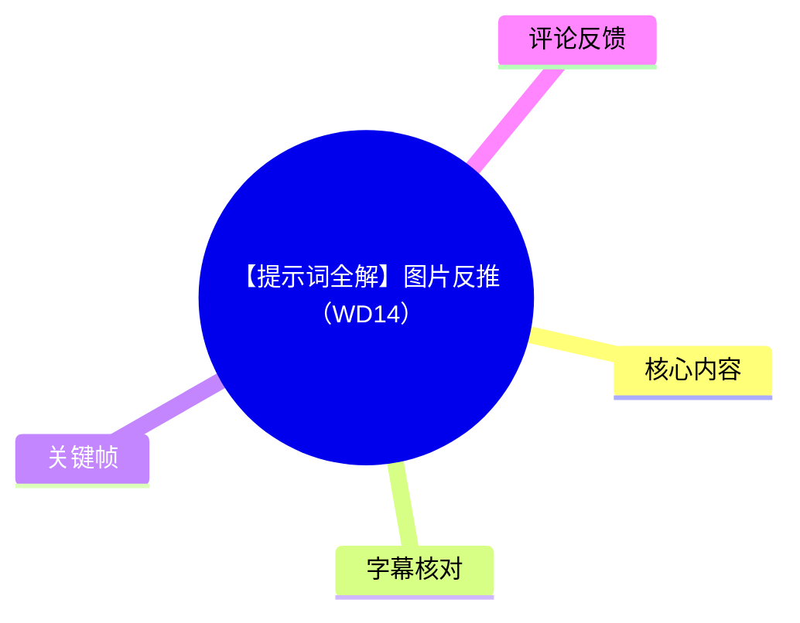
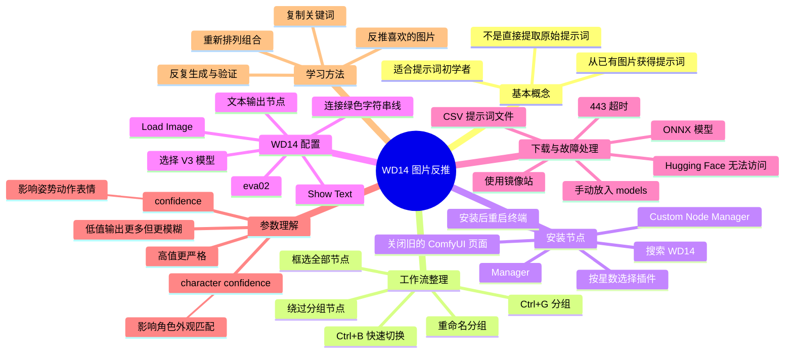
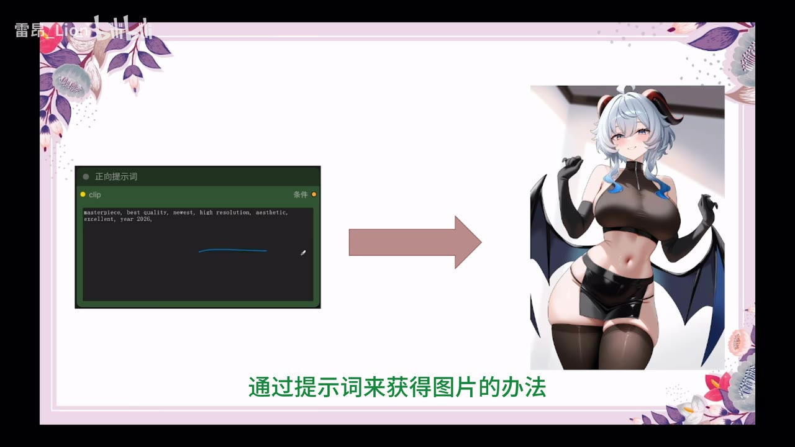
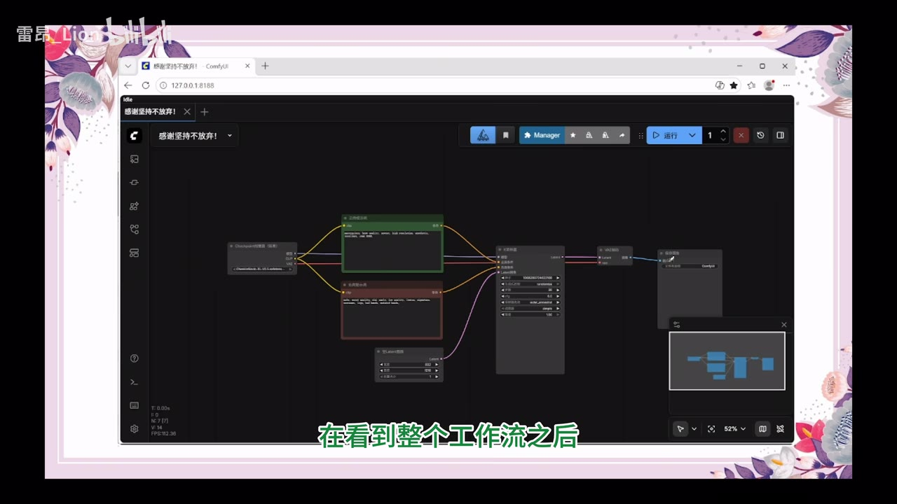
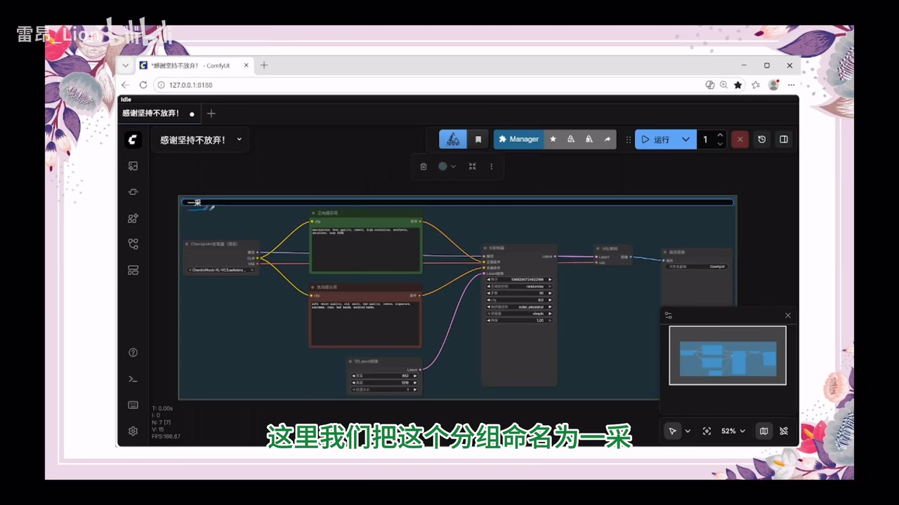
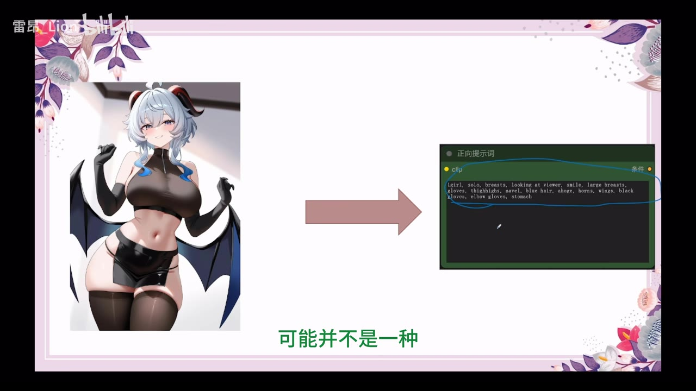
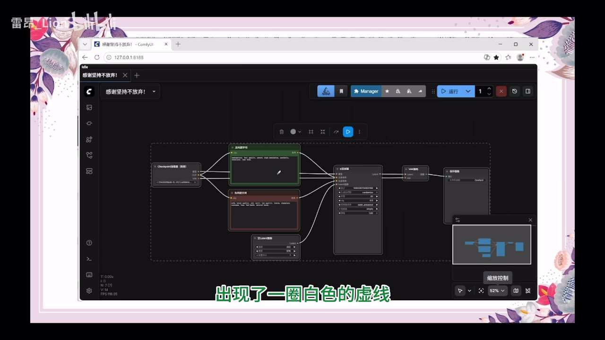

# 【提示词全解】图片反推（WD14）

## 小结

视频由雷昂_Lion讲解如何在 ComfyUI 中安装并使用 WD14 图片反推节点，把已有图片转换为可供生成模型参考的提示词。视频强调，反推不是从图片中直接读取原始提示词，而是根据人物的外观、姿势、动作和表情推测关键词，因此输出结果通常不会与原图生成时使用的提示词完全一致，但仍具有很高的学习和复现价值。

操作主线包括：整理和分组 ComfyUI 工作流、使用 `Ctrl+B` 快速绕过或恢复节点、通过 Manager 安装 WD14 及文本显示相关自定义节点、选择 `eva02` 模型、连接图片输入与文本输出、处理 Hugging Face 下载超时，以及将反推结果清洗后重新用于生图。

视频给出的关键经验是：先绕过原有采样流程，只运行反推节点，避免重复生成图片；遇到 443 超时，不要继续调整节点，而应通过镜像站下载模型文件并手动放入指定目录；生成结果异常时，应检查 `confidence` 与 `character confidence`，二者分别影响姿势动作匹配和角色外观匹配。

本视频没有讨论具体行业新闻、产品发布或政策变化，核心是一个 ComfyUI/WD14 实操教程。软件界面、节点名称、模型可用性、下载地址和插件版本都可能随时间变化；视频中的安装路径和参数应视为视频录制时的实践记录，而不是永久不变的官方规范。

## 思维导图





## 目录

- [视频主题与反推原理](#视频主题与反推原理)
- [工作流分组、绕过与快捷键](#工作流分组绕过与快捷键)
- [安装 WD14 自定义节点](#安装-wd14-自定义节点)
- [配置 WD14 与文本输出](#配置-wd14-与文本输出)
- [运行反推并避免重复采样](#运行反推并避免重复采样)
- [443 超时与模型手动下载](#443-超时与模型手动下载)
- [清理提示词并重新生图](#清理提示词并重新生图)
- [confidence 与 character confidence](#confidence-与-character-confidence)
- [分组快速切换与最终工作流](#分组快速切换与最终工作流)
- [学习方法、限制与时效性](#学习方法限制与时效性)
- [字幕比对](#字幕比对)
- [评论分析](#评论分析)
- [处理记录](#处理记录)

## 视频主题与反推原理 [00:39](https://www.bilibili.com/video/BV1JWTK6iEef?t=39)

视频开头将“生图”和“反推”作对比：

- 生图：通过提示词获得图片。
- 图片反推：通过已有图片获得提示词或关键词。

视频明确指出，WD14 反推并不是把图片内部保存的原始提示词直接提取出来，而是根据图片中的可见信息进行推测，尤其关注：

- 人物外观；
- 人物姿势；
- 动作；
- 表情；
- 角色与模型中既有角色形象的相似性。

因此，反推结果与原始生成提示词可能存在明显差异。原图作者可能使用了没有被反推出的词，也可能使用了模型无法准确识别的风格、权重或组合方式。不过，反推得到的关键词仍然可以帮助初学者理解提示词如何描述人物和画面，并作为重新生成图片的起点。



> 图：关键帧展示“提示词获得图片”这一正向流程，并将其与图片反推形成对照。它有助于理解视频的核心概念：反推是从结果回到可用描述，而不是恢复原始提示词文件。

视频将图片反推定位为一种可用于不同图片的学习方法，尤其适合还不熟悉提示词写作的初学者。这里的“适用于任何图片”是视频中的概括性表述，实际效果仍取决于图片内容、模型、节点版本和参数设置。

## 工作流分组、绕过与快捷键 [00:56](https://www.bilibili.com/video/BV1JWTK6iEef?t=56)

在正式讲提示词前，视频先整理上一期留下的 ComfyUI 工作流。

### 选中并分组全部节点 [01:00](https://www.bilibili.com/video/BV1JWTK6iEef?t=60)

操作步骤：

1. 缩小画布，使整个工作流可见。
2. 按住键盘上的 `Ctrl`。
3. 在画布空白处按住鼠标并向外拖动。
4. 框选整个工作流，确认所有节点都被覆盖。
5. 松开鼠标后，工作流外侧出现白色虚线。
6. 按下 `Ctrl+G`。
7. 当白色虚线区域被蓝色包围时，说明分组成功。
8. 点击分组标题，对分组重新命名。
9. 视频将该组命名为“一采”；英文字幕对应名称为 `First Pass`。

点击画布其他位置即可保存分组名称。



> 图：关键帧展示缩小后的 ComfyUI 工作流及多个节点之间的连接关系。它适合说明为什么需要先看全局、再框选和分组。

### 绕过分组节点 [01:59](https://www.bilibili.com/video/BV1JWTK6iEef?t=119)

点击分组标题后会弹出多个选项，视频选择第四个选项，再选择带有禁止符号的 `Bypass Group Node`，即“绕过分组节点”。

绕过后，分组内节点变为紫色。视频通过点击运行进行验证，并出现“没有输出项”的错误。这里的重点不是错误本身，而是紫色节点不会在整个工作流中执行。

绕过功能适用于可插拔节点：

- 某些节点有时需要，有时不需要；
- 不需要每次都删除或重新修改工作流；
- 可以暂时绕过整组节点；
- 需要时再恢复执行。

如果要恢复：

1. 点击分组标题；
2. 打开更多选项；
3. 选择将分组节点设置为“始终”运行；
4. 视频中对应图标为横向三角形；
5. 节点恢复正常执行状态。



> 图：关键帧展示工作流外侧的白色虚线选区。白色虚线是视频用来判断节点已被选中的界面信号，也是执行 `Ctrl+G` 或 `Ctrl+B` 前的重要检查点。

### 使用 Ctrl+B 快速切换 [03:25](https://www.bilibili.com/video/BV1JWTK6iEef?t=205)

视频给出更日常的快捷键方法：

1. 用鼠标框选需要处理的节点；
2. 确认组外出现白色虚线；
3. 按 `Ctrl+B`；
4. 节点被快速绕过；
5. 再次选中被绕过节点并按 `Ctrl+B`，即可恢复。

这一方法后续用于跳过原有采样流程，使 WD14 反推能够单独执行。

## 安装 WD14 自定义节点 [04:03](https://www.bilibili.com/video/BV1JWTK6iEef?t=243)

视频说明，反推节点不是秋叶启动器默认自带的功能，需要手动安装。

### 从 Manager 搜索插件 [04:15](https://www.bilibili.com/video/BV1JWTK6iEef?t=255)

操作路径：

1. 点击 ComfyUI 顶部的蓝色 `Manager`。
2. 在弹出的选项中选择第一个按钮，即自定义节点管理器。
3. 等待列表刷新。
4. 在搜索框中输入 `WD14`。
5. 搜索结果可能是名称中包含 WD14 的插件，也可能是描述中包含 WD14 的插件。
6. 将列表横向滚动到右侧，查看星星数量。
7. 视频建议选择星数最多的插件，因为作者将星数视为插件的权威度或社区认可度。

需要注意，视频只展示了按星数选择的经验，没有提供插件的完整名称、仓库地址、版本号或星数具体数值。因此不能据此确认某个唯一插件，也不能把“星数最多”视为官方选择标准。

### 安装、重启与网页管理 [05:13](https://www.bilibili.com/video/BV1JWTK6iEef?t=313)

安装流程：

1. 勾选插件前面的白色复选框，使其变成蓝色对号。
2. 确保其他不需要的复选框没有被选中。
3. 点击安装。
4. 左下角出现暂停标志后不要点击暂停，只需等待。
5. 如果出现红色提示，说明需要重启终端才能生效。
6. 左下角的 `Stop` 会变成 `Restart`。
7. 点击 `Restart`。
8. 在确认窗口中选择确认。
9. 返回秋叶启动器后，查看最后一行是否显示程序正常退出和退出代码。
10. 回到浏览器，关闭旧的 ComfyUI 网页。
11. 点击“一键启动”，等待代码自动运行。
12. 新网页出现后，使用新的 ComfyUI 页面。

视频特别提醒：每次启动可能打开新的网页，旧页面已经失效。如果不关闭旧网页，多个 ComfyUI 页面会并排累积，造成混乱。

### WD14 的特殊启动情况 [06:45](https://www.bilibili.com/video/BV1JWTK6iEef?t=405)

视频称，插件安装后的表现可能不同：

- 有的插件需要额外安装依赖；
- 有的插件不需要依赖；
- 有的插件重启后运行一段时间仍会自动退出；
- 有的插件点击一次就能直接打开；
- WD14 在第一次启动后仍可能显示“正常退出”。

视频认为，WD14 第一次启动后显示正常退出，不代表启动器损坏。此时再次点击“一键启动”，让代码自动运行，之后应弹出新的 ComfyUI 网页。

## 配置 WD14 与文本输出 [07:09](https://www.bilibili.com/video/BV1JWTK6iEef?t=429)

### 添加 WD14 节点并选择模型 [07:24](https://www.bilibili.com/video/BV1JWTK6iEef?t=444)

在新 ComfyUI 页面中：

1. 将画布拖到空白区域。
2. 双击打开节点菜单。
3. 搜索 `WD14`。
4. 选择刚安装的 WD14 节点并放入画布。
5. 放大节点，方便查看各项参数。
6. 选择模型。
7. 视频说明当前使用的是 V2 模型，因此至少要选择一个 V3 模型。
8. 在模型列表中选择 `eva02`。

视频对 `eva02` 的评价和参数为：

- 被称为较新的模型；
- 根据作者个人体验，效果较好；
- 相比其他选择大约慢 `5–6` 秒；
- 反推整体结果被作者评价为提升 `30%` 以上。

“30% 以上”是视频作者基于个人体验给出的判断，素材没有提供测试样本、硬件配置、基准方法或可复现实验，因此不能当作普遍性能保证。

### 连接图片输入 [08:13](https://www.bilibili.com/video/BV1JWTK6iEef?t=493)

WD14 节点两端的用途：

- 左侧：图片输入；
- 右侧：字符串或文本输出。

连接图片的方法：

1. 按住图片端口向空白处拖动；
2. 松手后选择“加载图像”；
3. `Load Image` 节点用于提供待反推的图片；
4. 视频称，加载图像节点左侧没有额外输入，说明图片输入侧配置完成。

### 安装文本输出节点 [08:54](https://www.bilibili.com/video/BV1JWTK6iEef?t=534)

WD14 的右侧文本输出还需要文本显示节点。视频再次进入 Manager 的自定义节点管理器：

1. 搜索框输入 `custom`，再加一个连字符 `-`；
2. 查看匹配结果；
3. 仍然通过横向滚动查看星数；
4. 选择星数最多的节点；
5. 勾选节点并安装；
6. 等待安装完成；
7. 点击重启；
8. 确认关闭网页；
9. 点击一键启动；
10. 在新网页中继续操作。

### 添加 Show Text 并手动连接 [09:52](https://www.bilibili.com/video/BV1JWTK6iEef?t=592)

视频解释，字符串连接线是绿色的，文本相关节点较多，因此不建议只从绿色端口拖出后在候选菜单中盲目寻找，而是直接在空白画布中搜索：

1. 双击空白画布；
2. 搜索 `show`；
3. 选择 `Show Text`；
4. 放入文本显示节点；
5. 双击添加的节点；
6. 将 WD14 的字符串输出拖到 `text` 端口；
7. 看到自动吸附后松手，确认绿色连线接通。

调整文本框大小：

1. 按住文本显示节点左下角；
2. 向右下拖动；
3. 如果节点整体被拉长、放大，说明点击位置正确；
4. 如果节点左右乱跑，或跟随鼠标拉出连线，说明点击到了错误位置，需要重新操作。



> 图：关键帧展示图片与文本提示词之间的反推关系，右侧可见由图片内容得到的标签文本。它有助于说明 WD14 的输出不是原始提示词，而是模型识别后的关键词集合。

## 运行反推并避免重复采样 [11:11](https://www.bilibili.com/video/BV1JWTK6iEef?t=671)

### 上传待反推图片 [11:15](https://www.bilibili.com/video/BV1JWTK6iEef?t=675)

操作步骤：

1. 在左侧点击“选择文件”；
2. 可以选择任意图片；
3. 为保持课程连贯，视频选择上一节生成的封面图片；
4. 点击图片后选择“打开”；
5. 检查加载图像节点是否显示所选图片。

### 只执行反推节点 [11:41](https://www.bilibili.com/video/BV1JWTK6iEef?t=701)

回到整个画布后，视频发现原有的“一采”分组仍然处于运行状态。如果直接运行，可能先进行反推，再重新生成图片，导致大量重复耗时。

视频采用此前学过的绕过方法：

1. 绕过“一采”分组；
2. 点击运行；
3. 此时只执行图片反推；
4. 不执行原有的初始采样或生图流程。

预期连线方向为：

`Load Image` → `WD14 反推节点` → `Show Text`

## 443 超时与模型手动下载 [12:07](https://www.bilibili.com/video/BV1JWTK6iEef?t=727)

### 443 错误的原因 [12:16](https://www.bilibili.com/video/BV1JWTK6iEef?t=736)

视频称，初学者可能遇到 443 超时错误。原因是终端尝试连接 Hugging Face 下载文件，但由于无法访问而下载失败。视频也说明，并非所有人都会遇到这个问题。

此时问题已经不是调整 ComfyUI 节点可以解决的范围。视频建议：

1. 关闭当前网页；
2. 终止相关启动器；
3. 打开浏览器；
4. 进入视频画面展示的镜像网站；
5. 通过镜像站下载 Hugging Face 上的模型文件。

素材中的字幕只说“输入这个网址”，但没有提供可直接复制的完整 URL，因此本文不补写未出现的地址。

### 搜索模型 [13:18](https://www.bilibili.com/video/BV1JWTK6iEef?t=798)

进入镜像站后：

1. 找到“搜索模型与数据集”；
2. 输入 `wd-e`；
3. 视频提到输入 `eva02` 也可能出现结果；
4. 如果出现两个难以区分的结果，视频建议直接选择第一个；
5. 进入模型页面；
6. 忽略模型卡中与本次问题无关的参数；
7. 点击文件和详细参数；
8. 先复制文件名称，后面保存时需要使用。

### 下载的两个文件 [14:07](https://www.bilibili.com/video/BV1JWTK6iEef?t=847)

视频明确给出的文件和大小：

| 文件 | 用途 | 视频给出的大小 |
| --- | --- | ---: |
| ONNX 模型文件 | WD14 模型推理 | 1.26 GB |
| CSV 提示词文件 | 标签或提示词映射 | 308 KB |

素材没有给出这两个文件的完整文件名，因此不能补写具体名称。

### ONNX 文件保存路径 [14:20](https://www.bilibili.com/video/BV1JWTK6iEef?t=860)

下载 ONNX 文件时，视频展示的目录层级为：

```text
Comfy 根目录/
└── V3/
    └── ComfyUI/
        └── custom_nodes/
            └── WD14/
                └── models/
```

操作步骤：

1. 点击 ONNX 文件对应的下载图标；
2. 在下载窗口进入 Comfy 根目录；
3. 进入 `V3`；
4. 进入 `ComfyUI`；
5. 进入 `custom_nodes`；
6. 进入 `WD14`；
7. 进入 `models`；
8. 将之前复制的文件名粘贴到文件名位置；
9. 点击保存。

### CSV 文件保存 [15:07](https://www.bilibili.com/video/BV1JWTK6iEef?t=907)

下载 CSV 文件时：

1. 找到 CSV 对应的下载按钮；
2. 点击下载；
3. 视频称下载路径可能仍会被系统识别，因此不必重新查找；
4. 选中完整文件名；
5. 使用 `Ctrl+V` 粘贴视频中提到的 `V3` 名称；
6. 点击保存；
7. 返回启动器；
8. 点击一键启动；
9. 重新打开 ComfyUI 页面；
10. 点击运行检查 WD14 反推流程。

## 清理提示词并重新生图 [15:50](https://www.bilibili.com/video/BV1JWTK6iEef?t=950)

### 将下划线替换为空格 [16:05](https://www.bilibili.com/video/BV1JWTK6iEef?t=965)

反推成功后，文本框会输出大量内容。视频指出，其中可能包含很多下划线 `_`，而正常可读的提示词更适合使用空格。

不需要逐个查找和替换。视频使用 WD14 节点中的相关选项：

1. 找到“将下划线替换为空格”的选项；
2. 点击黑色圆点；
3. 使其变为蓝色，进入启用状态；
4. 再次点击运行；
5. 等待处理完成；
6. 检查输出文本中的下划线是否已经变为空格；
7. 拖动文本框，复制完整提示词。

### 将反推结果放回提示词节点 [16:48](https://www.bilibili.com/video/BV1JWTK6iEef?t=1008)

1. 回到原来的“一采”或采样分组；
2. 使用此前的方法恢复节点；
3. 进入提示词输入框；
4. 视频说明前面的内容是质量词，并且沿用上一节设置；
5. 按回车进入新行；
6. 使用 `Ctrl+V` 粘贴刚刚复制的 WD14 提示词；
7. 点击运行；
8. 最终得到一张重新生成的图片。

视频观察到，重新生成的图片在动作和表情上会有一定变化，但整体仍处于可接受范围。作者将这一效果概括为：从原本较随机的出图，逐渐转向更固定、更可预测的结果。


> 图：关键帧以箭头展示图像与提示词的相互转换，适合说明“反推—复制—重新生成”的闭环。

## confidence 与 character confidence [18:24](https://www.bilibili.com/video/BV1JWTK6iEef?t=1104)

视频举例说明：原图中的人物虽然有类似羊角的元素，但并不是甘雨；重新生成后，人物却被识别或生成成了甘雨。作者将原因归结为 WD14 中的两个参数：

- `confidence`：置信度；
- `character confidence`：角色置信度。

### character confidence：角色外观匹配 [18:34](https://www.bilibili.com/video/BV1JWTK6iEef?t=1114)

角色置信度用于衡量图片中人物形象与模型中角色形象的匹配程度，视频举例涉及：

- 头发；
- 眼睛颜色；
- 服饰；
- 整体角色外观。

视频中的参数示例：

| 角色置信度 | 视频中的解释 |
| ---: | --- |
| `1.0` | 要求头发、眼睛颜色、服饰等元素几乎完全一致，条件过于严格，普通图片可能难以得到有效输出 |
| `0.5` | 允许与原图角色约有一半相似，颜色等细节存在差异也可以 |
| `0.0` | 几乎不要求角色匹配，可能只得到“某个人物”，甚至出现混乱识别 |
| `0.8` | 视频建议通常可以作为较合适的角色置信度 |

视频举例称，角色置信度过低时，模型可能在多个角色名称之间混乱，例如输出初音、灵梦、魔理沙等不同角色。作者建议一般可先尝试 `0.8`，但这只是视频经验，不代表所有模型或图片都适用。

### confidence：动作、姿势和表情匹配 [20:00](https://www.bilibili.com/video/BV1JWTK6iEef?t=1200)

普通置信度主要对应人物的：

- 动作；
- 表情；
- 姿势；
- 与模型中动作、表情和姿势的相似程度。

视频以“抬手”为例：

- `1.0`：要求抬手幅度、角度、手掌张开程度都几乎完全一致，可能过于严格而没有输出；
- `0.9`：大致只要满足“抬手”即可；
- `0.8`：会输出更多相关提示词；
- `0.35`：条件较宽松，可能把原本站立的人物识别或复现为坐姿；
- `0.6`：视频示例中人物可以保持站立并抬手。

总体规律：

| 置信度变化 | 输出特征 |
| --- | --- |
| 提高 | 条件更严格，输出项目更少，但更准确 |
| 降低 | 条件更宽松，输出项目更多，但更模糊、更自由 |

视频同时指出，置信度过低和过高都有问题：

- 过低：反推提示词过于开放，重新生成的图片也更自由，姿势和内容可能偏离原图；
- 过高：虽然约束更严，但输出提示词太少，底模获得更多自由，可能自行加入无关元素；
- 对初学者：作者建议先把置信度调得相对低一些，以便观察和学习更多提示词。

这些数值是视频示例和作者经验，素材没有给出统一的最佳值、模型版本、图片数据集或客观评测。

## 分组快速切换与最终工作流 [21:56](https://www.bilibili.com/video/BV1JWTK6iEef?t=1316)

### 将反推节点分组 [21:56](https://www.bilibili.com/video/BV1JWTK6iEef?t=1316)

视频认为，原来的“一采”已经完成分组，但 WD14 反推部分也应当单独分组：

1. 返回反推节点区域；
2. 框选反推相关节点；
3. 执行分组；
4. 将分组命名为 `WD14 反推`。

### 添加快速绕过节点 [22:20](https://www.bilibili.com/video/BV1JWTK6iEef?t=1340)

1. 将画布移动到空白位置；
2. 双击画布空白区域；
3. 搜索 `FAST`；
4. 搜索结果中包含快速组忽略或类似的节点；
5. 视频提到其中有两个组节点；
6. 作者不建议使用“快速组中止”节点，认为后续可能引发较大问题；
7. 选择 `bypasser` 节点。

添加后，节点上会显示刚刚创建的分组名称，并提供两个主要控制方向：

- `yes/no` 状态控制；
- 蓝色箭头用于快速跳转。

视频先点击 WD14 反推分组后面的蓝色控制项，使 `yes` 变成 `no`，整个节点变灰。灰色表示该分组已被绕过。再次点击后恢复为 `yes`，节点重新启用。

点击小箭头后，画布会直接跳转到对应分组。通过在不同分组之间添加快速绕过和跳转节点，可以：

- 快速启用或禁用一组节点；
- 在“一采”和“WD14 反推”等分组间快速移动；
- 配置完一个分组后直接跳到下一个分组；
- 减少在大型工作流画布中手动寻找节点的时间。

视频承认最终工作流看起来可能较乱，但强调每个节点都已经被分块组织，快速组是成品工作流中的重要便利功能。



> 图：关键帧展示经过分组后的完整工作流，能够直观看到采样、提示词、模型和输出节点之间的结构关系。它有助于理解“看似复杂、实际按功能分块”的工作流组织方式。

## 学习方法、限制与时效性 [24:20](https://www.bilibili.com/video/BV1JWTK6iEef?t=1460)

视频最后将重点从工具操作转回提示词学习：

1. 理解每个提示词的含义；
2. 保存自己认为有效的提示词；
3. 与其他喜欢的提示词进行排列组合；
4. 寻找新的图片；
5. 使用 WD14 反推图片关键词；
6. 重新生成图片；
7. 观察哪个部分出现偏差；
8. 继续学习相关提示词；
9. 重排、组合并生成自己的图片；
10. 反复循环。

作者认为，这种持续积累是 AI 图片创作者形成经验的方式。即使未来出现新的模型或工具，只要掌握提示词理解、图片分析和工作流组织等基础能力，就能更快理解新工具的运行方式。

### 适用范围

- 适合 ComfyUI 初学者；
- 适合正在学习提示词写作的人；
- 适合希望从喜欢的图片中提取可学习关键词的人；
- 适合需要在大型工作流中快速启用或禁用模块的人。

### 主要限制

- WD14 输出的是推断提示词，不是原始提示词；
- 反推结果可能遗漏风格、权重、构图和隐含条件；
- 角色置信度过低可能导致角色名称混乱；
- 普通置信度过低可能导致姿势和画面过度自由；
- 置信度过高又可能导致输出词过少，使底模加入无关元素；
- `eva02` 的“慢 5–6 秒、效果提升 30% 以上”是视频作者个人体验，缺少公开测试条件；
- 443 错误与网络环境有关，视频未验证所有网络或系统环境；
- 镜像站、模型文件和插件下载路径可能失效或发生变化；
- 插件可能需要额外依赖，安装后是否能一次启动取决于具体环境；
- 视频没有给出完整镜像站地址、插件仓库地址、具体版本号和完整模型文件名。

### 时效性

素材元数据显示视频发布日对应时间为 `2026-06-28`，本次素材抓取时间为 `2026-08-04`。本文只记录视频中实际出现的操作和参数，不对之后的 ComfyUI、秋叶启动器、WD14 插件、`eva02` 模型或 Hugging Face 镜像状态作实时保证。安装前应重新确认：

- Manager 中的插件名称和仓库；
- 节点是否支持当前 ComfyUI 版本；
- 模型文件是否仍可下载；
- `models` 目录是否发生变化；
- 镜像站是否可信且可访问；
- 当前节点参数名称是否与视频一致。

## 字幕比对

本次同时检查了站内字幕与本次 ASR 结果。ASR 诊断未标记 `noAudioStream=true`，且识别到中文音轨：模型为 `large-v3-turbo`，语言为 `zh`，语言概率 `0.998046875`，音频时长约 `1507.07` 秒，语音覆盖率 `96.47%`。ASR 从 `00:00:39.400` 开始识别，末段到 `00:25:06.480`，中间存在约 `12.8` 秒的大间隔。

| 字幕来源 | 完整性 | 专有名词 | 时间轴 | 主要问题 |
| --- | --- | --- | --- | --- |
| Bilibili 站内中文 SRT | 较完整 | 中文内容整体最可靠，能识别 WD14、ComfyUI、eva02、Hugging Face、443 等 | 从 `00:00:00` 开始，分段细，适合章节时间轴 | 个别词存在错字或误识别，如“一采”、节点名称、`custom` 等；部分表达不够通顺 |
| 本次 ASR | 覆盖约 96.47%，有真实时间戳 | 中文识别总体可用，但专有名词错误较多，如 Hugging Face、ComfyUI、ONNX、custom nodes 等常被识别成同音词 | 从 `00:00:39.400` 开始，分段较粗，存在约 12.8 秒空档 | 识别文本噪声较多，部分数字、文件夹名、节点名和技术术语不稳定 |

最终采用站内中文 SRT 作为主要内容和章节时间轴依据，并使用本次 ASR 进行覆盖检查、语义校对和时间交叉验证。时间轴链接优先取自真实字幕分段的起止时间，不依据文章文字顺序猜测。

重点校正包括：

- `WD14`、`WD 14`、`WD-14` 统一为 `WD14`；
- `eva02`、`EVA02` 统一为 `eva02`；
- `ComfyUI`、`Comfy UI` 统一为 `ComfyUI`；
- `custom nodes` 统一为 `custom_nodes`；
- `Show Text` 作为文本显示节点名称保留英文；
- `confidence` 译为“置信度”；
- `character confidence` 译为“角色置信度”；
- `443` 解释为视频中所述的 Hugging Face 下载超时；
- ASR 中出现的“爆脸”“报脸”等同音识别，依据站内字幕和上下文校正为 `Hugging Face`；
- 站内字幕的末段时间为 `00:25:06.940`，ASR 末段为 `00:25:06.480`，与视频总时长 `1508` 秒存在少量尾部差异，本文未将其视为内容缺失。

## 评论分析

本次评论素材标记最多获取 3 条，但实际提供 2 条热评，因此只分析这 2 条，不补写第三条。

### 热评 1：凌之风Lzf

> “我喜欢你[魔法少女的魔女审判表情包_我推赛高]”

该评论主要是表达对作者或视频内容的喜爱，属于情绪性反馈，没有补充技术信息，也没有提出可验证的争议。其点赞数为 40。它可以反映部分观众对视频风格或作者的正面态度，但不能据此判断教程的技术正确性。

### 热评 2：我是大黄逸轩

> “不想每次反推提示词都要启动的，可以试试这个  
> https://huggingface.co/spaces/SmilingWolf/wd-tagger  
> 需要魔法”

该评论提供了一个 Hugging Face Spaces 链接，可能意味着可以通过网页形式使用 WD Tagger，从而减少每次在本地工作流中启动反推节点的需求。评论称“需要魔法”，暗示其访问可能受到网络条件影响。

这属于评论者提供的替代方案，并非视频内容，也没有在本次素材中得到实际验证。它与视频对 Hugging Face 访问问题的讨论有关，但不能直接替代视频中针对 ComfyUI 本地节点、模型下载和目录配置的步骤。

## 处理记录

- Worker ID：`worker-mrj0wjed-b0c290ad`
- 调用工具与模型：视频素材整理、站内字幕与 ASR 交叉比对、关键帧筛选 / `gpt-5.6-terra`
- ASR 模型：`large-v3-turbo`
- ASR 设备与计算配置：`cuda` / `int8_float16`
- 使用的应用工具：
  - 站内中文、英文、西班牙文、日文、葡萄牙文、阿拉伯文字幕检查；
  - 本次中文 ASR 结果检查；
  - ASR SRT 时间戳核对；
  - 关键帧清单与提供的画面内容比对；
  - 热评数据读取，仅处理实际获取的前两条。
- 字幕选择：以站内中文时间轴字幕为主，以本次中文 ASR 进行覆盖和术语交叉校正；未发现 `noAudioStream=true`。
- 关键帧选择依据：
  - `frames/frame-001.jpg`：用于说明提示词生成图片与反推主题；
  - `frames/frame-002.jpg`：用于说明图片与 WD14 输出提示词之间的关系；
  - `frames/frame-003.jpg`：用于说明 ComfyUI 全部工作流及节点连接；
  - `frames/frame-004.jpg`：用于说明分组后的工作流结构；
  - `frames/frame-005.jpg`：用于说明框选工作流时出现的白色虚线。
- 关键帧使用说明：以上图片均使用素材清单提供的相对路径 `frames/xxx.jpg`；未将关键帧本身当作精确时间戳来源，章节时间均以站内字幕和 ASR 的真实分段时间为依据。
- 清理缓存：素材清单显示合并视频、音频、ASR、字幕和关键帧处理已完成；未提供单独的缓存删除日志，因此不能声称已清理特定缓存文件。
- 未解决问题：
  - 未提供完整镜像站 URL；
  - 未提供 WD14 插件的完整仓库名称、版本号和准确星数；
  - 未提供 ONNX 与 CSV 文件的完整文件名；
  - 未对评论中 Hugging Face Spaces 链接进行实际访问验证；
  - 未提供视频录制时的硬件、底模、采样器、随机种子等，因此无法复现实验中“快 5–6 秒”和“效果提升 30% 以上”的具体结果。
