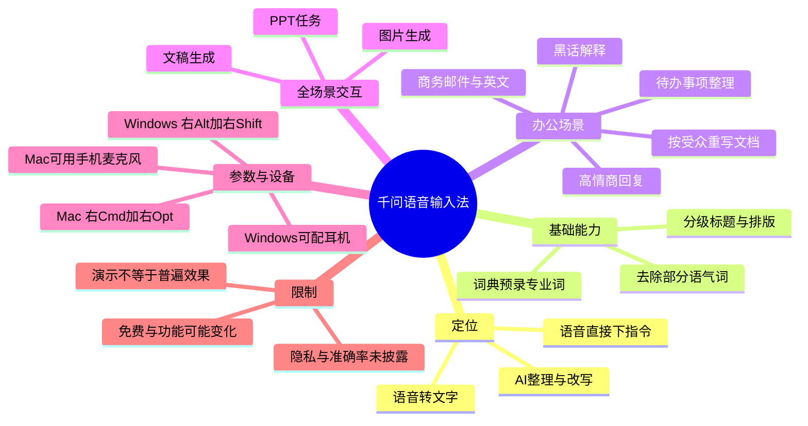
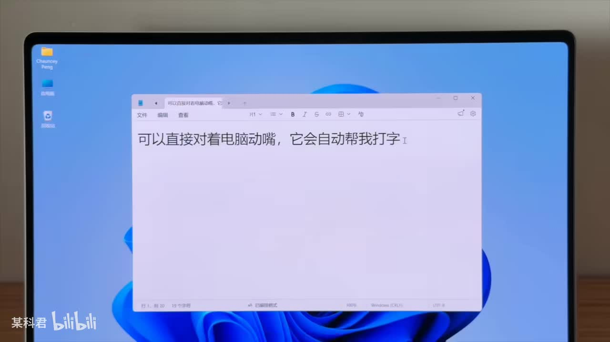
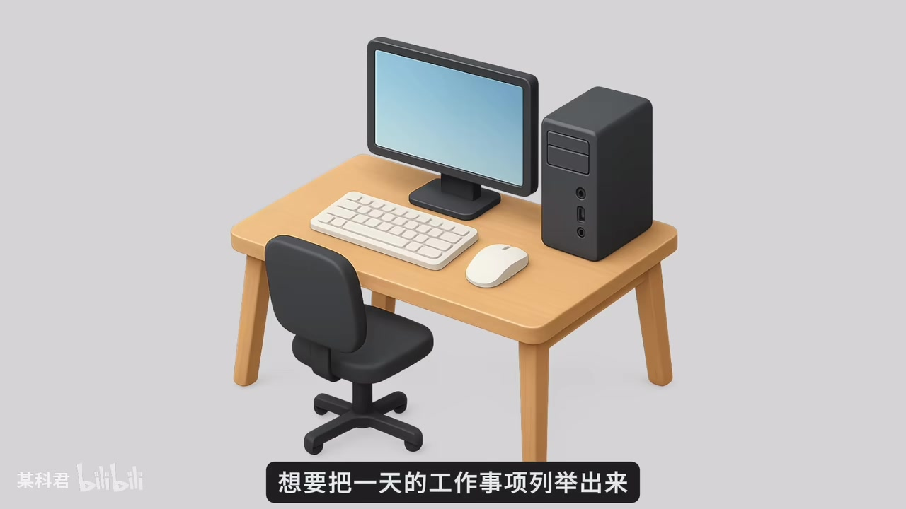
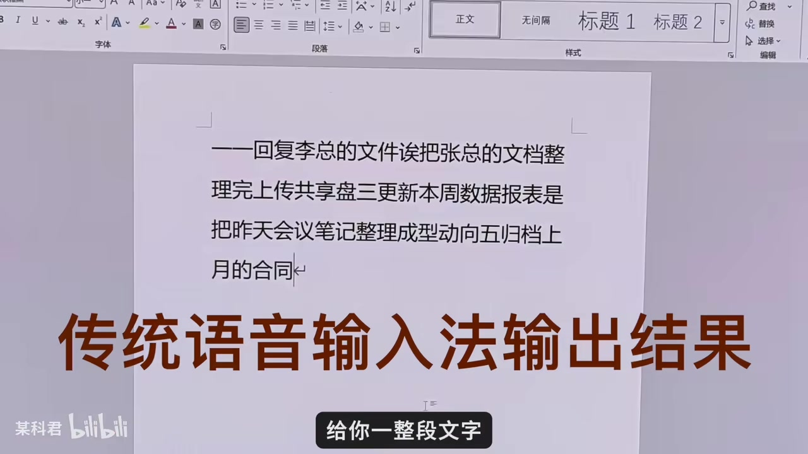

# 千问语音输入法：这波AI红利该你赶上了！

> 来源：[Bilibili 视频](https://www.bilibili.com/video/BV1ciLR6wEmY)  
> UP 主：某科君｜时长：03:42｜分辨率：1920 × 1080  
> 本文依据视频画面、站内中文时间轴字幕与本次 ASR 整理；工具能力、收费与兼容性均以视频发布时演示为准。

## 小结

视频介绍的是「千问语音输入法」在电脑端的工作流：按快捷键后，不仅可以把语音转成文字，还可让 AI 对内容进行整理、改写、翻译或继续执行生成任务。UP 主将它与传统语音输入作区分：传统方案主要输出一整段口语化文本，而视频所演示的结果能够去除部分语气词、整理结构，并设置分级标题。

视频给出了五类办公场景：口述待办事项、将情绪化表达改成温和回复、邮件改写及商务英语转换、面向不同对象重写文档、提前录入专业词至词典；最后扩展到直接用语音要求 AI 出图、生成文稿和制作 PPT。其核心主张不是单纯“识别更准”，而是通过语音指令减少“转写后再复制、粘贴、发送给 AI”的中间步骤。

视频声称该输入法“完全免费”，支持 Windows 和 Mac；Windows 的语音指令快捷键为 **右 Alt + 右 Shift**，Mac 为 **右 Cmd + 右 Option（Opt）**。如果使用苹果生态，UP 主建议在声音设置中将输入设备切换为手机麦克风；Windows 则可使用耳机，在办公室近距离轻声说话。

需要注意，视频以产品演示和个人体验为主，未提供识别准确率、延迟、隐私与数据处理方式、免费政策期限、地区限制、PPT/图片生成成功率等可复核指标。站内热评也出现“面向小白的宣传”“识别能力不如豆包”等质疑，这些都属于用户观点，不能当作已验证结论。实际使用前尤其应确认企业数据、敏感会议内容和账号权限的处理规则。

## 思维导图

## 目录

- [定位：从普通转写到 AI 整理](#定位从普通转写到-ai-整理)
- [五类办公使用方法](#五类办公使用方法)
  - [1. 口述待办并自动列项](#1-口述待办并自动列项)
  - [2. 将情绪化表达改为温和回复](#2-将情绪化表达改为温和回复)
  - [3. 邮件、受众适配与术语解释](#3-邮件受众适配与术语解释)
  - [4. 通过词典提升专业词识别](#4-通过词典提升专业词识别)
- [全场景语音交互与快捷键](#全场景语音交互与快捷键)
- [设备建议、时效性与限制](#设备建议时效性与限制)
- [字幕比对](#字幕比对)
- [评论分析](#评论分析)
- [处理记录](#处理记录)

## [定位：从普通转写到 AI 整理](https://www.bilibili.com/video/BV1ciLR6wEmY?t=0)

视频开场用键盘 Alt 键作对比：普通状态下按 Alt 没有直接输出；而在 UP 主的演示中，按下相应按键后可以对着电脑说话，系统会自动输入文字。

UP 主强调该功能不是普通的“语音转文字”。以撰写周报为例，视频将传统语音输入结果描述为较杂乱、带有语气词的一整段文字；而千问语音输入法的演示结果则会：

1. 对口述内容进行整理与排版；
2. 设置不同层级的标题；
3. 去除部分语气词或口语填充词；
4. 输出更适合直接阅读或继续编辑的结构化文本。

> 图：画面展示电脑文稿窗口中的实时输入效果，是理解“按键后直接口述输入”这一基础交互的关键帧；它证明视频确实在演示电脑端文稿场景，而非只作口头描述。

> 图：画面用放大的口语填充词说明传统转写文本可能保留大量语气词，对应视频所说的“去除语句水词”价值。

视频在约 00:28 提到，若要实现类似效果，也可使用 **Typeless**，但 UP 主认为其订阅费用“不便宜”；随后说明自己使用的是千问语音输入法，并声称其“完全免费”、支持 Mac 与 Windows。此处是 UP 主的产品比较与个人判断，视频没有展示 Typeless 的具体价格或套餐，也没有给出千问的版本号及免费政策细则。

## [五类办公使用方法](https://www.bilibili.com/video/BV1ciLR6wEmY?t=42)

### [1. 口述待办并自动列项](https://www.bilibili.com/video/BV1ciLR6wEmY?t=42)

视频的第一个具体场景是整理一天的工作待办。UP 主认为，传统方式需要先在脑中把事项按逻辑排序后再打字；使用语音输入时，可以先按快捷键，再按想到的顺序直接说，不必预先组织语言。

视频宣称系统之后会将事项按序号逐条、分行列出，而不是形成一整段连续文字。可复用的操作流程为：

1. 打开待办、文稿或任意可输入文字的界面；
2. 按下语音输入快捷键；
3. 不要求自己先排序，直接口述想到的事项；
4. 检查 AI 整理后的编号、分行、优先级与遗漏项；
5. 再根据实际工作安排补充截止时间、负责人或优先级。

> 图：该帧对应“列举一天工作事项”的任务入口，帮助定位视频从基础能力转入待办整理这一具体应用场景。

> 图：该帧直观呈现视频批评的传统输出形式：连续、不分项的文本。它说明视频的卖点在于后续结构化整理，而非仅仅把声音录入文档。

### [2. 将情绪化表达改为温和回复](https://www.bilibili.com/video/BV1ciLR6wEmY?t=60)

第二类场景是聊天沟通。视频列举了容易引发情绪的职场情况，例如：他人拿走自己的工作成果、项目被反复分批修改、对方语气不好等。UP 主的建议不是直接发送愤怒回复，而是先把心里的话完整说出，再追加一个改写指令。

视频中的指令意图可整理为：

> 帮我把刚才说的话改成高情商、温和一点的回复。

按视频演示，AI 会把此前的口述内容改写为更平和的表达。UP 主认为这样既能表达观点，也能让沟通双方更容易接受，从而有利于工作推进。

实践时应特别保留人工审核环节：

- AI 改写可能弱化事实、责任边界或必要的明确要求；
- 涉及投诉、绩效、合同、劳动争议或客户承诺时，不应未经核实直接发送；
- “高情商”是风格目标，不等于对方必然接受，也不等于内容本身正确。

### [3. 邮件、受众适配与术语解释](https://www.bilibili.com/video/BV1ciLR6wEmY?t=93)

第三类场景从约 01:33 开始：写邮件时，先选中已有文字，按下快捷键，再要求千问将文字改写成商务邮件格式。若对方是外国人，视频称还可进一步改成商务英语。

视频随后将其称为“文档编辑全能助手”，并强调同一份文档面对不同对象应有不同写法：

| 目标读者 | 视频给出的改写方向 | 目的 |
| --- | --- | --- |
| 领导 | 将结论与风险前置 | 方便决策 |
| 跨部门同事 | 将合作利益关系放在前面 | 强调协作价值 |
| 读不懂术语的读者 | 要求解释或翻译互联网黑话 | 快速理解表达 |

视频举例的“互联网黑话”包括“对齐颗粒度”“找到抓手”“赋能”“闭环”。这些词在不同组织中可能有不同的具体含义；让 AI 解释时，最好同时给出原句、项目背景和所属业务，避免生成泛化定义。

可按以下步骤使用：

1. 选中需要处理的原文，或先用语音口述草稿；
2. 按快捷键唤起语音指令；
3. 清楚说明目标格式、目标读者、语气和约束；
4. 例如要求“改成商务邮件”“改成商务英语”“结论与风险前置”；
5. 核对人名、日期、金额、附件、承诺条款及专业术语后再发送。

视频没有演示实际英文质量，也没有说明是否支持指定英文地区、语气等级或企业模板，因此“商务英语”效果需以实际输出为准。

### [4. 通过词典提升专业词识别](https://www.bilibili.com/video/BV1ciLR6wEmY?t=133)

视频指出，工作中项目名、技术术语、人名等内容常常难以被语音识别。解决方式是提前在千问电脑端的词典中录入这些词，之后系统可以更准确地识别并自动填入，减少反复校对。

这里的关键前提是：词典中已准确录入目标词。推荐将下列内容作为优先维护对象：

- 内部项目名称、产品代号；
- 技术栈、接口名称、缩写；
- 客户、同事、供应商的人名；
- 容易混淆的品牌名或英文术语；
- 高频出现、且拼写错误成本较高的字段。

视频仅说明存在“电脑端词典”和预先录入能力，未展示具体入口、词典数量上限、同步机制、导入格式及隐私处理方式。因此这些参数不能据此推断。

## [全场景语音交互与快捷键](https://www.bilibili.com/video/BV1ciLR6wEmY?t=145)

视频将“全场景语音交互”视为选择该产品的关键理由。UP 主的对比逻辑是：

- **其他语音输入软件**：先把声音转成文字；随后仍需打开 AI 软件、复制、粘贴、发送，AI 才开始执行。
- **视频演示的千问语音输入法**：按快捷键后直接说出任务，让 AI 直接开始处理，省去中间转运步骤。

视频给出的语音指令快捷键如下：

| 操作系统 | 视频给出的快捷键 | 用途 |
| --- | --- | --- |
| Windows | **右 Alt + 右 Shift** | 唤起语音指令 |
| Mac | **右 Cmd + 右 Opt（Option）** | 唤起语音指令 |

快捷键来源于站内中文、英文、西班牙文、葡萄牙文字幕中的一致描述；实际键位可能随软件版本、系统快捷键冲突或键盘布局变化，应以本机软件设置为准。

视频进一步展示了三种可直接口述给 AI 的任务：

1. **图片生成**：例如“帮我做一张打工人使用电脑的图片”；
2. **文稿生成**：浏览网页时得到灵感后，要求生成一篇“关于如何在逆境中保持专注”的文稿；
3. **PPT 制作**：面对领导布置的 PPT，直接用语音要求 AI 来做。

这里的“直接出图”“自动生成文稿”“指挥 AI 做 PPT”均是视频演示或口述的能力描述。视频没有展示生成耗时、成品文件格式、可编辑程度、是否需要进一步确认、是否受账号或网络条件影响，不能将其理解为任何场景下都可无条件完成。

## [设备建议、时效性与限制](https://www.bilibili.com/video/BV1ciLR6wEmY?t=191)

结尾处，UP 主称手机端语音输入已经较强，自己在手机上几乎只使用语音输入；相较之下，电脑端此前缺少“非常好用”的语音输入工具。视频再次重申千问语音输入法“完全免费”、支持 Windows 与 Mac。

视频提供的设备使用建议是：

- **苹果生态用户**：可在声音设置中把输入设备改成手机麦克风；
- **Windows 用户**：可连接耳机，在办公室靠近嘴边轻声说话；
- **日常使用定位**：UP 主认为该功能比抽象的 AI 技术名词更贴近日常办公。

### 适用人群

- 需要频繁写待办、周报、邮件、会议后续事项的人；
- 需要快速将口语草稿整理为书面表达的人；
- 高频处理不同受众文档、需要先出初稿再人工复核的人；
- 经常遇到项目名、技术术语、人名识别问题，且愿意维护自定义词典的人。

### 关键限制与风险

1. **时效性**：视频信息对应发布时的产品状态。收费、支持系统、快捷键、词典能力、生成能力与可用地区均可能变动。
2. **证据边界**：视频没有提供识别正确率、错误率、延迟、并发、离线能力、模型版本或隐私政策，不能据此量化性能。
3. **演示与实际差异**：视频中的周报整理、图片、文稿和 PPT 是示例场景；不同麦克风、环境噪声、方言、专业领域与网络环境可能影响结果。
4. **内容审核责任**：邮件、跨部门沟通与商务英语的措辞应人工复核，特别是数据、日期、责任归属、法律承诺和敏感表达。
5. **信息安全**：视频未说明语音和文本是否上传云端、保存多久、如何用于模型训练。处理企业机密、客户资料、个人信息前，应先查阅当前版本的隐私政策和组织合规要求。
6. **产品立场**：全片以推荐和效率提升为叙事主线，属于体验型内容；与其他产品的优劣比较缺少统一测试条件。

## 字幕比对

| 字幕来源 | 完整性 | 专有名词 | 时间轴 | 主要问题 |
| --- | --- | --- | --- | --- |
| Bilibili 站内中文字幕 `p01-ai-zh.srt` | 覆盖 00:00–03:41，分段细，覆盖完整 | 多处错识，如“千万/签问/切问/前文”等；“TAPLESS”应结合其他字幕校正为 Typeless | 精细，可直接用于章节定位 | 中文人名、产品名与部分术语存在明显同音错误 |
| Bilibili 英文、西语、葡语字幕 | 覆盖完整，可交叉验证语义 | 将产品稳定写作 Qwen / Qianwen；明确 Typeless 和快捷键 | 与中文段落基本一致 | 为机器翻译字幕，局部表述不自然；不能替代中文语义判断 |
| 本次 ASR 字幕 | 语言识别为中文，时长覆盖约 221.36 秒；语音覆盖率 90.15% | 错误较多，如“out/Out”代替 Alt、“TypeLine”代替 Typeless、“签问/前问/千万”代替千问 | 13 个长分段，能确认整体时间范围，不适合细颗粒度引用 | 分段过粗，专名和术语误识别明显，但没有 `noAudioStream=true`，说明源视频存在可识别音轨 |

### 最终字幕选择

本文以 **站内中文时间轴字幕** 作为时间定位主来源，并用本次 ASR 检查音轨、语种和内容覆盖；站内英文、西语、葡语字幕用于交叉校正专有名词与快捷键。原因是站内中文字幕分段更细，时间点可直接用于 Bilibili 链接，而 ASR 的中文语义虽总体连贯，但专有名词错识较多。

经交叉校正后，本文采用以下写法：

- `alt/out/Out` → **Alt**；
- `TAPLESS/TypeLine` → **Typeless**；
- `千万/签问/切问/前问/前文` → **千问**；
- `商劳英语` → **商务英语**；
- `对齐颗粒度、找到抓手、赋能、闭环` → 以站内中文字幕和外语字幕共同指向的术语为准；
- Windows 快捷键 → **右 Alt + 右 Shift**；
- Mac 快捷键 → **右 Cmd + 右 Opt**。

## 评论分析

以下仅处理已获取的热评前三条；评论反映的是个体态度，不构成对产品能力的验证。

1. **儚く散る花火｜6 赞**  
   评论：“幽默，这是唬小白来了”。  
   该评论认为视频的推荐或演示带有面向新手的营销、夸大意味。它没有给出具体功能反例、测试数据或使用环境，因此可以视为对内容可信度的提醒，但不足以单独证明产品能力不存在。

2. **叫兽的世界你不懂｜3 赞**  
   评论：“拉黑所有‘’这‘’后面顿一下的博主”。  
   评论针对的是 UP 主的口播习惯或表达节奏，而不是千问语音输入法本身，对功能、兼容性、收费或准确率没有提供补充信息。

3. **莫终曲｜4 赞**  
   评论：“千问语音识别被豆包甩了几条街”。  
   该评论提出与豆包语音识别的性能比较，但未给出测试语言、噪声环境、设备、版本、样本、指标或结果截图。它提示读者在选择工具时应进行横向试用，却不能据此得出千问必然落后的事实结论。

## 处理记录

- **Worker ID**：worker-mrj0www4-e8d79408
- **模型**：gpt-5.6-terra
- **调用工具与素材**：视频元数据、关键帧列表与画面、Bilibili 站内多语言 SRT、`asr/transcript.srt`、`asr/asr-result.json`、热评数据。
- **ASR 检查结果**：本次 ASR 模型为 `medium`，语言识别为中文，置信度 `0.9990234375`，CUDA `float16`；检测到有效音轨，未出现 `noAudioStream=true`；ASR 覆盖时长约 221.36 秒。
- **字幕选择**：以站内中文 SRT 的精细时间轴为主；用 ASR 确认音轨和内容范围；用站内英文、西语、葡语字幕交叉修正“千问 / Typeless / Alt”和快捷键等专有信息。
- **关键帧选择依据**：选用 `frame-001` 至 `frame-004`，分别对应电脑端口述输入、语气词问题、待办事项场景、传统连续文本输出；这些画面直接支撑正文中的功能对比与任务流程。
- **缓存清理**：提供的素材中未包含缓存清理执行日志；本文不声称已执行或完成缓存清理。
- **未解决问题**：未提供当前版本软件的下载入口、账号要求、隐私政策、数据是否云端处理、词典配置界面、免费政策期限、生成文件格式与产品横向测试数据；以上均需在实际使用前另行核验。
