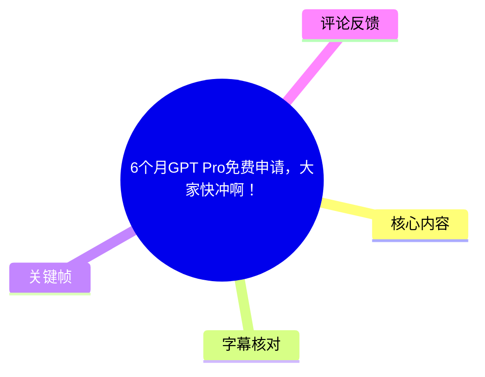
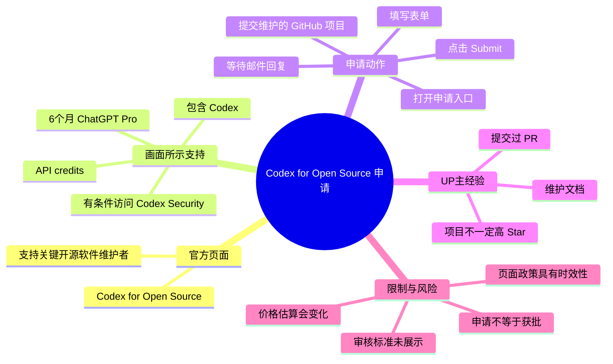
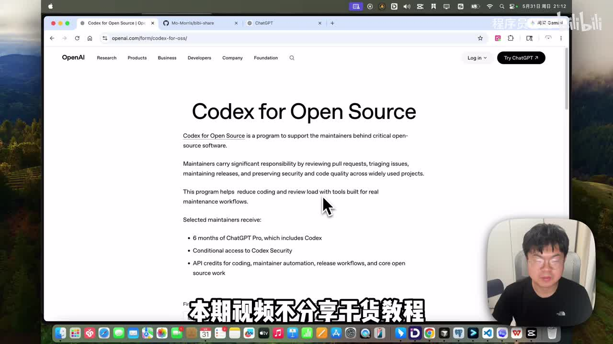
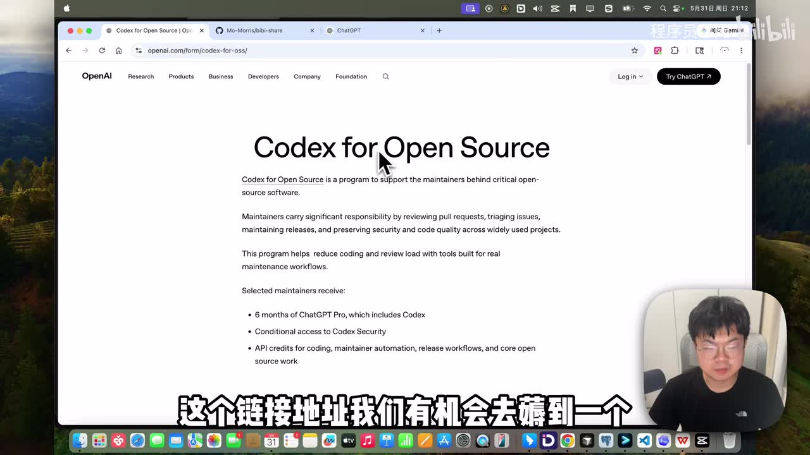
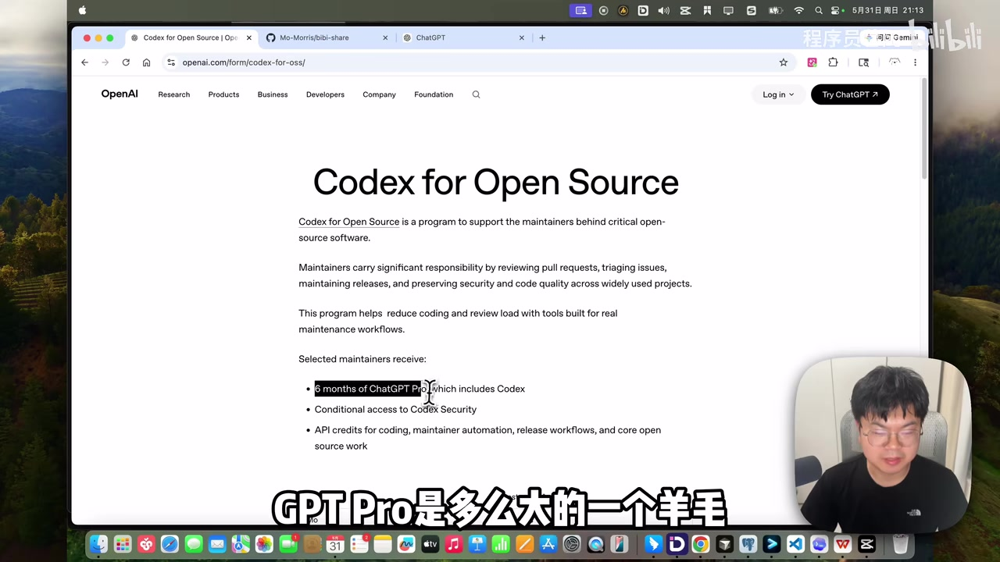
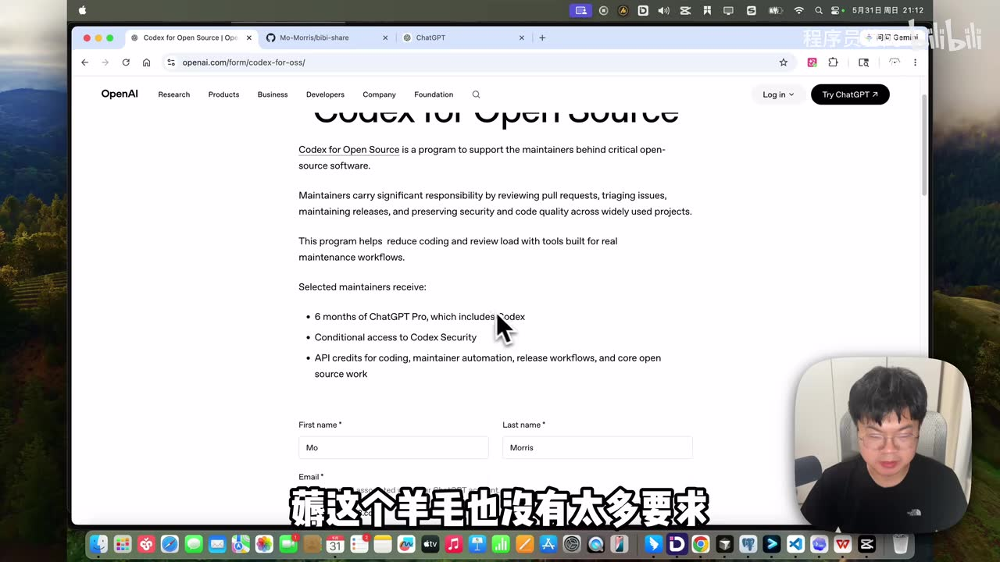

# 6个月GPT Pro免费申请，大家快冲啊！

> 来源：[Bilibili 视频](https://www.bilibili.com/video/BV147VQ6fEq9)  
> UP 主：程序员暮闲｜时长：1 分 47 秒｜合集：AIcode  
> 视频主题：演示 OpenAI「Codex for Open Source」页面，并介绍提交 GitHub 开源维护项目以申请支持计划的流程。

## 小结

视频分享的是 OpenAI 面向开源维护者的 **Codex for Open Source** 申请入口。画面中的官方页面写明：该计划旨在支持关键开源软件背后的维护者；获选维护者可获得 **6 个月 ChatGPT Pro（包含 Codex）**、有条件的 Codex Security 访问权限，以及用于编程、维护者自动化、发布工作流和核心开源工作的 API credits。

UP 主给出的核心操作是：打开申请页面，在表单中提交自己维护的 GitHub 开源项目，并按页面要求补齐信息后点击 `Submit`。视频没有展示提交成功、审核标准、审核周期或实际获批案例，因此“提交项目即可申请”应理解为**进入申请流程的基本动作**，而不是获批承诺。

UP 主以自己正在维护的项目为例说明：即使没有“Star 很高”的项目，也可以尝试提交；其维护工作包括曾向他人项目提交 PR，以及维护与自己 Bilibili、YouTube 视频相关的文档。不过这只是个人经验和尝试，不构成官方资格门槛说明。

关于价值，UP 主称自己目前使用每月 20 美元的 ChatGPT Plus，并按汇率 1 美元≈7 元估算，若拿到 6 个月 Pro，“价值”约为 **4,200 元人民币**。该估算隐含 Pro 月费约 100 美元，且受套餐定价、地区、税费与汇率变化影响，不能视为固定价格或实际可兑现收益。

该信息具有明显时效性。页面政策、申请入口、资格审核、额度、赠送时长及可用地区均可能变化；视频中仅显示申请页面和福利条目，未提供申请截止日期，也未确认 UP 主最终是否获批。

## 思维导图

## 目录

- [背景与页面信息](#背景与页面信息)
- [福利内容与价值估算](#福利内容与价值估算)
- [申请条件与项目维护经验](#申请条件与项目维护经验)
- [提交步骤与等待结果](#提交步骤与等待结果)
- [限制、风险与时效性](#限制风险与时效性)
- [字幕比对](#字幕比对)
- [评论分析](#评论分析)
- [处理记录](#处理记录)

## [背景与页面信息](https://www.bilibili.com/video/BV147VQ6fEq9?t=1)

视频开头，UP 主说明本期不是常规“干货教程”，而是分享一个可尝试的开源福利申请机会。其展示的浏览器地址为：

`openai.com/form/codex-for-oss/`

页面标题为 **Codex for Open Source**。从画面可读到，该计划用于支持“关键开源软件”背后的维护者；页面还解释维护者承担的工作包括：

- 审核 Pull Requests（PR）；
- 分类处理 Issues；
- 维护版本发布；
- 维护广泛使用项目中的安全性与代码质量；
- 借助为维护工作流打造的工具，降低编码与审查负担。

因此，视频所说的“薅羊毛”是 UP 主的口语化表达；从页面定位看，这实际是一个面向开源维护者的支持计划，而不是无条件领取的普通会员活动。

> 图：关键帧直接展示 `Codex for Open Source` 标题及其“支持关键开源软件维护者”的页面定位，可用于核对视频并非单纯的 GPT 订阅促销页面。

## [福利内容与价值估算](https://www.bilibili.com/video/BV147VQ6fEq9?t=25)

### 页面展示的支持项目

在页面的 “Selected maintainers receive” 部分，画面列出的内容包括：

1. **6 months of ChatGPT Pro, which includes Codex**  
   即获选维护者可获得 6 个月的 ChatGPT Pro，其中包含 Codex。

2. **Conditional access to Codex Security**  
   即有条件获得 Codex Security 访问权限。  
   “Conditional” 表明此项并非无条件、自动提供；视频和画面未进一步解释条件。

3. **API credits for coding, maintainer automation, release workflows, and core open source work**  
   即用于编程、维护者自动化、发布工作流和核心开源工作的 API credits。  
   页面未在画面中展示 credits 的具体数量、使用期限、适用模型或区域限制。

> 图：该帧完整保留了 “Selected maintainers receive” 下的三项福利，是确认“6 个月 ChatGPT Pro”“Codex Security 条件访问”“API credits”三项信息的核心画面证据。

### UP 主的价值计算

UP 主在约 00:25 后打开 GPT 套餐相关页面并说明：

- 自己当前使用每月 **20 美元**的 Plus 会员；
- 若获得 6 个月 Pro，按 **1 美元≈7 元人民币**计算，约为 **4,200 元人民币**；
- 因此他认为该机会的价值较大。

这里需要区分视频陈述与可迁移结论：

| 项目 | 视频中的说法 | 应如何理解 |
| --- | --- | --- |
| Plus 价格 | UP 主目前使用 20 美元 Plus | 是 UP 主个人所见套餐与使用情况，不代表所有地区价格。 |
| Pro 价值 | 6 个月约合 4,200 元 | 属于按约 100 美元/月、汇率 7 的粗略乘法估算。 |
| 6 个月 Pro | 页面明确列出 | 仅针对 “Selected maintainers”（获选维护者），不是提交后必得。 |
| 其他权益 | Codex Security、API credits | 页面仅说明存在，未展示具体额度或资格细则。 |

> 图：该帧聚焦于“6 months of ChatGPT Pro, which includes Codex”文字，能够将视频标题中的“6个月 GPT Pro”与页面的英文原文对应起来。

## [申请条件与项目维护经验](https://www.bilibili.com/video/BV147VQ6fEq9?t=49)

UP 主将申请的关键概括为：在表单中提交一个自己维护的 GitHub 开源项目。视频中没有展示完整规则文本，也没有展示必需的 Star、Fork、贡献次数、维护时长、许可证类型或组织身份等硬性阈值。

UP 主补充了自己的项目背景：

- 自己在 GitHub 上没有很多 Star 很高的项目；
- 曾给其他项目提交过很多 PR；
- 有一个与其 Bilibili、YouTube 视频相关的文档项目；
- 该文档由其在项目下持续维护；
- 他准备将这个项目提交，尝试申请。

这段经验可提炼为：**项目的持续维护痕迹、实际贡献和与项目相关的工作内容，可能比单一的 Star 数更值得在申请材料中说明。** 但这只是根据页面对维护者工作（PR、Issue、release、安全与质量）的描述与 UP 主个人案例作出的整理，不应推导为“低 Star 项目一定能获批”或“提交 PR 即必然符合资格”。

> 图：该帧显示页面在权益说明下方进入表单区域，可见 `First name`、`Last name`、`Email` 等字段，证明视频确实演示了填写申请表，而非仅停留在活动介绍页。

## [提交步骤与等待结果](https://www.bilibili.com/video/BV147VQ6fEq9?t=73)

根据 UP 主的实际讲述，申请操作可按以下顺序整理：

1. **打开申请入口**  
   进入视频展示的 `openai.com/form/codex-for-oss/` 页面。

2. **确认计划定位与支持内容**  
   阅读页面对开源维护者职责、6 个月 ChatGPT Pro、Codex Security 条件访问及 API credits 的说明，避免将其误解为所有用户可直接领取的订阅福利。

3. **准备维护项目材料**  
   选择一个自己维护的 GitHub 开源项目。视频未展示字段清单和材料格式，但 UP 主强调需要按页面文档/表单要求提供内容。

4. **填写表单基础信息和项目相关内容**  
   视频画面可见姓名、邮箱等基础字段；其余字段应以申请页面实时显示内容为准，不应根据视频补写或猜测。

5. **点击 `Submit` 提交**  
   UP 主明确说明，将内容按要求填写后，直接点击 `Submit` 即可提交。

6. **等待邮件回复**  
   提交后等待邮件通知。UP 主表示，如果邮件通知申请成功，即可获得相应支持。

7. **关注后续验证**  
   UP 主承诺若自己申请到，会向观众同步结果；但在本视频素材中，尚未出现获批邮件、兑换过程、订阅到账页面或 API credits 发放记录。

### 提交前的实用检查

以下是基于视频所示流程可执行、但不超出原始信息的检查项：

- GitHub 链接是否指向自己实际维护的开源项目；
- 项目维护关系是否能够从公开提交、PR、文档维护或项目说明中体现；
- 姓名、邮箱和项目链接等表单信息是否一致、可联系；
- 是否阅读当前页面的最新条款与字段说明；
- 提交后是否检查申请邮箱的收件箱和垃圾邮件箱。

## [限制、风险与时效性](https://www.bilibili.com/video/BV147VQ6fEq9?t=97)

### 视频未能确认的信息

以下事项在素材中均未展示或验证：

- OpenAI 对“维护者”和“关键开源软件”的正式资格标准；
- 是否存在最低 Star、活跃度、贡献量、项目规模等门槛；
- 审核周期、审核人数、通过率和拒绝原因；
- 6 个月 Pro 的激活方式、起算时间、地域可用性；
- API credits 的数量、有效期、可用模型和是否有超额计费；
- Codex Security 的具体附加条件；
- UP 主本人是否已经获批。

因此，正确预期应是：**可以尝试提交申请，但申请、审核通过、权益发放是三个不同阶段。**

### 评论所反映的现实预期

视频结尾强调“越早知道、越早申请”更有利于尝试，但热评中也有用户认为申请难度很高。二者并不矛盾：及早申请可以避免错过入口或政策变化，却不能替代符合计划对维护者贡献的审核。

### 时效性说明

- 视频发布时间为 2026-05-31，相关申请页面与套餐权益属于动态信息。
- 视频中没有给出截止日期，不能据此判断计划是否长期开放。
- ChatGPT Pro、Plus 的价格与可用地区可能变化。
- 最终应以 OpenAI 申请页面当下展示的条款、字段、资格说明和邮件通知为准。

## [字幕比对](https://www.bilibili.com/video/BV147VQ6fEq9?t=1)

本次同时检查了站内字幕与 ASR。源素材存在音频：ASR 诊断显示语音覆盖约 98.46%，首段语音约从 00:00:00.880 开始，最后语音约在 00:01:45.610 结束；`asr-result.json` **未标记** `noAudioStream=true`。

| 字幕来源 | 完整性 | 专有名词 | 时间轴 | 主要问题 |
| --- | --- | --- | --- | --- |
| Bilibili 站内字幕 `p01-ai-zh.srt` | 与视频内容不匹配 | 未出现 OpenAI、Codex、GitHub、GPT Pro 等实际主题词 | 分段时间本身存在，但对应的是其他内容 | 字幕内容为聚会、输入法等无关文本，明显不应采用。 |
| 本次 ASR（medium） | 覆盖较高，共 5 段 | 部分专名识别错误，如 `OPENWARE`、`GBT Pro`、`羊茅` | `asr-result.json` 的 00:00:00.880—00:01:45.610 与实际视频时长相符 | 分段较粗，部分汉字误识别；导出的 ASR SRT 第 3—5 段结束时间超过实际时长，不能直接信任。 |

### 最终字幕选择与校正原则

正文以 **ASR 结果 JSON 中的真实分段起止时间**作为时间轴依据：

| ASR 段落 | 实际时间 | 正文校正后的含义 |
| --- | ---: | --- |
| 第 1 段 | 00:00:00.880—00:00:25.050 | 打开 OpenAI 的申请链接，有机会申请 6 个月 GPT Pro；需要提交 GitHub 维护项目。 |
| 第 2 段 | 00:00:25.050—00:00:49.330 | 说明 6 个月 Pro 的价值，并按汇率 7 估算约 4,200 元。 |
| 第 3 段 | 00:00:49.330—00:01:13.350 | 说明条件是提交维护项目，并分享自己维护文档、提交 PR 的经历。 |
| 第 4 段 | 00:01:13.350—00:01:37.430 | 按页面要求填写内容，点击 Submit，等待回复。 |
| 第 5 段 | 00:01:37.430—00:01:45.610 | 邮件通知获批后即可获得权益；UP 主结尾互动。 |

重要校正依据如下：

- `OPENWARE`：画面地址栏和页面品牌均显示为 **OpenAI**。
- `铠地坂`：结合画面标题和地址，应为 **Codex for Open Source** 申请页面，而非 ASR 的无意义词。
- `GBT Pro`：应校正为 **GPT Pro**。
- `羊茅`：语义应为口语化的“羊毛”。
- `文桓`、`项部`、`维護`等：分别按上下文整理为“文档”“项目”“维护”。
- 站内字幕虽带有时间轴，但内容完全无关，未用于正文事实提取或时间定位。

## [评论分析](https://www.bilibili.com/video/BV147VQ6fEq9?t=97)

仅获取到热评前三条，以下内容均为用户观点，不是对计划规则或获批率的已验证事实。

1. **-开水水-（26 赞）**  
   评论称曾在其他地方看到，该申请难度“不亚于去谷歌面试”。这表达了对审核竞争或门槛的强烈预期，但未给出来源、审核标准或个人申请记录，可信度仅限于“存在这种社区观感”。

2. **橙猫猫爱吃鱼（5 赞）**  
   评论认为“这个不是一般人能搞到的”。其观点与页面“Selected maintainers”的表述相符：权益面向被选中的维护者，而非普遍发放。但“不是一般人能获得”仍是主观判断，视频和评论均未提供通过率数据。

3. **打雷谁不晕（2 赞）**  
   评论询问“有没有领到的”。这一提问恰好指出视频中的关键未验证环节：素材只展示申请与等待流程，未展示实际到账或成功案例。

## 评论分析

- 热评 1：之前在别的地方看到，说这个申请的难度不亚于去谷歌面试[笑哭]
- 热评 2：别瞎搞了，这个不是一般人能搞到的
- 热评 3：有没有领到的[doge]

以上内容是观众反馈摘录，只用于补充理解视频反响，不作为正文事实依据。

## 处理记录

- **Worker ID**：worker-mrj0wjed-b0c290ad
- **模型**：gpt-5.6-terra
- **调用工具与素材**：视频元数据、Bilibili 站内字幕 `p01-ai-zh.srt`、本次 ASR 结果与诊断、ASR 时间轴文本、关键帧、热评前三条。
- **ASR 工具信息**：ASR 模型为 `medium`，语言识别为中文（概率 0.96875），运行设备为 CUDA，计算类型为 float16。
- **字幕选择**：未采用站内字幕，原因是其内容与视频完全不相关；采用本次 ASR 的 `asr-result.json` 分段时间作为时间轴，并以页面关键帧校正 OpenAI、Codex、GPT Pro、GitHub、Submit 等专有名词及误识别文字。
- **关键帧选择依据**：选择 `frame-001.jpg` 核验计划标题与定位，`frame-002.jpg` 核验三项支持内容，`frame-003.jpg` 核验表单确实存在，`frame-004.jpg` 聚焦核验“6 months of ChatGPT Pro”原文。
- **缓存清理**：提供的素材清单未包含缓存清理执行日志，无法确认是否已执行清理；未将其表述为已完成。
- **未解决问题**：未获得官方完整资格条款、申请截止时间、审核周期、API credits 具体额度、Codex Security 条件，以及 UP 主或其他申请者的最终获批证据。
