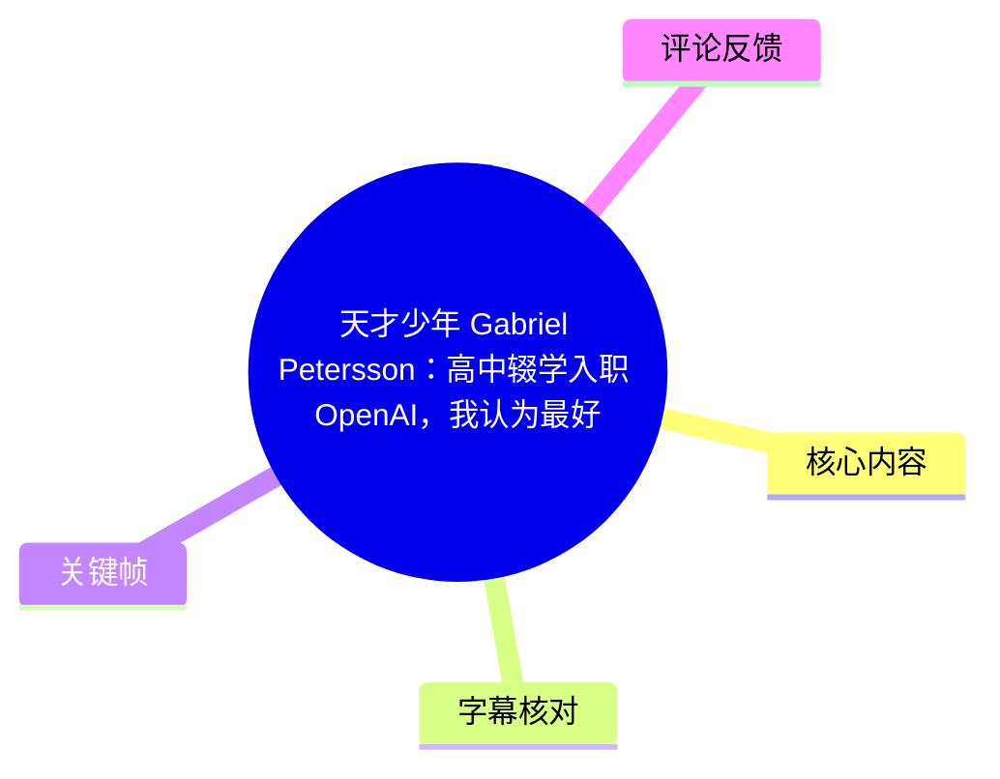
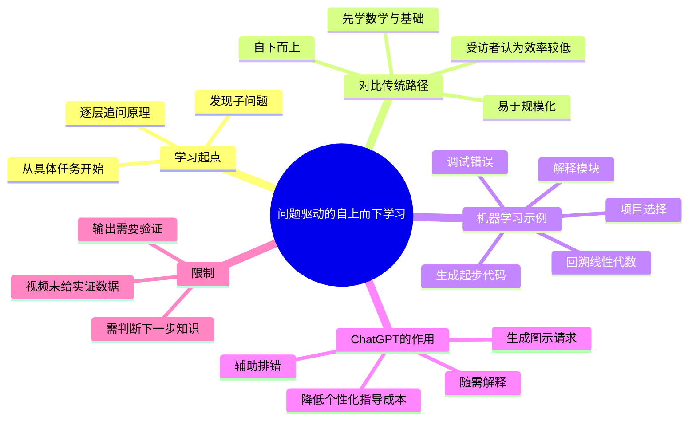
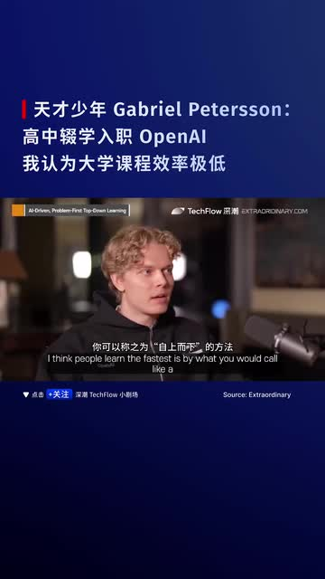
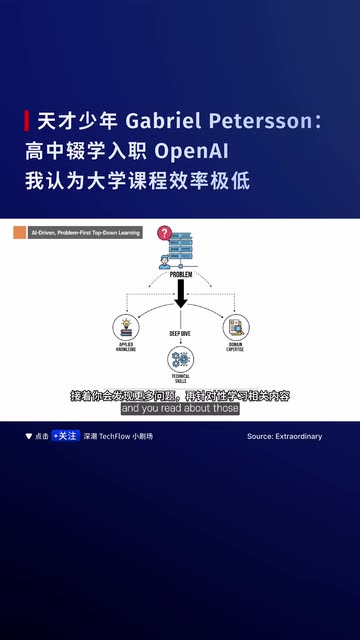
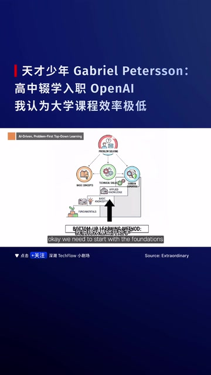
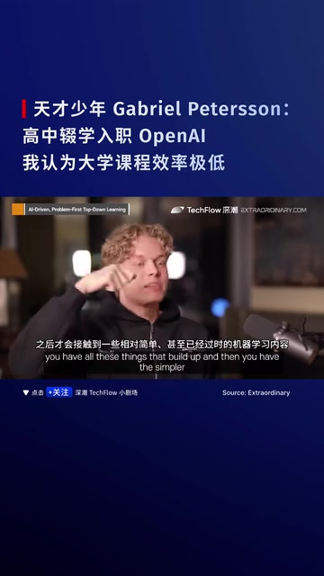

# 天才少年 Gabriel Petersson：高中辍学入职 OpenAI，我认为最好的学习方法是自上而下，现在的大学课程效率不高。 #OpenAI #AI

> 来源：[Bilibili 视频](https://www.bilibili.com/video/BV1Q4ikBhEq3)  
> UP 主：深潮TechFlow小剧场｜时长：2 分 39 秒｜画面规格：1080 × 1920（竖版）  
> 视频内采访来源标注：Extraordinary；画面栏目标签为「AI-Driven, Problem-First Top-Down Learning」。

## 小结

视频核心是 Gabriel Petersson 对学习路径的判断：相比先系统铺设基础、再接触真实任务的“自下而上”路径，他认为**从一个具体问题或项目出发，再按需要逐层向下追问知识**的“自上而下”学习，通常更快、更贴近解决问题。

他以机器学习（ML）为例批评传统教育路径：学习者往往先经历数学、矩阵相关内容、线性代数等长时间的前置课程，之后才接触较基础甚至相对旧的机器学习内容，例如线性回归；抵达可用于生产环境的 ML 能力需要很久。这里是受访者对教学效率的主观评价，而非视频提供的课程效果实证研究结论。

视频同时指出，自上而下学习过去难以规模化：它需要教师或指导者持续在场，并且能在每个节点准确判断学习者“下一步最需要补什么”。相反，固定顺序的自下而上课程更易组织和复制，但受访者认为其效率低。

ChatGPT 被视频视为改变这一约束的工具：学习者可让其提出项目、生成起步代码、协助排错、解释模块机制，并继续追问矩阵乘法、线性代数及数学直觉，形成从任务到原理的递归学习链。视频并未展示实际提示词、代码、准确率或学习结果数据，因此该方法更适合被视为一套学习工作流，而不是已被本视频验证的普适结论。

适合希望通过项目学习 AI/机器学习、需要快速建立问题导向学习路径的人参考。实践时仍须自行验证模型输出、补足基础概念和建立评估标准；视频没有讨论 AI 幻觉、版权、数据安全、课程认证或不同学习者能力差异等问题。

## 思维导图

## 目录

- [背景：问题导向学习与传统课程的张力](#背景问题导向学习与传统课程的张力)
- [核心观点：从任务向下递归学习](#核心观点从任务向下递归学习)
  - [自上而下与自下而上的差异](#自上而下与自下而上的差异)
  - [传统机器学习学习路径的批评](#传统机器学习学习路径的批评)
  - [为什么传统路径更容易规模化](#为什么传统路径更容易规模化)
- [用 ChatGPT 执行项目驱动学习](#用-chatgpt-执行项目驱动学习)
  - [机器学习学习链条](#机器学习学习链条)
  - [可复用的提问与学习步骤](#可复用的提问与学习步骤)
- [结论、限制与时效性](#结论限制与时效性)
- [关键帧](#关键帧)
- [字幕比对](#字幕比对)
- [评论分析](#评论分析)
- [处理记录](#处理记录)

## [背景：问题导向学习与传统课程的张力](https://www.bilibili.com/video/BV1Q4ikBhEq3?t=0)

视频开头即提出问题：人怎样学得最快？受访者的回答是“自上而下”（top-down）的方法，即学习不是先完整掌握所有基础，再开始做事，而是先面对一个真实问题。

标题将受访者描述为 Gabriel Petersson，并附带“高中辍学入职 OpenAI”等履历性说法；但本段可用 ASR 音频主要讨论学习与教育，没有讲述其个人教育经历、入职经历或 OpenAI 职务。因此，相关人物履历**不应仅凭标题或评论扩展为正文事实**。

视频对“大学课程效率不高”的表达，也应限定为受访者的观点：他质疑未将 ChatGPT 纳入课程的大学是否足够严肃，但没有给出学校样本、课程大纲、对照组或量化指标。

> 图：画面同时给出“问题优先的自上而下学习”栏目标签、受访者访谈画面及中文标题。它说明该视频的主体是采访观点摘录，而非一节包含完整实验或课程设计的数据报告。

## [核心观点：从任务向下递归学习](https://www.bilibili.com/video/BV1Q4ikBhEq3?t=9)

### [自上而下与自下而上的差异](https://www.bilibili.com/video/BV1Q4ikBhEq3?t=9)

根据 [00:00:09–00:00:28](https://www.bilibili.com/video/BV1Q4ikBhEq3?t=9) 的原话，自上而下的过程是：

1. 从一个问题开始；
2. 阅读或学习解决该问题所必需的内容；
3. 在处理中继续发现新的问题；
4. 再围绕新问题补充知识；
5. 逐渐深入到问题的核心。

受访者将其概括为“从实际任务开始，然后向下走”（start from the actual task and go down）。这里的“向下”不是跳过基础，而是让基础知识在真实任务需求出现时被激活和学习。

与之相对，学校中常见的心态是先从“基础”（foundations）开始。视频没有否定基础知识的价值；其批评焦点是**基础的学习顺序被固定在任务之前**，可能延迟了学习者接触实际应用的时间。

> 图：示意图以 “PROBLEM” 为顶部入口，随后向“DEEP DIVE”等环节展开，并连接到多个具体知识或任务节点。它直观呈现视频所说“由问题出发、按需深挖”的结构。

### [传统机器学习学习路径的批评](https://www.bilibili.com/video/BV1Q4ikBhEq3?t=28)

在 [00:00:28–00:00:54](https://www.bilibili.com/video/BV1Q4ikBhEq3?t=28)，受访者用机器学习学习路径举例：

- 如果想从事机器学习，按他描述的传统路径，学习者可能在最初“四年”都未真正进行机器学习实践；
- 先学习数学、矩阵相关内容（ASR 识别为 “matrix modifications”，该短语语义不够确定，不能擅自改写为某一具体数学术语）、线性代数等；
- 之后再学习较简单的机器学习内容，如线性回归（linear regression）；
- 线性回归仍部分有用，但他认为抵达“生产级机器学习”（production-grade ML）会耗费很长时间。

这里涉及的技术概念包括：

| 概念 | 视频中的位置 | 视频表达的作用 |
| --- | --- | --- |
| 数学、线性代数 | 传统学习的前置阶段 | 被描述为构建后续 ML 理解的基础 |
| 线性回归 | 较简单的 ML 内容 | 受访者称其仍有部分用途，但不足以快速通向生产级实践 |
| 生产级 ML | 传统路径的较晚阶段 | 指可落地、可用于真实生产场景的 ML 能力；视频未给出具体工程标准 |

“前四年无法做 ML”“简单 ML 已经过时”“传统路径效率极低”均属于访谈者的概括性判断。不同学校、课程和学习者的实际情况可能显著不同。

### [为什么传统路径更容易规模化](https://www.bilibili.com/video/BV1Q4ikBhEq3?t=54)

在 [00:00:54–00:01:24](https://www.bilibili.com/video/BV1Q4ikBhEq3?t=54)，受访者没有把问题简单归因于学校“不会教”，而是解释了制度性原因：

- **自上而下难规模化**：需要教师始终在场，针对学习者的状态提供指导；
- **关键难点**：必须在任意时点知道学习者具体需要学哪一小块内容；
- **自下而上易规模化**：可以规定统一顺序，“先总是学这个，再总是学那个”；
- **代价**：受访者认为这种统一路径“极其低效”。

这构成视频最重要的因果链：不是因为项目学习天然没有成本，而是它把“路径判断”和“即时反馈”变成了稀缺资源；固定课程则通过标准化降低组织成本。

> 图：画面以基础知识位于下方、应用与问题解决位于上方的层级结构展示传统路径，并与问题优先的路径形成视觉对照。该图有助于区分视频所批评的是“学习顺序”，而非否定基础本身。

## [用 ChatGPT 执行项目驱动学习](https://www.bilibili.com/video/BV1Q4ikBhEq3?t=74)

### [ChatGPT 对教育约束的潜在改变](https://www.bilibili.com/video/BV1Q4ikBhEq3?t=74)

在 [00:01:14–00:01:51](https://www.bilibili.com/video/BV1Q4ikBhEq3?t=74)，受访者认为 ChatGPT 的出现将改变教育。他提出两项判断：

1. 不把 ChatGPT 纳入课程的大学难以令他认真看待；
2. 大学不再垄断基础知识，因为人们可以从 ChatGPT 获得任意基础知识。

原始 ASR 将产品名持续识别为 “ChatGVT”；结合语境、视频中文画面字幕和常用产品名称，正文统一校正为 **ChatGPT**。这属于专有名词校正，不改变原句的论证结构。

需要注意，“任何基础知识都可以从 ChatGPT 获得”是受访者的强断言。ChatGPT 可以提供解释与示例，但其内容正确性、版本时效性、引用来源和适用前提仍需学习者验证。视频未讨论这些质量控制问题。

### [机器学习学习链条](https://www.bilibili.com/video/BV1Q4ikBhEq3?t=111)

在 [00:01:51–00:02:34](https://www.bilibili.com/video/BV1Q4ikBhEq3?t=111)，受访者给出一个相对完整的 ML 自学流程。按其叙述顺序整理如下：

1. **明确目标**：想学习机器学习。
2. **让 ChatGPT 推荐项目**：询问“我应该做什么项目？”
3. **获取可运行起点**：要求它“把项目写出来”。
4. **从故障进入学习**：代码有 bug 时，开始修 bug。
5. **围绕局部机制提问**：项目运行后，聚焦某个 ML 问题或模块，追问“这里发生了什么？”
6. **索取直觉解释**：询问为什么某模块会让模型学习，而不只接受公式描述。
7. **继续向基础回溯**：发现涉及矩阵乘法和线性代数后，再追问它们如何工作。
8. **请求可视化与数学直觉**：要求生成若干图形，以建立某个 ML 部分的直觉。
9. **逐层补齐基础**：通过上述递归过程获得与当前问题相关的基础知识。

这套流程的关键不是“让 AI 一次性代写项目”，而是把生成的项目、运行错误和模块细节转化成下一轮学习问题。

### [可复用的提问与学习步骤](https://www.bilibili.com/video/BV1Q4ikBhEq3?t=119)

视频没有给出可复制的完整提示词。以下问题形式根据其口述内容整理，保留其任务驱动逻辑；其中的验证要求是为弥补视频未覆盖的风险而补充的实践建议。

| 阶段 | 可采用的问题形式 | 预期产物 | 必要检查 |
| --- | --- | --- | --- |
| 选题 | “如果我的目标是学习机器学习，适合完成什么项目？” | 项目选项、范围与前置条件 | 检查项目规模是否与当前能力匹配 |
| 起步 | “请给出这个项目可运行的最小版本，并说明文件结构和运行条件。” | 最小可运行原型 | 本地运行；核对依赖版本与来源 |
| 排错 | “这个报错意味着什么？请先解释原因，再给最小修改方案。” | 错误原因、修复思路 | 不盲目粘贴修改；保留报错与修改记录 |
| 理解模块 | “请用直觉解释这个模块为什么能帮助模型学习。” | 机制解释 | 用小样本、单元测试或阅读文档交叉验证 |
| 回溯数学 | “这里的矩阵乘法/线性代数在计算什么？请给数值小例子。” | 公式、维度说明、小例子 | 手算一轮，确认张量维度与符号 |
| 建立直觉 | “请用图形说明这个部分如何影响模型输出。” | 图示方案与解释 | 区分示意图与真实实验曲线 |

视频中唯一明确出现的 AI 工具是 ChatGPT；没有提供模型版本、API、温度（temperature）、上下文长度、代码库、硬件配置、数据集或评测指标。因此不能从视频推导出特定技术栈或参数配置。

## [结论、限制与时效性](https://www.bilibili.com/video/BV1Q4ikBhEq3?t=149)

受访者在结尾 [00:02:29–00:02:34](https://www.bilibili.com/video/BV1Q4ikBhEq3?t=149) 的结论是：不必再总是自下而上学习；这种转变会从根本上改变教育如何开展。

可迁移的经验是：

- 以可完成的真实问题建立学习动机和上下文；
- 将 bug、概念盲点和运行结果当作知识缺口定位器；
- 采用“任务 → 局部解释 → 基础原理 → 回到任务”的循环；
- 使用 AI 辅助降低即时答疑与个性化路径设计的成本。

但不能忽略以下限制：

1. **学习路径判断仍是难点**：即使有 ChatGPT，学习者也需识别目标、拆分问题、判断当前缺口，或让教师/同行提供校正。
2. **生成内容不能自动等于正确知识**：AI 可能产生不准确解释、过期 API、不可运行代码或看似合理但错误的数学说明。
3. **项目完成不必然等于体系化理解**：若只修复局部问题而不回顾抽象规律，知识可能碎片化。
4. **基础学习并未被取消**：视频主张改变进入基础的顺序，而不是证明所有基础课程都不必要。
5. **教育结论缺乏本视频内实证**：没有呈现学习时长对照、留存率、迁移能力、不同人群样本或学校案例。
6. **时效性**：视频元数据显示发布于 2026 年 1 月。ChatGPT 的能力、功能、教育机构政策与课程设置都可能在发布后变化；视频对“大学应当如何教学”的判断应按当时语境理解。

## [关键帧](https://www.bilibili.com/video/BV1Q4ikBhEq3?t=0)

| 关键帧 | 正文位置 | 画面价值 |
| --- | --- | --- |
|  | 背景 | 明确采访主体、问题优先的主题标签及视频来源标识。 |
|  | 自上而下学习 | 用“问题—深挖—分支知识”的结构帮助理解递归学习。 |
|  | 传统路径批评 | 呈现“基础在下、应用在上”的层级关系，便于与问题优先路径对照。 |
|  | 规模化讨论 | 保留受访者口述语境，提示“效率低”等表述是访谈观点，不是图表实证结论。 |

## [字幕比对](https://www.bilibili.com/video/BV1Q4ikBhEq3?t=0)

| 字幕来源 | 完整性 | 专有名词 | 时间轴 | 主要问题 |
| --- | --- | --- | --- | --- |
| Bilibili 站内字幕 | 未提供可用字幕 | 无从核验 | 无从核验 | 素材记录显示字幕工具请求因 `Invalid URL` 退出，且未提供站内字幕文本；不能据此判断视频原本一定不存在字幕。 |
| 本次 ASR 字幕 | 高：共 21 段，语音覆盖约 152.88 秒，占 158.85 秒视频时长约 96.24% | “ChatGPT”被识别为“ChatGVT”；“matrix modifications”语义可疑但未擅自替换 | 完整：00:00:00 至 00:02:34.840，段落均带真实起止时间 | 英语口语断句较长；个别专有名词和技术短语存在识别偏差。 |

最终采用**本次 ASR 时间轴**作为章节定位依据，并依据原始 SRT 的起止时间换算秒数生成链接。ASR 诊断未标记 `noAudioStream=true`，且提供了可用音频、英语识别结果和时间戳，说明该视频存在音轨；并非无音轨素材。

已做的校正与保留原则：

- 将反复出现的 `ChatGVT` 校正为 **ChatGPT**：依据语境、标题中的 AI 教育讨论及关键帧中文画面信息。
- 保留 `matrix modifications` 的不确定性：该处不擅自解释成“矩阵变换”“矩阵运算”或其他具体术语。
- 人物、机构和履历信息仅以标题或评论出现而没有被 ASR 主体内容证实的，不扩写为已验证事实。

## [评论分析](https://www.bilibili.com/video/BV1Q4ikBhEq3?t=0)

仅处理可获取热评前三条；评论反映用户经验与观点，不构成独立核验材料。

1. **jdf02｜2149 赞**  
   评论分享了学习高频电子线路的经历：此前对电路、数模电、通信和信号等知识掌握不牢；在亲手制作 AM 发射机/收音机后，因需要设计电路、使用嘉立创与 Multisim、理解调制解调、乘法器及放大电路，约一个月内串联并运用了多门知识，最终通过相关考试。  
   - **补充价值**：提供了一个非 ML 领域的项目驱动学习案例，支持“以实际任务牵引知识整合”的直觉。  
   - **可信度边界**：这是个人自述，未提供项目资料、前后测量或课程背景，不能据此证明所有学科或学习者都会获得相同效果。

2. **Relampargo｜1816 赞**  
   评论称“期末周速通这一块”，以玩笑式表达将视频方法理解为短期高效学习策略。  
   - **补充价值**：反映观众注意到该方法的效率诉求。  
   - **风险提示**：视频讲的是围绕真实问题递归构建理解，并不等同于考前突击；若只追求速通，可能缺少长期复习、迁移训练与知识验证。

3. **心本逍-遥｜1093 赞**  
   评论列举了 Gabriel Petersson 从少年编程、卡牌交易、Depict.ai、洗手液价格比较网站、Curb Food 到 OpenAI/Sora 的多项履历与收入数据，并认为其经验丰富、能力很强。  
   - **补充价值**：说明部分观众会将人物履历视为其教育观点的背景。  
   - **可信度边界**：这些细节均来自评论，视频 ASR 未逐项陈述，也没有附可验证来源；因此不能作为本文已核实的人物新闻或履历事实。

## [处理记录](https://www.bilibili.com/video/BV1Q4ikBhEq3?t=0)

- Worker ID：`worker-mrj0wjed-b0c290ad`
- 模型：`gpt-5.6-terra`
- 可用素材与工具产物：视频元数据、12 张关键帧、音频 `audio/audio.wav`、ASR SRT、ASR 分段 JSON、热评 JSON。
- ASR 参数与诊断：`medium` 模型；自动识别语言为英语（置信度 `0.99462890625`）；`cuda`、`float16`；时长 `158.84775` 秒；21 个语音段；语音覆盖率 `0.9624`；无大间隔警告。
- 字幕选择：站内字幕未提供可用文本，字幕获取记录含 `Invalid URL` 警告；已检查并采用带真实时间戳的本次 ASR SRT。对 `ChatGVT` 作 ChatGPT 专名校正，对含义不明的 `matrix modifications` 保持原样并标注不确定性。
- 关键帧选择依据：选取开场访谈画面（`frame-001`）、问题驱动图（`frame-002`）、传统层级学习图（`frame-003`）和受访者讲解画面（`frame-004`）；它们分别服务于主题确认、方法结构、路径对比与观点归属，未将画面外信息补写为事实。
- 评论范围：仅分析可获取热评前三条，未延伸至其他评论或回复。
- 缓存清理：素材中未提供缓存清理执行记录；本文未声称已执行清理。
- 未解决问题：无法以站内字幕交叉核对 ASR；人物履历、OpenAI/Sora 职务及评论中的商业数据缺少本素材内可验证来源；视频也未提供项目代码、提示词、模型版本或教育效果量化数据。

## 评论分析

- 热评 1：深有体会。 学高频电子线路，学了半天学不懂，以前电路，数模电，通信，信号本来也没学明白。 后来让我们手做一个am发射机/收音机，从头开始做。先搞明白怎么设计电路，怎么用嘉立创，multisim，用数模电知识，再是am信号怎么调制解调 怎么设计乘法器，怎么设计放大电路，这又是通信和信号的知识。 总之，1个月不到，基本上把数模电，通信原理，信号的知识全部过了一遍而且熟练运用，还会了用相关软件。 后来高频电子电路考试也是毫无悬念的过了 真的还是要在实际上去学习
- 热评 2：期末周速通这一块
- 热评 3：确实是天才，看了眼他的履历，很强，13岁开始编程，14岁倒卖宝可梦卡片赚了20000美元，17岁高中辍学后，加入Depict.ai，成为创始团队中的一员，构建了首个产品推荐系统，采用图像卷积神经网络和自然语言处理技术。 18岁时，疫情期间，迅速上线洗手液价格比较网站，第一周收入22000美元，19岁时，被聘为临时工Curb Food 的首席技术官，当时瑞典最大的云厨房，拥有 80 名员工，从零开始组建了一支由7名工程师组成的团队。不想报数据，确实很强，不过他的工作换的也是够勤快的。1-2年1换，除了18岁以前在碳核算公司待了三年，他加入openai已经有差不多8年工作经验，其中有多家ai公司的cto或者创始工程师经验，加入openai才23岁，成为sora核心成员

以上内容是观众反馈摘录，只用于补充理解视频反响，不作为正文事实依据。
