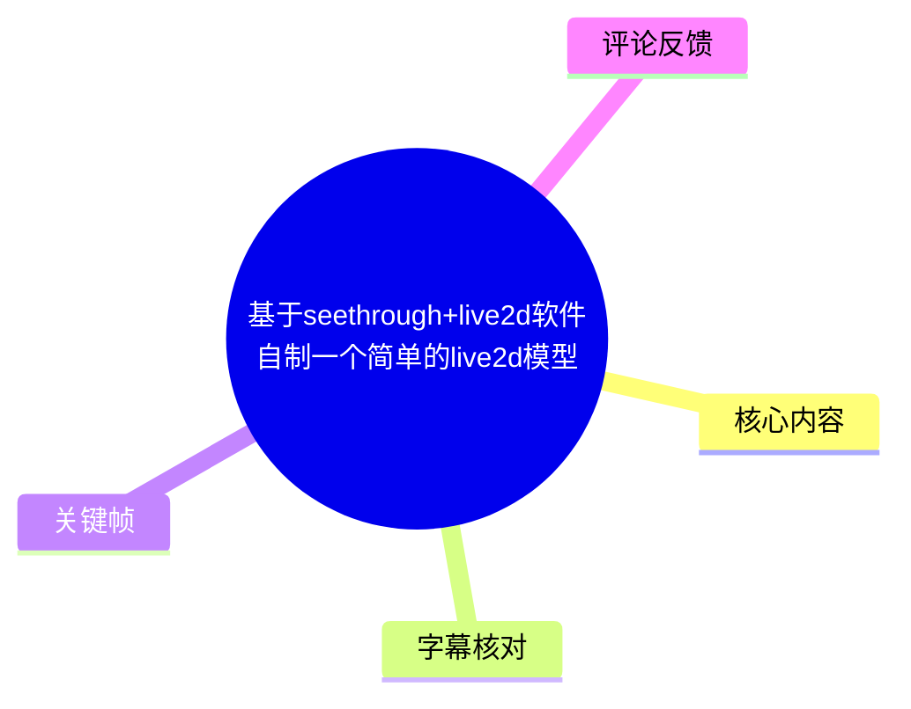
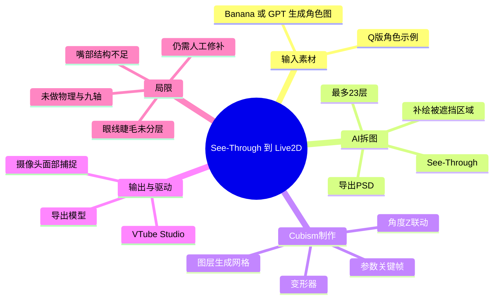
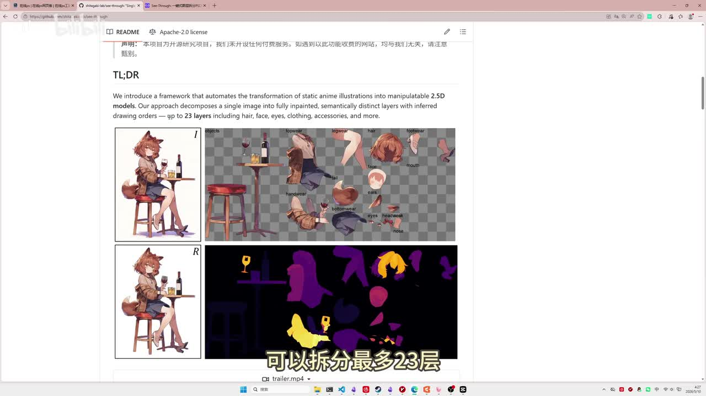
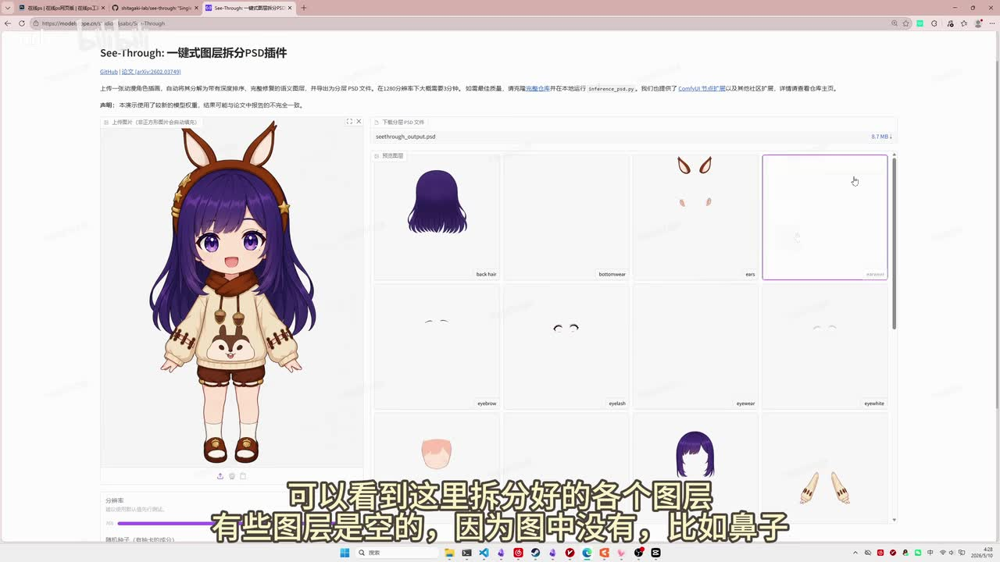
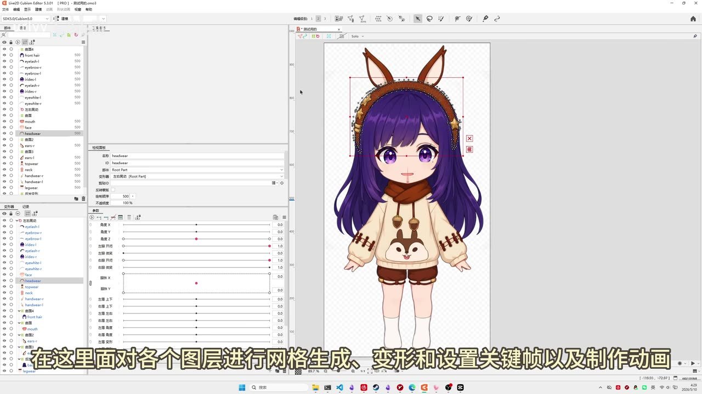
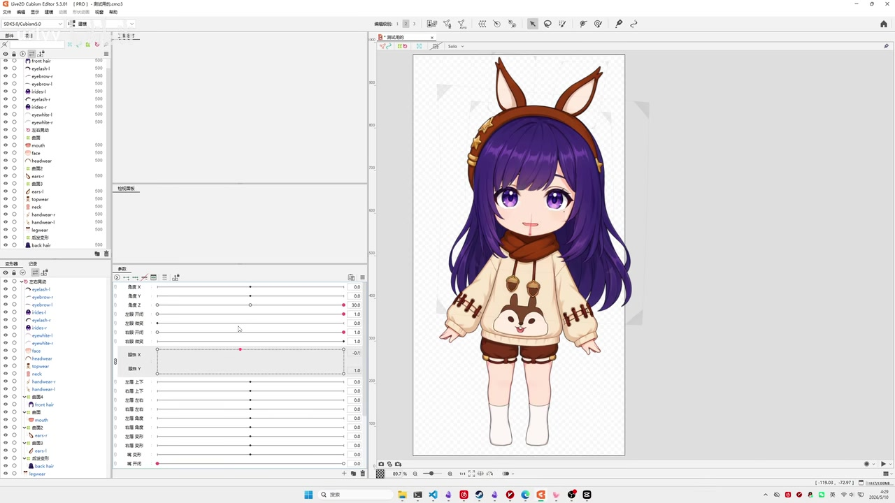

# 基于 seethrough + Live2D 软件自制一个简单的 Live2D 模型

> 来源：[Bilibili 视频](https://www.bilibili.com/video/BV1XuRfBXEKp) 
> UP 主：urlyy ｜时长：8 分 00 秒 ｜分辨率：2560×1440 
> 标签：虚拟偶像、模型、Live2D、虚拟主播、Vtuber

## 小结

- 视频展示了一条面向零美术基础使用者的简化 Live2D 制作链路：先用 Banana 或 GPT 生成角色图，再通过 See-Through 自动拆分为带图层的 PSD，随后在 **Live2D Cubism Editor** 中制作基础参数动画，最后导入 **VTube Studio** 并配置面部捕捉。
- 该流程最有价值的环节是 AI 图层拆分。视频展示的 See-Through 项目称可拆分最多 **23 层**，并能补绘原图中被前景遮挡的区域；这使导入 Cubism 后的网格、变形器和关键帧制作具备可操作的素材基础。
- UP 主实际使用 Q 版“贝拉 Kila”风格角色演示，明确表示自己仅花约 3 小时了解 Cubism 动画操作，并用少量变形器制作了简单关键帧。因此，成片定位是“简易模型分享”，不是完整的商业级 Live2D 建模教程。
- 视频给出的核心经验是：**AI 拆分降低了切图门槛，但不能替代针对动画需求的分层设计。** 睫毛与眼线未分层、嘴巴未拆成上下唇和口腔时，眨眼、闭嘴等动画就会受限。
- 成品没有实现物理效果，也没有完成头部、身体“九轴”等更复杂的参数表现；视频仅演示基础变形和摄像头面捕联动。想做自然的头发、嘴型、头身转动，仍需人工补图、重新拆层和持续学习 Cubism。
- 工具与额度信息具有时效性：视频中称 Hugging Face 与魔搭提供可直接使用的在线 Demo，且当时有免费额度；实际入口、模型、额度、生成速度及导出能力均可能在视频发布后变化，应以平台当前页面为准。

## 思维导图

## 目录

- [流程定位与所需工具](#流程定位与所需工具)
- [生成角色图与 See-Through 自动拆层](#生成角色图与-see-through-自动拆层)
- [检查 PSD：分层与遮挡区域补绘](#检查-psd分层与遮挡区域补绘)
- [在 Cubism 建立基础动画](#在-cubism-建立基础动画)
- [拆层不足导致的动画问题](#拆层不足导致的动画问题)
- [导出并接入 VTube Studio](#导出并接入-vtube-studio)
- [完整操作清单与参数汇总](#完整操作清单与参数汇总)
- [限制、适用范围与时效性](#限制适用范围与时效性)
- [字幕比对](#字幕比对)
- [评论分析](#评论分析)
- [处理记录](#处理记录)

## [流程定位与所需工具](https://www.bilibili.com/video/BV1XuRfBXEKp?t=0)

视频要解决的问题不是从零手工绘制和切分一个高规格 Live2D 模型，而是将“单张 AI 角色图”转化为“可在 Cubism 中继续制作、可接入面捕的软件模型”的最短实践路径。

视频涉及的工具链如下：

| 阶段 | 视频中出现的工具/平台 | 用途 | 视频中可确认的信息 |
| --- | --- | --- | --- |
| 角色生成 | Banana 或 GPT | 生成适合制作 Live2D 的人物图 | UP 主用其生成了一张 Q 版角色图片 |
| 自动拆层 | See-Through | 把单张图片拆为多个语义图层 | 项目示例称最多可拆 23 层 |
| 在线运行 | Hugging Face、魔搭 | 使用 See-Through 在线 Demo | 视频称当时都有免费额度 |
| 动画制作 | Live2D Cubism Editor | 网格、变形、参数、关键帧和动画制作 | 为每个图层建立可变形结构 |
| 面捕展示 | VTube Studio | 导入模型并进行面部捕捉 | 摄像头对准人脸后驱动模型 |

UP 主在视频简介中进一步说明：自己没有美术基础，花约 3 小时初步了解 Live2D 软件中的动画制作方式后，只使用几个变形器做了简单关键帧。这个前提决定了观看预期：视频适合用来理解 **“AI 拆层 + 基础 Cubism 参数绑定 + VTube Studio 驱动”** 的全链路，不足以替代系统化的 Cubism 建模课程。

## [生成角色图与 See-Through 自动拆层](https://www.bilibili.com/video/BV1XuRfBXEKp?t=0)

### 1. 准备人物原图

视频开头的做法是先使用 **Banana 或 GPT** 生成用于 Live2D 的人物图片；UP 主的示例是一张 Q 版“贝拉 Kila”角色图。

这里的“适合 Live2D”并不等于任意图片都能直接产出高质量可动模型。后续效果会受原图构图和角色细节影响，例如：

- 五官、头发、服装与身体边界是否清晰；
- 眼睛、睫毛、嘴巴是否具备可拆开的视觉结构；
- 被头发、脸部或配饰遮挡的区域，是否能被模型正确推断并补绘；
- 是否需要大幅转头、张嘴、眨眼或头身联动。

### 2. 了解 See-Through 的拆层能力

视频随后展示 See-Through 项目说明：其目标是将静态动漫插画自动转化为可操作的 2.5D 分层素材。字幕与项目展示均指向“最多 23 层”的能力表述。

> 图：该关键帧展示 See-Through 项目的说明页及角色分层示例，画面中可见不同部位被放置到透明背景上的独立区域，并出现“最多 23 层”的说明。这张图用于理解：自动拆分不仅是在原图上切块，还涉及语义图层与被遮挡区域的推断。

视频中提到可用的在线 Demo 包括：

- Hugging Face；
- 魔搭（ModelScope）。

UP 主称二者当时均有免费额度，并建议直接使用。此处应理解为视频录制时的体验陈述，而不是对当前额度、排队时间、服务稳定性或导出限制的保证。

### 3. 运行策略：分辨率拉满

在展示已提前完成的任务结果时，UP 主选择将分辨率“直接拉满”。视频给出的理由是：利用平台算力，生成大约只需要几分钟。

这一点是视频中唯一明确的生成策略，但没有给出具体像素数、模型版本、推理参数、排队时间或免费额度数值。因此可记录为：

- **策略：** 在在线 Demo 中选择最高分辨率；
- **预期：** 视频作者的实际体验是“几分钟”完成；
- **未给出的参数：** 输入尺寸、输出尺寸、推理步数、随机种子、硬件、模型版本等；
- **实践提醒：** 实际耗时会受平台负载、队列、免费额度和服务调整影响。

> 图：该关键帧左侧为原始 Q 版角色，右侧为拆分出的图层网格，包括后发、耳朵、眉毛、睫毛、眼白等区域，部分格子为空。它直接说明了自动拆层结果的结构，也为后文“空图层”和“分层不充分”的问题提供视觉依据。

## [检查 PSD：分层与遮挡区域补绘](https://www.bilibili.com/video/BV1XuRfBXEKp?t=47)

See-Through 完成处理后，视频展示了已拆分的各个图层，并提供下载包含全部图层的 **PSD 文件** 的入口。PSD 是进入 Cubism 前的重要中间产物：它保留了层级，能让用户检查图层是否满足动画需求。

### 视频中观察到的 PSD 检查要点

1. **部分图层为空是正常结果。**  
   UP 主举例说“鼻子”图层可能为空，因为原图中没有可独立识别或需要拆出的鼻子元素。空层本身不代表任务失败，但意味着相应部位无法直接用该图层制作独立动画。

2. **被遮挡区域也被绘制。**  
   视频特别强调，原图中被遮挡的部分也经过绘制。对于 Live2D 而言，这很关键：头发、脸部、衣物或配饰发生位移后，若遮挡层下方没有补全内容，就容易出现破洞、透明区域或露出背景。

3. **补绘让基础动画成为可能，不代表所有动作都自然。**  
   有补绘素材后，可以进行基础位移和变形；但补绘质量、图层边缘、结构正确性仍会决定转头、眨眼、张嘴时是否自然。

> 图：该关键帧展示 Live2D Cubism Editor 中导入后的角色、左侧图层/对象列表，以及下方参数面板。图中角色的头饰、前后发、眼部、嘴部、服装等部位已进入可编辑环境，说明 PSD 拆层是后续建模的输入，而不是最终模型。

## [在 Cubism 建立基础动画](https://www.bilibili.com/video/BV1XuRfBXEKp?t=84)

进入 **Live2D Cubism Editor** 后，视频将前一步得到的各图层用于基础模型制作。UP 主概括 Cubism 内的工作内容为：

1. 对各个图层生成网格；
2. 对网格进行变形；
3. 设置关键帧；
4. 制作动画。

这四项构成了视频实际示范的核心制作环节。

### 图层、网格与变形器的关系

视频没有展示完整的网格配置细节或参数数值，但其工作逻辑是清晰的：

- PSD 中的独立图层进入 Cubism；
- 每个可动部位需建立可编辑网格；
- 通过变形器或对网格的操作，让部位在不同参数状态下发生形变；
- 在参数滑块的不同位置设置关键帧；
- 捕捉输入改变时，模型会在相应参数状态之间切换或插值。

### 内置参数与面捕同步

UP 主将鼠标指向 Cubism 的内置参数区域，并将其理解为“触发事件”。更准确地说，视频所表达的是：摄像头采集到的主播面部、肢体状态会与模型中的参数状态同步，参数滑块上的关键帧定义了模型在不同输入状态下应呈现的形态。

视频以 **角度 Z** 为例：

- 摄像头前的直播者发生左右晃动；
- 该输入对应模型的角度 Z 参数变化；
- 当直播者向左晃动时，模型会对应到滑块左侧关键帧所设定的状态。

这里可确认的是视频的演示映射方向和“左右两端关键帧”的制作思路；视频没有列出 VTube Studio 内所有参数名、数值范围、校准方式或 Cubism 参数 ID，因此不应把“角度 Z”外推为完整的官方参数配置表。

> 图：该关键帧展示 Cubism 下方的多组参数滑块、关键点及中央角色画布。它的价值在于说明视频的动画并非逐帧视频编辑，而是通过参数滑块上的关键状态驱动网格/变形结果，以便后续与实时捕捉输入同步。

## [拆层不足导致的动画问题](https://www.bilibili.com/video/BV1XuRfBXEKp?t=117)

视频最值得迁移的经验并不是“AI 能一键完成 Live2D”，而是 UP 主对自动拆层缺陷的直接复盘。

### 眼部问题：睫毛和眼线没有拆开

视频指出，睫毛和上方眼线没有被拆成两个图层，因此 UP 主只能将它们一起处理，并明确评价这种处理方式“不好”。

这意味着在眼睛相关形变中：

- 原本应独立控制的视觉元素发生绑定；
- 闭眼、眨眼、眼皮挤压等变化缺少更细的控制空间；
- 单一变形容易造成轮廓、层级遮挡或形状不自然。

### 嘴部问题：未拆成上下唇与口腔

约 2 分 11 秒处，UP 主说明嘴巴同样没有被充分拆分为：

- 上嘴唇；
- 下嘴唇；
- 嘴巴内部/口腔。

因此其当前处理效果不佳，不能使嘴巴“完全闭合”。这不是 Cubism 软件本身无法闭嘴，而是输入图层的结构不足以支持更准确的口型制作。

### 可迁移的素材验收标准

基于视频明确展示的问题，在将 AI 拆层结果导入 Cubism 前，至少应检查：

| 部位 | 理想拆分方向 | 拆分不足时的直接风险 |
| --- | --- | --- |
| 睫毛、眼线、眼皮 | 尽量作为可独立控制的元素 | 眨眼、闭眼与表情形变生硬 |
| 眼白、虹膜、瞳孔 | 独立可移动、可遮罩 | 视线移动与眼球转动受限 |
| 上唇、下唇、口腔 | 分开并有足够遮挡内容 | 无法自然张嘴、闭嘴、做口型 |
| 前发、后发、侧发 | 按遮挡关系分层 | 转头或摇摆时穿帮 |
| 脸部与被遮挡区域 | 有完整补绘 | 位移后露出透明洞或背景 |
| 身体、衣物、配饰 | 按运动部位分层 | 身体摇摆、呼吸、物理效果难制作 |

视频简介也给出同样的总体判断：嘴巴、瞳孔、发丝等部位，AI 拆分可能不到位，不能直接支持复杂动画；除非再由人工拆分与修补。

## [导出并接入 VTube Studio](https://www.bilibili.com/video/BV1XuRfBXEKp?t=425)

完成基础动画后，视频在约 7 分 05 秒处进入输出和驱动环节：

1. 在 Cubism 中导出模型；
2. 将模型导入 **VTube Studio**；
3. 设置面部捕捉；
4. 将摄像头对准人脸；
5. 让模型跟随捕捉结果运动。

视频中说 UP 主已经提前完成了面捕设置，因此没有展示从零开始的逐项配置过程，例如模型目录结构、导出文件清单、摄像头设备选择、跟踪算法、参数映射、热键、校准流程或滤镜设置。

### 成品能力边界

视频展示的是一个可进行基础面捕联动的简单模型，而不是完整的高自由度 Vtuber 模型。UP 主在简介中明确说明尚未制作：

- 物理效果；
- 头部、身体“九轴”等复杂动作；
- 更细腻的嘴型和眼部动画；
- 复杂部位的人工拆分与修补。

因此，导入 VTube Studio 是该视频流程的“可用验收点”，但不等于模型已经达到高质量直播使用标准。

## [完整操作清单与参数汇总](https://www.bilibili.com/video/BV1XuRfBXEKp?t=0)

以下按视频展示顺序整理，不补充视频未展示的具体软件设置。

### 操作步骤

1. **生成角色图**  
   使用 Banana 或 GPT 生成人物图片；视频示例为 Q 版角色。

2. **打开 See-Through 在线 Demo**  
   视频提及 Hugging Face 与魔搭均提供在线 Demo；实际可用性以当前平台状态为准。

3. **上传图片并执行自动拆层**  
   将输出分辨率调至最高。视频作者的经验是平台算力下几分钟可完成，但未提供精确配置。

4. **检查拆层结果**  
   查看每一个语义图层，接受部分图层可能为空的事实，同时重点检查眼睛、睫毛、嘴部、瞳孔、头发及遮挡部位。

5. **下载 PSD**  
   下载包含全部图层的 PSD 文件，作为 Cubism 的输入。

6. **核验遮挡区域补绘**  
   确认被遮挡的部分是否已绘制，以避免移动图层时出现空洞。

7. **在 Cubism 中制作基础模型**  
   对图层生成网格，建立变形，配置参数滑块上的关键帧。

8. **绑定基础姿态参数**  
   视频例子为角度 Z 对应直播者左右晃动：在滑块左右端制作对应模型形态。

9. **处理拆分不完整的部位**  
   对睫毛/眼线、上下嘴唇/口腔等不完整结构，不应期待仅靠简单整体变形获得自然结果；需要人工再拆分或补绘。

10. **导出并导入 VTube Studio**  
    在 Cubism 导出模型后，导入 VTube Studio。

11. **设置面部捕捉**  
    配置面捕并使摄像头对准人脸。视频未给出具体设置项，不能据此推导特定参数值。

### 已明确出现的参数或数量信息

| 项目 | 视频中的信息 | 说明 |
| --- | --- | --- |
| 视频时长 | 480 秒 | 元数据给出 |
| See-Through 分层上限 | 最多 23 层 | 视频展示的项目能力表述 |
| 生成速度 | 几分钟 | 作者在平台算力下的经验，不是固定基准 |
| 学习/制作投入 | 约 3 小时 | 作者了解 Cubism 动画基础操作的自述 |
| 角度 Z | 对应左右晃动的示例 | 用于说明关键帧与面捕输入的联动 |
| 成品复杂度 | 基础关键帧动画 | 使用几个变形器完成 |
| 未制作项 | 物理、头身九轴等 | 作者在简介中明确列出 |

## [限制、适用范围与时效性](https://www.bilibili.com/video/BV1XuRfBXEKp?t=117)

### 视频方案适合什么情况

- 想快速将单张角色图转成可编辑分层 PSD；
- 没有手工切图基础，但愿意进入 Cubism 做基础学习；
- 目标是完成眨眼、简单转向、嘴部变化、基础面捕等入门级效果；
- 能接受后续对关键部位进行人工修补。

### 不应被忽略的限制

1. **自动拆层不是完整建模。**  
   语义分层正确不代表适合动画。模型动作需要遵守遮挡、透视、结构和表情逻辑，而这些仍需要人工判断。

2. **复杂动作对图层结构要求更高。**  
   头发摆动、瞳孔移动、自然口型、侧脸转动、呼吸、物理和头身联动都依赖更精细的分层、网格、遮罩、变形器和参数设计。

3. **视频未展示从零到高质量模型的全套流程。**  
   未提供网格密度、变形器层级、参数 ID、导出格式细节、VTube Studio 映射配置或性能调优数据。

4. **角色素材存在潜在版权与使用边界。**  
   视频使用“贝拉 Kila”相关风格/声源进行演示，并未在素材中提供可商用授权说明。将任何角色图、声音或模型用于公开发布、商业直播或再分发前，应自行确认权利与平台规则。

### 时效性说明

- 在线 Demo、免费额度和算力速度是视频发布时点的陈述，可能调整；
- See-Through、Cubism Editor、VTube Studio 的功能界面和导出兼容性可能随版本更新变化；
- 元数据记录的视频发布时间为 2026-05-10（按 Unix 时间戳换算，未标注时区），本笔记不将当时的服务状态视为长期承诺。

## 字幕比对

| 字幕来源 | 完整性 | 专有名词 | 时间轴 | 主要问题 |
| --- | --- | --- | --- | --- |
| Bilibili 站内字幕 | 覆盖开头操作讲解、Cubism 制作、导出与面捕；中段大量为歌曲歌词或无讲解内容 | “banana”“gt”“C数”“arin face”等存在识别/转写不规范 | 分段较细，适合定位；与视频实际 480 秒时长一致 | 将 See-Through、Hugging Face 等名称转写错误；部分歌词混入正文流程 |
| 本次 ASR 字幕 | 识别到 10 段主要口播，语音覆盖约 124.23 秒、覆盖率约 25.89% | “C-SUR”“拆穿”“摩大”“图存”等误识较多 | 有真实时间戳；首段从 0 秒开始，末段至 444.38 秒 | 长段无标点；140.46—425.86 秒存在约 285.4 秒大间隔；未能可靠转写音乐/非口播内容 |

### 最终字幕选择

最终以 **Bilibili 站内字幕的分段时间轴** 为主，并与本次 ASR 逐段核对，采用 ASR 的时间覆盖诊断辅助确认视频口播分布。

关键校正如下：

| 站内字幕/ASR 中的文本 | 最终采用 | 校正依据 |
| --- | --- | --- |
| “C数”“C-SUR”“可以拆穿” | See-Through、可拆分最多 23 层 | 视频标题、简介给出 See-Through 链接；关键帧中的项目页面与说明 |
| “arin face”“Huggingface” | Hugging Face | ASR 的英文识别与常见平台名称相互印证 |
| “魔哒”“摩大” | 魔搭（ModelScope） | 视频简介直接提供了魔搭 Demo 链接 |
| “图存” | 图层 | 语义与画面中的 PSD/图层展示一致 |
| “直播源/直播员” | 直播者/主播的面部与肢体状态 | 结合站内字幕语义整理，不改变原意 |

本次 ASR 结果**未标记 `noAudioStream=true`**，且成功识别出中文口播；因此不能将中段大段空白视为“无音轨”或工具故障。素材显示该区段主要缺少可供整理的连续技术口播，站内字幕则包含零散歌曲歌词。本文不基于歌词推断未被明确讲解的制作步骤。

## 评论分析

仅处理可获取的热评前三条；评论反映的是观众感受，不作为已验证的技术事实。

1. **和华Observer（21 赞）**  
   评论认为视频不只是解决了“拆分图层”问题，还将 Live2D 建模流程整体简化，并给出高度正面评价。  
   - 可提取观点：自动拆层加上基础 Cubism 操作，确实显著降低了入门者的前置成本。  
   - 需要保留的边界：视频作者自己已说明复杂动画、人工修补、物理和九轴仍未完成，因此“简化完整流程”应理解为简化入门链路，而非完全自动化生产。

2. **跃动的虎猫亭（2 赞）**  
   评论称“现在解决了拆分，就等一个一键生成 Live2D 的 AI”。  
   - 可提取观点：观众将自动切图视为自动化建模的关键瓶颈之一。  
   - 与视频内容的关系：视频恰好证明“拆分完成”仍不等于“一键生成可用模型”；参数设计、网格、关键帧、部件修补和自然运动仍需要工作。

3. **你的心暖暖的（1 赞）**  
   评论为“UP 主加油！看好你噢~”。  
   - 可提取信息：表达对创作者的鼓励。  
   - 技术补充与争议：未提供可验证的技术观点或额外资料。

## 处理记录

- **Worker ID：** worker-mrj0www4-e8d79408
- **模型：** gpt-5.6-terra
- **素材与工具：** 使用任务提供的视频元数据、站内 SRT、`asr/transcript.srt`、`asr/asr-result.json`、热评 JSON 与关键帧素材进行整理；未对未提供的画面、参数或操作步骤作补造。
- **ASR 检查：** 本次 ASR 模型为 `medium`，语言识别为中文，语言置信度 `0.9990234375`，CUDA / float16；ASR 有时间戳，未标记 `noAudioStream=true`。
- **字幕选择：** 以站内字幕作为主时间轴来源，因其分段更细；结合 ASR 校正专有名词与核验口播覆盖。对 ASR 无法可靠识别的专名，使用视频标题、简介链接和关键帧画面进行最小必要校正。
- **关键帧选择依据：** 选用 `frames/frame-001.jpg` 展示 See-Through 项目及 23 层表述，`frames/frame-002.jpg` 展示在线拆层图层结果，`frames/frame-003.jpg` 展示 Cubism 导入后的图层与角色，`frames/frame-004.jpg` 展示 Cubism 参数滑块与关键帧状态；均直接服务于正文的流程说明。
- **未采用的关键帧：** 其余已提供帧未在素材说明中给出可核验的独立画面内容，故未将其用于推断未明确出现的步骤。
- **缓存清理：** 任务提供的素材清单未包含缓存清理执行日志；本记录不声称已执行缓存删除。
- **未解决问题：** 未提供 See-Through 的精确版本、Demo 当时的具体参数、PSD 图层命名清单、Cubism 网格配置、模型导出文件清单及 VTube Studio 面捕参数，无法进一步复现为逐项可执行配置。
